# Remote Desktop Protocol (RDP): An Architectural, Diagnostic, and Troubleshooting Master Guide

**A definitive engineering deep-dive into the Remote Desktop Protocol ecosystem. This guide meticulously dissects the protocol's layered architecture, low-level component interactions, common failure modes, advanced diagnostic methodologies, and strategic enhancement recommendations for enterprise-scale RDP deployment and management.**

As a protocol, RDP is far more than a remote display solution; it is a foundational pillar of modern enterprise infrastructure, enabling everything from hybrid workforces and VDI to secure administrative access and business continuity. Its evolution from a simple terminal service to a complex, multi-transport platform that integrates with cloud, security, and virtualization stacks has introduced layers of abstraction and interdependencies that are often poorly understood.

This guide moves beyond surface-level documentation to provide Senior Developers, Systems Architects, and Principal Escalation Engineers with the architectural mastery required to design, debug, and optimize RDP at scale. We will deconstruct the intricate orchestration between kernel-mode drivers like `termdd.sys` and user-mode services, analyze the performance implications of virtual channel traffic, and provide systematic frameworks for diagnosing elusive issues across the entire stack—from network-level packet loss to CredSSP authentication failures and GPU contention in vGPU scenarios.

Leveraging advanced tooling such as the Windows Performance Recorder (WPR), Wireshark, and WinDbg, this document offers not just solutions but a repeatable methodology for root cause analysis. The content is structured to empower you to build more resilient, secure, and performant RDP deployments, transforming the protocol from a source of operational friction into a strategic enabler for the business.

---

## Table of Contents

### 1. [Introduction: The Enterprise RDP Imperative](#1-introduction-the-enterprise-rdp-imperative)

- 1.1. [Evolution of a Critical Infrastructure Component](#11-evolution-of-a-critical-infrastructure-component)
  - 1.1.1. [Historical Context and Modern Evolution](#111-historical-context-and-modern-evolution)
- 1.2. [The Strategic Role of RDP in Modern Enterprises](#12-the-strategic-role-of-rdp-in-modern-enterprises)
  - 1.2.1. [Beyond Administrative Convenience: Business-Critical Infrastructure](#121-beyond-administrative-convenience-business-critical-infrastructure)
  - 1.2.2. [Economic Impact and Scale Considerations](#122-economic-impact-and-scale-considerations)
- 1.3. [Target Audience and Professional Development](#13-target-audience-and-professional-development)
  - 1.3.1. [Senior Technical Professional Profiles](#131-senior-technical-professional-profiles)
  - 1.3.2. [Professional Development Outcomes](#132-professional-development-outcomes)
- 1.4. [Comprehensive Guide Structure](#14-comprehensive-guide-structure)
  - 1.4.1. [Holistic Coverage Framework](#141-holistic-coverage-framework)
  - 1.4.2. [Enhanced Diagnostic Methodology](#142-enhanced-diagnostic-methodology)
- 1.5. [The Modern RDP Challenge Landscape](#15-the-modern-rdp-challenge-landscape)
  - 1.5.1. [Contemporary Challenges and Solutions](#151-contemporary-challenges-and-solutions)
  - 1.5.2. [The Evolving Role of RDP Professionals](#152-the-evolving-role-of-rdp-professionals)
- 1.6. [Guide Philosophy and Learning Approach](#16-guide-philosophy-and-learning-approach)
  - 1.6.1. [Learning Methodology](#161-learning-methodology)
  - 1.6.2. [Success Metrics for Mastery](#162-success-metrics-for-mastery)
- 1.7. [Looking Forward: The RDP Future State](#17-looking-forward-the-rdp-future-state)
- 1.8. [Call to Action: The Journey to RDP Mastery](#18-call-to-action-the-journey-to-rdp-mastery)

### 2. [RDP Architecture and Component Interaction](#2-rdp-architecture-and-component-interaction)

- 2.1. [High-Level RDP System Architecture](#21-high-level-rdp-system-architecture)
  - 2.1.1. [Multi-Layer Architecture Breakdown](#211-multi-layer-architecture-breakdown)
  - 2.1.2. [Session Isolation Architecture](#212-session-isolation-architecture)
  - 2.1.3. [Network Stack Integration](#213-network-stack-integration)
- 2.2. [RDP Protocol Stack Layers](#22-rdp-protocol-stack-layers)
  - 2.2.1. [Layer-by-Layer Protocol Analysis](#221-layer-by-layer-protocol-analysis)
  - 2.2.2. [Protocol Version Feature Matrix](#222-protocol-version-feature-matrix)
- 2.3. [Detailed Component Interaction Diagram](#23-detailed-component-interaction-diagram)
  - 2.3.1. [Complete RDP Component Ecosystem](#231-complete-rdp-component-ecosystem)
  - 2.3.2. [Component Dependency Analysis Script](#232-component-dependency-analysis-script)

### 3. [RDP Service Technical Stack](#3-rdp-service-technical-stack)

- 3.1. [Kernel-Mode Components](#31-kernel-mode-components)
  - 3.1.1. [Terminal Server Device Driver (termdd.sys) - Deep Analysis](#311-terminal-server-device-driver-termddsys-deep-analysis)
  - 3.1.2. [RDP Transport Driver (tdtcp.sys) Analysis](#312-rdp-transport-driver-tdtcpsys-analysis)
  - 3.1.3. [Comprehensive Kernel Driver Diagnostics](#313-comprehensive-kernel-driver-diagnostics)
- 3.2. [User-Mode Components and Services](#32-user-mode-components-and-services)
  - 3.2.1. [Remote Desktop Services (TermService) Deep Analysis](#321-remote-desktop-services-termservice-deep-analysis)
  - 3.2.2. [Comprehensive Service Health Check](#322-comprehensive-service-health-check)
- 3.3. [RDP Core Protocol Components](#33-rdp-core-protocol-components)
  - 3.3.1. [Virtual Channel Management and Analysis](#331-virtual-channel-management-and-analysis)
- 3.4. [Client-Side Components](#34-client-side-components)
  - 3.4.1. [Advanced mstsc.exe Diagnostics](#341-advanced-mstscexe-diagnostics)
  - 3.4.2. [RDP Client Configuration Validator](#342-rdp-client-configuration-validator)

### 4. [RDP Diagnostic Tool – Capabilities and Gaps](#4-rdp-diagnostic-tool-capabilities-and-gaps)

- 4.1. [Tool Purpose and Scope Expansion](#41-tool-purpose-and-scope-expansion)
- 4.2. [Enhanced Tool Architecture Proposal](#42-enhanced-tool-architecture-proposal)
- 4.3. [Core Diagnostic Functions - Enhanced Implementation](#43-core-diagnostic-functions-enhanced-implementation)

### 5. [Advanced Diagnostic Capabilities and Methodologies](#5-advanced-diagnostic-capabilities-and-methodologies)

- 5.1. [Comprehensive Pre-Diagnostic Framework](#51-comprehensive-pre-diagnostic-framework)
  - 5.1.1. [Advanced Prerequisites Validation](#511-advanced-prerequisites-validation)
- 5.2. [Diagnostic Execution Modes](#52-diagnostic-execution-modes)
  - 5.2.1. [Comprehensive Diagnostic Orchestration](#521-comprehensive-diagnostic-orchestration)
  - 5.2.2. [Advanced Diagnostic Orchestrator](#522-advanced-diagnostic-orchestrator)
- 5.3. [Diagnostic Analysis Methodologies](#53-diagnostic-analysis-methodologies)
  - 5.3.1. [Multi-Dimensional Analysis Framework](#531-multi-dimensional-analysis-framework)
  - 5.3.2. [Comprehensive Diagnostic Analysis Engine](#532-comprehensive-diagnostic-analysis-engine)
  - 5.3.3. [Deep Protocol Analysis and Packet Diagnostics](#533-deep-protocol-analysis-and-packet-diagnostics)

### 6. [Common RDP Issues, Root Causes, and Resolutions](#6-common-rdp-issues-root-causes-and-resolutions)

- 6.1. [Connectivity Issues](#61-connectivity-issues)
  - 6.1.1. [RDP Port Not Listening](#611-rdp-port-not-listening)
  - 6.1.2. [Firewall Blocking RDP](#612-firewall-blocking-rdp)
- 6.2. [Authentication Issues](#62-authentication-issues)
  - 6.2.1. [CredSSP Encryption Oracle Remediation Errors](#621-credssp-encryption-oracle-remediation-errors)
  - 6.2.2. [Kerberos Authentication Failures in RDP](#622-kerberos-authentication-failures-in-rdp)
- 6.3. [Performance Issues](#63-performance-issues)
  - 6.3.1. [Network-Induced Performance Degradation](#631-network-induced-performance-degradation)
  - 6.3.2. [Server-Side Resource Exhaustion](#632-server-side-resource-exhaustion)
- 6.4. [Feature-Specific Issues](#64-feature-specific-issues)
  - 6.4.1. [Clipboard Redirection Failures](#641-clipboard-redirection-failures)

### 7. [Advanced Troubleshooting Procedures](#7-advanced-troubleshooting-procedures)

- 7.1. [Windows Performance Recorder (WPR) for RDP Deep Analysis](#71-windows-performance-recorder-wpr-for-rdp-deep-analysis)
  - 7.1.1. [Windows Performance Recorder (WPR) for RDP Diagnostics: Senior Developer Reference](#711-windows-performance-recorder-wpr-for-rdp-diagnostics-senior-developer-reference)
- 7.2. [Kernel Debugging for termdd.sys Crashes](#72-kernel-debugging-for-termddsys-crashes)
  - 7.2.1. [Kernel Debugging for termdd.sys Crashes - Complete Guide](#721-kernel-debugging-for-termddsys-crashes-complete-guide)
- 7.3. [Network Packet Analysis with Wireshark](#73-network-packet-analysis-with-wireshark)
  - 7.3.1. [RDP Protocol Dissection Architecture - Enhanced Senior Developer Edition](#731-rdp-protocol-dissection-architecture-enhanced-senior-developer-edition)
- 7.4. [Memory Dump Analysis for Session Host Crashes](#74-memory-dump-analysis-for-session-host-crashes)

### 8. [Limitations of Current Diagnostic Tools](#8-limitations-of-current-diagnostic-tools)

- 8.1. [Analysis of Third-Party Security Software Interference](#81-analysis-of-third-party-security-software-interference)
- 8.2. [GPU Memory Exhaustion in RemoteFX Scenarios](#82-gpu-memory-exhaustion-in-remotefx-scenarios)
  - 8.2.1. [GPU Memory Architecture for RDP/RemoteFX](#821-gpu-memory-architecture-for-rdpremotefx)
  - 8.2.2. [RDP GPU Usage Patterns in Hyper-V](#822-rdp-gpu-usage-patterns-in-hyper-v)
  - 8.2.3. [Memory Exhaustion Scenarios & Advanced Diagnostics](#823-memory-exhaustion-scenarios-advanced-diagnostics)
- 8.3. [Hyper-V Dynamic Memory Conflicts with RDSH](#83-hyper-v-dynamic-memory-conflicts-with-rdsh)
  - 8.3.1. [Dynamic Memory Mechanism & RDSH Compatibility Analysis](#831-dynamic-memory-mechanism-rdsh-compatibility-analysis)
  - 8.3.2. [Comprehensive Optimization Framework](#832-comprehensive-optimization-framework)
  - 8.3.3. [Performance Tuning Configuration Matrix](#833-performance-tuning-configuration-matrix)
  - 8.3.4. [Advanced Troubleshooting & Root Cause Analysis](#834-advanced-troubleshooting-root-cause-analysis)
  - 8.3.5. [Enterprise Deployment Guidelines & Best Practices](#835-enterprise-deployment-guidelines-best-practices)

### 9. [Enhancement Recommendations for RDP Diagnostics](#9-enhancement-recommendations-for-rdp-diagnostics)

- 9.1. [Machine Learning Models for Predictive Failure Analysis](#91-machine-learning-models-for-predictive-failure-analysis)
- 9.2. [Integration with ServiceNow/ITSM Platforms](#92-integration-with-servicenowitsm-platforms)
- 9.3. [Real-time Dashboard with Power BI for RDP Monitoring - Enterprise Architecture](#93-real-time-dashboard-with-power-bi-for-rdp-monitoring-enterprise-architecture)
  - 9.3.1. [Data Sources & Collection Architecture](#931-data-sources-collection-architecture)
  - 9.3.2. [Azure Data Processing Pipeline](#932-azure-data-processing-pipeline)
  - 9.3.3. [Power BI Dashboard Implementation](#933-power-bi-dashboard-implementation)
  - 9.3.4. [Enterprise Integration & Automation](#934-enterprise-integration-automation)
  - 9.3.5. [Deployment & Operational Considerations](#935-deployment-operational-considerations)
  - 9.3.6. [Implementation Roadmap](#936-implementation-roadmap)
  - 9.3.7. [Troubleshooting & Maintenance](#937-troubleshooting-maintenance)
  - 9.3.8. [Summary & Best Practices](#938-summary-best-practices)

### 10. [Security Considerations for RDP Deployments](#10-security-considerations-for-rdp-deployments)

- 10.1. [Just-In-Time (JIT) Access Implementation](#101-just-in-time-jit-access-implementation)
  - 10.1.1. [Architecture Overview](#1011-architecture-overview)
  - 10.1.2. [Comprehensive JIT RDP Access Implementation](#1012-comprehensive-jit-rdp-access-implementation)
  - 10.1.3. [Advanced Security Extensions](#1013-advanced-security-extensions)
- 10.2. [Windows Defender Application Control for RDP Components](#102-windows-defender-application-control-for-rdp-components)
  - 10.2.1. [Comprehensive WDAC Policy Architecture](#1021-comprehensive-wdac-policy-architecture)
  - 10.2.2. [PowerShell Management Module for WDAC](#1022-powershell-management-module-for-wdac)
  - 10.2.3. [Advanced WDAC Integrations](#1023-advanced-wdac-integrations)
  - 10.2.4. [WDAC Policy Testing & Validation](#1024-wdac-policy-testing-validation)
  - 10.2.5. [Compliance & Reporting Framework](#1025-compliance-reporting-framework)

### 11. [Performance Optimization Across Network Topologies](#11-performance-optimization-across-network-topologies)

- 11.1. [SMB Direct for User Profile Disks (UPD)](#111-smb-direct-for-user-profile-disks-upd)
- 11.2. [GPU Partitioning for vGPU Scenarios](#112-gpu-partitioning-for-vgpu-scenarios)

### 12. [Beyond the Basics: Advanced RDP Scenarios for Enterprise Environments](#12-beyond-the-basics-advanced-rdp-scenarios-for-enterprise-environments)

- 12.1. [RDP over QUIC Protocol: The Future of Remote Protocol Transport](#121-rdp-over-quic-protocol-the-future-of-remote-protocol-transport)
- 12.2. [Azure Virtual Desktop Optimization: Enterprise-Scale Performance Tuning](#122-azure-virtual-desktop-optimization-enterprise-scale-performance-tuning)

### 13. [Conclusion and Strategic Recommendations](#13-conclusion-and-strategic-recommendations)

- 13.1. [Key Takeaways and Lessons Learned](#131-key-takeaways-and-lessons-learned)
  - 13.1.1. [Core Architectural Principles](#1311-core-architectural-principles)
  - 13.1.2. [Critical Success Factors](#1312-critical-success-factors)
- 13.2. [Recommended Enhancement Path](#132-recommended-enhancement-path)
  - 13.2.1. [Three-Phase Implementation Roadmap](#1321-three-phase-implementation-roadmap)
  - 13.2.2. [Detailed Implementation Plan](#1322-detailed-implementation-plan)
- 13.3. [Final Recommendations for Enterprise Deployments](#133-final-recommendations-for-enterprise-deployments)
  - 13.3.1. [Comprehensive Enterprise Strategy](#1331-comprehensive-enterprise-strategy)
  - 13.3.2. [Continuous Improvement Framework](#1332-continuous-improvement-framework)
  - 13.3.3. [Final Strategic Recommendations](#1333-final-strategic-recommendations)

### [Epilogue: The Future of Remote Desktop Services](#epilogue-the-future-of-remote-desktop-services)

---

## 1. Introduction: The Enterprise RDP Imperative

### 1.1 Evolution of a Critical Infrastructure Component

The Remote Desktop Protocol (RDP) represents one of the most transformative and enduring technologies in modern enterprise IT infrastructure. Since its inception with Windows NT 4.0 Terminal Server Edition, RDP has evolved through multiple architectural revolutions, growing from a basic terminal emulation protocol into a comprehensive, feature-rich platform that now underpins mission-critical business operations across virtually every industry sector.

#### 1.1.1 Historical Context and Modern Evolution

| Era | Time Period | Key Developments |
|-----|-------------|------------------|
| **Foundation Era** | 1998-2000 | Windows NT 4.0 TS, Basic Remote Access, 256-color support |
| **Enterprise Adoption** | 2001-2005 | RDP 5.0-5.2, Network Load Balancing, TS Gateway, Session Directory |
| **Virtualization Era** | 2006-2012 | RDP 6.0-7.0, RemoteFX, VDI Integration, USB Redirection |
| **Cloud Transition** | 2012-2016 | RDP 8.0-8.1, Azure Integration, RemoteApp, Multimonitor support |
| **Modern Workplace** | 2016-2020 | RDP 10.0, Security Focus, GPU Acceleration, Container Support |
| **Intelligent Edge** | 2021-Present | RDP 10.7+, AI/ML Integration, Zero Trust, Cloud-Native RDP |

**Architectural Significance:** RDP's evolution mirrors the broader transformation of enterprise computing—from centralized mainframes to distributed client-server architectures, through virtualization, cloud computing, and now to edge computing and hybrid work models. Each iteration has addressed critical business needs while introducing new layers of complexity that demand sophisticated management approaches.

### 1.2 The Strategic Role of RDP in Modern Enterprises

#### 1.2.1 Beyond Administrative Convenience: Business-Critical Infrastructure

RDP has transcended its origins as a simple remote administration tool to become:

1. **Digital Transformation Enabler:** The foundation for modern workplace initiatives, enabling secure access to applications and data from any location, on any device.

2. **Business Continuity Platform:** Critical component of disaster recovery and business continuity strategies, ensuring operational resilience during disruptions.

3. **Cost Optimization Vehicle:** Enabler of thin-client architectures and VDI solutions that reduce hardware refresh costs and simplify endpoint management.

4. **Security Boundary:** Implementation surface for zero trust security models through granular access controls, network segmentation, and comprehensive auditing.

5. **Innovation Foundation:** Platform for emerging technologies including augmented reality, 3D modeling, and specialized applications requiring GPU acceleration.

#### 1.2.2 Economic Impact and Scale Considerations


### 1.3 Target Audience and Professional Development

#### 1.3.1 Senior Technical Professional Profiles

This guide is meticulously crafted for **Senior Windows Systems Administrators, Enterprise Architects, and Principal Support Engineers** who require not just operational knowledge but deep architectural comprehension. The content assumes:

1. **Foundational Expertise:** 5+ years of experience managing enterprise Windows environments, with at least 2 years focused on RDP/terminal services.

2. **Architectural Thinking:** Understanding of systems design principles, capacity planning, and performance optimization at scale.

3. **Security Mindset:** Familiarity with enterprise security frameworks, compliance requirements, and defense-in-depth strategies.

4. **Business Acumen:** Ability to translate technical capabilities into business value, ROI calculations, and strategic recommendations.

#### 1.3.2 Professional Development Outcomes

Upon mastering this guide, professionals will achieve:

1. **Architectural Mastery:** Ability to design enterprise-grade RDP deployments that balance performance, security, scalability, and cost.

2. **Diagnostic Excellence:** Capability to perform root cause analysis on complex RDP issues using systematic, multi-layered diagnostic approaches.

3. **Strategic Leadership:** Skills to develop RDP strategies aligned with business objectives and digital transformation initiatives.

4. **Innovation Enablement:** Knowledge to leverage RDP for emerging use cases and technology integration.

### 1.4 Comprehensive Guide Structure

#### 1.4.1 Holistic Coverage Framework

This guide employs a **layered architecture approach** to RDP mastery, progressing from foundational concepts to advanced enterprise implementations:


#### 1.4.2 Enhanced Diagnostic Methodology

While the accompanying `RDP-Tool.ps1` provides a solid foundation for automated health checks, this guide illuminates the comprehensive diagnostic methodology that extends far beyond automated scripts:

1. **Multi-Layer Diagnostics:** Systematic approach examining network, protocol, authentication, session, and application layers.

2. **Predictive Analytics:** Moving beyond reactive troubleshooting to predictive issue identification using AI/ML techniques.

3. **Business Impact Correlation:** Relating technical metrics to business outcomes for prioritization and resource allocation.

4. **Continuous Improvement Integration:** Embedding diagnostic findings into ongoing optimization and innovation cycles.

### 1.5 The Modern RDP Challenge Landscape

#### 1.5.1 Contemporary Challenges and Solutions

Today's enterprise RDP environments face unprecedented challenges that require sophisticated solutions:

| **Challenge Category** | **Specific Challenges** | **Modern Solutions** |
|------------------------|-------------------------|----------------------|
| **Security & Compliance** | Zero-day vulnerabilities, Credential theft, Regulatory requirements | Zero trust architecture, Just-in-time access, Comprehensive auditing |
| **Performance at Scale** | Global latency, Resource contention, User experience consistency | Edge computing, Intelligent load balancing, Advanced QoS |
| **Operational Complexity** | Heterogeneous environments, Skill gaps, Tool sprawl | Unified management, Automation, AI-assisted operations |
| **Business Alignment** | Cost optimization, Innovation enablement, Strategic value demonstration | TCO analysis, Innovation pipelines, Business metrics integration |

#### 1.5.2 The Evolving Role of RDP Professionals

The role of RDP professionals is transforming from technical specialists to strategic enablers:

1. **From Administrators to Architects:** Designing resilient, scalable architectures rather than just managing implementations.

2. **From Firefighters to Preventers:** Implementing predictive monitoring and automated remediation to prevent issues.

3. **From Cost Centers to Value Creators:** Demonstrating business value through ROI analysis and strategic alignment.

4. **From Technology Managers to Innovation Leaders:** Driving adoption of emerging technologies and new business models.

### 1.6 Guide Philosophy and Learning Approach

#### 1.6.1 Learning Methodology

This guide employs a **praxis-oriented approach**—combining theoretical understanding with practical implementation:

1. **Conceptual Foundation:** Deep architectural understanding before implementation.

2. **Practical Application:** Real-world scenarios and case studies for each concept.

3. **Tool Integration:** Guidance on extending and enhancing existing tools like `RDP-Tool.ps1`.

4. **Strategic Context:** Business alignment and value demonstration for each technical concept.

#### 1.6.2 Success Metrics for Mastery

Professional growth will be measured against these success criteria:

1. **Technical Competence:** Ability to design, implement, and troubleshoot enterprise-scale RDP deployments.

2. **Strategic Contribution:** Development of RDP strategies that align with and enable business objectives.

3. **Innovation Leadership:** Identification and implementation of innovative RDP use cases and technologies.

4. **Business Impact:** Quantifiable improvements in cost, performance, security, and user experience.

### 1.7 Looking Forward: The RDP Future State

As we progress through this guide, we will explore not only current best practices but also emerging trends and future directions:

1. **Cloud-Native RDP:** Evolution towards containerized, microservices-based RDP architectures.

2. **AI-Driven Operations:** Implementation of machine learning for predictive analytics and autonomous operations.

3. **Enhanced Security Models:** Adoption of quantum-resistant cryptography and advanced threat protection.

4. **Extended Reality Integration:** Support for augmented and virtual reality applications through RDP.

5. **Sustainable Computing:** Energy optimization and carbon footprint reduction through intelligent RDP architectures.

### 1.8 Call to Action: The Journey to RDP Mastery

Mastering enterprise RDP is not merely about learning a technology—it's about developing the architectural thinking, strategic perspective, and operational excellence required to transform RDP from infrastructure into competitive advantage.

This guide represents both a comprehensive reference and a transformation roadmap. Each chapter builds upon the previous, creating a cumulative understanding that culminates in true enterprise mastery. The journey begins with architectural fundamentals but quickly progresses to strategic implementation, business alignment, and innovation leadership.

Prepare to move beyond simple administration to architectural design. Beyond troubleshooting to predictive operations. Beyond cost management to value creation. Welcome to the comprehensive guide to enterprise RDP mastery.

---

## 2. RDP Architecture and Component Interaction

### 2.1 High-Level RDP System Architecture

#### 2.1.1 Multi-Layer Architecture Breakdown


#### 2.1.2 Session Isolation Architecture

```powershell
function Get-RDPSessionIsolation {
    [CmdletBinding()]
    param(
        [string]$ComputerName = $env:COMPUTERNAME
    )
    
    $sessionData = Invoke-Command -ComputerName $ComputerName -ScriptBlock {
        # Get all RDP sessions
        $sessions = Get-WmiObject -Class Win32_Process -Filter "Name='explorer.exe'" |
            Select-Object SessionId, ProcessId, ParentProcessId
        
        # Get session isolation information
        $isolationInfo = @()
        foreach ($session in $sessions) {
            # Get security context for each session
            $token = Get-Process -Id $session.ProcessId | 
                Select-Object -ExpandProperty SecurityDescriptor
            
            # Get window station and desktop for session
            $query = "SELECT * FROM Win32_Process WHERE ProcessId=$($session.ProcessId)"
            $process = Get-WmiObject -Query $query
            
            $isolationInfo += [PSCustomObject]@{
                SessionId = $session.SessionId
                ProcessId = $session.ProcessId
                UserSid = $process.GetOwnerSid().Sid
                WindowStation = $process.SessionId  # Each session has unique winsta
                IsIsolated = $true  # By design, RDP sessions are isolated
                SecurityDescriptor = $token
            }
        }
        
        return $isolationInfo
    }
    
    return $sessionData
}
```

#### 2.1.3 Network Stack Integration

```powershell
function Get-RDPNetworkStackInfo {
    [CmdletBinding()]
    param(
        [string]$ComputerName = $env:COMPUTERNAME
    )
    
    $networkInfo = Invoke-Command -ComputerName $ComputerName -ScriptBlock {
        # Get TCP/IP stack information
        $tcpip = Get-NetTCPSetting | Where-Object {
            $_.SettingName -eq "Internet" -or $_.SettingName -eq "Datacenter"
        }
        
        # Get RDP-specific network information
        $rdpConnections = Get-NetTCPConnection -LocalPort 3389 -ErrorAction SilentlyContinue
        
        # Get termdd.sys driver information
        $driverInfo = Get-WindowsDriver -Online | 
            Where-Object { $_.Driver -like "*termdd.sys" } |
            Select-Object Driver, Version, Date
        
        # Get NDIS filter information
        $ndisFilters = Get-NetAdapterBinding -ComponentID "ms_tcpip" |
            Where-Object { $_.Enabled -eq $true }
        
        return [PSCustomObject]@{
            TCPIPSettings = $tcpip
            RDPConnections = $rdpConnections
            TerminalDriver = $driverInfo
            NDISFilters = $ndisFilters
            NetworkAdapters = Get-NetAdapter | Select-Object Name, InterfaceDescription, MacAddress
        }
    }
    
    return $networkInfo
}
```

### 2.2 RDP Protocol Stack Layers

#### 2.2.1 Layer-by-Layer Protocol Analysis


**Application Layer (Layer 7) - Session Delivery**

The application layer encompasses three distinct RDP deployment models. **RDP Shell** provides full desktop remoting through native client rendering engines that execute the Windows Explorer shell and Desktop Window Manager (dwm.exe), enabling complete session virtualization. **RemoteApp Protocol** leverages the RAIL (Remote App Integrated Locally) subsystem to stream individual applications into the local desktop namespace, reducing bandwidth consumption and improving user experience by eliminating full-session overhead. **RD Web Access** delivers browser-based connectivity through HTTPS gateways, enabling clientless access via ActiveX or web control implementations. The **Licensing Service** operates independently, validating Client Access Licenses (CALs) through Terminal Licensing Server (LLS) interactions with grace period fallback mechanisms.

**Presentation Layer (Layer 6) - Rendering & Encoding**

Rendering operations flow through the **GDI+ Rendering Engine**, which vectorizes screen updates and performs font rasterization before transmission as TS_UPDATE_BITMAP PDUs. The **DirectX Integration** pipeline enables GPU acceleration through DXGI resource sharing, bypassing CPU-bound rendering in high-fidelity scenarios. The **Codec Stack** implements progressive encoding strategies—RemoteFX leverages H.264/AVC420 for photorealistic content, while ClearCodec optimizes text-rich UI updates through intelligent compression. **Input Processing** serializes keyboard scan codes and mouse delta movements into TS_INPUT_PDU_DATA structures, while **Audio Redirection** channels system audio through RDPSND virtual channel protocol with negotiated codec selection (WAVE, WMA, or OPUS).

**Session Layer (Layer 5) - Protocol Orchestration**

The **Multi-Channel Service** implements RFC 3749 domain architecture, organizing communication into user/channel domains for logical isolation and multiplexing. **Generic Conference Control** employs X.164 protocol semantics for session parameter negotiation and capability exchange, establishing mutually-supported feature sets during connection initialization. **Virtual Channel Types** partition into static channels (RDPDR for device redirection, CLIPRDR for clipboard synchronization, RDPSND for audio) and dynamic channels (DRDYNVC for plugin framework, EGFX for progressive graphics rendering). The **Security Layer** wraps CredSSP authentication within TLS record boundaries, providing per-packet MAC authentication and credential delegation boundaries.

**Transport Layer (Layer 4) - Protocol Encapsulation**

**TPKT Protocol** (RFC 1006) implements ISO 8073 packetization with 4-byte length-prefixed framing, enabling reliable segmentation and reassembly across streaming transports. **TLS 1.2/1.3 Encryption** negotiates cipher suites and validates server X.509 certificates during handshake, establishing symmetric encryption context for subsequent record-layer framing. **DTLS 1.2 over UDP** (RDP 8.0+) provides datagram-oriented transport with Forward Error Correction (FEC) algorithms and congestion control primitives for loss-tolerant scenarios. **RDP PDU Types** include state-transition messages (DEMAND_ACTIVE, CONFIRM_ACTIVE), data transfer (INPUT, UPDATE), and synchronization (SYNCHRONIZE, CONTROL) packets.

**Network Layer (Layer 3) - Routing & QoS**

**IP Routing** utilizes IPv4 as standard with IPv6 support for future deployments, typically targeting port 3389 for direct connections or port 443 when traversing RD Gateway proxies. **Quality of Service** mechanisms include DSCP/ToS marking for traffic prioritization, bandwidth auto-detection through RTT probes and jitter measurement, enabling adaptive codec selection. **Routing Decisions** implement path selection algorithms accounting for gateway hops, firewall NAT transformation, and latency characteristics.

**Data Link Layer (Layer 2) - Frame Delivery**

**MAC Addressing** frames packets with source/destination hardware addresses and Ethernet encapsulation headers. **Logical Link Control** (IEEE 802.2 Type 1) provides frame delimitation with 32-bit CRC error detection, while **VLAN Tagging** (802.1Q) enables network segmentation and 802.1p QoS priority marking within switched environments.

**Physical Layer (Layer 1) - Signal Transmission**

**Network Interface Cards** negotiate 10/100/1Gbps connectivity with Auto-MDI-X capabilities, while **Transmission Media** ranges from Category 5e UTP to fiber optics (SFP/QSFP), with signal encoding standards (Manchester for legacy, PAM5 for 2.5G+). **Network Infrastructure** components (switches, routers, firewalls) introduce latency, jitter, and packet loss characteristics affecting session quality.

#### 2.2.2 Protocol Version Feature Matrix

```powershell
function Get-RDPProtocolFeatures {
    [CmdletBinding()]
    param(
        [ValidateSet("4.0", "5.0", "5.1", "5.2", "6.0", "6.1", "7.0", "7.1", "8.0", "8.1", "10.0", "10.3", "10.4", "10.5", "10.6", "10.7")]
        [string]$ProtocolVersion = "10.7"
    )
    
    $featureMatrix = @{
        "4.0" = @{
            Year = 1996
            Features = @(
                "Basic bitmap graphics",
                "Mouse and keyboard input",
                "Single session support",
                "Basic encryption (RC4)"
            )
            Limitations = @(
                "No sound support",
                "No printer redirection",
                "No clipboard sharing",
                "Limited to 256 colors"
            )
        }
        "5.0" = @{
            Year = 1998
            Features = @(
                "True color support (24-bit)",
                "Print redirection",
                "Audio redirection",
                "Clipboard sharing"
            )
        }
        "5.1" = @{
            Year = 1999
            Features = @(
                "Local device mapping",
                "Session directory support",
                "Improved encryption"
            )
        }
        "5.2" = @{
            Year = 2001
            Features = @(
                "Windows XP features",
                "Theme support",
                "32-bit color depth"
            )
        }
        "6.0" = @{
            Year = 2006
            Features = @(
                "Network Level Authentication",
                "Server Authentication",
                "32-bit color with compression"
            )
        }
        "6.1" = @{
            Year = 2007
            Features = @(
                "Remote Programs (RemoteApp)",
                "Windows Vista Aero support",
                "Multiple monitor support"
            )
        }
        "7.0" = @{
            Year = 2009
            Features = @(
                "Windows 7 Aero support",
                "Media Foundation redirection",
                "DirectX 10.1 support",
                "Bitmap acceleration"
            )
        }
        "7.1" = @{
            Year = 2010
            Features = @(
                "RemoteFX",
                "USB device redirection",
                "Multi-touch input",
                "Direct2D support"
            )
        }
        "8.0" = @{
            Year = 2012
            Features = @(
                "UDP transport protocol",
                "Adaptive graphics",
                "H.264/AVC codec support",
                "Client-side rendering"
            )
        }
        "8.1" = @{
            Year = 2013
            Features = @(
                "RemoteFX vGPU improvements",
                "Improved compression",
                "Session shadowing improvements"
            )
        }
        "10.0" = @{
            Year = 2015
            Features = @(
                "CredSSP improvements",
                "Dynamic bandwidth detection",
                "Improved reconnection logic"
            )
        }
        "10.3" = @{
            Year = 2016
            Features = @(
                "Persistent bitmap cache",
                "Improved keyboard handling",
                "High DPI improvements"
            )
        }
        "10.4" = @{
            Year = 2017
            Features = @(
                "Hardware-based encode/decode",
                "OpenGL 4.4 support",
                "DirectX 11 support"
            )
        }
        "10.5" = @{
            Year = 2018
            Features = @(
                "H.265/HEVC support",
                "Windows Mixed Reality support",
                "Improved multi-monitor support"
            )
        }
        "10.6" = @{
            Year = 2019
            Features = @(
                "Camera redirection",
                "Microsoft Teams optimization",
                "AVC 444 support"
            )
        }
        "10.7" = @{
            Year = 2021
            Features = @(
                "Azure Virtual Desktop optimizations",
                "Windows 11 support",
                "Improved security protocols",
                "Edge browser redirection"
            )
        }
    }
    
    if ($featureMatrix.ContainsKey($ProtocolVersion)) {
        $info = $featureMatrix[$ProtocolVersion]
        
        Write-Host "RDP Protocol Version $ProtocolVersion (Released: $($info.Year))" -ForegroundColor Cyan
        Write-Host "=" * 80 -ForegroundColor Cyan
        
        Write-Host "Features:" -ForegroundColor Green
        foreach ($feature in $info.Features) {
            Write-Host "  • $feature" -ForegroundColor Yellow
        }
        
        if ($info.Limitations) {
            Write-Host "`nLimitations:" -ForegroundColor Red
            foreach ($limitation in $info.Limitations) {
                Write-Host "  • $limitation" -ForegroundColor DarkYellow
            }
        }
        
        return $info
    } else {
        Write-Error "Unknown protocol version: $ProtocolVersion"
        return $null
    }
}
```

### 2.3 Detailed Component Interaction Diagram

#### 2.3.1 Complete RDP Component Ecosystem


##### Detailed Component Ecosystem Analysis
**Client Machine Architecture - User Space Ring 3**

The client-side user space implements the primary connection interface through **mstsc.exe**, which orchestrates the RDP client lifecycle. **mstscax.dll** wraps protocol functionality in COM interfaces, exposing connection management, credential handling, and protocol state through ActiveX controls. **credssp.dll** implements the CredSSP security provider, packaging Kerberos or NTLM credentials within TLS record boundaries and establishing authentication context before session establishment. **rdpclip.exe** monitors local clipboard state, syncing format lists and clipboard data bidirectionally through the CLIPRDR virtual channel with format negotiation. **rdpcam.exe** bridges the Media Foundation pipeline to camera devices, enabling video redirection through the dynamic virtual channel framework. **rdpusbdev.exe** enumerates USB devices and manages redirection policies, filtering device classes and controlling access permissions.

**Client Machine Architecture - Kernel Space Ring 0**

The kernel-mode transport stack implements **tcpip.sys** with per-session TCP/IP namespace isolation, providing reliable TCP delivery on port 3389 with packet queuing and congestion control. **afd.sys** (Ancillary Function Driver) manages Winsock endpoints, translating user-mode socket operations into kernel transport requests with support for both datagram (UDP) and stream (TCP) semantics. **wsk** (Winsock Kernel) provides TDI abstraction layer functionality for network buffer management and kernel-mode network I/O. **ndis.sys** interfaces with the physical network adapter through the NDIS miniport driver abstraction, handling hardware driver coordination and physical packet transmission.

**Network Transport Layer**

**TCP Transport** establishes persistent connections on port 3389 with RFC 793 reliable delivery semantics. **UDP Multitransport** (RDP 8.0+) provides datagram-oriented transport with DTLS 1.2 encryption wrapper and Forward Error Correction (FEC) algorithms for loss-tolerant scenarios. **TLS 1.2/1.3 Encryption** validates server X.509 certificates and negotiates cipher suite selection during handshake, establishing record-layer framing for encrypted data transport. **RD Gateway Bridge** tunnels RDP traffic through HTTPS (port 443) for firewall traversal, implementing RPC over HTTPS protocols with gateway-side session reassociation.

**Server Machine Architecture - Kernel Space Ring 0**

**termdd.sys** (Terminal Device Driver) implements session device multiplexing and connection arbitration, routing transport packets to appropriate session instances and enforcing bandwidth regulation. **tdtcp.sys** (RDP Transport Driver) binds to port 3389, accepting incoming connections and routing them through the Terminal Services session manager. **wdtshare.sys** intercepts display driver calls, capturing frame buffer updates and graphics mode changes for transmission. **monitor.sys** enumerates display resolutions and graphics modes, coordinating with video port driver for graphics device management. **terminput.sys** captures keyboard and mouse input, translating hardware scan codes into RDP input PDU format. **videoprt.sys** abstracts GPU resources and VRAM management through standardized graphics device interfaces.

**Windows Services Layer**

**TermService** controls the Remote Desktop Services host, managing session lifecycle, validating client access licenses, and coordinating session broker interactions. **UmRdpService** implements user-mode RDP protocol handling, bridging kernel-mode capture (display/input) with user-mode rendering pipeline. **SessionEnv** initializes per-session environment variables and registry isolation boundaries. **WinRM** provides administrative remote management capabilities with out-of-band session control.

**System DLLs - User Mode**

**termsrv.dll** implements core Terminal Services functionality including RDP protocol state machines, session initialization sequences, and virtual channel coordination. **authz.dll** generates session tokens, evaluates discretionary access control lists (DACLs), and applies security descriptors. **secur32.dll** provides SSPI (Security Support Provider Interface) wrappers for authentication context establishment. **cryptdll.dll** implements cryptographic operations including encryption/decryption algorithms and key derivation functions. **lsasrv.dll** (Local Security Authority Server) validates credentials, checks user privileges, and enforces security policies.

**Session Space - Per-Session Namespace**

Each RDP session operates within isolated session space (session ID ≥ 1) distinct from the system session. **csrss.exe** provides Win32 subsystem services specific to the session, managing window class registration, message queuing, and console API dispatch. **winlogon.exe** orchestrates session initialization, executing logon scripts and applying user profiles. **dwm.exe** (Desktop Window Manager) renders the composition layer within the session context, providing window manager functionality independent of the system dwm instance. **explorer.exe** provides the shell desktop, taskbar, and file manager UI. **userinit.exe** executes startup scripts and loads user-specific configurations.

**Virtual Channel Subsystem - Static Channels**

**Static channels** establish during connection initialization. **rdpdr.sys** handles device redirection for USB, printers, and storage devices with device class filtering and access control. **rdpsnd.sys** redirects audio output through WAVE/WMA/OPUS codec negotiation. **cliprdr.sys** synchronizes clipboard state bidirectionally with format list exchange. **rdpencom.dll** redirects serial COM ports with baud rate and flow control management.

**Virtual Channel Subsystem - Dynamic Channels**

**Dynamic channels** register on-demand through the DRDYNVC framework. **egfx** (Enhanced Graphics Pipeline) implements progressive rendering with RemoteFX codec negotiation and bandwidth-aware compression. **ms-rdpele** provides endpoint location tracking for geolocation-aware session management. **ms-rdp\*** channels support ISV and third-party extensions through standardized channel registration.

**Enterprise Administrative Infrastructure**

**RD Gateway Server** acts as internet-facing proxy, tunneling RDP through HTTPS with firewall bypass capabilities. **RD Connection Broker** implements load balancing across RDP hosts with automatic session reassociation and farm management. **RD Licensing Server** validates Client Access Licenses (CALs) with grace period tracking and audit logging. **RD Web Access Portal** provides browser-based RemoteApp publishing and session launch capabilities.

#### 2.3.2 Component Dependency Analysis Script

```powershell
function Get-RDPComponentDependencies {
    [CmdletBinding()]
    param(
        [string]$ComputerName = $env:COMPUTERNAME,
        [switch]$DeepAnalysis,
        [switch]$ExportGraph
    )
    
    $dependencyMap = @{}
    
    $analysis = Invoke-Command -ComputerName $ComputerName -ScriptBlock {
        # 1. Service Dependencies
        $services = @("TermService", "UmRdpService", "SessionEnv")
        $serviceDeps = @{}
        
        foreach ($service in $services) {
            $svc = Get-Service -Name $service -ErrorAction SilentlyContinue
            if ($svc) {
                $deps = Get-Service -DependentServices -Name $service
                $required = Get-Service -RequiredServices -Name $service
                
                $serviceDeps[$service] = @{
                    DisplayName = $svc.DisplayName
                    Status = $svc.Status
                    StartupType = $svc.StartType
                    Dependencies = $required.Name
                    Dependents = $deps.Name
                    BinaryPath = (Get-WmiObject Win32_Service -Filter "Name='$service'").PathName
                }
            }
        }
        
        # 2. Driver Dependencies
        $drivers = @("termdd", "tdtcp", "wdtshare", "terminput")
        $driverDeps = @{}
        
        foreach ($driver in $drivers) {
            try {
                $driverInfo = Get-WindowsDriver -Online | 
                    Where-Object { $_.Driver -like "*$driver*" } |
                    Select-Object Driver, OriginalFileName, Version, Date
                
                if ($driverInfo) {
                    # Get driver load order dependencies
                    $driverDeps[$driver] = @{
                        Info = $driverInfo
                        LoadOrder = (Get-ItemProperty "HKLM:\SYSTEM\CurrentControlSet\Services\$driver" -ErrorAction SilentlyContinue).Group
                        Dependencies = (Get-ItemProperty "HKLM:\SYSTEM\CurrentControlSet\Services\$driver" -ErrorAction SilentlyContinue).DependOnService
                    }
                }
            } catch {
                Write-Verbose "Driver $driver not found or error accessing"
            }
        }
        
        # 3. Process Dependencies
        $processDeps = @{}
        $rdpProcesses = Get-Process | Where-Object {
            $_.ProcessName -match '^(mstsc|rdp|term|svchost.*TermService)' -or
            $_.Modules.ModuleName -match 'termdd|rdp|ts'
        }
        
        foreach ($process in $rdpProcesses) {
            try {
                $modules = $process.Modules | 
                    Where-Object { $_.ModuleName -notlike "ntdll.dll" } |
                    Select-Object ModuleName, FileName, ModuleMemorySize
                
                $processDeps[$process.Id] = @{
                    Name = $process.ProcessName
                    SessionId = $process.SessionId
                    ParentProcessId = $process.Parent.Id
                    Modules = $modules
                    Threads = $process.Threads.Count
                    Handles = $process.HandleCount
                }
            } catch {
                # Process may have exited
            }
        }
        
        # 4. Registry Dependencies
        $registryDeps = @{}
        $rdpRegPaths = @(
            "HKLM:\SYSTEM\CurrentControlSet\Control\Terminal Server",
            "HKLM:\SYSTEM\CurrentControlSet\Services\TermService",
            "HKLM:\SOFTWARE\Microsoft\Windows NT\CurrentVersion\Terminal Server"
        )
        
        foreach ($path in $rdpRegPaths) {
            if (Test-Path $path) {
                $keys = Get-ChildItem -Path $path -Recurse -ErrorAction SilentlyContinue | 
                    Select-Object -First 50
                
                $registryDeps[$path] = @{
                    KeyCount = (Get-ChildItem -Path $path -Recurse -ErrorAction SilentlyContinue).Count
                    SampleKeys = $keys | Select-Object -ExpandProperty Name
                    Values = Get-ItemProperty -Path $path -ErrorAction SilentlyContinue
                }
            }
        }
        
        return @{
            Services = $serviceDeps
            Drivers = $driverDeps
            Processes = $processDeps
            Registry = $registryDeps
            AnalysisTime = Get-Date
        }
    }
    
    # Build dependency graph
    $graph = @"
digraph RDPDependencies {
    rankdir=LR;
    node [shape=box, style=filled, fillcolor=lightblue];
    
    // Services
"@
    
    foreach ($service in $analysis.Services.Keys) {
        $graph += "    `"$service`" [shape=ellipse, fillcolor=lightgreen];`n"
        
        foreach ($dep in $analysis.Services[$service].Dependencies) {
            if ($dep) {
                $graph += "    `"$dep`" -> `"$service`";`n"
            }
        }
        
        foreach ($dependent in $analysis.Services[$service].Dependents) {
            if ($dependent) {
                $graph += "    `"$service`" -> `"$dependent`";`n"
            }
        }
    }
    
    $graph += @"
    
    // Drivers
"@
    
    foreach ($driver in $analysis.Drivers.Keys) {
        $graph += "    `"$driver.sys`" [shape=hexagon, fillcolor=orange];`n"
        
        if ($analysis.Drivers[$driver].Dependencies) {
            foreach ($dep in $analysis.Drivers[$driver].Dependencies) {
                $graph += "    `"$dep`" -> `"$driver.sys`";`n"
            }
        }
    }
    
    $graph += @"
    
    // Processes
"@
    
    foreach ($pid in $analysis.Processes.Keys) {
        $procName = $analysis.Processes[$pid].Name
        $graph += "    `"$procName ($pid)`" [shape=box, fillcolor=yellow];`n"
        
        $parentId = $analysis.Processes[$pid].ParentProcessId
        if ($parentId -and $analysis.Processes.ContainsKey($parentId)) {
            $parentName = $analysis.Processes[$parentId].Name
            $graph += "    `"$parentName ($parentId)`" -> `"$procName ($pid)`";`n"
        }
    }
    
    $graph += "}"
    
    if ($ExportGraph) {
        $graphPath = "$env:TEMP\RDP_Dependency_Graph.dot"
        $graph | Out-File -FilePath $graphPath -Encoding UTF8
        
        Write-Host "Dependency graph exported to: $graphPath" -ForegroundColor Green
        Write-Host "To generate visualization:" -ForegroundColor Yellow
        Write-Host "1. Install GraphViz (https://graphviz.org)" -ForegroundColor White
        Write-Host "2. Run: dot -Tpng $graphPath -o graph.png" -ForegroundColor White
    }
    
    return @{
        Analysis = $analysis
        Graph = $graph
    }
}
```

## 3. RDP Service Technical Stack

### 3.1 Kernel-Mode Components

#### 3.1.1 Terminal Server Device Driver (termdd.sys) - Deep Analysis

```powershell
function Analyze-TermddDriver {
    [CmdletBinding()]
    param(
        [string]$ComputerName = $env:COMPUTERNAME,
        [switch]$MemoryAnalysis,
        [switch]$PerformanceCounters
    )
    
    $analysis = Invoke-Command -ComputerName $ComputerName -ScriptBlock {
        $results = @{}
        
        # 1. Basic Driver Information
        $driverPath = "$env:SystemRoot\System32\drivers\termdd.sys"
        
        if (Test-Path $driverPath) {
            $fileInfo = Get-Item $driverPath
            $versionInfo = $fileInfo.VersionInfo
            
            $results['BasicInfo'] = [PSCustomObject]@{
                Path = $driverPath
                Size = "$([Math]::Round($fileInfo.Length / 1KB, 2)) KB"
                Version = $versionInfo.FileVersion
                ProductVersion = $versionInfo.ProductVersion
                Created = $fileInfo.CreationTime
                Modified = $fileInfo.LastWriteTime
                DigitalSignature = (Get-AuthenticodeSignature $driverPath).Status
            }
        }
        
        # 2. Driver Load Information
        $driverService = Get-WmiObject Win32_SystemDriver | 
            Where-Object { $_.Name -eq "termdd" }
        
        if ($driverService) {
            $results['ServiceInfo'] = [PSCustomObject]@{
                Name = $driverService.Name
                DisplayName = $driverService.DisplayName
                State = $driverService.State
                StartMode = $driverService.StartMode
                PathName = $driverService.PathName
                ServiceType = $driverService.ServiceType
            }
        }
        
        # 3. Memory Analysis (if requested)
        if ($MemoryAnalysis) {
            $memoryStats = Get-Counter "\Process(termdd)\*" -ErrorAction SilentlyContinue
            
            if ($memoryStats) {
                $results['MemoryInfo'] = [PSCustomObject]@{
                    WorkingSet = ($memoryStats.CounterSamples | 
                        Where-Object { $_.Path -match "Working Set" }).CookedValue
                    PrivateBytes = ($memoryStats.CounterSamples | 
                        Where-Object { $_.Path -match "Private Bytes" }).CookedValue
                    VirtualBytes = ($memoryStats.CounterSamples | 
                        Where-Object { $_.Path -match "Virtual Bytes" }).CookedValue
                }
            }
        }
        
        # 4. Performance Counters (if requested)
        if ($PerformanceCounters) {
            $perfCounters = Get-Counter -Counter @(
                "\Terminal Services\Total Sessions",
                "\Terminal Services\Active Sessions",
                "\Terminal Services\Inactive Sessions",
                "\Process(termdd)\% Processor Time",
                "\Process(termdd)\Handle Count"
            ) -ErrorAction SilentlyContinue
            
            if ($perfCounters) {
                $results['Performance'] = $perfCounters.CounterSamples | 
                    ForEach-Object {
                        [PSCustomObject]@{
                            Counter = $_.Path
                            Value = $_.CookedValue
                            Timestamp = $_.Timestamp
                        }
                    }
            }
        }
        
        # 5. Driver Dependencies
        $dependencies = @()
        
        # Check TDTCP dependency
        $tdtcp = Get-WmiObject Win32_SystemDriver | Where-Object { $_.Name -eq "tdtcp" }
        if ($tdtcp) {
            $dependencies += "tdtcp.sys"
        }
        
        # Check WDTShare dependency
        $wdtshare = Get-WmiObject Win32_SystemDriver | Where-Object { $_.Name -eq "wdtshare" }
        if ($wdtshare) {
            $dependencies += "wdtshare.sys"
        }
        
        # Check TermInput dependency
        $terminput = Get-WmiObject Win32_SystemDriver | Where-Object { $_.Name -eq "terminput" }
        if ($terminput) {
            $dependencies += "terminput.sys"
        }
        
        $results['Dependencies'] = $dependencies
        
        # 6. Event Log Analysis for termdd
        $events = Get-WinEvent -LogName "System" -MaxEvents 100 | 
            Where-Object { $_.Message -match "termdd" } |
            Select-Object TimeCreated, Id, LevelDisplayName, Message
        
        $results['Events'] = $events
        
        return $results
    }
    
    return $analysis
}
```

#### 3.1.2 RDP Transport Driver (tdtcp.sys) Analysis

```powershell
function Get-TDTCPDriverInfo {
    [CmdletBinding()]
    param(
        [string]$ComputerName = $env:COMPUTERNAME
    )
    
    $info = Invoke-Command -ComputerName $ComputerName -ScriptBlock {
        $driverPath = "$env:SystemRoot\System32\drivers\tdtcp.sys"
        
        if (-not (Test-Path $driverPath)) {
            Write-Warning "tdtcp.sys not found"
            return $null
        }
        
        $fileInfo = Get-Item $driverPath
        $versionInfo = $fileInfo.VersionInfo
        
        # Get registry configuration
        $regPath = "HKLM:\SYSTEM\CurrentControlSet\Services\tdtcp"
        $regInfo = if (Test-Path $regPath) {
            Get-ItemProperty -Path $regPath
        } else {
            $null
        }
        
        # Get performance data
        try {
            $perfData = Get-Counter "\Network Interface(*)\Bytes Total/sec" -ErrorAction SilentlyContinue
            $networkStats = $perfData.CounterSamples | 
                Where-Object { $_.InstanceName -notlike "*isatap*" -and $_.InstanceName -notlike "*teredo*" } |
                Select-Object InstanceName, CookedValue
        } catch {
            $networkStats = $null
        }
        
        return [PSCustomObject]@{
            DriverInfo = [PSCustomObject]@{
                Path = $driverPath
                Size = "$([Math]::Round($fileInfo.Length / 1KB, 2)) KB"
                Version = $versionInfo.FileVersion
                Created = $fileInfo.CreationTime
                Modified = $fileInfo.LastWriteTime
            }
            RegistryInfo = $regInfo
            NetworkStatistics = $networkStats
            LoadStatus = if (Get-WmiObject Win32_SystemDriver | Where-Object { $_.Name -eq "tdtcp" }) {
                "Loaded"
            } else {
                "Not Loaded"
            }
        }
    }
    
    return $info
}
```

#### 3.1.3 Comprehensive Kernel Driver Diagnostics

```powershell
function Test-RDPKernelDrivers {
    [CmdletBinding()]
    param(
        [string]$ComputerName = $env:COMPUTERNAME,
        [switch]$FixIssues,
        [switch]$DetailedOutput
    )
    
    $drivers = @("termdd", "tdtcp", "wdtshare", "terminput")
    $results = @()
    
    foreach ($driver in $drivers) {
        $driverTest = Invoke-Command -ComputerName $ComputerName -ScriptBlock {
            param($driverName)
            
            $result = @{
                Driver = $driverName
                Status = "Unknown"
                Issues = @()
                Recommendations = @()
            }
            
            # Check if driver file exists
            $driverPath = "$env:SystemRoot\System32\drivers\$driverName.sys"
            if (-not (Test-Path $driverPath)) {
                $result.Status = "Missing"
                $result.Issues += "Driver file not found: $driverPath"
                $result.Recommendations += "Reinstall Remote Desktop Services"
                return $result
            }
            
            # Check if driver is loaded
            $service = Get-WmiObject Win32_SystemDriver | Where-Object { $_.Name -eq $driverName }
            if (-not $service) {
                $result.Status = "Not Loaded"
                $result.Issues += "Driver is not loaded in memory"
                $result.Recommendations += "Check if driver is disabled in registry"
                return $result
            }
            
            # Check service status
            if ($service.State -ne "Running") {
                $result.Status = "Stopped"
                $result.Issues += "Driver service is not running"
                $result.Recommendations += "Start the driver service: sc start $driverName"
            }
            
            # Check file integrity
            $fileInfo = Get-Item $driverPath
            $signature = Get-AuthenticodeSignature $driverPath
            
            if ($signature.Status -ne "Valid") {
                $result.Status = "Signature Issue"
                $result.Issues += "Driver signature verification failed: $($signature.Status)"
                $result.Recommendations += "Replace with signed driver from Microsoft"
            }
            
            # Check for known issues based on driver version
            $versionInfo = $fileInfo.VersionInfo
            $knownIssues = Get-KnownDriverIssues -Driver $driverName -Version $versionInfo.FileVersion
            
            if ($knownIssues) {
                $result.Issues += $knownIssues
                $result.Recommendations += "Update to latest driver version"
            }
            
            if ($result.Status -eq "Unknown") {
                $result.Status = "Healthy"
            }
            
            return $result
            
        } -ArgumentList $driver
        
        $results += $driverTest
    }
    
    # Generate summary report
    $healthyDrivers = $results | Where-Object { $_.Status -eq "Healthy" } | Measure-Object
    $problemDrivers = $results | Where-Object { $_.Status -ne "Healthy" } | Measure-Object
    
    $summary = [PSCustomObject]@{
        TotalDrivers = $results.Count
        HealthyDrivers = $healthyDrivers.Count
        ProblemDrivers = $problemDrivers.Count
        Drivers = $results
        AnalysisTime = Get-Date
    }
    
    if ($DetailedOutput) {
        Write-Host "RDP Kernel Driver Analysis Report" -ForegroundColor Cyan
        Write-Host "=" * 80 -ForegroundColor Cyan
        
        foreach ($driver in $results) {
            $color = switch ($driver.Status) {
                "Healthy" { "Green" }
                "Missing" { "Red" }
                "Not Loaded" { "Yellow" }
                "Stopped" { "Yellow" }
                default { "Red" }
            }
            
            Write-Host "$($driver.Driver).sys: $($driver.Status)" -ForegroundColor $color
            
            if ($driver.Issues) {
                Write-Host "  Issues:" -ForegroundColor Red
                foreach ($issue in $driver.Issues) {
                    Write-Host "    • $issue" -ForegroundColor Gray
                }
            }
            
            if ($driver.Recommendations) {
                Write-Host "  Recommendations:" -ForegroundColor Green
                foreach ($rec in $driver.Recommendations) {
                    Write-Host "    • $rec" -ForegroundColor White
                }
            }
            
            Write-Host ""
        }
    }
    
    # Attempt to fix issues if requested
    if ($FixIssues -and $problemDrivers.Count -gt 0) {
        Write-Host "Attempting to fix driver issues..." -ForegroundColor Yellow
        
        foreach ($driver in $results | Where-Object { $_.Status -ne "Healthy" }) {
            switch ($driver.Status) {
                "Not Loaded" {
                    Invoke-Command -ComputerName $ComputerName -ScriptBlock {
                        param($driverName)
                        Start-Service -Name $driverName -ErrorAction SilentlyContinue
                    } -ArgumentList $driver.Driver
                }
                "Stopped" {
                    Invoke-Command -ComputerName $ComputerName -ScriptBlock {
                        param($driverName)
                        Restart-Service -Name $driverName -Force -ErrorAction SilentlyContinue
                    } -ArgumentList $driver.Driver
                }
            }
        }
        
        Write-Host "Fix attempts completed. Re-run test to verify." -ForegroundColor Green
    }
    
    return $summary
}

function Get-KnownDriverIssues {
    [CmdletBinding()]
    param(
        [string]$Driver,
        [string]$Version
    )
    
    # Known issues database (simplified)
    $knownIssues = @{
        "termdd" = @{
            "10.0.18362.1" = @(
                "Memory leak in certain multi-session scenarios",
                "Race condition during session termination"
            )
            "10.0.19041.1" = @(
                "Performance degradation with high DPI displays",
                "Intermittent connection drops"
            )
        }
        "tdtcp" = @{
            "10.0.18362.1" = @(
                "TCP window scaling issues on high latency networks",
                "Fragmentation problems with jumbo frames"
            )
        }
        "wdtshare" = @{
            "10.0.19041.1" = @(
                "Color depth negotiation failures",
                "Bitmap cache corruption"
            )
        }
    }
    
    if ($knownIssues.ContainsKey($Driver) -and $knownIssues[$Driver].ContainsKey($Version)) {
        return $knownIssues[$Driver][$Version]
    }
    
    return @()
}
```

### 3.2 User-Mode Components and Services

#### 3.2.1 Remote Desktop Services (TermService) Deep Analysis

```powershell
function Analyze-TermService {
    [CmdletBinding()]
    param(
        [string]$ComputerName = $env:COMPUTERNAME,
        [switch]$MemoryDump,
        [switch]$PerformanceTrace
    )
    
    $analysis = Invoke-Command -ComputerName $ComputerName -ScriptBlock {
        $results = @{}
        
        # 1. Service Information
        $service = Get-Service -Name TermService -ErrorAction SilentlyContinue
        
        if (-not $service) {
            $results['Status'] = "Service not found"
            return $results
        }
        
        $results['BasicInfo'] = [PSCustomObject]@{
            Name = $service.Name
            DisplayName = $service.DisplayName
            Status = $service.Status
            StartupType = $service.StartType
            CanStop = $service.CanStop
            CanPauseAndContinue = $service.CanPauseAndContinue
        }
        
        # 2. Process Information
        $processId = (Get-WmiObject Win32_Service -Filter "Name='TermService'").ProcessId
        $process = Get-Process -Id $processId -ErrorAction SilentlyContinue
        
        if ($process) {
            $results['ProcessInfo'] = [PSCustomObject]@{
                ProcessId = $process.Id
                ProcessName = $process.ProcessName
                SessionId = $process.SessionId
                HandleCount = $process.HandleCount
                WorkingSet = "$([Math]::Round($process.WorkingSet64 / 1MB, 2)) MB"
                VirtualMemory = "$([Math]::Round($process.VirtualMemorySize64 / 1MB, 2)) MB"
                Threads = $process.Threads.Count
            }
            
            # 3. Module Information
            $modules = $process.Modules | 
                Where-Object { $_.ModuleName -match "term|rdp|ts" } |
                Select-Object ModuleName, FileName, FileVersionInfo, ModuleMemorySize
            
            $results['Modules'] = $modules
            
            # 4. Thread Analysis
            $threads = $process.Threads | 
                Select-Object Id, StartTime, TotalProcessorTime, ThreadState, WaitReason
            
            $results['Threads'] = [PSCustomObject]@{
                TotalThreads = $threads.Count
                ActiveThreads = ($threads | Where-Object { $_.ThreadState -eq "Running" }).Count
                SampleThreads = $threads | Select-Object -First 5
            }
        }
        
        # 5. Service Dependencies
        $dependencies = Get-Service -RequiredServices -Name TermService
        $dependents = Get-Service -DependentServices -Name TermService
        
        $results['Dependencies'] = [PSCustomObject]@{
            RequiredServices = $dependencies.Name
            DependentServices = $dependents.Name
        }
        
        # 6. Performance Counters
        if ($PerformanceTrace) {
            $perfCounters = Get-Counter -Counter @(
                "\Process(termdd)\% Processor Time",
                "\Process(termdd)\Handle Count",
                "\Terminal Services\Active Sessions",
                "\Terminal Services\Total Sessions",
                "\Memory\Available MBytes"
            ) -SampleInterval 2 -MaxSamples 5
            
            $results['Performance'] = $perfCounters.CounterSamples | 
                Group-Object Path | 
                ForEach-Object {
                    $values = $_.Group.CookedValue
                    [PSCustomObject]@{
                        Counter = $_.Name
                        Average = [Math]::Round(($values | Measure-Object -Average).Average, 2)
                        Minimum = [Math]::Round(($values | Measure-Object -Minimum).Minimum, 2)
                        Maximum = [Math]::Round(($values | Measure-Object -Maximum).Maximum, 2)
                    }
                }
        }
        
        # 7. Registry Configuration
        $regPath = "HKLM:\SYSTEM\CurrentControlSet\Services\TermService"
        if (Test-Path $regPath) {
            $regValues = Get-ItemProperty -Path $regPath
            
            $results['Registry'] = [PSCustomObject]@{
                ImagePath = $regValues.ImagePath
                Type = $regValues.Type
                Start = $regValues.Start
                ErrorControl = $regValues.ErrorControl
                DependOnService = $regValues.DependOnService
                ObjectName = $regValues.ObjectName
            }
        }
        
        # 8. Event Log Analysis
        $events = Get-WinEvent -LogName "System" -MaxEvents 50 | 
            Where-Object { $_.ProviderName -match "TermService" -or $_.Message -match "TermService" } |
            Select-Object TimeCreated, Id, LevelDisplayName, ProviderName, Message
        
        $results['Events'] = [PSCustomObject]@{
            TotalEvents = $events.Count
            ErrorEvents = ($events | Where-Object { $_.LevelDisplayName -eq "Error" }).Count
            WarningEvents = ($events | Where-Object { $_.LevelDisplayName -eq "Warning" }).Count
            RecentEvents = $events | Select-Object -First 10
        }
        
        # 9. Memory Dump (if requested)
        if ($MemoryDump) {
            $dumpPath = "$env:TEMP\TermService_$(Get-Date -Format 'yyyyMMdd_HHmmss').dmp"
            
            try {
                # Use ProcDump if available
                $procdump = Get-Command procdump -ErrorAction SilentlyContinue
                if ($procdump) {
                    & procdump -ma $processId $dumpPath
                } else {
                    # Fallback to Task Manager dump
                    $process | Export-CliXml -Path $dumpPath
                }
                
                $results['MemoryDump'] = $dumpPath
            } catch {
                $results['MemoryDump'] = "Failed: $_"
            }
        }
        
        return $results
    }
    
    return $analysis
}
```

#### 3.2.2 Comprehensive Service Health Check

```powershell
function Test-RDPServicesHealth {
    [CmdletBinding()]
    param(
        [string]$ComputerName = $env:COMPUTERNAME,
        [ValidateSet("Basic", "Comprehensive", "Deep")]
        [string]$Level = "Basic",
        [switch]$AutoRepair
    )
    
    $services = @(
        @{ Name = "TermService"; ExpectedStatus = "Running"; Required = $true },
        @{ Name = "UmRdpService"; ExpectedStatus = "Running"; Required = $true },
        @{ Name = "SessionEnv"; ExpectedStatus = "Running"; Required = $true },
        @{ Name = "Netlogon"; ExpectedStatus = "Running"; Required = $false },
        @{ Name = "RpcSs"; ExpectedStatus = "Running"; Required = $true }
    )
    
    $results = @()
    $repairActions = @()
    
    foreach ($serviceDef in $services) {
        $serviceName = $serviceDef.Name
        $expectedStatus = $serviceDef.ExpectedStatus
        $required = $serviceDef.Required
        
        $serviceInfo = Invoke-Command -ComputerName $ComputerName -ScriptBlock {
            param($svcName, $level)
            
            $svc = Get-Service -Name $svcName -ErrorAction SilentlyContinue
            
            if (-not $svc) {
                return @{
                    Exists = $false
                    Status = "NotFound"
                }
            }
            
            $result = @{
                Exists = $true
                Name = $svc.Name
                DisplayName = $svc.DisplayName
                Status = $svc.Status.ToString()
                StartupType = $svc.StartType.ToString()
                CanStop = $svc.CanStop
            }
            
            if ($level -in @("Comprehensive", "Deep")) {
                # Get process information
                $processId = (Get-WmiObject Win32_Service -Filter "Name='$svcName'").ProcessId
                $process = Get-Process -Id $processId -ErrorAction SilentlyContinue
                
                if ($process) {
                    $result['Process'] = @{
                        Id = $process.Id
                        Name = $process.ProcessName
                        CPU = [Math]::Round((Get-Counter "\Process($($process.ProcessName))\% Processor Time" -ErrorAction SilentlyContinue).CounterSamples.CookedValue, 2)
                        MemoryMB = [Math]::Round($process.WorkingSet64 / 1MB, 2)
                        Threads = $process.Threads.Count
                    }
                }
                
                # Get dependencies
                $dependencies = Get-Service -RequiredServices -Name $svcName
                $dependents = Get-Service -DependentServices -Name $svcName
                
                $result['Dependencies'] = @{
                    Required = $dependencies.Name
                    Dependents = $dependents.Name
                }
            }
            
            if ($level -eq "Deep") {
                # Deep analysis including performance counters
                $perfData = Get-Counter -Counter "\Process(*)\% Processor Time" -SampleInterval 1 -MaxSamples 3 -ErrorAction SilentlyContinue
                $result['Performance'] = $perfData
                
                # Check for service-specific errors
                $events = Get-WinEvent -LogName "System" -MaxEvents 20 | 
                    Where-Object { $_.ProviderName -match $svcName -or $_.Message -match $svcName } |
                    Select-Object TimeCreated, Id, LevelDisplayName, Message
                
                $result['RecentEvents'] = $events
            }
            
            return $result
            
        } -ArgumentList $serviceName, $Level
        
        # Determine service health status
        if (-not $serviceInfo.Exists) {
            $status = if ($required) { "CRITICAL" } else { "WARNING" }
            $issue = "Service not found"
            $repairAction = "Reinstall Remote Desktop Services"
        } elseif ($serviceInfo.Status -ne $expectedStatus) {
            $status = if ($required) { "WARNING" } else { "INFO" }
            $issue = "Service status: $($serviceInfo.Status) (expected: $expectedStatus)"
            $repairAction = "Set service to $expectedStatus and restart"
        } else {
            $status = "HEALTHY"
            $issue = $null
            $repairAction = $null
        }
        
        $resultObj = [PSCustomObject]@{
            Service = $serviceName
            DisplayName = $serviceInfo.DisplayName
            Status = $status
            CurrentState = $serviceInfo.Status
            ExpectedState = $expectedStatus
            StartupType = $serviceInfo.StartupType
            Issue = $issue
            RepairAction = $repairAction
            Required = $required
            DetailedInfo = if ($Level -in @("Comprehensive", "Deep")) { $serviceInfo } else { $null }
        }
        
        $results += $resultObj
        
        if ($repairAction -and $AutoRepair) {
            $repairActions += @{
                Service = $serviceName
                Action = $repairAction
            }
            
            # Attempt auto-repair
            try {
                Invoke-Command -ComputerName $ComputerName -ScriptBlock {
                    param($svcName, $expectedState)
                    
                    $svc = Get-Service -Name $svcName
                    
                    if ($svc.Status -ne $expectedState) {
                        if ($expectedState -eq "Running") {
                            Start-Service -Name $svcName -ErrorAction Stop
                        } else {
                            Stop-Service -Name $svcName -Force -ErrorAction Stop
                        }
                    }
                    
                    # Set startup type if needed
                    if ($svc.StartType -ne "Automatic") {
                        Set-Service -Name $svcName -StartupType Automatic -ErrorAction Stop
                    }
                    
                } -ArgumentList $serviceName, $expectedStatus
                
                $resultObj.RepairStatus = "Attempted"
            } catch {
                $resultObj.RepairStatus = "Failed: $_"
            }
        }
    }
    
    # Generate summary
    $summary = [PSCustomObject]@{
        TotalServices = $results.Count
        HealthyServices = ($results | Where-Object { $_.Status -eq "HEALTHY" }).Count
        WarningServices = ($results | Where-Object { $_.Status -eq "WARNING" }).Count
        CriticalServices = ($results | Where-Object { $_.Status -eq "CRITICAL" }).Count
        Services = $results
        RepairActions = $repairActions
        AnalysisTime = Get-Date
    }
    
    # Display summary
    Write-Host "RDP Services Health Check" -ForegroundColor Cyan
    Write-Host "=" * 80 -ForegroundColor Cyan
    
    foreach ($result in $results) {
        $color = switch ($result.Status) {
            "HEALTHY" { "Green" }
            "WARNING" { "Yellow" }
            "CRITICAL" { "Red" }
            default { "Gray" }
        }
        
        Write-Host "$($result.Service): $($result.Status)" -ForegroundColor $color
        
        if ($result.Issue) {
            Write-Host "  Issue: $($result.Issue)" -ForegroundColor DarkYellow
        }
        
        if ($result.RepairAction) {
            Write-Host "  Repair: $($result.RepairAction)" -ForegroundColor White
        }
    }
    
    Write-Host "`nSummary:" -ForegroundColor Cyan
    Write-Host "  Healthy: $($summary.HealthyServices)/$($summary.TotalServices)" -ForegroundColor Green
    Write-Host "  Warnings: $($summary.WarningServices)" -ForegroundColor Yellow
    Write-Host "  Critical: $($summary.CriticalServices)" -ForegroundColor Red
    
    return $summary
}
```

### 3.3 RDP Core Protocol Components

#### 3.3.1 Virtual Channel Management and Analysis

```powershell
function Get-RDPVirtualChannels {
    [CmdletBinding()]
    param(
        [string]$ComputerName = $env:COMPUTERNAME,
        [switch]$ActiveOnly,
        [switch]$Detailed
    )
    
    $channels = Invoke-Command -ComputerName $ComputerName -ScriptBlock {
        # Virtual channels are configured in registry and loaded dynamically
        $regPath = "HKLM:\SYSTEM\CurrentControlSet\Control\Terminal Server\WinStations\RDP-tcp"
        
        # Get configured virtual channels
        $configuredChannels = Get-ItemProperty -Path $regPath | 
            Get-Member -MemberType NoteProperty |
            Where-Object { $_.Name -like "VirtualChannel*" } |
            ForEach-Object {
                $value = (Get-ItemProperty -Path $regPath).$($_.Name)
                [PSCustomObject]@{
                    RegistryKey = $_.Name
                    DLLPath = $value
                    ChannelName = [System.IO.Path]::GetFileNameWithoutExtension($value)
                    Status = "Configured"
                }
            }
        
        # Built-in static channels
        $staticChannels = @(
            [PSCustomObject]@{ ChannelName = "rdpdr"; Description = "Device Redirection"; Status = "Built-in" },
            [PSCustomObject]@{ ChannelName = "rdpsnd"; Description = "Audio Output"; Status = "Built-in" },
            [PSCustomObject]@{ ChannelName = "cliprdr"; Description = "Clipboard"; Status = "Built-in" },
            [PSCustomObject]@{ ChannelName = "drdynvc"; Description = "Dynamic Virtual Channel"; Status = "Built-in" },
            [PSCustomObject]@{ ChannelName = "rdpcap"; Description = "Video Capture"; Status = "Built-in" },
            [PSCustomObject]@{ ChannelName = "snddbg"; Description = "Audio Debug"; Status = "Built-in" }
        )
        
        # Check for active sessions and their channels
        $activeChannels = @()
        if ($using:ActiveOnly -or $using:Detailed) {
            $sessions = query session 2>$null | Select-Object -Skip 1 | ForEach-Object {
                $parts = $_ -split '\s+'
                [PSCustomObject]@{
                    SessionName = $parts[0]
                    Username = $parts[1]
                    ID = $parts[2]
                    State = $parts[3]
                }
            }
            
            foreach ($session in $sessions | Where-Object { $_.State -eq "Active" }) {
                # This would require WTSAPI calls to get actual active channels
                # For now, we'll assume standard channels for active sessions
                $activeChannels += [PSCustomObject]@{
                    SessionId = $session.ID
                    UserName = $session.Username
                    ChannelName = "rdpdr"
                    Status = "Active"
                }
                
                $activeChannels += [PSCustomObject]@{
                    SessionId = $session.ID
                    UserName = $session.Username
                    ChannelName = "cliprdr"
                    Status = "Active"
                }
            }
        }
        
        return @{
            ConfiguredChannels = $configuredChannels
            StaticChannels = $staticChannels
            ActiveChannels = $activeChannels
        }
    }
    
    # Format output
    if ($Detailed) {
        Write-Host "Virtual Channel Analysis" -ForegroundColor Cyan
        Write-Host "=" * 80 -ForegroundColor Cyan
        
        Write-Host "`nConfigured Channels:" -ForegroundColor Green
        $channels.ConfiguredChannels | Format-Table -AutoSize
        
        Write-Host "`nBuilt-in Static Channels:" -ForegroundColor Green
        $channels.StaticChannels | Format-Table -AutoSize
        
        if ($channels.ActiveChannels) {
            Write-Host "`nActive Channels in Sessions:" -ForegroundColor Green
            $channels.ActiveChannels | Format-Table -AutoSize
        }
    }
    
    return $channels
}

function Test-VirtualChannelFunctionality {
    [CmdletBinding()]
    param(
        [string]$ComputerName = $env:COMPUTERNAME,
        [ValidateSet("cliprdr", "rdpdr", "rdpsnd", "rdpcap")]
        [string]$ChannelType = "cliprdr"
    )
    
    $testResults = Invoke-Command -ComputerName $ComputerName -ScriptBlock {
        param($channel)
        
        $results = @{
            Channel = $channel
            Tests = @()
            Status = "Unknown"
        }
        
        switch ($channel) {
            "cliprdr" {
                # Test clipboard functionality
                try {
                    # Check if rdpclip.exe is running in sessions
                    $sessions = query session 2>$null | Select-Object -Skip 1
                    $activeSessions = $sessions | Where-Object { $_ -match "Active" }
                    
                    $clipProcesses = Get-Process rdpclip -ErrorAction SilentlyContinue
                    
                    $results.Tests += @{
                        Test = "rdpclip.exe Process"
                        Result = if ($clipProcesses) { "Running" } else { "Not Running" }
                        Details = "Found $($clipProcesses.Count) rdpclip.exe processes"
                    }
                    
                    # Check registry settings
                    $regValue = Get-ItemProperty -Path 'HKLM:\SYSTEM\CurrentControlSet\Control\Terminal Server\WinStations\RDP-tcp' `
                        -Name fDisableClip -ErrorAction SilentlyContinue
                    
                    $results.Tests += @{
                        Test = "Clipboard Registry Setting"
                        Result = if ($regValue.fDisableClip -eq 0) { "Enabled" } else { "Disabled" }
                        Details = "fDisableClip = $($regValue.fDisableClip)"
                    }
                    
                    $results.Status = if ($clipProcesses -and $regValue.fDisableClip -eq 0) { "Functional" } else { "Issues" }
                } catch {
                    $results.Tests += @{ Test = "Clipboard Test"; Result = "Error"; Details = $_ }
                    $results.Status = "Error"
                }
            }
            
            "rdpdr" {
                # Test device redirection
                try {
                    # Check device redirection registry settings
                    $regPath = 'HKLM:\SYSTEM\CurrentControlSet\Control\Terminal Server\WinStations\RDP-tcp'
                    $regValues = Get-ItemProperty -Path $regPath -ErrorAction SilentlyContinue
                    
                    $results.Tests += @{
                        Test = "Drive Redirection"
                        Result = if ($regValues.fDisableCdm -eq 0) { "Enabled" } else { "Disabled" }
                        Details = "fDisableCdm = $($regValues.fDisableCdm)"
                    }
                    
                    $results.Tests += @{
                        Test = "Printer Redirection"
                        Result = if ($regValues.fDisablePrinterRedirection -eq 0) { "Enabled" } else { "Disabled" }
                        Details = "fDisablePrinterRedirection = $($regValues.fDisablePrinterRedirection)"
                    }
                    
                    $results.Status = "Configured"
                } catch {
                    $results.Tests += @{ Test = "Device Redirection Test"; Result = "Error"; Details = $_ }
                    $results.Status = "Error"
                }
            }
            
            "rdpsnd" {
                # Test audio redirection
                try {
                    $regPath = 'HKLM:\SYSTEM\CurrentControlSet\Control\Terminal Server\WinStations\RDP-tcp'
                    $regValue = Get-ItemProperty -Path $regPath -Name fDisableCam -ErrorAction SilentlyContinue
                    
                    $results.Tests += @{
                        Test = "Audio Redirection"
                        Result = if ($regValue.fDisableCam -eq 0) { "Enabled" } else { "Disabled" }
                        Details = "fDisableCam = $($regValue.fDisableCam)"
                    }
                    
                    # Check if audio service is running
                    $audioService = Get-Service -Name Audiosrv -ErrorAction SilentlyContinue
                    $results.Tests += @{
                        Test = "Windows Audio Service"
                        Result = if ($audioService.Status -eq "Running") { "Running" } else { "Stopped" }
                        Details = "Service status: $($audioService.Status)"
                    }
                    
                    $results.Status = if ($regValue.fDisableCam -eq 0 -and $audioService.Status -eq "Running") { "Functional" } else { "Issues" }
                } catch {
                    $results.Tests += @{ Test = "Audio Test"; Result = "Error"; Details = $_ }
                    $results.Status = "Error"
                }
            }
        }
        
        return $results
        
    } -ArgumentList $ChannelType
    
    # Display results
    Write-Host "Virtual Channel Test: $ChannelType" -ForegroundColor Cyan
    Write-Host "Status: $($testResults.Status)" -ForegroundColor $(if ($testResults.Status -eq "Functional") { "Green" } else { "Yellow" })
    
    Write-Host "`nTest Results:" -ForegroundColor Cyan
    foreach ($test in $testResults.Tests) {
        $color = switch ($test.Result) {
            { $_ -in @("Enabled", "Running", "Functional") } { "Green" }
            { $_ -in @("Disabled", "Stopped", "Not Running") } { "Yellow" }
            "Error" { "Red" }
            default { "Gray" }
        }
        
        Write-Host "  $($test.Test): $($test.Result)" -ForegroundColor $color
        if ($test.Details) {
            Write-Host "    Details: $($test.Details)" -ForegroundColor DarkGray
        }
    }
    
    return $testResults
}
```

### 3.4 Client-Side Components

#### 3.4.1 Advanced mstsc.exe Diagnostics

```powershell
function Get-MSTSCDiagnostics {
    [CmdletBinding()]
    param(
        [string]$ComputerName = $env:COMPUTERNAME,
        [switch]$CheckVersions,
        [switch]$CheckConnections,
        [switch]$CheckConfiguration
    )
    
    $diagnostics = Invoke-Command -ComputerName $ComputerName -ScriptBlock {
        $results = @{}
        
        # 1. Check mstsc.exe version and location
        $mstscPath = "$env:SystemRoot\System32\mstsc.exe"
        $mstscInfo = if (Test-Path $mstscPath) {
            $file = Get-Item $mstscPath
            [PSCustomObject]@{
                Path = $mstscPath
                Version = $file.VersionInfo.FileVersion
                ProductVersion = $file.VersionInfo.ProductVersion
                Size = "$([Math]::Round($file.Length / 1KB, 2)) KB"
                DigitalSignature = (Get-AuthenticodeSignature $mstscPath).Status
            }
        } else {
            [PSCustomObject]@{
                Path = "Not Found"
                Version = "Unknown"
                ProductVersion = "Unknown"
            }
        }
        
        $results['MSTSCInfo'] = $mstscInfo
        
        # 2. Check mstscax.dll (RDP ActiveX Control)
        $mstscaxPath = "$env:SystemRoot\System32\mstscax.dll"
        $mstscaxInfo = if (Test-Path $mstscaxPath) {
            $file = Get-Item $mstscaxPath
            [PSCustomObject]@{
                Path = $mstscaxPath
                Version = $file.VersionInfo.FileVersion
                Size = "$([Math]::Round($file.Length / 1KB, 2)) KB"
            }
        } else {
            [PSCustomObject]@{
                Path = "Not Found"
                Version = "Unknown"
            }
        }
        
        $results['MSTSCAXInfo'] = $mstscaxInfo
        
        # 3. Check for running mstsc processes
        $mstscProcesses = Get-Process mstsc -ErrorAction SilentlyContinue
        
        if ($mstscProcesses) {
            $processDetails = $mstscProcesses | ForEach-Object {
                $process = $_
                
                # Get command line arguments
                $cmdLine = try {
                    (Get-WmiObject Win32_Process -Filter "ProcessId=$($process.Id)").CommandLine
                } catch {
                    "Unknown"
                }
                
                # Get parent process
                $parent = try {
                    (Get-Process -Id $process.Parent.Id).ProcessName
                } catch {
                    "Unknown"
                }
                
                [PSCustomObject]@{
                    ProcessId = $process.Id
                    SessionId = $process.SessionId
                    StartTime = $process.StartTime
                    WorkingSet = "$([Math]::Round($process.WorkingSet64 / 1MB, 2)) MB"
                    CommandLine = $cmdLine
                    ParentProcess = $parent
                }
            }
            
            $results['RunningProcesses'] = $processDetails
        }
        
        # 4. Check saved RDP connections
        $rdpFiles = @()
        
        # Check common locations for .rdp files
        $locations = @(
            "$env:USERPROFILE\Documents",
            "$env:USERPROFILE\Desktop",
            "$env:APPDATA\Microsoft\Windows\Recent"
        )
        
        foreach ($location in $locations) {
            if (Test-Path $location) {
                $files = Get-ChildItem -Path $location -Filter *.rdp -ErrorAction SilentlyContinue
                $rdpFiles += $files | ForEach-Object {
                    [PSCustomObject]@{
                        Name = $_.Name
                        Path = $_.FullName
                        Size = "$([Math]::Round($_.Length / 1KB, 2)) KB"
                        LastModified = $_.LastWriteTime
                    }
                }
            }
        }
        
        $results['RDPFiles'] = $rdpFiles
        
        # 5. Check credential storage
        $credentialInfo = try {
            # Check Windows Credential Manager for RDP credentials
            cmdkey /list 2>$null | Where-Object { $_ -match "TERMSRV" } | ForEach-Object {
                [PSCustomObject]@{
                    Target = $_
                    Type = "Windows Credential Manager"
                }
            }
        } catch {
            "Unable to check credentials"
        }
        
        $results['Credentials'] = $credentialInfo
        
        # 6. Check mstsc configuration in registry
        $regPaths = @(
            "HKCU:\Software\Microsoft\Terminal Server Client",
            "HKLM:\Software\Microsoft\Terminal Server Client"
        )
        
        $regConfig = @()
        foreach ($path in $regPaths) {
            if (Test-Path $path) {
                $keys = Get-ChildItem -Path $path -Recurse -ErrorAction SilentlyContinue | 
                    Select-Object -First 10
                
                $regConfig += [PSCustomObject]@{
                    Path = $path
                    Keys = $keys.Count
                    SampleKeys = $keys | Select-Object -ExpandProperty Name
                }
            }
        }
        
        $results['RegistryConfig'] = $regConfig
        
        return $results
        
    }
    
    # Generate report
    Write-Host "mstsc.exe Diagnostics Report" -ForegroundColor Cyan
    Write-Host "=" * 80 -ForegroundColor Cyan
    
    Write-Host "`nmstsc.exe Information:" -ForegroundColor Green
    $diagnostics.MSTSCInfo | Format-List
    
    Write-Host "`nmstscax.dll Information:" -ForegroundColor Green
    $diagnostics.MSTSCAXInfo | Format-List
    
    if ($diagnostics.RunningProcesses) {
        Write-Host "`nRunning mstsc Processes:" -ForegroundColor Green
        $diagnostics.RunningProcesses | Format-Table -AutoSize
    }
    
    if ($diagnostics.RDPFiles) {
        Write-Host "`nFound RDP Files:" -ForegroundColor Green
        $diagnostics.RDPFiles | Select-Object Name, Path, LastModified | Format-Table -AutoSize
    }
    
    return $diagnostics
}
```

#### 3.4.2 RDP Client Configuration Validator

```powershell
function Test-RDPClientConfiguration {
    [CmdletBinding()]
    param(
        [string]$ComputerName = $env:COMPUTERNAME,
        [ValidateSet("Windows10", "Windows11", "WindowsServer2016", "WindowsServer2019", "WindowsServer2022")]
        [string]$OSVersion = "Windows10",
        [switch]$FixIssues
    )
    
    $validationRules = @{
        Windows10 = @{
            MinMSTSCVersion = "10.0.19041.1"
            RequiredFeatures = @(
                "RDP 10.0 Support",
                "CredSSP Encryption Oracle Remediation",
                "Dynamic Resolution Update"
            )
            RegistrySettings = @(
                @{ Path = "HKCU:\Software\Microsoft\Terminal Server Client"; Key = "DisableUDPTransport"; Value = 0 },
                @{ Path = "HKCU:\Software\Microsoft\Terminal Server Client"; Key = "AuthenticationLevel"; Value = 2 }
            )
        }
        WindowsServer2019 = @{
            MinMSTSCVersion = "10.0.17763.1"
            RequiredFeatures = @(
                "RDP 10.0 Support",
                "Restricted Admin Mode",
                "Credential Guard Support"
            )
            RegistrySettings = @(
                @{ Path = "HKLM:\Software\Microsoft\Terminal Server Client"; Key = "DisableUDPTransport"; Value = 0 },
                @{ Path = "HKLM:\Software\Microsoft\Terminal Server Client"; Key = "AuthenticationLevel"; Value = 3 }
            )
        }
    }
    
    $rules = $validationRules[$OSVersion]
    if (-not $rules) {
        Write-Error "No validation rules defined for OS version: $OSVersion"
        return
    }
    
    $results = Invoke-Command -ComputerName $ComputerName -ScriptBlock {
        param($validationRules)
        
        $testResults = @()
        
        # 1. Check mstsc version
        $mstscPath = "$env:SystemRoot\System32\mstsc.exe"
        if (Test-Path $mstscPath) {
            $version = (Get-Item $mstscPath).VersionInfo.FileVersion
            $versionCheck = [System.Version]$version -ge [System.Version]$validationRules.MinMSTSCVersion
            
            $testResults += [PSCustomObject]@{
                Test = "mstsc.exe Version"
                Requirement = ">= $($validationRules.MinMSTSCVersion)"
                Actual = $version
                Pass = $versionCheck
                FixAction = if (-not $versionCheck) { "Update Windows to get latest mstsc.exe" } else { $null }
            }
        }
        
        # 2. Check registry settings
        foreach ($setting in $validationRules.RegistrySettings) {
            $value = Get-ItemProperty -Path $setting.Path -Name $setting.Key -ErrorAction SilentlyContinue
            
            $testResults += [PSCustomObject]@{
                Test = "Registry: $($setting.Path)\$($setting.Key)"
                Requirement = "= $($setting.Value)"
                Actual = if ($value) { $value.($setting.Key) } else { "Not Found" }
                Pass = if ($value) { $value.($setting.Key) -eq $setting.Value } else { $false }
                FixAction = if (-not $value -or $value.($setting.Key) -ne $setting.Value) {
                    "Set-ItemProperty -Path '$($setting.Path)' -Name '$($setting.Key)' -Value $($setting.Value)"
                } else { $null }
            }
        }
        
        # 3. Check required features
        foreach ($feature in $validationRules.RequiredFeatures) {
            # This is a simplified check - in reality would need to test each feature
            $testResults += [PSCustomObject]@{
                Test = "Feature: $feature"
                Requirement = "Present"
                Actual = "Assumed Present"
                Pass = $true
                FixAction = $null
            }
        }
        
        # 4. Check firewall rules for RDP client
        $firewallRules = Get-NetFirewallRule -DisplayName "*Remote Desktop*" -ErrorAction SilentlyContinue | 
            Where-Object { $_.Direction -eq "Outbound" }
        
        $testResults += [PSCustomObject]@{
            Test = "Outbound Firewall Rules"
            Requirement = "At least one RDP outbound rule"
            Actual = "$($firewallRules.Count) rules found"
            Pass = $firewallRules.Count -gt 0
            FixAction = if ($firewallRules.Count -eq 0) { "Enable Remote Desktop outbound firewall rules" } else { $null }
        }
        
        return $testResults
        
    } -ArgumentList $rules
    
    # Display results
    Write-Host "RDP Client Configuration Validation - $OSVersion" -ForegroundColor Cyan
    Write-Host "=" * 80 -ForegroundColor Cyan
    
    $passed = ($results | Where-Object { $_.Pass -eq $true }).Count
    $failed = ($results | Where-Object { $_.Pass -eq $false }).Count
    
    foreach ($result in $results) {
        $color = if ($result.Pass) { "Green" } else { "Red" }
        $status = if ($result.Pass) { "PASS" } else { "FAIL" }
        
        Write-Host "$status - $($result.Test)" -ForegroundColor $color
        
        if (-not $result.Pass) {
            Write-Host "  Requirement: $($result.Requirement)" -ForegroundColor Yellow
            Write-Host "  Actual: $($result.Actual)" -ForegroundColor Yellow
            if ($result.FixAction) {
                Write-Host "  Fix: $($result.FixAction)" -ForegroundColor White
                
                if ($FixIssues) {
                    Write-Host "  Applying fix..." -ForegroundColor Cyan
                    try {
                        if ($result.FixAction -match "Set-ItemProperty") {
                            Invoke-Command -ComputerName $ComputerName -ScriptBlock {
                                Invoke-Expression $using:result.FixAction
                            }
                            Write-Host "  Fix applied successfully" -ForegroundColor Green
                        }
                    } catch {
                        Write-Host "  Fix failed: $_" -ForegroundColor Red
                    }
                }
            }
        }
        Write-Host ""
    }
    
    Write-Host "Summary: $passed/$($results.Count) tests passed" -ForegroundColor Cyan
    
    return @{
        Results = $results
        Summary = [PSCustomObject]@{
            TotalTests = $results.Count
            Passed = $passed
            Failed = $failed
            PassRate = [Math]::Round(($passed / $results.Count) * 100, 2)
        }
    }
}
```

## 4. RDP Diagnostic Tool – Capabilities and Gaps

### 4.1 Tool Purpose and Scope Expansion

```powershell
function Get-RDPDiagnosticToolScope {
    [CmdletBinding()]
    param(
        [switch]$IncludeGaps,
        [switch]$ProposeEnhancements
    )
    
    $currentCapabilities = @(
        "Registry configuration analysis",
        "Service status validation", 
        "Network port and firewall checking",
        "Certificate validation",
        "Event log analysis for RDP events",
        "Basic performance counter collection",
        "HTML report generation",
        "CSV/JSON export capabilities"
    )
    
    $knownGaps = @(
        "Real-time protocol analysis",
        "Deep packet inspection capabilities",
        "Active connection simulation",
        "Performance baseline comparison",
        "Multi-system infrastructure analysis",
        "Active Directory integration validation",
        "Third-party extension validation",
        "Network quality assessment (latency, jitter, packet loss)",
        "Security configuration deep validation",
        "Resource utilization trending",
        "Application compatibility testing",
        "Disaster recovery testing",
        "Automated remediation actions",
        "Predictive failure analysis",
        "Integration with cloud services (Azure Virtual Desktop)"
    )
    
    $proposedEnhancements = @(
        "Active connectivity testing module",
        "Continuous monitoring capabilities",
        "RDP protocol simulation engine",
        "Performance baseline and trending",
        "Multi-system RDS infrastructure analysis",
        "Active Directory integration analysis",
        "Plugin-based modular architecture",
        "Machine learning anomaly detection",
        "Integration with ITSM platforms",
        "Real-time dashboard with Power BI",
        "Automated remediation workflows",
        "Cloud service integration",
        "Mobile client support validation",
        "Security compliance checking",
        "Capacity planning recommendations"
    )
    
    $scope = [PSCustomObject]@{
        CurrentVersion = "1.0"
        Capabilities = $currentCapabilities
        KnownLimitations = if ($IncludeGaps) { $knownGaps } else { $null }
        ProposedEnhancements = if ($ProposeEnhancements) { $proposedEnhancements } else { $null }
        LastUpdated = Get-Date
    }
    
    Write-Host "RDP Diagnostic Tool Scope Analysis" -ForegroundColor Cyan
    Write-Host "=" * 80 -ForegroundColor Cyan
    
    Write-Host "`nCurrent Capabilities:" -ForegroundColor Green
    foreach ($capability in $currentCapabilities) {
        Write-Host "  ✓ $capability" -ForegroundColor Green
    }
    
    if ($IncludeGaps) {
        Write-Host "`nKnown Gaps and Limitations:" -ForegroundColor Yellow
        foreach ($gap in $knownGaps) {
            Write-Host "  ⚠ $gap" -ForegroundColor Yellow
        }
    }
    
    if ($ProposeEnhancements) {
        Write-Host "`nProposed Enhancements:" -ForegroundColor Cyan
        foreach ($enhancement in $proposedEnhancements) {
            Write-Host "  ➤ $enhancement" -ForegroundColor Cyan
        }
    }
    
    return $scope
}
```

### 4.2 Enhanced Tool Architecture Proposal


### 4.3 Core Diagnostic Functions - Enhanced Implementation

```powershell
function Invoke-EnhancedRDPDiagnostics {
    [CmdletBinding()]
    param(
        [string]$ComputerName = $env:COMPUTERNAME,
        [ValidateSet("Quick", "Comprehensive", "Deep")]
        [string]$ScanType = "Comprehensive",
        [switch]$Continuous,
        [int]$ContinuousDurationMinutes = 60,
        [switch]$AutoRemediate,
        [string]$OutputFormat = "HTML"
    )
    
    Write-Host "Starting Enhanced RDP Diagnostics..." -ForegroundColor Cyan
    Write-Host "Target: $ComputerName" -ForegroundColor Yellow
    Write-Host "Scan Type: $ScanType" -ForegroundColor Yellow
    Write-Host "Continuous: $Continuous" -ForegroundColor Yellow
    Write-Host "Auto Remediate: $AutoRemediate" -ForegroundColor Yellow
    
    $scanModules = @{
        Quick = @(
            "ServiceHealth",
            "NetworkConnectivity", 
            "FirewallRules"
        )
        Comprehensive = @(
            "ServiceHealth",
            "NetworkConnectivity",
            "FirewallRules",
            "CertificateValidation",
            "RegistryAnalysis",
            "EventLogAnalysis",
            "PerformanceBaseline"
        )
        Deep = @(
            "ServiceHealth",
            "NetworkConnectivity", 
            "FirewallRules",
            "CertificateValidation",
            "RegistryAnalysis",
            "EventLogAnalysis",
            "PerformanceBaseline",
            "SecurityAudit",
            "ProtocolAnalysis",
            "DriverIntegrity",
            "VirtualChannels",
            "SessionAnalysis"
        )
    }
    
    $selectedModules = $scanModules[$ScanType]
    
    # Create results container
    $diagnosticResults = @{
        ScanStartTime = Get-Date
        ComputerName = $ComputerName
        ScanType = $ScanType
        Modules = @{}
        Issues = @()
        Recommendations = @()
        Metrics = @{}
    }
    
    # Execute each diagnostic module
    foreach ($module in $selectedModules) {
        Write-Host "`nExecuting module: $module" -ForegroundColor Cyan
        Write-Host "-" * 80 -ForegroundColor Cyan
        
        $moduleResult = switch ($module) {
            "ServiceHealth" {
                Test-RDPServicesHealth -ComputerName $ComputerName -Level Comprehensive
            }
            "NetworkConnectivity" {
                Test-RDPNetworkConnectivity -ComputerName $ComputerName -Detailed
            }
            "FirewallRules" {
                Get-RDPFirewallConfiguration -ComputerName $ComputerName
            }
            "CertificateValidation" {
                Test-RDPCertificates -ComputerName $ComputerName -CheckExpiry -CheckChain
            }
            "RegistryAnalysis" {
                Get-RDPRegistryAnalysis -ComputerName $ComputerName -DeepScan
            }
            "EventLogAnalysis" {
                Get-RDPEventLogAnalysis -ComputerName $ComputerName -HoursBack 24 -CorrelateEvents
            }
            "PerformanceBaseline" {
                Get-RDPPerformanceBaseline -ComputerName $ComputerName -DurationMinutes 5
            }
            "SecurityAudit" {
                Invoke-RDPSecurityAudit -ComputerName $ComputerName
            }
            "ProtocolAnalysis" {
                Test-RDPProtocolHealth -ComputerName $ComputerName
            }
            "DriverIntegrity" {
                Test-RDPKernelDrivers -ComputerName $ComputerName -DetailedOutput
            }
            "VirtualChannels" {
                Get-RDPVirtualChannels -ComputerName $ComputerName -Detailed
            }
            "SessionAnalysis" {
                Get-RDPSessionAnalysis -ComputerName $ComputerName -Detailed
            }
        }
        
        $diagnosticResults.Modules[$module] = $moduleResult
        
        # Extract issues and recommendations
        if ($moduleResult -and $moduleResult.Issues) {
            $diagnosticResults.Issues += $moduleResult.Issues | ForEach-Object {
                [PSCustomObject]@{
                    Module = $module
                    Issue = $_
                    Severity = "Medium"  # Would be determined by module
                }
            }
        }
        
        if ($moduleResult -and $moduleResult.Recommendations) {
            $diagnosticResults.Recommendations += $moduleResult.Recommendations | ForEach-Object {
                [PSCustomObject]@{
                    Module = $module
                    Recommendation = $_
                    Priority = "Medium"  # Would be determined by module
                }
            }
        }
    }
    
    $diagnosticResults.ScanEndTime = Get-Date
    $diagnosticResults.ScanDuration = $diagnosticResults.ScanEndTime - $diagnosticResults.ScanStartTime
    
    # Generate summary
    $issueCount = $diagnosticResults.Issues.Count
    $recCount = $diagnosticResults.Recommendations.Count
    
    $diagnosticResults.Summary = [PSCustomObject]@{
        TotalModules = $selectedModules.Count
        ModulesExecuted = $diagnosticResults.Modules.Keys.Count
        TotalIssuesFound = $issueCount
        TotalRecommendations = $recCount
        CriticalIssues = ($diagnosticResults.Issues | Where-Object { $_.Severity -eq "Critical" }).Count
        HighPriorityIssues = ($diagnosticResults.Issues | Where-Object { $_.Severity -eq "High" }).Count
        ScanDurationSeconds = $diagnosticResults.ScanDuration.TotalSeconds
    }
    
    # Display summary
    Write-Host "`nScan Complete!" -ForegroundColor Green
    Write-Host "=" * 80 -ForegroundColor Green
    
    Write-Host "Summary:" -ForegroundColor Cyan
    Write-Host "  Duration: $($diagnosticResults.ScanDuration.TotalSeconds) seconds" -ForegroundColor Yellow
    Write-Host "  Modules executed: $($diagnosticResults.Summary.ModulesExecuted)" -ForegroundColor Yellow
    Write-Host "  Issues found: $issueCount" -ForegroundColor $(if ($issueCount -gt 0) { "Red" } else { "Green" })
    Write-Host "  Recommendations: $recCount" -ForegroundColor $(if ($recCount -gt 0) { "Yellow" } else { "Green" })
    
    if ($issueCount -gt 0) {
        Write-Host "`nCritical Issues:" -ForegroundColor Red
        $diagnosticResults.Issues | Where-Object { $_.Severity -eq "Critical" } | ForEach-Object {
            Write-Host "  [$($_.Module)] $($_.Issue)" -ForegroundColor Red
        }
        
        Write-Host "`nHigh Priority Issues:" -ForegroundColor Yellow
        $diagnosticResults.Issues | Where-Object { $_.Severity -eq "High" } | ForEach-Object {
            Write-Host "  [$($_.Module)] $($_.Issue)" -ForegroundColor Yellow
        }
    }
    
    # Auto-remediation if requested
    if ($AutoRemediate -and $recCount -gt 0) {
        Write-Host "`nAuto-remediation initiated..." -ForegroundColor Cyan
        
        $remediationResults = @()
        foreach ($rec in $diagnosticResults.Recommendations | Where-Object { $_.Priority -in @("Critical", "High") }) {
            Write-Host "  Applying: $($rec.Recommendation)" -ForegroundColor White
            
            # This would contain actual remediation logic
            $remediationResult = Invoke-RemediationAction -ComputerName $ComputerName -Action $rec.Recommendation
            
            $remediationResults += [PSCustomObject]@{
                Module = $rec.Module
                Recommendation = $rec.Recommendation
                Status = $remediationResult.Status
                Details = $remediationResult.Details
            }
        }
        
        $diagnosticResults.Remediation = $remediationResults
    }
    
    # Generate output report
    $report = Generate-RDPDiagnosticReport -Results $diagnosticResults -Format $OutputFormat
    
    if ($report.Path) {
        Write-Host "`nReport generated: $($report.Path)" -ForegroundColor Green
        $diagnosticResults.Report = $report
    }
    
    # Continuous monitoring if requested
    if ($Continuous) {
        Write-Host "`nStarting continuous monitoring for $ContinuousDurationMinutes minutes..." -ForegroundColor Cyan
        
        $monitoringData = Start-RDPContinuousMonitoring -ComputerName $ComputerName `
            -DurationMinutes $ContinuousDurationMinutes `
            -CheckIntervalSeconds 30
        
        $diagnosticResults.ContinuousMonitoring = $monitoringData
    }
    
    return $diagnosticResults
}

function Generate-RDPDiagnosticReport {
    [CmdletBinding()]
    param(
        [Parameter(Mandatory=$true)]
        [hashtable]$Results,
        
        [ValidateSet("HTML", "JSON", "XML", "PDF")]
        [string]$Format = "HTML",
        
        [string]$OutputPath
    )
    
    if (-not $OutputPath) {
        $timestamp = Get-Date -Format "yyyyMMdd_HHmmss"
        $OutputPath = "$env:TEMP\RDP_Diagnostics_$($Results.ComputerName)_$timestamp.$($Format.ToLower())"
    }
    
    switch ($Format) {
        "HTML" {
            $html = @"
<!DOCTYPE html>
<html>
<head>
    <title>RDP Diagnostic Report - $($Results.ComputerName)</title>
    <style>
        body { font-family: 'Segoe UI', Arial, sans-serif; margin: 20px; background-color: #f5f5f5; }
        .container { max-width: 1200px; margin: 0 auto; background: white; padding: 30px; border-radius: 10px; box-shadow: 0 0 20px rgba(0,0,0,0.1); }
        h1 { color: #2c3e50; border-bottom: 3px solid #3498db; padding-bottom: 10px; }
        h2 { color: #34495e; margin-top: 30px; }
        .summary { background: #ecf0f1; padding: 20px; border-radius: 5px; margin: 20px 0; }
        .metric { display: inline-block; margin: 10px 20px 10px 0; padding: 10px 20px; background: white; border-radius: 5px; }
        .critical { color: #e74c3c; font-weight: bold; }
        .warning { color: #f39c12; font-weight: bold; }
        .info { color: #3498db; }
        .success { color: #27ae60; }
        table { width: 100%; border-collapse: collapse; margin: 20px 0; }
        th, td { border: 1px solid #ddd; padding: 12px; text-align: left; }
        th { background-color: #3498db; color: white; }
        tr:nth-child(even) { background-color: #f9f9f9; }
        .module-section { margin: 30px 0; padding: 20px; background: #f8f9fa; border-radius: 5px; }
        .timestamp { color: #7f8c8d; font-size: 0.9em; }
        .status-badge { display: inline-block; padding: 3px 10px; border-radius: 15px; font-size: 0.8em; color: white; }
        .status-healthy { background: #27ae60; }
        .status-warning { background: #f39c12; }
        .status-critical { background: #e74c3c; }
    </style>
</head>
<body>
    <div class="container">
        <h1>📊 RDP Diagnostic Report</h1>
        <div class="timestamp">Generated: $(Get-Date -Format 'yyyy-MM-dd HH:mm:ss')</div>
        
        <div class="summary">
            <h2>Executive Summary</h2>
            <div class="metric">
                <strong>Computer:</strong> $($Results.ComputerName)<br>
                <strong>Scan Type:</strong> $($Results.ScanType)<br>
                <strong>Duration:</strong> $([Math]::Round($Results.ScanDuration.TotalSeconds, 2)) seconds
            </div>
            <div class="metric">
                <strong>Issues Found:</strong> <span class="$($Results.Summary.TotalIssuesFound -gt 0 ? 'critical' : 'success')">$($Results.Summary.TotalIssuesFound)</span><br>
                <strong>Critical:</strong> <span class="$($Results.Summary.CriticalIssues -gt 0 ? 'critical' : 'success')">$($Results.Summary.CriticalIssues)</span><br>
                <strong>High Priority:</strong> <span class="$($Results.Summary.HighPriorityIssues -gt 0 ? 'warning' : 'success')">$($Results.Summary.HighPriorityIssues)</span>
            </div>
            <div class="metric">
                <strong>Modules Executed:</strong> $($Results.Summary.ModulesExecuted)<br>
                <strong>Recommendations:</strong> $($Results.Summary.TotalRecommendations)
            </div>
        </div>
        
        <h2>Issues Detected</h2>
        $(if ($Results.Issues.Count -gt 0) {
            $issuesHtml = '<table><tr><th>Module</th><th>Severity</th><th>Issue</th></tr>'
            foreach ($issue in $Results.Issues) {
                $severityClass = $issue.Severity.ToLower()
                $issuesHtml += "<tr><td>$($issue.Module)</td><td><span class='status-badge status-$severityClass'>$($issue.Severity)</span></td><td>$($issue.Issue)</td></tr>"
            }
            $issuesHtml += '</table>'
            $issuesHtml
        } else {
            '<div class="success">✅ No issues detected</div>'
        })
        
        <h2>Recommendations</h2>
        $(if ($Results.Recommendations.Count -gt 0) {
            $recHtml = '<table><tr><th>Module</th><th>Priority</th><th>Recommendation</th></tr>'
            foreach ($rec in $Results.Recommendations) {
                $recHtml += "<tr><td>$($rec.Module)</td><td>$($rec.Priority)</td><td>$($rec.Recommendation)</td></tr>"
            }
            $recHtml += '</table>'
            $recHtml
        } else {
            '<div class="info">No recommendations at this time</div>'
        })
        
        <h2>Module Details</h2>
        $(foreach ($module in $Results.Modules.Keys) {
            $moduleData = $Results.Modules[$module]
            "<div class='module-section'>
                <h3>$module</h3>
                <pre>$($moduleData | ConvertTo-Json -Depth 3)</pre>
            </div>"
        })
        
        $(if ($Results.Remediation) {
            "<h2>Auto-Remediation Results</h2>
            <table><tr><th>Module</th><th>Action</th><th>Status</th><th>Details</th></tr>"
            foreach ($rem in $Results.Remediation) {
                "<tr><td>$($rem.Module)</td><td>$($rem.Recommendation)</td><td>$($rem.Status)</td><td>$($rem.Details)</td></tr>"
            }
            "</table>"
        })
        
        <div class="timestamp">
            Report generated by Enhanced RDP Diagnostic Tool v2.0
        </div>
    </div>
</body>
</html>
"@
            $html | Out-File -FilePath $OutputPath -Encoding UTF8
        }
        
        "JSON" {
            $Results | ConvertTo-Json -Depth 10 | Out-File -FilePath $OutputPath -Encoding UTF8
        }
        
        "XML" {
            # Convert to XML format
            $xml = [xml]@"
<?xml version="1.0" encoding="UTF-8"?>
<RDPDiagnosticReport>
    <ComputerName>$($Results.ComputerName)</ComputerName>
    <ScanType>$($Results.ScanType)</ScanType>
    <ScanStartTime>$($Results.ScanStartTime)</ScanStartTime>
    <ScanEndTime>$($Results.ScanEndTime)</ScanEndTime>
    <ScanDurationSeconds>$($Results.ScanDuration.TotalSeconds)</ScanDurationSeconds>
</RDPDiagnosticReport>
"@
            $xml.Save($OutputPath)
        }
    }
    
    return @{
        Path = $OutputPath
        Format = $Format
        Size = if (Test-Path $OutputPath) { (Get-Item $OutputPath).Length } else { 0 }
    }
}
```

## 5. Advanced Diagnostic Capabilities and Methodologies

### 5.1 Comprehensive Pre-Diagnostic Framework

#### 5.1.1 Advanced Prerequisites Validation

```powershell
function Test-RDPDiagnosticPrerequisites {
    [CmdletBinding()]
    param(
        [string]$ComputerName = $env:COMPUTERNAME,
        [ValidateSet("Basic", "Standard", "Advanced")]
        [string]$ValidationLevel = "Standard",
        [switch]$GenerateReport,
        [switch]$AutoFix
    )
    
    $prerequisites = @{
        Basic = @(
            "PowerShell Version",
            "Execution Policy",
            "Administrative Privileges",
            "Network Connectivity",
            "RDP Service Status"
        )
        Standard = @(
            "PowerShell Version",
            "Execution Policy", 
            "Administrative Privileges",
            "Network Connectivity",
            "RDP Service Status",
            "WinRM Configuration",
            "Firewall Rules",
            "Disk Space",
            "Memory Availability"
        )
        Advanced = @(
            "PowerShell Version",
            "Execution Policy",
            "Administrative Privileges",
            "Network Connectivity",
            "RDP Service Status",
            "WinRM Configuration",
            "Firewall Rules",
            "Disk Space",
            "Memory Availability",
            "System Resources",
            "Event Log Access",
            "Performance Counter Access",
            "Registry Access",
            "WMI Access",
            "Network Adapter Status",
            "Time Synchronization",
            "Domain Membership",
            "Group Policy Application"
        )
    }
    
    $selectedChecks = $prerequisites[$ValidationLevel]
    
    Write-Host "Validating RDP Diagnostic Prerequisites..." -ForegroundColor Cyan
    Write-Host "Computer: $ComputerName" -ForegroundColor Yellow
    Write-Host "Level: $ValidationLevel" -ForegroundColor Yellow
    Write-Host "Checks: $($selectedChecks.Count)" -ForegroundColor Yellow
    
    $validationResults = @()
    $session = $null
    
    try {
        # Establish remote session if needed
        if ($ComputerName -ne $env:COMPUTERNAME) {
            $session = New-PSSession -ComputerName $ComputerName -ErrorAction Stop
        }
        
        foreach ($check in $selectedChecks) {
            Write-Host "`nChecking: $check" -ForegroundColor Cyan
            Write-Host "-" * 80 -ForegroundColor Cyan
            
            $result = switch ($check) {
                "PowerShell Version" {
                    $psVersion = if ($session) {
                        Invoke-Command -Session $session -ScriptBlock { $PSVersionTable.PSVersion }
                    } else {
                        $PSVersionTable.PSVersion
                    }
                    
                    $isValid = $psVersion.Major -ge 5
                    [PSCustomObject]@{
                        Check = $check
                        Required = "PowerShell 5.0+"
                        Actual = "PowerShell $($psVersion.Major).$($psVersion.Minor)"
                        Status = if ($isValid) { "PASS" } else { "FAIL" }
                        Details = if ($isValid) { "Compatible version" } else { "Upgrade to PowerShell 5.0 or later" }
                        Remediation = if (-not $isValid) { "Install Windows Management Framework 5.1" } else { $null }
                    }
                }
                
                "Execution Policy" {
                    $policy = if ($session) {
                        Invoke-Command -Session $session -ScriptBlock { Get-ExecutionPolicy }
                    } else {
                        Get-ExecutionPolicy
                    }
                    
                    $allowedPolicies = @("RemoteSigned", "Unrestricted", "Bypass")
                    $isValid = $policy -in $allowedPolicies
                    
                    [PSCustomObject]@{
                        Check = $check
                        Required = "RemoteSigned, Unrestricted, or Bypass"
                        Actual = $policy
                        Status = if ($isValid) { "PASS" } else { "FAIL" }
                        Details = "Current execution policy"
                        Remediation = if (-not $isValid) { "Set-ExecutionPolicy RemoteSigned -Scope CurrentUser" } else { $null }
                    }
                }
                
                "Administrative Privileges" {
                    $isAdmin = if ($session) {
                        Invoke-Command -Session $session -ScriptBlock {
                            [Security.Principal.WindowsPrincipal]::New(
                                [Security.Principal.WindowsIdentity]::GetCurrent()
                            ).IsInRole([Security.Principal.WindowsBuiltInRole]::Administrator)
                        }
                    } else {
                        [Security.Principal.WindowsPrincipal]::New(
                            [Security.Principal.WindowsIdentity]::GetCurrent()
                        ).IsInRole([Security.Principal.WindowsBuiltInRole]::Administrator)
                    }
                    
                    [PSCustomObject]@{
                        Check = $check
                        Required = "True"
                        Actual = $isAdmin
                        Status = if ($isAdmin) { "PASS" } else { "FAIL" }
                        Details = if ($isAdmin) { "Running with administrative privileges" } else { "Insufficient privileges" }
                        Remediation = if (-not $isAdmin) { "Run PowerShell as Administrator" } else { $null }
                    }
                }
                
                "Network Connectivity" {
                    $pingResult = if ($ComputerName -ne $env:COMPUTERNAME) {
                        Test-Connection -ComputerName $ComputerName -Count 2 -Quiet
                    } else {
                        $true
                    }
                    
                    [PSCustomObject]@{
                        Check = $check
                        Required = "ICMP Response"
                        Actual = if ($pingResult) { "Reachable" } else { "Unreachable" }
                        Status = if ($pingResult) { "PASS" } else { "FAIL" }
                        Details = "Basic network connectivity test"
                        Remediation = if (-not $pingResult) { "Check network configuration and firewall" } else { $null }
                    }
                }
                
                "RDP Service Status" {
                    $serviceInfo = if ($session) {
                        Invoke-Command -Session $session -ScriptBlock {
                            Get-Service -Name TermService -ErrorAction SilentlyContinue | 
                                Select-Object Status, StartType
                        }
                    } else {
                        Get-Service -Name TermService -ErrorAction SilentlyContinue | 
                            Select-Object Status, StartType
                    }
                    
                    $isValid = $serviceInfo.Status -eq "Running"
                    
                    [PSCustomObject]@{
                        Check = $check
                        Required = "Service Running"
                        Actual = if ($serviceInfo) { $serviceInfo.Status } else { "Service not found" }
                        Status = if ($isValid) { "PASS" } else { "FAIL" }
                        Details = if ($serviceInfo) { "TermService status" } else { "Remote Desktop Services not installed" }
                        Remediation = if (-not $isValid) { "Start-Service -Name TermService" } else { $null }
                    }
                }
                
                "WinRM Configuration" {
                    if ($ComputerName -eq $env:COMPUTERNAME) {
                        [PSCustomObject]@{
                            Check = $check
                            Required = "Not Required for Local"
                            Actual = "Local execution"
                            Status = "SKIP"
                            Details = "WinRM not required for local diagnostics"
                            Remediation = $null
                        }
                    } else {
                        $winRMStatus = Test-WSMan -ComputerName $ComputerName -ErrorAction SilentlyContinue
                        $isValid = $winRMStatus -ne $null
                        
                        [PSCustomObject]@{
                            Check = $check
                            Required = "WinRM Enabled"
                            Actual = if ($isValid) { "Enabled" } else { "Disabled or Blocked" }
                            Status = if ($isValid) { "PASS" } else { "FAIL" }
                            Details = "Windows Remote Management service accessibility"
                            Remediation = if (-not $isValid) { "Enable-PSRemoting -Force on target" } else { $null }
                        }
                    }
                }
                
                "Firewall Rules" {
                    $firewallRules = if ($session) {
                        Invoke-Command -Session $session -ScriptBlock {
                            Get-NetFirewallRule -DisplayName "*Remote Desktop*" -Enabled True -ErrorAction SilentlyContinue
                        }
                    } else {
                        Get-NetFirewallRule -DisplayName "*Remote Desktop*" -Enabled True -ErrorAction SilentlyContinue
                    }
                    
                    $isValid = $firewallRules.Count -gt 0
                    
                    [PSCustomObject]@{
                        Check = $check
                        Required = "At least one enabled rule"
                        Actual = "$($firewallRules.Count) rules enabled"
                        Status = if ($isValid) { "PASS" } else { "FAIL" }
                        Details = if ($firewallRules) { "RDP firewall rules" } else { "No RDP firewall rules enabled" }
                        Remediation = if (-not $isValid) { "Enable-NetFirewallRule -DisplayGroup 'Remote Desktop'" } else { $null }
                    }
                }
                
                "Disk Space" {
                    $diskInfo = if ($session) {
                        Invoke-Command -Session $session -ScriptBlock {
                            Get-CimInstance Win32_LogicalDisk -Filter "DeviceID='C:'" | 
                                Select-Object @{Name="FreeGB";Expression={[Math]::Round($_.FreeSpace / 1GB, 2)}},
                                              @{Name="TotalGB";Expression={[Math]::Round($_.Size / 1GB, 2)}}
                        }
                    } else {
                        Get-CimInstance Win32_LogicalDisk -Filter "DeviceID='C:'" | 
                            Select-Object @{Name="FreeGB";Expression={[Math]::Round($_.FreeSpace / 1GB, 2)}},
                                          @{Name="TotalGB";Expression={[Math]::Round($_.Size / 1GB, 2)}}
                    }
                    
                    $freePercent = if ($diskInfo.TotalGB -gt 0) { ($diskInfo.FreeGB / $diskInfo.TotalGB) * 100 } else { 0 }
                    $isValid = $freePercent -ge 10  # At least 10% free
                    
                    [PSCustomObject]@{
                        Check = $check
                        Required = "At least 10% free space"
                        Actual = "$($diskInfo.FreeGB) GB free ($([Math]::Round($freePercent, 2))%)"
                        Status = if ($isValid) { "PASS" } else { "FAIL" }
                        Details = "C: drive free space"
                        Remediation = if (-not $isValid) { "Clean up disk space on C: drive" } else { $null }
                    }
                }
                
                "Memory Availability" {
                    $memoryInfo = if ($session) {
                        Invoke-Command -Session $session -ScriptBlock {
                            Get-CimInstance Win32_OperatingSystem | 
                                Select-Object @{Name="FreeMB";Expression={[Math]::Round($_.FreePhysicalMemory / 1KB, 2)}},
                                              @{Name="TotalMB";Expression={[Math]::Round($_.TotalVisibleMemorySize / 1KB, 2)}}
                        }
                    } else {
                        Get-CimInstance Win32_OperatingSystem | 
                            Select-Object @{Name="FreeMB";Expression={[Math]::Round($_.FreePhysicalMemory / 1KB, 2)}},
                                          @{Name="TotalMB";Expression={[Math]::Round($_.TotalVisibleMemorySize / 1KB, 2)}}
                    }
                    
                    $freePercent = if ($memoryInfo.TotalMB -gt 0) { ($memoryInfo.FreeMB / $memoryInfo.TotalMB) * 100 } else { 0 }
                    $isValid = $freePercent -ge 20  # At least 20% free memory
                    
                    [PSCustomObject]@{
                        Check = $check
                        Required = "At least 20% free memory"
                        Actual = "$([Math]::Round($memoryInfo.FreeMB / 1024, 2)) GB free ($([Math]::Round($freePercent, 2))%)"
                        Status = if ($isValid) { "PASS" } else { "FAIL" }
                        Details = "Available physical memory"
                        Remediation = if (-not $isValid) { "Close unnecessary applications or add more RAM" } else { $null }
                    }
                }
                
                "System Resources" {
                    $cpuUsage = if ($session) {
                        Invoke-Command -Session $session -ScriptBlock {
                            (Get-Counter '\Processor(_Total)\% Processor Time' -ErrorAction SilentlyContinue).CounterSamples.CookedValue
                        }
                    } else {
                        (Get-Counter '\Processor(_Total)\% Processor Time' -ErrorAction SilentlyContinue).CounterSamples.CookedValue
                    }
                    
                    $isValid = $cpuUsage -lt 90  # CPU usage under 90%
                    
                    [PSCustomObject]@{
                        Check = $check
                        Required = "CPU Usage < 90%"
                        Actual = "$([Math]::Round($cpuUsage, 2))% CPU usage"
                        Status = if ($isValid) { "PASS" } else { "FAIL" }
                        Details = "Current CPU utilization"
                        Remediation = if (-not $isValid) { "Investigate high CPU processes" } else { $null }
                    }
                }
                
                "Event Log Access" {
                    $logTest = if ($session) {
                        Invoke-Command -Session $session -ScriptBlock {
                            try {
                                Get-WinEvent -LogName "System" -MaxEvents 1 -ErrorAction Stop | Out-Null
                                $true
                            } catch {
                                $false
                            }
                        }
                    } else {
                        try {
                            Get-WinEvent -LogName "System" -MaxEvents 1 -ErrorAction Stop | Out-Null
                            $true
                        } catch {
                            $false
                        }
                    }
                    
                    [PSCustomObject]@{
                        Check = $check
                        Required = "Read access to System log"
                        Actual = if ($logTest) { "Accessible" } else { "Access Denied" }
                        Status = if ($logTest) { "PASS" } else { "FAIL" }
                        Details = "Event log read permissions"
                        Remediation = if (-not $logTest) { "Grant read access to Event Logs" } else { $null }
                    }
                }
                
                "Performance Counter Access" {
                    $perfTest = if ($session) {
                        Invoke-Command -Session $session -ScriptBlock {
                            try {
                                Get-Counter '\Processor(_Total)\% Processor Time' -ErrorAction Stop | Out-Null
                                $true
                            } catch {
                                $false
                            }
                        }
                    } else {
                        try {
                            Get-Counter '\Processor(_Total)\% Processor Time' -ErrorAction Stop | Out-Null
                            $true
                        } catch {
                            $false
                        }
                    }
                    
                    [PSCustomObject]@{
                        Check = $check
                        Required = "Read access to performance counters"
                        Actual = if ($perfTest) { "Accessible" } else { "Access Denied" }
                        Status = if ($perfTest) { "PASS" } else { "FAIL" }
                        Details = "Performance counter read permissions"
                        Remediation = if (-not $perfTest) { "Add user to Performance Monitor Users group" } else { $null }
                    }
                }
                
                "Registry Access" {
                    $regTest = if ($session) {
                        Invoke-Command -Session $session -ScriptBlock {
                            try {
                                Get-ItemProperty -Path 'HKLM:\SYSTEM\CurrentControlSet\Control\Terminal Server' -ErrorAction Stop | Out-Null
                                $true
                            } catch {
                                $false
                            }
                        }
                    } else {
                        try {
                            Get-ItemProperty -Path 'HKLM:\SYSTEM\CurrentControlSet\Control\Terminal Server' -ErrorAction Stop | Out-Null
                            $true
                        } catch {
                            $false
                        }
                    }
                    
                    [PSCustomObject]@{
                        Check = $check
                        Required = "Read access to RDP registry keys"
                        Actual = if ($regTest) { "Accessible" } else { "Access Denied" }
                        Status = if ($regTest) { "PASS" } else { "FAIL" }
                        Details = "Registry read permissions for RDP keys"
                        Remediation = if (-not $regTest) { "Grant read access to HKLM\SYSTEM\CurrentControlSet\Control\Terminal Server" } else { $null }
                    }
                }
                
                "WMI Access" {
                    $wmiTest = if ($session) {
                        Invoke-Command -Session $session -ScriptBlock {
                            try {
                                Get-CimInstance Win32_OperatingSystem -ErrorAction Stop | Out-Null
                                $true
                            } catch {
                                $false
                            }
                        }
                    } else {
                        try {
                            Get-CimInstance Win32_OperatingSystem -ErrorAction Stop | Out-Null
                            $true
                        } catch {
                            $false
                        }
                    }
                    
                    [PSCustomObject]@{
                        Check = $check
                        Required = "WMI query access"
                        Actual = if ($wmiTest) { "Accessible" } else { "Access Denied" }
                        Status = if ($wmiTest) { "PASS" } else { "FAIL" }
                        Details = "WMI read permissions"
                        Remediation = if (-not $wmiTest) { "Grant WMI read permissions" } else { $null }
                    }
                }
                
                "Network Adapter Status" {
                    $adapterStatus = if ($session) {
                        Invoke-Command -Session $session -ScriptBlock {
                            $adapters = Get-NetAdapter -Physical -ErrorAction SilentlyContinue | 
                                Where-Object { $_.Status -eq 'Up' }
                            if ($adapters) { $true } else { $false }
                        }
                    } else {
                        $adapters = Get-NetAdapter -Physical -ErrorAction SilentlyContinue | 
                            Where-Object { $_.Status -eq 'Up' }
                        if ($adapters) { $true } else { $false }
                    }
                    
                    [PSCustomObject]@{
                        Check = $check
                        Required = "At least one active network adapter"
                        Actual = if ($adapterStatus) { "Active adapter found" } else { "No active adapters" }
                        Status = if ($adapterStatus) { "PASS" } else { "FAIL" }
                        Details = "Network adapter status"
                        Remediation = if (-not $adapterStatus) { "Check network adapter configuration" } else { $null }
                    }
                }
                
                "Time Synchronization" {
                    $timeDiff = if ($session) {
                        $remoteTime = Invoke-Command -Session $session -ScriptBlock { Get-Date }
                        $localTime = Get-Date
                        [Math]::Abs(($remoteTime - $localTime).TotalMinutes)
                    } else {
                        0
                    }
                    
                    $isValid = $timeDiff -lt 5  # Less than 5 minutes difference
                    
                    [PSCustomObject]@{
                        Check = $check
                        Required = "Time difference < 5 minutes"
                        Actual = if ($ComputerName -eq $env:COMPUTERNAME) { "Local system" } else { "$([Math]::Round($timeDiff, 2)) minutes difference" }
                        Status = if ($isValid) { "PASS" } else { "FAIL" }
                        Details = "Time synchronization with diagnostic system"
                        Remediation = if (-not $isValid) { "Synchronize time with domain or NTP server" } else { $null }
                    }
                }
                
                "Domain Membership" {
                    $domainInfo = if ($session) {
                        Invoke-Command -Session $session -ScriptBlock {
                            (Get-CimInstance Win32_ComputerSystem).PartOfDomain
                        }
                    } else {
                        (Get-CimInstance Win32_ComputerSystem).PartOfDomain
                    }
                    
                    [PSCustomObject]@{
                        Check = $check
                        Required = "Not required, informational only"
                        Actual = if ($domainInfo) { "Domain joined" } else { "Workgroup" }
                        Status = "INFO"
                        Details = "Domain membership status"
                        Remediation = if (-not $domainInfo) { "Consider domain join for centralized management" } else { $null }
                    }
                }
                
                "Group Policy Application" {
                    $gpResult = if ($session) {
                        Invoke-Command -Session $session -ScriptBlock {
                            try {
                                gpresult /r 2>$null | Out-Null
                                $true
                            } catch {
                                $false
                            }
                        }
                    } else {
                        try {
                            gpresult /r 2>$null | Out-Null
                            $true
                        } catch {
                            $false
                        }
                    }
                    
                    [PSCustomObject]@{
                        Check = $check
                        Required = "Group Policy processing"
                        Actual = if ($gpResult) { "Functional" } else { "Error" }
                        Status = if ($gpResult) { "PASS" } else { "WARNING" }
                        Details = "Group Policy Resultant Set of Policy"
                        Remediation = if (-not $gpResult) { "Check Group Policy service and permissions" } else { $null }
                    }
                }
            }
            
            $validationResults += $result
            
            # Display result
            $color = switch ($result.Status) {
                "PASS" { "Green" }
                "FAIL" { "Red" }
                "WARNING" { "Yellow" }
                "SKIP" { "Gray" }
                "INFO" { "Cyan" }
                default { "White" }
            }
            
            Write-Host "  Status: $($result.Status)" -ForegroundColor $color
            Write-Host "  Details: $($result.Details)" -ForegroundColor DarkGray
            
            # Auto-fix if requested
            if ($AutoFix -and $result.Status -eq "FAIL" -and $result.Remediation) {
                Write-Host "  Attempting auto-fix: $($result.Remediation)" -ForegroundColor Yellow
                
                try {
                    if ($session) {
                        Invoke-Command -Session $session -ScriptBlock {
                            Invoke-Expression $using:result.Remediation
                        }
                    } else {
                        Invoke-Expression $result.Remediation
                    }
                    Write-Host "  Auto-fix completed" -ForegroundColor Green
                } catch {
                    Write-Host "  Auto-fix failed: $_" -ForegroundColor Red
                }
            }
        }
        
    } catch {
        Write-Error "Prerequisite validation failed: $_"
        return $null
    } finally {
        if ($session) {
            Remove-PSSession $session -ErrorAction SilentlyContinue
        }
    }
    
    # Generate summary
    $passed = ($validationResults | Where-Object { $_.Status -eq "PASS" }).Count
    $failed = ($validationResults | Where-Object { $_.Status -eq "FAIL" }).Count
    $warnings = ($validationResults | Where-Object { $_.Status -eq "WARNING" }).Count
    $total = $validationResults.Count
    
    Write-Host "`n" + "=" * 80 -ForegroundColor Cyan
    Write-Host "PREREQUISITE VALIDATION SUMMARY" -ForegroundColor Cyan
    Write-Host "=" * 80 -ForegroundColor Cyan
    
    Write-Host "Total Checks: $total" -ForegroundColor Yellow
    Write-Host "Passed: $passed" -ForegroundColor $(if ($passed -eq $total) { "Green" } else { "Yellow" })
    Write-Host "Failed: $failed" -ForegroundColor $(if ($failed -eq 0) { "Green" } else { "Red" })
    Write-Host "Warnings: $warnings" -ForegroundColor $(if ($warnings -eq 0) { "Green" } else { "Yellow" })
    Write-Host "Success Rate: $([Math]::Round(($passed / $total) * 100, 2))%" -ForegroundColor Cyan
    
    if ($failed -gt 0) {
        Write-Host "`nFailed Checks:" -ForegroundColor Red
        $validationResults | Where-Object { $_.Status -eq "FAIL" } | ForEach-Object {
            Write-Host "  • $($_.Check): $($_.Details)" -ForegroundColor Red
            Write-Host "    Remediation: $($_.Remediation)" -ForegroundColor DarkYellow
        }
    }
    
    if ($warnings -gt 0) {
        Write-Host "`nWarnings:" -ForegroundColor Yellow
        $validationResults | Where-Object { $_.Status -eq "WARNING" } | ForEach-Object {
            Write-Host "  • $($_.Check): $($_.Details)" -ForegroundColor Yellow
        }
    }
    
    # Generate report if requested
    if ($GenerateReport) {
        $report = Generate-PrerequisiteReport -Results $validationResults -ComputerName $ComputerName
        Write-Host "`nReport generated: $($report.Path)" -ForegroundColor Green
    }
    
    return @{
        Results = $validationResults
        Summary = @{
            Total = $total
            Passed = $passed
            Failed = $failed
            Warnings = $warnings
            SuccessRate = [Math]::Round(($passed / $total) * 100, 2)
        }
        Recommendation = if ($failed -eq 0) { "Proceed with diagnostics" } else { "Address failed prerequisites first" }
    }
}

function Generate-PrerequisiteReport {
    [CmdletBinding()]
    param(
        [array]$Results,
        [string]$ComputerName
    )
    
    $timestamp = Get-Date -Format "yyyyMMdd_HHmmss"
    $reportPath = "$env:TEMP\RDP_Prerequisites_$($ComputerName)_$timestamp.html"
    
    $html = @"
<!DOCTYPE html>
<html>
<head>
    <title>RDP Diagnostic Prerequisites Report - $ComputerName</title>
    <style>
        body { font-family: 'Segoe UI', Arial, sans-serif; margin: 20px; background-color: #f5f5f5; }
        .container { max-width: 1200px; margin: 0 auto; background: white; padding: 30px; border-radius: 10px; box-shadow: 0 0 20px rgba(0,0,0,0.1); }
        h1 { color: #2c3e50; border-bottom: 4px solid #3498db; padding-bottom: 15px; }
        .summary-grid { display: grid; grid-template-columns: repeat(auto-fit, minmax(200px, 1fr)); gap: 20px; margin: 20px 0; }
        .summary-card { background: #f8f9fa; padding: 20px; border-radius: 8px; text-align: center; }
        .summary-card .value { font-size: 2.5em; font-weight: bold; }
        .summary-card .label { color: #7f8c8d; margin-top: 10px; }
        .status-pass { color: #27ae60; }
        .status-fail { color: #e74c3c; }
        .status-warning { color: #f39c12; }
        .status-info { color: #3498db; }
        .status-skip { color: #95a5a6; }
        table { width: 100%; border-collapse: collapse; margin: 20px 0; }
        th, td { border: 1px solid #ddd; padding: 12px; text-align: left; }
        th { background-color: #2c3e50; color: white; }
        tr:nth-child(even) { background-color: #f9f9f9; }
        .recommendation { background: #e8f4f8; padding: 20px; border-radius: 8px; margin: 20px 0; }
        .failed-item { background: #ffebee; }
        .timestamp { color: #7f8c8d; text-align: center; margin-top: 40px; font-size: 0.9em; }
    </style>
</head>
<body>
    <div class="container">
        <h1>📋 RDP Diagnostic Prerequisites Report</h1>
        
        <div class="summary-grid">
            <div class="summary-card">
                <div class="value">$ComputerName</div>
                <div class="label">Target System</div>
            </div>
            <div class="summary-card">
                <div class="value">$(($Results | Where-Object { $_.Status -eq 'PASS' }).Count)</div>
                <div class="label">Passed Checks</div>
            </div>
            <div class="summary-card">
                <div class="value">$(($Results | Where-Object { $_.Status -eq 'FAIL' }).Count)</div>
                <div class="label">Failed Checks</div>
            </div>
            <div class="summary-card">
                <div class="value">$(($Results | Where-Object { $_.Status -eq 'WARNING' }).Count)</div>
                <div class="label">Warnings</div>
            </div>
        </div>
        
        <h2>Detailed Validation Results</h2>
        <table>
            <tr>
                <th>Check</th>
                <th>Status</th>
                <th>Required</th>
                <th>Actual</th>
                <th>Details</th>
                <th>Remediation</th>
            </tr>
            $(foreach ($result in $Results) {
                $statusClass = "status-$($result.Status.ToLower())"
                "<tr $(if ($result.Status -eq 'FAIL') { 'class="failed-item"' })>
                    <td>$($result.Check)</td>
                    <td><span class='$statusClass'>$($result.Status)</span></td>
                    <td>$($result.Required)</td>
                    <td>$($result.Actual)</td>
                    <td>$($result.Details)</td>
                    <td>$(if ($result.Remediation) { $result.Remediation } else { 'N/A' })</td>
                </tr>"
            })
        </table>
        
        <h2>Recommendations</h2>
        <div class="recommendation">
            $(if (($Results | Where-Object { $_.Status -eq 'FAIL' }).Count -eq 0) {
                "<p><strong>✅ All prerequisites met.</strong> You can proceed with RDP diagnostics.</p>"
            } else {
                "<p><strong>⚠ Some prerequisites failed.</strong> Address the following before proceeding:</p>
                <ul>"
                foreach ($failed in $Results | Where-Object { $_.Status -eq 'FAIL' }) {
                    "<li><strong>$($failed.Check):</strong> $($failed.Remediation)</li>"
                }
                "</ul>"
            })
            
            $(if (($Results | Where-Object { $_.Status -eq 'WARNING' }).Count -gt 0) {
                "<p><strong>ℹ Warnings to consider:</strong></p><ul>"
                foreach ($warning in $Results | Where-Object { $_.Status -eq 'WARNING' }) {
                    "<li><strong>$($warning.Check):</strong> $($warning.Details)</li>"
                }
                "</ul>"
            })
        </div>
        
        <div class="timestamp">
            Report generated on $(Get-Date -Format 'yyyy-MM-dd HH:mm:ss')<br>
            RDP Diagnostic Prerequisites Check v2.0
        </div>
    </div>
</body>
</html>
"@
    
    $html | Out-File -FilePath $reportPath -Encoding UTF8
    
    return @{
        Path = $reportPath
        Size = (Get-Item $reportPath).Length
        Generated = Get-Date
    }
}
```

### 5.2 Diagnostic Execution Modes

#### 5.2.1 Comprehensive Diagnostic Orchestration


**Execution Modes & Architectures**

The diagnostic orchestration framework supports five primary execution paradigms, each optimized for distinct operational requirements. **Local Diagnostics** provide direct target execution through console or administrative RDP sessions, enabling kernel-mode instrumentation via ETW (Event Tracing for Windows) tracing, WMI queries, and registry inspection without network latency. **Remote Diagnostics** leverage WinRM (Windows Remote Management) on ports 5985/5986 or SSH on port 22 for Unix targets, executing diagnostics across the network via PowerShell remoting with RPC over HTTP transport. **Push Model** deployments stage agent binaries or background services on targets, enabling scheduled task-based collection and centralized event collector subscriptions. **Pull Model** implementations allow targets to autonomously retrieve diagnostic suites and generate scheduled reports via webhook/callback mechanisms, useful for isolated network segments. **Hybrid Model** combines push/pull strategies with cascading diagnostics—push agents for baseline collection, with pull fallback when network constraints prevent outbound communication.

**Local Mode Advantages & Trade-offs**

Local diagnostics provide **full system access** including kernel-mode instrumentation without network bottlenecks, enabling direct hardware access for performance profiling. **Real-time monitoring** captures live performance counter snapshots, stack traces, and event streams with minimal serialization overhead. **No credential exposure** ensures authentication occurs through implicit local security context without credential transmission across network boundaries. **Interactive debugging** enables WinDbg live debugging sessions with immediate feedback loops for user-initiated troubleshooting. **Kernel tracing capability** permits up to 64 concurrent ETW sessions with configurable KDebug buffering strategies and circular buffer retention. However, local diagnostics require **physical or console access** through RDP administrative sessions, limiting scalability to **single-target execution** with manual duplication required for fleet-wide collection. **Resource contention** introduces diagnostic overhead that may saturate target CPU/memory/disk I/O, potentially masking intermittent performance issues.

**Remote Mode Advantages & Trade-offs**

Remote diagnostics enable **centralized management** through single-console orchestration with bulk operations across fleet infrastructure and unified result aggregation. **Enterprise scalability** permits parallel execution across N targets with load-balanced collection and consistent standardized environments. **WAN optimization** eliminates physical access requirements, supporting firewall-aware transport and RD Gateway compatibility for perimeter traversal. **Standardized execution** guarantees identical diagnostic steps with consistent tool versions, producing reproducible results across heterogeneous environments. **Reduced target impact** leverages background execution modes with bandwidth throttling and off-peak scheduling. Conversely, remote modes introduce **network dependency** requiring firewall rules for WinRM (5985/5986) or SSH (22) accessibility. **Credential management overhead** necessitates WinRM credential passing or service account provisioning with potential credential exposure risks. **Limited kernel access** restricts diagnostics to user-mode operations without direct ETW elevation or kernel privilege delegation. **Latency overhead** from WinRM serialization, network round-trip latency, and results transfer bandwidth reduces responsiveness compared to local execution.

**Diagnostic Toolset Categories**

**Network Diagnostics** encompass `netstat -ano` for active connection enumeration and port listener discovery, `netsh trace start` for network packet capture with ETW integration, `tcpdump` for Linux packet capture with BPF filter expressions, and Wireshark remote capture for GUI-based deep packet inspection and stream reassembly.

**Performance Analytics** tools include `perfmon.exe` for real-time counter collection with baseline establishment and alert threshold configuration, `logman.exe` for ETW session management and binary (.etl) collection, Windows Performance Toolkit (xperf/WPT) for kernel-mode profiling with CPU/Disk/Memory analysis graphs, and `Get-Counter` PowerShell cmdlets for remote polling with statistical aggregation.

**System Event Logging** covers Event Viewer GUI inspection with custom filter queries, `wevtutil.exe` command-line event export with log clearing/archival, `Get-EventLog` PowerShell for remote retrieval and selective filtering, and `Auditpol.exe` for audit policy configuration with logon/logoff and process accounting tracking.

**RDP-Specific Diagnostics** include `mstsc.exe /admin` for administrative console session access with full diagnostic capabilities, `tscon` with session reconnection for shadow session control and interactive troubleshooting, `quser`/`qwinsta` for session enumeration and connection state tracking, and `Get-RDUserSession` for RD Broker integration enabling multi-host queries.

**Kernel Debugging** tools comprise WinDbg Preview for kernel dump analysis and live kdnet debugging with symbol resolution, Process Monitor (Procmon) for system call tracing with registry/file I/O capture, and Sysinternals Suite utilities including Process Explorer for process hierarchy visualization and thread analysis.

**Collection Strategy Decision Tree**

Mode selection requires evaluation across six critical criteria. **Network Accessibility** assessment determines whether direct connectivity exists, firewall constraints restrict protocols, or proxy requirements mandate tunneling. **Security Requirements** evaluation weighs credential sensitivity, data classification levels, and compliance mandates (HIPAA, PCI-DSS, SOC 2). **Deployment Scale** selection branches based on single target (local preferable), 2-10 targets (local or limited push), 5+ targets (hybrid recommended), or 50+ enterprise targets (remote optimal). **Execution Profile** categorization selects real-time immediate diagnostics (local), batch/scheduled collection (push), or continuous monitoring (pull). **Resource Constraints** assess available bandwidth for WinRM serialization overhead, target CPU/memory capacity for agent footprint, and storage capacity for long-term log retention. **Data Retention Requirements** evaluate compliance window duration, long-term analysis needs, and real-time alerting requirements.

**Diagnostic Execution Pipeline**

The end-to-end collection workflow progresses through six sequential phases. **Discovery Phase** enumerates RDP targets, assesses connectivity, validates credentials, and determines current session states. **Preparation Phase** installs/verifies agents, configures ETW sessions, stages scripts/tools, and validates execution permissions. **Execution Phase** launches parallel diagnostics with real-time monitoring, error handling/retry logic, and progress tracking. **Collection Phase** aggregates results, transfers files/logs, decompresses archives, and indexes data for full-text search. **Analysis Phase** correlates events across datasets, applies pattern matching and anomaly detection algorithms, and develops root cause hypotheses. **Reporting Phase** generates executive summaries with remediation step prioritization, risk scoring metrics, and historical trend analysis.

#### 5.2.2 Advanced Diagnostic Orchestrator

```powershell
function Invoke-RDPDiagnosticOrchestrator {
    [CmdletBinding()]
    param(
        [Parameter(Mandatory=$true)]
        [string[]]$ComputerNames,
        
        [ValidateSet("Local", "Remote", "Hybrid")]
        [string]$ExecutionMode = "Remote",
        
        [ValidateSet("Quick", "Standard", "Comprehensive", "Targeted")]
        [string]$DiagnosticProfile = "Standard",
        
        [int]$ConcurrentJobs = 5,
        
        [string]$OutputDirectory,
        
        [switch]$GenerateConsolidatedReport,
        
        [switch]$EmailReport,
        
        [string]$SmtpServer,
        
        [string]$EmailTo
    )
    
    Write-Host "RDP Diagnostic Orchestrator" -ForegroundColor Cyan
    Write-Host "=" * 80 -ForegroundColor Cyan
    Write-Host "Targets: $($ComputerNames.Count) systems" -ForegroundColor Yellow
    Write-Host "Mode: $ExecutionMode" -ForegroundColor Yellow
    Write-Host "Profile: $DiagnosticProfile" -ForegroundColor Yellow
    Write-Host "Concurrent Jobs: $ConcurrentJobs" -ForegroundColor Yellow
    
    if (-not $OutputDirectory) {
        $timestamp = Get-Date -Format "yyyyMMdd_HHmmss"
        $OutputDirectory = "$env:TEMP\RDP_Diagnostics_$timestamp"
    }
    
    New-Item -ItemType Directory -Path $OutputDirectory -Force | Out-Null
    Write-Host "Output Directory: $OutputDirectory" -ForegroundColor Green
    
    # Define diagnostic profiles
    $profiles = @{
        Quick = @(
            "Test-RDPConnectivity",
            "Get-RDPServiceStatus",
            "Test-RDPFirewallRules"
        )
        Standard = @(
            "Test-RDPConnectivity",
            "Get-RDPServiceStatus", 
            "Test-RDPFirewallRules",
            "Get-RDPRegistryConfig",
            "Test-RDPCertificates",
            "Get-RDPEventLogSummary"
        )
        Comprehensive = @(
            "Test-RDPConnectivity",
            "Get-RDPServiceStatus",
            "Test-RDPFirewallRules",
            "Get-RDPRegistryConfig",
            "Test-RDPCertificates",
            "Get-RDPEventLogSummary",
            "Test-RDPPerformance",
            "Get-RDPSessionAnalysis",
            "Test-RDPVirtualChannels",
            "Get-RDPSecurityAudit"
        )
        Targeted = @{
            Connectivity = @("Test-RDPConnectivity", "Test-RDPFirewallRules")
            Authentication = @("Test-RDPCertificates", "Get-RDPEventLogSummary", "Test-RDPCredSSP")
            Performance = @("Test-RDPPerformance", "Get-RDPSessionAnalysis", "Test-RDPNetworkPerformance")
            Security = @("Get-RDPSecurityAudit", "Test-RDPCertificates", "Get-RDPRegistryConfig")
        }
    }
    
    $diagnosticModules = if ($DiagnosticProfile -eq "Targeted") {
        Write-Host "Please select targeted diagnostic category:" -ForegroundColor Cyan
        Write-Host "1. Connectivity" -ForegroundColor White
        Write-Host "2. Authentication" -ForegroundColor White
        Write-Host "3. Performance" -ForegroundColor White
        Write-Host "4. Security" -ForegroundColor White
        
        $choice = Read-Host "Enter choice (1-4)"
        $category = switch ($choice) {
            "1" { "Connectivity" }
            "2" { "Authentication" }
            "3" { "Performance" }
            "4" { "Security" }
            default { "Connectivity" }
        }
        
        $profiles.Targeted[$category]
    } else {
        $profiles[$DiagnosticProfile]
    }
    
    Write-Host "`nSelected Diagnostic Modules:" -ForegroundColor Cyan
    foreach ($module in $diagnosticModules) {
        Write-Host "  • $module" -ForegroundColor White
    }
    
    # Initialize results collection
    $allResults = @{}
    $failedComputers = @()
    $completedComputers = @()
    
    # Create runspace pool for parallel execution
    $runspacePool = [RunspaceFactory]::CreateRunspacePool(1, $ConcurrentJobs)
    $runspacePool.Open()
    
    $jobs = @()
    $jobId = 1
    
    foreach ($computer in $ComputerNames) {
        Write-Host "`nQueueing diagnostics for: $computer" -ForegroundColor Cyan
        
        $powerShell = [PowerShell]::Create()
        $powerShell.RunspacePool = $runspacePool
        
        # Add script to run diagnostics based on execution mode
        [void]$powerShell.AddScript({
            param($ComputerName, $Modules, $Mode, $OutputDir)
            
            $computerResults = @{
                ComputerName = $ComputerName
                StartTime = Get-Date
                Modules = @{}
                Errors = @()
            }
            
            try {
                switch ($Mode) {
                    "Local" {
                        # Run locally (assumes script is already on target)
                        foreach ($module in $Modules) {
                            try {
                                $result = & $module -ComputerName $ComputerName
                                $computerResults.Modules[$module] = $result
                            } catch {
                                $computerResults.Errors += "$module failed: $_"
                            }
                        }
                    }
                    "Remote" {
                        # Run via remote session
                        $session = New-PSSession -ComputerName $ComputerName -ErrorAction Stop
                        
                        foreach ($module in $Modules) {
                            try {
                                $result = Invoke-Command -Session $session -ScriptBlock {
                                    param($ModuleName, $TargetComputer)
                                    & $ModuleName -ComputerName $TargetComputer
                                } -ArgumentList $module, $ComputerName
                                
                                $computerResults.Modules[$module] = $result
                            } catch {
                                $computerResults.Errors += "$module failed: $_"
                            }
                        }
                        
                        Remove-PSSession $session
                    }
                    "Hybrid" {
                        # Hybrid approach - push diagnostic script and execute
                        $tempScript = @"
function Invoke-RDPDiagnostics {
    param(`$Modules)
    
    `$results = @{}
    foreach (`$module in `$Modules) {
        try {
            `$results[`$module] = & `$module
        } catch {
            `$results[`$module] = "Error: `$_"
        }
    }
    return `$results
}

`$modules = @($($Modules | ForEach-Object { "'$_'" } -join ','))
Invoke-RDPDiagnostics -Modules `$modules
"@
                        
                        $tempPath = "\\$ComputerName\C$\Temp\RDP_Diagnostics_$(Get-Random).ps1"
                        $tempScript | Out-File -FilePath $tempPath -Encoding UTF8
                        
                        $session = New-PSSession -ComputerName $ComputerName
                        $result = Invoke-Command -Session $session -ScriptBlock {
                            & "C:\Temp\RDP_Diagnostics_*.ps1"
                        }
                        
                        $computerResults.Modules = $result
                        Remove-PSSession $session
                        
                        # Clean up
                        Remove-Item $tempPath -Force -ErrorAction SilentlyContinue
                    }
                }
                
                $computerResults.Status = "Completed"
                $computerResults.EndTime = Get-Date
                $computerResults.Duration = (Get-Date) - $computerResults.StartTime
                
            } catch {
                $computerResults.Status = "Failed"
                $computerResults.Errors += "Orchestration failed: $_"
                $computerResults.EndTime = Get-Date
            }
            
            # Save individual computer report
            $reportPath = Join-Path $OutputDir "$ComputerName.json"
            $computerResults | ConvertTo-Json -Depth 5 | Out-File -FilePath $reportPath -Encoding UTF8
            
            return $computerResults
            
        }).AddArgument($computer).AddArgument($diagnosticModules).AddArgument($ExecutionMode).AddArgument($OutputDirectory)
        
        # Store job information
        $job = [PSCustomObject]@{
            Id = $jobId++
            Computer = $computer
            PowerShell = $powerShell
            Handle = $powerShell.BeginInvoke()
        }
        
        $jobs += $job
    }
    
    # Monitor job progress
    Write-Host "`nStarting diagnostic execution..." -ForegroundColor Cyan
    
    $completed = 0
    $total = $jobs.Count
    
    while ($jobs.Count -gt 0) {
        $remaining = $jobs | Where-Object { -not $_.Handle.IsCompleted }
        
        $percentComplete = [Math]::Round((($total - $remaining.Count) / $total) * 100, 2)
        Write-Progress -Activity "Running Diagnostics" -Status "Completed: $completed/$total" -PercentComplete $percentComplete
        
        foreach ($job in @($jobs)) {
            if ($job.Handle.IsCompleted) {
                try {
                    $result = $job.PowerShell.EndInvoke($job.Handle)
                    
                    if ($result.Status -eq "Completed") {
                        $allResults[$job.Computer] = $result
                        $completedComputers += $job.Computer
                        Write-Host "  ✓ $($job.Computer): Diagnostics completed" -ForegroundColor Green
                    } else {
                        $failedComputers += $job.Computer
                        Write-Host "  ✗ $($job.Computer): Diagnostics failed" -ForegroundColor Red
                    }
                    
                    $completed++
                } catch {
                    $failedComputers += $job.Computer
                    Write-Host "  ✗ $($job.Computer): Error processing results: $_" -ForegroundColor Red
                } finally {
                    $job.PowerShell.Dispose()
                    $jobs = $jobs | Where-Object { $_.Id -ne $job.Id }
                }
            }
        }
        
        Start-Sleep -Seconds 2
    }
    
    Write-Progress -Activity "Running Diagnostics" -Completed
    
    # Clean up runspace pool
    $runspacePool.Close()
    $runspacePool.Dispose()
    
    # Generate consolidated report
    if ($GenerateConsolidatedReport) {
        $consolidatedReport = Generate-ConsolidatedReport -Results $allResults -OutputDirectory $OutputDirectory
        
        Write-Host "`nConsolidated Report:" -ForegroundColor Green
        Write-Host "  Path: $($consolidatedReport.Path)" -ForegroundColor White
        Write-Host "  Size: $($consolidatedReport.Size) bytes" -ForegroundColor White
        
        if ($EmailReport -and $SmtpServer -and $EmailTo) {
            Send-DiagnosticReportEmail -ReportPath $consolidatedReport.Path -SmtpServer $SmtpServer -EmailTo $EmailTo
        }
    }
    
    # Generate summary
    $summary = [PSCustomObject]@{
        TotalComputers = $ComputerNames.Count
        Successful = $completedComputers.Count
        Failed = $failedComputers.Count
        SuccessRate = [Math]::Round(($completedComputers.Count / $ComputerNames.Count) * 100, 2)
        OutputDirectory = $OutputDirectory
        ExecutionTime = Get-Date
        FailedComputers = $failedComputers
    }
    
    Write-Host "`n" + "=" * 80 -ForegroundColor Cyan
    Write-Host "EXECUTION SUMMARY" -ForegroundColor Cyan
    Write-Host "=" * 80 -ForegroundColor Cyan
    
    Write-Host "Total Systems: $($summary.TotalComputers)" -ForegroundColor Yellow
    Write-Host "Successful: $($summary.Successful)" -ForegroundColor Green
    Write-Host "Failed: $($summary.Failed)" -ForegroundColor $(if ($summary.Failed -eq 0) { "Green" } else { "Red" })
    Write-Host "Success Rate: $($summary.SuccessRate)%" -ForegroundColor Cyan
    
    if ($summary.Failed -gt 0) {
        Write-Host "`nFailed Systems:" -ForegroundColor Red
        foreach ($failed in $failedComputers) {
            Write-Host "  • $failed" -ForegroundColor Red
        }
    }
    
    return @{
        Results = $allResults
        Summary = $summary
        OutputDirectory = $OutputDirectory
    }
}

function Generate-ConsolidatedReport {
    [CmdletBinding()]
    param(
        [hashtable]$Results,
        [string]$OutputDirectory
    )
    
    $timestamp = Get-Date -Format "yyyyMMdd_HHmmss"
    $reportPath = Join-Path $OutputDirectory "Consolidated_Report_$timestamp.html"
    
    # Analyze results across all computers
    $analysis = @{
        TotalComputers = $Results.Count
        ModuleStatistics = @{}
        CommonIssues = @()
        Recommendations = @()
    }
    
    # Collect module statistics
    foreach ($computer in $Results.Keys) {
        $computerResults = $Results[$computer]
        
        foreach ($module in $computerResults.Modules.Keys) {
            if (-not $analysis.ModuleStatistics.ContainsKey($module)) {
                $analysis.ModuleStatistics[$module] = @{
                    RunCount = 0
                    SuccessCount = 0
                    ErrorCount = 0
                    Computers = @()
                }
            }
            
            $analysis.ModuleStatistics[$module].RunCount++
            $analysis.ModuleStatistics[$module].Computers += $computer
            
            # Determine if module succeeded (simplified check)
            $moduleResult = $computerResults.Modules[$module]
            if ($moduleResult -and $moduleResult.Status -ne "Failed") {
                $analysis.ModuleStatistics[$module].SuccessCount++
            } else {
                $analysis.ModuleStatistics[$module].ErrorCount++
            }
        }
    }
    
    # Generate HTML report
    $html = @"
<!DOCTYPE html>
<html>
<head>
    <title>RDP Diagnostic Consolidated Report</title>
    <style>
        body { font-family: 'Segoe UI', Arial, sans-serif; margin: 20px; background-color: #f0f0f0; }
        .report { max-width: 1400px; margin: 0 auto; background: white; padding: 30px; border-radius: 10px; box-shadow: 0 0 30px rgba(0,0,0,0.1); }
        h1 { color: #2c3e50; border-bottom: 4px solid #3498db; padding-bottom: 15px; }
        h2 { color: #34495e; margin-top: 30px; padding-bottom: 10px; border-bottom: 2px solid #ecf0f1; }
        .summary-grid { display: grid; grid-template-columns: repeat(auto-fit, minmax(250px, 1fr)); gap: 20px; margin: 20px 0; }
        .summary-card { background: #f8f9fa; padding: 20px; border-radius: 8px; text-align: center; }
        .summary-card .value { font-size: 2.5em; font-weight: bold; }
        .summary-card .label { color: #7f8c8d; margin-top: 10px; }
        .module-stats { margin: 30px 0; }
        .module-row { display: grid; grid-template-columns: 2fr 1fr 1fr 1fr 2fr; gap: 10px; padding: 10px; border-bottom: 1px solid #eee; }
        .module-header { font-weight: bold; background: #2c3e50; color: white; }
        .success-rate { font-weight: bold; }
        .success-rate-high { color: #27ae60; }
        .success-rate-medium { color: #f39c12; }
        .success-rate-low { color: #e74c3c; }
        table { width: 100%; border-collapse: collapse; margin: 20px 0; }
        th, td { border: 1px solid #ddd; padding: 12px; text-align: left; }
        th { background-color: #2c3e50; color: white; }
        .computer-results { margin: 40px 0; }
        .computer-card { background: #f8f9fa; padding: 20px; margin: 10px 0; border-radius: 8px; border-left: 4px solid #3498db; }
        .computer-status-success { border-left-color: #27ae60; }
        .computer-status-failed { border-left-color: #e74c3c; }
        .module-status { display: inline-block; padding: 2px 8px; border-radius: 12px; font-size: 0.8em; margin: 0 5px; }
        .status-success { background: #d5f4e6; color: #27ae60; }
        .status-error { background: #ffebee; color: #e74c3c; }
        .timestamp { color: #7f8c8d; text-align: center; margin-top: 40px; font-size: 0.9em; }
    </style>
</head>
<body>
    <div class="report">
        <h1>📊 RDP Diagnostic Consolidated Report</h1>
        
        <div class="summary-grid">
            <div class="summary-card">
                <div class="value">$($analysis.TotalComputers)</div>
                <div class="label">Total Systems</div>
            </div>
            <div class="summary-card">
                <div class="value">$($analysis.TotalComputers)</div>
                <div class="label">Diagnosed</div>
            </div>
            <div class="summary-card">
                <div class="value">$(Get-Date -Format 'yyyy-MM-dd')</div>
                <div class="label">Report Date</div>
            </div>
        </div>
        
        <h2>Module Performance Statistics</h2>
        <div class="module-stats">
            <div class="module-row module-header">
                <div>Module</div>
                <div>Run Count</div>
                <div>Success</div>
                <div>Errors</div>
                <div>Success Rate</div>
            </div>
            $(foreach ($module in $analysis.ModuleStatistics.Keys) {
                $stats = $analysis.ModuleStatistics[$module]
                $successRate = if ($stats.RunCount -gt 0) { [Math]::Round(($stats.SuccessCount / $stats.RunCount) * 100, 2) } else { 0 }
                $rateClass = if ($successRate -ge 90) { "success-rate-high" } elseif ($successRate -ge 70) { "success-rate-medium" } else { "success-rate-low" }
                
                "<div class='module-row'>
                    <div>$module</div>
                    <div>$($stats.RunCount)</div>
                    <div>$($stats.SuccessCount)</div>
                    <div>$($stats.ErrorCount)</div>
                    <div class='success-rate $rateClass'>$successRate%</div>
                </div>"
            })
        </div>
        
        <h2>Individual System Results</h2>
        <div class="computer-results">
            $(foreach ($computer in $Results.Keys | Sort-Object) {
                $computerResults = $Results[$computer]
                $statusClass = if ($computerResults.Status -eq "Completed") { "computer-status-success" } else { "computer-status-failed" }
                
                "<div class='computer-card $statusClass'>
                    <h3>$computer</h3>
                    <div><strong>Status:</strong> $($computerResults.Status)</div>
                    <div><strong>Duration:</strong> $([Math]::Round($computerResults.Duration.TotalSeconds, 2)) seconds</div>
                    <div><strong>Modules Executed:</strong> $($computerResults.Modules.Count)</div>
                    <div><strong>Module Status:</strong> "
                foreach ($module in $computerResults.Modules.Keys) {
                    $moduleResult = $computerResults.Modules[$module]
                    $moduleStatus = if ($moduleResult -and $moduleResult.Status -ne "Failed") { "success" } else { "error" }
                    "<span class='module-status status-$moduleStatus'>$module</span>"
                }
                "</div>"
                if ($computerResults.Errors.Count -gt 0) {
                    "<div><strong>Errors:</strong><ul>"
                    foreach ($error in $computerResults.Errors) {
                        "<li>$error</li>"
                    }
                    "</ul></div>"
                }
                "</div>"
            })
        </div>
        
        <h2>Common Issues Identified</h2>
        <div class="recommendations">
            <p>Based on the diagnostic results, the following common issues were identified:</p>
            <ul>
                $(if ($analysis.ModuleStatistics.Values | Where-Object { $_.ErrorCount -gt 0 }) {
                    foreach ($module in $analysis.ModuleStatistics.Keys) {
                        $stats = $analysis.ModuleStatistics[$module]
                        if ($stats.ErrorCount -gt 0) {
                            "<li><strong>$module</strong> failed on $($stats.ErrorCount) systems</li>"
                        }
                    }
                } else {
                    "<li>No common issues identified across systems</li>"
                })
            </ul>
        </div>
        
        <div class="timestamp">
            Report generated on $(Get-Date -Format 'yyyy-MM-dd HH:mm:ss')<br>
            RDP Diagnostic Orchestrator v2.0
        </div>
    </div>
</body>
</html>
"@
    
    $html | Out-File -FilePath $reportPath -Encoding UTF8
    
    return @{
        Path = $reportPath
        Size = (Get-Item $reportPath).Length
        Analysis = $analysis
    }
}

function Send-DiagnosticReportEmail {
    [CmdletBinding()]
    param(
        [string]$ReportPath,
        [string]$SmtpServer,
        [string]$EmailTo,
        [string]$EmailFrom = "rdp-diagnostics@domain.com",
        [string]$Subject = "RDP Diagnostic Report"
    )
    
    try {
        $reportContent = Get-Content $ReportPath -Raw
        $reportSize = (Get-Item $ReportPath).Length / 1MB
        
        if ($reportSize -gt 10) {
            Write-Warning "Report is too large for email ($([Math]::Round($reportSize, 2)) MB). Consider alternative delivery."
            return
        }
        
        $mailParams = @{
            SmtpServer = $SmtpServer
            To = $EmailTo
            From = $EmailFrom
            Subject = "$Subject - $(Get-Date -Format 'yyyy-MM-dd')"
            Body = "Attached is the consolidated RDP diagnostic report."
            Attachments = $ReportPath
            BodyAsHtml = $true
        }
        
        Send-MailMessage @mailParams
        
        Write-Host "Report emailed to: $EmailTo" -ForegroundColor Green
        return $true
    } catch {
        Write-Error "Failed to send email: $_"
        return $false
    }
}
```

### 5.3 Diagnostic Analysis Methodologies

#### 5.3.1 Multi-Dimensional Analysis Framework

```mermaid
graph TB
    subgraph AnalysisDimensions["📊 PRIMARY ANALYSIS DIMENSIONS"]
        TIME["⏱️ TIME DIMENSION<br/>Historical vs. Real-time<br/>- Time windows: 1hr, 1day, 1week<br/>- Retention: 30/90/365 days<br/>- Sample rates: 1sec to 1hour"]
        LAYER["🪜 LAYER DIMENSION<br/>OSI Model Stratification<br/>- Layer 1-7 isolation<br/>- Cross-layer dependencies<br/>- Protocol state machines"]
        COMPONENT["🔧 COMPONENT DIMENSION<br/>Infrastructure Layers<br/>- Hardware: NIC, GPU, CPU<br/>- Kernel: termdd.sys, tdtcp.sys<br/>- Services: TermService, UmRdpService<br/>- Applications: mstsc.exe, Explorer"]
        USER["👥 USER DIMENSION<br/>Session-Level Analytics<br/>- Per-user session metrics<br/>- Group aggregation<br/>- User role/department"]
        NETWORK["🌐 NETWORK DIMENSION<br/>Topology Segmentation<br/>- LAN local: less than 1ms<br/>- WAN remote: 10-100ms<br/>- Internet: 100-500ms<br/>- Satellite/Mobile: 1-5s"]
    end
    
    subgraph TimeAnalysis["⏳ TIME-BASED ANALYSIS MODELS"]
        HISTORICAL["HISTORICAL ANALYSIS<br/>Retrospective Pattern Recognition<br/>- Baseline establishment<br/>- Anomaly vs. normal<br/>- Trend comparison: week-over-week<br/>- Seasonal pattern detection<br/>- Tools: logman aggregation, grafana"]
        REALTIME["REAL-TIME ANALYSIS<br/>Live Stream Processing<br/>- Current state monitoring<br/>- Immediate alerting<br/>- Detection latency: under 5sec<br/>- Action triggers<br/>- Tools: perfmon live, ETW streaming"]
        TRENDING["TRENDING ANALYSIS<br/>Time-Series Degradation<br/>- Performance trajectory<br/>- Capacity planning<br/>- Resource exhaustion prediction<br/>- SLA violation forecasting<br/>- Tools: xperf regression analysis"]
        CORRELATION_TIME["EVENT CORRELATION<br/>Temporal Sequencing<br/>- Event chain causation<br/>- Root event identification<br/>- Cascade analysis<br/>- Time-stamped sequencing<br/>- Tools: Event Viewer correlation"]
    end
    
    subgraph LayerAnalysis["🪜 LAYER-BASED ANALYSIS BREAKDOWN"]
        subgraph L1["LAYER 1: PHYSICAL"]
            L1_ISSUES["- NIC hardware errors<br/>- Cable quality degradation<br/>- Auto-negotiation failures<br/>- Signal attenuation<br/>- Duplex mismatch: half or full<br/>- Diagnostic: ethtool, portqry"]
        end
        
        subgraph L2["LAYER 2: DATA LINK"]
            L2_ISSUES["- MAC addressing errors<br/>- VLAN tagging issues<br/>- Switch port misconfiguration<br/>- Spanning Tree reconvergence<br/>- 802.1X auth failures<br/>- Diagnostic: Get-NetAdapter, vlan configs"]
        end
        
        subgraph L3["LAYER 3: NETWORK"]
            L3_ISSUES["- IP fragmentation<br/>- Routing loop detection<br/>- MTU mismatch: 1500 vs 1492<br/>- ICMP redirect storms<br/>- Firewall silently dropping packets<br/>- Diagnostic: route print, tracert"]
        end
        
        subgraph L4["LAYER 4: TRANSPORT"]
            L4_ISSUES["- TCP retransmission spike<br/>- Connection timeout: SYN timeout<br/>- Port exhaustion: ephemerals<br/>- UDP packet loss greater than 5 percent<br/>- Window scaling issues<br/>- Diagnostic: netstat -s, tcpdump"]
        end
        
        subgraph L5["LAYER 5: SESSION"]
            L5_ISSUES["- MCS domain negotiation failure<br/>- GCC capability mismatch<br/>- Virtual channel registration timeout<br/>- CredSSP authentication loop<br/>- TLS handshake failure<br/>- Diagnostic: mstsc log RDP log files"]
        end
        
        subgraph L6["LAYER 6: PRESENTATION"]
            L6_ISSUES["- Codec negotiation failure<br/>- RemoteFX decoding error<br/>- GDI rendering lag<br/>- Color palette mismatch<br/>- Font rasterization failure<br/>- Diagnostic: ETW GDI tracing"]
        end
        
        subgraph L7["LAYER 7: APPLICATION"]
            L7_ISSUES["- RDP protocol violation<br/>- Authentication failure: NTLM or Kerberos<br/>- License server unreachable<br/>- Session broker connection timeout<br/>- RemoteApp serialization error<br/>- Diagnostic: Security event log"]
        end
    end
    
    subgraph ComponentAnalysis["🔧 COMPONENT-BASED ANALYSIS"]
        subgraph HW["HARDWARE COMPONENTS"]
            HW_NIC["NIC Driver State<br/>- RX and TX errors<br/>- Dropped packet count<br/>- Offload capability<br/>- TSO and GSO status"]
            HW_GPU["GPU Utilization<br/>- VRAM saturation<br/>- Driver compatibility<br/>- DXGI shared surfaces"]
            HW_CPU["CPU Scheduling<br/>- Context switch rate<br/>- IPC efficiency<br/>- Cache coherency"]
            HW_MEM["Memory State<br/>- Page fault rate<br/>- Virtual address fragmentation<br/>- Working set pressure"]
        end
        
        subgraph KernelComp["KERNEL COMPONENTS"]
            KC_TERMDD["termdd.sys State<br/>- Connection queue depth<br/>- Session state: Active or Idle<br/>- Bandwidth limiter state"]
            KC_TDTCP["tdtcp.sys State<br/>- Listen socket backlog<br/>- Session routing table<br/>- Connection handoff status"]
            KC_SCHED["Kernel Scheduler<br/>- Thread priority levels<br/>- Context switch delay<br/>- CPU affinity violations"]
        end
        
        subgraph ServiceComp["SERVICE COMPONENTS"]
            SC_TERMSERV["TermService State<br/>- Heap fragmentation<br/>- Licensing grace period<br/>- Session broker connectivity"]
            SC_UMRDP["UmRdpService State<br/>- Worker thread pool saturation<br/>- Connection queue depth<br/>- Memory leak detection"]
        end
        
        subgraph AppComp["APPLICATION COMPONENTS"]
            AC_MSTSC["mstsc.exe State<br/>- UI thread responsiveness<br/>- Memory consumption<br/>- Codec engine status"]
            AC_EXPLORER["explorer.exe State<br/>- Icon cache size<br/>- Shell extension load time<br/>- Context menu performance"]
            AC_DWM["dwm.exe State<br/>- Composition latency<br/>- Dirty region update rate<br/>- Desktop duplication driver"]
        end
    end
    
    subgraph CorrelationMatrix["🔗 MULTI-DIMENSIONAL CORRELATION MATRIX"]
        subgraph Correlation["Intersection Analysis Points"]
            C1["TIME multiplied by LAYER<br/>When did L4 issues appear?<br/>- Temporal spike at midnight?<br/>- Sustained degradation<br/>- Intermittent pattern<br/>⟹ Guides diagnostic focus"]
            
            C2["TIME multiplied by USER<br/>Which user groups affected?<br/>- Department-specific impact<br/>- Shift-dependent pattern<br/>- Role-based timing<br/>⟹ Identifies affected population"]
            
            C3["LAYER multiplied by COMPONENT<br/>Which component per layer?<br/>- L4 failures to tdtcp.sys<br/>- L6 failures to codec engines<br/>- L7 failures to termsrv.dll<br/>⟹ Pinpoints root component"]
            
            C4["COMPONENT multiplied by USER<br/>Which users via component?<br/>- GPU-dependent: CAD users<br/>- Audio codec: multimedia<br/>- Printer redirection: office<br/>⟹ Workload classification"]
            
            C5["NETWORK multiplied by TIME<br/>Network behavior patterns?<br/>- WAN bandwidth saturation<br/>- BGP flapping with BGP-aware monitoring<br/>- Multicast issues<br/>⟹ Infrastructure trending"]
            
            C6["LAYER multiplied by NETWORK<br/>Layer issues per topology?<br/>- L2 issues: LAN switches<br/>- L4 issues: WAN links<br/>- L7 issues: firewall ALG<br/>⟹ Topology-specific diagnosis"]
        end
    end
    
    subgraph AnalysisOutput["📈 ANALYSIS OUTPUT AND RECOMMENDATIONS"]
        ROOTCAUSE["ROOT CAUSE IDENTIFICATION<br/>Primary Factor Analysis<br/>- Primary cause: 40 percent or more impact<br/>- Secondary causes: 10-40 percent<br/>- Tertiary factors: under 10 percent<br/>- Example: TCP retransmission spike L4<br/>  caused by NIC driver bug L1<br/>  affecting WAN users<br/>  during 2-4pm daily"]
        
        IMPACT["IMPACT ASSESSMENT<br/>Business Quantification<br/>- User count affected: N<br/>- Average session impact: X milliseconds<br/>- Business hours impact: Yes or No<br/>- SLA violation: Yes or No<br/>- Revenue impact: Cost per hour"]
        
        CONFIDENCE["CONFIDENCE SCORING<br/>Statistical Certainty<br/>- High: above 90 percent<br/>- Medium: 60-90 percent<br/>- Low: under 60 percent<br/>- Example: 95 percent confidence based on<br/>  10000 event samples"]
        
        RECOMMENDATIONS["ACTIONABLE RECOMMENDATIONS<br/>Prioritized Remediation Path<br/>1. Immediate: 0-1 hour<br/>   - Update NIC driver v2.4 to v2.5<br/>   - Restart TermService on RDSH01<br/>2. Short-term: 1-24 hour<br/>   - Increase MTU to 1500<br/>3. Long-term: 1-4 weeks<br/>   - Network infrastructure upgrade<br/>   - Migrate to RDP 8.0 UDP transport"]
    end
    
    subgraph DecisionFlow["🎯 MULTI-AXIS ANALYSIS DECISION FLOW"]
        Q1["Query: Identify Issue Type<br/>L1-L7 Layering?<br/>Local vs. Remote?"]
        Q2["Segment by Time Axis<br/>When did issue occur?<br/>Recent vs. Historical?"]
        Q3["Filter by User and Component<br/>Specific user or component<br/>or system-wide?"]
        Q4["Correlate Dimensions<br/>Intersections found?<br/>Strong or weak signals?"]
        Q5["Formulate Hypothesis<br/>Primary and secondary factors<br/>Confidence level?"]
    end
    
    %% Main flow
    AnalysisDimensions --> TimeAnalysis
    AnalysisDimensions --> LayerAnalysis
    AnalysisDimensions --> ComponentAnalysis
    AnalysisDimensions --> CorrelationMatrix
    
    TimeAnalysis --> CorrelationMatrix
    LayerAnalysis --> CorrelationMatrix
    ComponentAnalysis --> CorrelationMatrix
    
    CorrelationMatrix --> AnalysisOutput
    AnalysisOutput --> DecisionFlow
    
    TimeAnalysis -.Temporal patterns.-> DecisionFlow
    LayerAnalysis -.Layer isolation.-> DecisionFlow
    ComponentAnalysis -.Component mapping.-> DecisionFlow
    
    %% Styling
    style AnalysisDimensions fill:#e3f2fd,stroke:#1976d2,stroke-width:2px
    style TimeAnalysis fill:#f3e5f5,stroke:#7b1fa2,stroke-width:2px
    style LayerAnalysis fill:#e0f2f1,stroke:#00796b,stroke-width:2px
    style ComponentAnalysis fill:#fff3e0,stroke:#e65100,stroke-width:2px
    style CorrelationMatrix fill:#fce4ec,stroke:#c2185b,stroke-width:2px
    style AnalysisOutput fill:#e8f5e9,stroke:#2e7d32,stroke-width:2px
    style DecisionFlow fill:#fff9c4,stroke:#f57f17,stroke-width:2px
    
    style L1 fill:#bbdefb,stroke:#1565c0,stroke-width:1px
    style L2 fill:#c5cae9,stroke:#3f51b5,stroke-width:1px
    style L3 fill:#b2dfdb,stroke:#009688,stroke-width:1px
    style L4 fill:#ffe0b2,stroke:#ff6f00,stroke-width:1px
    style L5 fill:#f8bbd0,stroke:#c2185b,stroke-width:1px
    style L6 fill:#e1bee7,stroke:#7b1fa2,stroke-width:1px
    style L7 fill:#f5f5f5,stroke:#424242,stroke-width:1px
    
    style HW fill:#c8e6c9,stroke:#2e7d32,stroke-width:1px
    style KernelComp fill:#ffccbc,stroke:#d84315,stroke-width:1px
    style ServiceComp fill:#ffe0b2,stroke:#e65100,stroke-width:1px
    style AppComp fill:#f8bbd0,stroke:#c2185b,stroke-width:1px
    
    style Correlation fill:#ffe082,stroke:#f57f17,stroke-width:2px
```



**Primary Analysis Dimensions**

The diagnostic framework operates across five orthogonal dimensions enabling multi-axis correlation analysis. The **Time Dimension** stratifies data into historical aggregations (30/90/365-day retention windows), real-time streams (current state), and trend sequences with sample rates ranging from 1-second granularity for transient captures to 1-hour aggregates for long-term baseline establishment. The **Layer Dimension** isolates issues by OSI model stratification (layers 1-7), enabling diagnosis of cross-layer dependencies and protocol state machine failures specific to RDP. The **Component Dimension** maps infrastructure hierarchy across hardware (NIC, GPU, CPU), kernel (termdd.sys, tdtcp.sys), services (TermService, UmRdpService), and applications (mstsc.exe, Explorer). The **User Dimension** enables both per-user session analytics and system-wide aggregation across departments/roles. The **Network Dimension** segments topology into LAN local (<1ms latency), WAN remote (10-100ms), Internet (100-500ms), and satellite/mobile (1-5s).

**Time-Based Analysis Models**

**Historical Analysis** establishes performance baselines through retrospective pattern recognition, comparing current anomalies against historical norms, detecting seasonal patterns (e.g., month-end processing), and employing week-over-week trend comparison. **Real-time Analysis** implements live stream processing with current state monitoring, immediate alerting at <5-second detection latency, and automated action triggers. **Trending Analysis** tracks time-series performance trajectories, forecasting capacity exhaustion and SLA violation risk through regression analysis. **Event Correlation** performs temporal sequencing to identify root event causation chains, enabling cascade analysis for propagation detection.

**Layer-Based Analysis Breakdown**

**Layer 1 (Physical)** diagnostics detect NIC hardware errors, cable degradation, auto-negotiation failures, signal attenuation, and duplex mismatch conditions using tools like `ethtool` and `portqry`. **Layer 2 (Data Link)** analysis identifies MAC errors, VLAN misconfiguration, switch port issues, Spanning Tree reconvergence, and 802.1X authentication failures via `Get-NetAdapter`. **Layer 3 (Network)** diagnosis reveals IP fragmentation, routing loops, MTU mismatches (1500 vs 1492 variance), ICMP redirect storms, and firewall silently-dropping packets using `route print` and `tracert`. **Layer 4 (Transport)** analysis detects TCP retransmission spikes, SYN timeout events, ephemeral port exhaustion, UDP packet loss >5%, and window scaling issues through `netstat -s` and `tcpdump`. **Layer 5 (Session)** diagnosis identifies MCS domain negotiation failures, GCC capability mismatches, virtual channel registration timeouts, CredSSP authentication loops, and TLS handshake errors. **Layer 6 (Presentation)** analysis covers codec negotiation failures, RemoteFX decoding errors, GDI rendering lag, and font rasterization issues. **Layer 7 (Application)** diagnostics address RDP protocol violations, authentication failures (NTLM/Kerberos), licensing server connectivity, and RemoteApp serialization errors.

**Component-Based Analysis**

**Hardware Components** include NIC driver state (RX/TX errors, dropped packets, offload capability), GPU utilization (VRAM saturation, driver compatibility), CPU scheduling (context switch rate, IPC efficiency), and memory state (page faults, working set pressure). **Kernel Components** encompass termdd.sys state (connection queue depth, session state), tdtcp.sys state (listen socket backlog, routing table), and kernel scheduler state (thread priority, context switch delay). **Service Components** include TermService state (heap fragmentation, licensing grace period, session broker connectivity) and UmRdpService state (worker thread pool saturation, memory leak detection). **Application Components** cover mstsc.exe state (UI thread responsiveness, codec engine status), explorer.exe state (icon cache size, context menu performance), and dwm.exe state (composition latency, dirty region update rate).

**Multi-Dimensional Correlation Matrix**

**TIME × LAYER Correlation** answers "when did layer-specific issues appear?"—temporal spikes (midnight batch jobs?), sustained degradation patterns, or intermittent cycles—guiding diagnostic focus to specific layers within time windows. **TIME × USER Correlation** identifies affected populations, detecting department-specific impact, shift-dependent patterns, or role-based anomalies. **LAYER × COMPONENT Correlation** pinpoints responsible components: Layer 4 failures→tdtcp.sys, Layer 6 failures→codec engines, Layer 7 failures→termsrv.dll. **COMPONENT × USER Correlation** classifies workloads (GPU-dependent CAD users, multimedia users with audio codecs, office workers with printer redirection). **NETWORK × TIME Correlation** detects infrastructure behavior patterns—WAN bandwidth saturation, BGP flapping cycles, or multicast issues. **LAYER × NETWORK Correlation** maps layer issues to topology (Layer 2 issues endemic to LAN switches, Layer 4 issues manifesting on WAN links, Layer 7 issues caused by firewall application-layer gateways).

**Analysis Output & Recommendations**

**Root Cause Identification** decomposes issues into primary factors (40%+ impact), secondary causes (10-40%), and tertiary factors (<10%), providing multi-layer attribution. Example: "TCP retransmission spike (Layer 4) caused by NIC driver regression (Layer 1) affecting WAN users (Network topology) during 2-4pm daily (Time pattern)." **Impact Assessment** quantifies business effect: affected user count, per-session latency increase, business-hours criticality, SLA violation status, and revenue impact estimation. **Confidence Scoring** establishes statistical certainty—high (>90%) for direct evidence, medium (60-90%) for pattern matching, low (<60%) for correlation-only findings. **Actionable Recommendations** prioritize remediations: immediate (0-1hr) actions (NIC driver update, TermService restart), short-term (1-24hr) fixes (MTU adjustment), long-term (1-4 weeks) improvements (infrastructure upgrade, RDP 8.0 migration).

#### 5.3.2 Comprehensive Diagnostic Analysis Engine

```powershell
class RDPDiagnosticAnalyzer {
    [string]$ComputerName
    [hashtable]$DiagnosticData
    [array]$AnalysisResults
    [hashtable]$CorrelationMatrix
    [datetime]$AnalysisTime
    
    RDPDiagnosticAnalyzer([string]$ComputerName, [hashtable]$DiagnosticData) {
        $this.ComputerName = $ComputerName
        $this.DiagnosticData = $DiagnosticData
        $this.AnalysisTime = Get-Date
        $this.AnalysisResults = @()
        $this.CorrelationMatrix = @{}
    }
    
    [void]PerformAnalysis() {
        Write-Host "Performing comprehensive RDP analysis..." -ForegroundColor Cyan
        
        # 1. Temporal Analysis
        $this.AnalyzeTemporalPatterns()
        
        # 2. Layer-Based Analysis
        $this.AnalyzeByOSILayers()
        
        # 3. Component Analysis
        $this.AnalyzeComponents()
        
        # 4. User Impact Analysis
        $this.AnalyzeUserImpact()
        
        # 5. Network Path Analysis
        $this.AnalyzeNetworkPath()
        
        # 6. Correlation Analysis
        $this.PerformCorrelationAnalysis()
        
        # 7. Root Cause Analysis
        $this.IdentifyRootCauses()
        
        # 8. Generate Recommendations
        $this.GenerateRecommendations()
    }
    
    hidden [void]AnalyzeTemporalPatterns() {
        Write-Verbose "Analyzing temporal patterns..."
        
        $temporalAnalysis = @{
            Category = "Temporal Analysis"
            Findings = @()
            Patterns = @()
        }
        
        # Check for time-based patterns in event logs
        if ($this.DiagnosticData.ContainsKey('EventLogs')) {
            $events = $this.DiagnosticData['EventLogs']
            
            # Group events by hour of day
            $hourlyPatterns = $events | Group-Object { $_.TimeCreated.Hour } | 
                Sort-Object Name | 
                Select-Object @{Name='Hour';Expression={$_.Name}}, 
                             @{Name='EventCount';Expression={$_.Count}}
            
            $temporalAnalysis.Patterns += @{
                Type = "Hourly Distribution"
                Data = $hourlyPatterns
            }
            
            # Check for event bursts
            $timeWindow = New-TimeSpan -Minutes 5
            $eventGroups = $events | Sort-Object TimeCreated | 
                Group-Object -Property { [Math]::Floor($_.TimeCreated.Ticks / $timeWindow.Ticks) }
            
            $bursts = $eventGroups | Where-Object { $_.Count -gt 10 } | 
                Select-Object @{Name='TimeWindow';Expression={$_.Name}}, 
                             @{Name='EventCount';Expression={$_.Count}},
                             @{Name='SampleEvents';Expression={$_.Group | Select-Object -First 3}}
            
            if ($bursts.Count -gt 0) {
                $temporalAnalysis.Findings += @{
                    Severity = "High"
                    Description = "Event bursts detected"
                    Details = "$($bursts.Count) bursts with >10 events in 5-minute windows"
                    Evidence = $bursts
                }
            }
        }
        
        # Check for time-based performance patterns
        if ($this.DiagnosticData.ContainsKey('PerformanceData')) {
            $perfData = $this.DiagnosticData['PerformanceData']
            
            # Analyze CPU patterns
            $cpuPatterns = $perfData | Where-Object { $_.Counter -like "*Processor*" } |
                Group-Object -Property { [Math]::Floor($_.Timestamp.Hour) } |
                Select-Object @{Name='Hour';Expression={$_.Name}},
                             @{Name='AvgCPU';Expression={[Math]::Round(($_.Group | Measure-Object -Property Value -Average).Average, 2)}}
            
            $temporalAnalysis.Patterns += @{
                Type = "CPU Usage by Hour"
                Data = $cpuPatterns
            }
            
            # Identify peak usage periods
            $peakPeriods = $cpuPatterns | Where-Object { $_.AvgCPU -gt 80 }
            if ($peakPeriods.Count -gt 0) {
                $temporalAnalysis.Findings += @{
                    Severity = "Medium"
                    Description = "CPU peak periods identified"
                    Details = "High CPU usage during hours: $($peakPeriods.Hour -join ', ')"
                    Evidence = $peakPeriods
                }
            }
        }
        
        $this.AnalysisResults += $temporalAnalysis
    }
    
    hidden [void]AnalyzeByOSILayers() {
        Write-Verbose "Analyzing by OSI layers..."
        
        $layerAnalysis = @{
            Category = "OSI Layer Analysis"
            Layers = @{}
            Findings = @()
        }
        
        # Layer 1 - Physical
        $layerAnalysis.Layers['Physical'] = @{
            Status = "Unknown"
            Findings = @()
            Components = @("Network Cables", "NICs", "Hardware")
        }
        
        # Layer 2 - Data Link
        $layerAnalysis.Layers['DataLink'] = @{
            Status = "Unknown"
            Findings = @()
            Components = @("MAC Addressing", "Switching", "NIC Drivers")
        }
        
        # Layer 3 - Network
        $networkStatus = $this.AnalyzeNetworkLayer()
        $layerAnalysis.Layers['Network'] = $networkStatus
        
        # Layer 4 - Transport
        $transportStatus = $this.AnalyzeTransportLayer()
        $layerAnalysis.Layers['Transport'] = $transportStatus
        
        # Layer 5-7 - Session, Presentation, Application
        $appStatus = $this.AnalyzeApplicationLayers()
        $layerAnalysis.Layers['Application'] = $appStatus
        
        # Identify layer with most issues
        $problemLayers = $layerAnalysis.Layers.Keys | Where-Object {
            $layerAnalysis.Layers[$_].Findings.Count -gt 0
        }
        
        if ($problemLayers.Count -gt 0) {
            $layerAnalysis.Findings += @{
                Severity = "Medium"
                Description = "Issues identified at layer(s): $($problemLayers -join ', ')"
                Details = "Focus troubleshooting on identified layers"
                Evidence = $problemLayers
            }
        }
        
        $this.AnalysisResults += $layerAnalysis
    }
    
    hidden [hashtable]AnalyzeNetworkLayer() {
        $findings = @()
        $components = @("IP Addressing", "Routing", "Firewalls", "DNS")
        
        # Check IP configuration
        if ($this.DiagnosticData.ContainsKey('NetworkConfig')) {
            $networkConfig = $this.DiagnosticData['NetworkConfig']
            
            # Check for APIPA addresses
            $apipaAddresses = $networkConfig.IPAddresses | Where-Object { $_ -like "169.254.*" }
            if ($apipaAddresses) {
                $findings += @{
                    Severity = "High"
                    Description = "APIPA address detected"
                    Details = "DHCP may be failing: $($apipaAddresses -join ', ')"
                }
            }
            
            # Check DNS configuration
            if ($networkConfig.DNSServers.Count -eq 0) {
                $findings += @{
                    Severity = "High"
                    Description = "No DNS servers configured"
                    Details = "DNS resolution will fail"
                }
            }
        }
        
        # Check routing
        if ($this.DiagnosticData.ContainsKey('RoutingTable')) {
            $routes = $this.DiagnosticData['RoutingTable']
            $defaultRoute = $routes | Where-Object { $_.Destination -eq "0.0.0.0" }
            
            if (-not $defaultRoute) {
                $findings += @{
                    Severity = "High"
                    Description = "No default route configured"
                    Details = "Internet/network access may be limited"
                }
            }
        }
        
        return @{
            Status = if ($findings.Count -eq 0) { "Healthy" } else { "Issues" }
            Findings = $findings
            Components = $components
        }
    }
    
    hidden [hashtable]AnalyzeTransportLayer() {
        $findings = @()
        $components = @("TCP/UDP", "Ports", "Sessions", "QoS")
        
        # Check RDP port status
        if ($this.DiagnosticData.ContainsKey('PortStatus')) {
            $portStatus = $this.DiagnosticData['PortStatus']
            
            if (-not $portStatus.IsListening) {
                $findings += @{
                    Severity = "Critical"
                    Description = "RDP port not listening"
                    Details = "Port $($portStatus.Port) is not accepting connections"
                }
            }
            
            # Check for multiple listeners (potential conflicts)
            if ($portStatus.MultipleListeners) {
                $findings += @{
                    Severity = "Medium"
                    Description = "Multiple listeners on RDP port"
                    Details = "Port conflict detected"
                }
            }
        }
        
        # Check TCP connections
        if ($this.DiagnosticData.ContainsKey('TCPConnections')) {
            $connections = $this.DiagnosticData['TCPConnections']
            $establishedRDP = $connections | Where-Object { $_.LocalPort -eq 3389 -and $_.State -eq "Established" }
            
            if ($establishedRDP.Count -gt 50) {
                $findings += @{
                    Severity = "Medium"
                    Description = "High number of RDP connections"
                    Details = "$($establishedRDP.Count) established RDP connections"
                }
            }
        }
        
        return @{
            Status = if ($findings.Count -eq 0) { "Healthy" } else { "Issues" }
            Findings = $findings
            Components = $components
        }
    }
    
    hidden [hashtable]AnalyzeApplicationLayers() {
        $findings = @()
        $components = @("RDP Protocol", "Authentication", "Encryption", "Virtual Channels")
        
        # Check RDP service status
        if ($this.DiagnosticData.ContainsKey('ServiceStatus')) {
            $services = $this.DiagnosticData['ServiceStatus']
            
            $failedServices = $services | Where-Object { $_.Status -ne "Running" }
            if ($failedServices.Count -gt 0) {
                $findings += @{
                    Severity = "Critical"
                    Description = "RDP services not running"
                    Details = "Services stopped: $($failedServices.Name -join ', ')"
                }
            }
        }
        
        # Check authentication configuration
        if ($this.DiagnosticData.ContainsKey('AuthConfig')) {
            $authConfig = $this.DiagnosticData['AuthConfig']
            
            if (-not $authConfig.NLAEnabled) {
                $findings += @{
                    Severity = "Medium"
                    Description = "Network Level Authentication disabled"
                    Details = "Less secure authentication method in use"
                }
            }
            
            if ($authConfig.CertificateExpired) {
                $findings += @{
                    Severity = "High"
                    Description = "RDP certificate expired"
                    Details = "Certificate expired on $($authConfig.CertificateExpiry)"
                }
            }
        }
        
        # Check virtual channels
        if ($this.DiagnosticData.ContainsKey('VirtualChannels')) {
            $channels = $this.DiagnosticData['VirtualChannels']
            
            $disabledChannels = $channels | Where-Object { -not $_.Enabled }
            if ($disabledChannels.Count -gt 0) {
                $findings += @{
                    Severity = "Low"
                    Description = "Virtual channels disabled"
                    Details = "Disabled channels: $($disabledChannels.Name -join ', ')"
                }
            }
        }
        
        return @{
            Status = if ($findings.Count -eq 0) { "Healthy" } else { "Issues" }
            Findings = $findings
            Components = $components
        }
    }
    
    hidden [void]AnalyzeComponents() {
        Write-Verbose "Analyzing system components..."
        
        $componentAnalysis = @{
            Category = "Component Analysis"
            Components = @{}
            Findings = @()
        }
        
        # Hardware Components
        $componentAnalysis.Components['Hardware'] = $this.AnalyzeHardwareComponents()
        
        # Operating System Components
        $componentAnalysis.Components['OperatingSystem'] = $this.AnalyzeOSComponents()
        
        # RDP-Specific Components
        $componentAnalysis.Components['RDP'] = $this.AnalyzeRDPComponents()
        
        # Network Components
        $componentAnalysis.Components['Network'] = $this.AnalyzeNetworkComponents()
        
        # Identify critical components with issues
        $criticalIssues = @()
        foreach ($category in $componentAnalysis.Components.Keys) {
            $component = $componentAnalysis.Components[$category]
            if ($component.Status -eq "Critical") {
                $criticalIssues += "$category: $($component.IssueCount) issues"
            }
        }
        
        if ($criticalIssues.Count -gt 0) {
            $componentAnalysis.Findings += @{
                Severity = "High"
                Description = "Critical component issues"
                Details = "Issues in: $($criticalIssues -join '; ')"
                Evidence = $criticalIssues
            }
        }
        
        $this.AnalysisResults += $componentAnalysis
    }
    
    hidden [hashtable]AnalyzeHardwareComponents() {
        $issues = @()
        $components = @("CPU", "Memory", "Disk", "Network Adapter", "GPU")
        
        # Check CPU
        if ($this.DiagnosticData.ContainsKey('CPUInfo')) {
            $cpuInfo = $this.DiagnosticData['CPUInfo']
            if ($cpuInfo.Usage -gt 90) {
                $issues += "CPU usage high: $($cpuInfo.Usage)%"
            }
        }
        
        # Check Memory
        if ($this.DiagnosticData.ContainsKey('MemoryInfo')) {
            $memoryInfo = $this.DiagnosticData['MemoryInfo']
            if ($memoryInfo.AvailablePercent -lt 10) {
                $issues += "Low available memory: $($memoryInfo.AvailablePercent)%"
            }
        }
        
        # Check Disk
        if ($this.DiagnosticData.ContainsKey('DiskInfo')) {
            $diskInfo = $this.DiagnosticData['DiskInfo']
            if ($diskInfo.FreeSpacePercent -lt 10) {
                $issues += "Low disk space: $($diskInfo.FreeSpacePercent)% free"
            }
        }
        
        return @{
            Status = if ($issues.Count -eq 0) { "Healthy" } elseif ($issues.Count -le 2) { "Warning" } else { "Critical" }
            IssueCount = $issues.Count
            Issues = $issues
            Components = $components
        }
    }
    
    hidden [hashtable]AnalyzeRDPComponents() {
        $issues = @()
        $components = @("TermService", "RDP Listener", "Virtual Channels", "Certificate", "Licensing")
        
        # Check RDP service
        if ($this.DiagnosticData.ContainsKey('RDPService')) {
            $rdpService = $this.DiagnosticData['RDPService']
            if ($rdpService.Status -ne "Running") {
                $issues += "RDP service not running: $($rdpService.Status)"
            }
        }
        
        # Check listener
        if ($this.DiagnosticData.ContainsKey('RDPListener')) {
            $listener = $this.DiagnosticData['RDPListener']
            if (-not $listener.Active) {
                $issues += "RDP listener not active"
            }
        }
        
        # Check certificate
        if ($this.DiagnosticData.ContainsKey('CertificateInfo')) {
            $certInfo = $this.DiagnosticData['CertificateInfo']
            if ($certInfo.Expired) {
                $issues += "Certificate expired: $($certInfo.ExpiryDate)"
            }
            if (-not $certInfo.Valid) {
                $issues += "Certificate invalid: $($certInfo.Issue)"
            }
        }
        
        return @{
            Status = if ($issues.Count -eq 0) { "Healthy" } elseif ($issues.Count -eq 1) { "Warning" } else { "Critical" }
            IssueCount = $issues.Count
            Issues = $issues
            Components = $components
        }
    }
    
    hidden [void]AnalyzeUserImpact() {
        Write-Verbose "Analyzing user impact..."
        
        $userAnalysis = @{
            Category = "User Impact Analysis"
            AffectedUsers = @()
            ImpactLevel = "Unknown"
            Findings = @()
        }
        
        # Check active sessions
        if ($this.DiagnosticData.ContainsKey('ActiveSessions')) {
            $sessions = $this.DiagnosticData['ActiveSessions']
            $userAnalysis.AffectedUsers = $sessions | Select-Object -ExpandProperty UserName -Unique
            
            # Determine impact level
            if ($sessions.Count -eq 0) {
                $userAnalysis.ImpactLevel = "None"
                $userAnalysis.Findings += @{
                    Severity = "Info"
                    Description = "No active RDP sessions"
                    Details = "No users currently affected"
                }
            } elseif ($sessions.Count -le 5) {
                $userAnalysis.ImpactLevel = "Low"
                $userAnalysis.Findings += @{
                    Severity = "Low"
                    Description = "Limited user impact"
                    Details = "$($sessions.Count) active sessions"
                }
            } elseif ($sessions.Count -le 20) {
                $userAnalysis.ImpactLevel = "Medium"
                $userAnalysis.Findings += @{
                    Severity = "Medium"
                    Description = "Moderate user impact"
                    Details = "$($sessions.Count) active sessions"
                }
            } else {
                $userAnalysis.ImpactLevel = "High"
                $userAnalysis.Findings += @{
                    Severity = "High"
                    Description = "Significant user impact"
                    Details = "$($sessions.Count) active sessions"
                }
            }
        }
        
        # Check disconnected sessions
        if ($this.DiagnosticData.ContainsKey('DisconnectedSessions')) {
            $disconnected = $this.DiagnosticData['DisconnectedSessions']
            if ($disconnected.Count -gt 0) {
                $userAnalysis.Findings += @{
                    Severity = "Medium"
                    Description = "Disconnected sessions present"
                    Details = "$($disconnected.Count) disconnected sessions"
                }
            }
        }
        
        $this.AnalysisResults += $userAnalysis
    }
    
    hidden [void]AnalyzeNetworkPath() {
        Write-Verbose "Analyzing network path..."
        
        $networkAnalysis = @{
            Category = "Network Path Analysis"
            PathComponents = @()
            Latency = @{}
            Findings = @()
        }
        
        # Analyze latency if available
        if ($this.DiagnosticData.ContainsKey('NetworkLatency')) {
            $latency = $this.DiagnosticData['NetworkLatency']
            
            $networkAnalysis.Latency = @{
                Average = $latency.Average
                Maximum = $latency.Maximum
                Minimum = $latency.Minimum
                PacketLoss = $latency.PacketLoss
            }
            
            # Evaluate latency impact
            if ($latency.Average -gt 100) {
                $networkAnalysis.Findings += @{
                    Severity = "High"
                    Description = "High network latency"
                    Details = "Average latency: $($latency.Average)ms (RDP optimal: <50ms)"
                }
            } elseif ($latency.Average -gt 50) {
                $networkAnalysis.Findings += @{
                    Severity = "Medium"
                    Description = "Moderate network latency"
                    Details = "Average latency: $($latency.Average)ms"
                }
            }
            
            # Check packet loss
            if ($latency.PacketLoss -gt 1) {
                $networkAnalysis.Findings += @{
                    Severity = "High"
                    Description = "Network packet loss detected"
                    Details = "Packet loss: $($latency.PacketLoss)%"
                }
            }
        }
        
        # Analyze network path components
        if ($this.DiagnosticData.ContainsKey('NetworkPath')) {
            $path = $this.DiagnosticData['NetworkPath']
            $networkAnalysis.PathComponents = $path.Hops
            
            # Check for high latency hops
            $highLatencyHops = $path.Hops | Where-Object { $_.Latency -gt 50 }
            if ($highLatencyHops.Count -gt 0) {
                $networkAnalysis.Findings += @{
                    Severity = "Medium"
                    Description = "High latency network hops"
                    Details = "$($highLatencyHops.Count) hops with >50ms latency"
                }
            }
        }
        
        $this.AnalysisResults += $networkAnalysis
    }
    
    hidden [void]PerformCorrelationAnalysis() {
        Write-Verbose "Performing correlation analysis..."
        
        $correlationAnalysis = @{
            Category = "Correlation Analysis"
            Correlations = @()
            Findings = @()
        }
        
        # Build correlation matrix
        $this.CorrelationMatrix = @{
            TimeToLayer = @{}
            LayerToComponent = @{}
            ComponentToUser = @{}
            NetworkToPerformance = @{}
        }
        
        # Example correlations (simplified)
        # In real implementation, this would analyze relationships between findings
        
        # Time-based correlations
        $timeFindings = $this.AnalysisResults | Where-Object { $_.Category -eq "Temporal Analysis" }
        $layerFindings = $this.AnalysisResults | Where-Object { $_.Category -eq "OSI Layer Analysis" }
        
        if ($timeFindings -and $layerFindings) {
            $correlationAnalysis.Correlations += @{
                Type = "Time-Layer"
                Description = "Temporal patterns correlated with layer issues"
                Confidence = "Medium"
            }
        }
        
        # Component-performance correlations
        $componentFindings = $this.AnalysisResults | Where-Object { $_.Category -eq "Component Analysis" }
        $performanceFindings = $this.DiagnosticData.ContainsKey('PerformanceData') ? $this.DiagnosticData['PerformanceData'] : $null
        
        if ($componentFindings -and $performanceFindings) {
            $correlationAnalysis.Correlations += @{
                Type = "Component-Performance"
                Description = "Component issues affecting performance"
                Confidence = "High"
            }
        }
        
        # Network-user impact correlation
        $networkFindings = $this.AnalysisResults | Where-Object { $_.Category -eq "Network Path Analysis" }
        $userFindings = $this.AnalysisResults | Where-Object { $_.Category -eq "User Impact Analysis" }
        
        if ($networkFindings -and $userFindings) {
            if ($networkFindings.Findings.Count -gt 0 -and $userFindings.ImpactLevel -ne "None") {
                $correlationAnalysis.Findings += @{
                    Severity = "Medium"
                    Description = "Network issues correlated with user impact"
                    Details = "Network problems may be affecting $($userFindings.AffectedUsers.Count) users"
                }
            }
        }
        
        $this.AnalysisResults += $correlationAnalysis
    }
    
    hidden [void]IdentifyRootCauses() {
        Write-Verbose "Identifying root causes..."
        
        $rootCauseAnalysis = @{
            Category = "Root Cause Analysis"
            PrimaryRootCauses = @()
            ContributingFactors = @()
            ConfidenceLevel = "Medium"
            Findings = @()
        }
        
        # Analyze findings to identify root causes
        $allFindings = @()
        foreach ($analysis in $this.AnalysisResults) {
            if ($analysis.Findings) {
                $allFindings += $analysis.Findings
            }
        }
        
        # Group findings by severity and category
        $criticalFindings = $allFindings | Where-Object { $_.Severity -eq "Critical" }
        $highFindings = $allFindings | Where-Object { $_.Severity -eq "High" }
        
        # Identify potential root causes
        $potentialRootCauses = @()
        
        # Check for service-related root causes
        $serviceFindings = $allFindings | Where-Object { $_.Description -match "service" -or $_.Description -match "TermService" }
        if ($serviceFindings.Count -gt 0) {
            $potentialRootCauses += @{
                Category = "Service"
                Description = "RDP service issues"
                Confidence = "High"
                Evidence = $serviceFindings
            }
        }
        
        # Check for network-related root causes
        $networkFindings = $allFindings | Where-Object { $_.Description -match "network" -or $_.Description -match "latency" -or $_.Description -match "port" }
        if ($networkFindings.Count -gt 0) {
            $potentialRootCauses += @{
                Category = "Network"
                Description = "Network connectivity or configuration issues"
                Confidence = if ($networkFindings.Severity -contains "Critical") { "High" } else { "Medium" }
                Evidence = $networkFindings
            }
        }
        
        # Check for authentication-related root causes
        $authFindings = $allFindings | Where-Object { $_.Description -match "authentication" -or $_.Description -match "certificate" -or $_.Description -match "NLA" }
        if ($authFindings.Count -gt 0) {
            $potentialRootCauses += @{
                Category = "Authentication"
                Description = "Authentication or certificate issues"
                Confidence = "High"
                Evidence = $authFindings
            }
        }
        
        # Check for resource-related root causes
        $resourceFindings = $allFindings | Where-Object { $_.Description -match "CPU" -or $_.Description -match "memory" -or $_.Description -match "disk" }
        if ($resourceFindings.Count -gt 0) {
            $potentialRootCauses += @{
                Category = "Resources"
                Description = "System resource constraints"
                Confidence = "Medium"
                Evidence = $resourceFindings
            }
        }
        
        # Determine primary root causes (highest confidence/severity)
        $primaryCauses = $potentialRootCauses | Sort-Object Confidence -Descending | Select-Object -First 3
        $rootCauseAnalysis.PrimaryRootCauses = $primaryCauses
        
        # Determine contributing factors
        $contributingFactors = $potentialRootCauses | Where-Object { $_.Category -notin ($primaryCauses.Category) }
        $rootCauseAnalysis.ContributingFactors = $contributingFactors
        
        # Set confidence level
        if ($primaryCauses.Count -eq 0) {
            $rootCauseAnalysis.ConfidenceLevel = "Low"
        } elseif ($primaryCauses[0].Confidence -eq "High") {
            $rootCauseAnalysis.ConfidenceLevel = "High"
        } else {
            $rootCauseAnalysis.ConfidenceLevel = "Medium"
        }
        
        # Generate findings
        if ($primaryCauses.Count -gt 0) {
            foreach ($cause in $primaryCauses) {
                $rootCauseAnalysis.Findings += @{
                    Severity = "High"
                    Description = "Root cause identified: $($cause.Description)"
                    Details = "Category: $($cause.Category), Confidence: $($cause.Confidence)"
                    Evidence = $cause.Evidence
                }
            }
        } else {
            $rootCauseAnalysis.Findings += @{
                Severity = "Medium"
                Description = "No clear root cause identified"
                Details = "Multiple contributing factors may be involved"
            }
        }
        
        $this.AnalysisResults += $rootCauseAnalysis
    }
    
    hidden [void]GenerateRecommendations() {
        Write-Verbose "Generating recommendations..."
        
        $recommendations = @{
            Category = "Recommendations"
            ImmediateActions = @()
            ShortTermActions = @()
            LongTermActions = @()
            PreventiveMeasures = @()
            Findings = @()
        }
        
        # Generate recommendations based on analysis results
        $rootCauses = $this.AnalysisResults | Where-Object { $_.Category -eq "Root Cause Analysis" }
        
        if ($rootCauses -and $rootCauses.PrimaryRootCauses.Count -gt 0) {
            foreach ($cause in $rootCauses.PrimaryRootCauses) {
                switch ($cause.Category) {
                    "Service" {
                        $recommendations.ImmediateActions += "Restart Remote Desktop Services"
                        $recommendations.ImmediateActions += "Verify service dependencies"
                        $recommendations.ShortTermActions += "Monitor service stability"
                        $recommendations.LongTermActions += "Implement service health monitoring"
                    }
                    "Network" {
                        $recommendations.ImmediateActions += "Check firewall rules for RDP"
                        $recommendations.ImmediateActions += "Verify network connectivity"
                        $recommendations.ShortTermActions += "Test alternative network paths"
                        $recommendations.LongTermActions += "Implement network performance monitoring"
                    }
                    "Authentication" {
                        $recommendations.ImmediateActions += "Check certificate validity"
                        $recommendations.ImmediateActions += "Verify NLA settings"
                        $recommendations.ShortTermActions += "Review authentication logs"
                        $recommendations.LongTermActions += "Implement certificate auto-renewal"
                    }
                    "Resources" {
                        $recommendations.ImmediateActions += "Check resource utilization"
                        $recommendations.ImmediateActions += "Identify resource-intensive processes"
                        $recommendations.ShortTermActions += "Optimize resource allocation"
                        $recommendations.LongTermActions += "Plan for capacity expansion"
                    }
                }
            }
            
            # Add preventive measures
            $recommendations.PreventiveMeasures += "Implement regular health checks"
            $recommendations.PreventiveMeasures += "Set up alerting for critical issues"
            $recommendations.PreventiveMeasures += "Maintain updated documentation"
            $recommendations.PreventiveMeasures += "Regularly test disaster recovery procedures"
            
            $recommendations.Findings += @{
                Severity = "Info"
                Description = "Recommendations generated based on root cause analysis"
                Details = "$($recommendations.ImmediateActions.Count) immediate actions, $($recommendations.ShortTermActions.Count) short-term actions"
            }
        } else {
            $recommendations.ImmediateActions += "Perform more detailed diagnostics"
            $recommendations.ImmediateActions += "Check system event logs"
            $recommendations.ShortTermActions += "Monitor system performance"
            $recommendations.ShortTermActions += "Review recent changes"
            
            $recommendations.Findings += @{
                Severity = "Warning"
                Description = "Limited recommendations due to unclear root cause"
                Details = "Consider comprehensive system review"
            }
        }
        
        $this.AnalysisResults += $recommendations
    }
    
    [hashtable]GetAnalysisReport() {
        $report = @{
            ComputerName = $this.ComputerName
            AnalysisTime = $this.AnalysisTime
            AnalysisDuration = (Get-Date) - $this.AnalysisTime
            Results = $this.AnalysisResults
            Summary = $this.GenerateSummary()
            CorrelationMatrix = $this.CorrelationMatrix
        }
        
        return $report
    }
    
    hidden [hashtable]GenerateSummary() {
        # Count findings by severity
        $allFindings = @()
        foreach ($analysis in $this.AnalysisResults) {
            if ($analysis.Findings) {
                $allFindings += $analysis.Findings
            }
        }
        
        $criticalCount = ($allFindings | Where-Object { $_.Severity -eq "Critical" }).Count
        $highCount = ($allFindings | Where-Object { $_.Severity -eq "High" }).Count
        $mediumCount = ($allFindings | Where-Object { $_.Severity -eq "Medium" }).Count
        $lowCount = ($allFindings | Where-Object { $_.Severity -eq "Low" }).Count
        $infoCount = ($allFindings | Where-Object { $_.Severity -eq "Info" }).Count
        $warningCount = ($allFindings | Where-Object { $_.Severity -eq "Warning" }).Count
        
        $totalFindings = $allFindings.Count
        
        # Get root cause confidence
        $rootCauseAnalysis = $this.AnalysisResults | Where-Object { $_.Category -eq "Root Cause Analysis" }
        $confidence = if ($rootCauseAnalysis) { $rootCauseAnalysis.ConfidenceLevel } else { "Unknown" }
        
        # Get recommendations count
        $recommendations = $this.AnalysisResults | Where-Object { $_.Category -eq "Recommendations" }
        $immediateActions = if ($recommendations) { $recommendations.ImmediateActions.Count } else { 0 }
        $totalActions = if ($recommendations) { 
            $recommendations.ImmediateActions.Count + 
            $recommendations.ShortTermActions.Count + 
            $recommendations.LongTermActions.Count 
        } else { 0 }
        
        return @{
            TotalFindings = $totalFindings
            CriticalFindings = $criticalCount
            HighFindings = $highCount
            MediumFindings = $mediumCount
            LowFindings = $lowCount
            InfoFindings = $infoCount
            WarningFindings = $warningCount
            RootCauseConfidence = $confidence
            ImmediateActions = $immediateActions
            TotalRecommendations = $totalActions
            OverallStatus = if ($criticalCount -gt 0) { "Critical" } elseif ($highCount -gt 0) { "High" } elseif ($mediumCount -gt 0) { "Medium" } else { "Normal" }
        }
    }
}

function Invoke-ComprehensiveRDIAnalysis {
    [CmdletBinding()]
    param(
        [string]$ComputerName = $env:COMPUTERNAME,
        [hashtable]$DiagnosticData,
        [switch]$GenerateReport
    )
    
    Write-Host "Starting Comprehensive RDP Analysis..." -ForegroundColor Cyan
    Write-Host "Target: $ComputerName" -ForegroundColor Yellow
    
    # If diagnostic data not provided, collect it
    if (-not $DiagnosticData) {
        Write-Host "Collecting diagnostic data..." -ForegroundColor Cyan
        $DiagnosticData = Collect-RDPDiagnosticData -ComputerName $ComputerName
    }
    
    # Create analyzer instance
    $analyzer = [RDPDiagnosticAnalyzer]::new($ComputerName, $DiagnosticData)
    
    # Perform analysis
    $analyzer.PerformAnalysis()
    
    # Get analysis report
    $report = $analyzer.GetAnalysisReport()
    
    # Display summary
    Write-Host "`n" + "=" * 80 -ForegroundColor Cyan
    Write-Host "ANALYSIS SUMMARY" -ForegroundColor Cyan
    Write-Host "=" * 80 -ForegroundColor Cyan
    
    $summary = $report.Summary
    Write-Host "Overall Status: $($summary.OverallStatus)" -ForegroundColor $(switch ($summary.OverallStatus) {
        "Critical" { "Red" }
        "High" { "Red" }
        "Medium" { "Yellow" }
        default { "Green" }
    })
    
    Write-Host "`nFindings:" -ForegroundColor Cyan
    Write-Host "  Critical: $($summary.CriticalFindings)" -ForegroundColor $(if ($summary.CriticalFindings -gt 0) { "Red" } else { "Green" })
    Write-Host "  High: $($summary.HighFindings)" -ForegroundColor $(if ($summary.HighFindings -gt 0) { "Yellow" } else { "Green" })
    Write-Host "  Medium: $($summary.MediumFindings)" -ForegroundColor $(if ($summary.MediumFindings -gt 0) { "Yellow" } else { "Green" })
    Write-Host "  Total: $($summary.TotalFindings)" -ForegroundColor White
    
    Write-Host "`nRoot Cause Confidence: $($summary.RootCauseConfidence)" -ForegroundColor Cyan
    Write-Host "Immediate Actions: $($summary.ImmediateActions)" -ForegroundColor Cyan
    Write-Host "Total Recommendations: $($summary.TotalRecommendations)" -ForegroundColor Cyan
    
    # Generate detailed report if requested
    if ($GenerateReport) {
        $reportPath = "$env:TEMP\RDP_Analysis_$($ComputerName)_$(Get-Date -Format 'yyyyMMdd_HHmmss').json"
        $report | ConvertTo-Json -Depth 10 | Out-File -FilePath $reportPath -Encoding UTF8
        
        Write-Host "`nDetailed report saved to: $reportPath" -ForegroundColor Green
        $report.ReportPath = $reportPath
    }
    
    return $report
}

function Collect-RDPDiagnosticData {
    [CmdletBinding()]
    param(
        [string]$ComputerName = $env:COMPUTERNAME
    )
    
    $diagnosticData = @{}
    
    # Collect various types of diagnostic data
    Write-Host "Collecting diagnostic data from $ComputerName..." -ForegroundColor Cyan
    
    try {
        # Event logs
        Write-Host "  Collecting event logs..." -ForegroundColor Gray
        $diagnosticData['EventLogs'] = Get-RDPEventLogs -ComputerName $ComputerName -Hours 24
        
        # Service status
        Write-Host "  Collecting service status..." -ForegroundColor Gray
        $diagnosticData['ServiceStatus'] = Get-RDPServices -ComputerName $ComputerName
        
        # Network configuration
        Write-Host "  Collecting network configuration..." -ForegroundColor Gray
        $diagnosticData['NetworkConfig'] = Get-NetworkConfiguration -ComputerName $ComputerName
        
        # Performance data
        Write-Host "  Collecting performance data..." -ForegroundColor Gray
        $diagnosticData['PerformanceData'] = Get-RDPPerformanceData -ComputerName $ComputerName -Duration 300
        
        # Active sessions
        Write-Host "  Collecting session information..." -ForegroundColor Gray
        $diagnosticData['ActiveSessions'] = Get-RDPSessions -ComputerName $ComputerName
        
        # Certificate information
        Write-Host "  Collecting certificate information..." -ForegroundColor Gray
        $diagnosticData['CertificateInfo'] = Get-RDPCertificateInfo -ComputerName $ComputerName
        
        # RDP configuration
        Write-Host "  Collecting RDP configuration..." -ForegroundColor Gray
        $diagnosticData['RDPConfig'] = Get-RDPRegistryConfiguration -ComputerName $ComputerName
        
        Write-Host "Data collection completed." -ForegroundColor Green
        
    } catch {
        Write-Error "Failed to collect diagnostic data: $_"
    }
    
    return $diagnosticData
}
```


#### 5.4.3 Deep Protocol Analysis and Packet Diagnostics

```powershell
function Invoke-RDPProtocolAnalysis {
    [CmdletBinding()]
    param(
        [Parameter(Mandatory=$true)]
        [string]$ComputerName,
        
        [ValidateSet("Basic", "Comprehensive", "DeepPacket", "Performance")]
        [string]$AnalysisMode = "Comprehensive",
        
        [int]$DurationSeconds = 300,
        
        [switch]$CapturePackets,
        
        [string]$OutputPath
    )
    
    Write-Host "RDP Protocol Analysis - $AnalysisMode Mode" -ForegroundColor Cyan
    Write-Host "=" * 80 -ForegroundColor Cyan
    Write-Host "Target: $ComputerName" -ForegroundColor Yellow
    Write-Host "Duration: $DurationSeconds seconds" -ForegroundColor Yellow
    
    if (-not $OutputPath) {
        $timestamp = Get-Date -Format "yyyyMMdd_HHmmss"
        $OutputPath = "$env:TEMP\RDP_Protocol_Analysis_$($ComputerName)_$timestamp"
    }
    
    New-Item -ItemType Directory -Path $OutputPath -Force | Out-Null
    
    $analysisResults = @{
        StartTime = Get-Date
        ComputerName = $ComputerName
        AnalysisMode = $AnalysisMode
        Results = @{}
        Statistics = @{}
        Findings = @()
        Recommendations = @()
    }
    
    # Execute analysis based on mode
    switch ($AnalysisMode) {
        "Basic" {
            $analysisResults.Results = Invoke-BasicProtocolAnalysis -ComputerName $ComputerName
        }
        "Comprehensive" {
            $analysisResults.Results = Invoke-ComprehensiveProtocolAnalysis -ComputerName $ComputerName -Duration $DurationSeconds
        }
        "DeepPacket" {
            if ($CapturePackets) {
                $captureFile = Start-RDPPacketCapture -ComputerName $ComputerName -Duration $DurationSeconds -OutputPath $OutputPath
                $analysisResults.Results = Analyze-RDPPackets -CaptureFile $captureFile
            } else {
                Write-Warning "Packet capture requires -CapturePackets switch"
                $analysisResults.Results = Invoke-ComprehensiveProtocolAnalysis -ComputerName $ComputerName -Duration $DurationSeconds
            }
        }
        "Performance" {
            $analysisResults.Results = Invoke-PerformanceProtocolAnalysis -ComputerName $ComputerName -Duration $DurationSeconds
        }
    }
    
    # Analyze results and generate findings
    $analysisResults.Findings = Analyze-ProtocolFindings -Results $analysisResults.Results
    $analysisResults.Statistics = Calculate-ProtocolStatistics -Results $analysisResults.Results
    $analysisResults.Recommendations = Generate-ProtocolRecommendations -Findings $analysisResults.Findings
    
    $analysisResults.EndTime = Get-Date
    $analysisResults.Duration = $analysisResults.EndTime - $analysisResults.StartTime
    
    # Generate report
    $report = Generate-ProtocolAnalysisReport -Analysis $analysisResults -OutputPath $OutputPath
    
    Write-Host "`nProtocol Analysis Complete!" -ForegroundColor Green
    Write-Host "  Duration: $([Math]::Round($analysisResults.Duration.TotalSeconds, 2)) seconds" -ForegroundColor Yellow
    Write-Host "  Findings: $($analysisResults.Findings.Count)" -ForegroundColor Yellow
    Write-Host "  Report: $($report.Path)" -ForegroundColor White
    
    return $analysisResults
}

function Invoke-BasicProtocolAnalysis {
    [CmdletBinding()]
    param(
        [string]$ComputerName
    )
    
    $results = @{
        ProtocolVersion = $null
        ConnectionState = $null
        EncryptionLevel = $null
        AuthenticationMethods = @()
        VirtualChannels = @()
        PerformanceMetrics = @{}
    }
    
    try {
        # Get RDP protocol version from registry
        $rdpVersion = Invoke-Command -ComputerName $ComputerName -ScriptBlock {
            $regPath = "HKLM:\SOFTWARE\Microsoft\Windows NT\CurrentVersion\Terminal Server\Client"
            if (Test-Path $regPath) {
                (Get-ItemProperty -Path $regPath).RDPVersion
            } else {
                "Unknown"
            }
        }
        
        $results.ProtocolVersion = $rdpVersion
        
        # Check connection state
        $connections = Get-NetTCPConnection -ComputerName $ComputerName -LocalPort 3389 -State Established -ErrorAction SilentlyContinue
        $results.ConnectionState = @{
            EstablishedConnections = $connections.Count
            SampleConnections = $connections | Select-Object -First 5
        }
        
        # Get encryption settings
        $encryptionSettings = Invoke-Command -ComputerName $ComputerName -ScriptBlock {
            $regPath = "HKLM:\SYSTEM\CurrentControlSet\Control\Terminal Server\WinStations\RDP-tcp"
            if (Test-Path $regPath) {
                Get-ItemProperty -Path $regPath | 
                    Select-Object MinEncryptionLevel, SecurityLayer
            } else {
                $null
            }
        }
        
        $results.EncryptionLevel = $encryptionSettings
        
        # Get authentication methods
        $authMethods = Invoke-Command -ComputerName $ComputerName -ScriptBlock {
            $methods = @()
            
            # Check NLA
            $nlaReg = Get-ItemProperty -Path 'HKLM:\SYSTEM\CurrentControlSet\Control\Terminal Server\WinStations\RDP-tcp' `
                -Name UserAuthentication -ErrorAction SilentlyContinue
            if ($nlaReg.UserAuthentication -eq 1) {
                $methods += "Network Level Authentication (NLA)"
            }
            
            # Check CredSSP
            $credsspReg = Get-ItemProperty -Path 'HKLM:\SOFTWARE\Microsoft\Windows\CurrentVersion\Policies\System\CredSSP\Parameters' `
                -Name AllowEncryptionOracle -ErrorAction SilentlyContinue
            if ($credsspReg) {
                $methods += "Credential Security Support Provider (CredSSP)"
            }
            
            # Check Kerberos
            $kerberosEnabled = $true  # Assume enabled on domain-joined systems
            if ($kerberosEnabled) {
                $methods += "Kerberos"
            }
            
            return $methods
        }
        
        $results.AuthenticationMethods = $authMethods
        
        # Get virtual channels
        $virtualChannels = Invoke-Command -ComputerName $ComputerName -ScriptBlock {
            $channels = @()
            
            # Static channels
            $channels += @{ Name = "rdpdr"; Type = "Static"; Description = "Device Redirection" }
            $channels += @{ Name = "cliprdr"; Type = "Static"; Description = "Clipboard" }
            $channels += @{ Name = "rdpsnd"; Type = "Static"; Description = "Audio" }
            $channels += @{ Name = "rdpcap"; Type = "Static"; Description = "Video Capture" }
            
            # Check for dynamic channels in registry
            $regPath = "HKLM:\SYSTEM\CurrentControlSet\Control\Terminal Server\WinStations\RDP-tcp"
            $dvcEntries = Get-ItemProperty -Path $regPath | 
                Get-Member -MemberType NoteProperty |
                Where-Object { $_.Name -like "VirtualChannel*" } |
                ForEach-Object {
                    $value = (Get-ItemProperty -Path $regPath).$($_.Name)
                    @{ Name = [System.IO.Path]::GetFileNameWithoutExtension($value); Type = "Dynamic"; Path = $value }
                }
            
            $channels += $dvcEntries
            
            return $channels
        }
        
        $results.VirtualChannels = $virtualChannels
        
        # Basic performance metrics
        $perfMetrics = Invoke-Command -ComputerName $ComputerName -ScriptBlock {
            $counters = @(
                "\Terminal Services\Active Sessions",
                "\Terminal Services\Total Sessions",
                "\Processor(_Total)\% Processor Time",
                "\Memory\Available MBytes"
            )
            
            $metrics = @{}
            foreach ($counter in $counters) {
                try {
                    $value = (Get-Counter -Counter $counter -ErrorAction SilentlyContinue).CounterSamples.CookedValue
                    $metrics[$counter] = [Math]::Round($value, 2)
                } catch {
                    $metrics[$counter] = $null
                }
            }
            
            return $metrics
        }
        
        $results.PerformanceMetrics = $perfMetrics
        
    } catch {
        Write-Error "Basic protocol analysis failed: $_"
    }
    
    return $results
}

function Invoke-ComprehensiveProtocolAnalysis {
    [CmdletBinding()]
    param(
        [string]$ComputerName,
        [int]$Duration = 300
    )
    
    $results = @{
        ProtocolHandshake = @{}
        ConnectionStatistics = @{}
        ChannelAnalysis = @{}
        SecurityAnalysis = @{}
        PerformanceAnalysis = @{}
        EventCorrelation = @{}
    }
    
    try {
        # Monitor RDP connections during analysis period
        $startTime = Get-Date
        $endTime = $startTime.AddSeconds($Duration)
        
        Write-Host "Monitoring RDP protocol activity for $Duration seconds..." -ForegroundColor Cyan
        
        $connectionData = @()
        $sampleInterval = 5
        
        while ((Get-Date) -lt $endTime) {
            $sampleTime = Get-Date
            
            # Get current connections
            $connections = Get-NetTCPConnection -ComputerName $ComputerName `
                -LocalPort 3389 `
                -ErrorAction SilentlyContinue |
                Where-Object { $_.State -in @("Established", "Listen", "TimeWait") }
            
            $connectionData += [PSCustomObject]@{
                Timestamp = $sampleTime
                ConnectionCount = $connections.Count
                EstablishedCount = ($connections | Where-Object { $_.State -eq "Established" }).Count
                ListenCount = ($connections | Where-Object { $_.State -eq "Listen" }).Count
                SampleConnections = $connections | Select-Object -First 3
            }
            
            $remaining = $endTime - (Get-Date)
            $percentComplete = 100 - (($remaining.TotalSeconds / $Duration) * 100)
            
            Write-Progress -Activity "Protocol Monitoring" `
                -Status "Time remaining: $([Math]::Round($remaining.TotalSeconds, 0)) seconds" `
                -PercentComplete $percentComplete
            
            Start-Sleep -Seconds $sampleInterval
        }
        
        Write-Progress -Activity "Protocol Monitoring" -Completed
        
        $results.ConnectionStatistics = @{
            MonitoringDuration = $Duration
            SamplesCollected = $connectionData.Count
            MaxConnections = ($connectionData | Measure-Object -Property ConnectionCount -Maximum).Maximum
            AvgConnections = [Math]::Round(($connectionData | Measure-Object -Property ConnectionCount -Average).Average, 2)
            ConnectionData = $connectionData
        }
        
        # Analyze protocol handshake from event logs
        $handshakeEvents = Invoke-Command -ComputerName $ComputerName -ScriptBlock {
            $startTime = (Get-Date).AddSeconds(-$using:Duration)
            
            $events = Get-WinEvent -FilterHashtable @{
                LogName = 'Microsoft-Windows-TerminalServices-RemoteConnectionManager/Operational'
                StartTime = $startTime
            } -MaxEvents 100 -ErrorAction SilentlyContinue
            
            $handshakeSteps = @()
            
            foreach ($event in $events) {
                switch ($event.Id) {
                    1149 { $handshakeSteps += @{ Step = "ConnectionRequested"; Time = $event.TimeCreated; Details = $event.Message } }
                    1150 { $handshakeSteps += @{ Step = "ConnectionApproved"; Time = $event.TimeCreated; Details = $event.Message } }
                    1151 { $handshakeSteps += @{ Step = "ConnectionRejected"; Time = $event.TimeCreated; Details = $event.Message } }
                    1152 { $handshakeSteps += @{ Step = "ConnectionAccepted"; Time = $event.TimeCreated; Details = $event.Message } }
                }
            }
            
            return $handshakeSteps
        }
        
        $results.ProtocolHandshake = @{
            Steps = $handshakeEvents
            TotalSteps = $handshakeEvents.Count
            SuccessfulHandshakes = ($handshakeEvents | Where-Object { $_.Step -eq "ConnectionAccepted" }).Count
            FailedHandshakes = ($handshakeEvents | Where-Object { $_.Step -eq "ConnectionRejected" }).Count
        }
        
        # Channel analysis
        $channelAnalysis = Analyze-RDPChannels -ComputerName $ComputerName -Duration $Duration
        $results.ChannelAnalysis = $channelAnalysis
        
        # Security analysis
        $securityAnalysis = Analyze-RDPSecurity -ComputerName $ComputerName
        $results.SecurityAnalysis = $securityAnalysis
        
        # Performance analysis
        $performanceAnalysis = Analyze-RDPPerformance -ComputerName $ComputerName -Duration $Duration
        $results.PerformanceAnalysis = $performanceAnalysis
        
        # Event correlation
        $eventCorrelation = Correlate-RDPEvents -ComputerName $ComputerName -Duration $Duration
        $results.EventCorrelation = $eventCorrelation
        
    } catch {
        Write-Error "Comprehensive protocol analysis failed: $_"
    }
    
    return $results
}

function Start-RDPPacketCapture {
    [CmdletBinding()]
    param(
        [string]$ComputerName,
        [int]$Duration = 300,
        [string]$OutputPath
    )
    
    Write-Host "Starting RDP packet capture..." -ForegroundColor Cyan
    
    # Check if tshark/Wireshark is installed
    $tsharkPath = Get-Command tshark -ErrorAction SilentlyContinue
    if (-not $tsharkPath) {
        throw "Wireshark/tshark not found. Please install Wireshark for packet capture."
    }
    
    $timestamp = Get-Date -Format "yyyyMMdd_HHmmss"
    $captureFile = Join-Path $OutputPath "RDP_Capture_$($ComputerName)_$timestamp.pcapng"
    
    # Determine network interface
    $interface = Get-NetAdapter -Physical | 
        Where-Object { $_.Status -eq "Up" } | 
        Select-Object -First 1 -ExpandProperty Name
    
    if (-not $interface) {
        throw "No active network interface found"
    }
    
    Write-Host "Using interface: $interface" -ForegroundColor Yellow
    Write-Host "Capture file: $captureFile" -ForegroundColor Yellow
    
    # Build capture filter for RDP traffic
    $captureFilter = "tcp port 3389"
    
    # Start tshark capture
    $tsharkArgs = @(
        "-i", $interface,
        "-f", "`"$captureFilter`"",
        "-a", "duration:$Duration",
        "-w", $captureFile,
        "--capture-comment", "RDP Protocol Analysis - $ComputerName - $(Get-Date)"
    )
    
    Write-Host "Starting capture for $Duration seconds..." -ForegroundColor Cyan
    
    $tsharkProcess = Start-Process -FilePath $tsharkPath.Source `
        -ArgumentList $tsharkArgs `
        -PassThru `
        -NoNewWindow `
        -RedirectStandardOutput "$captureFile.log" `
        -RedirectStandardError "$captureFile.error.log"
    
    # Monitor capture progress
    $endTime = (Get-Date).AddSeconds($Duration)
    while ((Get-Date) -lt $endTime -and (-not $tsharkProcess.HasExited)) {
        $remaining = $endTime - (Get-Date)
        $percentComplete = 100 - (($remaining.TotalSeconds / $Duration) * 100)
        
        Write-Progress -Activity "Packet Capture" `
            -Status "Time remaining: $([Math]::Round($remaining.TotalSeconds, 0)) seconds" `
            -PercentComplete $percentComplete
        
        Start-Sleep -Seconds 2
    }
    
    Write-Progress -Activity "Packet Capture" -Completed
    
    # Ensure tshark is stopped
    if (-not $tsharkProcess.HasExited) {
        Write-Host "Stopping packet capture..." -ForegroundColor Cyan
        $tsharkProcess.CloseMainWindow()
        Start-Sleep -Seconds 3
        
        if (-not $tsharkProcess.HasExited) {
            Stop-Process -Id $tsharkProcess.Id -Force -ErrorAction SilentlyContinue
        }
    }
    
    if (Test-Path $captureFile) {
        $fileSize = (Get-Item $captureFile).Length / 1MB
        Write-Host "Capture completed: $captureFile ($([Math]::Round($fileSize, 2)) MB)" -ForegroundColor Green
        return $captureFile
    } else {
        throw "Packet capture file was not created"
    }
}

function Analyze-RDPPackets {
    [CmdletBinding()]
    param(
        [Parameter(Mandatory=$true)]
        [string]$CaptureFile
    )
    
    if (-not (Test-Path $CaptureFile)) {
        throw "Capture file not found: $CaptureFile"
    }
    
    Write-Host "Analyzing RDP packets..." -ForegroundColor Cyan
    
    $analysis = @{
        PacketStatistics = @{}
        ProtocolAnalysis = @{}
        SecurityAnalysis = @{}
        PerformanceMetrics = @{}
        Anomalies = @()
    }
    
    # Check if tshark is available
    $tsharkPath = Get-Command tshark -ErrorAction SilentlyContinue
    if (-not $tsharkPath) {
        Write-Warning "tshark not available for packet analysis. Returning basic file info."
        $analysis.PacketStatistics = @{
            FileSizeMB = [Math]::Round((Get-Item $CaptureFile).Length / 1MB, 2)
            Created = (Get-Item $CaptureFile).CreationTime
            Comment = "Detailed analysis requires Wireshark/tshark"
        }
        return $analysis
    }
    
    try {
        # Get basic packet statistics
        $packetStats = & $tsharkPath.Source -r $CaptureFile -z io,phs -q 2>&1
        $analysis.PacketStatistics = Parse-PacketStatistics -Stats $packetStats
        
        # Get RDP-specific statistics
        $rdpStats = & $tsharkPath.Source -r $CaptureFile -z "rdp,srt" -q 2>&1
        $analysis.ProtocolAnalysis = Parse-RDPStatistics -Stats $rdpStats
        
        # Get conversation statistics
        $convStats = & $tsharkPath.Source -r $CaptureFile -z conv,tcp 2>&1
        $analysis.PerformanceMetrics = Parse-ConversationStats -Stats $convStats
        
        # Look for anomalies
        $anomalies = Find-PacketAnomalies -CaptureFile $CaptureFile
        $analysis.Anomalies = $anomalies
        
        # Security analysis
        $securityIssues = Analyze-PacketSecurity -CaptureFile $CaptureFile
        $analysis.SecurityAnalysis = $securityIssues
        
    } catch {
        Write-Error "Packet analysis failed: $_"
        $analysis.Error = $_.Exception.Message
    }
    
    return $analysis
}

function Parse-PacketStatistics {
    [CmdletBinding()]
    param([string]$Stats)
    
    $parsed = @{
        TotalPackets = 0
        TotalBytes = 0
        AveragePacketSize = 0
        Duration = 0
        Protocols = @()
    }
    
    try {
        # Parse packet count
        if ($Stats -match "packets captured:\s*(\d+)") {
            $parsed.TotalPackets = [int]$Matches[1]
        }
        
        # Parse byte count
        if ($Stats -match "bytes:\s*(\d+)") {
            $parsed.TotalBytes = [int]$Matches[1]
        }
        
        # Calculate average packet size
        if ($parsed.TotalPackets -gt 0) {
            $parsed.AveragePacketSize = [Math]::Round($parsed.TotalBytes / $parsed.TotalPackets, 2)
        }
        
        # Parse protocol hierarchy
        $protocolLines = $Stats -split "`n" | Where-Object { $_ -match "^\s*\w+\s+" }
        foreach ($line in $protocolLines) {
            if ($line -match "^\s*(\w+)\s+(\d+)\s+(\d+\.\d+)%") {
                $parsed.Protocols += [PSCustomObject]@{
                    Protocol = $Matches[1]
                    Packets = [int]$Matches[2]
                    Percentage = [decimal]$Matches[3]
                }
            }
        }
        
    } catch {
        Write-Verbose "Error parsing packet statistics: $_"
    }
    
    return $parsed
}

function Invoke-PerformanceProtocolAnalysis {
    [CmdletBinding()]
    param(
        [string]$ComputerName,
        [int]$Duration = 300
    )
    
    $results = @{
        BandwidthUsage = @{}
        LatencyMetrics = @{}
        ResourceUtilization = @{}
        SessionPerformance = @{}
        ProtocolEfficiency = @{}
    }
    
    try {
        Write-Host "Starting performance protocol analysis..." -ForegroundColor Cyan
        
        # Monitor network bandwidth for RDP
        $bandwidthData = Measure-RDPBandwidth -ComputerName $ComputerName -Duration $Duration
        $results.BandwidthUsage = $bandwidthData
        
        # Measure latency metrics
        $latencyData = Measure-RDPLatency -ComputerName $ComputerName -Duration $Duration
        $results.LatencyMetrics = $latencyData
        
        # Monitor resource utilization
        $resourceData = Monitor-RDPResources -ComputerName $ComputerName -Duration $Duration
        $results.ResourceUtilization = $resourceData
        
        # Analyze session performance
        $sessionData = Analyze-SessionPerformance -ComputerName $ComputerName
        $results.SessionPerformance = $sessionData
        
        # Calculate protocol efficiency
        $efficiencyData = Calculate-ProtocolEfficiency -BandwidthData $bandwidthData -ResourceData $resourceData
        $results.ProtocolEfficiency = $efficiencyData
        
    } catch {
        Write-Error "Performance protocol analysis failed: $_"
    }
    
    return $results
}

function Measure-RDPBandwidth {
    [CmdletBinding()]
    param(
        [string]$ComputerName,
        [int]$Duration = 300
    )
    
    $bandwidthData = @{
        MonitoringStart = Get-Date
        Samples = @()
        Summary = @{}
    }
    
    $sampleInterval = 5
    $totalSamples = [Math]::Ceiling($Duration / $sampleInterval)
    
    Write-Host "Measuring RDP bandwidth usage..." -ForegroundColor Cyan
    
    for ($i = 0; $i -lt $totalSamples; $i++) {
        $sampleTime = Get-Date
        
        # Get network statistics for RDP port
        $networkStats = Get-NetTCPConnection -ComputerName $ComputerName `
            -LocalPort 3389 `
            -State Established `
            -ErrorAction SilentlyContinue
        
        $totalBytes = 0
        $bandwidthPerConnection = @()
        
        foreach ($conn in $networkStats) {
            # Get detailed connection statistics
            $connDetails = Get-NetTCPConnection -LocalAddress $conn.LocalAddress `
                -LocalPort $conn.LocalPort `
                -RemoteAddress $conn.RemoteAddress `
                -RemotePort $conn.RemotePort `
                -ErrorAction SilentlyContinue
            
            if ($connDetails) {
                $bytesSent = $connDetails.BytesSent
                $bytesReceived = $connDetails.BytesReceived
                $totalBytes += $bytesSent + $bytesReceived
                
                $bandwidthPerConnection += [PSCustomObject]@{
                    RemoteAddress = $conn.RemoteAddress
                    BytesSent = $bytesSent
                    BytesReceived = $bytesReceived
                    TotalBytes = $bytesSent + $bytesReceived
                }
            }
        }
        
        $bandwidthData.Samples += [PSCustomObject]@{
            Timestamp = $sampleTime
            TotalConnections = $networkStats.Count
            TotalBytes = $totalBytes
            Connections = $bandwidthPerConnection
        }
        
        $percentComplete = ($i / $totalSamples) * 100
        Write-Progress -Activity "Bandwidth Measurement" `
            -Status "Sample $($i+1)/$totalSamples" `
            -PercentComplete $percentComplete
        
        if ($i -lt $totalSamples - 1) {
            Start-Sleep -Seconds $sampleInterval
        }
    }
    
    Write-Progress -Activity "Bandwidth Measurement" -Completed
    
    # Calculate summary statistics
    $totalBytesArray = $bandwidthData.Samples.TotalBytes
    $maxConnections = ($bandwidthData.Samples | Measure-Object -Property TotalConnections -Maximum).Maximum
    
    $bandwidthData.Summary = @{
        TotalSamples = $bandwidthData.Samples.Count
        AverageBytesPerSample = if ($totalBytesArray.Count -gt 0) { 
            [Math]::Round(($totalBytesArray | Measure-Object -Average).Average, 2) 
        } else { 0 }
        MaxConnections = $maxConnections
        MonitoringDuration = $Duration
        SampleInterval = $sampleInterval
    }
    
    return $bandwidthData
}

function Analyze-ProtocolFindings {
    [CmdletBinding()]
    param([hashtable]$Results)
    
    $findings = @()
    
    # Analyze protocol version
    if ($Results.ProtocolVersion -and $Results.ProtocolVersion -ne "Unknown") {
        $version = [System.Version]$Results.ProtocolVersion
        if ($version -lt [System.Version]"10.0") {
            $findings += @{
                Severity = "Medium"
                Category = "Protocol"
                Description = "Outdated RDP protocol version"
                Details = "Current version: $($Results.ProtocolVersion). Consider upgrading to RDP 10.0+"
                Recommendation = "Update Windows to get latest RDP protocol"
            }
        }
    }
    
    # Analyze encryption settings
    if ($Results.EncryptionLevel) {
        if ($Results.EncryptionLevel.MinEncryptionLevel -lt 3) {
            $findings += @{
                Severity = "High"
                Category = "Security"
                Description = "Weak encryption level configured"
                Details = "MinEncryptionLevel: $($Results.EncryptionLevel.MinEncryptionLevel). Should be 3 (High)"
                Recommendation = "Set MinEncryptionLevel to 3 in registry"
            }
        }
        
        if ($Results.EncryptionLevel.SecurityLayer -lt 2) {
            $findings += @{
                Severity = "Medium"
                Category = "Security"
                Description = "Insecure security layer configured"
                Details = "SecurityLayer: $($Results.EncryptionLevel.SecurityLayer). Should be 2 (SSL)"
                Recommendation = "Set SecurityLayer to 2 in registry"
            }
        }
    }
    
    # Analyze connection statistics
    if ($Results.ConnectionStatistics -and $Results.ConnectionStatistics.MaxConnections -gt 100) {
        $findings += @{
            Severity = "Medium"
            Category = "Performance"
            Description = "High number of concurrent RDP connections"
            Details = "Maximum concurrent connections: $($Results.ConnectionStatistics.MaxConnections)"
            Recommendation = "Consider load balancing or additional session hosts"
        }
    }
    
    # Analyze handshake failures
    if ($Results.ProtocolHandshake -and $Results.ProtocolHandshake.FailedHandshakes -gt 0) {
        $findings += @{
            Severity = "High"
            Category = "Connectivity"
            Description = "RDP handshake failures detected"
            Details = "$($Results.ProtocolHandshake.FailedHandshakes) failed handshakes in monitoring period"
            Recommendation = "Check authentication and network connectivity"
        }
    }
    
    # Analyze bandwidth usage
    if ($Results.PerformanceAnalysis -and $Results.PerformanceAnalysis.BandwidthUsage) {
        $bwSummary = $Results.PerformanceAnalysis.BandwidthUsage.Summary
        if ($bwSummary.AverageBytesPerSample -gt 10485760) { # 10 MB per sample
            $findings += @{
                Severity = "Medium"
                Category = "Performance"
                Description = "High bandwidth consumption detected"
                Details = "Average bandwidth: $([Math]::Round($bwSummary.AverageBytesPerSample / 1048576, 2)) MB per sample"
                Recommendation = "Optimize RDP settings (compression, display quality)"
            }
        }
    }
    
    # Analyze security settings
    if ($Results.SecurityAnalysis) {
        if (-not $Results.SecurityAnalysis.NLAEnabled) {
            $findings += @{
                Severity = "High"
                Category = "Security"
                Description = "Network Level Authentication disabled"
                Details = "NLA provides additional security layer"
                Recommendation = "Enable UserAuthentication in registry"
            }
        }
        
        if ($Results.SecurityAnalysis.CertificateExpired) {
            $findings += @{
                Severity = "Critical"
                Category = "Security"
                Description = "RDP certificate has expired"
                Details = "Certificate expired on $($Results.SecurityAnalysis.CertificateExpiry)"
                Recommendation = "Renew or replace RDP certificate"
            }
        }
    }
    
    return $findings
}

function Generate-ProtocolAnalysisReport {
    [CmdletBinding()]
    param(
        [hashtable]$Analysis,
        [string]$OutputPath
    )
    
    $timestamp = Get-Date -Format "yyyyMMdd_HHmmss"
    $reportPath = Join-Path $OutputPath "RDP_Protocol_Analysis_Report_$timestamp.html"
    
    $html = @"
<!DOCTYPE html>
<html>
<head>
    <title>RDP Protocol Analysis Report - $($Analysis.ComputerName)</title>
    <style>
        body { font-family: 'Segoe UI', Arial, sans-serif; margin: 20px; background-color: #f5f5f5; }
        .container { max-width: 1400px; margin: 0 auto; background: white; padding: 30px; border-radius: 10px; box-shadow: 0 0 20px rgba(0,0,0,0.1); }
        h1 { color: #2c3e50; border-bottom: 4px solid #3498db; padding-bottom: 15px; }
        h2 { color: #34495e; margin-top: 30px; padding-bottom: 10px; border-bottom: 2px solid #ecf0f1; }
        .summary-grid { display: grid; grid-template-columns: repeat(auto-fit, minmax(250px, 1fr)); gap: 20px; margin: 20px 0; }
        .summary-card { background: #f8f9fa; padding: 20px; border-radius: 8px; text-align: center; }
        .summary-card .value { font-size: 2.5em; font-weight: bold; }
        .summary-card .label { color: #7f8c8d; margin-top: 10px; }
        .finding { margin: 15px 0; padding: 15px; border-radius: 8px; border-left: 4px solid; }
        .finding-critical { border-left-color: #e74c3c; background: #ffebee; }
        .finding-high { border-left-color: #e67e22; background: #fff4e6; }
        .finding-medium { border-left-color: #f39c12; background: #fffde7; }
        .finding-low { border-left-color: #3498db; background: #e8f4f8; }
        .protocol-stats { margin: 30px 0; }
        .stat-row { display: grid; grid-template-columns: 1fr 1fr; gap: 10px; padding: 10px; border-bottom: 1px solid #eee; }
        .stat-header { font-weight: bold; background: #2c3e50; color: white; }
        table { width: 100%; border-collapse: collapse; margin: 20px 0; }
        th, td { border: 1px solid #ddd; padding: 12px; text-align: left; }
        th { background-color: #2c3e50; color: white; }
        .recommendation { background: #e8f4f8; padding: 20px; border-radius: 8px; margin: 20px 0; }
        .timestamp { color: #7f8c8d; text-align: center; margin-top: 40px; font-size: 0.9em; }
    </style>
</head>
<body>
    <div class="container">
        <h1>🔬 RDP Protocol Analysis Report</h1>
        
        <div class="summary-grid">
            <div class="summary-card">
                <div class="value">$($Analysis.ComputerName)</div>
                <div class="label">Target System</div>
            </div>
            <div class="summary-card">
                <div class="value">$($Analysis.AnalysisMode)</div>
                <div class="label">Analysis Mode</div>
            </div>
            <div class="summary-card">
                <div class="value">$([Math]::Round($Analysis.Duration.TotalSeconds, 0))s</div>
                <div class="label">Analysis Duration</div>
            </div>
            <div class="summary-card">
                <div class="value" style="color: $(
                    if (($Analysis.Findings | Where-Object { $_.Severity -eq 'Critical' }).Count -gt 0) { '#e74c3c' }
                    elseif (($Analysis.Findings | Where-Object { $_.Severity -eq 'High' }).Count -gt 0) { '#e67e22' }
                    elseif (($Analysis.Findings | Where-Object { $_.Severity -eq 'Medium' }).Count -gt 0) { '#f39c12' }
                    else { '#27ae60' }
                )">$(($Analysis.Findings | Where-Object { $_.Severity -in @('Critical', 'High', 'Medium') }).Count)</div>
                <div class="label">Important Findings</div>
            </div>
        </div>
        
        <h2>Protocol Analysis Summary</h2>
        <div class="protocol-stats">
            $(if ($Analysis.Results.ProtocolVersion) {
                "<div class='stat-row'>
                    <div><strong>Protocol Version:</strong></div>
                    <div>$($Analysis.Results.ProtocolVersion)</div>
                </div>"
            })
            $(if ($Analysis.Results.ConnectionStatistics) {
                $connStats = $Analysis.Results.ConnectionStatistics
                "<div class='stat-row'>
                    <div><strong>Max Concurrent Connections:</strong></div>
                    <div>$($connStats.MaxConnections)</div>
                </div>
                <div class='stat-row'>
                    <div><strong>Average Connections:</strong></div>
                    <div>$([Math]::Round($connStats.AvgConnections, 2))</div>
                </div>"
            })
            $(if ($Analysis.Results.EncryptionLevel) {
                $enc = $Analysis.Results.EncryptionLevel
                "<div class='stat-row'>
                    <div><strong>Encryption Level:</strong></div>
                    <div>Min: $($enc.MinEncryptionLevel), Security Layer: $($enc.SecurityLayer)</div>
                </div>"
            })
        </div>
        
        <h2>Findings</h2>
        $(if ($Analysis.Findings.Count -gt 0) {
            foreach ($finding in $Analysis.Findings | Sort-Object @{Expression={switch($_.Severity) {'Critical'=0;'High'=1;'Medium'=2;'Low'=3;default=4}}}) {
                $severityClass = "finding-$($finding.Severity.ToLower())"
                "<div class='finding $severityClass'>
                    <strong>$($finding.Category) - $($finding.Severity) Severity</strong><br>
                    $($finding.Description)<br>
                    <em>Details:</em> $($finding.Details)<br>
                    <em>Recommendation:</em> $($finding.Recommendation)
                </div>"
            }
        } else {
            "<div class='finding finding-low'>
                <strong>No significant findings detected</strong><br>
                RDP protocol configuration appears to be within recommended parameters.
            </div>"
        })
        
        <h2>Protocol Handshake Analysis</h2>
        $(if ($Analysis.Results.ProtocolHandshake -and $Analysis.Results.ProtocolHandshake.Steps.Count -gt 0) {
            $handshake = $Analysis.Results.ProtocolHandshake
            "<p>Total handshake steps monitored: $($handshake.TotalSteps)</p>
            <p>Successful handshakes: $($handshake.SuccessfulHandshakes)</p>
            <p>Failed handshakes: $($handshake.FailedHandshakes)</p>
            <table>
                <tr><th>Step</th><th>Time</th><th>Details</th></tr>"
            foreach ($step in $handshake.Steps) {
                "<tr>
                    <td>$($step.Step)</td>
                    <td>$($step.Time)</td>
                    <td>$($step.Details)</td>
                </tr>"
            }
            "</table>"
        } else {
            "<p>No handshake events captured during monitoring period.</p>"
        })
        
        <h2>Performance Metrics</h2>
        $(if ($Analysis.Results.PerformanceAnalysis) {
            $perf = $Analysis.Results.PerformanceAnalysis
            if ($perf.BandwidthUsage -and $perf.BandwidthUsage.Summary) {
                $bw = $perf.BandwidthUsage.Summary
                "<div class='stat-row'>
                    <div><strong>Bandwidth Monitoring:</strong></div>
                    <div>$($bw.TotalSamples) samples over $($bw.MonitoringDuration) seconds</div>
                </div>
                <div class='stat-row'>
                    <div><strong>Average Bytes per Sample:</strong></div>
                    <div>$([Math]::Round($bw.AverageBytesPerSample / 1024, 2)) KB</div>
                </div>"
            }
        })
        
        <h2>Security Analysis</h2>
        $(if ($Analysis.Results.SecurityAnalysis) {
            $sec = $Analysis.Results.SecurityAnalysis
            "<table>
                <tr><th>Security Check</th><th>Status</th><th>Details</th></tr>
                <tr><td>NLA Enabled</td><td>$(if ($sec.NLAEnabled) { '✅' } else { '❌' })</td><td>$(if ($sec.NLAEnabled) { 'Enabled' } else { 'Disabled' })</td></tr>
                <tr><td>Certificate Valid</td><td>$(if (-not $sec.CertificateExpired) { '✅' } else { '❌' })</td><td>$(if ($sec.CertificateExpired) { 'Expired: ' + $sec.CertificateExpiry } else { 'Valid' })</td></tr>
                <tr><td>Encryption Level</td><td>$(if ($sec.EncryptionLevel -ge 3) { '✅' } else { '⚠' })</td><td>Level $($sec.EncryptionLevel)</td></tr>
            </table>"
        })
        
        <h2>Recommendations</h2>
        <div class="recommendation">
            <p><strong>Based on the analysis, consider the following actions:</strong></p>
            <ul>
                $(foreach ($rec in $Analysis.Recommendations) {
                    "<li>$rec</li>"
                })
                $(if ($Analysis.Findings.Count -eq 0) {
                    "<li>Continue regular monitoring and maintenance</li>
                    <li>Schedule periodic protocol analysis checks</li>
                    <li>Keep RDP components updated</li>"
                })
            </ul>
        </div>
        
        <div class="timestamp">
            Report generated on $(Get-Date -Format 'yyyy-MM-dd HH:mm:ss')<br>
            Analysis duration: $([Math]::Round($Analysis.Duration.TotalSeconds, 2)) seconds<br>
            RDP Protocol Analysis Engine v2.0
        </div>
    </div>
</body>
</html>
"@
    
    $html | Out-File -FilePath $reportPath -Encoding UTF8
    
    return @{
        Path = $reportPath
        Size = (Get-Item $reportPath).Length
        Generated = Get-Date
    }
}

function Export-RDPProtocolCheatsheet {
    [CmdletBinding()]
    param(
        [string]$OutputPath = "$env:USERPROFILE\Desktop\RDP_Protocol_Analysis_Cheatsheet.md"
    )
    
    $cheatsheet = @"
# RDP Protocol Analysis Cheatsheet
*Generated: $(Get-Date -Format 'yyyy-MM-dd HH:mm:ss')*

##### Quick Protocol Checks

###### Basic Protocol Information
```powershell
# Get RDP protocol version
Get-ItemProperty -Path 'HKLM:\SOFTWARE\Microsoft\Windows NT\CurrentVersion\Terminal Server\Client' -Name RDPVersion

# Check encryption settings
Get-ItemProperty -Path 'HKLM:\SYSTEM\CurrentControlSet\Control\Terminal Server\WinStations\RDP-tcp' `
    | Select-Object MinEncryptionLevel, SecurityLayer

# List virtual channels
Get-ItemProperty -Path 'HKLM:\SYSTEM\CurrentControlSet\Control\Terminal Server\WinStations\RDP-tcp' `
    | Get-Member -MemberType NoteProperty `
    | Where-Object { $_.Name -like "VirtualChannel*" }
```

###### Connection Monitoring
```powershell
# Monitor active RDP connections
Get-NetTCPConnection -LocalPort 3389 -State Established `
    | Select-Object LocalAddress, RemoteAddress, RemotePort, OwningProcess, @{Name="Process";Expression={(Get-Process -Id $_.OwningProcess).Name}}

# Track connection establishment
Get-WinEvent -LogName 'Microsoft-Windows-TerminalServices-RemoteConnectionManager/Operational' `
    -FilterXPath "*[System[(EventID=1149 or EventID=1150 or EventID=1151 or EventID=1152)]]" `
    -MaxEvents 50
```

##### Advanced Protocol Analysis

###### Performance Monitoring
```powershell
# Real-time bandwidth monitoring
$duration = 300
$interval = 5
for ($i=0; $i -lt ($duration/$interval); $i++) {
    $connections = Get-NetTCPConnection -LocalPort 3389 -State Established
    $totalBytes = ($connections | ForEach-Object {
        (Get-NetTCPConnection -LocalAddress $_.LocalAddress -LocalPort $_.LocalPort `
            -RemoteAddress $_.RemoteAddress -RemotePort $_.RemotePort).BytesSent +
        (Get-NetTCPConnection -LocalAddress $_.LocalAddress -LocalPort $_.LocalPort `
            -RemoteAddress $_.RemoteAddress -RemotePort $_.RemotePort).BytesReceived
    } | Measure-Object -Sum).Sum
    Write-Host "$(Get-Date): $($connections.Count) connections, $($totalBytes) bytes"
    Start-Sleep -Seconds $interval
}

# Protocol efficiency analysis
$counters = @(
    '\Terminal Services\Total Bytes Compressed',
    '\Terminal Services\Total Bytes',
    '\Terminal Services\Compression Ratio'
)
Get-Counter -Counter $counters -SampleInterval 2 -MaxSamples 5
```

###### Security Protocol Analysis
```powershell
# Check TLS/SSL configuration for RDP
$certHash = Get-ItemProperty -Path 'HKLM:\SYSTEM\CurrentControlSet\Control\Terminal Server\WinStations\RDP-tcp' `
    -Name SSLCertificateSHA1Hash -ErrorAction SilentlyContinue
if ($certHash) {
    $cert = Get-ChildItem -Path 'Cert:\LocalMachine\Remote Desktop' `
        | Where-Object { $_.Thumbprint -eq $certHash.SSLCertificateSHA1Hash }
    $cert | Select-Object Subject, Issuer, NotBefore, NotAfter, Thumbprint
}

# Analyze CredSSP configuration
Get-ItemProperty -Path 'HKLM:\SOFTWARE\Microsoft\Windows\CurrentVersion\Policies\System\CredSSP\Parameters' `
    -ErrorAction SilentlyContinue `
    | Select-Object AllowEncryptionOracle, DisableEncryptionOracle

# Check protocol security layers
$securitySettings = Get-ItemProperty -Path 'HKLM:\SYSTEM\CurrentControlSet\Control\Terminal Server\WinStations\RDP-tcp'
[PSCustomObject]@{
    SecurityLayer = $securitySettings.SecurityLayer
    MinEncryptionLevel = $securitySettings.MinEncryptionLevel
    EncryptionLevel = $securitySettings.EncryptionLevel
    FIPS compliant = if ($securitySettings.fEnableFIPS -eq 1) { "Yes" } else { "No" }
}
```

###### Packet-Level Analysis (requires Wireshark)
```powershell
# Capture RDP traffic (admin rights required)
$interface = (Get-NetAdapter -Physical | Where-Object { $_.Status -eq 'Up' })[0].Name
$duration = 60
$output = "C:\Temp\rdp_capture.pcapng"

# Using tshark (Wireshark command-line)
tshark -i $interface -f "tcp port 3389" -a duration:$duration -w $output

# Analyze captured packets
tshark -r $output -z io,phs -q  # Protocol hierarchy
tshark -r $output -z conv,tcp -q  # Conversation statistics
tshark -r $output -z "rdp,srt" -q  # RDP-specific statistics

# Extract RDP handshake information
tshark -r $output -Y "rdp.connect" -T fields -e frame.time -e rdp.connect
```

###### Protocol Troubleshooting Commands
```powershell
# Test RDP protocol connectivity
Test-NetConnection -ComputerName TARGET -Port 3389 -InformationLevel Detailed

# Monitor protocol errors in event logs
$events = Get-WinEvent -FilterHashtable @{
    LogName = 'System'
    ProviderName = 'TermDD'
    Level = 1,2,3
    StartTime = (Get-Date).AddHours(-24)
} -MaxEvents 100
$events | Group-Object Id | Sort-Object Count -Descending | Select-Object Name, Count

# Analyze protocol negotiation failures
Get-WinEvent -LogName 'Microsoft-Windows-TerminalServices-RDPClient/Operational' `
    -FilterXPath "*[System[(Level=2 or Level=3)]]" `
    -MaxEvents 50 `
    | Select-Object TimeCreated, Id, Message
```

###### Protocol Optimization Commands
```powershell
# Optimize protocol settings for different scenarios
function Optimize-RDPProtocol {
    param(
        [ValidateSet("LAN", "WAN", "LowBandwidth", "HighSecurity")]
        [string]$Scenario = "LAN"
    )
    
    $regPath = 'HKLM:\SYSTEM\CurrentControlSet\Control\Terminal Server\WinStations\RDP-tcp'
    
    switch ($Scenario) {
        "LAN" {
            # Optimize for high-speed networks
            Set-ItemProperty -Path $regPath -Name fCompressionDisabled -Value 1
            Set-ItemProperty -Path $regPath -Name MaxColorDepth -Value 4  # 32-bit
        }
        "WAN" {
            # Optimize for limited bandwidth
            Set-ItemProperty -Path $regPath -Name fCompressionDisabled -Value 0
            Set-ItemProperty -Path $regPath -Name CompressionLevel -Value 3
            Set-ItemProperty -Path $regPath -Name MaxColorDepth -Value 3  # 24-bit
        }
        "LowBandwidth" {
            # Maximum compression
            Set-ItemProperty -Path $regPath -Name fCompressionDisabled -Value 0
            Set-ItemProperty -Path $regPath -Name CompressionLevel -Value 3
            Set-ItemProperty -Path $regPath -Name MaxColorDepth -Value 2  # 16-bit
        }
        "HighSecurity" {
            # Maximum security
            Set-ItemProperty -Path $regPath -Name MinEncryptionLevel -Value 3
            Set-ItemProperty -Path $regPath -Name SecurityLayer -Value 2
            Set-ItemProperty -Path $regPath -Name UserAuthentication -Value 1
        }
    }
}
```

###### Protocol Version Compatibility
```powershell
# Check protocol compatibility matrix
$compatibilityMatrix = @{
    "RDP 4.0" = @{ WindowsVersion = "NT 4.0"; Features = "Basic" }
    "RDP 5.0" = @{ WindowsVersion = "2000"; Features = "Print Redirection" }
    "RDP 5.1" = @{ WindowsVersion = "XP"; Features = "Local Drive Mapping" }
    "RDP 5.2" = @{ WindowsVersion = "2003"; Features = "Console Sessions" }
    "RDP 6.0" = @{ WindowsVersion = "Vista/2008"; Features = "Network Level Authentication" }
    "RDP 6.1" = @{ WindowsVersion = "7/2008R2"; Features = "Aero Support" }
    "RDP 7.0" = @{ WindowsVersion = "7 SP1/2008R2 SP1"; Features = "RemoteFX" }
    "RDP 7.1" = @{ WindowsVersion = "8/2012"; Features = "USB Redirection" }
    "RDP 8.0" = @{ WindowsVersion = "8.1/2012R2"; Features = "UDP Transport" }
    "RDP 8.1" = @{ WindowsVersion = "10/2016"; Features = "CredSSP Improvements" }
    "RDP 10.0" = @{ WindowsVersion = "10 1607+/2019"; Features = "Dynamic Resolution" }
}

# Test protocol negotiation
function Test-RDPProtocolNegotiation {
    param([string]$Server)
    
    $result = Test-NetConnection -ComputerName $Server -Port 3389
    if ($result.TcpTestSucceeded) {
        # Try different protocol versions (simulated)
        Write-Host "Testing protocol negotiation..."
        $versions = @("RDP 8.1", "RDP 10.0", "RDP 10.3", "RDP 10.4")
        foreach ($version in $versions) {
            Write-Host "  Trying $version..." -NoNewline
            # Simulated negotiation test
            Start-Sleep -Milliseconds 100
            Write-Host " Supported" -ForegroundColor Green
        }
    }
}
```

##### Common Protocol Issues and Solutions

| Issue | Symptoms | Protocol-Level Solution |
|-------|----------|-------------------------|
| Slow performance | High latency, laggy input | Enable compression, reduce color depth |
| Authentication failures | CredSSP errors, NLA issues | Update CredSSP policy, check certificates |
| Connection drops | Random disconnects | Enable keep-alive, adjust timeout settings |
| Graphics issues | Poor rendering, artifacts | Update graphics drivers, adjust RemoteFX settings |
| Audio problems | No sound, crackling | Check audio redirection channel, update drivers |

##### Quick Reference

###### Registry Settings for Protocol Tuning
```powershell
# Key protocol registry paths
$protocolKeys = @{
    "General" = "HKLM:\SYSTEM\CurrentControlSet\Control\Terminal Server"
    "WinStations" = "HKLM:\SYSTEM\CurrentControlSet\Control\Terminal Server\WinStations\RDP-tcp"
    "Compression" = "HKLM:\SYSTEM\CurrentControlSet\Services\TermService\Winstations\RDP-TCP"
    "CredSSP" = "HKLM:\SOFTWARE\Microsoft\Windows\CurrentVersion\Policies\System\CredSSP\Parameters"
}

# Important values
$importantValues = @{
    "fDenyTSConnections" = "0=Enabled, 1=Disabled"
    "UserAuthentication" = "0=Disabled, 1=NLA Enabled"
    "SecurityLayer" = "0=RDP, 1=Negotiate, 2=SSL"
    "MinEncryptionLevel" = "1=Low, 2=Client, 3=High"
    "fCompressionDisabled" = "0=Enabled, 1=Disabled"
}
```

###### Performance Counters for Protocol Monitoring
```powershell
$protocolCounters = @(
    "\Terminal Services\Total Bytes",
    "\Terminal Services\Total Bytes Compressed", 
    "\Terminal Services\Total Frames",
    "\Terminal Services\Total Bytes Received",
    "\Terminal Services\Total Bytes Sent",
    "\Terminal Services\Compression Ratio",
    "\Terminal Services\Output Bytes/frame",
    "\Terminal Services\Input Bytes/frame"
)

Get-Counter -Counter $protocolCounters -SampleInterval 5 -MaxSamples 10
```

##### Emergency Protocol Reset
```powershell
# Reset RDP protocol to defaults
function Reset-RDPProtocol {
    param([string]$ComputerName = $env:COMPUTERNAME)
    
    Write-Host "Resetting RDP protocol configuration..." -ForegroundColor Yellow
    
    $resetCommands = @(
        "Set-ItemProperty -Path 'HKLM:\SYSTEM\CurrentControlSet\Control\Terminal Server' -Name fDenyTSConnections -Value 0",
        "Set-ItemProperty -Path 'HKLM:\SYSTEM\CurrentControlSet\Control\Terminal Server\WinStations\RDP-tcp' -Name UserAuthentication -Value 1",
        "Set-ItemProperty -Path 'HKLM:\SYSTEM\CurrentControlSet\Control\Terminal Server\WinStations\RDP-tcp' -Name SecurityLayer -Value 2",
        "Set-ItemProperty -Path 'HKLM:\SYSTEM\CurrentControlSet\Control\Terminal Server\WinStations\RDP-tcp' -Name MinEncryptionLevel -Value 3",
        "Set-ItemProperty -Path 'HKLM:\SYSTEM\CurrentControlSet\Services\TermService\Winstations\RDP-TCP' -Name fCompressionDisabled -Value 0"
    )
    
    foreach ($cmd in $resetCommands) {
        Invoke-Command -ComputerName $ComputerName -ScriptBlock {
            Invoke-Expression $using:cmd
        }
        Write-Host "  Executed: $cmd" -ForegroundColor Gray
    }
    
    Write-Host "Protocol reset complete. Restart TermService for changes to take effect." -ForegroundColor Green
}
```

---

**Usage Tips:**
1. Always test protocol changes in a non-production environment first
2. Monitor performance before and after protocol optimizations
3. Keep RDP components updated for latest protocol features
4. Use packet capture for deep protocol analysis in complex scenarios
5. Document all protocol configuration changes for troubleshooting

**Note:** Some commands require administrative privileges and appropriate network access.
"@
    
    $cheatsheet | Out-File -FilePath $OutputPath -Encoding UTF8
    
    Write-Host "Protocol analysis cheatsheet saved to: $OutputPath" -ForegroundColor Green
    
    return $OutputPath
}

# Export the cheatsheet function
Export-ModuleMember -Function Export-RDPProtocolCheatsheet

Write-Host "RDP Protocol Analysis Module Loaded" -ForegroundColor Green
Write-Host "Available Functions:" -ForegroundColor Cyan
Write-Host "  • Invoke-RDPProtocolAnalysis" -ForegroundColor White
Write-Host "  • Export-RDPProtocolCheatsheet" -ForegroundColor White
Write-Host "  • Start-RDPPacketCapture" -ForegroundColor White
Write-Host "  • Analyze-RDPPackets" -ForegroundColor White
```

This comprehensive section 5.4.3 provides advanced RDP protocol analysis capabilities including:

1. **Multi-mode protocol analysis** - Basic, comprehensive, deep packet, and performance modes
2. **Packet capture and analysis** - Integration with Wireshark for deep protocol inspection
3. **Performance monitoring** - Bandwidth, latency, and resource utilization tracking
4. **Security analysis** - Encryption, authentication, and certificate validation
5. **Automated reporting** - HTML reports with findings and recommendations
6. **Cheatsheet generation** - Quick reference for common protocol analysis tasks

The implementation includes both high-level analysis functions and detailed packet-level diagnostics for comprehensive RDP protocol troubleshooting.

## 6. Common RDP Issues, Root Causes, and Resolutions

### 6.1 Connectivity Issues

#### 6.1.1 RDP Port Not Listening

**Symptoms:**
- "The remote computer refused the network connection"
- Connection times out after approximately 30 seconds
- Port scanner shows port 3389 as "filtered" or "closed"

**Deep Dive Analysis:**
The RDP listener is a complex orchestration between multiple components. When it fails, the root cause can exist at several layers:

1. **Service Dependency Chain Failure:**
   ```mermaid
graph TD
    START["🔴 CLIENT CONNECTION REQUEST<br/>Initiates TCP connection attempt<br/>Target: server-ip:3389"]
    
    TCP_HS["TCP HANDSHAKE<br/>Client sends SYN packet<br/>Expects SYN-ACK response<br/>Port 3389 listener required"]
    
    TERMDD_CHECK{"❓ Is termdd.sys<br/>listening on port 3389?<br/><br/>Diagnostic: netstat -ano<br/>grep :3389"}
    
    TCP_FAIL["❌ TCP TIMEOUT<br/>No SYN-ACK received<br/>Firewall/port blocked<br/>OR termdd.sys not listening"]
    
    FIREWALL_CHECK{"Firewall blocking?<br/>netsh advfirewall show allprofiles<br/>Test: telnet server 3389"}
    
    FIREWALL_ISSUE["✋ FIREWALL/NETWORK ISSUE<br/>- Windows Defender Firewall rule missing<br/>- Third-party firewall blocking<br/>- Network ACL/NSG blocking<br/>- NAT rule misconfigured<br/>Resolution: Enable RDP inbound rule"]
    
    TERMDD_LISTENING["✅ Port 3389 listening<br/>termdd.sys online<br/>Proceed to protocol negotiation"]
    
    TERMSVC_STATUS_CHECK{"Is TermService<br/>running?<br/><br/>Diagnostic:<br/>sc query TermService"}
    
    TERMSVC_STOPPED["❌ TermService STOPPED<br/>State: SERVICE_STOPPED<br/>Listener not active"]
    
    TERMSVC_STARTUP_CHECK{"Startup Type?<br/><br/>Diagnostic:<br/>sc qc TermService<br/>Registry: HKLM\\SYSTEM\\CurrentControlSet<br/>\\Services\\TermService"}
    
    STARTUP_DISABLED["🔒 STARTUP TYPE: DISABLED<br/>SERVICE_DISABLED (0x4)<br/>Service will not start automatically"]
    
    STARTUP_MANUAL["⏸️ STARTUP TYPE: MANUAL<br/>SERVICE_DEMAND_START<br/>Requires manual/programmatic start"]
    
    STARTUP_AUTOMATIC["▶️ STARTUP TYPE: AUTOMATIC<br/>SERVICE_AUTO_START<br/>Should start at system boot"]
    
    DISABLE_POLICY_CHECK{"Disabled by<br/>Group Policy?<br/>Registry: HKLM\\SOFTWARE\\<br/>Microsoft\\Windows NT\\<br/>CurrentVersion\\Winlogon<br/>DisableCAD policy?"}
    
    DISABLE_POLICY["🔐 DISABLED BY POLICY<br/>Group Policy enforcing disabled state<br/>- gpedit.msc: Computer Config/Admin Templates<br/>- Security setting restricting RDS<br/>Resolution: Update GPO, restart service"}
    
    ENABLE_SERVICE["✅ ENABLE SERVICE<br/>Command:<br/>sc config TermService start= auto<br/>net start TermService<br/>OR via Services.msc"]
    
    AUTO_STARTUP_ISSUE["⚠️ SHOULD HAVE STARTED<br/>But state is STOPPED<br/>Check startup failure reasons"]
    
    START_FAILED_CHECK{"Service start<br/>failed previously?<br/><br/>Event Viewer:<br/>System log, Event ID 7000-7009<br/>Application log, TermService errors"}
    
    RPCSS_CHECK{"RPCSS (RPC Service)<br/>running?<br/><br/>sc query rpcss"}
    
    RPCSS_FAILED["❌ RPCSS NOT RUNNING<br/>RPC Service failure<br/>TermService depends on RPCSS<br/>for service startup negotiations"]
    
    RPCSS_ISSUE["🔴 RPC SERVICE FAILURE<br/>- RPCSS.exe crashed<br/>- Port 135 (RPC endpoint mapper) unavailable<br/>- Corrupted COM registry<br/>Event Viewer: RPCSS errors<br/>Resolution: sc start rpcss<br/>Restart computer if needed"]
    
    SESSIONENV_CHECK{"SessionEnv service<br/>running?<br/><br/>sc query SessionEnv"}
    
    SESSIONENV_STUCK["⏳ SessionEnv STUCK<br/>State: SERVICE_START_PENDING<br/>(stuck for >30 seconds)"]
    
    SESSIONENV_ISSUE["🔴 SESSION ENVIRONMENT HANG<br/>- Registry hive initialization timeout<br/>- Device context allocation failure<br/>- csrss.exe not responding<br/>- Win32k subsystem issue<br/>Resolution: Force kill SessionEnv<br/>taskkill /f /im svchost.exe (identify correct host)<br/>Restart service"]
    
    REGISTRY_CORRUPTION["🔴 CORRUPT REGISTRY HIVES<br/>Path: HKLM\\SYSTEM\\CurrentControlSet<br/>\\Services\\TermService<br/>- Missing Start value<br/>- Invalid Type value<br/>- Corrupted DisplayName<br/>Diagnostic: reg query path<br/>Resolution: Export/restore from backup<br/>chkdsk /F (offline)"]
    
    TERMSVC_RUNNING["✅ TermService RUNNING<br/>State: SERVICE_RUNNING<br/>Service initialized successfully"]
    
    LISTENER_CHECK{"RDP Listener ready?<br/><br/>Diagnostic:<br/>mstsc /v:server /admin<br/>(should reach authentication)"}
    
    LISTENER_FAIL["❌ LISTENER INITIALIZATION FAILED<br/>Service running but not accepting connections<br/>Check kernel-mode components"]
    
    TERMDD_KERNEL["❌ termdd.sys NOT LOADED<br/>Kernel driver missing/crashed<br/><br/>Diagnostic:<br/>driverquery | grep termdd<br/>Verify: C:\\Windows\\System32\\drivers\\termdd.sys exists"]
    
    TERMDD_LOAD_ISSUE["🔴 TERMDD DRIVER ISSUE<br/>- Driver file missing/corrupted<br/>- Registry entry removed<br/>- Unsigned driver (if code signing enforced)<br/>- Hardware incompatibility<br/>Resolution: Restore from Windows media<br/>sfc /scannow<br/>DISM /RestoreHealth"]
    
    TDTCP_CHECK{"tdtcp.sys<br/>transport driver<br/>loaded?<br/><br/>driverquery | grep tdtcp"}
    
    TDTCP_ISSUE["❌ TDTCP NOT LOADED<br/>Transport driver initialization failed<br/>Cannot bind to port 3389"]
    
    TDTCP_PROBLEM["🔴 TDTCP DRIVER PROBLEM<br/>- Driver crashed after termdd load<br/>- Network adapter binding failure<br/>- TDI/NDIS stack issue<br/>- Port conflict (3389 in use)<br/>Diagnostic: netstat -ano | grep 3389<br/>Resolution: taskkill conflicting process<br/>Restart RDP stack: net stop TermService"]
    
    SESSION_MGR_CHECK{"Session Manager<br/>smss.exe initialized?<br/><br/>Process check:<br/>tasklist | grep smss"}
    
    SESSION_MGR_ISSUE["❌ SESSION MANAGER FAILED<br/>smss.exe not running<br/>Cannot create session device contexts"]
    
    SESSION_MGR_PROBLEM["🔴 SESSION MANAGER ISSUE<br/>- smss.exe crashed/terminated<br/>- Win32k subsystem uninitialized<br/>- Critical section deadlock<br/>Resolution: Restart computer<br/>Boot into Safe Mode if needed"]
    
    WIN32K_CHECK{"Win32k subsystem<br/>device context<br/>available?<br/><br/>ETW trace:<br/>Enable kernel debugger mode"}
    
    WIN32K_ISSUE["❌ WIN32K DEVICE CONTEXT<br/>User-mode/kernel mode mismatch<br/>Cannot create session graphics context"]
    
    WIN32K_PROBLEM["🔴 WIN32K SUBSYSTEM ISSUE<br/>- Graphics driver incompatible<br/>- Video port driver crashed<br/>- VRAM allocation failure<br/>- Privilege level violation<br/>Resolution: Update/reinstall graphics drivers<br/>Safe Mode + driver recovery"]
    
    CSRSS_CHECK{"csrss.exe running<br/>in session namespace?<br/><br/>Process check:<br/>tasklist /v | grep csrss"}
    
    CSRSS_ISSUE["❌ CSRSS NOT RUNNING<br/>Client/Server Runtime missing<br/>Win32 subsystem unavailable"]
    
    CSRSS_PROBLEM["🔴 CSRSS PROCESS FAILURE<br/>- csrss.exe crashed<br/>- Session initialization incomplete<br/>- Console API unavailable<br/>Resolution: Restart computer"]
    
    SUCCESS["✅ RDP LISTENER READY<br/>Can accept client connections<br/>Proceed to authentication phase"]
    
    %% Main path
    START --> TCP_HS
    TCP_HS --> TERMDD_CHECK
    TERMDD_CHECK -->|No| TCP_FAIL
    TCP_FAIL --> FIREWALL_CHECK
    FIREWALL_CHECK -->|Yes| FIREWALL_ISSUE
    FIREWALL_CHECK -->|No| TERMSVC_STATUS_CHECK
    TERMDD_CHECK -->|Yes| TERMDD_LISTENING
    TERMDD_LISTENING --> TERMSVC_STATUS_CHECK
    
    %% TermService status branch
    TERMSVC_STATUS_CHECK -->|Running| TERMSVC_RUNNING
    TERMSVC_STATUS_CHECK -->|Stopped| TERMSVC_STOPPED
    TERMSVC_STOPPED --> TERMSVC_STARTUP_CHECK
    TERMSVC_STARTUP_CHECK -->|Disabled| STARTUP_DISABLED
    TERMSVC_STARTUP_CHECK -->|Manual| STARTUP_MANUAL
    TERMSVC_STARTUP_CHECK -->|Automatic| STARTUP_AUTOMATIC
    
    %% Disabled path
    STARTUP_DISABLED --> DISABLE_POLICY_CHECK
    DISABLE_POLICY_CHECK -->|Yes| DISABLE_POLICY
    DISABLE_POLICY_CHECK -->|No| ENABLE_SERVICE
    
    %% Automatic/Manual paths
    STARTUP_MANUAL --> ENABLE_SERVICE
    STARTUP_AUTOMATIC --> AUTO_STARTUP_ISSUE
    AUTO_STARTUP_ISSUE --> START_FAILED_CHECK
    
    %% Dependency chain
    START_FAILED_CHECK --> RPCSS_CHECK
    RPCSS_CHECK -->|No| RPCSS_FAILED
    RPCSS_FAILED --> RPCSS_ISSUE
    RPCSS_CHECK -->|Yes| SESSIONENV_CHECK
    
    SESSIONENV_CHECK -->|Not Running| SESSIONENV_STUCK
    SESSIONENV_STUCK --> SESSIONENV_ISSUE
    SESSIONENV_CHECK -->|Starting| SESSIONENV_ISSUE
    SESSIONENV_CHECK -->|Running| ENABLE_SERVICE
    ENABLE_SERVICE --> TERMSVC_RUNNING
    
    %% TermService running verification
    TERMSVC_RUNNING --> LISTENER_CHECK
    LISTENER_CHECK -->|Failed| LISTENER_FAIL
    LISTENER_CHECK -->|Success| SUCCESS
    
    %% Kernel driver checks
    LISTENER_FAIL --> TERMDD_KERNEL
    TERMDD_KERNEL -->|Not Loaded| TERMDD_LOAD_ISSUE
    TERMDD_KERNEL -->|Loaded| TDTCP_CHECK
    
    TDTCP_CHECK -->|No| TDTCP_ISSUE
    TDTCP_ISSUE --> TDTCP_PROBLEM
    TDTCP_CHECK -->|Yes| SESSION_MGR_CHECK
    
    SESSION_MGR_CHECK -->|No| SESSION_MGR_ISSUE
    SESSION_MGR_ISSUE --> SESSION_MGR_PROBLEM
    SESSION_MGR_CHECK -->|Yes| WIN32K_CHECK
    
    WIN32K_CHECK -->|No| WIN32K_ISSUE
    WIN32K_ISSUE --> WIN32K_PROBLEM
    WIN32K_CHECK -->|Yes| CSRSS_CHECK
    
    CSRSS_CHECK -->|No| CSRSS_ISSUE
    CSRSS_ISSUE --> CSRSS_PROBLEM
    CSRSS_CHECK -->|Yes| SUCCESS
    
    %% Registry corruption path (from SessionEnv)
    SESSIONENV_ISSUE -.If unresolvable.-> REGISTRY_CORRUPTION
    
    %% Styling
    style START fill:#ffcdd2,stroke:#c62828,stroke-width:3px
    style SUCCESS fill:#c8e6c9,stroke:#2e7d32,stroke-width:3px
    style TERMDD_CHECK fill:#fff9c4,stroke:#f57f17,stroke-width:2px
    style TERMSVC_STATUS_CHECK fill:#fff9c4,stroke:#f57f17,stroke-width:2px
    style RPCSS_CHECK fill:#fff9c4,stroke:#f57f17,stroke-width:2px
    style SESSIONENV_CHECK fill:#fff9c4,stroke:#f57f17,stroke-width:2px
    
    style TCP_FAIL fill:#ffccbc,stroke:#d84315,stroke-width:2px
    style TERMSVC_STOPPED fill:#ffccbc,stroke:#d84315,stroke-width:2px
    style RPCSS_FAILED fill:#ffccbc,stroke:#d84315,stroke-width:2px
    style TERMDD_KERNEL fill:#ffccbc,stroke:#d84315,stroke-width:2px
    style TDTCP_ISSUE fill:#ffccbc,stroke:#d84315,stroke-width:2px
    style SESSION_MGR_ISSUE fill:#ffccbc,stroke:#d84315,stroke-width:2px
    style WIN32K_ISSUE fill:#ffccbc,stroke:#d84315,stroke-width:2px
    style CSRSS_ISSUE fill:#ffccbc,stroke:#d84315,stroke-width:2px
    
    style FIREWALL_ISSUE fill:#ffcdd2,stroke:#c62828,stroke-width:2px
    style RPCSS_ISSUE fill:#ffcdd2,stroke:#c62828,stroke-width:2px
    style SESSIONENV_ISSUE fill:#ffcdd2,stroke:#c62828,stroke-width:2px
    style TERMDD_LOAD_ISSUE fill:#ffcdd2,stroke:#c62828,stroke-width:2px
    style TDTCP_PROBLEM fill:#ffcdd2,stroke:#c62828,stroke-width:2px
    style SESSION_MGR_PROBLEM fill:#ffcdd2,stroke:#c62828,stroke-width:2px
    style WIN32K_PROBLEM fill:#ffcdd2,stroke:#c62828,stroke-width:2px
    style CSRSS_PROBLEM fill:#ffcdd2,stroke:#c62828,stroke-width:2px
    style REGISTRY_CORRUPTION fill:#ffcdd2,stroke:#c62828,stroke-width:2px
    
    style TERMDD_LISTENING fill:#c8e6c9,stroke:#2e7d32,stroke-width:2px
    style TERMSVC_RUNNING fill:#c8e6c9,stroke:#2e7d32,stroke-width:2px
    style ENABLE_SERVICE fill:#bbdefb,stroke:#1565c0,stroke-width:2px
   ```

**Initial Connection Phase: TCP Handshake**

When a client initiates a connection to port 3389, the RDP listener must be actively accepting connections. The TCP handshake begins with a SYN packet transmitted to the target's port 3389. If no SYN-ACK response arrives, either the port is not listening or network-level blocking exists. The diagnostic command `netstat -ano | findstr :3389` reveals whether termdd.sys has successfully bound to the listener socket.

**Critical Service Dependencies**

**TermService** (Remote Desktop Services) is the fundamental orchestrator of RDP session management. If `sc query TermService` returns `SERVICE_STOPPED`, the first determination is whether the service is intentionally disabled or failed to start automatically. Startup type inspection via `sc qc TermService` or the registry path `HKLM\SYSTEM\CurrentControlSet\Services\TermService` reveals the configured startup mode (Automatic, Manual, or Disabled).

If startup type is **Disabled**, Group Policy may be enforcing this restriction. Query HKLM\SOFTWARE\Microsoft\Windows NT\CurrentVersion to identify security policies restricting Remote Desktop access. Re-enabling requires either `sc config TermService start= auto` followed by `net start TermService`, or adjusting Group Policy settings via gpedit.msc under Computer Configuration\Administrative Templates\Windows Components\Remote Desktop Services.

If startup type is **Automatic** but service state is **Stopped**, examine System event log for Event IDs 7000-7009 indicating startup failure reasons. Event ID 7000 typically indicates dependency failure—TermService depends critically on **RPCSS** (Remote Procedure Call Service). Verify RPCSS status via `sc query rpcss`; if stopped, the RPC endpoint mapper cannot negotiate service startup, blocking TermService initialization.

**RPCSS Dependency Chain**

RPCSS failure prevents all RPC-dependent services from starting. RPCSS manages COM object marshaling, distributed object activation, and RPC server registration. If RPCSS cannot start, examine Application event log for RPCSS-specific errors, verify port 135 (RPC endpoint mapper) is not blocked, and check for corrupted COM registry hives (HKCR). Resolution involves `sc start rpcss`; if this fails, system restart may be necessary to recover the RPC subsystem.

**SessionEnv Dependency**

After RPCSS validation, **SessionEnv** (Session Environment) service must reach running state. This service initializes per-session registry hives and device contexts. If SessionEnv enters SERVICE_START_PENDING and remains stuck for >30 seconds, examine System event log for Win32k or csrss.exe errors. Corrupt registry hives in HKLM\SYSTEM\CurrentControlSet\Services\TermService can block initialization; resolution involves registry restoration or offline system file check (`chkdsk /F`).

**Kernel-Mode Component Verification**

Once TermService reports running, verify kernel-mode drivers are loaded. **termdd.sys** must appear in `driverquery` output and load successfully. Missing or corrupted termdd.sys requires system file integrity restoration via `sfc /scannow` or Windows media recovery. **tdtcp.sys** (RDP transport driver) must also load; if missing, port binding fails and no listening socket materializes.

**Session Manager & Win32k Subsystem**

The **Session Manager** (smss.exe) must initialize per-session namespace containing Win32k device contexts. Verify `tasklist | grep smss` shows active Session Manager process. The **Win32k subsystem** allocated device contexts through csrss.exe; if this process is terminated, session graphics context becomes unavailable and RDP listener cannot fully initialize.

**Diagnostic Command Reference**

- `netstat -ano | findstr :3389` — Verify listener socket binding
- `sc query TermService` — TermService status
- `sc qc TermService` — TermService configuration (startup type)
- `sc query rpcss` — RPCSS dependency verification
- `sc query SessionEnv` — Session environment status
- `driverquery | grep termdd` — termdd.sys kernel driver verification
- `tasklist | grep smss` — Session Manager process verification
- Event Viewer paths: System log (Event ID 7000-7009), Application log (TermService errors)

2. **Port Conflict Scenarios:**
   - **Third-party applications:** VPN clients, remote management tools, or security software sometimes bind to port 3389
   - **Multiple IP addresses:** RDP may bind to only one specific IP address, leaving others unresponsive
   - **IPv6 vs IPv4 precedence:** Modern Windows prefers IPv6; misconfigured IPv6 can cause listener issues

**Advanced Diagnostic Commands:**
```powershell
# Check ALL listeners on port 3389 (including non-RDP processes)
$listeners = Get-NetTCPConnection -State Listen | Where-Object {$_.LocalPort -eq 3389}
foreach ($listener in $listeners) {
    $process = Get-Process -Id $listener.OwningProcess -ErrorAction SilentlyContinue
    [PSCustomObject]@{
        LocalAddress = $listener.LocalAddress
        ProcessId = $listener.OwningProcess
        ProcessName = $process.Name
        Service = (Get-WmiObject Win32_Service | Where-Object {$_.ProcessId -eq $listener.OwningProcess}).Name
    }
}

# Check if RDP is bound to specific IP only (0.0.0.0 = all IPs)
$regPath = 'HKLM:\SYSTEM\CurrentControlSet\Control\Terminal Server\WinStations\RDP-tcp'
$lanAdapter = (Get-ItemProperty -Path $regPath -Name LanAdapter -ErrorAction SilentlyContinue).LanAdapter
if ($lanAdapter -ne 0) {
    Write-Warning "RDP is bound to specific network adapter only (Index: $lanAdapter)"
    Get-NetAdapter | Where-Object {$_.ifIndex -eq $lanAdapter} | Select-Object Name, InterfaceDescription
}
```

**Resolution with Comprehensive Script:**
```powershell
function Repair-RDPListener {
    [CmdletBinding()]
    param(
        [string]$ComputerName = $env:COMPUTERNAME,
        [int]$Port = 3389
    )
    
    # Step 1: Stop all services gracefully
    $services = @('TermService', 'UmRdpService', 'SessionEnv')
    foreach ($service in $services) {
        try {
            Stop-Service -Name $service -Force -ErrorAction Stop
            Write-Host "Stopped $service" -ForegroundColor Yellow
            Start-Sleep -Seconds 2
        } catch {
            Write-Warning "Could not stop $service : $_"
        }
    }
    
    # Step 2: Kill any orphaned processes holding the port
    $processes = @()
    if ($ComputerName -eq $env:COMPUTERNAME) {
        $processes = Get-NetTCPConnection -LocalPort $Port -State Listen -ErrorAction SilentlyContinue | 
            Select-Object -ExpandProperty OwningProcess -Unique
    } else {
        $processes = Invoke-Command -ComputerName $ComputerName -ScriptBlock {
            Get-NetTCPConnection -LocalPort $using:Port -State Listen -ErrorAction SilentlyContinue |
                Select-Object -ExpandProperty OwningProcess -Unique
        }
    }
    
    foreach ($pid in $processes) {
        try {
            if ($ComputerName -eq $env:COMPUTERNAME) {
                Stop-Process -Id $pid -Force -ErrorAction Stop
            } else {
                Invoke-Command -ComputerName $ComputerName -ScriptBlock {
                    Stop-Process -Id $using:pid -Force -ErrorAction Stop
                }
            }
            Write-Host "Killed process $pid holding port $Port" -ForegroundColor Yellow
        } catch {
            # Process might have ended already
        }
    }
    
    # Step 3: Reset registry configuration to defaults
    $regCommands = @(
        "Set-ItemProperty -Path 'HKLM:\SYSTEM\CurrentControlSet\Control\Terminal Server' -Name fDenyTSConnections -Value 0",
        "Set-ItemProperty -Path 'HKLM:\SYSTEM\CurrentControlSet\Control\Terminal Server\WinStations\RDP-tcp' -Name PortNumber -Value $Port",
        "Set-ItemProperty -Path 'HKLM:\SYSTEM\CurrentControlSet\Control\Terminal Server\WinStations\RDP-tcp' -Name LanAdapter -Value 0"
    )
    
    foreach ($cmd in $regCommands) {
        if ($ComputerName -eq $env:COMPUTERNAME) {
            Invoke-Expression $cmd
        } else {
            Invoke-Command -ComputerName $ComputerName -ScriptBlock {
                Invoke-Expression $using:cmd
            }
        }
    }
    
    # Step 4: Restart services in correct order
    $startOrder = @('SessionEnv', 'UmRdpService', 'TermService')
    foreach ($service in $startOrder) {
        try {
            if ($ComputerName -eq $env:COMPUTERNAME) {
                Start-Service -Name $service -ErrorAction Stop
            } else {
                Invoke-Command -ComputerName $ComputerName -ScriptBlock {
                    Start-Service -Name $using:service -ErrorAction Stop
                }
            }
            Write-Host "Started $service" -ForegroundColor Green
            Start-Sleep -Seconds 3
        } catch {
            Write-Error "Failed to start $service : $_"
        }
    }
    
    # Step 5: Verify listener is active
    Start-Sleep -Seconds 5
    if ($ComputerName -eq $env:COMPUTERNAME) {
        $result = Get-NetTCPConnection -LocalPort $Port -State Listen -ErrorAction SilentlyContinue
    } else {
        $result = Invoke-Command -ComputerName $ComputerName -ScriptBlock {
            Get-NetTCPConnection -LocalPort $using:Port -State Listen -ErrorAction SilentlyContinue
        }
    }
    
    if ($result) {
        Write-Host "SUCCESS: RDP listener is active on port $Port" -ForegroundColor Green
        return $true
    } else {
        Write-Error "FAILED: RDP listener did not start on port $Port"
        return $false
    }
}
```

#### 6.1.2 Firewall Blocking RDP

**Advanced Firewall Analysis:**
Windows Firewall rules for RDP have evolved through Windows versions. Understanding the rule structure is critical:

```mermaid
graph TD
    START["🔥 WINDOWS FIREWALL ANALYSIS FOR RDP"]
    
    START --> HIERARCHY["FIREWALL RULE HIERARCHY and PRECEDENCE"]
    
    subgraph RuleHierarchy["Rule Precedence and Application"]
        GP["🏢 GROUP POLICY RULES<br/>Precedence: HIGHEST<br/>- gpedit.msc: local policies<br/>- Domain GPO: Active Directory<br/>- HKLM Registry WindowsFirewall<br/>- Applied on domain logon<br/>- Periodic refresh: 90min plus random"]
        
        WFAS["🛡️ WINDOWS DEFENDER FIREWALL<br/>WITH ADVANCED SECURITY<br/>Precedence: MEDIUM<br/>- wf.msc: GUI management<br/>- Stored: Registry Services SharedAccess<br/>- Local administrator control<br/>- Runtime modification capable"]
        
        APPRULESLOW["📦 APPLICATION RULES<br/>Precedence: LOWEST<br/>- mstsc.exe self-rule<br/>- Third-party firewall integration<br/>- Windows Firewall API registration<br/>- Can be overridden by WFAS or GPO"]
        
        MERGING["⚙️ RULE MERGING BEHAVIOR<br/>Multiple Profiles: Domain or Private or Public<br/>- Rules apply with OR logic<br/>- Least restrictive wins if Allow rules exist<br/>- Block rules ALWAYS override Allow<br/>- Encrypted traffic bypasses profile checks"]
    end
    
    HIERARCHY --> VERSION_COMPARE["RULE TYPES BY WINDOWS VERSION"]
    
    subgraph VersionComparison["Windows Version Evolution"]
        subgraph W7["Windows 7 and Server 2008 R2"]
            W7_RULES["RemoteDesktop: inbound TCP<br/>RemoteDesktop-UserMode: inbound TCP<br/>RemoteDesktop-UserMode: outbound TCP<br/>RemoteDesktop-Shadow: inbound TCP<br/>- Single port: 3389<br/>- Single protocol: TCP only<br/>- Service: TermService"]
        end
        
        subgraph W10["Windows 10 and Server 2016 plus"]
            W10_RULES["RemoteDesktop-UserMode-In-TCP<br/>RemoteDesktop-UserMode-In-UDP<br/>RemoteDesktop-UserMode-Out-TCP<br/>RemoteDesktop-Shadow-In-TCP<br/>RemoteDesktop-Shadow-In-UDP<br/>- Dual protocol: TCP plus UDP: RDP 8.0<br/>- Separate rules per direction<br/>- Service: TermService, UmRdpService"]
        end
        
        subgraph W11["Windows 11 and Server 2022 plus"]
            W11_RULES["RemoteDesktopServices-RPC-In-TCP<br/>RemoteDesktopServices-RPC-Out-TCP<br/>RemoteDesktopServices-TCP-In<br/>RemoteDesktopServices-TCP-Out<br/>RemoteDesktopServices-UDP-In<br/>RemoteDesktopServices-UDP-Out<br/>RemoteDesktopServices-SessionBroker<br/>- Explicit RPC rules: port 135<br/>- Separated RDS infrastructure rules<br/>- Service: TermService, UmRdpService, SessionBroker"]
        end
    end
    
    VERSION_COMPARE --> RULE_COMPONENTS["FIREWALL RULE COMPONENT STRUCTURE"]
    
    subgraph RuleStructure["Rule Properties and Configuration"]
        DIRECTION["DIRECTION<br/>- Inbound: Client to Server: 3389<br/>- Outbound: Server to Client: response"]
        
        ACTION["ACTION<br/>- Allow: Permit traffic<br/>- Block: Deny traffic<br/>- Audit: Log without filtering<br/>- Audit Block: Log blocked traffic"]
        
        PROFILE["PROFILE SCOPE<br/>- Domain: Active Directory domain member<br/>- Private: Private or trusted networks<br/>- Public: Untrusted networks<br/>- Profile application: OR logic: any matching equals apply"]
        
        PROTOCOL["PROTOCOL<br/>- TCP: Reliable: Session establishment<br/>- UDP: Datagram: RDP 8.0 plus fast path<br/>- ICMP: Ping or echo: optional<br/>- ICMPv6: IPv6 equivalent"]
        
        PORTSPEC["PORT SPECIFICATION<br/>- Local Port: 3389: server listen<br/>- Remote Port: Ephemeral: 1024-65535<br/>- Port ranges: 3389-3400: session clustering<br/>- Named ports: RDP equals 3389"]
        
        EXECPATH["EXECUTABLE PATH<br/>- mstsc.exe: client outbound<br/>- svchost.exe -k TermService: server<br/>- Path must exact match after OS updates<br/>- 32-bit vs 64-bit path variance"]
        
        SVCNAME["SERVICE NAME<br/>- TermService: Core RDP service<br/>- UmRdpService: User-mode port driver<br/>- SessionEnv: Session environment<br/>- Streams: HTTP streaming for RemoteApp"]
        
        ADDRESSFILTER["ADDRESS RESTRICTIONS<br/>- LocalIP: 0.0.0.0: any or 127.0.0.1 or specific IP<br/>- RemoteIP: 0.0.0.0: any or subnet CIDR<br/>- Too restrictive: Blocks legitimate traffic<br/>- Common mistake: 127.0.0.1 instead of 0.0.0.0"]
        
        EDGETRAVERSAL["EDGE TRAVERSAL POLICY<br/>- Block: No NAT or UPnP traversal<br/>- Allow: Permit NAT-PnP hole punching<br/>- Required for RD Gateway scenarios<br/>- Critical for remote office VPN"]
        
        ENCRYPTION["ENCRYPTION REQUIREMENTS<br/>- Required: Fails without encryption: strict<br/>- Requested: Prefers encryption<br/>- NotRequired: Accepts cleartext: legacy<br/>- Mismatch: Connection timeouts"]
    end
    
    RULE_COMPONENTS --> DIAG_COMMANDS["DIAGNOSTIC COMMANDS and QUERIES"]
    
    subgraph DiagnosticTools["Firewall Configuration Inspection"]
        CMD1["netsh advfirewall show allprofiles<br/>Display all firewall profiles<br/>Show: State, Inbound Policy, Outbound Policy"]
        
        CMD2["netsh advfirewall firewall show rule<br/>name equals RemoteDesktop asterisk verbose<br/>List all RDP rules with full properties<br/>Includes: Action, Direction, Profile, Service"]
        
        CMD3["Get-NetFirewallRule -DisplayName asterisk Remote asterisk<br/>PowerShell: List matching rules<br/>Filter: Enabled, Direction, Action"]
        
        CMD4["Get-NetFirewallRule -DisplayName<br/>RemoteDesktop-UserMode-In-TCP pipe<br/>Get-NetFirewallPortFilter<br/>Get port details: 3389, TCP"]
        
        CMD5["Get-NetFirewallRule -DisplayName<br/>RemoteDesktop-UserMode-In-TCP pipe<br/>Get-NetFirewallAddressFilter<br/>Get address restrictions: IP or CIDR"]
        
        CMD6["gpresult slash h c colon temp report dot html<br/>Generate Group Policy report<br/>Shows applied GPO firewall rules"]
        
        CMD7["netsh advfirewall export c colon config dot wfw<br/>Export all firewall settings<br/>For backup or comparison"]
        
        CMD8["wf dot msc<br/>GUI: Windows Defender Firewall<br/>Visual rule inspection or creation"]
    end
    
    DIAG_COMMANDS --> MISCONFIGS["COMMON MISCONFIGURATIONS"]
    
    subgraph Misconfigurations["Typical RDP Firewall Issues"]
        MISCFG1["RULE DISABLED<br/>Enabled equals False in rule definition<br/>Command: Get-NetFirewallRule pipe Where<br/>Resolution: Enable-NetFirewallRule"]
        
        MISCFG2["WRONG PROFILE SCOPE<br/>Rule only on Domain profile<br/>But system on Private network<br/>Resolution: Add Private profile to rule scope"]
        
        MISCFG3["ENCRYPTION MISMATCH<br/>Rule requires encryption<br/>Client sends unencrypted<br/>Result: Connection timeout at TLS negotiation<br/>Resolution: Set encryption to Requested or NotRequired"]
        
        MISCFG4["PORT CONFLICT<br/>Port 3389 bound to wrong service<br/>netstat -ano shows different PID<br/>Resolution: taskkill conflicting process"]
        
        MISCFG5["ADDRESS TOO RESTRICTIVE<br/>LocalIP set to 127.0.0.1<br/>Should be 0.0.0.0 for external clients<br/>Resolution: Set LocalIP to 0.0.0.0"]
        
        MISCFG6["PROGRAM PATH MISMATCH<br/>Rule points to svchost.exe<br/>Location changed after update<br/>Resolution: Update path in rule"]
        
        MISCFG7["SERVICE NAME MISMATCH<br/>Rule references old service name<br/>Service renamed in newer Windows<br/>Resolution: Update service reference"]
        
        MISCFG8["DUPLICATE or CONFLICTING RULES<br/>Allow and Block rules both match<br/>Result: Undefined behavior<br/>Resolution: Remove conflicting rule"]
    end
    
    MISCONFIGS --> PROFILE_BEHAVIOR["PROFILE-SPECIFIC BEHAVIOR and LOGIC"]
    
    subgraph ProfileLogic["Network Profile Application"]
        PROFILE_DOMAIN["DOMAIN PROFILE<br/>Trigger: System joined to AD domain<br/>GPO Rules: Override local settings<br/>Default behavior: More permissive<br/>Application: When authenticated to domain<br/>Rule merging: GPO plus Local: GPO wins on conflict"]
        
        PROFILE_PRIVATE["PRIVATE PROFILE<br/>Trigger: Connected to trusted network<br/>Local admin control: Enabled<br/>Default behavior: Medium restrictive<br/>Application: Recognized networks<br/>Rule merging: Allow plus Block: Block wins"]
        
        PROFILE_PUBLIC["PUBLIC PROFILE<br/>Trigger: Untrusted or unknown network<br/>Local admin control: Limited<br/>Default behavior: Most restrictive<br/>Application: Unknown networks or hotel WiFi<br/>Rule merging: Allow plus Block: Block wins<br/>RDP blocked by default in Public profile"]
        
        PROFILE_MULTIAPPLY["MULTIPLE PROFILE MATCHING<br/>Scenario: Rule applies to Domain plus Private<br/>Network profile: Currently Private<br/>Application: Rule applies: matched<br/>Logic: If ANY profile matches equals apply rule<br/>Exception: Block rules override Allow"]
    end
    
    PROFILE_BEHAVIOR --> ADVANCED_FEATURES["ADVANCED FIREWALL FEATURES"]
    
    subgraph AdvancedFeat["Enterprise and Complex Scenarios"]
        IPSEC["IPSec INTEGRATION<br/>- IPSec rules protect RDP traffic<br/>- Authentication headers: AH<br/>- Encapsulating Security Payload: ESP<br/>- Tunnel vs. Transport mode<br/>- Requires IKE port 500, ESP protocol 50<br/>- Mutual authentication required"]
        
        SERVICE_ISO["SERVICE ISOLATION<br/>- Restricted services mode<br/>- Only designated services can access port<br/>- DCOM plus Object Access auditing<br/>- RPC endpoint mapper queries<br/>- Port 135: RPC endpoint mapper<br/>- Dynamic RPC port assignment: 1024-65535"]
        
        AUTHED_BYPASS["AUTHENTICATED BYPASS<br/>- Exemption for authenticated users<br/>- Active Directory credential verification<br/>- Kerberos mutual authentication<br/>- Applied before traffic filtering<br/>- KEYTAB file requirement"]
        
        RPC_HANDLING["RPC ENDPOINT MAPPER RULES<br/>- Port 135: RPC endpoint mapper<br/>- Port 445: SMB for named pipes<br/>- Dynamic RPC ports: assigned range<br/>- Remote Procedure Call Service<br/>- TermService RPC registration<br/>- RDS Session Broker queries"]
        
        RD_GATEWAY["RD GATEWAY RULES<br/>- Port 443: HTTPS tunneling<br/>- RPC over HTTPS transport<br/>- SSL or TLS encryption mandatory<br/>- Certificate validation<br/>- Proxy authentication integration<br/>- Transparent proxy for 3389 redirection"]
        
        REMOTEAPP_PORTS["REMOTEAPP STREAMING PORTS<br/>- HTTP streaming: Port 80<br/>- HTTPS streaming: Port 443<br/>- Dynamic port range: 5000-6000<br/>- Web Access server rules<br/>- Separate from 3389 RDP rules<br/>- Browser plugin requirements"]
    end
    
    ADVANCED_FEATURES --> TROUBLESHOOT["TROUBLESHOOTING DECISION TREE"]
    
    subgraph TroubleshootFlow["RDP Firewall Troubleshooting Paths"]
        T1{"Client connection<br/>to port 3389<br/>fails immediately?"}
        
        T1 -->|Yes| T2{"Firewall rule<br/>exists?<br/>netsh advfirewall<br/>firewall show rule"}
        
        T2 -->|No| T2A["RULE MISSING<br/>Add rule:<br/>netsh advfirewall firewall<br/>add rule name equals RDP<br/>protocol equals tcp<br/>dir equals in<br/>localport equals 3389<br/>action equals allow"]
        
        T2 -->|Yes| T3{"Rule<br/>Enabled equals True?"}
        
        T3 -->|No| T3A["RULE DISABLED<br/>Enable rule:<br/>Enable-NetFirewallRule<br/>-Name RemoteDesktop-UserMode-In-TCP"]
        
        T3 -->|Yes| T4{"Action equals Allow?"}
        
        T4 -->|No| T4A["RULE ACTION BLOCK<br/>Change to Allow:<br/>Set-NetFirewallRule<br/>-Action Allow"]
        
        T4 -->|Yes| T5{"Profile scope<br/>includes current?<br/>Get current profile:<br/>Get-NetConnectionProfile"]
        
        T5 -->|No| T5A["PROFILE MISMATCH<br/>Add profile:<br/>Set-NetFirewallRule<br/>-Profile Domain,Private"]
        
        T5 -->|Yes| T6{"Port 3389<br/>actually listening?<br/>netstat -ano<br/>grep 3389"]
        
        T6 -->|No| T6A["PORT NOT LISTENING<br/>Issue is NOT firewall<br/>Check: termdd.sys, TermService<br/>See: Service Dependency Chain"]
        
        T6 -->|Yes| T7{"Connection hangs<br/>at authentication<br/>30 plus seconds?"}
        
        T7 -->|Yes| T7A["RPC PORT 135 BLOCKED<br/>Check port 135 firewall rules<br/>netsh advfirewall firewall<br/>show rule grep 135<br/>Resolution: Enable RPC rules"]
        
        T7 -->|No| T8{"UDP transport<br/>fails but TCP<br/>works RDP 8.0 plus?"}
        
        T8 -->|Yes| T8A["UDP RULE MISSING<br/>Add UDP rule:<br/>netsh advfirewall firewall<br/>add rule name equals RDP-UDP<br/>protocol equals udp<br/>dir equals in<br/>localport equals 3389<br/>action equals allow"]
        
        T8 -->|No| T9["FIREWALL OK<br/>Issue elsewhere<br/>Check: Encryption mismatch<br/>NLA requirements"]
    end
    
    TROUBLESHOOT --> SUMMARY["DIAGNOSTIC SUMMARY and CHECKLIST"]
    
    subgraph ChecklistSummary["RDP Firewall Verification Checklist"]
        CK1["Rule exists: RemoteDesktop-UserMode-In-TCP"]
        CK2["Rule enabled: Enabled equals True"]
        CK3["Rule action: Allow"]
        CK4["Rule direction: Inbound"]
        CK5["Rule protocol: TCP"]
        CK6["Rule port: 3389"]
        CK7["Rule profile includes current network"]
        CK8["Port 3389 listening: netstat -ano"]
        CK9["No conflicting Block rules"]
        CK10["If Windows 11 or 2022 plus: RPC port 135 open"]
        CK11["If RDP 8.0 plus: UDP rule exists"]
        CK12["If behind RD Gateway: Port 443 open"]
    end
    
    %% Styling
    style START fill:#ffcdd2,stroke:#c62828,stroke-width:3px
    style HIERARCHY fill:#e3f2fd,stroke:#1976d2,stroke-width:2px
    style VERSION_COMPARE fill:#f3e5f5,stroke:#7b1fa2,stroke-width:2px
    style RULE_COMPONENTS fill:#fff3e0,stroke:#e65100,stroke-width:2px
    style DIAG_COMMANDS fill:#e0f2f1,stroke:#00796b,stroke-width:2px
    style MISCONFIGS fill:#ffccbc,stroke:#d84315,stroke-width:2px
    style PROFILE_BEHAVIOR fill:#c8e6c9,stroke:#2e7d32,stroke-width:2px
    style ADVANCED_FEATURES fill:#f8bbd0,stroke:#c2185b,stroke-width:2px
    style TROUBLESHOOT fill:#fff9c4,stroke:#f57f17,stroke-width:2px
    style SUMMARY fill:#c8e6c9,stroke:#2e7d32,stroke-width:2px
    
    style T9 fill:#c8e6c9,stroke:#2e7d32,stroke-width:2px
    style MISCFG1 fill:#ffccbc,stroke:#d84315,stroke-width:1px
    style MISCFG2 fill:#ffccbc,stroke:#d84315,stroke-width:1px
    style MISCFG3 fill:#ffccbc,stroke:#d84315,stroke-width:1px
    style MISCFG4 fill:#ffccbc,stroke:#d84315,stroke-width:1px
    style MISCFG5 fill:#ffccbc,stroke:#d84315,stroke-width:1px
    style MISCFG6 fill:#ffccbc,stroke:#d84315,stroke-width:1px
    style MISCFG7 fill:#ffccbc,stroke:#d84315,stroke-width:1px
    style MISCFG8 fill:#ffccbc,stroke:#d84315,stroke-width:1px
```

**Firewall Rule Hierarchy & Precedence**

Windows Firewall operates with three distinct precedence levels. **Group Policy Rules** (GPO) possess the highest precedence—configured through gpedit.msc (local) or Active Directory-distributed policies. These rules are stored in HKLM\Software\Policies\Microsoft\WindowsFirewall and applied upon domain logon with periodic refresh cycles of 90 minutes plus random offset (1-30 minutes). GPO rules override local firewall settings for domain-joined systems.

**Windows Defender Firewall with Advanced Security** (WFAS) rules occupy medium precedence, managed through wf.msc GUI or PowerShell cmdlets. These local administrator-controlled rules persist in registry path HKLM\SYSTEM\CurrentControlSet\Services\SharedAccess and permit runtime modification without system restart.

**Application-specific rules** possess the lowest precedence—registered through Windows Firewall API by third-party applications (mstsc.exe registration), overridable by WFAS or GPO settings. When multiple profiles (Domain/Private/Public) contain matching rules, the OR logic applies—the least restrictive rule wins for Allow rules. However, Block rules always override Allow rules, creating a deny-first evaluation order.

**Rule Type Evolution Across Windows Versions**

**Windows 7/Server 2008 R2** implemented simple rule structure with single-port binding: RemoteDesktop (inbound-TCP), RemoteDesktop-UserMode (inbound/outbound-TCP), and RemoteDesktop-Shadow (inbound-TCP). All rules targeted port 3389 with TCP-only protocol binding.

**Windows 10/Server 2016+** introduced dual-protocol support: RemoteDesktop-UserMode-In-TCP, RemoteDesktop-UserMode-In-UDP (enabling RDP 8.0 multitransport), and RemoteDesktop-Shadow variants. Separate inbound/outbound rules provided granular direction control.

**Windows 11/Server 2022+** explicitly separated RPC infrastructure from RDP session traffic with dedicated rules: RemoteDesktopServices-RPC-In-TCP (port 135), RemoteDesktopServices-TCP-In (port 3389), RemoteDesktopServices-UDP-In (RDP 8.0), and RemoteDesktopServices-SessionBroker for RD Connection Broker integration.

**Firewall Rule Component Structure**

Each firewall rule comprises multiple configurable properties. **Direction** specifies inbound (client→server:3389) or outbound (server→client response) traffic. **Action** determines Allow (permit), Block (deny), Audit (log without filtering), or Audit Block (log blocked traffic). **Profile** scope—Domain, Private, or Public—defines network contexts where the rule applies, with matching using OR logic.

**Protocol** specification includes TCP (reliable session), UDP (datagram fast path for RDP 8.0+), ICMP (ping), or ICMPv6 (IPv6 diagnostic). **Port specification** uses Local Port (server listen: 3389) and Remote Port (client ephemeral: 1024-65535) or port ranges (3389-3400 for session clustering). Named ports simplify configuration—RDP=3389 alias reduces human error.

**Executable path** (mstsc.exe for clients, svchost.exe -k TermService for servers) must match exactly; path changes post-OS-updates invalidate rules. **Service name** association (TermService, UmRdpService, SessionEnv, Streams) enables firewall to bypass rules for specific services.

**Address restrictions** control traffic at network layer: LocalIP (0.0.0.0 for any, 127.0.0.1 local-only, or specific IP) and RemoteIP (0.0.0.0 for any, CIDR subnets). A common misconfiguration restricts LocalIP to 127.0.0.1, blocking legitimate external connections. **Edge traversal policy** (Block/Allow/Required) determines NAT-PnP hole punching behavior, critical for RD Gateway and VPN scenarios. **Encryption requirements** (Required/Requested/NotRequired) establish TLS expectations—mismatch causes authentication-phase timeouts.

**Diagnostic Command Reference**

- `netsh advfirewall show allprofiles` — Display all firewall profiles and policies
- `netsh advfirewall firewall show rule name="RemoteDesktop*" verbose` — List all RDP rules with properties
- `Get-NetFirewallRule -DisplayName '*Remote*' | Format-List` — PowerShell rule enumeration
- `Get-NetFirewallRule -Name 'RemoteDesktop-UserMode-In-TCP' | Get-NetFirewallPortFilter` — Query port details
- `Get-NetFirewallRule -Name 'RemoteDesktop-UserMode-In-TCP' | Get-NetFirewallAddressFilter` — Query address restrictions
- `gpresult /h c:\temp\report.html` — Generate Group Policy application report
- `netsh advfirewall export c:\config.wfw` — Backup firewall configuration

**Common Misconfigurations**

**Rule Disabled** (Enabled=False) prevents traffic matching—enable via `Enable-NetFirewallRule -Name 'RemoteDesktop-UserMode-In-TCP'`. **Profile mismatch** occurs when rule applies only to Domain profile but system connects via Private network—resolution requires adding profile scope. **Encryption mismatch** causes timeouts if rule requires encryption but client sends unencrypted traffic.

**Port conflicts** arise when port 3389 binds to unrelated services; `netstat -ano | findstr :3389` reveals true port owner. **Address restrictions too narrow** (LocalIP=127.0.0.1) block external clients—change to 0.0.0.0. **Program path mismatches** occur after OS updates relocate executables. **Service name mismatches** reference obsolete service names across Windows versions.

**Profile-Specific Behavior**

**Domain Profile** applies when system authenticates to Active Directory; GPO rules override local settings with precedence, and behavior defaults to more permissive. **Private Profile** operates on trusted networks with local administrator control enabled and medium restrictiveness. **Public Profile** (untrusted networks, hotel WiFi) applies most restrictive policy by default with RDP blocked unless explicitly enabled.

When system matches multiple profiles, the OR logic applies—any profile match activates the rule. Block rules always override Allow rules regardless of profile precedence.

**Advanced Features**

**IPSec integration** protects RDP traffic through authentication headers (AH) and Encapsulating Security Payload (ESP), requiring port 500 (IKE) and protocol 50 (ESP). **Service isolation** restricts port access to designated services only, enforcing DCOM+ Object Access auditing and RPC endpoint mapper queries on port 135. **RPC endpoint mapper rules** (port 135) become mandatory for Windows 11/2022+ to support dynamic RPC port assignment within 1024-65535 range.

**RD Gateway rules** open port 443 (HTTPS) for RPC-over-HTTPS tunneling with mandatory SSL/TLS encryption and certificate validation. **RemoteApp streaming** uses ports 80 (HTTP) and 443 (HTTPS) with dynamic port ranges 5000-6000 separate from standard RDP port 3389 rules.

**Comprehensive Firewall Diagnostic Script:**
```powershell
function Test-RDPFirewallConfiguration {
    [CmdletBinding()]
    param(
        [string]$ComputerName = $env:COMPUTERNAME
    )
    
    $results = @()
    
    # Check firewall profiles
    $profiles = if ($ComputerName -eq $env:COMPUTERNAME) {
        Get-NetFirewallProfile | Select-Object Name, Enabled
    } else {
        Invoke-Command -ComputerName $ComputerName -ScriptBlock {
            Get-NetFirewallProfile | Select-Object Name, Enabled
        }
    }
    
    foreach ($profile in $profiles) {
        $results += [PSCustomObject]@{
            Category = "Firewall Profile"
            Item = $profile.Name
            Status = if ($profile.Enabled) { "Enabled" } else { "Disabled" }
            Details = "Firewall profile status"
        }
    }
    
    # Check all RDP-related firewall rules
    $rdpRules = if ($ComputerName -eq $env:COMPUTERNAME) {
        Get-NetFirewallRule | Where-Object {
            $_.DisplayName -like "*Remote*Desktop*" -or 
            $_.DisplayGroup -eq "Remote Desktop" -or
            $_.Name -like "*TermService*"
        }
    } else {
        Invoke-Command -ComputerName $ComputerName -ScriptBlock {
            Get-NetFirewallRule | Where-Object {
                $_.DisplayName -like "*Remote*Desktop*" -or 
                $_.DisplayGroup -eq "Remote Desktop" -or
                $_.Name -like "*TermService*"
            }
        }
    }
    
    foreach ($rule in $rdpRules) {
        $filter = if ($ComputerName -eq $env:COMPUTERNAME) {
            $rule | Get-NetFirewallPortFilter -ErrorAction SilentlyContinue
        } else {
            Invoke-Command -ComputerName $ComputerName -ScriptBlock {
                Get-NetFirewallRule -Name $using:rule.Name | Get-NetFirewallPortFilter -ErrorAction SilentlyContinue
            }
        }
        
        $results += [PSCustomObject]@{
            Category = "Firewall Rule"
            Item = $rule.DisplayName
            Status = if ($rule.Enabled) { "Enabled" } else { "Disabled" }
            Details = "Direction: $($rule.Direction), Protocol: $($filter.Protocol), Port: $($filter.LocalPort)"
        }
    }
    
    # Check for rule conflicts (multiple rules for same port)
    $conflicts = $rdpRules | Group-Object { 
        if ($ComputerName -eq $env:COMPUTERNAME) {
            ($_ | Get-NetFirewallPortFilter).LocalPort
        } else {
            Invoke-Command -ComputerName $ComputerName -ScriptBlock {
                (Get-NetFirewallRule -Name $using:_.Name | Get-NetFirewallPortFilter).LocalPort
            }
        }
    } | Where-Object Count -gt 1
    
    foreach ($conflict in $conflicts) {
        $results += [PSCustomObject]@{
            Category = "Rule Conflict"
            Item = "Port $($conflict.Name)"
            Status = "Warning"
            Details = "$($conflict.Count) rules found for same port"
        }
    }
    
    return $results
}
```

**Network Security Group (NSG) Considerations for Azure:**
```powershell
function Test-AzureRDPNSG {
    param(
        [string]$ResourceGroupName,
        [string]$VMName,
        [string]$Port = "3389"
    )
    
    # Get VM details
    $vm = Get-AzVM -ResourceGroupName $ResourceGroupName -Name $VMName
    
    # Check network interface NSG rules
    foreach ($nicId in $vm.NetworkProfile.NetworkInterfaces.Id) {
        $nic = Get-AzNetworkInterface -ResourceId $nicId
        
        foreach ($nsg in $nic.NetworkSecurityGroup) {
            $rules = Get-AzNetworkSecurityRuleConfig -NetworkSecurityGroup $nsg
            
            $rdpRules = $rules | Where-Object {
                $_.DestinationPortRange -contains $Port -or
                $_.DestinationPortRange -contains "*" -or
                $_.DestinationPortRange -contains "3389-3390"
            }
            
            foreach ($rule in $rdpRules) {
                [PSCustomObject]@{
                    NSGName = $nsg.Name
                    RuleName = $rule.Name
                    Direction = $rule.Direction
                    Access = $rule.Access
                    Priority = $rule.Priority
                    Source = $rule.SourceAddressPrefix -join ", "
                    Destination = $rule.DestinationAddressPrefix -join ", "
                    Ports = $rule.DestinationPortRange -join ", "
                }
            }
        }
    }
}
```

### 6.2 Authentication Issues

#### 6.2.1 CredSSP Encryption Oracle Remediation Errors

**Deep Technical Analysis:**
The CredSSP vulnerability (CVE-2018-0886) remediation created a compatibility matrix that administrators must understand:

```mermaid
graph TD
    START["🔐 CREDSSP ENCRYPTION ORACLE - CVE-2018-0886<br/>Vulnerability: Man-in-the-Middle Credential Exposure<br/>Discovery: March 2018 | Patches: March-May 2018"]
    
    START --> VULN_BACKGROUND["VULNERABILITY BACKGROUND"]
    
    subgraph VulnDetails["CVE-2018-0886 Technical Details"]
        VULN1["ENCRYPTION ORACLE ATTACK<br/>- Attacker intercepts CredSSP negotiation<br/>- Forces downgrade to unencrypted credentials<br/>- Credentials transmitted in plaintext<br/>- MITM attacker captures session token<br/>- Later used for session hijacking"]
        
        VULN2["ATTACK WINDOW<br/>- Occurs during authentication phase<br/>- Before RDP protocol encryption established<br/>- Affects all RDP versions 5.0 through 8.1<br/>- Requires network access to credentials stream<br/>- No user interaction required"]
        
        VULN3["AFFECTED SYSTEMS<br/>- Windows 7 SP1<br/>- Windows 8.1<br/>- Windows 10 (all versions pre-patch)<br/>- Windows Server 2008 R2<br/>- Windows Server 2012/2012 R2<br/>- Windows Server 2016<br/>- Windows Server 2019"]
        
        VULN4["PATCH TIMELINE<br/>- March 13, 2018: Initial patches released<br/>- May 8, 2018: Final updates with policy options<br/>- June 2018: Cumulative updates<br/>- Ongoing: Monthly security updates"]
    end
    
    VULN_BACKGROUND --> CLIENT_VERSIONS["CLIENT PATCH & POLICY PROGRESSION"]
    
    subgraph ClientTiers["Client Patch Levels & Registry Configuration"]
        C1["TIER 1: UNPATCHED CLIENT<br/>Pre-March 2018 builds<br/>KB number: None<br/>Registry: CredSSP key doesn't exist<br/>AllowEncryptionOracle: N/A<br/>Behavior: Allows legacy (vulnerable) protocol"]
        
        C2["TIER 2: INITIAL PATCH<br/>March 2018 release<br/>KB3134815 (W7/2008R2)<br/>KB4088877 (W10/2016+)<br/>Registry: AllowEncryptionOracle = 0 (Vulnerable)<br/>Behavior: Permits unencrypted credentials<br/>Backward compatible with unpatched servers"]
        
        C3["TIER 3: VULNERABLE POLICY<br/>Post-April 2018 updates<br/>Registry path: HKLM\\Software\\Microsoft\\<br/>Windows\\CurrentVersion\\Policies\\System<br/>\\CredSSP\\Parameters<br/>AllowEncryptionOracle = 0<br/>Behavior: Allows unencrypted credentials"]
        
        C4["TIER 4: MITIGATED POLICY<br/>Enhanced security option<br/>AllowEncryptionOracle = 1<br/>Behavior: Requires encrypted credentials<br/>Rejects unencrypted negotiation<br/>Connection fails if server unpatched"]
        
        C5["TIER 5: FULL/RESTRICTED POLICY<br/>Maximum security enforcement<br/>AllowEncryptionOracle = 2<br/>Behavior: Strict encryption + mutual auth<br/>Blocks legacy protocol entirely<br/>Requires patched server (Mitigated+)"]
    end
    
    CLIENT_VERSIONS --> SERVER_VERSIONS["SERVER PATCH & POLICY PROGRESSION"]
    
    subgraph ServerTiers["Server Patch Levels (Parallel Structure)"]
        S1["TIER 1: UNPATCHED SERVER<br/>Pre-March 2018 builds<br/>CredSSP key: Doesn't exist<br/>AllowEncryptionOracle: N/A<br/>Behavior: Vulnerable (default unencrypted)"]
        
        S2["TIER 2: INITIAL PATCH<br/>March 2018 KB<br/>KB3134815, KB4088877, etc.<br/>AllowEncryptionOracle = 0 (Vulnerable)<br/>Behavior: Permits unencrypted credentials<br/>Accepts legacy client connections"]
        
        S3["TIER 3: VULNERABLE POLICY<br/>Registry: AllowEncryptionOracle = 0<br/>Path: HKLM\\Software\\Microsoft\\<br/>Windows\\CurrentVersion\\Policies\\System<br/>\\CredSSP\\Parameters<br/>Behavior: Allows unencrypted protocol"]
        
        S4["TIER 4: MITIGATED POLICY<br/>AllowEncryptionOracle = 1<br/>Behavior: Requires encrypted credentials<br/>Rejects legacy unencrypted protocol<br/>Enforces credential encryption"]
        
        S5["TIER 5: RESTRICTED POLICY<br/>AllowEncryptionOracle = 2 (not recommended)<br/>Maximum enforcement (breaks legacy)<br/>All connections must support encryption<br/>No backward compatibility"]
    end
    
    SERVER_VERSIONS --> COMPAT_MATRIX["COMPATIBILITY MATRIX"]
    
    subgraph CompatibilityChart["Client × Server Compatibility Grid"]
        CM1["C1 (Unpatched) × S1 (Unpatched)<br/>✅ SUCCESS<br/>- Legacy protocol<br/>- Vulnerable"]
        
        CM2["C1 (Unpatched) × S2+ (Patched)<br/>❌ FAILS<br/>- Server still allows legacy (Tier 2)<br/>- Actually: Works if S2-S3 (Vulnerable)<br/>- Error: 'Function not supported' if S4+"]
        
        CM3["C2-C3 (Patched, Policy=0) ×<br/>S1 (Unpatched)<br/>✅ SUCCESS<br/>- Client permits unencrypted<br/>- Legacy compatibility maintained"]
        
        CM4["C2-C3 (Policy=0) × S2-S3 (Policy=0)<br/>✅ SUCCESS<br/>- Both allow unencrypted<br/>- Still vulnerable but functional"]
        
        CM5["C2-C3 (Policy=0) × S4+ (Policy=1/2)<br/>❌ FAILS<br/>- Server rejects unencrypted<br/>- Error: CREDSSP_E_ENCRYPTION_ORACLE<br/>- Connection timeout at auth phase"]
        
        CM6["C4 (Policy=1) × S3 (Policy=0)<br/>✅ SUCCESS<br/>- Client requires encryption<br/>- Server supports encryption"]
        
        CM7["C4 (Policy=1) × S4+ (Policy=1/2)<br/>✅ SUCCESS<br/>- Both require/enforce encryption<br/>- Secure connection established"]
        
        CM8["C5 (Policy=2) × S4+ (Policy=1/2)<br/>✅ SUCCESS<br/>- Maximum security<br/>- Mutual authentication enforced"]
        
        CM9["C5 (Policy=2) × S3 (Policy=0)<br/>❌ FAILS<br/>- Client strict enforcement<br/>- Server permits legacy<br/>- Incompatible policies"]
    end
    
    COMPAT_MATRIX --> POLICY_LEVELS["POLICY ENFORCEMENT LEVELS & REGISTRY"]
    
    subgraph PolicyConfig["Registry Configuration & Group Policy"]
        POL0["POLICY 0: VULNERABLE (Backward Compatible)<br/>Registry: AllowEncryptionOracle = 0<br/>REG_DWORD value<br/>Default after March 2018 patch<br/>Behavior:<br/>- Permits unencrypted credentials<br/>- Allows legacy protocol negotiation<br/>- Maximum backward compatibility<br/>- ⚠️ Exploitable if not TLS-protected"]
        
        POL1["POLICY 1: MITIGATED (Recommended)<br/>Registry: AllowEncryptionOracle = 1<br/>REG_DWORD value<br/>Set via registry or GPO<br/>Behavior:<br/>- Requires credential encryption<br/>- Rejects unencrypted protocol<br/>- Enforces TLS 1.0+<br/>- ✅ Secure against oracle attack"]
        
        POL2["POLICY 2: FULL/RESTRICTED (Strict)<br/>Registry: AllowEncryptionOracle = 2<br/>REG_DWORD value<br/>Strictest enforcement<br/>Behavior:<br/>- Enforces encryption + mutual auth<br/>- Blocks all legacy protocol<br/>- No backward compatibility<br/>- ⚠️ May break older clients"]
        
        POL_LOCATION["REGISTRY LOCATION<br/>HKLM\\Software\\Microsoft\\<br/>Windows\\CurrentVersion\\<br/>Policies\\System\\CredSSP\\Parameters<br/><br/>GROUP POLICY PATH<br/>Computer Configuration ><br/>Administrative Templates ><br/>System ><br/>Credentials Delegation ><br/>'Allow delegating saved credentials with NTLM-only<br/>server authentication'"]
    end
    
    POLICY_LEVELS --> REMEDIATION_STRATEGY["REMEDIATION PHASE STRATEGY"]
    
    subgraph RemediationPhases["Enterprise Deployment Phases"]
        PH1["PHASE 1: ASSESSMENT & INVENTORY<br/>Duration: 1-2 weeks<br/>Tasks:<br/>- Audit all clients/servers<br/>- Identify patch status<br/>- Document third-party RDP clients<br/>- Identify legacy systems (W7, 2008R2)<br/>- Create compatibility matrix<br/>- Assess mobile/thin clients"]
        
        PH2["PHASE 2: CLIENT PATCHING<br/>Duration: 2-4 weeks<br/>Target: Patch ALL clients first<br/>- Prioritize: Admin, support staff<br/>- Roll out via WSUS/ConfigMgr<br/>- Set policy = 0 (Vulnerable/compat)<br/>- Test with diverse server versions<br/>- Monitor success rates"]
        
        PH3["PHASE 3: SERVER PATCHING<br/>Duration: 4-8 weeks<br/>Target: Patch all servers<br/>- Staggered: Dev → QA → Prod<br/>- Maintain policy = 0 during transition<br/>- Test mixed environments<br/>- Monitor connection failures<br/>- Maintain rollback capability"]
        
        PH4["PHASE 4: POLICY = 1 ENFORCEMENT<br/>Duration: 2-4 weeks<br/>Target: Enable Mitigated on servers<br/>- Deploy via GPO (staged rollout)<br/>- Monitor error event ID 19<br/>- Identify incompatible clients<br/>- Remediate legacy clients<br/>- Validate connection success >99%"]
        
        PH5["PHASE 5: CLIENT POLICY = 1<br/>Duration: 1-2 weeks<br/>Target: Enforce on all clients<br/>- Synchronize with server policy<br/>- Bidirectional compatibility achieved<br/>- Legacy protocol disabled<br/>- Full encryption enforced"]
        
        PH6["PHASE 6: MONITORING & HARDENING<br/>Duration: Ongoing<br/>Target: Maintain security posture<br/>- Monitor CREDSSP errors<br/>- Alert on failed auth attempts<br/>- Quarterly policy audits<br/>- Security patch management<br/>- Incident response procedures"]
    end
    
    REMEDIATION_STRATEGY --> DIAGNOSTIC_CMDS["DIAGNOSTIC COMMANDS & EVENT MONITORING"]
    
    subgraph DiagnosticTools["Troubleshooting & Validation Commands"]
        DIAG1["REGISTRY INSPECTION<br/>reg query 'HKLM\\Software\\Microsoft\\<br/>Windows\\CurrentVersion\\Policies\\System<br/>\\CredSSP\\Parameters'<br/>⟹ Shows: AllowEncryptionOracle value<br/>⟹ Not present = uses default (0)<br/><br/>PowerShell:<br/>Get-ItemProperty -Path 'HKLM:\\Software\\<br/>Microsoft\\Windows\\CurrentVersion\\<br/>Policies\\System\\CredSSP\\Parameters'"]
        
        DIAG2["GROUP POLICY STATUS<br/>gpresult /h c:\\temp\\report.html<br/>⟹ Search for: CredSSP<br/>⟹ Shows: Applied GPO policies<br/>⟹ Identify: Domain vs. local policies<br/><br/>gpupdate /force<br/>⟹ Force immediate policy refresh"]
        
        DIAG3["RDP CLIENT TESTING<br/>mstsc /v:server /log:c:\\temp\\rdp.log<br/>⟹ Creates RDP connection log<br/>⟹ Check log for: CredSSP negotiation<br/>⟹ Error indicators: Oracle references<br/><br/>Look for:<br/>'Encrypt Credentials' messages<br/>'Support CredSSP' protocol errors"]
        
        DIAG4["EVENT VIEWER - SYSTEM LOG<br/>Event ID 4625: Audit Failure<br/>⟹ Failed authentication attempts<br/>⟹ Reason: CredSSP protocol mismatch<br/><br/>Event ID 19: TermService warning<br/>⟹ Connection establishment issues<br/>⟹ Policy enforcement conflicts<br/><br/>wevtutil qe System /q:*<br/>[EventID=19 or EventID=4625]<br/>/rd:true /f:text"]
        
        DIAG5["NETWORK TRACE ANALYSIS<br/>tcpdump -i eth0 -w credssp.pcap<br/>'tcp port 3389 or tcp port 135'<br/>⟹ Capture credential negotiation<br/>⟹ Analyze with Wireshark<br/>⟹ Check: TLS record layer present<br/>⟹ Verify: Encrypted payload"]
        
        DIAG6["POWERSHELL WINRM DIAGNOSTICS<br/>Test-WSMan -ComputerName server<br/>⟹ Tests RPC connectivity (port 135)<br/>⟹ Prerequisite for remote queries<br/><br/>Invoke-Command -ComputerName server {<br/>Get-ItemProperty -Path 'HKLM:\\Software<br/>\\...' -ErrorAction SilentlyContinue"]
        
        DIAG7["COMPATIBILITY VALIDATION<br/>Test connection: C tier → S tier<br/>C1 → S1: ✅ Should work<br/>C1 → S4: ❌ Should fail<br/>C5 → S3: ❌ Should fail<br/>C4 → S4: ✅ Should work<br/><br/>Record: Success/failure patterns<br/>Validate against compatibility matrix"]
    end
    
    DIAGNOSTIC_CMDS --> FAILURE_SCENARIOS["FAILURE SCENARIOS & RESOLUTION"]
    
    subgraph FailureResolution["Error Messages & Troubleshooting"]
        ERR1["ERROR: 'The function requested is<br/>not supported'<br/>Cause: Client too old (C1) connecting<br/>to Mitigated+ server (S4/S5)<br/>Resolution:<br/>- Patch client to at minimum C3<br/>- Set policy = 0 temporarily<br/>- Upgrade to C4/C5 after testing"]
        
        ERR2["ERROR: CREDSSP_E_ENCRYPTION_ORACLE<br/>Event ID 6 in event viewer<br/>Cause: Policy mismatch<br/>- Client requires encryption (C4/C5)<br/>- Server permits legacy (S3)<br/>- OR vice versa<br/>Resolution:<br/>- Synchronize policies<br/>- Patch server to S4+<br/>- Update client policy to match"]
        
        ERR3["ERROR: Authentication timeout<br/>30+ second hang at credential<br/>negotiation phase<br/>Cause:<br/>- RPC port 135 blocked (firewall)<br/>- CredSSP service unavailable<br/>- Credential manager corruption<br/>Resolution:<br/>- Verify port 135 open (netstat)<br/>- Restart CredSSP service<br/>- Clear cached credentials<br/>- Reset service account password"]
        
        ERR4["ERROR: Connection closed at<br/>authentication<br/>Cause: Policy enforcement strict<br/>but older client cannot comply<br/>Event log Event ID 4625<br/>Resolution:<br/>- Temporarily set server policy = 0<br/>- Patch client<br/>- Re-enable strict policy"]
        
        ERR5["ERROR: RPC endpoint mapper<br/>unavailable (HRESULT 0x6FC)<br/>Cause: Port 135 unavailable<br/>TermService RPC registration failed<br/>Resolution:<br/>- Check port 135 listener:<br/>netstat -ano | grep 135<br/>- Verify RPCSS service running<br/>- Check firewall rule for 135"]
    end
    
    FAILURE_SCENARIOS --> ENTERPRISE_MATRIX["ENTERPRISE DEPLOYMENT MATRIX"]
    
    subgraph EnterpriseConsiderations["Mixed Environment Challenges"]
        ENT1["LEGACY SYSTEMS (Windows 7/Server 2008R2)<br/>Challenge: Extended patch support required<br/>- Windows 7: ESU (Extended Security Updates)<br/>- ESU KB3179573 provides CredSSP fix<br/>- Requires licensing per device<br/>- Support continues until Jan 2023 (W7)<br/>Resolution:<br/>- Purchase ESU licenses if not expired<br/>- Staged deployment on ESU timeline<br/>- Alternative: Isolate on RD Gateway"]
        
        ENT2["THIRD-PARTY RDP CLIENTS<br/>Examples: Citrix, VMware, Teradici<br/>Challenge: Vendor patch release delays<br/>- Citrix: XenDesktop/XenApp updates<br/>- VMware: Horizon Client updates<br/>- Teradici: PCoIP Client patches<br/>Resolution:<br/>- Check vendor KB for CredSSP support<br/>- May require major version upgrade<br/>- Stagger deployment across vendors<br/>- Test in pilot environment"]
        
        ENT3["MOBILE/TABLET CLIENTS<br/>Examples: iOS, Android, iPadOS<br/>Challenge: Limited CredSSP support<br/>- Microsoft Remote Desktop app<br/>- Third-party: Jump, Citrix Receiver<br/>- Cloud-based: Azure Virtual Desktop<br/>Resolution:<br/>- Update app version on all devices<br/>- Force app update via MDM<br/>- Test with pilot user group<br/>- Monitor mobile device failures"]
        
        ENT4["UNIX/LINUX/MAC CLIENTS<br/>Examples: rdesktop, xfreerdp, Remote Desktop<br/>Challenge: Upstream patch delays<br/>- rdesktop: Legacy, limited updates<br/>- xfreerdp: FreeRDP project (active)<br/>- macOS: Microsoft Remote Desktop<br/>Resolution:<br/>- Use FreeRDP for Linux (active)<br/>- Update macOS client from App Store<br/>- Set server policy = 0 temporarily<br/>- Plan OS-specific rollout schedule"]
        
        ENT5["VIRTUAL INFRASTRUCTURE<br/>Challenges:<br/>- Hypervisor RDP access (Hyper-V, vSphere)<br/>- Virtual console policies<br/>- Guest OS patch management<br/>Resolution:<br/>- Patch hypervisor RDP component<br/>- Apply policy to guest templates<br/>- Synchronize VM OS patches<br/>- Test VM snapshot rollout"]
        
        ENT6["RUNNNING BATCH PROCESSES<br/>Challenge: Background RDP sessions<br/>- Automation scripts (PowerShell, Python)<br/>- Scheduled tasks using RDP<br/>- CI/CD pipeline RDP clients<br/>Resolution:<br/>- Update script RDP client binary<br/>- Test pre/post patch<br/>- Validate scheduled tasks continue<br/>- Monitor build pipeline stability"]
    end
    
    ENTERPRISE_MATRIX --> MONITORING["MONITORING & VALIDATION"]
    
    subgraph MonitoringValidation["Post-Deployment Verification"]
        MON1["PERFORMANCE MONITOR COUNTERS<br/>Perfmon object: Remote Desktop<br/>Counters:<br/>- Total Sessions: Should remain stable<br/>- Session Auth Failures: Monitor for spikes<br/>- Avg Session Latency: Track increases"]
        
        MON2["EVENT LOG ANALYSIS<br/>Monitor for 7-day trending:<br/>- Event 4625: Failed logon attempts<br/>- Event 19: TermService warnings<br/>- Event 4768: Kerberos failures<br/>Baseline: <0.1% failure rate acceptable<br/>Alert threshold: >1% failure rate"]
        
        MON3["CONNECTION SUCCESS METRICS<br/>Pre-patch baseline: X% success<br/>Post-patch target: X-2% success (acceptable)<br/>Investigate drops >5%<br/>Common causes:<br/>- Incompatible client/server tiers<br/>- Firewall rule changes<br/>- RPC port blocking"]
        
        MON4["POLICY COMPLIANCE AUDIT<br/>Automated registry scan:<br/>Verify all clients/servers have<br/>AllowEncryptionOracle >= expected value<br/>Exceptions warrant investigation<br/>Monthly re-audit for drift"]
    end
    
    MONITORING --> SUMMARY["REMEDIATION SUMMARY & CHECKLIST"]
    
    subgraph ChecklistSummary["Implementation Checklist"]
        CK1["☑️ Inventory all RDP clients/servers"]
        CK2["☑️ Document current patch levels"]
        CK3["☑️ Identify third-party client dependencies"]
        CK4["☑️ Plan deployment phases (6 phases recommended)"]
        CK5["☑️ Patch clients BEFORE servers"]
        CK6["☑️ Set initial policy = 0 (Vulnerable/compat)"]
        CK7["☑️ Validate mixed-tier connections work"]
        CK8["☑️ Transition to policy = 1 (Mitigated)"]
        CK9["☑️ Monitor event logs post-deployment"]
        CK10["☑️ Document all exceptions/workarounds"]
        CK11["☑️ Establish ongoing compliance monitoring"]
        CK12["☑️ Plan annual security audit"]
    end
    
    %% Styling
    style START fill:#ffcdd2,stroke:#c62828,stroke-width:3px
    style VULN_BACKGROUND fill:#e3f2fd,stroke:#1976d2,stroke-width:2px
    style CLIENT_VERSIONS fill:#f3e5f5,stroke:#7b1fa2,stroke-width:2px
    style SERVER_VERSIONS fill:#f3e5f5,stroke:#7b1fa2,stroke-width:2px
    style COMPAT_MATRIX fill:#fff3e0,stroke:#e65100,stroke-width:2px
    style POLICY_LEVELS fill:#e0f2f1,stroke:#00796b,stroke-width:2px
    style REMEDIATION_STRATEGY fill:#c8e6c9,stroke:#2e7d32,stroke-width:2px
    style DIAGNOSTIC_CMDS fill:#f8bbd0,stroke:#c2185b,stroke-width:2px
    style FAILURE_SCENARIOS fill:#ffccbc,stroke:#d84315,stroke-width:2px
    style ENTERPRISE_MATRIX fill:#bbdefb,stroke:#1565c0,stroke-width:2px
    style MONITORING fill:#c8e6c9,stroke:#2e7d32,stroke-width:2px
    style SUMMARY fill:#c8e6c9,stroke:#2e7d32,stroke-width:2px
    
    style CM1 fill:#c8e6c9,stroke:#2e7d32,stroke-width:1px
    style CM3 fill:#c8e6c9,stroke:#2e7d32,stroke-width:1px
    style CM4 fill:#c8e6c9,stroke:#2e7d32,stroke-width:1px
    style CM6 fill:#c8e6c9,stroke:#2e7d32,stroke-width:1px
    style CM7 fill:#c8e6c9,stroke:#2e7d32,stroke-width:1px
    style CM8 fill:#c8e6c9,stroke:#2e7d32,stroke-width:1px
    
    style CM2 fill:#ffccbc,stroke:#d84315,stroke-width:1px
    style CM5 fill:#ffccbc,stroke:#d84315,stroke-width:1px
    style CM9 fill:#ffccbc,stroke:#d84315,stroke-width:1px
```

**Vulnerability Background**

The Encryption Oracle attack (CVE-2018-0886) exploits the CredSSP protocol's pre-authentication phase to force credential transmission without encryption. An attacker positioned on the network path intercepts the RDP handshake, forcing protocol downgrade to unencrypted mode, and captures the session token in plaintext. This token can later be reused for session hijacking or credential extraction. The vulnerability affects all RDP versions 5.0 through 8.1 across Windows 7, Windows 8.1, Windows 10, Server 2008 R2, Server 2012/2012 R2, and Server 2016/2019 without patching.

**Client Patch Levels & Registry Configuration**

**Tier 1 (Unpatched Client)** predates March 2018 patches—CredSSP registry key doesn't exist, and the system allows vulnerable legacy protocol with no mitigation. **Tier 2 (Initial Patch, March 2018)** introduces the CredSSP parameters registry key with `AllowEncryptionOracle = 0` (Vulnerable policy), permitting unencrypted credentials for backward compatibility. **Tier 3 (Vulnerable Policy)** represents post-April 2018 systems configured with policy value 0, maintaining maximum backward compatibility but remaining exploitable if credentials traverse unencrypted channels.

**Tier 4 (Mitigated Policy)** sets `AllowEncryptionOracle = 1`, enforcing credential encryption and rejecting unencrypted protocol negotiation—connections to unpatched servers fail. **Tier 5 (Full/Restricted Policy)** implements `AllowEncryptionOracle = 2`, the strictest enforcement combining encryption requirements with mutual authentication, completely blocking legacy protocol. Registry location: `HKLM\Software\Microsoft\Windows\CurrentVersion\Policies\System\CredSSP\Parameters`.

**Compatibility Matrix Analysis**

The compatibility grid reveals critical policy mismatch scenarios. **C1 (Unpatched) × S1 (Unpatched)**: ✅ Success—vulnerable legacy protocol functional. **C1 × S2+ (Patched)**: ❌ Fails—server rejects unencrypted legacy protocol. **C2-C3 (Policy=0) × S2-S3 (Policy=0)**: ✅ Success—both permit unencrypted, but vulnerable. **C2-C3 (Policy=0) × S4+ (Policy=1/2)**: ❌ Fails—server rejects legacy, error `CREDSSP_E_ENCRYPTION_ORACLE` with 30+ second timeout at authentication.

**C4 (Policy=1) × S4+ (Policy=1/2)**: ✅ Success—mutual encryption enforcement. **C5 (Policy=2) × S3 (Policy=0)**: ❌ Fails—client strict enforcement incompatible with server's permissive policy. The key insight: policy migration must proceed client-first to avoid connection breakage; servers cannot be enforced before clients capable of supporting encryption.

**Enterprise Remediation Strategy**

**Phase 1 (Assessment & Inventory)** audits all clients/servers, identifies patch status, documents third-party RDP clients, and catalogs legacy systems (Windows 7, Server 2008 R2). **Phase 2 (Client Patching, 2-4 weeks)** rolls out patches to all clients first, prioritizing administrative staff, and sets policy=0 (Vulnerable/compatible). **Phase 3 (Server Patching, 4-8 weeks)** implements staggered deployment (Dev→QA→Prod) while maintaining policy=0 on servers.

**Phase 4 (Policy=1 Enforcement, 2-4 weeks)** enables Mitigated policy via Group Policy on servers in staged rollout, monitoring Event ID 19 errors and validating >99% connection success. **Phase 5 (Client Policy=1, 1-2 weeks)** synchronizes client policy to value 1, achieving bidirectional encryption enforcement. **Phase 6 (Monitoring & Hardening)** maintains security through ongoing alert monitoring, quarterly audits, and incident response procedures.

**Diagnostic Commands & Event Monitoring**

- `reg query 'HKLM\Software\Microsoft\Windows\CurrentVersion\Policies\System\CredSSP\Parameters'` — Query CredSSP policy value
- `gpresult /h c:\temp\report.html` — Generate Group Policy application report (search for CredSSP section)
- `mstsc /v:server /log:c:\temp\rdp.log` — Create RDP connection diagnostic log
- `wevtutil qe System /q:*[EventID=19 or EventID=4625] /rd:true /f:text` — Query TermService and authentication failures
- `tcpdump -i eth0 -w credssp.pcap 'tcp port 3389 or tcp port 135'` — Capture CredSSP negotiation packets

**Failure Scenarios & Resolution**

Error "The function requested is not supported" indicates Tier 1 (unpatched) client connecting to Tier 4+ (Mitigated+) server—resolution requires patching the client to minimum Tier 3. Error `CREDSSP_E_ENCRYPTION_ORACLE` with Event ID 6 signals policy mismatch—client requires encryption (Tier 4/5) but server permits legacy (Tier 3), or vice versa. Connection timeout during authentication (30+ seconds) typically indicates RPC port 135 blocking or CredSSP service unavailability—verify `netstat -ano | grep 135` shows listening socket.

**Enterprise Deployment Complexities**

**Legacy systems** (Windows 7, Server 2008 R2) require Extended Security Updates (ESU) licenses beyond standard support. **Third-party RDP clients** (Citrix, VMware, Teradici) depend on vendor patch releases with variable timelines. **Mobile clients** (iOS, Android) use Microsoft Remote Desktop app requiring manual updates via MDM. **Unix/Linux clients** (rdesktop, xfreerdp) rely on upstream project updates; FreeRDP provides active maintenance while rdesktop receives limited updates. **Virtualized infrastructure** requires patch synchronization across hypervisor RDP components and guest OS templates.

**Comprehensive CredSSP Diagnostic and Repair:**
```powershell
function Get-CredSSPConfiguration {
    [CmdletBinding()]
    param(
        [string[]]$ComputerName = $env:COMPUTERNAME
    )
    
    $results = @()
    
    foreach ($computer in $ComputerName) {
        try {
            $credSSP = Invoke-Command -ComputerName $computer -ScriptBlock {
                # Check registry settings
                $regPath = "HKLM:\Software\Microsoft\Windows\CurrentVersion\Policies\System\CredSSP\Parameters"
                $allowEncryptionOracle = Get-ItemProperty -Path $regPath -Name AllowEncryptionOracle -ErrorAction SilentlyContinue
                $DisableEncryptionOracle = Get-ItemProperty -Path $regPath -Name DisableEncryptionOracle -ErrorAction SilentlyContinue
                
                # Determine effective policy
                $effectivePolicy = "Unknown"
                if ($DisableEncryptionOracle -ne $null) {
                    switch ($DisableEncryptionOracle.DisableEncryptionOracle) {
                        0 { $effectivePolicy = "Vulnerable" }
                        1 { $effectivePolicy = "Mitigated" }
                        2 { $effectivePolicy = "Full" }
                        default { $effectivePolicy = "Unknown" }
                    }
                }
                
                # Check file versions of CredSSP components
                $credsspFiles = @(
                    "C:\Windows\System32\credssp.dll",
                    "C:\Windows\SysWOW64\credssp.dll",
                    "C:\Windows\System32\lsasrv.dll",
                    "C:\Windows\System32\ntlm.dll"
                )
                
                $fileVersions = @()
                foreach ($file in $credsspFiles) {
                    if (Test-Path $file) {
                        $version = (Get-Item $file).VersionInfo.FileVersion
                        $fileVersions += [PSCustomObject]@{
                            File = Split-Path $file -Leaf
                            Version = $version
                            Path = $file
                        }
                    }
                }
                
                [PSCustomObject]@{
                    ComputerName = $env:COMPUTERNAME
                    AllowEncryptionOracle = if ($allowEncryptionOracle) { $allowEncryptionOracle.AllowEncryptionOracle } else { $null }
                    DisableEncryptionOracle = if ($DisableEncryptionOracle) { $DisableEncryptionOracle.DisableEncryptionOracle } else { $null }
                    EffectivePolicy = $effectivePolicy
                    FileVersions = $fileVersions
                    LastBootTime = (Get-CimInstance Win32_OperatingSystem).LastBootUpTime
                }
            } -ErrorAction Stop
            
            $results += $credSSP
            
        } catch {
            Write-Warning "Failed to query CredSSP configuration on $computer : $_"
        }
    }
    
    return $results
}

function Repair-CredSSPCompatibility {
    [CmdletBinding()]
    param(
        [string]$ComputerName = $env:COMPUTERNAME,
        [ValidateSet("Vulnerable", "Mitigated", "Full")]
        [string]$Policy = "Mitigated"
    )
    
    $policyValue = switch ($Policy) {
        "Vulnerable" { 0 }
        "Mitigated" { 1 }
        "Full" { 2 }
    }
    
    $regPath = "HKLM:\Software\Microsoft\Windows\CurrentVersion\Policies\System\CredSSP\Parameters"
    $regName = "AllowEncryptionOracle"
    
    if ($ComputerName -eq $env:COMPUTERNAME) {
        # Create registry path if it doesn't exist
        if (-not (Test-Path $regPath)) {
            New-Item -Path $regPath -Force | Out-Null
        }
        
        # Set the value
        Set-ItemProperty -Path $regPath -Name $regName -Value $policyValue -Type DWORD -Force
        
        Write-Host "Set CredSSP policy to '$Policy' ($policyValue) on local computer" -ForegroundColor Green
        
    } else {
        Invoke-Command -ComputerName $ComputerName -ScriptBlock {
            param($Path, $Name, $Value)
            
            if (-not (Test-Path $Path)) {
                New-Item -Path $Path -Force | Out-Null
            }
            
            Set-ItemProperty -Path $Path -Name $Name -Value $Value -Type DWORD -Force
            
        } -ArgumentList $regPath, $regName, $policyValue
        
        Write-Host "Set CredSSP policy to '$Policy' ($policyValue) on $ComputerName" -ForegroundColor Green
    }
    
    # Note: Restart may be required for changes to take effect
    Write-Warning "A restart may be required for the CredSSP policy change to take effect"
}
```

#### 6.2.2 Kerberos Authentication Failures in RDP

**Complex Kerberos/RDP Interaction:**
RDP with NLA uses Kerberos when domain-joined. Several factors can break this:

```mermaid
graph TD
    START["🔐 KERBEROS AUTHENTICATION IN RDP - NLA FLOW<br/>Domain-Joined Systems with Network Level Authentication<br/>Default protocol for domain-joined RDP connections"]
    
    START --> KERB_FLOW["KERBEROS AUTHENTICATION FLOW - 8 STEP PROCESS"]
    
    subgraph KerberosSequence["Complete Kerberos Authentication Sequence"]
        STEP1["STEP 1: TGT REQUEST (AS-REQ)<br/>Client → KDC (Key Distribution Center)<br/>- Client identity (username@REALM)<br/>- Encrypted timestamp (Kerberos v5)<br/>- Port 88/TCP or 88/UDP<br/>- Timeout: 15 seconds<br/>⟹ Event: User initiates RDP connection"]
        
        STEP2["STEP 2: TGT RESPONSE (AS-REP)<br/>KDC → Client<br/>- Ticket Granting Ticket (TGT)<br/>- Client service key encrypted<br/>- Validity: 10 hours default<br/>- Renewal: 7 days default<br/>- Port 88 response<br/>⟹ Event: Client receives TGT"]
        
        STEP3["STEP 3: SERVICE TICKET REQUEST (TGS-REQ)<br/>Client → KDC<br/>- TGT (from step 2)<br/>- Service request: termsrv/servername@REALM<br/>- Requested flags (forwardable, renewable)<br/>- Port 88/TCP or 88/UDP<br/>- Timeout: 15 seconds<br/>⟹ Event: Client requests RDP server ticket"]
        
        STEP4["STEP 4: SERVICE TICKET RESPONSE (TGS-REP)<br/>KDC → Client<br/>- Service ticket for termsrv/server<br/>- Encrypted with server service key<br/>- Validity: 10 hours default<br/>- SPN must be registered correctly<br/>- Port 88 response<br/>⟹ Event: Client receives service ticket"]
        
        STEP5["STEP 5: TICKET PRESENTATION<br/>Client → RDP Server (termdd.sys)<br/>- Service ticket (from step 4)<br/>- Client authenticator (encrypted)<br/>- Port 3389/TCP<br/>- CredSSP wrapper (if NLA enabled)<br/>- Timeout: 90 seconds (NLA default)<br/>⟹ Event: RDP connection authentication phase"]
        
        STEP6["STEP 6: TICKET VALIDATION<br/>RDP Server → KDC<br/>- Service ticket validation<br/>- Authenticator verification<br/>- Port 88/TCP (secure channel)<br/>- Server uses KRBTGT session key<br/>⟹ Event: Server validates ticket integrity"]
        
        STEP7["STEP 7: VALIDATION RESULT<br/>KDC → RDP Server<br/>- Ticket validation status<br/>- User identity confirmation<br/>- Group membership (SID)<br/>- Token generation authorization<br/>- Port 88 response<br/>⟹ Event: Server receives validation"]
        
        STEP8["STEP 8: ACCESS GRANT<br/>RDP Server → Client<br/>- Create user session token<br/>- Establish RDP session context<br/>- Load user profile (HKEY_CURRENT_USER)<br/>- Grant RDP session access<br/>- Total flow time: 500-2000ms<br/>⟹ Event: User logged in successfully"]
    end
    
    KERB_FLOW --> FAILURE_CATEGORIES["FAILURE POINT CATEGORIES & DIAGNOSTICS"]
    
    subgraph TimeSync["⏱️ TIME SYNCHRONIZATION FAILURES - #1 CAUSE ~90%"]
        TS_ISSUE["CLOCK SKEW PROBLEM<br/>Kerberos tolerance: ±5 minutes (default)<br/>Issue: Client or server clock differs >5 min<br/>Impact: Pre-authentication fails<br/>Event ID 4771: Pre-authentication failure<br/>'Clock skew too great'<br/><br/>Root Causes:<br/>- Incorrect BIOS time<br/>- VM time not synchronized<br/>- NTP (Network Time Protocol) misconfigured<br/>- Domain controller offline/unreachable<br/>- Time service (w32time) stopped"]
        
        TS_DIAGNOSTIC["DIAGNOSTIC COMMANDS<br/>w32tm /monitor<br/>⟹ Monitor NTP sync status<br/>⟹ Shows: Domain, leap indicator, stratum<br/><br/>w32tm /query /status<br/>⟹ Current time sync state<br/>⟹ Offset: Should be <1 second<br/><br/>w32tm /resync<br/>⟹ Force immediate time synchronization<br/><br/>Get-TimeZone<br/>⟹ Verify timezone setting<br/><br/>net time \\domaincontroller<br/>⟹ Query DC time (compare to local)"]
        
        TS_RESOLUTION["RESOLUTION STEPS<br/>1. Check NTP configuration:<br/>   Get-ItemProperty -Path<br/>   'HKLM:\\SYSTEM\\CurrentControlSet<br/>   \\Services\\W32Time\\Parameters'<br/><br/>2. Force resync:<br/>   w32tm /resync /force<br/><br/>3. Restart time service:<br/>   Restart-Service W32time<br/><br/>4. For VMs: Enable time sync integration<br/>   (Hyper-V) or VMware tools<br/><br/>5. Increase tolerance (temporary):<br/>   Registry: ClockSkewThreshold<br/>   (HKLM\\SYSTEM\\...\\Kerberos)<br/>   Default: 300 seconds (5 min)<br/>   Can increase to 600 (10 min) temporarily"]
    end
    
    FAILURE_CATEGORIES --> SPN_ISSUE["🎫 SERVICE PRINCIPAL NAME (SPN) REGISTRATION ISSUES"]
    
    subgraph SPNProblems["SPN Registration & Verification"]
        SPN_WHAT["SPN DEFINITION<br/>Format: ServiceClass/hostname@REALM<br/>RDP SPN: termsrv/servername<br/>Example: termsrv/rdphost01.contoso.com<br/><br/>Registration:<br/>- Automatic: Computer account registers<br/>- Manual: setspn.exe utility<br/>- Ownership: Computer account security principal<br/><br/>Requirements:<br/>- Computer account must have<br/>  'Write serviceCredentialAttributes' permission<br/>- SPN must be unique forest-wide<br/>- Case-insensitive but FQDN preferred"]
        
        SPN_FAILURES["SPN FAILURE MODES<br/>1. MISSING SPN<br/>   - Computer never registered<br/>   - Manual registration not performed<br/>   - Event: Setspn shows zero results<br/>   - Impact: TGS-REP fails (STEP 4)<br/><br/>2. DUPLICATE SPN<br/>   - Same SPN on multiple computers<br/>   - KDC cannot determine target<br/>   - Event: setspn -L shows multiple<br/>   - Impact: Wrong server receives ticket<br/><br/>3. INCORRECT SPN<br/>   - NetBIOS vs. FQDN mismatch<br/>   - termsrv/shortname vs. /full.domain.com<br/>   - Event: Ticket for wrong service<br/>   - Impact: Server rejects ticket<br/><br/>4. COMPUTER ACCOUNT ISSUES<br/>   - Computer account disabled<br/>   - Computer account deleted<br/>   - Computer account expired<br/>   - Impact: Cannot register SPN"]
        
        SPN_DIAGNOSTIC["SPN DIAGNOSTIC COMMANDS<br/>setspn -L computername<br/>⟹ List all SPNs for computer<br/>⟹ Expected output:<br/>   Registered SPNs for CNS=rdphost01...:<br/>      termsrv/rdphost01<br/>      termsrv/rdphost01.contoso.com<br/><br/>setspn -X<br/>⟹ Find duplicate SPNs forest-wide<br/>⟹ Returns: Duplicate entries<br/><br/>setspn -D termsrv/server domain\\computer<br/>⟹ Delete specific SPN<br/><br/>setspn -A termsrv/server domain\\computer<br/>⟹ Add/register new SPN<br/><br/>Get-ADComputer -Identity server<br/>⟹ PowerShell AD query<br/>⟹ Shows: servicePrincipalName attribute"]
        
        SPN_RESOLUTION["SPN RESOLUTION STEPS<br/>1. Verify computer account exists:<br/>   Get-ADComputer -Identity servername<br/>   Check: Enabled, not expired<br/><br/>2. List current SPNs:<br/>   setspn -L servername<br/><br/>3. If missing, register:<br/>   setspn -A termsrv/server.domain.com<br/>   domain\\computername$<br/><br/>4. If duplicate found:<br/>   Remove from wrong computer:<br/>   setspn -D termsrv/server wrong-computer<br/><br/>5. Reset computer account:<br/>   Reset-ComputerMachinePassword<br/>   (triggers re-registration)<br/><br/>6. Force SPN update:<br/>   Restart-Computer<br/>   (re-registers SPNs at startup)"]
    end
    
    SPN_ISSUE --> DNS_ISSUE["🌐 DNS RESOLUTION FAILURES"]
    
    subgraph DNSProblems["DNS Infrastructure & Resolution"]
        DNS_FAILURE["DNS RESOLUTION FAILURE<br/>Issue: Client cannot find KDC hostname<br/>Impact:<br/>- Cannot resolve domain controller FQDN<br/>- Cannot query SRV records<br/>- Cannot locate service ports<br/>- Connection attempt fails at STEP 1<br/><br/>Root Causes:<br/>- DNS server unreachable<br/>- Missing DNS search suffix<br/>- DNS A/AAAA record missing<br/>- DNS SRV record missing<br/>- Firewall blocking port 53<br/>- DNS timeout (>10 seconds)"]
        
        DNS_RECORDS["CRITICAL DNS RECORDS FOR KERBEROS<br/>1. Domain Controller locator SRV records:<br/>   _kerberos._tcp.dc._msdcs.domain.com<br/>   _kerberos._tcp.pdc._msdcs.domain.com<br/>   _kerberos._udp.dc._msdcs.domain.com<br/><br/>2. Computer A records:<br/>   servername.domain.com → IP address<br/>   (forward lookup zone)<br/><br/>3. Reverse DNS:<br/>   IP address → servername.domain.com<br/>   (reverse lookup zone)<br/><br/>4. Global Catalog locator (forest):<br/>   _ldap._tcp.gc._msdcs.domain.com"]
        
        DNS_DIAGNOSTIC["DNS DIAGNOSTIC COMMANDS<br/>nslookup -type=SRV<br/>_kerberos._tcp.dc._msdcs.domain.com<br/>⟹ Query Kerberos SRV records<br/>⟹ Should return: DC names and ports<br/><br/>nslookup -type=A domain.com<br/>⟹ Lookup domain A records<br/>⟹ Expected: DC IP addresses<br/><br/>nslookup domain.com<br/>⟹ Interactive DNS query<br/>⟹ Set type=SRV for SRV queries<br/><br/>ipconfig /all<br/>⟹ Display DNS server configuration<br/>⟹ Check: DNS servers, search suffixes<br/><br/>ipconfig /flushdns<br/>⟹ Clear DNS cache<br/>⟹ Useful after config changes<br/><br/>Test-NetConnection domain.com -Port 53<br/>⟹ PowerShell: Test DNS connectivity<br/>⟹ Result: True/False"]
        
        DNS_RESOLUTION["DNS RESOLUTION STEPS<br/>1. Verify DNS server reachability:<br/>   nslookup<br/>   set type=A<br/>   domain.com<br/><br/>2. Check SRV records:<br/>   nslookup<br/>   set type=SRV<br/>   _kerberos._tcp.dc._msdcs.domain.com<br/><br/>3. Configure DNS server if missing:<br/>   Get network adapter properties<br/>   Set DNS server to DC IP<br/>   ipconfig /flushdns<br/><br/>4. Test name resolution:<br/>   ping servername.domain.com<br/>   Should resolve and respond<br/><br/>5. Configure search suffix:<br/>   Network settings → DNS suffix<br/>   Add: domain.com<br/>   Allows: nslookup servername (without FQDN)"]
    end
    
    DNS_ISSUE --> FIREWALL_ISSUE["🔥 FIREWALL BLOCKING KERBEROS PORTS"]
    
    subgraph FirewallProblems["Kerberos Port Requirements"]
        FW_PORTS["REQUIRED PORTS & PROTOCOLS<br/>Port 88/TCP:<br/>- Kerberos authentication (primary)<br/>- Encryption enabled by default<br/>- Must support TCP<br/>- Direction: Client ↔ KDC (DC)<br/><br/>Port 88/UDP:<br/>- Kerberos fast path (optional)<br/>- For large networks<br/>- Fallback when TCP fails<br/>- Direction: Client ↔ KDC<br/><br/>Port 464/TCP:<br/>- Kerberos password change<br/>- User password update<br/>- Optional but recommended<br/>- Direction: Client → KDC<br/><br/>Port 389/TCP:<br/>- LDAP (account queries)<br/>- Group membership lookup<br/>- Token generation<br/>- Direction: Server → DC<br/><br/>Port 3268/TCP:<br/>- Global Catalog (GC)<br/>- Forest-wide queries<br/>- Cross-domain scenarios<br/>- Direction: Server → GC server"]
        
        FW_DIAGNOSTIC["FIREWALL RULE INSPECTION<br/>netsh advfirewall firewall show rule<br/>name='*' dir=in | grep -i kerberos<br/>⟹ List Kerberos firewall rules<br/>⟹ Expected: Port 88 rules present<br/><br/>netstat -ano | grep -E ':88|:464|:389'<br/>⟹ Verify DC listening on ports<br/>⟹ Expected: LISTENING state<br/><br/>Test-NetConnection dc.domain.com -Port 88<br/>⟹ PowerShell: Test port 88 connectivity<br/>⟹ Result: Success/Failure<br/><br/>telnet dc.domain.com 88<br/>⟹ Manual port connectivity test<br/>⟹ Expected: Connection succeeded<br/><br/>Get-NetFirewallRule -DisplayName '*' |<br/>Get-NetFirewallPortFilter | Where {<br/>$_.LocalPort -eq 88 }<br/>⟹ PowerShell: Query port 88 rules"]
        
        FW_RESOLUTION["FIREWALL RESOLUTION STEPS<br/>1. Check default Domain/Private profiles:<br/>   netsh advfirewall show allprofiles<br/><br/>2. Create inbound rule for Kerberos:<br/>   netsh advfirewall firewall add rule<br/>   name='Kerberos Auth'<br/>   protocol=tcp<br/>   dir=in<br/>   localport=88<br/>   action=allow<br/><br/>3. Add UDP rule (optional):<br/>   protocol=udp<br/>   dir=in<br/>   localport=88<br/>   action=allow<br/><br/>4. For server (outbound to DC):<br/>   protocol=tcp<br/>   dir=out<br/>   remoteport=88<br/>   action=allow<br/><br/>5. Verify rule applied:<br/>   netsh advfirewall firewall show rule<br/>   name='Kerberos Auth'"]
    end
    
    FIREWALL_ISSUE --> ACCOUNT_ISSUE["👤 ACCOUNT-RELATED FAILURES"]
    
    subgraph AccountProblems["User & Computer Account Issues"]
        ACCT_ISSUES["ACCOUNT FAILURE CATEGORIES<br/>1. USER ACCOUNT DISABLED<br/>   - Attribute: userAccountControl = ACCOUNTDISABLE<br/>   - Impact: STEP 1 fails (TGT request denied)<br/>   - Event ID: 4771 Pre-auth failure<br/>   - Resolution: Enable-ADAccount<br/><br/>2. USER ACCOUNT EXPIRED<br/>   - Attribute: accountExpires (LDAP time)<br/>   - Impact: STEP 2 TGT issuance fails<br/>   - Event ID: 4768 TGT request failure<br/>   - Resolution: Set-ADUser -AccountNotDelegated<br/><br/>3. PASSWORD EXPIRED<br/>   - Attribute: pwdLastSet vs. maxPwdAge<br/>   - Default: 42 days max age<br/>   - Impact: STEP 1 fails<br/>   - Event ID: 4771 'Password expired'<br/>   - Resolution: Set-ADAccountPassword<br/><br/>4. ACCOUNT LOCKED<br/>   - Attribute: lockoutTime timestamp<br/>   - Cause: Failed logon attempts >threshold<br/>   - Default: 5 attempts, 30 min lockout<br/>   - Impact: STEP 1 denied<br/>   - Event ID: 4771 'Account locked'<br/>   - Resolution: Unlock-ADAccount<br/><br/>5. MUST CHANGE PASSWORD<br/>   - Flag: pwdLastSet = 0<br/>   - Set by admin force-change<br/>   - Impact: Cannot authenticate until changed<br/>   - Event ID: 4771 Pre-auth failure<br/>   - Resolution: User must change password<br/><br/>6. COMPUTER ACCOUNT ISSUES<br/>   - Computer account disabled/expired<br/>   - Server cannot establish trust<br/>   - Impact: STEP 6 validation fails<br/>   - Resolution: Reset computer account"]
        
        ACCT_DIAGNOSTIC["ACCOUNT DIAGNOSTIC COMMANDS<br/>Get-ADUser -Identity username<br/>-Properties accountExpires,<br/>userAccountControl,pwdLastSet<br/>⟹ Query account attributes<br/><br/>Get-ADUser username | Select<br/>Enabled, AccountLockoutTime<br/>⟹ Check enabled status and lockout<br/><br/>Search-ADAccount -LockedOut<br/>⟹ Find all locked accounts<br/><br/>dsquery user -disabled<br/>⟹ Legacy: Find disabled users<br/><br/>dsquery user -inactive 4 weeks<br/>⟹ Find inactive user accounts<br/><br/>Get-ADComputer -Identity computername<br/>-Properties userAccountControl<br/>⟹ Check computer account status<br/><br/>Get-EventLog System | Where {<br/>$_.EventID -in 4771,4768,4769<br/>} | Sort TimeGenerated -Descending<br/>⟹ Query Kerberos failure events"]
        
        ACCT_RESOLUTION["ACCOUNT RESOLUTION STEPS<br/>1. Unlock user account:<br/>   Unlock-ADAccount -Identity username<br/><br/>2. Enable disabled account:<br/>   Enable-ADAccount -Identity username<br/><br/>3. Reset password (force change):<br/>   $pwd = ConvertTo-SecureString<br/>   'TempPassword123!' -AsPlainText -Force<br/>   Set-ADAccountPassword<br/>   -Identity username<br/>   -NewPassword $pwd<br/>   -Reset<br/><br/>4. Clear password expiration:<br/>   Set-ADUser -Identity username<br/>   -PasswordNeverExpires $true<br/>   (Use with caution)<br/><br/>5. Reset computer account:<br/>   Reset-ComputerMachinePassword<br/>   (Re-establishes trust)<br/><br/>6. Re-enable computer:<br/>   Enable-ADAccount -Identity<br/>   (computername + '$')<br/><br/>7. Force user password change:<br/>   net user username /logonpasswordchg:yes"]
    end
    
    ACCOUNT_ISSUE --> EVENT_LOG_ANALYSIS["📋 KERBEROS EVENT LOG ANALYSIS"]
    
    subgraph EventLogs["Kerberos Failure Event IDs"]
        EVT_IDS["EVENT ID REFERENCE<br/>Event ID 4771: Pre-authentication (AS) Failure<br/>- Source: Security event log<br/>- Occurs: STEP 1 fails<br/>- Common causes: Clock skew, password expired<br/>- Field: Failure Code (0x1 = No auth, 0x32 = Expired)<br/><br/>Event ID 4768: Kerberos TGT Requested<br/>- Source: Security event log<br/>- Occurs: STEP 2 processing<br/>- Use to track auth volume<br/>- Success indicator: Normal operation<br/><br/>Event ID 4769: Kerberos Service Ticket Requested<br/>- Source: Security event log<br/>- Occurs: STEP 3-4 processing<br/>- Target: termsrv/server<br/>- Failure: Service not found or SPN issues<br/><br/>Event ID 4770: Kerberos Ticket Renewed<br/>- Source: Security event log<br/>- Occurs: TGT expiration approach<br/>- Normal operation indicator<br/><br/>Event ID 4776: NTLM Authentication Attempt<br/>- Source: Security event log<br/>- Occurs: Kerberos fallback<br/>- Indicates: Kerberos failed, using legacy<br/>- Computer: Workstation vs. DC<br/><br/>Event ID 4625: Failed Logon<br/>- Source: Security event log<br/>- Occurs: STEP 8 access grant fails<br/>- Failure reasons: Account restrictions<br/>- Logon type: 3 (network), 10 (RDP)"]
        
        EVENT_QUERIES["EVENT LOG QUERY COMMANDS<br/>Get-EventLog System -EventID 4771 -Newest 100<br/>⟹ Retrieve recent pre-auth failures<br/>⟹ Shows: Failure code, timestamp<br/><br/>Get-WinEvent -FilterHashtable @{<br/>LogName='Security'<br/>EventID=4769<br/>} | Select TimeCreated, TargetUserName<br/>⟹ Query service ticket requests<br/>⟹ Filter by date range<br/><br/>wevtutil qe Security /q:*[EventID=4771]<br/>⟹ Legacy: Query pre-auth failures<br/><br/>Get-WinEvent -FilterHashtable @{<br/>LogName='System'<br/>StartTime=(Get-Date).AddHours(-1)<br/>} | Where {$_.Message -like '*Kerberos*'}<br/>⟹ Last hour Kerberos events"]
    end
    
    EVENT_LOG_ANALYSIS --> NLA_INTERACTION["🔐 NLA INTERACTION & TIMEOUT BEHAVIOR"]
    
    subgraph NLABehavior["Network Level Authentication with Kerberos"]
        NLA_FLOW["NLA AUTHENTICATION FLOW<br/>1. NLA initiates pre-authentication<br/>2. CredSSP wrapper encapsulates Kerberos<br/>3. Kerberos exchange (STEPS 1-7)<br/>4. NLA validates result<br/>5. On success: RDP session proceeds<br/>6. On failure: Connection rejected<br/>7. Total timeout: 90 seconds (default)<br/><br/>NLA Timeout Points:<br/>- Kerberos AS-REQ: 15 seconds<br/>- Kerberos TGS-REQ: 15 seconds<br/>- Server validation: 15 seconds<br/>- NLA wrapper: 90 seconds total<br/><br/>NLA Fallback:<br/>- If Kerberos fails: Attempt NTLM<br/>- Not on domain-joined systems<br/>- NTLM fallback for workgroup<br/>- Event ID 4776 indicates fallback"]
        
        NLA_DIAGNOSTIC["NLA DIAGNOSTIC PROCEDURES<br/>Enable RDP logging:<br/>mstsc /v:server /log:c:\\temp\\rdp.log<br/>⟹ RDP client-side diagnostic log<br/>⟹ Search for: NLA, CredSSP failures<br/><br/>Disable NLA (troubleshooting only):<br/>gpedit.msc<br/>→ Computer Config<br/>→ Admin Templates<br/>→ Windows Components<br/>→ Remote Desktop Services<br/>→ RD Session Host<br/>→ Security<br/>→ 'Require user authentication<br/>for remote connections'<br/>→ Set to Disabled<br/><br/>Check NLA requirement:<br/>Get-ItemProperty -Path 'HKLM:\\SYSTEM<br/>\\CurrentControlSet\\Control\\Lsa'\br/>-Name SecurityLayer<br/>⟹ 0=RDP Security, 1=Negotiate, 2=SSL<br/><br/>Network trace RDP/Kerberos:<br/>netsh trace start scenario=RDP<br/>provider='{...Kerberos...}'<br/>⟹ Capture RDP and Kerberos traffic"]
    end
    
    NLA_INTERACTION --> FOREST_TRUST["🌳 MULTI-DOMAIN & FOREST SCENARIOS"]
    
    subgraph ForestTrust["Cross-Domain Authentication Challenges"]
        FOREST_SCENARIOS["CROSS-DOMAIN SCENARIOS<br/>1. SAME DOMAIN (Simple)<br/>   - Client and server in same domain<br/>   - Single KDC interaction<br/>   - Standard Kerberos flow<br/>   - No additional complexity<br/><br/>2. MULTI-DOMAIN FOREST<br/>   - Client in child.domain.com<br/>   - Server in parent.domain.com<br/>   - Forest transitive trust<br/>   - KDC referral required<br/>   - SPN: termsrv/server.parent.domain.com<br/><br/>3. EXTERNAL FOREST<br/>   - Client in forest-a.com<br/>   - Server in forest-b.com<br/>   - Non-transitive trust<br/>   - Explicit trust established<br/>   - Trust direction matters<br/>   - SPN lookup across trust<br/><br/>4. SELECTIVE AUTHENTICATION<br/>   - Trust uses selective auth<br/>   - User must have 'Authenticate' right<br/>   - Set in trust properties<br/>   - Affects cross-domain access<br/>   - Resolution: Grant rights or disable selective"]
        
        FOREST_DIAGNOSTIC["FOREST/TRUST DIAGNOSTICS<br/>nltest /domain_trusts<br/>⟹ List all domain trusts<br/>⟹ Shows: Trust type, direction<br/><br/>nltest /domain_trusts /all_trusts<br/>⟹ Include transitive trusts<br/><br/>Get-ADTrust -Filter *<br/>⟹ PowerShell: List AD trusts<br/>⟹ Shows: Direction, transitive type<br/><br/>Get-ADObject -Filter {<br/>objectClass -eq 'trustedDomain'<br/>}<br/>⟹ Query trust objects<br/><br/>nltest /dclist:domain.com<br/>⟹ List available DCs<br/>⟹ Verify: Trust accessible"]
    end
    
    FOREST_TRUST --> TROUBLESHOOT_TREE["🎯 TROUBLESHOOTING DECISION TREE"]
    
    subgraph TroubleshootingFlow["Diagnostic Priority & Resolution Path"]
        T1{"RDP NLA<br/>authentication<br/>hangs/fails?"}
        
        T1 -->|Fails immediately| T2{"Check: Time sync<br/>w32tm /query /status<br/>Offset >5 min?"}
        
        T2 -->|Yes| T2A["✅ TIME SYNC ISSUE<br/>w32tm /resync /force<br/>Restart-Service W32time<br/>Restart-Computer<br/>Expected: 90% of issues resolved"]
        
        T2 -->|No| T3{"Check: SPN registered<br/>setspn -L servername<br/>Shows: termsrv/*?"}
        
        T3 -->|No| T3A["✅ MISSING SPN<br/>setspn -A termsrv/server<br/>domain\\computername$<br/>Reset-ComputerMachinePassword<br/>Restart-Computer"]
        
        T3 -->|Yes| T4{"Check: DNS resolution<br/>nslookup -type=SRV<br/>_kerberos._tcp.dc._msdcs<br/>Returns DC SRV records?"}
        
        T4 -->|No| T4A["✅ DNS FAILURE<br/>Configure DNS server to DC IP<br/>ipconfig /flushdns<br/>Verify nslookup succeeds"]
        
        T4 -->|Yes| T5{"Check: Firewall<br/>netsh advfirewall show rule<br/>Port 88 allow rule present?"}
        
        T5 -->|No| T5A["✅ FIREWALL BLOCKING<br/>netsh advfirewall firewall<br/>add rule name='Kerberos'<br/>protocol=tcp dir=in<br/>localport=88 action=allow"]
        
        T5 -->|Yes| T6{"Check: User account<br/>Get-ADUser username<br/>Enabled? Not locked/expired?"}
        
        T6 -->|Disabled| T6A["✅ ACCOUNT DISABLED<br/>Enable-ADAccount -Identity username<br/>Clear password if expired<br/>Retry authentication"]
        
        T6 -->|Locked| T6B["✅ ACCOUNT LOCKED<br/>Unlock-ADAccount -Identity username"]
        
        T6 -->|Expired| T6C["✅ PASSWORD EXPIRED<br/>Set-ADAccountPassword<br/>-Identity username<br/>-NewPassword $pwd -Reset"]
        
        T6 -->|OK| T7{"Check: Event logs<br/>Get-EventLog System<br/>-EventID 4771 -Newest 10<br/>Any recent failures?"}
        
        T7 -->|4771 errors| T7A["🔍 PRE-AUTH FAILURE<br/>Review failure code<br/>0x1: No auth data<br/>0x32: Expired<br/>Take corrective action"]
        
        T7 -->|None| T8["✅ KERBEROS OK<br/>Issue elsewhere<br/>Check: NLA policy<br/>RDP certificate validity<br/>CredSSP version"]
    end
    
    TROUBLESHOOT_TREE --> SUMMARY["DIAGNOSTIC SUMMARY & PRIORITY"]
    
    subgraph DiagPriority["Resolution Priority Order"]
        PR1["🔴 PRIORITY 1: Time Synchronization<br/>Likelihood: ~90%<br/>Action: w32tm /resync /force<br/>Time: <2 minutes<br/>Success rate: 95%+"]
        
        PR2["🟠 PRIORITY 2: DNS Resolution<br/>Likelihood: ~5%<br/>Action: Verify nslookup SRV records<br/>Time: <5 minutes<br/>Success rate: 90%"]
        
        PR3["🟡 PRIORITY 3: SPN Registration<br/>Likelihood: ~3%<br/>Action: setspn -L computer<br/>Time: <10 minutes<br/>Success rate: 95%"]
        
        PR4["🟢 PRIORITY 4: Firewall Rules<br/>Likelihood: ~1%<br/>Action: Open port 88 TCP/UDP<br/>Time: <5 minutes<br/>Success rate: 100%"]
        
        PR5["🔵 PRIORITY 5: Account Issues<br/>Likelihood: <1%<br/>Action: Unlock/enable account<br/>Time: <5 minutes<br/>Success rate: 100%"]
    end
    
    %% Styling
    style START fill:#ffcdd2,stroke:#c62828,stroke-width:3px
    style KERB_FLOW fill:#e3f2fd,stroke:#1976d2,stroke-width:2px
    style FAILURE_CATEGORIES fill:#fff3e0,stroke:#e65100,stroke-width:2px
    style TimeSync fill:#c8e6c9,stroke:#2e7d32,stroke-width:2px
    style SPN_ISSUE fill:#f3e5f5,stroke:#7b1fa2,stroke-width:2px
    style DNS_ISSUE fill:#e0f2f1,stroke:#00796b,stroke-width:2px
    style FIREWALL_ISSUE fill:#ffccbc,stroke:#d84315,stroke-width:2px
    style ACCOUNT_ISSUE fill:#f8bbd0,stroke:#c2185b,stroke-width:2px
    style EVENT_LOG_ANALYSIS fill:#ffe0b2,stroke:#ff6f00,stroke-width:2px
    style NLA_INTERACTION fill:#bbdefb,stroke:#1565c0,stroke-width:2px
    style FOREST_TRUST fill:#c8e6c9,stroke:#2e7d32,stroke-width:2px
    style TROUBLESHOOT_TREE fill:#fff9c4,stroke:#f57f17,stroke-width:2px
    style SUMMARY fill:#c8e6c9,stroke:#2e7d32,stroke-width:2px
    
    style T8 fill:#c8e6c9,stroke:#2e7d32,stroke-width:2px
    style PR1 fill:#ffcdd2,stroke:#c62828,stroke-width:1px
    style PR2 fill:#fff3e0,stroke:#e65100,stroke-width:1px
```

**Complete Kerberos Authentication Flow**

RDP authentication with Network Level Authentication (NLA) on domain-joined systems follows an eight-step Kerberos protocol sequence. **Step 1 (AS-REQ)** initiates TGT request from client to Key Distribution Center on port 88/TCP or 88/UDP with encrypted client identity and timestamp. **Step 2 (AS-REP)** delivers the Ticket Granting Ticket to client with 10-hour default validity and 7-day renewal window.

**Step 3 (TGS-REQ)** requests service ticket for `termsrv/servername@REALM` using the TGT from Step 2. **Step 4 (TGS-REP)** returns service ticket encrypted with server service key—SPN must be registered correctly for this step to succeed. **Step 5** presents the service ticket to RDP server (termdd.sys) on port 3389 wrapped in CredSSP protocol with 90-second NLA timeout.

**Step 6** validates ticket with KDC through secure channel on port 88/TCP. **Step 7** returns validation result confirming user identity and group membership (SID). **Step 8** grants RDP access, creating user session token and establishing RDP context. Total flow completes in 500-2000 milliseconds under normal conditions.

**Time Synchronization—90% of Failures**

Kerberos enforces strict time tolerance of ±5 minutes by default, configurable via `ClockSkewThreshold` registry key `HKLM\SYSTEM\CurrentControlSet\Services\Kerberos\Parameters`. Clock skew exceeding tolerance causes pre-authentication failure (Event ID 4771) with error message "Clock skew too great." Virtual machines frequently suffer from unsynchronized time—BIOS time incorrect, NTP not running, or Hyper-V/VMware time integration disabled.

Diagnostic: `w32tm /query /status` displays current offset (should be <1 second), `w32tm /monitor` tracks NTP sync status showing leap indicator and stratum level. Resolution: `w32tm /resync /force` forces immediate synchronization, followed by `Restart-Service W32time` and optionally `Restart-Computer` for full synchronization.

**Service Principal Name (SPN) Registration**

RDP requires properly registered SPN in format `termsrv/servername.domain.com`. Automatic registration occurs when computer account possesses "Write serviceCredentialAttributes" permission. Manual registration uses `setspn -A termsrv/server domain\computername$` utility. Missing or duplicate SPNs cause TGS-REP failure (Step 4)—KDC cannot locate target service or returns ambiguous result.

Diagnostic: `setspn -L computername` lists registered SPNs (should show both short and FQDN variants), `setspn -X` detects forest-wide duplicates. Computer account disabled or expired prevents SPN registration—`Get-ADComputer -Identity server` verifies account status and enabled state.

**DNS Resolution Failure**

Kerberos requires DNS to locate domain controller SRV records `_kerberos._tcp.dc._msdcs.domain.com` and resolve DC hostnames. Missing DNS search suffix, unreachable DNS servers, or firewall blocking port 53 prevents KDC discovery.

Diagnostic: `nslookup -type=SRV _kerberos._tcp.dc._msdcs.domain.com` queries Kerberos SRV records, expected response lists domain controller names and ports. Resolution: Configure DNS server (set to DC IP), add domain search suffix to network interface, `ipconfig /flushdns` clears cache.

**Firewall Port Requirements**

Kerberos operates on port 88/TCP (primary) and 88/UDP (fast path), additional ports include 464/TCP (password change), 389/TCP (LDAP), and 3268/TCP (Global Catalog). Firewall rules must permit client ↔ KDC (DC) bidirectional communication.

Diagnostic: `netsh advfirewall firewall show rule name='*' | grep 88` lists port 88 rules, `Test-NetConnection dc.domain.com -Port 88` validates connectivity. Resolution: Create inbound rule for port 88 TCP/UDP, outbound rule from RDP server to DC port 88.

**Account-Related Failures**

User accounts can be disabled, locked, or expired—preventing authentication at various steps. Computer accounts require enabled status and valid trust relationship. Event ID 4771 (pre-auth failure) surfaces account issues with specific failure codes: 0x1 (no authentication data), 0x32 (password expired), others indicating account disabled/locked.

Diagnostic: `Get-ADUser -Identity username -Properties accountExpires,userAccountControl,pwdLastSet` queries account status, `Search-ADAccount -LockedOut` finds locked accounts. Resolution: `Unlock-ADAccount`, `Enable-ADAccount`, `Set-ADAccountPassword` for respective issues.

**Event Log Indicators**

Event ID 4771 (Pre-authentication failure), 4768 (TGT request), 4769 (Service ticket request), 4770 (Ticket renewal), 4776 (NTLM fallback), and 4625 (Failed logon) track Kerberos operations. Event ID 4776 indicates Kerberos failure fallback to NTLM—suggests authentication policy conflict or Kerberos infrastructure issue.

**Multi-Domain & Forest Scenarios**

Cross-domain authentication requires forest transitive trusts or explicit external trusts. Multi-domain forests necessitate KDC referral from client domain to resource domain. Selective authentication on trusts can block cross-domain access—users require explicit "Authenticate" right across trust boundary. Diagnostic: `nltest /domain_trusts` lists trust relationships and direction.


**Comprehensive Kerberos Diagnostics:**
```powershell
function Test-RDPKerberosAuthentication {
    [CmdletBinding()]
    param(
        [string]$ServerName,
        [string]$DomainName,
        [pscredential]$Credential
    )
    
    $results = @()
    
    # 1. Test time synchronization
    $serverTime = Invoke-Command -ComputerName $ServerName -ScriptBlock {
        Get-Date
    }
    $localTime = Get-Date
    $timeDiff = [Math]::Abs(($serverTime - $localTime).TotalMinutes)
    
    $results += [PSCustomObject]@{
        Test = "Time Synchronization"
        Status = if ($timeDiff -lt 5) { "PASS" } else { "FAIL" }
        Details = "Time difference: $($timeDiff.ToString('0.00')) minutes (max allowed: 5)"
        ServerTime = $serverTime
        LocalTime = $localTime
    }
    
    # 2. Check SPN registration
    try {
        $spnQuery = Invoke-Command -ComputerName $ServerName -ScriptBlock {
            setspn -L $env:COMPUTERNAME
        }
        
        $rdpSpn = $spnQuery | Where-Object { $_ -like "*termsrv/*" }
        $results += [PSCustomObject]@{
            Test = "Service Principal Name (SPN)"
            Status = if ($rdpSpn) { "PASS" } else { "WARNING" }
            Details = if ($rdpSpn) { "Found: $($rdpSpn -join ', ')" } else { "No termsrv SPN found" }
            SPNs = $rdpSpn
        }
    } catch {
        $results += [PSCustomObject]@{
            Test = "Service Principal Name (SPN)"
            Status = "ERROR"
            Details = "Failed to query SPNs: $_"
            SPNs = $null
        }
    }
    
    # 3. Test Kerberos ticket acquisition
    try {
        $klist = klist
        $hasTGT = $klist -match "Ticket Granting Ticket"
        
        $results += [PSCustomObject]@{
            Test = "Kerberos TGT Availability"
            Status = if ($hasTGT) { "PASS" } else { "WARNING" }
            Details = if ($hasTGT) { "TGT present in cache" } else { "No TGT in cache" }
            Cache = $klist
        }
    } catch {
        $results += [PSCustomObject]@{
            Test = "Kerberos TGT Availability"
            Status = "ERROR"
            Details = "klist command failed: $_"
            Cache = $null
        }
    }
    
    # 4. Test DNS resolution of DC
    try {
        $dcInfo = nltest /dsgetdc:$DomainName
        $dcName = ($dcInfo | Where-Object { $_ -like "DC:*" } | Select-Object -First 1) -replace "DC:\s*", ""
        
        $results += [PSCustomObject]@{
            Test = "Domain Controller Discovery"
            Status = if ($dcName) { "PASS" } else { "FAIL" }
            Details = if ($dcName) { "Found DC: $dcName" } else { "No DC found for domain $DomainName" }
            DCInfo = $dcInfo
        }
    } catch {
        $results += [PSCustomObject]@{
            Test = "Domain Controller Discovery"
            Status = "ERROR"
            Details = "nltest failed: $_"
            DCInfo = $null
        }
    }
    
    # 5. Test Kerberos port connectivity
    $kerberosPorts = @(88, 464)  # Kerberos and kpasswd
    foreach ($port in $kerberosPorts) {
        if ($dcName) {
            $test = Test-NetConnection -ComputerName $dcName -Port $port -WarningAction SilentlyContinue
            $results += [PSCustomObject]@{
                Test = "Kerberos Port $port to DC"
                Status = if ($test.TcpTestSucceeded) { "PASS" } else { "FAIL" }
                Details = "Connection to $dcName:$port"
                Ping = $test.PingSucceeded
                TCP = $test.TcpTestSucceeded
            }
        }
    }
    
    # 6. Attempt to get a service ticket
    try {
        # Purge any existing tickets first
        klist purge -q
        
        # Request a new ticket
        $kerberosRequest = &{
            $ErrorActionPreference = 'Stop'
            $cred = $Credential.GetNetworkCredential()
            runas /user:$($cred.Domain)\$($cred.UserName) /netonly "cmd /c echo Testing Kerberos"
            Start-Sleep -Seconds 3
            klist
        }
        
        $serviceTickets = $kerberosRequest | Where-Object { $_ -like "*termsrv/*" }
        
        $results += [PSCustomObject]@{
            Test = "Service Ticket Acquisition"
            Status = if ($serviceTickets) { "PASS" } else { "FAIL" }
            Details = if ($serviceTickets) { "Successfully obtained service ticket" } else { "Failed to get service ticket" }
            Tickets = $serviceTickets
        }
        
    } catch {
        $results += [PSCustomObject]@{
            Test = "Service Ticket Acquisition"
            Status = "ERROR"
            Details = "Kerberos ticket test failed: $_"
            Tickets = $null
        }
    }
    
    return $results
}
```

### 6.3 Performance Issues

#### 6.3.1 Network-Induced Performance Degradation

**Bandwidth and Latency Impact Matrix:**
```mermaid
graph TD
    START["🌐 NETWORK-INDUCED PERFORMANCE DEGRADATION FOR RDP<br/>Network conditions directly impact RDP session quality<br/>Multiple interacting factors: Bandwidth, Latency, Packet Loss"]
    
    START --> CONDITIONS["NETWORK CONDITION CATEGORIES & METRICS"]
    
    subgraph NetworkSpectrum["Network Environment Spectrum"]
        BW1["BANDWIDTH CATEGORIES<br/>< 1 Mbps: Minimal (barely functional)<br/>1-5 Mbps: Low (text only)<br/>5-10 Mbps: Moderate (mixed workload)<br/>10-50 Mbps: Good (multimedia capable)<br/>50-100 Mbps: Excellent (local network)<br/>> 100 Mbps: Optimal (fiber/switched)"]
        
        LAT1["LATENCY CATEGORIES<br/>0-20 ms: Excellent (LAN)<br/>20-50 ms: Good (local WAN)<br/>50-100 ms: Acceptable (regional WAN)<br/>100-200 ms: Poor (long-haul/satellite)<br/>200+ ms: Severe (satellite/mobile)"]
        
        LOSS1["PACKET LOSS CATEGORIES<br/>0%: Perfect (no loss)<br/>0.01-0.1%: Imperceptible (excellent)<br/>0.1-1%: Noticeable (degraded)<br/>1-5%: Significant (problematic)<br/>5-10%: Severe (borderline unusable)<br/>10%+: Critical (must remediate)"]
        
        JITTER1["JITTER (LATENCY VARIANCE)<br/>< 10 ms: Consistent (optimal)<br/>10-50 ms: Slight variance (acceptable)<br/>50-100 ms: Moderate variance (noticeable)<br/>100+ ms: High variance (poor experience)<br/>Jitter = max_latency - min_latency"]
    end
    
    CONDITIONS --> QUALITY_MATRIX["🎯 RDP EXPERIENCE QUALITY MATRIX"]
    
    subgraph QualityLevels["Experience Quality Tiers"]
        EXCELLENT["TIER 1: EXCELLENT EXPERIENCE<br/>✅ Conditions:<br/>- Bandwidth: > 50 Mbps<br/>- Latency: < 20 ms<br/>- Packet Loss: < 0.01%<br/>- Jitter: < 10 ms<br/>- Environment: LAN (switched)<br/><br/>User Experience:<br/>- Responsive UI<br/>- Smooth mouse movement<br/>- Clear audio<br/>- Video playback smooth<br/>- Typical: Local office network"]
        
        GOOD["TIER 2: GOOD EXPERIENCE<br/>✅ Conditions:<br/>- Bandwidth: 10-50 Mbps<br/>- Latency: 20-50 ms<br/>- Packet Loss: < 0.1%<br/>- Jitter: 10-30 ms<br/>- Environment: Regional WAN<br/><br/>User Experience:<br/>- Acceptable responsiveness<br/>- Minor input lag (<100ms)<br/>- Good audio quality<br/>- Video playback acceptable<br/>- Typical: Branch office VPN"]
        
        ACCEPTABLE["TIER 3: ACCEPTABLE/DEGRADED<br/>⚠️ Conditions:<br/>- Bandwidth: 5-10 Mbps<br/>- Latency: 50-100 ms<br/>- Packet Loss: 0.1-1%<br/>- Jitter: 30-100 ms<br/>- Environment: Long-haul WAN<br/><br/>User Experience:<br/>- Noticeable input lag (200-500ms)<br/>- Screen update delays<br/>- Audio occasionally glitchy<br/>- Video frame drops visible<br/>- Usable for text/productivity<br/>- Typical: Remote site, mobile"]
        
        POOR["TIER 4: POOR EXPERIENCE<br/>❌ Conditions:<br/>- Bandwidth: 1-5 Mbps<br/>- Latency: 100-200 ms<br/>- Packet Loss: 1-5%<br/>- Jitter: 100-200 ms<br/>- Environment: Congested/satellite<br/><br/>User Experience:<br/>- Severe input lag (500ms-1s)<br/>- Frequent screen freezes<br/>- Audio dropout frequent<br/>- Session may time out<br/>- Text/email only viable<br/>- Typical: Satellite, congested mobile"]
        
        UNUSABLE["TIER 5: UNUSABLE EXPERIENCE<br/>❌❌ Conditions:<br/>- Bandwidth: < 1 Mbps<br/>- Latency: > 200 ms<br/>- Packet Loss: > 5%<br/>- Jitter: > 200 ms<br/>- Environment: Critical failure<br/><br/>User Experience:<br/>- Frequent disconnections<br/>- No practical use<br/>- Session crashes<br/>- Must remediate network<br/>- Consider: Terminal client mode<br/>- Typical: Network failure"]
    end
    
    QUALITY_MATRIX --> SYMPTOMS["SYMPTOM MANIFESTATION BY NETWORK CONDITION"]
    
    subgraph SymptomMapping["Symptoms vs. Root Causes"]
        subgraph BWSymptoms["LOW BANDWIDTH SYMPTOMS"]
            BW_SYM1["Slow UI Updates<br/>- Screen painting delays<br/>- Delayed desktop refresh<br/>- 2-5 second redraw lag<br/>- Indicator: CPU at 5-10%"]
            
            BW_SYM2["Compression Artifacts<br/>- Blocky/pixelated display<br/>- Color banding<br/>- Text rendered as blocks<br/>- Video stuttering<br/>Cause: High compression ratios"]
            
            BW_SYM3["Adaptive Resolution<br/>- Screen resolution drops<br/>- Colors reduce to 16-bit<br/>- Framerate limited to <5 fps<br/>- RDP auto-reduction in effect"]
        end
        
        subgraph LatencySymptoms["HIGH LATENCY SYMPTOMS"]
            LAT_SYM1["Input Lag<br/>- Mouse movement delayed<br/>- Keyboard input lag<br/>- Typing shows delay<br/>- Drag operations sluggish<br/>- Threshold: >100ms noticeable"]
            
            LAT_SYM2["Unresponsive UI<br/>- Buttons slow to respond<br/>- Window drag lags<br/>- Scroll wheel delayed<br/>- Application hang perception"]
            
            LAT_SYM3["Operation Timeout<br/>- Long operations timeout<br/>- Session keep-alive expires<br/>- Connection drops after inactivity<br/>Default timeout: 15 minutes idle"]
        end
        
        subgraph LossSymptoms["PACKET LOSS SYMPTOMS"]
            LOSS_SYM1["Audio Glitches<br/>- Crackling/popping sounds<br/>- Audio dropout (1-2 sec)<br/>- Degraded voice quality<br/>- Echo/distortion<br/>- Threshold: >0.1% noticeable"]
            
            LOSS_SYM2["Video Frame Loss<br/>- Dropped video frames<br/>- Jerky/stuttering playback<br/>- Visual artifacts<br/>- Color/contrast issues<br/>Loss >1%: Visible degradation"]
            
            LOSS_SYM3["Session Instability<br/>- Random disconnections<br/>- 'Connection Lost' errors<br/>- Requires reconnection<br/>- Loss >5%: Frequent disconnects"]
        end
        
        subgraph JitterSymptoms["HIGH JITTER SYMPTOMS"]
            JIT_SYM1["Inconsistent Experience<br/>- Responsive then sluggish<br/>- Stuttering behavior<br/>- Variable input lag<br/>- Unpredictable performance"]
            
            JIT_SYM2["Audio Distortion<br/>- Timing issues<br/>- Sync problems<br/>- Variable bit rate problems"]
        end
    end
    
    SYMPTOMS --> DIAGNOSTICS["🔍 DIAGNOSTIC COMMANDS & PROCEDURES"]
    
    subgraph DiagnosticTools["Network Performance Measurement"]
        DIAG_BW["BANDWIDTH MEASUREMENT<br/>iperf3 -c server -R -t 30<br/>⟹ Throughput test (client to server)<br/>⟹ Result: Mbps (bidirectional)<br/><br/>netperf -H server<br/>⟹ Network performance benchmark<br/>⟹ TCP/UDP throughput<br/>⟹ Result: Mbps with stats"]
        
        DIAG_LAT["LATENCY MEASUREMENT<br/>ping -t server (continuous)<br/>⟹ ICMP round-trip time<br/>⟹ Typical: min/avg/max ms<br/>⟹ Watch for variance (jitter)<br/><br/>pathping server -q 100<br/>⟹ Trace route with latency/loss<br/>⟹ Identifies problematic hops<br/>⟹ Shows: Hop-by-hop latency"]
        
        DIAG_LOSS["PACKET LOSS DETECTION<br/>ping -c 1000 server<br/>⟹ Send 1000 ICMP packets<br/>⟹ Calculate loss percentage<br/>⟹ Formula: (lost/sent)*100<br/><br/>netstat -s (Windows)<br/>⟹ IPv4 statistics<br/>- Dropped datagrams<br/>- Retransmitted segments<br/>- Segment/datagram counters"]
        
        DIAG_RDP_LOG["RDP TRACE LOGGING<br/>mstsc /v:server /log:c:\\rdp.log<br/>⟹ RDP client diagnostic log<br/>⟹ Log file shows:<br/>- Bandwidth info<br/>- Codec negotiation<br/>- Update rates<br/>- Compression ratios<br/><br/>Enable ETW tracing:<br/>netsh trace start provider=RDP<br/>scenario=RDP<br/>⟹ Captures RDP protocol events<br/>⟹ Deep packet analysis"]
        
        DIAG_PERFMON["PERFORMANCE MONITOR COUNTERS<br/>Network Interface object:<br/>- Bytes/sec sent/received<br/>- Packets/sec<br/>- % Bandwidth utilized<br/>- Errors/Discarded<br/><br/>RDP specific:<br/>- Session frame rate<br/>- Bandwidth limit<br/>- Codec efficiency<br/>- Compression ratio"]
        
        DIAG_WIRESHARK["PACKET CAPTURE ANALYSIS<br/>Wireshark capture RDP stream:<br/>- Filter: tcp.port==3389<br/>- Analyze: Frame timing<br/>- Calculate: Jitter statistics<br/>- Identify: Retransmissions<br/>- Check: TCP window scaling"]
    end
    
    DIAGNOSTICS --> IMPACT_MATRIX["📊 DETAILED IMPACT THRESHOLDS TABLE"]
    
    subgraph ImpactThresholds["Network Condition Impact Analysis"]
        THRESHOLD1["BANDWIDTH THRESHOLDS<br/>< 1 Mbps (56K modem):<br/>- Text only<br/>- Minimal graphics<br/>- 800x600 resolution<br/>- No video/audio<br/>- Session margin: None<br/><br/>1-5 Mbps (DSL/4G LTE):<br/>- Basic productivity<br/>- Text/spreadsheet<br/>- Simple web browsing<br/>- 1024x768 color<br/>- Audio mono only<br/>- Session margin: Minimal<br/><br/>5-10 Mbps (Cable/VDSL2):<br/>- Multimedia capable<br/>- Video playback acceptable<br/>- 1280x1024 color<br/>- Audio stereo<br/>- Session margin: 2-3x<br/><br/>10-50 Mbps (WAN optimized):<br/>- Full office productivity<br/>- Video streaming<br/>- Multiple monitors<br/>- 1920x1440 color<br/>- Session margin: 5-10x<br/><br/>> 50 Mbps (LAN):<br/>- Unlimited capability<br/>- 4K resolution capable<br/>- Multiple video streams<br/>- Session margin: 20x+"]
        
        THRESHOLD2["LATENCY THRESHOLDS<br/>0-20 ms (LAN):<br/>- No perceivable lag<br/>- Typing: immediate<br/>- Mouse: fluid<br/>- Ideal experience<br/><br/>20-50 ms (Good WAN):<br/>- Minimal lag perception<br/>- Typing: <50ms delay<br/>- Mouse: acceptable<br/>- Good experience<br/><br/>50-100 ms (Acceptable):<br/>- Perceivable lag<br/>- Typing: 100-150ms delay<br/>- Mouse: slight drag<br/>- Acceptable for productivity<br/><br/>100-200 ms (Poor):<br/>- Noticeable lag<br/>- Typing: 200-300ms delay<br/>- Mouse: definite drag<br/>- Impacts workflow<br/>- Video difficult<br/><br/>> 200 ms (Severe):<br/>- Unacceptable lag<br/>- Typing: >300ms delay<br/>- Mouse: very sluggish<br/>- Not practical<br/>- Text only viable"]
        
        THRESHOLD3["PACKET LOSS THRESHOLDS<br/>0-0.01%:<br/>- Imperceptible<br/>- No user impact<br/>- Optimal<br/><br/>0.01-0.1%:<br/>- Transparent<br/>- Excellent experience<br/>- Acceptable target<br/><br/>0.1-1%:<br/>- Noticeable impact<br/>- Audio crackling<br/>- Video frame drops<br/>- Degraded but usable<br/><br/>1-5%:<br/>- Significant impact<br/>- Frequent glitches<br/>- Session stability concern<br/>- Requires remediation<br/><br/>> 5%:<br/>- Critical<br/>- Frequent disconnects<br/>- Session unusable<br/>- Immediate fix required"]
    end
    
    IMPACT_MATRIX --> CODEC_SELECTION["🎬 CODEC & COMPRESSION ADAPTATION"]
    
    subgraph CodecStrategy["Codec Selection Algorithm"]
        CODEC_DECISION["CODEC SELECTION LOGIC<br/>Evaluate bandwidth available:<br/><br/>If bandwidth > 50 Mbps:<br/>→ Use RemoteFX (H.264)<br/>- Progressive encoding<br/>- Frame-by-frame optimization<br/>- Video stream capable<br/>- Requires: GPU capable client<br/><br/>If bandwidth 10-50 Mbps:<br/>→ Use ClearCodec<br/>- Text-optimized<br/>- Lossless for typography<br/>- Good compression ratio<br/>- CPU efficient<br/><br/>If bandwidth 5-10 Mbps:<br/>→ Use RLE (Run-Length)<br/>- Default compression<br/>- Balanced approach<br/>- Adaptive quality<br/>- Reduce color depth<br/><br/>If bandwidth 1-5 Mbps:<br/>→ High compression RLE<br/>- Maximum compression ratio<br/>- Lossy mode enabled<br/>- Resolution: 1024x768<br/>- Colors: 16-bit (65K)<br/>- Frame rate: 5-10 fps<br/><br/>If bandwidth < 1 Mbps:<br/>→ Text mode only<br/>- 800x600 resolution<br/>- 16 colors (4-bit)<br/>- No video/audio<br/>- Disable animations"]
        
        AUTO_TUNING["RDP AUTO-TUNING FEATURES<br/>Bandwidth Detection:<br/>- Probe algorithm: Sends test packets<br/>- Measures available bandwidth<br/>- Adjusts codec dynamically<br/>- Runs during connection<br/>- Periodic re-evaluation<br/><br/>Lossy/Lossless Switching:<br/>- < 1 Mbps: Lossy (artifacts ok)<br/>- > 5 Mbps: Lossless<br/>- Mid-range: Adaptive<br/>- Monitors queue depth<br/>- Adjusts per frame<br/><br/>Frame Rate Adjustment:<br/>- High bandwidth: 30+ fps<br/>- Medium: 15-30 fps<br/>- Low: 5-15 fps<br/>- Very low: 1-5 fps<br/><br/>Color Depth Reduction:<br/>- High BW: 32-bit (16M colors)<br/>- Medium: 24-bit (16M colors)<br/>- Low: 16-bit (65K colors)<br/>- Very low: 8-bit (256 colors)<br/>- Critical: 4-bit (16 colors)<br/><br/>Resolution Scaling:<br/>- High BW: Native resolution<br/>- Medium: 90% scaling<br/>- Low: 75% scaling<br/>- Very low: 50% or 1024x768"]
    end
    
    CODEC_SELECTION --> REMEDIATION["🔧 REMEDIATION STRATEGIES BY WORKLOAD"]
    
    subgraph RemediationPaths["Workload-Specific Optimization"]
        OFFICE_WORK["TEXT/OFFICE PRODUCTIVITY<br/>Workload: Word, Excel, Outlook<br/>Bandwidth requirement: 2-5 Mbps<br/>Latency tolerance: 100ms acceptable<br/><br/>Optimization:<br/>1. Disable animations<br/>   gpedit.msc → Desktop Theme<br/>   'Turn off animation' = Enabled<br/><br/>2. Reduce color depth<br/>   mstsc /color:16<br/>   16-bit colors (65K)<br/><br/>3. Screen refresh rate<br/>   Monitor → Advanced → 30 fps<br/><br/>4. Font smoothing<br/>   Disable: Improves text clarity<br/>   'Smooth edges of screen fonts' = Disabled<br/><br/>Result: 2-3 Mbps sufficient<br/>Latency: 150ms+ acceptable"]
        
        MULTIMEDIA["MULTIMEDIA WORKLOAD<br/>Workload: Video playback, Zoom calls<br/>Bandwidth requirement: 10-25 Mbps<br/>Latency tolerance: 50ms critical<br/><br/>Optimization:<br/>1. Enable RemoteFX<br/>   'Use RemoteFX' = Enabled<br/>   Requires GPU<br/><br/>2. Allocate bandwidth<br/>   QoS policy: Prioritize RDP<br/>   Limit competing traffic<br/><br/>3. Frame rate: 24-30 fps<br/>   Sufficient for video<br/><br/>4. Color depth: 32-bit<br/>   Maintained for quality<br/><br/>Result: 15-20 Mbps typical<br/>Latency: <50ms required"]
        
        GRAPHICS_CAD["GRAPHICS/CAD WORKLOAD<br/>Workload: CAD, 3D modeling, design<br/>Bandwidth requirement: 50+ Mbps<br/>Latency tolerance: 20ms critical<br/><br/>Optimization:<br/>1. GPU acceleration mandatory<br/>   DirectX/DXGI support<br/>   RemoteFX or GPU-based codec<br/><br/>2. High bandwidth allocation<br/>   Minimize competing traffic<br/>   Consider dedicated link<br/><br/>3. Low latency network<br/>   LAN preferred (< 20ms)<br/>   WAN problematic (100ms+)<br/><br/>4. Multi-monitor support<br/>   Extended resolution<br/>   Dual/triple display<br/><br/>Result: 50-100 Mbps typical<br/>Latency: 10-20ms optimal<br/>Alternative: Local execution preferred"]
    end
    
    REMEDIATION --> WAN_OPTIMIZATION["🌍 WAN vs. LAN vs. INTERNET OPTIMIZATION"]
    
    subgraph NetworkOptimization["Environment-Specific Settings"]
        LAN_OPT["LAN OPTIMIZATION (< 5ms latency)<br/>Characteristics:<br/>- Switched networks<br/>- Dedicated connections<br/>- > 100 Mbps typical<br/>- No congestion expected<br/><br/>Settings:<br/>- Enable all features<br/>- RemoteFX enabled<br/>- Color depth: 32-bit<br/>- Frame rate: 30 fps<br/>- Resolution: Native<br/>- Audio: Full quality<br/>- Video: Streaming enabled<br/><br/>Expected Experience:<br/>- Optimal (Tier 1)<br/>- No lag perception<br/>- Smooth/responsive"]
        
        WAN_OPT["WAN OPTIMIZATION (20-100ms latency)<br/>Characteristics:<br/>- Branch/remote offices<br/>- VPN tunnels<br/>- 10-50 Mbps typical<br/>- Some congestion possible<br/><br/>Settings:<br/>- ClearCodec preferred<br/>- Color depth: 24-bit<br/>- Frame rate: 15-24 fps<br/>- Resolution: 1280x1024<br/>- Audio: Compressed<br/>- Video: Adaptive quality<br/>- Bandwidth limit: Set to 80% available<br/><br/>Expected Experience:<br/>- Good to Acceptable (Tier 2-3)<br/>- Minor input lag (<150ms)<br/>- Occasional glitches"]
        
        INTERNET_OPT["INTERNET OPTIMIZATION (50-500ms)<br/>Characteristics:<br/>- Public internet<br/>- High latency expected<br/>- 1-10 Mbps typical<br/>- Variable congestion<br/><br/>Settings:<br/>- RLE with lossy mode<br/>- Color depth: 16-bit<br/>- Frame rate: 5-10 fps<br/>- Resolution: 1024x768<br/>- Audio: Voice only<br/>- Video: Disabled<br/>- Bandwidth limit: Set to 50% available<br/>- UDP transport: Enabled (if available)<br/><br/>Expected Experience:<br/>- Poor (Tier 4)<br/>- Noticeable lag (200-500ms)<br/>- Occasional freezes<br/>- Text/email viable"]
        
        SATELLITE_OPT["SATELLITE/MOBILE OPTIMIZATION (500-2000ms)<br/>Characteristics:<br/>- Satellite uplink<br/>- Mobile 3G/LTE<br/>- High latency fixed<br/>- Limited bandwidth<br/>- High packet loss possible<br/><br/>Settings:<br/>- Text mode only<br/>- Color depth: 8-bit or 4-bit<br/>- Frame rate: 1-5 fps<br/>- Resolution: 800x600<br/>- Audio: Disabled<br/>- Video: Disabled<br/>- Compression: Maximum<br/>- UDP with FEC: Enabled<br/><br/>Alternative:<br/>- Consider terminal client<br/>- SSH terminal for administration<br/>- Web-based applications\n\nExpected Experience:<br/>- Unusable for graphics (Tier 5)<br/>- Viable: Basic text admin"]
    end
    
    WAN_OPTIMIZATION --> MONITORING["📈 MONITORING & ALERTING"]
    
    subgraph MonitoringStrategy["Performance Monitoring & Alerts"]
        REALTIME_METRICS["REAL-TIME PERFORMANCE METRICS<br/>Per RDP Session Monitoring:<br/>- Current bandwidth usage (Mbps)<br/>- Current latency (ms)<br/>- Current packet loss (%)<br/>- Frame rate (fps)<br/>- Codec in use<br/>- Color depth (bits)<br/>- Resolution (pixels)<br/><br/>Server-Side Metrics:<br/>- Session queue depth<br/>- Update rate (updates/sec)<br/>- Compression ratio<br/>- Encoder CPU usage (%)<br/>- Memory footprint (MB)<br/><br/>Client-Side Metrics:<br/>- Decode latency (ms)<br/>- Renderer frame rate<br/>- Audio playback buffer"]
        
        ALERT_THRESHOLDS["ALERTING CONFIGURATION<br/>Bandwidth Drop Alert:<br/>- Threshold: Drop >30%<br/>- Duration: 5 sec sustained<br/>- Action: Reduce resolution/color<br/>- User notification: Optional<br/><br/>Latency Spike Alert:<br/>- Threshold: >100ms increase<br/>- Duration: 10 sec<br/>- Action: Switch to UDP transport<br/>- User notification: Degradation warning<br/><br/>Packet Loss Alert:<br/>- Threshold: >1%<br/>- Duration: 5 sec sustained<br/>- Action: Enable FEC if UDP<br/>- Escalate: Network team if >5%<br/><br/>Session Quality Degradation:<br/>- Tier 2→3 transition<br/>- Automatic codec adjustment<br/>- Log: Event in system log<br/>- Alert: Moderate (manual check)<br/><br/>Disconnection Risk:<br/>- Queue depth >80%<br/>- Bandwidth <0.5 Mbps available<br/>- Alert: WARNING<br/>- Action: Recommend reconnect"]
        
        TRENDING["PERFORMANCE TRENDING<br/>Daily Reports:<br/>- Average bandwidth (per session)<br/>- Peak latency (per session)<br/>- Codec distribution<br/>- Session drop-off stats<br/><br/>Weekly Summary:<br/>- Quality tier distribution (Tier 1-5 %)<br/>- Network changes detected<br/>- Remediation effectiveness<br/>- User feedback correlation<br/><br/>Capacity Planning:<br/>- Bandwidth growth trend<br/>- Peak hour analysis<br/>- Codec efficiency trending<br/>- Forecasted upgrades needed"]
    end
    
    MONITORING --> DECISION_TREE["🎯 DIAGNOSTIC DECISION TREE"]
    
    subgraph TroubleshootingFlow["Network Performance Troubleshooting"]
        T1{"User reports<br/>RDP slowness?"}
        
        T1 -->|Yes| T2{"Check: Latency<br/>ping server<br/>avg > 100ms?"}
        
        T2 -->|Yes| T2A["🔴 HIGH LATENCY<br/>Cause: Network path delays<br/>Check: Tracert, routing<br/>Action: Optimize network path<br/>Consider: UDP transport<br/>Expected improvement: 20-40%"]
        
        T2 -->|No| T3{"Check: Bandwidth<br/>iperf3 result<br/>< 5 Mbps?"}
        
        T3 -->|Yes| T3A["🔴 LOW BANDWIDTH<br/>Cause: Network congestion<br/>Action: Reduce compression<br/>Options:<br/>- Lower resolution<br/>- Reduce color depth<br/>- Disable video playback<br/>Expected improvement: 30-60%"]
        
        T3 -->|No| T4{"Check: Packet Loss<br/>ping -c 1000<br/>loss > 1%?"}
        
        T4 -->|Yes| T4A["🔴 PACKET LOSS<br/>Cause: Network unreliability<br/>Action: Enable UDP FEC<br/>Check: Switch port errors<br/>Options:<br/>- Enable QoS<br/>- Change network path<br/>Expected improvement: 40-80%"]
        
        T4 -->|No| T5{"Check: Client CPU<br/>Task Manager<br/>CPU > 50%?"}
        
        T5 -->|Yes| T5A["🟡 CLIENT OVERHEAD<br/>Cause: Codec decoding<br/>Action: Reduce quality<br/>- Lower color depth<br/>- Reduce frame rate<br/>- Disable acceleration<br/>Expected improvement: 30-50%"]
        
        T5 -->|No| T6{"Check: Server CPU<br/>RDP Host Server<br/>CPU > 70%?"}
        
        T6 -->|Yes| T6A["🟡 SERVER BOTTLENECK<br/>Cause: Encoding overhead<br/>Action: Reduce client demand<br/>- Fewer simultaneous sessions<br/>- Load balance<br/>- Offload graphics<br/>Expected improvement: Variable"]
        
        T6 -->|No| T7["✅ NETWORK OK<br/>Issue likely application<br/>Check: App performance<br/>Verify: Baseline normal"]
    end
    
    %% Styling
    style START fill:#ffcdd2,stroke:#c62828,stroke-width:3px
    style CONDITIONS fill:#e3f2fd,stroke:#1976d2,stroke-width:2px
    style QUALITY_MATRIX fill:#f3e5f5,stroke:#7b1fa2,stroke-width:2px
    style SYMPTOMS fill:#fff3e0,stroke:#e65100,stroke-width:2px
    style DIAGNOSTICS fill:#e0f2f1,stroke:#00796b,stroke-width:2px
    style IMPACT_MATRIX fill:#c8e6c9,stroke:#2e7d32,stroke-width:2px
    style CODEC_SELECTION fill:#f8bbd0,stroke:#c2185b,stroke-width:2px
    style REMEDIATION fill:#bbdefb,stroke:#1565c0,stroke-width:2px
    style WAN_OPTIMIZATION fill:#ffe0b2,stroke:#ff6f00,stroke-width:2px
    style MONITORING fill:#f1f8e9,stroke:#558b2f,stroke-width:2px
    style DECISION_TREE fill:#fff9c4,stroke:#f57f17,stroke-width:2px
    
    style EXCELLENT fill:#c8e6c9,stroke:#2e7d32,stroke-width:1px
    style GOOD fill:#c8e6c9,stroke:#2e7d32,stroke-width:1px
    style ACCEPTABLE fill:#fff3e0,stroke:#e65100,stroke-width:1px
    style POOR fill:#ffccbc,stroke:#d84315,stroke-width:1px
    style UNUSABLE fill:#ffcdd2,stroke:#c62828,stroke-width:1px
    
    style T7 fill:#c8e6c9,stroke:#2e7d32,stroke-width:2px
```

**Network Condition Categories & Metrics**

RDP performance depends on three interacting network dimensions: **Bandwidth** (throughput capacity), **Latency** (round-trip delay), and **Packet Loss** (transmission failures), plus **Jitter** (latency variance). Bandwidth ranges from <1 Mbps (barely functional) through 1-5 Mbps (low/text-only) to >100 Mbps (optimal). Latency spans 0-20ms (excellent/LAN) to >200ms (severe/satellite). Packet loss thresholds progress from 0% (perfect) through 0.1% (imperceptible) to >5% (critical unusability). Jitter variance typically manifests as max_latency minus min_latency; >100ms jitter causes noticeable stuttering.

**RDP Experience Quality Tiers**

**Tier 1 (Excellent)** requires >50 Mbps bandwidth, <20ms latency, <0.01% packet loss—typical of switched LAN environments with responsive UI, smooth mouse movement, and clear audio. **Tier 2 (Good)** operates at 10-50 Mbps, 20-50ms latency, <0.1% loss—acceptable for regional WAN with minor input lag (<100ms) and good audio. **Tier 3 (Acceptable/Degraded)** manages 5-10 Mbps, 50-100ms latency, 0.1-1% loss—usable for text/productivity with noticeable lag (200-500ms) and occasional audio glitches.

**Tier 4 (Poor)** survives at 1-5 Mbps, 100-200ms latency, 1-5% loss—severe input lag (500ms-1s), frequent freezes, audio dropout, viable only for text/email. **Tier 5 (Unusable)** occurs below 1 Mbps, >200ms latency, >5% loss—frequent disconnections, session crashes, impractical for any workload.

**Symptom Manifestation by Network Condition**

**Low Bandwidth Symptoms** include slow UI updates (2-5 second refresh delays), compression artifacts (blocky/pixelated display, color banding), and adaptive resolution reduction (screen resolution auto-drops, colors reduce to 16-bit, framerate <5 fps). **High Latency Symptoms** manifest as input lag (mouse/keyboard delayed 200-300ms+), unresponsive UI (button clicks slow to register, window drag lags), and operation timeouts (connections drop after 15-minute inactivity).

**Packet Loss Symptoms** surface as audio glitches (crackling/popping, 1-2 second dropout), video frame loss (jerky playback, stuttering, visual artifacts), and session instability (random disconnections, "Connection Lost" errors, frequent reconnect required). Loss >5% causes frequent disconnects; >1% produces visible degradation.

**High Jitter Symptoms** include inconsistent experience (responsive then sluggish, stuttering behavior, variable input lag) and audio distortion (timing sync issues, variable bitrate problems).

**Codec & Compression Adaptation**

Codec selection follows bandwidth availability: >50 Mbps uses RemoteFX (H.264) with progressive encoding and frame-by-frame optimization; 10-50 Mbps uses ClearCodec (text-optimized, lossless); 5-10 Mbps uses RLE (Run-Length Encoding, balanced); 1-5 Mbps uses high-compression RLE with lossy mode and resolution reduced to 1024x768 with 16-bit colors; <1 Mbps uses text-mode-only with 800x600 resolution and 16 colors (4-bit).

**RDP auto-tuning features** probe available bandwidth during connection, dynamically select codec, switch between lossy/lossless modes based on queue depth, adjust frame rate (30+ fps for high bandwidth down to 1-5 fps for very low), reduce color depth (32-bit → 24-bit → 16-bit → 8-bit → 4-bit), and scale resolution (native down to 50% or 1024x768).

**Detailed Impact Thresholds**

Bandwidth thresholds define usability: <1 Mbps (text-only, no video/audio), 1-5 Mbps (productivity + mono audio), 5-10 Mbps (multimedia, 1280x1024 color), 10-50 Mbps (full office productivity, multiple monitors, 1920x1440), >50 Mbps (unlimited capability, 4K capable).

Latency thresholds: 0-20ms (imperceptible), 20-50ms (<50ms typing delay, acceptable), 50-100ms (100-150ms typing delay, productivity impact), 100-200ms (200-300ms delay, workflow disruption), >200ms (unacceptable, text-only viable).

Packet loss thresholds: 0-0.01% (imperceptible/optimal), 0.01-0.1% (transparent/excellent), 0.1-1% (noticeable, degraded but usable), 1-5% (significant, requires remediation), >5% (critical, unusable).

**Remediation Strategies by Workload**

**Text/Office Productivity** (2-5 Mbps requirement): Disable animations, reduce color to 16-bit, set 30 fps, disable font smoothing—150ms+ latency acceptable. **Multimedia** (10-25 Mbps): Enable RemoteFX (GPU required), prioritize with QoS, maintain 24-30 fps, use 32-bit color—<50ms latency critical. **Graphics/CAD** (50+ Mbps): Mandate GPU acceleration, allocate high bandwidth, maintain <20ms latency, enable multi-monitor—local execution preferred if latency exceeds 100ms.

**WAN/LAN/Internet/Satellite Optimization**

**LAN** (< 5ms): Enable all features, RemoteFX enabled, 32-bit color, 30 fps, native resolution—optimal experience. **WAN** (20-100ms): ClearCodec preferred, 24-bit color, 15-24 fps, 1280x1024 resolution, audio compressed—good/acceptable experience. **Internet** (50-500ms): RLE lossy mode, 16-bit color, 5-10 fps, 1024x768 resolution, voice audio only, video disabled—poor experience, text/email viable. **Satellite/Mobile** (500-2000ms+): Text mode only, 4-8 bit color, 1-5 fps, 800x600 resolution, audio/video disabled—consider terminal client alternative.


**Comprehensive Network Performance Analysis:**
```powershell
function Measure-RDPNetworkPerformance {
    [CmdletBinding()]
    param(
        [string]$ServerName,
        [int]$DurationSeconds = 60,
        [int]$SampleInterval = 5
    )
    
    # Collect network statistics during an active RDP session
    $endTime = (Get-Date).AddSeconds($DurationSeconds)
    $metrics = @()
    
    Write-Host "Measuring RDP network performance for $DurationSeconds seconds..." -ForegroundColor Cyan
    
    while ((Get-Date) -lt $endTime) {
        $sampleTime = Get-Date
        
        # Get network statistics for RDP port
        $connections = Get-NetTCPConnection -State Established | 
            Where-Object { $_.RemotePort -eq 3389 -or $_.LocalPort -eq 3389 }
        
        foreach ($conn in $connections) {
            # Get process information
            $process = Get-Process -Id $conn.OwningProcess -ErrorAction SilentlyContinue
            
            # Get detailed TCP statistics
            $tcpStats = Get-NetTCPConnection -LocalAddress $conn.LocalAddress `
                -LocalPort $conn.LocalPort `
                -RemoteAddress $conn.RemoteAddress `
                -RemotePort $conn.RemotePort `
                -State Established
            
            # Calculate bandwidth (approximate)
            $prevMetrics = $metrics | Where-Object { 
                $_.LocalAddress -eq $conn.LocalAddress -and 
                $_.RemoteAddress -eq $conn.RemoteAddress 
            } | Sort-Object SampleTime -Descending | Select-Object -First 1
            
            $bytesSent = $tcpStats | Select-Object -ExpandProperty BytesSent
            $bytesReceived = $tcpStats | Select-Object -ExpandProperty BytesReceived
            
            if ($prevMetrics) {
                $timeDiff = ($sampleTime - $prevMetrics.SampleTime).TotalSeconds
                $sentRate = ($bytesSent - $prevMetrics.BytesSent) / $timeDiff
                $receivedRate = ($bytesReceived - $prevMetrics.BytesReceived) / $timeDiff
            } else {
                $sentRate = 0
                $receivedRate = 0
            }
            
            $metric = [PSCustomObject]@{
                SampleTime = $sampleTime
                LocalAddress = $conn.LocalAddress
                RemoteAddress = $conn.RemoteAddress
                ProcessName = $process.Name
                ProcessId = $conn.OwningProcess
                State = $conn.State
                BytesSent = $bytesSent
                BytesReceived = $bytesReceived
                SendRateBps = [Math]::Round($sentRate * 8)  # Convert to bits
                ReceiveRateBps = [Math]::Round($receivedRate * 8)
                ConnectionState = $tcpStats.State
                # TCP metrics
                CongestionAlgorithm = $tcpStats.CongestionAlgorithm
                ConnectionTimeout = $tcpStats.ConnectionTimeout
                RTT = if ($tcpStats.Rtt -gt 0) { $tcpStats.Rtt } else { $null }
            }
            
            $metrics += $metric
        }
        
        # Wait for next sample
        Start-Sleep -Seconds $SampleInterval
    }
    
    # Analyze the collected metrics
    $analysis = @()
    
    if ($metrics.Count -gt 0) {
        # Calculate averages
        $avgSendRate = ($metrics | Measure-Object -Property SendRateBps -Average).Average
        $avgReceiveRate = ($metrics | Measure-Object -Property ReceiveRateBps -Average).Average
        $maxSendRate = ($metrics | Measure-Object -Property SendRateBps -Maximum).Maximum
        $maxReceiveRate = ($metrics | Measure-Object -Property ReceiveRateBps -Maximum).Maximum
        
        # Check for network issues
        $highLatency = $metrics | Where-Object { $_.RTT -gt 100 } | Measure-Object
        $zeroThroughput = $metrics | Where-Object { $_.SendRateBps -eq 0 -and $_.ReceiveRateBps -eq 0 } | Measure-Object
        
        $analysis += [PSCustomObject]@{
            Metric = "Average Send Rate"
            Value = "$([Math]::Round($avgSendRate / 1e6, 2)) Mbps"
            Status = if ($avgSendRate -lt 1e6) { "LOW" } else { "OK" }
        }
        
        $analysis += [PSCustomObject]@{
            Metric = "Average Receive Rate"
            Value = "$([Math]::Round($avgReceiveRate / 1e6, 2)) Mbps"
            Status = if ($avgReceiveRate -lt 1e6) { "LOW" } else { "OK" }
        }
        
        $analysis += [PSCustomObject]@{
            Metric = "High Latency Samples"
            Value = "$($highLatency.Count) samples > 100ms RTT"
            Status = if ($highLatency.Count -gt 0) { "WARNING" } else { "OK" }
        }
        
        $analysis += [PSCustomObject]@{
            Metric = "Zero Throughput Samples"
            Value = "$($zeroThroughput.Count) samples"
            Status = if ($zeroThroughput.Count -gt 0) { "CRITICAL" } else { "OK" }
        }
    }
    
    return @{
        RawMetrics = $metrics
        Analysis = $analysis
    }
}

function Optimize-RDPForNetworkConditions {
    [CmdletBinding()]
    param(
        [ValidateSet("LAN", "WAN", "LOW_BANDWIDTH", "HIGH_LATENCY")]
        [string]$Profile = "LAN"
    )
    
    $optimizations = @()
    
    switch ($Profile) {
        "LAN" {
            # Optimize for high bandwidth, low latency
            $optimizations += @{
                Action = "Disable compression"
                Command = "Set-ItemProperty -Path 'HKLM:\SYSTEM\CurrentControlSet\Services\TermService\Winstations\RDP-TCP' -Name fCompressionDisabled -Value 1"
                Impact = "Reduces CPU usage, increases bandwidth usage"
            }
            
            $optimizations += @{
                Action = "Enable RemoteFX if available"
                Command = "Enable RemoteFX via Group Policy"
                Impact = "GPU acceleration for better graphics performance"
            }
            
            $optimizations += @{
                Action = "Set maximum color depth"
                Command = "Set-ItemProperty -Path 'HKLM:\SYSTEM\CurrentControlSet\Control\Terminal Server\WinStations\RDP-tcp' -Name MaxColorDepth -Value 4"
                Impact = "32-bit color for best visual quality"
            }
        }
        
        "WAN" {
            # Balanced settings for typical WAN
            $optimizations += @{
                Action = "Enable compression"
                Command = "Set-ItemProperty -Path 'HKLM:\SYSTEM\CurrentControlSet\Services\TermService\Winstations\RDP-TCP' -Name fCompressionDisabled -Value 0"
                Impact = "Reduces bandwidth usage, increases CPU usage"
            }
            
            $optimizations += @{
                Action = "Set moderate color depth"
                Command = "Set-ItemProperty -Path 'HKLM:\SYSTEM\CurrentControlSet\Control\Terminal Server\WinStations\RDP-tcp' -Name MaxColorDepth -Value 3"
                Impact = "24-bit color for good quality with reasonable bandwidth"
            }
            
            $optimizations += @{
                Action = "Enable persistent bitmap caching"
                Command = "Configure in RDP client settings"
                Impact = "Reduces repetitive screen element transmission"
            }
        }
        
        "LOW_BANDWIDTH" {
            # Aggressive optimization for limited bandwidth
            $optimizations += @{
                Action = "Enable maximum compression"
                Command = @"
Set-ItemProperty -Path 'HKLM:\SYSTEM\CurrentControlSet\Services\TermService\Winstations\RDP-TCP' -Name fCompressionDisabled -Value 0
Set-ItemProperty -Path 'HKLM:\SYSTEM\CurrentControlSet\Services\TermService\Winstations\RDP-TCP' -Name CompressionLevel -Value 3
"@
                Impact = "Maximum bandwidth reduction, high CPU usage"
            }
            
            $optimizations += @{
                Action = "Reduce color depth to 16-bit"
                Command = "Set-ItemProperty -Path 'HKLM:\SYSTEM\CurrentControlSet\Control\Terminal Server\WinStations\RDP-tcp' -Name MaxColorDepth -Value 2"
                Impact = "Significant bandwidth reduction, reduced visual quality"
            }
            
            $optimizations += @{
                Action = "Disable wallpaper and themes"
                Command = "Configure via Group Policy: Computer Configuration > Administrative Templates > Windows Components > Remote Desktop Services > Remote Desktop Session Host > Remote Session Environment"
                Impact = "Reduces graphical overhead"
            }
        }
        
        "HIGH_LATENCY" {
            # Optimize for high latency connections
            $optimizations += @{
                Action = "Increase TCP window size"
                Command = "netsh int tcp set global autotuninglevel=normal"
                Impact = "Better throughput on high-latency links"
            }
            
            $optimizations += @{
                Action = "Enable TCP Fast Open"
                Command = "Set-NetTCPSetting -SettingName InternetCustom -TcpFastOpen Enabled"
                Impact = "Reduces connection establishment latency"
            }
            
            $optimizations += @{
                Action = "Configure QoS for RDP traffic"
                Command = "New-NetQosPolicy -Name 'RDP_Traffic' -AppPathNameMatchCondition 'mstsc.exe' -ThrottleRateActionBitsPerSecond 10mb"
                Impact = "Prioritizes RDP traffic over other applications"
            }
        }
    }
    
    return $optimizations
}
```

#### 6.3.2 Server-Side Resource Exhaustion

**Resource Monitoring and Analysis:**
```powershell
function Monitor-RDPServerResources {
    [CmdletBinding()]
    param(
        [string]$ComputerName = $env:COMPUTERNAME,
        [int]$DurationMinutes = 30,
        [int]$IntervalSeconds = 30
    )
    
    $samples = @()
    $endTime = (Get-Date).AddMinutes($DurationMinutes)
    
    Write-Host "Monitoring RDP server resources for $DurationMinutes minutes..." -ForegroundColor Cyan
    
    while ((Get-Date) -lt $endTime) {
        $sample = Invoke-Command -ComputerName $ComputerName -ScriptBlock {
            $sampleTime = Get-Date
            
            # CPU usage
            $cpuUsage = (Get-Counter '\Processor(_Total)\% Processor Time' -ErrorAction SilentlyContinue).CounterSamples.CookedValue
            
            # Memory usage
            $memory = Get-CimInstance Win32_OperatingSystem
            $totalMemory = $memory.TotalVisibleMemorySize / 1MB
            $freeMemory = $memory.FreePhysicalMemory / 1MB
            $usedMemory = $totalMemory - $freeMemory
            $memoryPercent = ($usedMemory / $totalMemory) * 100
            
            # RDP-specific processes
            $rdpProcesses = Get-Process | Where-Object {
                $_.ProcessName -match '^(rdp|term|mstsc|ts)' -or
                $_.ProcessName -eq 'svchost' -and (Get-WmiObject Win32_Service -Filter "ProcessId = $($_.Id)" | Where-Object {
                    $_.Name -match 'TermService|UmRdpService|SessionEnv'
                })
            }
            
            $rdpCpu = ($rdpProcesses | Measure-Object CPU -Sum).Sum
            $rdpMemory = ($rdpProcesses | Measure-Object WorkingSet -Sum).Sum / 1MB
            
            # Session information
            $sessions = query session 2>$null | Select-Object -Skip 1 | ConvertFrom-Csv -Delimiter ' ' -Header 'SessionName','Username','ID','State','Type','Device'
            
            # Disk I/O for system drive
            $diskStats = Get-CimInstance Win32_PerfFormattedData_PerfDisk_LogicalDisk | 
                Where-Object { $_.Name -eq '_Total' } |
                Select-Object DiskReadBytesPersec, DiskWriteBytesPersec, AvgDiskQueueLength
            
            [PSCustomObject]@{
                SampleTime = $sampleTime
                CPUPercent = [Math]::Round($cpuUsage, 2)
                MemoryPercent = [Math]::Round($memoryPercent, 2)
                TotalMemoryGB = [Math]::Round($totalMemory, 2)
                UsedMemoryGB = [Math]::Round($usedMemory, 2)
                RDPProcessCount = $rdpProcesses.Count
                RDPCPUPercent = [Math]::Round($rdpCpu, 2)
                RDPMemoryGB = [Math]::Round($rdpMemory, 2)
                ActiveSessions = ($sessions | Where-Object { $_.State -eq 'Active' }).Count
                DisconnectedSessions = ($sessions | Where-Object { $_.State -eq 'Disc' }).Count
                DiskReadMBps = [Math]::Round($diskStats.DiskReadBytesPersec / 1MB, 2)
                DiskWriteMBps = [Math]::Round($diskStats.DiskWriteBytesPersec / 1MB, 2)
                DiskQueueLength = [Math]::Round($diskStats.AvgDiskQueueLength, 2)
            }
        }
        
        $samples += $sample
        Write-Progress -Activity "Monitoring" -Status "Time remaining: $(((Get-Date) - $endTime).ToString('hh\:mm\:ss'))" -PercentComplete (($DurationMinutes - (($endTime - (Get-Date)).TotalMinutes)) / $DurationMinutes * 100)
        Start-Sleep -Seconds $IntervalSeconds
    }
    
    # Analyze for bottlenecks
    $analysis = @()
    
    # CPU bottleneck
    $highCpuSamples = $samples | Where-Object { $_.CPUPercent -gt 80 }
    if ($highCpuSamples.Count -gt 0) {
        $avgHighCpu = ($highCpuSamples | Measure-Object CPUPercent -Average).Average
        $analysis += [PSCustomObject]@{
            Issue = "CPU Bottleneck"
            Severity = if ($avgHighCpu -gt 90) { "CRITICAL" } elseif ($avgHighCpu -gt 80) { "HIGH" } else { "MEDIUM" }
            Details = "$($highCpuSamples.Count) samples above 80% CPU (Avg: $([Math]::Round($avgHighCpu))%)"
            RDPContribution = "RDP processes used avg $([Math]::Round(($highCpuSamples | Measure-Object RDPCPUPercent -Average).Average))% CPU"
        }
    }
    
    # Memory bottleneck
    $highMemorySamples = $samples | Where-Object { $_.MemoryPercent -gt 85 }
    if ($highMemorySamples.Count -gt 0) {
        $avgHighMemory = ($highMemorySamples | Measure-Object MemoryPercent -Average).Average
        $analysis += [PSCustomObject]@{
            Issue = "Memory Bottleneck"
            Severity = if ($avgHighMemory -gt 95) { "CRITICAL" } elseif ($avgHighMemory -gt 85) { "HIGH" } else { "MEDIUM" }
            Details = "$($highMemorySamples.Count) samples above 85% memory usage"
            Recommendation = "Add more RAM or implement pagefile optimization"
        }
    }
    
    # Disk bottleneck
    $highDiskQueueSamples = $samples | Where-Object { $_.DiskQueueLength -gt 2 }
    if ($highDiskQueueSamples.Count -gt 0) {
        $avgDiskQueue = ($highDiskQueueSamples | Measure-Object DiskQueueLength -Average).Average
        $analysis += [PSCustomObject]@{
            Issue = "Disk I/O Bottleneck"
            Severity = if ($avgDiskQueue -gt 5) { "CRITICAL" } elseif ($avgDiskQueue -gt 2) { "HIGH" } else { "MEDIUM" }
            Details = "Average disk queue length: $([Math]::Round($avgDiskQueue, 2))"
            Recommendation = "Consider SSD storage or separate disks for pagefile and user profiles"
        }
    }
    
    # Session analysis
    $maxSessions = ($samples | Measure-Object ActiveSessions -Maximum).Maximum
    if ($maxSessions -gt 0) {
        $analysis += [PSCustomObject]@{
            Issue = "Session Load"
            Severity = "INFO"
            Details = "Maximum concurrent sessions: $maxSessions"
            ResourcePerSession = @{
                AvgCPUPerSession = [Math]::Round(($samples | Measure-Object CPUPercent -Average).Average / $maxSessions, 2)
                AvgMemoryPerSessionGB = [Math]::Round(($samples | Measure-Object UsedMemoryGB -Average).Average / $maxSessions, 2)
            }
        }
    }
    
    return @{
        Samples = $samples
        Analysis = $analysis
        Recommendations = Get-RDPServerOptimizationRecommendations -Analysis $analysis
    }
}

function Get-RDPServerOptimizationRecommendations {
    [CmdletBinding()]
    param(
        [array]$Analysis
    )
    
    $recommendations = @()
    
    foreach ($issue in $Analysis) {
        switch ($issue.Issue) {
            "CPU Bottleneck" {
                $recommendations += [PSCustomObject]@{
                    Priority = if ($issue.Severity -eq "CRITICAL") { 1 } else { 2 }
                    Recommendation = "Implement CPU Fair Share scheduling via Group Policy"
                    Details = "Computer Configuration > Administrative Templates > Windows Components > Remote Desktop Services > Remote Desktop Session Host > RD Session Host Load Balancing > Use Fair Share CPU Scheduling"
                    Impact = "Prevents single sessions from consuming excessive CPU"
                }
                
                $recommendations += [PSCustomObject]@{
                    Priority = 2
                    Recommendation = "Review and optimize startup applications"
                    Details = "Remove unnecessary applications from user startup via HKCU\Software\Microsoft\Windows\CurrentVersion\Run"
                    Impact = "Reduces CPU load during session initialization"
                }
            }
            
            "Memory Bottleneck" {
                $recommendations += [PSCustomObject]@{
                    Priority = if ($issue.Severity -eq "CRITICAL") { 1 } else { 2 }
                    Recommendation = "Implement User Profile Disk (UPD) or FSLogix"
                    Details = "Redirects user profiles to network storage, reducing local memory pressure"
                    Impact = "Significant memory reduction for multiple sessions"
                }
                
                $recommendations += [PSCustomObject]@{
                    Priority = 2
                    Recommendation = "Configure pagefile on separate physical disk"
                    Details = "Move pagefile to dedicated SSD for better virtual memory performance"
                    Impact = "Reduces disk contention and improves memory management"
                }
            }
            
            "Disk I/O Bottleneck" {
                $recommendations += [PSCustomObject]@{
                    Priority = if ($issue.Severity -eq "CRITICAL") { 1 } else { 2 }
                    Recommendation = "Implement Storage Spaces with tiering"
                    Details = "Use SSD tier for active data, HDD for capacity"
                    Impact = "Dramatically improves I/O performance for user profiles and applications"
                }
                
                $recommendations += [PSCustomObject]@{
                    Priority = 2
                    Recommendation = "Enable write-back caching on RAID controller"
                    Details = "If using hardware RAID, enable BBU/FBWC for improved write performance"
                    Impact = "Reduces disk write latency"
                }
            }
        }
    }
    
    # Add general recommendations
    $recommendations += [PSCustomObject]@{
        Priority = 3
        Recommendation = "Implement monitoring and alerting"
        Details = "Configure SCOM or Azure Monitor alerts for CPU > 80%, Memory > 85%, Disk Queue > 2"
        Impact = "Proactive issue detection"
    }
    
    return $recommendations | Sort-Object Priority
}
```

### 6.4 Feature-Specific Issues

#### 6.4.1 Clipboard Redirection Failures

**Clipboard Architecture Analysis:**
```mermaid
graph TD
    START["📋 RDP CLIPBOARD REDIRECTION - ARCHITECTURE & FAILURES<br/>Virtual channel-based clipboard synchronization<br/>Bidirectional format negotiation & data transfer"]
    
    START --> DATA_FLOW["COMPLETE CLIPBOARD DATA FLOW"]
    
    subgraph ClipboardDataFlow["End-to-End Clipboard Architecture"]
        CLIENT_APP["CLIENT APPLICATION<br/>User copies data<br/>Ctrl+C or right-click Copy<br/>Data enters clipboard buffer<br/>Clipboard owner: Application"]
        
        CLIENT_CLIP["CLIENT CLIPBOARD (Win API)<br/>Windows kernel clipboard<br/>CF_UNICODETEXT, CF_DIB, CF_HTML<br/>Handles: Format enumeration<br/>Size: OS limitation (~2GB)<br/>Owner: Application process"]
        
        RDPCLIP_C["rdpclip.exe (CLIENT)<br/>C:\\Windows\\System32\\rdpclip.exe<br/>Process: User context (not SYSTEM)<br/>Function: Monitor clipboard changes<br/>Startup: Auto via RDP protocol<br/>Memory: Typical 5-15 MB<br/>Crash: Auto-restart by RDP stack"]
        
        FORMAT_OFFER["FORMAT ENUMERATION<br/>rdpclip polls for format list<br/>Enumerates available formats<br/>Sends: CLIPRDR_FORMAT_LIST<br/>Per-format: Format ID + name<br/>Payload: Compressed"]
        
        CLIPRDR_CH["cliprdr VIRTUAL CHANNEL<br/>Protocol: CLIPRDR header + payload<br/>Compression: RDP LZ77/RLE<br/>Encryption: RDP TLS wrapper<br/>MTU: Segmented if >64KB<br/>Bidirectional: Request/response<br/>State: Server → Client ready→ Format exchange"]
        
        NETWORK["NETWORK TRANSMISSION<br/>RDP protocol encapsulation<br/>Port 3389/TCP<br/>Security: TLS encryption<br/>Reliability: TCP guaranteed<br/>Timeout: 30 sec per frame"]
        
        CLIPRDR_RCV["cliprdr RECEPTION (SERVER)<br/>Decompress payload<br/>Decrypt TLS wrapper<br/>Parse format list<br/>Validate format integrity<br/>Cache: Server clipboard format list"]
        
        RDPCLIP_S["rdpclip.exe (SERVER)<br/>C:\\Windows\\System32\\rdpclip.exe<br/>Location: User session (Session ID > 0)<br/>Process: Runs per-user<br/>Function: Clipboard interception in session<br/>Context: User security token<br/>Memory: 5-15 MB per session"]
        
        SERVER_CLIP["SERVER CLIPBOARD (Win API)<br/>Session-isolated clipboard<br/>Receives format requests<br/>Handles paste operations<br/>Owner: User session"]
        
        SERVER_APP["SERVER APPLICATION<br/>User pastes data<br/>Ctrl+V or right-click Paste<br/>Data flows from clipboard<br/>Application receives formatted data"]
    end
    
    DATA_FLOW --> FORMATS["CLIPBOARD FORMAT TYPES & COMPATIBILITY"]
    
    subgraph FormatSupport["Supported Data Formats"]
        TEXT_FORMATS["TEXT FORMATS<br/>CF_TEXT (0001):<br/>- ANSI text (code page)<br/>- Legacy format<br/>- Charset: System default<br/>- Usage: Plain text copy/paste<br/><br/>CF_UNICODETEXT (000D):<br/>- Unicode UTF-16 text<br/>- Modern standard<br/>- Charset: Unicode (all languages)<br/>- Usage: Word, web, modern apps<br/><br/>CF_LOCALE (00010009):<br/>- Locale information<br/>- Keyboard layout<br/>- System locale ID"]
        
        BINARY_FORMATS["BINARY FORMATS<br/>CF_DIB (0008):<br/>- Device independent bitmap<br/>- Image data format<br/>- Usage: Screenshot, clipboard image<br/>- Size: Can be very large (MB+)<br/>- Compression: Optional in transfer<br/><br/>CF_HDROP (000F):<br/>- File handle drop<br/>- File list format<br/>- Usage: Drag/drop, copy files<br/>- Payload: File path list<br/>- Security: Path validation required<br/><br/>CF_ENHMETAFILE (0014):<br/>- Enhanced metafile (vector graphics)<br/>- Usage: Drawing, CAD copy<br/>- Preserves: Scaling, resolution"]
        
        CUSTOM_FORMATS["CUSTOM FORMATS<br/>CF_PRIVATEFIRST (0x0600):<br/>- Application-defined range<br/>- Usage: Excel cells, Word formatting<br/>- Negotiation: Name registration<br/>- Encoding: App-specific<br/>- Risk: Compatibility issues<br/><br/>HTML Format:<br/>- 'HTML Format' clipboard format<br/>- HTML code snippets<br/>- Usage: Web browser copy<br/>- Payload: HTML tags + text<br/><br/>XML/Spreadsheet:<br/>- Excel cell data (XML)<br/>- Formulas preserved<br/>- Usage: Spreadsheet copy<br/>- Risk: Large format payloads"]
    end
    
    FORMATS --> COMPONENTS["COMPONENT ARCHITECTURE"]
    
    subgraph ComponentDetails["Client & Server Components"]
        CLIENT_COMP["CLIENT-SIDE COMPONENTS<br/>rdpclip.exe Location:<br/>C:\\Windows\\System32\\rdpclip.exe<br/><br/>Process Characteristics:<br/>- User context (not SYSTEM)<br/>- Per-connection instance<br/>- Auto-launch by RDP protocol<br/>- Memory: 5-15 MB typical<br/>- Threads: 2-3 worker threads<br/>- Handles: Clipboard API, Named pipes<br/><br/>Responsibilities:<br/>- Monitor client clipboard changes<br/>- Format enumeration<br/>- Format data compression<br/>- Virtual channel send operations<br/>- Size validation (file size checks)<br/>- Encoding validation<br/><br/>Crash Indicators:<br/>- Event ID 1000 (Application Error)<br/>- Task Manager: Process missing<br/>- WinDBG fault analysis<br/>- Clipboard lock timeouts"]
        
        SERVER_COMP["SERVER-SIDE COMPONENTS<br/>rdpclip.exe Location:<br/>C:\\Windows\\System32\\rdpclip.exe<br/><br/>Process Characteristics:<br/>- User session context (not system)\br/>- Per-session (may be multiple)<br/>- Auto-launch in user session<br/>- Memory: 5-15 MB per session<br/>- Session ID: Correlation to RDP session<br/>- Token: User security token<br/><br/>Responsibilities:<br/>- Monitor server clipboard state<br/>- Format list advertisement<br/>- Clipboard format data reception<br/>- Decompression operations<br/>- Server clipboard API writes<br/>- Session isolation enforcement<br/><br/>Session Dependency:<br/>- Terminates with session logout<br/>- Restarts on session reconnect<br/>- Shares user clipboard<br/>- Multi-session handling"]
        
        VIRTUAL_CHANNEL["cliprdr VIRTUAL CHANNEL<br/>Channel Type: Static (always negotiated)<br/>Channel Name: CLIPRDR<br/><br/>Protocol Mechanics:<br/>- PDU-based (Protocol Data Unit)<br/>- CLIPRDR_HEADER (1st PDU)<br/>- Compression: RDP algorithms<br/>- Encryption: TLS tunnel wrapper<br/>- Segmentation: Auto for >64KB<br/><br/>State Machine:<br/>1. Server advertises capability<br/>2. Client responds ready<br/>3. Server sends format list\br/>4. Client selects format (or none)<br/>5. Format request/data exchange<br/>6. Bidirectional data transfer<br/><br/>Message Types:<br/>- CLIPRDR_FORMAT_LIST<br/>- CLIPRDR_FORMAT_ACK<br/>- CLIPRDR_FORMAT_DATA_REQUEST<br/>- CLIPRDR_FORMAT_DATA_RESPONSE<br/>- CLIPRDR_CAPS (capabilities)"]
    end
    
    COMPONENTS --> FAILURE_POINTS["⚠️ COMMON FAILURE POINTS & ROOT CAUSES"]
    
    subgraph FailureModes["Failure Categories & Manifestation"]
        FP_PROCESS["PROCESS FAILURE<br/>rdpclip.exe NOT RUNNING<br/>Symptoms:<br/>- Clipboard completely non-functional<br/>- Copy: Data in client clipboard only<br/>- Paste: 'Clipboard empty' error<br/>- No format negotiation occurs<br/><br/>Root Causes:<br/>1. Process crashed<br/>   - Event ID 1000 in System log<br/>   - OutOfMemory condition<br/>   - Deadlock in format parsing<br/>   - Buffer overflow<br/><br/>2. Process never started<br/>   - RDP protocol issue<br/>   - Session termination before startup<br/>   - Binary missing/corrupted<br/>   - Permissions issue<br/><br/>Diagnostic:<br/>tasklist | find rdpclip<br/>⟹ Should show: rdpclip.exe\br/>Get-Process -Name rdpclip\br/>⟹ PowerShell verification<br/><br/>Resolution:<br/>Restart RDP session<br/>Restart-Service TermService<br/>Check: C:\\Windows\\System32\\rdpclip.exe exists"]
        
        FP_POLICY["POLICY DISABLED<br/>cliprdr CHANNEL DISABLED<br/>Symptoms:<br/>- Copy: No error, silently fails<br/>- Paste: Always 'Clipboard empty'<br/>- Format list never exchanged<br/>- Virtual channel not negotiated<br/><br/>Policy Source:<br/>Group Policy Object (GPO)<br/>Path: Computer Configuration\br/>Admin Templates\br/>Windows Components\br/>Remote Desktop Services\br/>RD Session Host\br/>Device and Resource Redirection\br/>Do not allow Clipboard redirection\br/><br/>Registry Location:\br/>HKLM\\Software\\Policies\\Microsoft<br/>\\Windows NT\\Terminal Services\br/>\\Winstations<br/>Value: fDisableClip (DWORD)\br/>- 0 = Enabled (default)<br/>- 1 = Disabled<br/><br/>Diagnostic:<br/>reg query 'HKLM\\Software\\Policies<br/>\\Microsoft\\Windows NT\br/>\\Terminal Services\\Winstations'\br/>⟹ Shows: fDisableClip value<br/><br/>Resolution:<br/>Enable via GPO or registry<br/>Set fDisableClip = 0<br/>Reconnect RDP session"]
        
        FP_SIZE["SIZE LIMIT EXCEEDED<br/>CLIPBOARD DATA > MAX SIZE<br/>Symptoms:<br/>- Copy large data: Transfer hangs<br/>- Timeout after 30 seconds<br/>- Connection may drop\br/>- Partial data received only<br/><br/>Default Limits:<br/>Server limit: 20 MB\br/>Registry: MaxClipboardSize\br/>Path: HKLM\\System<br/>\\CurrentControlSet\\Control<br/>\\Terminal Server\\Winstations\br/>Default: 0x01400000 (20 MB)\br/><br/>Typical Scenarios:<br/>- Large image paste (>20MB)<br/>- Excel file with 50K+ rows<br/>- SQL result set (MB+ data)<br/>- Bitmap from high-res capture<br/><br/>Diagnostic:<br/>Note: Size limit at paste time<br/>Monitor: Event log for size warnings<br/>Check: Registry MaxClipboardSize value<br/>Calculate: Actual data size<br/><br/>Resolution:<br/>Option 1: Increase MaxClipboardSize<br/>reg add 'HKLM\\System\\CurrentControlSet<br/>\\Control\\Terminal Server\\Winstations'\br/>/v MaxClipboardSize\br>/d 0x02800000 (40 MB)\br/>Option 2: Transfer smaller chunks\br/>Option 3: Use file transfer instead"]
        
        FP_FORMAT["FORMAT NEGOTIATION FAILURE<br/>FORMAT NOT SUPPORTED<br/>Symptoms:<br/>- Copy: Works (shows in clipboard)<br/>- Paste: Format not available<br/>- Error: 'Format not available'<br/>- Wrong data received (corrupted)<br/><br/>Root Causes:<br/>1. Format mismatch<br/>   - Client offers CF_PRIVATEFIRST<br/>   - Server doesn't recognize<br/>   - Custom format handshake fails<br/><br/>2. Encoding issue<br/>   - UTF-8 vs. UTF-16 mismatch<br/>   - Code page incompatibility<br/>   - Locale difference\br/><br/>3. Format not in CF_* list<br/>   - Application-specific format\br/>   - Not in Windows standard set<br/>   - Requires custom handler<br/><br/>Diagnostic:<br/>Verify: Format enumeration\br/>Check: Custom format support\br/>Test: Standard formats first<br/><br/>Resolution:<br/>1. Use standard format (CF_UNICODETEXT)\br/>2. If custom: Implement handler\br/>3. Convert: To compatible format\br/>4. Workaround: Copy as text"]
        
        FP_ANTIVIRUS["ANTIVIRUS INTERFERENCE<br/>SECURITY SOFTWARE BLOCKING<br/>Symptoms:<br/>- Clipboard completely non-functional<br/>- No error message<br/>- Works without antivirus running<br/>- DLP policies enforce restrictions<br/><br/>Common Products:<br/>- McAfee (DLP agent)<br/>- Symantec SEP<br/>- Trend Micro<br/>- Sophos<br/>- CrowdStrike (Falcon)<br/>- Microsoft Defender for Endpoint<br/><br/>Interception Methods:<br/>- Clipboard API hooking<br/>- Registry filtering<br/>- Kernel-mode driver interception<br/>- Data Loss Prevention rules<br/>- Threat detection scanning<br/><br/>Diagnostic:<br/>Disable antivirus (test):<br/>Unload: Driver, monitoring service<br/>Verify: Clipboard works<br/>Check: Product documentation<br/>Review: Whitelist/exclusion policies<br/><br/>Resolution:<br/>Option 1: Whitelist RDP processes<br/>rdpclip.exe, mstsc.exe, TermService<br/>Option 2: Disable clipboard scan<br/>Option 3: Exclude RDP port 3389\br/>Option 4: Configure DLP exception"]
    end
    
    FAILURE_POINTS --> DIAGNOSTICS["🔍 DIAGNOSTIC PROCEDURES"]
    
    subgraph DiagnosticMethods["Troubleshooting Commands & Analysis"]
        DIAG1["PROCESS VERIFICATION<br/>tasklist | find rdpclip<br/>⟹ Client: rdpclip.exe (user session)<br/>⟹ Server: rdpclip.exe (in terminal session)<br/><br/>Get-Process -Name rdpclip<br/>⟹ PowerShell: Process listing<br/>⟹ Shows: Memory, Handle count<br/><br/>Query Server-side:<br/>Invoke-Command -ComputerName server {<br/>Get-Process -Name rdpclip |\br/>Select ProcessName, Handles, Memory<br/>}"]
        
        DIAG2["EVENT LOG ANALYSIS<br/>Application Error (Event ID 1000):<br/>Get-EventLog Application<br/>-EventID 1000<br/>-Source 'Windows Error Reporting'\br/>| Where { $_.Message -like '*rdpclip*' }<br/>⟹ Shows: Crash reason, module<br/><br/>System Log Warnings:\br/>Get-EventLog System<br/>| Where { $_.Message -like '*clipboard*' }<br/>⟹ Virtual channel, protocol issues\br/><br/>Terminal Services Events:\br/>Get-WinEvent -FilterHashtable @{\br/>LogName='System'\br/>ProviderName='TerminalServices-*'\br/>}"]
        
        DIAG3["POLICY VERIFICATION<br/>Group Policy Status:<br/>gpresult /h report.html<br/>⟹ Search for: Clipboard, Device\br/>⟹ Shows: Applied policies\br/><br/>Registry Query:\br/>reg query 'HKLM\\Software\\Policies<br/>\\Microsoft\\Windows NT\br/>\\Terminal Services\\Winstations'\br/>⟹ Shows: fDisableClip value<br/><br/>Verify: Device redirection<br/>reg query 'HKLM\\SYSTEM<br/>\\CurrentControlSet\\Control<br/>\\Terminal Server\\Winstations'\br/>⟹ Shows: All restrictions"]
        
        DIAG4["SIZE LIMIT INSPECTION<br/>Query MaxClipboardSize:<br/>reg query 'HKLM\\SYSTEM<br/>\\CurrentControlSet\\Control<br/>\\Terminal Server\\Winstations'\br/>/v MaxClipboardSize<br/>⟹ Shows: Bytes limit<br/>⟹ Convert hex to decimal (e.g., 0x01400000 = 20971520)<br/><br/>Calculate data size:<br/>Before pasting large data:<br/>- Measure: Actual byte size<br/>- Compare: Against MaxClipboardSize<br/>- Result: Determine if exceeds limit"]
        
        DIAG5["VIRTUAL CHANNEL STATUS<br/>RDP trace log:<br/>mstsc /v:server /log:c:\\rdp.log<br/>⟹ Connect, attempt clipboard operation<br/>⟹ Search log for: CLIPRDR<br/>⟹ Shows: Channel negotiation, formats<br/><br/>Network trace:<br/>tcpdump -i eth0 -w clipboard.pcap\br/>'tcp port 3389'<br/>⟹ Capture RDP stream<br/>⟹ Filter: RDP protocol frames<br/>⟹ Analyze: Virtual channel activity"]
        
        DIAG6["ANTIVIRUS DETECTION<br/>Disable monitoring (test only):<br/>- Disable antivirus service<br/>- Unload: Driver if possible<br/>- Stop: Real-time protection<br/>- Retry: Clipboard operation<br/>⟹ If works: Antivirus cause confirmed<br/><br/>Check product settings:<br/>- Clipboard protection policy<br/>- DLP rules/exclusions<br/>- Process whitelist<br/>- File type restrictions<br/><br/>Product-specific:<br/>McAfee DLP: Policy console check\br/>Symantec SEP: Client console settings\br/>CrowdStrike: Policy rules review"]
    end
    
    DIAGNOSTICS --> RESOLUTION["🔧 RESOLUTION PROCEDURES"]
    
    subgraph ResolutionSteps["Troubleshooting Action Plan"]
        RES1["IMMEDIATE ACTIONS<br/>1. Restart RDP Session<br/>   Disconnect RDP client<br/>   Wait 30 seconds<br/>   Reconnect<br/>   Retry clipboard operation<br/>   Success rate: 60-70%<br/><br/>2. Restart rdpclip.exe<br/>   taskkill /f /im rdpclip.exe<br/>   RDP auto-restarts it<br/>   Retry operation<br/><br/>3. Clear clipboard state<br/>   Echo off | clip<br/>   (Clear Windows clipboard)"]
        
        RES2["POLICY-RELATED FIXES<br/>1. Enable clipboard via GPO<br/>   gpedit.msc<br/>   Computer Config → Admin Templates\br/>   → Windows Components\br/>   → RD Session Host\br/>   → Device/Resource Redirection<br/>   Setting: 'Do not allow'\br/>   → Change to: Not Configured<br/>   gpupdate /force<br/>   Reconnect RDP<br/><br/>2. Registry modification<br/>   reg add 'HKLM\\Software\\Policies<br/>   \\Microsoft\\Windows NT\br/>   \\Terminal Services\\Winstations'\br/>/v fDisableClip /d 0 /f<br/>   Restart RDP session<br/><br/>3. Verify per-connection settings\br/>   RDP connection properties<br/>   → More options<br/>   → Local Resources\br/>   → Clipboard: Enabled"]
        
        RES3["SIZE LIMIT ADJUSTMENT<br/>1. Increase MaxClipboardSize<br/>   reg add 'HKLM\\SYSTEM\br/>   \\CurrentControlSet\\Control\br/>   \\Terminal Server\\Winstations'\br/>/v MaxClipboardSize\br/>/d 0x02800000 /f<br/>   (0x02800000 = 40 MB)<br/>   Restart TermService or RDP session<br/><br/>2. Alternative for very large:<br/>   0x05000000 (80 MB)<br/>   0x0A000000 (160 MB)<br/>   Note: Higher = More memory usage<br/><br/>3. Monitor memory impact<br/>   Watch: rdpclip.exe memory<br/>   Limit: Don't exceed 200 MB"]
        
        RES4["ANTIVIRUS REMEDIATION<br/>1. Whitelist RDP processes<br/>   Product console:<br/>   Add exclusion:<br/>   - C:\\Windows\\System32\\mstsc.exe\br/>   - C:\\Windows\\System32\\rdpclip.exe\br/>   - Port 3389 (RDP)\br/><br/>2. Disable clipboard scanning<br/>   Product settings:\br/>   Disable: Clipboard DLP scanning\br/>   Enable: Clipboard redirection\br/>   Restart: Product service\br/><br/>3. Configure exclusion rules<br/>   Example (McAfee):<br/>   DLP Policy → Clipboard\br/>   Rule: RDP traffic excluded<br/>   Apply & restart<br/><br/>4. Test with minimal protection<br/>   Temporarily disable:\br/>   - Real-time scan\br/>   - Behavior blocker\br/>   - Cloud protection\br/>   Verify: Clipboard works\br/>   → Refine: Fine-grained settings"]
    end
    
    RESOLUTION --> DECISION_TREE["🎯 TROUBLESHOOTING DECISION TREE"]
    
    subgraph TroubleshootingFlow["Diagnostic Priority"]
        T1{"Clipboard<br/>completely<br/>non-functional?"}
        
        T1 -->|Yes| T2{"rdpclip.exe<br/>running on client<br/>& server?<br/>tasklist grep rdpclip"}
        
        T2 -->|No| T2A["✅ PROCESS NOT RUNNING<br/>1. Restart RDP session<br/>2. Check Event ID 1000 crashes<br/>3. If persists: Troubleshoot process<br/>Expected: Restarts automatically"]
        
        T2 -->|Yes| T3{"Clipboard<br/>policy<br/>enabled?<br/>reg query fDisableClip"}
        
        T3 -->|Disabled| T3A["✅ POLICY DISABLED<br/>1. Enable via GPO/registry<br/>2. Set fDisableClip=0<br/>3. gpupdate /force<br/>4. Reconnect RDP<br/>Expected: 5-10 min resolution"]
        
        T3 -->|Enabled| T4{"Trying to paste<br/>large data<br/>> 20 MB?"}
        
        T4 -->|Yes| T4A["✅ SIZE LIMIT EXCEEDED<br/>1. Increase MaxClipboardSize<br/>2. Restart session<br/>3. Retry paste<br/>Expected: Immediate resolution"]
        
        T4 -->|No| T5{"Standard formats<br/>working<br/>Example: text copy/paste"}
        
        T5 -->|No| T5A["✅ FORMAT ISSUE<br/>1. Test simple text copy<br/>2. If works: Format-specific<br/>3. If fails: Check antivirus<br/>Expected: Diagnose format"]
        
        T5 -->|Yes| T6{"Antivirus<br/>running<br/>active?"}
        
        T6 -->|Yes| T6A["✅ ANTIVIRUS SUSPECTED<br/>1. Disable antivirus (test)<br/>2. Retry clipboard<br/>3. If works: Whitelist RDP\br/>4. Re-enable antivirus<br/>Expected: Whitelist fixes"]
        
        T6 -->|No| T7["✅ ISSUE RESOLVED<br/>Clipboard working<br/>Monitor: Stability<br/>Document: Configuration changes"]
    end
    
    DECISION_TREE --> SUMMARY["DIAGNOSTIC SUMMARY & CHECKLIST"]
    
    subgraph ChecklistSummary["Clipboard Health Verification"]
        CK1["☑️ rdpclip.exe running (client & server)"]
        CK2["☑️ Clipboard redirection policy enabled"]
        CK3["☑️ Virtual channel (cliprdr) negotiated"]
        CK4["☑️ Standard format test: Text copy/paste"]
        CK5["☑️ Data size < MaxClipboardSize"]
        CK6["☑️ Antivirus not blocking clipboard"]
        CK7["☑️ No format negotiation errors (event log)"]
        CK8["☑️ Connection latency acceptable (<200ms)"]
        CK9["☑️ RDP Session stable (no reconnects)"]
        CK10["☑️ No rdpclip.exe process crashes (Event ID 1000)"]
    end
    
    %% Styling
    style START fill:#ffcdd2,stroke:#c62828,stroke-width:3px
    style DATA_FLOW fill:#e3f2fd,stroke:#1976d2,stroke-width:2px
    style FORMATS fill:#f3e5f5,stroke:#7b1fa2,stroke-width:2px
    style COMPONENTS fill:#fff3e0,stroke:#e65100,stroke-width:2px
    style FAILURE_POINTS fill:#ffccbc,stroke:#d84315,stroke-width:2px
    style DIAGNOSTICS fill:#e0f2f1,stroke:#00796b,stroke-width:2px
    style RESOLUTION fill:#c8e6c9,stroke:#2e7d32,stroke-width:2px
    style DECISION_TREE fill:#fff9c4,stroke:#f57f17,stroke-width:2px
    style SUMMARY fill:#c8e6c9,stroke:#2e7d32,stroke-width:2px
    
    style T7 fill:#c8e6c9,stroke:#2e7d32,stroke-width:2px
```

**Complete Clipboard Data Flow Architecture**

Clipboard redirection follows an eight-step data path from client application through server application. **Step 1** involves client application copying data (Ctrl+C), which enters Windows API clipboard. **Step 2** consists of rdpclip.exe (client process, C:\Windows\System32) monitoring clipboard state and enumerating available formats. **Step 3** formats enumeration generates CLIPRDR_FORMAT_LIST payload with format IDs and names.

**Step 4** compresses format list using RDP compression algorithms and sends through cliprdr virtual channel with TLS encryption wrapper. **Step 5** transmits over network via RDP port 3389/TCP with guaranteed delivery (TCP protocol). **Step 6** receives on server side through cliprdr channel reception, decompressing and decrypting payload. **Step 7** involves rdpclip.exe (server session process) writing format list to server session-isolated clipboard and handling format requests. **Step 8** delivers data to server application upon paste operation.

**Supported Clipboard Formats**

**Text Formats**: CF_TEXT (ANSI, legacy code-page dependent), CF_UNICODETEXT (UTF-16, modern standard, all languages), CF_LOCALE (keyboard layout/locale metadata). **Binary Formats**: CF_DIB (device-independent bitmap, image data), CF_HDROP (file handle drop, file lists), CF_ENHMETAFILE (vector graphics, scaling preserved). **Custom Formats**: CF_PRIVATEFIRST range (application-defined, 0x0600+), HTML Format ('HTML Format' string format for web content), XML/Spreadsheet (Excel cells with formulas).

**Client & Server Components**

**rdpclip.exe (Client)** runs at C:\Windows\System32\rdpclip.exe in user context (not SYSTEM), auto-launched per RDP connection, consuming 5-15 MB memory with 2-3 worker threads. Responsibilities include monitoring clipboard changes, enumerating formats, compressing data, and validating sizes/encoding. Crashes manifest as Event ID 1000 (Application Error) in System event log.

**rdpclip.exe (Server)** similarly exists at C:\Windows\System32\rdpclip.exe but runs in per-user terminal session context (Session ID > 0), receiving per-session instance with user security token. Responsibilities include monitoring server clipboard state, advertising format lists, receiving format data, decompressing, and writing to session clipboard. Termination occurs with session logout; restart on session reconnect.

**cliprdr Virtual Channel** negotiates as static channel (always active) with CLIPRDR_HEADER-based protocol, RDP compression/encryption, and segmentation for >64KB payloads. State machine flows from server advertising capability → client ready response → server sending format list → client selecting format → bidirectional data exchange.

**Failure Point Categories**

**Process Failure**: rdpclip.exe not running causes complete clipboard non-functionality. Symptoms include silent copy failures (data stays in client clipboard only) and paste returning "Clipboard empty" error. Root causes include process crashes (Event ID 1000), process never starting (binary missing, session termination before startup), or permissions issues.

**Policy Disabled**: Group Policy setting "Do not allow Clipboard redirection" under Computer Configuration > Administrative Templates > Windows Components > RD Session Host > Device and Resource Redirection disables cliprdr channel. Registry key `HKLM\Software\Policies\Microsoft\Windows NT\Terminal Services\Winstations` value `fDisableClip=1` enforces this restriction.

**Size Limit Exceeded**: Default `MaxClipboardSize` registry value (HKLM\SYSTEM\CurrentControlSet\Control\Terminal Server\Winstations) limits to 20 MB (0x01400000). Pasting data exceeding this threshold causes 30-second timeout and potential disconnection. Common scenarios include large image pastes (>20MB), Excel files with 50K+ rows, and bitmap captures from high-resolution displays.

**Format Negotiation Failure**: Client offers formats unrecognized by server (e.g., CF_PRIVATEFIRST ranges, encoding mismatches UTF-8 vs UTF-16, code page incompatibilities, custom format handshake failures). Manifestation includes "Format not available" error or corrupted/wrong data received.

**Antivirus Interference**: Security software (McAfee DLP, Symantec SEP, CrowdStrike Falcon, Microsoft Defender for Endpoint) intercepts clipboard API calls, hooks registry access, or enforces Data Loss Prevention policies. Causes complete clipboard blockage despite process running and policies enabled. Diagnostic involves disabling antivirus (test only) and confirming clipboard restoration; resolution requires whitelisting RDP processes (rdpclip.exe, mstsc.exe), disabling clipboard DLP scanning, or excluding port 3389.

**Diagnostic Procedures**

- `tasklist | find rdpclip` — Verify process presence on client and server
- `Get-Process -Name rdpclip` — PowerShell process listing with memory/handle count
- `reg query 'HKLM\Software\Policies\Microsoft\Windows NT\Terminal Services\Winstations'` — Query clipboard policy status
- `Get-EventLog System -EventID 1000 | Where-Object { $_.Message -like '*rdpclip*' }` — Find crash events
- `mstsc /v:server /log:c:\rdp.log` — RDP trace log showing clipboard protocol exchanges
- `tcpdump -i eth0 'tcp port 3389'` — Network capture for virtual channel analysis

**Resolution Procedures**

**Immediate Actions**: Restart RDP session (60-70% success), restart rdpclip.exe via taskkill, clear clipboard state with `echo off | clip`. **Policy-Related Fixes**: Enable via gpedit.msc or registry (`fDisableClip=0`), reconnect RDP. **Size Limit Adjustment**: Increase `MaxClipboardSize` to 0x02800000 (40 MB) or higher via registry, restart session. **Antivirus Remediation**: Whitelist RDP processes (mstsc.exe, rdpclip.exe, port 3389), disable clipboard scanning, re-enable with fine-grained rules.


**Comprehensive Clipboard Diagnostics:**
```powershell
function Test-RDPClipboardRedirection {
    [CmdletBinding()]
    param(
        [string]$ComputerName = $env:COMPUTERNAME,
        [switch]$TestLargeData,
        [switch]$TestFormats
    )
    
    $results = @()
    
    # 1. Check if rdpclip.exe is running on server
    $serverProcess = Invoke-Command -ComputerName $ComputerName -ScriptBlock {
        Get-Process rdpclip -ErrorAction SilentlyContinue
    }
    
    if ($serverProcess) {
        $results += [PSCustomObject]@{
            Test = "rdpclip.exe Process"
            Status = "PASS"
            Details = "Process running with PID $($serverProcess.Id)"
            SessionId = $serverProcess.SessionId
        }
    } else {
        $results += [PSCustomObject]@{
            Test = "rdpclip.exe Process"
            Status = "FAIL"
            Details = "Process not running on server"
            Recommendation = "Start rdpclip.exe manually or reconnect session"
        }
        
        # Try to start it
        try {
            Invoke-Command -ComputerName $ComputerName -ScriptBlock {
                Start-Process "rdpclip.exe"
            }
            $results += [PSCustomObject]@{
                Test = "rdpclip.exe Startup"
                Status = "ATTEMPTED"
                Details = "Attempted to start rdpclip.exe"
            }
        } catch {
            $results += [PSCustomObject]@{
                Test = "rdpclip.exe Startup"
                Status = "FAILED"
                Details = "Failed to start: $_"
            }
        }
    }
    
    # 2. Check registry settings for clipboard
    $registryChecks = Invoke-Command -ComputerName $ComputerName -ScriptBlock {
        $regPath = 'HKLM:\SYSTEM\CurrentControlSet\Control\Terminal Server\WinStations\RDP-tcp'
        $keys = @(
            @{Name='fDisableClip'; Description='Clipboard Redirection Disabled'},
            @{Name='fDisableCdm'; Description='Clipboard Data Mirroring'},
            @{Name='ClipboardSizeLimit'; Description='Clipboard Size Limit'}
        )
        
        $results = @()
        foreach ($key in $keys) {
            $value = Get-ItemProperty -Path $regPath -Name $key.Name -ErrorAction SilentlyContinue
            if ($value) {
                $results += [PSCustomObject]@{
                    Key = $key.Name
                    Value = $value.($key.Name)
                    Description = $key.Description
                }
            }
        }
        return $results
    }
    
    foreach ($check in $registryChecks) {
        $status = "INFO"
        if ($check.Key -eq 'fDisableClip' -and $check.Value -eq 1) {
            $status = "FAIL"
            $details = "Clipboard redirection is disabled by policy"
        } elseif ($check.Key -eq 'ClipboardSizeLimit') {
            $status = if ($check.Value -lt 1048576) { "WARNING" } else { "INFO" }
            $details = "Size limit: $($check.Value) bytes"
        } else {
            $details = "Value: $($check.Value)"
        }
        
        $results += [PSCustomObject]@{
            Test = "Registry: $($check.Description)"
            Status = $status
            Details = $details
        }
    }
    
    # 3. Test basic clipboard functionality
    if ($TestFormats) {
        $formatTests = Invoke-Command -ComputerName $ComputerName -ScriptBlock {
            # Test if clipboard API is accessible
            try {
                Add-Type -AssemblyName System.Windows.Forms
                $clipboard = [System.Windows.Forms.Clipboard]
                
                $formats = @{
                    'Text' = [System.Windows.Forms.TextDataFormat]::Text
                    'HTML' = [System.Windows.Forms.TextDataFormat]::Html
                    'RTF' = [System.Windows.Forms.TextDataFormat]::Rtf
                }
                
                $formatResults = @()
                foreach ($format in $formats.GetEnumerator()) {
                    $available = $clipboard::ContainsText($format.Value)
                    $formatResults += [PSCustomObject]@{
                        Format = $format.Key
                        Available = $available
                    }
                }
                
                return $formatResults
            } catch {
                return $null
            }
        }
        
        if ($formatTests) {
            foreach ($test in $formatTests) {
                $results += [PSCustomObject]@{
                    Test = "Clipboard Format: $($test.Format)"
                    Status = if ($test.Available) { "PASS" } else { "INFO" }
                    Details = if ($test.Available) { "Format supported" } else { "Format not currently available" }
                }
            }
        }
    }
    
    # 4. Test large data if requested
    if ($TestLargeData) {
        $largeTest = Invoke-Command -ComputerName $ComputerName -ScriptBlock {
            # Generate large text (2MB)
            $largeText = "X" * (2 * 1024 * 1024)
            
            try {
                Add-Type -AssemblyName System.Windows.Forms
                [System.Windows.Forms.Clipboard]::SetText($largeText)
                
                # Wait and retrieve
                Start-Sleep -Seconds 2
                $retrieved = [System.Windows.Forms.Clipboard]::GetText()
                
                return @{
                    Success = ($retrieved.Length -eq $largeText.Length)
                    OriginalSize = $largeText.Length
                    RetrievedSize = $retrieved.Length
                }
            } catch {
                return @{
                    Success = $false
                    Error = $_.Exception.Message
                }
            }
        }
        
        if ($largeTest.Success) {
            $results += [PSCustomObject]@{
                Test = "Large Clipboard Data"
                Status = "PASS"
                Details = "Successfully copied $($largeTest.OriginalSize) bytes"
            }
        } else {
            $results += [PSCustomObject]@{
                Test = "Large Clipboard Data"
                Status = "FAIL"
                Details = if ($largeTest.Error) { $largeTest.Error } else { "Failed to copy large data" }
                Recommendation = "Increase ClipboardSizeLimit registry value"
            }
        }
    }
    
    # 5. Check event logs for clipboard errors
    $clipboardEvents = Invoke-Command -ComputerName $ComputerName -ScriptBlock {
        $startTime = (Get-Date).AddHours(-24)
        
        # Look in TerminalServices-RDPClient and TerminalServices-RemoteConnectionManager
        $logs = @('Microsoft-Windows-TerminalServices-RDPClient/Operational',
                  'Microsoft-Windows-TerminalServices-RemoteConnectionManager/Operational',
                  'Application')
        
        $events = @()
        foreach ($log in $logs) {
            try {
                $logEvents = Get-WinEvent -LogName $log -MaxEvents 100 -ErrorAction SilentlyContinue | 
                    Where-Object { $_.Message -match 'clipboard|cliprdr|rdpclip' -and $_.TimeCreated -gt $startTime }
                $events += $logEvents
            } catch {
                # Log might not exist
            }
        }
        
        return $events | Select-Object TimeCreated, LogName, Id, LevelDisplayName, Message -First 10
    }
    
    if ($clipboardEvents) {
        $errorCount = ($clipboardEvents | Where-Object { $_.LevelDisplayName -match 'Error|Warning' }).Count
        $results += [PSCustomObject]@{
            Test = "Clipboard Event Log Errors"
            Status = if ($errorCount -gt 0) { "WARNING" } else { "INFO" }
            Details = "$errorCount error/warning events in last 24 hours"
            Events = $clipboardEvents
        }
    }
    
    return $results
}

function Repair-RDPClipboard {
    [CmdletBinding()]
    param(
        [string]$ComputerName = $env:COMPUTERNAME
    )
    
    Write-Host "Repairing RDP clipboard redirection on $ComputerName..." -ForegroundColor Yellow
    
    $steps = @()
    
    # Step 1: Kill existing rdpclip processes
    $steps += Invoke-Command -ComputerName $ComputerName -ScriptBlock {
        $processes = Get-Process rdpclip -ErrorAction SilentlyContinue
        foreach ($process in $processes) {
            try {
                Stop-Process -Id $process.Id -Force -ErrorAction Stop
                Write-Host "Stopped rdpclip.exe (PID: $($process.Id))"
                return $true
            } catch {
                Write-Warning "Failed to stop rdpclip.exe: $_"
                return $false
            }
        }
        return $null
    }
    
    # Step 2: Reset registry settings to defaults
    $steps += Invoke-Command -ComputerName $ComputerName -ScriptBlock {
        $regPath = 'HKLM:\SYSTEM\CurrentControlSet\Control\Terminal Server\WinStations\RDP-tcp'
        
        # Ensure clipboard is enabled
        Set-ItemProperty -Path $regPath -Name fDisableClip -Value 0 -Force
        
        # Set reasonable size limit (10MB)
        Set-ItemProperty -Path $regPath -Name ClipboardSizeLimit -Value 10485760 -Force
        
        # Enable clipboard data mirroring
        Set-ItemProperty -Path $regPath -Name fDisableCdm -Value 0 -Force
        
        return "Registry settings updated"
    }
    
    # Step 3: Restart Terminal Services to apply changes
    $steps += Invoke-Command -ComputerName $ComputerName -ScriptBlock {
        try {
            Restart-Service -Name TermService -Force -ErrorAction Stop
            Write-Host "TermService restarted successfully"
            return $true
        } catch {
            Write-Error "Failed to restart TermService: $_"
            return $false
        }
    }
    
    # Step 4: Wait and verify
    Start-Sleep -Seconds 10
    
    # Step 5: Verify rdpclip is running in active sessions
    $verification = Invoke-Command -ComputerName $ComputerName -ScriptBlock {
        $sessions = query session | Select-Object -Skip 1 | ForEach-Object {
            $parts = $_ -split '\s+'
            [PSCustomObject]@{
                SessionName = $parts[0]
                Username = $parts[1]
                ID = $parts[2]
                State = $parts[3]
            }
        }
        
        $activeSessions = $sessions | Where-Object { $_.State -eq 'Active' }
        $results = @()
        
        foreach ($session in $activeSessions) {
            # Check if rdpclip is running in each session
            $processes = Get-Process rdpclip -ErrorAction SilentlyContinue | 
                Where-Object { $_.SessionId -eq $session.ID }
            
            $results += [PSCustomObject]@{
                Session = $session.Username
                SessionId = $session.ID
                RdpclipRunning = ($processes.Count -gt 0)
                ProcessCount = $processes.Count
            }
        }
        
        return $results
    }
    
    $steps += $verification
    
    return @{
        RepairSteps = $steps
        Verification = $verification
        Summary = @{
            TotalSessionsChecked = $verification.Count
            SessionsWithRdpclip = ($verification | Where-Object { $_.RdpclipRunning }).Count
            SuccessRate = if ($verification.Count -gt 0) { 
                [Math]::Round((($verification | Where-Object { $_.RdpclipRunning }).Count / $verification.Count) * 100, 2) 
            } else { 0 }
        }
    }
}
```

## 7. Advanced Troubleshooting Procedures

### 7.1 Windows Performance Recorder (WPR) for RDP Deep Analysis

**WPR Architecture for RDP Tracing:**

```mermaid
graph TB
    subgraph WPRCollection["WPR Data Collection Layers"]
        KERNEL["Kernel Mode ETW<br/>======<br/>• Process/Thread events<br/>• Disk I/O<br/>• Network TCP/UDP<br/>• Registry operations<br/>• File I/O"]
        USER["User Mode ETW<br/>======<br/>• RDP ActiveX events<br/>• CredSSP operations<br/>• Terminal Services API<br/>• Virtual Channel activity<br/>• Graphics rendering"]
        CLR[".NET Framework<br/>======<br/>• WPF rendering<br/>• GDI+ operations<br/>• Memory allocation"]
    end
    
    subgraph RDPProviders["RDP-Specific ETW Providers"]
        TERMSRV["Microsoft-Windows-TerminalServices-*<br/>15+ sub-providers"]
        RDPCLIENT["Microsoft-Windows-TerminalServices-RDPClient"]
        RDPCORETSV["Microsoft-Windows-RdpCoreTSV"]
        REMOTEFX["Microsoft-Windows-RemoteFX"]
        GRAPHICS["Microsoft-Windows-Win32k"]
    end
    
    subgraph Analysis["Post-Capture Analysis"]
        WPA["Windows Performance Analyzer<br/>Advanced pattern recognition"]
        PERFMON["Performance Monitor<br/>Real-time counters"]
        CUSTOM["Custom PowerShell scripts<br/>ETW event parsing"]
    end
    
    KERNEL --> WPA
    USER --> WPA
    CLR --> WPA
    TERMSRV --> USER
    RDPCLIENT --> USER
    RDPCORETSV --> USER
    REMOTEFX --> USER
    GRAPHICS --> KERNEL
```


#### 7.1.1 Windows Performance Recorder (WPR) for RDP Diagnostics: Senior Developer Reference

##### 7.1.1.0 Document Purpose
This guide provides a comprehensive framework for leveraging Windows Performance Recorder (WPR) and Event Tracing for Windows (ETW) to conduct deep-diagnostic analysis of Remote Desktop Protocol (RDP) performance, resource utilization, and fault isolation. It is structured for senior RDP developers and engineers requiring kernel-to-application visibility.

---

##### 7.1.2.0 ETW Architecture & Data Collection Layers

WPR operates across three primary ETW collection tiers, providing a holistic view of system and RDP-specific activity.

###### 7.1.2.1 Kernel-Mode ETW Layer
Captures foundational system events critical for understanding resource contention.
*   **Process/Thread Events:** Creation, termination, context switches, priority changes.
*   **Disk I/O Events:** Read/write patterns, latency, queue depth.
*   **Network TCP/UDP Events:** Connection states, retransmissions, window scaling.
*   **Registry & File I/O Events:** Access patterns and timing.

###### 7.1.2.2 User-Mode ETW Layer
Captures application and RDP protocol stack activity.
*   **RDP Core Components:** ActiveX control events (`mstscax.dll`), Terminal Services APIs.
*   **Security Operations:** CredSSP credential packaging, Kerberos ticket exchange.
*   **Virtual Channel Activity:** Registration, data framing, and flow control.
*   **Graphics Subsystem:** High-level GDI calls and composition triggers.

###### 7.1.2.3 .NET Framework ETW Layer
Relevant for managed RDP clients and UI components.
*   **WPF Rendering:** Layout passes, frame rendering times.
*   **GDI+ Operations:** Image composition, path drawing.
*   **Memory Management:** .NET heap allocations and garbage collection events.

---

##### 7.1.3.0 Critical RDP-Specific ETW Providers

The following providers must be enabled for targeted RDP analysis. Combine based on the scenario.

| Provider GUID/Name | Event Range | Purpose & Key Events |
| :--- | :--- | :--- |
| **Microsoft-Windows-TerminalServices-Core** | 1-50 | Core session state machine: creation, connection, teardown. |
| **Microsoft-Windows-TerminalServices-RDPClient** | 100-200 | Client-side logic: connection negotiation, capability exchange. |
| **Microsoft-Windows-RdpCoreTSV** | 500-650 | Protocol stack diagnostics: state transitions, frame processing. |
| **Microsoft-Windows-RemoteFX** | 700-750 | Codec operations: H.264/AVC encode/decode latency, GPU acceleration. |
| **Microsoft-Windows-Win32k** | 1000-1100 | Graphics kernel subsystem: GDI operations, DWM composition timing. |
| **Microsoft-Windows-CredSSP** | 1200-1250 | Credential Security Support Provider: encryption, authentication phases. |
| **Microsoft-Windows-Kerberos** | 1300-1350 | Kerberos authentication: ticket-granting service (TGS) exchanges. |
| **Microsoft-Windows-TerminalServices-SessionBroker** | 300-350 | Session brokerage and load balancing. |

---

##### 7.1.4.0 WPR Collection Profiles & Command Syntax

Pre-defined and custom profiles allow targeted data capture.

###### 7.1.4.1 Standard Diagnostic Profiles

| Profile | Purpose | Key Providers & Keywords |
| :--- | :--- | :--- |
| **CPU Performance** | Identify processor bottlenecks. | `GeneralProfile`, `CPUUsage`, `ProcessThread`, `ImageLoad` |
| **Graphics Rendering** | Analyze display update latency. | `GeneralProfile`, `Win32k`, `DWMCore`, `DrawingOperations` |
| **Network Performance** | Diagnose packet loss & throughput. | `GeneralProfile`, `NetworkIO`, `TCPIPDiag`, `VirtualChannelTrace` |
| **Authentication** | Troubleshoot logon delays. | `GeneralProfile`, `CredSSPTrace`, `KerberosTrace`, `SecurityAudit` |
| **Memory & Leaks** | Isolate memory growth. | `MemoryTrace`, `HeapTrace`, `PageFaultTrace`, `VirtualAlloc` |

###### 7.1.4.2 Essential Command-Line Syntax

```powershell
#### BASIC: Start/Stop with a profile
wpr -start GeneralProfile -start CPUUsage
#### ... Reproduce issue ...
wpr -stop C:\Traces\RDP_Trace.etl

#### ADVANCED: Multi-provider, custom buffer collection
wpr -start GeneralProfile `
    -start "Microsoft-Windows-RdpCoreTSV" `
    -start "Microsoft-Windows-Win32k" `
    -buffersize 2048 `
    -minbuffers 4 `
    -maxbuffers 16

#### REMOTE: Collection via PowerShell Remoting
$Session = New-PSSession -ComputerName RDP-Server-01
Invoke-Command -Session $Session -ScriptBlock {
    wpr -start GeneralProfile -start CPUUsage
    Start-Sleep -Seconds 45
    wpr -stop C:\Temp\ServerTrace.etl
}
Copy-Item -FromSession $Session -Path "C:\Temp\ServerTrace.etl" -Destination .

#### CONTINUOUS: Circular buffer for post-mortem capture
wpr -start GeneralProfile -start NetworkIO -filemode
#### ... Upon issue occurrence ...
wpr -stop C:\Traces\Issue_Capture.etl
```

---

##### 7.1.5.0 Windows Performance Analyzer (WPA) Post-Processing

The `.etl` file must be analyzed in WPA to correlate events and identify root cause.

###### 7.1.5.1 Key Analysis Views & Interpretation

| View | Primary Metric | RDP-Specific Interpretation |
| :--- | :--- | :--- |
| **CPU Usage (Sampled)** | % CPU per Process/Thread | Spikes >60% on a core often indicate codec (RemoteFX) or compression bottlenecks. |
| **Disk I/O Usage** | Operations/sec, Latency | Sustained high I/O post-login suggests profile/swapfile thrashing. |
| **Network Utilization** | TCP Segments/sec, Retransmits | >1% retransmit rate degrades UX; >5% risks session drop. |
| **GPU Utilization** | Engine Time, Memory Usage | High GPU context switch time may indicate suboptimal render path. |
| **DWM/Composition** | Frame Time (ms) | Target: <16.7ms (60Hz). >50ms indicates a graphics pipeline bottleneck. |
| **Virtual Memory** | Hard Faults/sec, Commit Size | Linear working set growth in `rdpclip.exe` or `svchost.exe` indicates a leak. |

###### 7.1.5.2 Critical RDP Event ID Correlation

Correlate these events across timelines in WPA to map the RDP session lifecycle:

| Phase | Provider | Event ID | Significance |
| :--- | :--- | :--- | :--- |
| **Connection** | RdpCoreTSV | 1, 2 | TCP connection initiated & established. |
| **Security** | RdpCoreTSV | 98, 99 | TLS handshake start/complete. Verify TLS 1.2+. |
| **Authentication** | RdpCoreTSV | 100, 102 | CredSSP exchange start/complete. Major latency source. |
| **Negotiation** | TerminalServices-Core | 150-152 | Capability & codec (RemoteFX/ClearCodec) selection. |
| **Graphics** | RemoteFX | 300, 302 | Codec encode start/complete. Measure encode latency. |
| **Session Ready** | TerminalServices-Core | 450 | Session fully established and ready for user input. |

---

##### 7.1.6.0 Structured Troubleshooting Workflows

###### 7.1.6.1 Scenario: Slow Screen Updates / Poor Graphical Performance
1.  **Collect:** `wpr -start GeneralProfile -start Win32k -start "Microsoft-Windows-RemoteFX"`
2.  **Reproduce:** Perform slow UI action (window drag, scroll).
3.  **Analyze in WPA (Section 7.1.5.0):**
    *   Load the trace and navigate to **GPU Usage** and **DWM Composition** graphs.
    *   **If DWM frame time > 50ms:** Bottleneck is in graphics composition (driver, resolution).
    *   **If RemoteFX encode latency is high:** Bottleneck is in server-side encoding (CPU, codec).
4.  **Resolution:** Update GPU drivers, switch codecs, reduce color depth/session resolution.

###### 7.1.6.2 Scenario: High Server-Side CPU Utilization
1.  **Collect:** `wpr -start CPUUsage -start "Microsoft-Windows-RemoteFX" -start "Microsoft-Windows-TerminalServices-RDP-Core"`
2.  **Reproduce:** Execute a CPU-intensive task within the RDP session.
3.  **Analyze in WPA (Section 7.1.5.0):**
    *   Use **CPU Usage (Precise)** view, group by **Process**, then **Stack**.
    *   Identify if CPU is consumed by `Encoder` (RemoteFX), `Compression`, or `csrss.exe` (subsystem).
4.  **Resolution:** Optimize codec settings, enable hardware GPU encoding, or limit foreground session CPU priority.

###### 7.1.6.3 Scenario: Network-Related Glitches & Session Drops
1.  **Collect:** `wpr -start NetworkIO -buffersize 4096`
2.  **Reproduce:** Generate network congestion or monitor during poor performance.
3.  **Analyze in WPA (Section 7.1.5.0):**
    *   Open **Network Utilization** view.
    *   Calculate: `(TCP Retransmit Segments / Total TCP Segments) * 100`.
    *   Correlate packet loss spikes with user-visible glitches (Event ID 200+).
4.  **Resolution:** Enable UDP transport (RDP 8.0+), implement QoS/DSCP marking, or increase bandwidth.

###### 7.1.6.4 Scenario: Suspected Memory Leak
1.  **Collect:** `wpr -start MemoryTrace -start GeneralProfile -minbuffers 8`
2.  **Reproduce:** Perform suspected leak-inducing operation (e.g., repeated clipboard use) over 10+ minutes.
3.  **Analyze in WPA (Section 7.1.5.0):**
    *   Plot **Process Lifetimes > Working Set (KB)** for `rdpclip.exe` and `svchost` processes.
    *   A **linear upward trend** confirms a leak. A **sawtooth pattern** indicates normal heap management.
4.  **Resolution:** Restart the affected session, apply latest patches, or disable the leaking feature (e.g., clipboard redirection).

---

##### 7.1.7.0 Performance Baseline Thresholds

Use these thresholds to quickly assess RDP session health from trace data.

| Metric | Excellent | Acceptable | Investigate | Critical |
| :--- | :--- | :--- | :--- | :--- |
| **CPU (per core)** | < 10% | < 30% | 30% - 60% | > 60% |
| **Network Retransmit Rate** | < 0.1% | < 1% | 1% - 5% | > 5% |
| **DWM Frame Time** | < 8ms | < 16ms | 16ms - 50ms | > 50ms |
| **Authentication Latency** | < 1s | < 5s | 5s - 10s | > 10s |
| **Memory Delta (post-warm)** | ± 2MB | ± 10MB | > 20MB growth | Sustained linear growth |
| **Codec Encode Latency** | < 5ms | < 15ms | 15ms - 30ms | > 30ms |

---

##### 7.1.8.0 Best Practices & Professional Guidelines

1.  **Establish a Baseline:** Always capture a trace of a "known good" session before troubleshooting for comparison.
2.  **Minimize Overhead:** Use specific providers and keywords (`-start`) instead of system-wide captures to reduce trace size and performance impact.
3.  **Precise Reproduction:** Narrow the capture window to the shortest reproducible timeframe (10-60 seconds is ideal).
4.  **Server-Side Focus:** For persistent performance issues, collect traces on the RDP Session Host server, as it holds the most complete system context.
5.  **Correlate with PerfMon:** Supplement ETW data with Performance Counter logs (`logman`) for historical trend analysis.
6.  **Document Findings:** Annotate WPA views with screenshots and save analysis profiles (`.wpaprofile`) for future reference and team collaboration.
7.  **Archive Traces:** Compress and archive `.etl` files with clear naming conventions (`YYYYMMDD_Issue_Server.7z`).

---

**Comprehensive WPR Capture Script for RDP:**
```powershell
function Start-RDPPerformanceTrace {
    [CmdletBinding()]
    param(
        [Parameter(Mandatory=$true)]
        [ValidateSet("Light", "Medium", "Heavy", "Custom")]
        [string]$Profile = "Medium",
        
        [int]$DurationMinutes = 5,
        
        [string[]]$CustomProviders = @(),
        
        [string]$OutputPath = "$env:TEMP\RDP_Trace_$(Get-Date -Format 'yyyyMMdd_HHmmss').etl"
    )
    
    # Define provider sets based on profile
    $providerSets = @{
        Light = @(
            "Microsoft-Windows-TerminalServices-RDPClient",
            "Microsoft-Windows-TerminalServices-LocalSessionManager",
            "Microsoft-Windows-RdpCoreTSV"
        )
        
        Medium = @(
            "Microsoft-Windows-TerminalServices-*",
            "Microsoft-Windows-RdpCoreTSV",
            "Microsoft-Windows-RemoteFX",
            "Microsoft-Windows-Win32k",
            "Microsoft-Windows-Kernel-Process"
        )
        
        Heavy = @(
            "*TerminalServices*",
            "*Rdp*",
            "*RemoteFX*",
            "Microsoft-Windows-Win32k",
            "Microsoft-Windows-Kernel-*",
            "Microsoft-Windows-TCPIP",
            "Microsoft-Windows-Networking"
        )
    }
    
    # Build provider list
    $providers = if ($Profile -eq "Custom") {
        $CustomProviders
    } else {
        $providerSets[$Profile]
    }
    
    Write-Host "Starting RDP performance trace with $Profile profile..." -ForegroundColor Cyan
    Write-Host "Duration: $DurationMinutes minutes" -ForegroundColor Cyan
    Write-Host "Output: $OutputPath" -ForegroundColor Cyan
    
    # Create WPR profile XML
    $profileXml = @"
<?xml version="1.0" encoding="UTF-8"?>
<WindowsPerformanceRecorder Version="1.0" Author="RDP Diagnostics" Company="IT">
  <Profiles>
    <EventCollector Id="RDP_Collector" Name="RDP_Collector">
      <BufferSize Value="256" />
      <Buffers Value="256" />
    </EventCollector>
    
    <Profile Id="RDP.Verbose.File" Name="RDP Diagnostics" Description="RDP Performance Trace" LoggingMode="File" DetailLevel="Verbose">
      <Collectors>
        <EventCollectorId Value="RDP_Collector">
          <EventProviders>
$(
    $providerXml = ""
    foreach ($provider in $providers) {
        $providerXml += "            <EventProvider Name=`"$provider`" />`n"
    }
    $providerXml
)
          </EventProviders>
        </EventCollectorId>
      </Collectors>
    </Profile>
  </Profiles>
</WindowsPerformanceRecorder>
"@
    
    $profilePath = "$env:TEMP\RDP_WPR_Profile.wprp"
    $profileXml | Out-File -FilePath $profilePath -Encoding UTF8
    
    # Start the trace
    try {
        & wpr.exe -start "$profilePath" -filemode
        if ($LASTEXITCODE -ne 0) {
            throw "WPR failed to start with exit code $LASTEXITCODE"
        }
        
        Write-Host "Trace started. Reproduce the RDP issue now..." -ForegroundColor Yellow
        Write-Host "Trace will stop automatically in $DurationMinutes minutes" -ForegroundColor Yellow
        
        # Wait for specified duration
        $endTime = (Get-Date).AddMinutes($DurationMinutes)
        $progressParams = @{
            Activity = "RDP Trace in Progress"
            Status = "Time remaining"
            PercentComplete = 0
        }
        
        while ((Get-Date) -lt $endTime) {
            $remaining = $endTime - (Get-Date)
            $percent = 100 - (($remaining.TotalMinutes / $DurationMinutes) * 100)
            
            Write-Progress @progressParams -SecondsRemaining $remaining.TotalSeconds -PercentComplete $percent
            Start-Sleep -Seconds 5
        }
        
        Write-Progress @progressParams -Completed
        
        # Stop the trace
        Write-Host "Stopping trace..." -ForegroundColor Cyan
        & wpr.exe -stop "$OutputPath"
        
        if (Test-Path $OutputPath) {
            $fileSize = (Get-Item $OutputPath).Length / 1MB
            Write-Host "Trace saved to: $OutputPath" -ForegroundColor Green
            Write-Host "File size: $([Math]::Round($fileSize, 2)) MB" -ForegroundColor Green
            
            # Generate analysis summary
            Write-Host "`nGenerating analysis summary..." -ForegroundColor Cyan
            Get-RDPTraceSummary -TraceFile $OutputPath
            
            return $OutputPath
        } else {
            Write-Error "Trace file was not created"
            return $null
        }
        
    } catch {
        Write-Error "Failed to capture trace: $_"
        # Ensure WPR is stopped on error
        & wpr.exe -stop 2>&1 | Out-Null
        return $null
    } finally {
        # Clean up profile file
        if (Test-Path $profilePath) {
            Remove-Item $profilePath -Force -ErrorAction SilentlyContinue
        }
    }
}

function Get-RDPTraceSummary {
    [CmdletBinding()]
    param(
        [Parameter(Mandatory=$true)]
        [string]$TraceFile
    )
    
    if (-not (Test-Path $TraceFile)) {
        Write-Error "Trace file not found: $TraceFile"
        return
    }
    
    # Use tracerpt to generate summary
    $summaryFile = "$TraceFile.summary.xml"
    & tracerpt.exe "$TraceFile" -of XML -o "$summaryFile" -lr 2>&1 | Out-Null
    
    if (Test-Path $summaryFile) {
        [xml]$summary = Get-Content $summaryFile
        
        Write-Host "`n=== RDP TRACE SUMMARY ===" -ForegroundColor Green
        Write-Host "Trace Duration: $($summary.TraceData.Summary.TraceDuration)" -ForegroundColor Yellow
        Write-Host "Total Events: $($summary.TraceData.Summary.EventCount)" -ForegroundColor Yellow
        
        # Extract RDP-specific event counts
        $rdpEvents = $summary.TraceData.Summary.Provider | Where-Object {
            $_.Name -like "*TerminalServices*" -or 
            $_.Name -like "*Rdp*" -or
            $_.Name -like "*RemoteFX*"
        }
        
        Write-Host "`nRDP-Specific Providers:" -ForegroundColor Cyan
        foreach ($provider in $rdpEvents) {
            Write-Host "  $($provider.Name): $($provider.EventCount) events" -ForegroundColor Gray
        }
        
        # Look for common RDP issues
        $issuePatterns = @{
            "High Latency" = @("RTT > 100ms", "ACK delay")
            "Packet Loss" = @("retransmit", "duplicate ACK")
            "Authentication Failures" = @("CredSSP", "NLA", "Kerberos error")
            "Graphics Issues" = @("render fail", "bitmap cache", "RemoteFX error")
            "Virtual Channel Errors" = @("cliprdr", "rdpdr", "channel error")
        }
        
        Write-Host "`nPotential Issues Detected:" -ForegroundColor Cyan
        
        # This would require deeper analysis of the ETL file
        # For now, provide guidance on using WPA
        Write-Host "`nFor detailed analysis, open the trace in Windows Performance Analyzer:" -ForegroundColor Yellow
        Write-Host "1. Open WPA (Windows Performance Analyzer)" -ForegroundColor White
        Write-Host "2. File -> Open and select: $TraceFile" -ForegroundColor White
        Write-Host "3. Load the RDP analysis profile (if available)" -ForegroundColor White
        Write-Host "4. Key graphs to examine:" -ForegroundColor White
        Write-Host "   - CPU Usage by Process (look for termsrv.exe, mstsc.exe)" -ForegroundColor Gray
        Write-Host "   - Disk I/O (look for high latency)" -ForegroundColor Gray
        Write-Host "   - Network Utilization (look for retransmits)" -ForegroundColor Gray
        Write-Host "   - RDP Virtual Channel delays" -ForegroundColor Gray
        
        # Clean up summary file
        Remove-Item $summaryFile -Force -ErrorAction SilentlyContinue
        
    } else {
        Write-Warning "Could not generate summary. Install Windows Performance Toolkit for full analysis."
    }
}
```

### 7.2 Kernel Debugging for termdd.sys Crashes

**Kernel Debug Setup for RDP Analysis:**


#### 7.2.1 Kernel Debugging for termdd.sys Crashes - Complete Guide

##### 7.2.1.0 Document Purpose
This guide provides a comprehensive framework for establishing a kernel debug environment and conducting deep-diagnostic analysis of `termdd.sys` crashes and related system instability in Remote Desktop Protocol (RDP) infrastructure. It is designed for senior developers and engineers requiring direct kernel-mode visibility to diagnose complex memory corruption, race conditions, and driver-level faults.

---

#### 7.2.1.1 Kernel Debug Environment Setup

##### 7.2.1.1.1 Target Machine Configuration (RDP Server)
The target machine experiencing `termdd.sys` crashes must have kernel debugging enabled at boot. Network debugging (KDNET) is recommended for production environments due to its speed and lack of physical cabling.

**Configuration Example:**
```powershell
# Enable kernel debugging via KDNET (Recommended for production)
bcdedit /debug on
bcdedit /dbgsettings NET HOSTIP:192.168.1.100 PORT:50000

# Generate authentication key
kdnet 192.168.1.100 50000
# Output: Key=XXXXXXXXXXXXXXXXXX

# Verify configuration
bcdedit /enum
# Should show: debugtype = NET, debugport = 50000
```

##### 7.2.1.1.2 Host Machine (Debugger System)
The host machine runs the debugger (WinDbg/KD) and connects to the target. Proper symbol configuration is critical for meaningful analysis.

**Configuration Example:**
```powershell
# Connect to target via network
kd -k net:port=50000,key=XXXXXXXXXX,hostip=192.168.1.100

# Verify connection
!kdversion

# Configure symbol path to Microsoft's public server
.sympath srv*C:\Symbols*https://msdl.microsoft.com/download/symbols
.reload /f
```

---

#### 7.2.1.2 Debug Connection Methods

Select the connection method based on environment and constraints.

| Method | Primary Use Case | Key Characteristics |
| :--- | :--- | :--- |
| **Network (KDNET)** | Production servers, virtualized infrastructure. | High speed (1-10 Mbps), persistent connection, requires static IP and firewall port. |
| **Serial Cable** | Legacy hardware, isolated networks, embedded systems. | Universal compatibility, slow speed (115200 baud typical), requires null-modem cable. |
| **USB 3.0 Debug** | Local lab, desktop/workstation debugging. | Fast speed, no network config, requires specific USB 3.0 controller debug support. |

---

#### 7.2.1.3 WinDbg Preview vs. KD.exe

The debugger choice depends on the required interface and features.

| Tool | Interface | Best For |
| :--- | :--- | :--- |
| **WinDbg Preview** | Modern GUI with IntelliSense, memory visualization. | Interactive analysis, Time Travel Debugging (TTD), complex call stack examination. |
| **KD.exe** | Lightweight command-line console. | Remote sessions, automated scripted analysis, environments with minimal resources. |

---

#### 7.2.1.4 Core Debug Commands for `termdd.sys` Analysis

##### 7.2.1.4.1 Initial Crash Analysis
Begin with automatic analysis to categorize the failure.
```
!analyze -v
```
*Examine the output for:* `FAULTING_MODULE: termdd.sys`, `EXCEPTION_CODE` (e.g., `0xC0000005` for ACCESS_VIOLATION), and the initial `STACK_TEXT`.

##### 7.2.1.4.2 Call Stack & Memory Examination
```
# Display call stack
k

# Display verbose stack with parameters
kv

# Check virtual memory and pool usage
!vm
!poolval

# List loaded drivers; verify termdd.sys version
lmvm termdd
```

##### 7.2.1.4.3 Driver & Thread Analysis
```
# Analyze the termdd driver object
!drvobj termdd 2

# Examine all threads, focusing on states
!threads
# Look for threads in a `Wait` (5) or `Transition` (6) state within termdd code.
```

---

#### 7.2.1.5 Crash Dump Analysis Workflow

##### 7.2.1.5.1 Step 1: Automated Triage
Open the dump file and run `!analyze -v`. Document the `FAILURE_BUCKET_ID` and `BUGCHECK_STR`.

##### 7.2.1.5.2 Step 2: Context-Specific Forensics
Based on the common exception codes from `termdd.sys`:

| Exception Code | Likely Cause | Investigation Commands |
| :--- | :--- | :--- |
| **0xC0000005** (ACCESS_VIOLATION) | Invalid memory read/write, buffer overflow. | `!address <faulting_address>`; `dt` to examine nearby structures. |
| **0x0000000A** (IRQL_NOT_LESS_OR_EQUAL) | Driver accessed pageable memory at DISPATCH_LEVEL or higher. | `r @rcx` to check IRQL; `!locks` to check for spinlock issues. |
| **0x000000C5** (DRIVER_CORRUPTED_EXPOOL) | Pool corruption, often from write-after-free. | `!poolval <address>`; search for corrupt pool tags. |

##### 7.2.1.5.3 Step 3: Symbol & Source Correlation
Ensure symbols are correctly loaded for `termdd.sys`. If available, enable source line mapping for precise fault localization.
```
.lines -e
u termdd!<FaultingFunction>+<offset>
```

---

#### 7.2.1.6 Specific `termdd.sys` Crash Patterns

##### 7.2.1.6.1 Pattern 1: Virtual Channel Buffer Overflow
*   **Symptom:** Crash in `termdd!cliprdrChannelProcess+0x***` with `ACCESS_VIOLATION`.
*   **Analysis:** Examine clipboard data structures for bounds violations.
    ```
    dt termdd!_CLIPBOARD_DATA <address>
    !mex.m <buffer_address> -size <suspected_size>
    ```
*   **Resolution:** Apply latest Windows updates for RDP, test with clipboard redirection disabled.

##### 7.2.1.6.2 Pattern 2: IRQL Violation in Input Queue
*   **Symptom:** Crash in `termdd!InputQueueProcess+0x***` with `IRQL_NOT_LESS_OR_EQUAL`.
*   **Analysis:** Check the IRQL at the time of crash and inspect for spinlock acquisition at the wrong level.
*   **Resolution:** Verify third-party filter drivers; update video and input device drivers.

##### 7.2.1.6.3 Pattern 3: Memory Leak Leading to Pool Exhaustion
*   **Symptom:** System becomes unstable, eventual crash with `DRIVER_CORRUPTED_EXPOOL`. Memory (`!vm`) shows non-paged pool growth.
*   **Analysis:** Use `!poolfind` or `!findtag` with RDP-related pool tags (e.g., `Rddm`, `Rdpt`). Compare pool usage across multiple dumps over time.
*   **Resolution:** Identify the leaking component; apply relevant hotfixes; restart `TermService` as a workaround.

##### 7.2.1.6.4 Pattern 4: Deadlock in Session Management
*   **Symptom:** System appears hung; watchdog may trigger a bugcheck. Users get stuck at "Welcome" screen.
*   **Analysis:** Use `!threads` and `!locks` to identify threads in a `Wait` state holding resources that other `termdd` threads are waiting for.
*   **Immediate Mitigation:** Attempt to restart RDP-related services from an elevated PowerShell:
    ```powershell
    Restart-Service -Name SessionEnv -Force
    Restart-Service -Name TermService -Force
    # Note: UmRdpService may be stubborn and require process termination.
    ```

---

#### 7.2.1.7 Advanced Analysis Techniques

##### 7.2.1.7.1 Time Travel Debugging (TTD)
For intermittent bugs, TTD is invaluable. Record the RDP session execution and replay it backward and forward to isolate the exact moment of corruption.
```powershell
# Start recording via WinDbg Preview TTD
ttd -out C:\Trace.ttd -launch mstsc.exe
```

##### 7.2.1.7.2 Scripted Analysis with PyKD
Automate repetitive analysis tasks. The following Python script skeleton can be extended for specific checks.
```python
import pykd
# Load dump, verify termdd symbols, check for common crash patterns
class TermddAnalyzer:
    def check_for_pool_corruption(self):
        # Implement pool tag scanning
        pass
```

---

#### 7.2.1.8 Best Practices & Professional Guidelines

1.  **Symbol Hygiene:** Always configure the Microsoft Symbol Server (`SRV*`) before analysis. Cache symbols locally for performance.
2.  **Version Matching:** Ensure the debugger's symbol version matches the exact Windows build of the target machine.
3.  **Minimal Reproduction:** Attempt to isolate the crash to a specific RDP action (e.g., connecting, using clipboard, launching graphics).
4.  **Multiple Data Points:** Collect several crash dumps from the same issue. Consistency across dumps confirms the root cause; variation suggests a race condition.
5.  **Post-Mortem First:** Begin with crash dump analysis before attempting live kernel debugging, which impacts server stability.
6.  **Document the Chain:** Use `.logopen` to record the entire debug session. Annotate findings with register values, timestamps, and hypothesized causes.

---
**Revision:** 1.0
**Audience:** Senior RDP Developers, Kernel Mode Engineers
**Prerequisites:** Administrative access, Windows Debugging Tools (WDK/WinDbg), understanding of x64 architecture and Windows kernel concepts.

---

**Comprehensive Kernel Debug Configuration Script:**
```powershell
function Enable-RDPKernelDebugging {
    [CmdletBinding()]
    param(
        [Parameter(Mandatory=$true)]
        [string]$TargetIP,
        
        [string]$HostIP,
        
        [ValidateSet("NET", "SERIAL")]
        [string]$ConnectionType = "NET",
        
        [string]$Port = "50000",
        
        [string]$Key = "DefaultDebugKey"  # Should be unique per debugging session
    )
    
    Write-Host "Configuring Kernel Debugging for RDP analysis..." -ForegroundColor Cyan
    Write-Host "Target: $TargetIP" -ForegroundColor Yellow
    Write-Host "Connection: $ConnectionType" -ForegroundColor Yellow
    
    if ($ConnectionType -eq "NET") {
        if (-not $HostIP) {
            $HostIP = (Get-NetIPAddress | Where-Object { $_.AddressFamily -eq 'IPv4' -and $_.PrefixOrigin -ne 'WellKnown' }).IPAddress | Select-Object -First 1
            Write-Host "Auto-detected Host IP: $HostIP" -ForegroundColor Yellow
        }
        
        # Configure target for KDNET
        $bcdEditCmds = @(
            "bcdedit /debug on",
            "bcdedit /dbgsettings net hostip:$HostIP port:$Port key:$Key",
            "bcdedit /set {dbgsettings} busparams 0.0.0"
        )
        
        Write-Host "`nRun these commands on the TARGET machine ($TargetIP):" -ForegroundColor Green
        foreach ($cmd in $bcdEditCmds) {
            Write-Host "  $cmd" -ForegroundColor White
        }
        
        Write-Host "`nOn the HOST machine ($HostIP), use this WinDbg command:" -ForegroundColor Green
        Write-Host "  windbg -k net:port=$Port,key=$Key,target=$TargetIP" -ForegroundColor White
        
    } elseif ($ConnectionType -eq "SERIAL") {
        Write-Host "`nFor Serial debugging:" -ForegroundColor Green
        Write-Host "1. Connect null-modem cable between machines" -ForegroundColor White
        Write-Host "2. Configure serial port (COM1, 115200 baud typical)" -ForegroundColor White
        Write-Host "3. On TARGET machine:" -ForegroundColor White
        Write-Host "   bcdedit /debug on" -ForegroundColor Gray
        Write-Host "   bcdedit /dbgsettings serial debugport:1 baudrate:115200" -ForegroundColor Gray
        Write-Host "4. On HOST machine:" -ForegroundColor White
        Write-Host "   windbg -k com:port=COM1,baud=115200" -ForegroundColor Gray
    }
    
    # Common RDP-related debugging extensions
    $debugExtensions = @"
// Common WinDbg extensions for RDP debugging
.load kext
.load kd

// Set symbol path
.symfix c:\symbols
.sympath+ srv*https://msdl.microsoft.com/download/symbols

// Common RDP-related debugging commands
!analyze -v                    // Basic crash analysis
!for_each_module !chkimg       // Check module integrity
!poolused 2                    // Check pool usage
!vm                            // Virtual memory analysis

// RDP-specific modules to examine
lm vm termdd                   // Terminal Device Driver
lm vm rdpwd                    // RDP Display Driver
lm vm rdpdr                    // RDP Device Redirector
lm vm tdtcp                    // RDP Transport Driver

// Common bug checks related to RDP
// 0x10B: VIDEO_TDR_FAILURE - Graphics driver timeout
// 0x119: VIDEO_SCHEDULER_INTERNAL_ERROR
// 0x133: DPC_WATCHDOG_VIOLATION - Driver taking too long
// 0x139: KERNEL_SECURITY_CHECK_FAILURE

// If termdd.sys is suspected
!thread                        // Current thread
!irql                          // Current IRQL
!stacks                        // All thread stacks
!devobj termdd                 // Device object info
!drvobj termdd                 // Driver object info
"@
    
    $extensionsPath = "$env:USERPROFILE\Desktop\RDP_Debug_Commands.txt"
    $debugExtensions | Out-File -FilePath $extensionsPath -Encoding UTF8
    
    Write-Host "`nDebug commands saved to: $extensionsPath" -ForegroundColor Green
    
    return @{
        TargetIP = $TargetIP
        HostIP = $HostIP
        ConnectionType = $ConnectionType
        Port = $Port
        Key = $Key
        ExtensionsFile = $extensionsPath
    }
}

function Analyze-RDPCrashDump {
    [CmdletBinding()]
    param(
        [Parameter(Mandatory=$true)]
        [string]$DumpFile,
        
        [string]$SymbolPath = "srv*https://msdl.microsoft.com/download/symbols",
        
        [switch]$GenerateReport
    )
    
    if (-not (Test-Path $DumpFile)) {
        Write-Error "Dump file not found: $DumpFile"
        return
    }
    
    # Create analysis script for WinDbg
    $analysisScript = @"
// RDP Crash Dump Analysis Script
.logopen "$DumpFile.analysis.log"
.sympath $SymbolPath
.reload

// Basic analysis
!analyze -v

// Check RDP-related modules
lm m termdd
lm m rdp*
lm m ts*

// Examine pool tags for RDP allocations
!poolused 4 tag

// Check for common RDP issues
!for_each_module !chkimg @#Module

// Thread analysis
!thread

// If termdd.sys is in stack, examine driver
!drvobj termdd

// Check for memory corruption
!pte
!pool

// Save results to file
.logclose
"@
    
    $scriptPath = "$env:TEMP\rdp_analysis.txt"
    $analysisScript | Out-File -FilePath $scriptPath -Encoding UTF8
    
    Write-Host "Analysis script created: $scriptPath" -ForegroundColor Green
    Write-Host "To analyze the dump, run:" -ForegroundColor Yellow
    Write-Host "  windbg -z `"$DumpFile`" -c `"`$<`"$scriptPath`"`"" -ForegroundColor White
    
    if ($GenerateReport) {
        Write-Host "`nAutomated analysis with cdb.exe..." -ForegroundColor Cyan
        
        $reportFile = "$DumpFile.report.txt"
        $cdbCommand = "cdb.exe -z `"$DumpFile`" -c `"`$<`"$scriptPath`";q`" > `"$reportFile`""
        
        try {
            Invoke-Expression $cdbCommand
            if (Test-Path $reportFile) {
                Write-Host "Report generated: $reportFile" -ForegroundColor Green
                
                # Extract key findings
                $reportContent = Get-Content $reportFile -Raw
                
                $findings = @{
                    BugCheck = if ($reportContent -match "BUGCHECK_CODE:\s+([0-9a-fx]+)") { $matches[1] } else { "Unknown" }
                    BugCheckMessage = if ($reportContent -match "BUGCHECK_P1:\s+([0-9a-fx]+)") { "Parameter1: $($matches[1])" } else { "" }
                    FaultingModule = if ($reportContent -match "MODULE_NAME:\s+(\S+)") { $matches[1] } else { "Unknown" }
                    FaultingImage = if ($reportContent -match "IMAGE_NAME:\s+(\S+)") { $matches[1] } else { "Unknown" }
                }
                
                Write-Host "`nKey Findings:" -ForegroundColor Green
                foreach ($key in $findings.Keys) {
                    Write-Host "  $key : $($findings[$key])" -ForegroundColor Yellow
                }
                
                return $findings
            }
        } catch {
            Write-Error "Failed to generate report: $_"
        }
    }
}
```

### 7.3 Network Packet Analysis with Wireshark

**RDP Protocol Dissection Architecture:**


#### 7.3.1 RDP Protocol Dissection Architecture - Enhanced Senior Developer Edition

##### 7.3.1.0 Document Scope
This guide presents a comprehensive architecture for dissecting and analyzing the Remote Desktop Protocol (RDP) using Wireshark. It is designed for senior network engineers, security professionals, and RDP developers who require deep packet inspection for performance troubleshooting, security auditing, and protocol behavior validation.

---

##### 7.3.1.1 Capture Configuration Layer

Proper packet capture configuration forms the foundation of accurate analysis. The network interface must be placed in **promiscuous mode** to capture all traffic on the wire. Key settings include:
*   **Interface & MTU:** Select the correct network interface, ensuring the Maximum Transmission Unit (MTU) is aligned with the network standard (typically 1500 bytes for Ethernet).
*   **Capture Filters:** Apply pre-capture filters to reduce noise and focus on relevant traffic. Standard filters include:
    *   `tcp.port==3389` for TCP-based RDP.
    *   `udp.port==3389` for UDP-based RDP (RDP 8.0+).
*   **Buffer & File Management:** Configure ring buffers with automatic file rotation and appropriate memory allocation to prevent packet loss during extended captures. For example, in the Wireshark capture options, set a limit of 100MB per file and rotate after 10 files.
*   **Hardware Considerations:** Disable NIC offloading features (like Large Send Offload - LSO, or TCP Checksum Offload) on the capture machine, as they can cause incorrect or incomplete packet data to be seen by Wireshark.

---

##### 7.3.1.2 RDP Protocol Stack Analysis

RDP functions as a layered protocol stack. Analysis follows this model from the transport layer upward:

| Protocol Layer | Key Functions & Analysis Points |
| :--- | :--- |
| **TCP/UDP Transport** | Validates connection reliability. Analyze sequence numbers, window scaling, round-trip time (RTT), and congestion control flags. UDP is used for the reliable and unreliable transport channels in modern RDP. |
| **TLS/SSL (Security)** | Audits encryption security. Validate protocol version (TLS 1.2+ required for security), cipher suite negotiation, and certificate authority trust chains. |
| **TPKT** | Implements ISO 8073 encapsulation. Examine packet headers and length fields that segment upper-layer data for transport. |
| **X.224/COTP** | Manages connection control. Tracks Connection-Oriented Transport Protocol (COTP) parameters for connection establishment and orderly data transfer. |
| **MCS (Multipoint)** | Handles channel multiplexing. Analyze the Multi-Channel Service (MCS) parameters that manage multiple virtual channels (graphics, input, clipboard, etc.) within one session. |
| **Security** | Implements RDP-specific cryptography. Inspect encryption type (RC4, AES), message integrity (MAC generation), and signing algorithms for packet authenticity. |
| **RDP Core (PDU)** | Contains the core protocol data. Dissect Graphics, Input, and Virtual Channel Protocol Data Units (PDUs) to understand session activity. |

---

##### 7.3.1.3 Wireshark Analysis Toolkit

Wireshark provides specialized tools for structured protocol analysis.

###### 7.3.1.3.1 Statistics & Flow Analysis
*   **Conversation Matrix (`Statistics` > `Conversations`):** Identifies all client-server pairs and their traffic volume. Filter to show only TCP/UDP port 3389.
*   **IO Graph (`Statistics` > `IO Graph`):** Visualizes throughput and packet rate over time. Create filters to separate graphics traffic (`rdp.update`) from input traffic (`rdp.input`).
*   **Flow Graph (`Statistics` > `Flow Graph`):** Diagrams the sequence of packets in a conversation, crucial for analyzing connection setup (handshake) and teardown sequences.
*   **Protocol Hierarchy (`Statistics` > `Protocol Hierarchy`):** Breaks down the percentage of traffic by protocol (e.g., TLS, TPKT, RDP), highlighting encryption overhead.

###### 7.3.1.3.2 Expert Information System
The **Expert Info** tab (`Analyze` > `Expert Information`) aggregates warnings and notes:
*   **Errors:** Indicate protocol violations (e.g., malformed packets).
*   **Warnings:** Flag anomalies like excessive retransmissions or ACKed unseen segments.
*   **Notes:** Provide informational messages on normal but notable events (e.g., connection finishes).

###### 7.3.1.3.3 Stream Reconstruction & Custom Columns
*   **Follow Stream:** Reassemble a complete TCP or UDP stream (`Right-click packet` > `Follow` > `TCP Stream`). This is essential for viewing a clear text (or decrypted) sequence of RDP PDUs outside the packet boundaries.
*   **Custom Columns:** Enhance the packet list view by adding calculated columns via `Edit` > `Preferences` > `Appearance` > `Columns`. Useful examples include:
    *   `tcp.time_delta`: Time since previous packet in the same stream.
    *   `tcp.analysis.ack_rtt`: Round-trip time for ACKs.
    *   `tcp.window_size_value`: The advertised receive window.

---

##### 7.3.1.4 Targeted Display Filters

Use display filters to isolate specific protocol events or issues.

| Filter Category | Example Filters | Purpose |
| :--- | :--- | :--- |
| **Connection Lifecycle** | `rdp.connect` or `rdp.nc_connect` | Isolate connection initialization packets. |
| **Graphics & Input** | `rdp.update` or `rdp.pdu==0x14`<br>`rdp.input` or `rdp.pdu==0x1b` | Filter for screen update data or keyboard/mouse events. |
| **Virtual Channels** | `rdp.channel` | View traffic for specific redirected devices (clipboard, disk, printer). |
| **Security** | `tls.handshake` or `rdp.encrypted` | Examine TLS handshake or encrypted RDP payloads. |
| **Performance & Errors** | `tcp.analysis.retransmission`<br>`tcp.analysis.zero_window`<br>`tcp.flags.reset==1` | Identify retransmissions (loss), zero-window states (receiver buffer full), or connection resets. |

---

##### 7.3.1.5 Advanced Metrics & Performance Analysis

Senior-level analysis moves beyond basic filters to derive key performance indicators (KPIs).

*   **Latency Calculation:** Use `tcp.analysis.ack_rtt` to measure Round-Trip Time. For one-way latency approximation in stable flows, calculate half of this value.
*   **Throughput & Efficiency:** Use an **IO Graph** with a filter like `rdp` and measure bytes/sec. Compare this to the available network bandwidth to assess efficiency. High traffic with low user action may indicate an inefficient graphics codec.
*   **Loss & Jitter:** The **TCP Analysis** flags (`tcp.analysis.flags`) identify retransmissions and duplicate ACKs. To assess jitter, examine the delta time (`tcp.time_delta`) between consecutive packets in a stream; high variation impacts real-time inputs like mouse movement.
*   **Flow Control Health:** Monitor the TCP `window_size` column. A persistently small or zero window indicates the receiving application (e.g., the RDP client or server) cannot keep up, creating a bottleneck.
*   **Codec Analysis:** Within `rdp.update` PDUs, identify the `graphics codec` type (RemoteFX, H.264, etc.). Correlate codec type with throughput and latency to determine its efficiency for the given session content (e.g., video vs. text).

---

##### 7.3.1.6 Practical Analysis Workflow

1.  **Capture:** Configure the capture as per **Section 7.3.1.1**, reproducing the issue (e.g., slow screen redraw, authentication delay).
2.  **Triage:** Open the capture and immediately apply a basic display filter like `tcp.port==3389`. Check the **Expert Info** tab for obvious errors.
3.  **Isolate Stream:** Identify the relevant RDP stream, right-click a packet, and select `Follow` > `TCP Stream`. Note the stream index.
4.  **Analyze by Layer:**
    *   **Transport:** Filter on the stream (`tcp.stream eq X`) and add `tcp.analysis.flags` to view retransmissions and zero windows.
    *   **Security:** Filter with `tls.handshake` within the stream to verify TLS version and cipher.
    *   **RDP Core:** Filter with `rdp` within the stream. Use `rdp.pdu` filters to separate update, input, and channel traffic.
5.  **Quantify Performance:** Use the **IO Graph** and **Conversation Statistics** to generate metrics on throughput, packet counts, and latency for the isolated stream.
6.  **Correlate & Conclude:** Correlate performance metrics (high latency, loss) with specific RDP PDUs (large bitmap updates) to identify the root cause.

---

**Automated Wireshark RDP Analysis Script:**
```powershell
function Capture-RDPTraffic {
    [CmdletBinding()]
    param(
        [Parameter(Mandatory=$true)]
        [string]$InterfaceName,
        
        [string]$ServerIP,
        
        [string]$ClientIP,
        
        [int]$DurationSeconds = 300,
        
        [string]$OutputPath = "$env:USERPROFILE\Desktop\RDP_Capture_$(Get-Date -Format 'yyyyMMdd_HHmmss').pcapng",
        
        [switch]$DecryptTLS,
        
        [string]$TLSKeyFile
    )
    
    # Verify Wireshark/tshark is installed
    $tsharkPath = Get-Command tshark -ErrorAction SilentlyContinue
    if (-not $tsharkPath) {
        Write-Error "tshark not found. Install Wireshark first."
        return
    }
    
    # Build capture filter
    $captureFilter = "tcp port 3389"
    if ($ServerIP -and $ClientIP) {
        $captureFilter = "host $ServerIP and host $ClientIP and tcp port 3389"
    } elseif ($ServerIP) {
        $captureFilter = "host $ServerIP and tcp port 3389"
    } elseif ($ClientIP) {
        $captureFilter = "host $ClientIP and tcp port 3389"
    }
    
    Write-Host "Starting RDP traffic capture..." -ForegroundColor Cyan
    Write-Host "Interface: $InterfaceName" -ForegroundColor Yellow
    Write-Host "Filter: $captureFilter" -ForegroundColor Yellow
    Write-Host "Duration: $DurationSeconds seconds" -ForegroundColor Yellow
    Write-Host "Output: $OutputPath" -ForegroundColor Yellow
    
    # Build tshark command
    $tsharkArgs = @(
        "-i", $InterfaceName,
        "-f", "`"$captureFilter`"",
        "-a", "duration:$DurationSeconds",
        "-w", $OutputPath
    )
    
    if ($DecryptTLS -and $TLSKeyFile -and (Test-Path $TLSKeyFile)) {
        $tsharkArgs += "--key", "`"$(Resolve-Path $TLSKeyFile)`""
        Write-Host "TLS decryption enabled with key file" -ForegroundColor Green
    }
    
    # Start capture
    $tsharkProcess = Start-Process -FilePath $tsharkPath.Source -ArgumentList $tsharkArgs -PassThru -NoNewWindow
    
    Write-Host "Capture started (PID: $($tsharkProcess.Id)). Reproduce the RDP issue..." -ForegroundColor Yellow
    
    # Monitor progress
    $endTime = (Get-Date).AddSeconds($DurationSeconds)
    while ((Get-Date) -lt $endTime -and (-not $tsharkProcess.HasExited)) {
        $remaining = $endTime - (Get-Date)
        $percent = 100 - (($remaining.TotalSeconds / $DurationSeconds) * 100)
        
        Write-Progress -Activity "RDP Traffic Capture" -Status "Time remaining: $($remaining.ToString('mm\:ss'))" -PercentComplete $percent
        Start-Sleep -Seconds 2
    }
    
    Write-Progress -Activity "RDP Traffic Capture" -Completed
    
    # Ensure tshark is stopped
    if (-not $tsharkProcess.HasExited) {
        Write-Host "Stopping capture..." -ForegroundColor Cyan
        $tsharkProcess.CloseMainWindow()
        Start-Sleep -Seconds 3
        
        if (-not $tsharkProcess.HasExited) {
            Stop-Process -Id $tsharkProcess.Id -Force -ErrorAction SilentlyContinue
        }
    }
    
    if (Test-Path $OutputPath) {
        $fileSize = (Get-Item $OutputPath).Length / 1MB
        Write-Host "Capture saved: $OutputPath ($([Math]::Round($fileSize, 2)) MB)" -ForegroundColor Green
        
        # Generate analysis report
        Get-RDPCaptureAnalysis -CaptureFile $OutputPath
        
        return $OutputPath
    } else {
        Write-Error "Capture file was not created"
        return $null
    }
}

function Get-RDPCaptureAnalysis {
    [CmdletBinding()]
    param(
        [Parameter(Mandatory=$true)]
        [string]$CaptureFile,
        
        [switch]$GenerateHTMLReport
    )
    
    if (-not (Test-Path $CaptureFile)) {
        Write-Error "Capture file not found: $CaptureFile"
        return
    }
    
    $tsharkPath = Get-Command tshark -ErrorAction SilentlyContinue
    if (-not $tsharkPath) {
        Write-Warning "tshark not found. Skipping detailed analysis."
        return
    }
    
    Write-Host "`nAnalyzing RDP capture..." -ForegroundColor Cyan
    
    # 1. Basic capture statistics
    $stats = & $tsharkPath.Source -r $CaptureFile -z io,phs -q 2>&1
    $packetCount = ($stats | Select-String "packets captured").ToString().Split(':')[1].Trim()
    
    Write-Host "Total Packets: $packetCount" -ForegroundColor Yellow
    
    # 2. RDP-specific protocol statistics
    $rdpStats = & $tsharkPath.Source -r $CaptureFile -z "rdp,srt" -q 2>&1
    
    # 3. Extract conversation statistics
    $conversations = & $tsharkPath.Source -r $CaptureFile -z conv,tcp 2>&1
    
    # 4. Look for RDP errors
    $rdpErrors = & $tsharkPath.Source -r $CaptureFile -Y "rdp.error" -T fields -e rdp.error_code 2>&1
    
    # 5. Calculate RTT (Round Trip Time)
    $rttStats = & $tsharkPath.Source -r $CaptureFile -Y "tcp.analysis.ack_rtt" -T fields -e tcp.analysis.ack_rtt 2>&1 | 
        ForEach-Object { if ($_ -match '^[\d\.]+$') { [double]$_ } } | 
        Measure-Object -Average -Maximum -Minimum
    
    # 6. Check for retransmissions
    $retransmissions = & $tsharkPath.Source -r $CaptureFile -Y "tcp.analysis.retransmission" -T fields -e tcp.seq 2>&1 | 
        Measure-Object | Select-Object -ExpandProperty Count
    
    # Generate summary
    $analysis = @{
        PacketCount = $packetCount
        RDPErrors = if ($rdpErrors) { ($rdpErrors | Measure-Object).Count } else { 0 }
        AvgRTT = if ($rttStats.Count -gt 0) { [Math]::Round($rttStats.Average * 1000, 2) } else { 0 }
        MaxRTT = if ($rttStats.Count -gt 0) { [Math]::Round($rttStats.Maximum * 1000, 2) } else { 0 }
        Retransmissions = $retransmissions
        CaptureFile = $CaptureFile
        AnalysisTime = Get-Date
    }
    
    Write-Host "`n=== RDP CAPTURE ANALYSIS ===" -ForegroundColor Green
    Write-Host "Packets: $($analysis.PacketCount)" -ForegroundColor Yellow
    Write-Host "RDP Errors: $($analysis.RDPErrors)" -ForegroundColor $(if ($analysis.RDPErrors -gt 0) { "Red" } else { "Yellow" })
    Write-Host "Average RTT: $($analysis.AvgRTT) ms" -ForegroundColor $(if ($analysis.AvgRTT -gt 100) { "Red" } else { "Yellow" })
    Write-Host "Maximum RTT: $($analysis.MaxRTT) ms" -ForegroundColor $(if ($analysis.MaxRTT -gt 200) { "Red" } else { "Yellow" })
    Write-Host "Retransmissions: $($analysis.Retransmissions)" -ForegroundColor $(if ($analysis.Retransmissions -gt 10) { "Red" } else { "Yellow" })
    
    if ($analysis.RDPErrors -gt 0) {
        Write-Host "`nRDP Errors Found:" -ForegroundColor Red
        $rdpErrors | Select-Object -First 10 | ForEach-Object { Write-Host "  $_" -ForegroundColor Gray }
    }
    
    if ($analysis.Retransmissions -gt 10) {
        Write-Host "`nHigh retransmission count indicates network issues" -ForegroundColor Red
        Write-Host "Recommendations:" -ForegroundColor Yellow
        Write-Host "1. Check network path for packet loss" -ForegroundColor White
        Write-Host "2. Verify MTU settings (path MTU discovery)" -ForegroundColor White
        Write-Host "3. Consider enabling UDP transport (RDP 8.0+)" -ForegroundColor White
    }
    
    # Generate HTML report if requested
    if ($GenerateHTMLReport) {
        $htmlReport = @"
<!DOCTYPE html>
<html>
<head>
    <title>RDP Capture Analysis - $(Get-Date)</title>
    <style>
        body { font-family: Arial, sans-serif; margin: 20px; }
        h1 { color: #2c3e50; }
        .summary { background: #ecf0f1; padding: 15px; border-radius: 5px; }
        .metric { margin: 10px 0; }
        .good { color: #27ae60; }
        .warning { color: #f39c12; }
        .critical { color: #e74c3c; }
        table { border-collapse: collapse; width: 100%; }
        th, td { border: 1px solid #ddd; padding: 8px; text-align: left; }
        th { background-color: #3498db; color: white; }
        .recommendation { background: #fffde7; padding: 10px; margin: 10px 0; border-left: 4px solid #ffd600; }
    </style>
</head>
<body>
    <h1>RDP Network Capture Analysis</h1>
    
    <div class="summary">
        <h2>Capture Summary</h2>
        <div class="metric">Capture File: $CaptureFile</div>
        <div class="metric">Analysis Time: $($analysis.AnalysisTime)</div>
        <div class="metric">Total Packets: $($analysis.PacketCount)</div>
    </div>
    
    <h2>Performance Metrics</h2>
    <table>
        <tr>
            <th>Metric</th>
            <th>Value</th>
            <th>Status</th>
        </tr>
        <tr>
            <td>Average RTT</td>
            <td>$($analysis.AvgRTT) ms</td>
            <td class="$(
                if ($analysis.AvgRTT -lt 50) { "good" }
                elseif ($analysis.AvgRTT -lt 100) { "warning" }
                else { "critical" }
            )">$(
                if ($analysis.AvgRTT -lt 50) { "Good" }
                elseif ($analysis.AvgRTT -lt 100) { "Acceptable" }
                else { "Poor" }
            )</td>
        </tr>
        <tr>
            <td>Maximum RTT</td>
            <td>$($analysis.MaxRTT) ms</td>
            <td class="$(
                if ($analysis.MaxRTT -lt 100) { "good" }
                elseif ($analysis.MaxRTT -lt 200) { "warning" }
                else { "critical" }
            )">$(
                if ($analysis.MaxRTT -lt 100) { "Good" }
                elseif ($analysis.MaxRTT -lt 200) { "Acceptable" }
                else { "Poor" }
            )</td>
        </tr>
        <tr>
            <td>Retransmissions</td>
            <td>$($analysis.Retransmissions)</td>
            <td class="$(
                if ($analysis.Retransmissions -eq 0) { "good" }
                elseif ($analysis.Retransmissions -lt 10) { "warning" }
                else { "critical" }
            )">$(
                if ($analysis.Retransmissions -eq 0) { "Good" }
                elseif ($analysis.Retransmissions -lt 10) { "Acceptable" }
                else { "Poor" }
            )</td>
        </tr>
        <tr>
            <td>RDP Protocol Errors</td>
            <td>$($analysis.RDPErrors)</td>
            <td class="$(
                if ($analysis.RDPErrors -eq 0) { "good" } else { "critical" }
            )">$(
                if ($analysis.RDPErrors -eq 0) { "Good" } else { "Poor" }
            )</td>
        </tr>
    </table>
    
    <h2>Analysis Details</h2>
    <pre>$($conversations | Out-String)</pre>
    
    <h2>Wireshark Filters for Further Analysis</h2>
    <ul>
        <li><code>rdp.connect</code> - Connection initiation</li>
        <li><code>rdp.error</code> - Protocol errors</li>
        <li><code>tcp.analysis.retransmission</code> - Packet retransmissions</li>
        <li><code>tcp.analysis.ack_rtt > 0.1</code> - High latency packets</li>
        <li><code>rdp.channel</code> - Virtual channel traffic</li>
    </ul>
    
    <h2>Recommendations</h2>
    $(if ($analysis.Retransmissions -gt 10) {
        '<div class="recommendation">
            <strong>Network Issues Detected:</strong> High retransmission rate indicates packet loss.
            <ul>
                <li>Check network equipment (switches, routers)</li>
                <li>Verify MTU settings and path MTU discovery</li>
                <li>Consider using RDP over UDP (RDP 8.0+) for better loss tolerance</li>
            </ul>
        </div>'
    })
    
    $(if ($analysis.AvgRTT -gt 100) {
        '<div class="recommendation">
            <strong>High Latency Detected:</strong> Average RTT exceeds 100ms.
            <ul>
                <li>Optimize network path (consider WAN optimization)</li>
                <li>Enable RDP compression for bandwidth reduction</li>
                <li>Consider using Remote Desktop Gateway for better performance</li>
            </ul>
        </div>'
    })
    
    $(if ($analysis.RDPErrors -gt 0) {
        '<div class="recommendation">
            <strong>RDP Protocol Errors:</strong> Protocol-level issues detected.
            <ul>
                <li>Check RDP client and server versions for compatibility</li>
                <li>Verify encryption and certificate settings</li>
                <li>Check for third-party software interfering with RDP</li>
            </ul>
        </div>'
    })
</body>
</html>
"@
        
        $htmlPath = "$CaptureFile.analysis.html"
        $htmlReport | Out-File -FilePath $htmlPath -Encoding UTF8
        
        Write-Host "HTML report generated: $htmlPath" -ForegroundColor Green
        $analysis['HtmlReport'] = $htmlPath
    }
    
    return $analysis
}
```

### 7.4 Memory Dump Analysis for Session Host Crashes

**Memory Dump Analysis Workflow:**
```powershell
function Analyze-RDPMemoryDump {
    [CmdletBinding()]
    param(
        [Parameter(Mandatory=$true)]
        [string]$DumpFile,
        
        [ValidateSet("MiniDump", "FullDump", "KernelDump")]
        [string]$DumpType = "FullDump",
        
        [switch]$ExtractProcessInfo,
        
        [switch]$CheckForLeaks,
        
        [string]$OutputReportPath
    )
    
    Write-Host "Analyzing RDP memory dump..." -ForegroundColor Cyan
    Write-Host "Dump file: $DumpFile" -ForegroundColor Yellow
    Write-Host "Dump type: $DumpType" -ForegroundColor Yellow
    
    if (-not (Test-Path $DumpFile)) {
        Write-Error "Dump file not found: $DumpFile"
        return
    }
    
    # Load debugging tools module if available
    $debugToolsLoaded = $false
    try {
        Import-Module DebugTools -ErrorAction SilentlyContinue
        $debugToolsLoaded = $true
        Write-Host "DebugTools module loaded" -ForegroundColor Green
    } catch {
        Write-Host "DebugTools module not available, using basic analysis" -ForegroundColor Yellow
    }
    
    $analysisResults = @{}
    
    # 1. Basic dump information
    try {
        $dumpInfo = Get-DumpInformation -DumpFile $DumpFile
        $analysisResults['BasicInfo'] = $dumpInfo
        Write-Host "Dump Information:" -ForegroundColor Green
        $dumpInfo | Format-List | Out-Host
    } catch {
        Write-Warning "Could not get dump information: $_"
    }
    
    # 2. Process analysis (focus on RDP processes)
    $processAnalysis = @{}
    
    if ($debugToolsLoaded -and $ExtractProcessInfo) {
        try {
            $processes = Get-DumpProcesses -DumpFile $DumpFile
            $rdpProcesses = $processes | Where-Object {
                $_.ProcessName -match '^(mstsc|rdp|term|svchost.*term)' -or
                $_.Modules.ModuleName -match 'termdd|rdp|ts'
            }
            
            $processAnalysis['AllProcesses'] = $processes.Count
            $processAnalysis['RDPProcesses'] = $rdpProcesses
            
            Write-Host "`nRDP-related processes found:" -ForegroundColor Green
            foreach ($proc in $rdpProcesses) {
                Write-Host "  $($proc.ProcessName) (PID: $($proc.ProcessId))" -ForegroundColor Yellow
                Write-Host "    Threads: $($proc.ThreadCount)" -ForegroundColor Gray
                Write-Host "    Handles: $($proc.HandleCount)" -ForegroundColor Gray
                
                # Check for RDP-specific modules
                $rdpModules = $proc.Modules | Where-Object {
                    $_.ModuleName -match 'termdd|rdp|ts|mstscax|credssp'
                }
                
                if ($rdpModules) {
                    Write-Host "    RDP Modules:" -ForegroundColor Gray
                    foreach ($mod in $rdpModules) {
                        Write-Host "      - $($mod.ModuleName) ($($mod.ModuleSize / 1KB) KB)" -ForegroundColor DarkGray
                    }
                }
            }
        } catch {
            Write-Warning "Process analysis failed: $_"
        }
    }
    
    # 3. Memory leak detection
    if ($CheckForLeaks) {
        Write-Host "`nChecking for memory leaks..." -ForegroundColor Cyan
        
        # Look for common RDP memory leak patterns
        $leakPatterns = @(
            @{ Pattern = "GDI Objects"; Process = "mstsc.exe"; Threshold = 10000 }
            @{ Pattern = "User Objects"; Process = "rdpclip.exe"; Threshold = 10000 }
            @{ Pattern = "Handle Count"; Process = "svchost.exe"; Threshold = 20000 }
            @{ Pattern = "Working Set"; Process = "termsrv.exe"; Threshold = "500MB" }
        )
        
        $leakFindings = @()
        foreach ($pattern in $leakPatterns) {
            $leakFindings += [PSCustomObject]@{
                Pattern = $pattern.Pattern
                Process = $pattern.Process
                Threshold = $pattern.Threshold
                Detected = "Unknown"  # Would be determined by deeper analysis
                Recommendation = "Monitor $($pattern.Process) for $($pattern.Pattern) growth"
            }
        }
        
        $analysisResults['LeakAnalysis'] = $leakFindings
        
        Write-Host "Leak Analysis Results:" -ForegroundColor Yellow
        $leakFindings | Format-Table -AutoSize | Out-Host
    }
    
    # 4. Check for common RDP crash patterns
    $crashPatterns = @{
        "termdd.sys ACCESS_VIOLATION" = @{
            Description = "Terminal Device Driver memory corruption"
            Symptoms = "BSOD with stop code 0x50, 0xD1, or 0x1000007E"
            CommonCauses = "Third-party drivers, hardware issues, memory corruption"
            Resolution = "Update termdd.sys, check for driver conflicts, run memory diagnostics"
        }
        "rdpwd.sys TIMEOUT" = @{
            Description = "RDP Display Driver timeout"
            Symptoms = "Black screen, session freeze, eventual disconnection"
            CommonCauses = "GPU driver issues, high memory pressure, resource exhaustion"
            Resolution = "Update display drivers, reduce color depth, disable graphics acceleration"
        }
        "credssp.dll STACK_OVERFLOW" = @{
            Description = "Credential Security Support Provider stack overflow"
            Symptoms = "Authentication failures, random disconnects"
            CommonCauses = "Infinite recursion in authentication logic, malformed packets"
            Resolution = "Update CredSSP, check authentication providers, monitor for attacks"
        }
    }
    
    $analysisResults['CrashPatterns'] = $crashPatterns
    
    Write-Host "`nCommon RDP Crash Patterns:" -ForegroundColor Green
    foreach ($pattern in $crashPatterns.Keys) {
        Write-Host "  $pattern" -ForegroundColor Yellow
        Write-Host "    $($crashPatterns[$pattern].Description)" -ForegroundColor Gray
    }
    
    # 5. Generate recommendations
    $recommendations = @()
    
    if ($processAnalysis['RDPProcesses'] -and $processAnalysis['RDPProcesses'].Count -gt 10) {
        $recommendations += @{
            Priority = "High"
            Action = "Reduce RDP session load"
            Details = "Too many RDP processes detected ($($processAnalysis['RDPProcesses'].Count)). Consider load balancing or additional session hosts."
        }
    }
    
    if ($analysisResults.ContainsKey('LeakAnalysis')) {
        $leakCount = ($analysisResults['LeakAnalysis'] | Where-Object { $_.Detected -eq "Yes" }).Count
        if ($leakCount -gt 0) {
            $recommendations += @{
                Priority = "Critical"
                Action = "Investigate memory leaks"
                Details = "$leakCount potential memory leak patterns detected. Monitor process memory growth over time."
            }
        }
    }
    
    # Standard recommendations
    $recommendations += @{
        Priority = "Medium"
        Action = "Update RDP components"
        Details = "Ensure all RDP-related drivers and services are updated to latest versions."
    }
    
    $recommendations += @{
        Priority = "Low"
        Action = "Implement monitoring"
        Details = "Set up Performance Monitor alerts for RDP-related counters (Terminal Services, RDP Protocol)."
    }
    
    $analysisResults['Recommendations'] = $recommendations | Sort-Object Priority -Descending
    
    Write-Host "`nRecommendations:" -ForegroundColor Green
    foreach ($rec in $analysisResults['Recommendations']) {
        $color = switch ($rec.Priority) {
            "Critical" { "Red" }
            "High" { "Yellow" }
            "Medium" { "Cyan" }
            "Low" { "Gray" }
        }
        
        Write-Host "  [$($rec.Priority)] $($rec.Action)" -ForegroundColor $color
        Write-Host "      $($rec.Details)" -ForegroundColor DarkGray
    }
    
    # 6. Generate output report
    if ($OutputReportPath) {
        $reportContent = @"
RDP Memory Dump Analysis Report
================================
Analysis Time: $(Get-Date)
Dump File: $DumpFile
Dump Type: $DumpType

SUMMARY
-------
Total Processes: $($processAnalysis['AllProcesses'])
RDP Processes: $($processAnalysis['RDPProcesses'].Count)

CRASH PATTERNS
--------------
$($crashPatterns.Keys -join "`n")

RECOMMENDATIONS
---------------
$($analysisResults['Recommendations'] | ForEach-Object { "[$($_.Priority)] $($_.Action): $($_.Details)" } -join "`n")

NEXT STEPS
----------
1. Open dump in WinDbg: windbg -z "$DumpFile"
2. Run !analyze -v for automated analysis
3. Check for termdd.sys in call stacks
4. Examine pool usage with !poolused
5. Look for RDP-specific ETW traces if available

ADDITIONAL COMMANDS
-------------------
!for_each_module .chkimg        # Check module integrity
lm vm termdd                    # Terminal Device Driver info
!thread                         # Current thread info
!process 0 0                    # All processes
!handle 0 0                     # Handle information
"@
        
        $reportContent | Out-File -FilePath $OutputReportPath -Encoding UTF8
        Write-Host "`nReport saved to: $OutputReportPath" -ForegroundColor Green
    }
    
    return $analysisResults
}

function Get-DumpInformation {
    [CmdletBinding()]
    param(
        [string]$DumpFile
    )
    
    # This would use debugging tools to extract dump information
    # For demonstration, return simulated data
    return [PSCustomObject]@{
        FileSize = "$([Math]::Round((Get-Item $DumpFile).Length / 1MB, 2)) MB"
        CreationTime = (Get-Item $DumpFile).CreationTime
        LastAccessTime = (Get-Item $DumpFile).LastAccessTime
        MachineArchitecture = "AMD64"
        OSVersion = "Windows Server 2019"
        DumpType = "Complete Memory Dump"
    }
}

function Get-DumpProcesses {
    [CmdletBinding()]
    param(
        [string]$DumpFile
    )
    
    # Simulated process extraction
    # In reality, this would use debugging tools API
    $simulatedProcesses = @(
        [PSCustomObject]@{
            ProcessId = 1234
            ProcessName = "svchost.exe"
            ThreadCount = 45
            HandleCount = 1250
            Modules = @(
                [PSCustomObject]@{ ModuleName = "termsrv.dll"; ModuleSize = 1024000 }
                [PSCustomObject]@{ ModuleName = "rdpcore.dll"; ModuleSize = 512000 }
            )
        },
        [PSCustomObject]@{
            ProcessId = 5678
            ProcessName = "mstsc.exe"
            ThreadCount = 12
            HandleCount = 350
            Modules = @(
                [PSCustomObject]@{ ModuleName = "mstscax.dll"; ModuleSize = 2048000 }
                [PSCustomObject]@{ ModuleName = "credssp.dll"; ModuleSize = 256000 }
            )
        }
    )
    
    return $simulatedProcesses
}
```

*(The document continues with detailed coverage of sections 8-13, each following the same pattern of comprehensive explanations, mermaid diagrams, and PowerShell scripts. Due to length constraints, the remaining sections are summarized below with key highlights.)*

## 8. Limitations of Current Diagnostic Tools

### 8.1 Analysis of Third-Party Security Software Interference
**Deep dive into how AV/EDR solutions intercept RDP traffic and cause performance degradation or failures:**

```powershell
function Test-ThirdPartyRDPInterference {
    param(
        [string]$ComputerName
    )
    # Tests for common security software hooks in RDP stack
    # Checks for:
    # - Network filtering drivers (WFP callouts)
    # - Filesystem minifilters on RDP components
    # - Registry notification callbacks
    # - Process injection into termsrv.exe
}
```

### 8.2 GPU Memory Exhaustion in RemoteFX Scenarios
*Complete architectural analysis for senior RDP infrastructure engineers*

#### 8.2.1 GPU Memory Architecture for RDP/RemoteFX

Remote Desktop Protocol (RDP) in virtualized environments leverages a sophisticated memory hierarchy that significantly impacts performance and scalability. Understanding this architecture is fundamental to troubleshooting memory-related issues.


**Video RAM (VRAM) - Dedicated GPU Memory Architecture**

Modern discrete GPUs allocate dedicated video RAM for graphics operations. For RemoteFX, this includes:
- **H.264 Encoding Buffers**: Input frames (YUV 4:2:0 format), reference frames for motion estimation, bitstream output buffers
- **Texture Caches**: Screen update buffers (typically 32-bit ARGB), thumbnail caches for session previews
- **Device Context Storage**: Per-session DirectX contexts, shader constant buffers, command buffers
- **Surface Allocations**: Desktop surfaces (primary display), off-screen render targets for composition

**Typical VRAM Allocation Pattern**:
```powershell
# Calculate per-session VRAM requirements
$Resolution = "3840x2160"  # 4K resolution
$ColorDepth = 32           # 32-bit color
$FramebufferSize = (3840 * 2160 * 4) / 1024 / 1024  # ~32 MB per buffer
$ReferenceFrames = 4       # H.264 reference frames
$TotalVRAMPerSession = ($FramebufferSize * 5) + ($FramebufferSize * $ReferenceFrames)
Write-Host "Estimated VRAM per 4K session: $TotalVRAMPerSession MB"
# Output: ~224 MB per session excluding overhead
```

**Shared System Memory - PCIe Bandwidth Analysis**

When VRAM exhaustion occurs, systems fall back to system RAM with significant performance implications:

| Metric | PCIe 3.0 x16 | PCIe 4.0 x16 | Impact on RemoteFX |
|--------|--------------|--------------|-------------------|
| Theoretical Bandwidth | 16 GB/s | 32 GB/s | Reference frame transfers |
| Practical Throughput | 12-14 GB/s | 24-28 GB/s | Texture upload performance |
| Latency (VRAM→System) | 100-200 ns | 75-150 ns | Encoding pipeline stalls |
| Thermal Impact | High | Moderate | Sustained transfer heat |

**Performance Degradation Formula**:
```
RemoteFX_Performance = (VRAM_Operations * 1.0) + 
                       (SystemRAM_Operations * 0.3) + 
                       (PCIe_Overhead * 0.15)
```

#### 8.2.2 RDP GPU Usage Patterns in Hyper-V

**RemoteFX vGPU - Fixed Partition Architecture**

```powershell
function Get-RemoteFXPartitionAnalysis {
    param(
        [Parameter(Mandatory=$true)]
        [string]$VMName,
        
        [Parameter(Mandatory=$false)]
        [switch]$DetailedAnalysis
    )
    
    # Comprehensive RemoteFX partition analysis
    $vm = Get-VM -Name $VMName -ErrorAction Stop
    $adapter = $vm | Get-VMRemoteFx3DVideoAdapter
    
    if (-not $adapter) {
        throw "RemoteFX adapter not found for VM: $VMName"
    }
    
    $analysis = [PSCustomObject]@{
        VMName = $vm.Name
        State = $vm.State
        MonitorCount = $adapter.MonitorCount
        MaximumResolution = $adapter.MaximumResolution
        VRAMAllocated = "$([math]::Round($adapter.VRAMBytes/1MB, 2)) MB"
        VRAMUtilization = $null
        PartitionEfficiency = $null
        FragmentationRisk = $null
    }
    
    if ($DetailedAnalysis) {
        # Get performance counters for detailed analysis
        $counterPath = '\GPU 3D Engine(*)\GPU Memory'
        try {
            $gpuCounters = Get-Counter -Counter $counterPath -ErrorAction Stop
            $analysis.VRAMUtilization = "$([math]::Round(($gpuCounters.CounterSamples | Where-Object {$_.InstanceName -like "*RemoteFX*"} | Measure-Object -Property CookedValue -Average).Average, 2))%"
        } catch {
            Write-Warning "GPU performance counters not available"
        }
        
        # Calculate fragmentation risk
        $allocatedMB = $adapter.VRAMBytes / 1MB
        if ($allocatedMB -gt 512) {
            $analysis.FragmentationRisk = "High (Large allocation in constrained VRAM)"
        } elseif ($allocatedMB -lt 256) {
            $analysis.FragmentationRisk = "Low"
        } else {
            $analysis.FragmentationRisk = "Medium"
        }
        
        # Partition efficiency calculation
        $totalVMs = (Get-VM | Get-VMRemoteFx3DVideoAdapter).Count
        $analysis.PartitionEfficiency = if ($totalVMs -gt 0) {
            "$([math]::Round((Get-VMHost).LogicalProcessorCount / $totalVMs, 2)) Cores/VM"
        } else {
            "N/A"
        }
    }
    
    return $analysis
}

# Usage example
$analysisResults = Get-RemoteFXPartitionAnalysis -VMName "RDSH-VM01" -DetailedAnalysis
$analysisResults | Format-List
```

**GPU-P (Paravirtualization) - Advanced Time-Slicing Configuration**

```powershell
function Optimize-GPUPConfiguration {
    param(
        [Parameter(Mandatory=$true)]
        [string[]]$VMNames,
        
        [ValidateRange(256, 4096)]
        [int]$VRAMPerPartitionMB = 512,
        
        [ValidateRange(1, 8)]
        [int]$PartitionCount = 2,
        
        [switch]$EnablePerformanceMonitoring
    )
    
    Write-Host "[$(Get-Date)] Starting GPU-P optimization..." -ForegroundColor Cyan
    
    $results = @()
    
    foreach ($vmName in $VMNames) {
        try {
            $vm = Get-VM -Name $vmName -ErrorAction Stop
            
            # Current state analysis
            $currentAdapter = $vm | Get-VMRemoteFx3DVideoAdapter -ErrorAction SilentlyContinue
            
            if ($currentAdapter) {
                Write-Host "[INFO] Removing existing RemoteFX adapter from $vmName..." -ForegroundColor Yellow
                Remove-VMRemoteFx3DVideoAdapter -VMName $vmName -Confirm:$false
                Start-Sleep -Seconds 3
            }
            
            # Configure GPU-P with optimized settings
            Write-Host "[CONFIG] Applying GPU-P to $vmName..." -ForegroundColor Green
            
            $vramBytes = $VRAMPerPartitionMB * 1024 * 1024
            
            Set-VMGpuPartitionAdapter -VMName $vmName `
                -AdapterIndex 0 `
                -PartitionCount $PartitionCount `
                -VRAMBytes $vramBytes `
                -ErrorAction Stop
            
            # Apply additional performance optimizations
            Set-VM -VMName $vmName -AutomaticStopAction TurnOff
            
            # Configure NUMA topology for better performance
            if ((Get-VMHost).LogicalProcessorCount -ge 16) {
                Set-VM -VMName $vmName -NumaNodesPerSocket 2
            }
            
            $result = [PSCustomObject]@{
                VMName = $vmName
                Status = "Success"
                VRAMAllocated = "$VRAMPerPartitionMB MB"
                Partitions = $PartitionCount
                Timestamp = Get-Date
            }
            
            $results += $result
            
            Write-Host "[SUCCESS] GPU-P configured for $vmName" -ForegroundColor Green
            
        } catch {
            Write-Host "[ERROR] Failed to configure $vmName : $_" -ForegroundColor Red
            $results += [PSCustomObject]@{
                VMName = $vmName
                Status = "Failed"
                Error = $_.Exception.Message
                Timestamp = Get-Date
            }
        }
    }
    
    # Generate optimization report
    if ($EnablePerformanceMonitoring) {
        Write-Host "`n[PERFORMANCE] Starting 60-second performance baseline..." -ForegroundColor Cyan
        $performanceData = Measure-GPUPPerformance -VMNames $VMNames -DurationSeconds 60
        $results | Add-Member -NotePropertyName "PerformanceBaseline" -NotePropertyValue $performanceData -Force
    }
    
    # Summary report
    Write-Host "`n" + ("="*60) -ForegroundColor Cyan
    Write-Host "GPU-P OPTIMIZATION SUMMARY" -ForegroundColor Cyan
    Write-Host ("="*60) -ForegroundColor Cyan
    
    $results | Format-Table -AutoSize
    
    return $results
}

function Measure-GPUPPerformance {
    param(
        [string[]]$VMNames,
        [int]$DurationSeconds = 30,
        [int]$SampleInterval = 2
    )
    
    $samples = @()
    $endTime = (Get-Date).AddSeconds($DurationSeconds)
    
    Write-Host "Collecting GPU performance samples every ${SampleInterval}s..." -ForegroundColor Gray
    
    while ((Get-Date) -lt $endTime) {
        $sampleTime = Get-Date
        
        foreach ($vmName in $VMNames) {
            try {
                # Collect multiple performance metrics
                $metrics = @{
                    Timestamp = $sampleTime
                    VMName = $vmName
                    CPUUsage = (Get-Counter "\Processor(_Total)\% Processor Time" -ErrorAction SilentlyContinue).CounterSamples[0].CookedValue
                    AvailableMemory = (Get-Counter "\Memory\Available MBytes" -ErrorAction SilentlyContinue).CounterSamples[0].CookedValue
                }
                
                # Attempt to get GPU-specific metrics if available
                $gpuMetrics = Get-Counter "\GPU 3D Engine(*)\Utilization Percentage" -ErrorAction SilentlyContinue
                if ($gpuMetrics) {
                    $metrics.GPUUtilization = ($gpuMetrics.CounterSamples | Where-Object {$_.InstanceName -like "*RemoteFX*"} | Measure-Object -Property CookedValue -Average).Average
                }
                
                $samples += [PSCustomObject]$metrics
                
            } catch {
                Write-Debug "Error collecting metrics for $vmName : $_"
            }
        }
        
        # Progress indicator
        $remaining = [math]::Round(($endTime - (Get-Date)).TotalSeconds, 0)
        Write-Progress -Activity "Collecting Performance Data" -Status "Remaining: ${remaining}s" -PercentComplete (100 * ($DurationSeconds - $remaining) / $DurationSeconds)
        
        Start-Sleep -Seconds $SampleInterval
    }
    
    Write-Progress -Activity "Collecting Performance Data" -Completed
    
    # Analyze collected data
    $analysis = @{
        SampleCount = $samples.Count
        AverageCPU = ($samples | Measure-Object -Property CPUUsage -Average).Average
        MinMemory = ($samples | Measure-Object -Property AvailableMemory -Minimum).Minimum
        MaxMemory = ($samples | Measure-Object -Property AvailableMemory -Maximum).Maximum
    }
    
    if ($samples[0].PSObject.Properties.Name -contains "GPUUtilization") {
        $analysis.AverageGPU = ($samples | Measure-Object -Property GPUUtilization -Average).Average
    }
    
    return [PSCustomObject]$analysis
}
```

#### 8.2.3 Memory Exhaustion Scenarios & Advanced Diagnostics

**Scenario 1: Memory Fragmentation Analysis**

```powershell
function Diagnose-GPUMemoryFragmentation {
    param(
        [Parameter(Mandatory=$true)]
        [string]$VMName,
        
        [Parameter(Mandatory=$false)]
        [ValidateSet("NVIDIA", "AMD", "Intel")]
        [string]$GPUManufacturer = "NVIDIA",
        
        [switch]$GenerateReport,
        [switch]$MonitorRealtime
    )
    
    Write-Host "[DIAGNOSTIC] Starting GPU Memory Fragmentation Analysis..." -ForegroundColor Cyan
    Write-Host "Target VM: $VMName" -ForegroundColor White
    Write-Host "GPU Manufacturer: $GPUManufacturer" -ForegroundColor White
    
    $diagnosticResults = @{
        VMName = $VMName
        AnalysisTime = Get-Date
        FragmentationLevel = $null
        RiskAssessment = $null
        Recommendations = @()
        RawMetrics = @()
    }
    
    # Method 1: Performance Counter Analysis
    try {
        Write-Host "`n[PHASE 1] Performance Counter Analysis..." -ForegroundColor Yellow
        
        $gpuCounters = @(
            '\GPU 3D Engine(*)\GPU Memory',
            '\GPU 3D Engine(*)\Dedicated Usage',
            '\GPU 3D Engine(*)\Shared Usage'
        )
        
        foreach ($counter in $gpuCounters) {
            try {
                $samples = Get-Counter -Counter $counter -SampleInterval 1 -MaxSamples 3
                foreach ($sample in $samples.CounterSamples) {
                    if ($sample.InstanceName -like "*RemoteFX*" -or $sample.InstanceName -eq "_Total") {
                        $metric = [PSCustomObject]@{
                            Counter = $counter
                            Instance = $sample.InstanceName
                            Value = [math]::Round($sample.CookedValue, 2)
                            Timestamp = $sample.Timestamp
                        }
                        $diagnosticResults.RawMetrics += $metric
                        
                        Write-Host "  $($sample.InstanceName): $([math]::Round($sample.CookedValue, 2))" -ForegroundColor Gray
                    }
                }
            } catch {
                Write-Warning "Counter not available: $counter"
            }
        }
    } catch {
        Write-Host "[WARNING] Performance counters unavailable: $_" -ForegroundColor Yellow
    }
    
    # Method 2: Manufacturer-Specific Diagnostics
    Write-Host "`n[PHASE 2] Manufacturer-Specific Diagnostics..." -ForegroundColor Yellow
    
    switch ($GPUManufacturer) {
        "NVIDIA" {
            try {
                # Check for nvidia-smi utility
                $nvidiaSmi = Get-Command nvidia-smi -ErrorAction SilentlyContinue
                if ($nvidiaSmi) {
                    Write-Host "  Using nvidia-smi for detailed analysis..." -ForegroundColor Gray
                    
                    # Capture detailed GPU memory info
                    $nvidiaOutput = & nvidia-smi --query-gpu=memory.total,memory.used,memory.free,gpu_name --format=csv,noheader
                    
                    if ($nvidiaOutput) {
                        $gpuData = $nvidiaOutput.Split(',')
                        $diagnosticResults.TotalVRAM = $gpuData[0].Trim()
                        $diagnosticResults.UsedVRAM = $gpuData[1].Trim()
                        $diagnosticResults.FreeVRAM = $gpuData[2].Trim()
                        $diagnosticResults.GPUModel = $gpuData[3].Trim()
                        
                        # Calculate fragmentation risk
                        $usedMB = [int]($gpuData[1].Trim() -replace '[^0-9]', '')
                        $freeMB = [int]($gpuData[2].Trim() -replace '[^0-9]', '')
                        $totalMB = [int]($gpuData[0].Trim() -replace '[^0-9]', '')
                        
                        if ($freeMB -gt 0) {
                            $fragmentationScore = ($usedMB / $totalMB) * (100 - ($freeMB / $totalMB * 100))
                            $diagnosticResults.FragmentationLevel = [math]::Round($fragmentationScore, 2)
                            
                            if ($fragmentationScore -gt 75) {
                                $diagnosticResults.RiskAssessment = "CRITICAL - High fragmentation detected"
                                $diagnosticResults.Recommendations += "Immediate VM restart required"
                                $diagnosticResults.Recommendations += "Consider reducing per-VM VRAM allocation"
                            } elseif ($fragmentationScore -gt 50) {
                                $diagnosticResults.RiskAssessment = "HIGH - Significant fragmentation"
                                $diagnosticResults.Recommendations += "Schedule VM maintenance window"
                                $diagnosticResults.Recommendations += "Monitor for allocation failures"
                            } elseif ($fragmentationScore -gt 25) {
                                $diagnosticResults.RiskAssessment = "MODERATE - Some fragmentation present"
                                $diagnosticResults.Recommendations += "Regular monitoring recommended"
                            } else {
                                $diagnosticResults.RiskAssessment = "LOW - Minimal fragmentation"
                            }
                        }
                    }
                } else {
                    Write-Host "  nvidia-smi not found. Install NVIDIA drivers with system management interface." -ForegroundColor Yellow
                }
            } catch {
                Write-Host "  NVIDIA diagnostics failed: $_" -ForegroundColor Red
            }
        }
        
        "AMD" {
            try {
                # AMD ROCm diagnostics
                $rocmCheck = Get-Command rocm-smi -ErrorAction SilentlyContinue
                if ($rocmCheck) {
                    Write-Host "  Using rocm-smi for AMD GPU analysis..." -ForegroundColor Gray
                    # AMD-specific diagnostics would go here
                }
            } catch {
                Write-Host "  AMD diagnostics not available" -ForegroundColor Yellow
            }
        }
        
        "Intel" {
            try {
                # Intel GPU diagnostics
                Write-Host "  Intel GPU diagnostics would require specific Intel tools..." -ForegroundColor Gray
            } catch {
                Write-Host "  Intel diagnostics not available" -ForegroundColor Yellow
            }
        }
    }
    
    # Method 3: Event Log Analysis for Memory Errors
    Write-Host "`n[PHASE 3] Event Log Analysis..." -ForegroundColor Yellow
    
    $memoryEvents = Get-WinEvent -LogName "System" -MaxEvents 100 | 
        Where-Object { 
            $_.Id -in @(1001, 1002, 14000, 14001) -or 
            $_.Message -like "*GPU*Memory*" -or 
            $_.Message -like "*RemoteFX*" -or
            $_.Message -like "*Allocation*failed*"
        } | 
        Select-Object TimeCreated, Id, LevelDisplayName, Message |
        Sort-Object TimeCreated -Descending
    
    if ($memoryEvents) {
        $diagnosticResults.EventLogFindings = $memoryEvents.Count
        Write-Host "  Found $($memoryEvents.Count) relevant memory events" -ForegroundColor Gray
        
        $recentEvents = $memoryEvents | Select-Object -First 3
        foreach ($event in $recentEvents) {
            Write-Host "    [$($event.TimeCreated)] $($event.LevelDisplayName): $($event.Message.Substring(0, [math]::Min(80, $event.Message.Length)))..." -ForegroundColor Gray
        }
        
        # Add recommendations based on event frequency
        if ($memoryEvents.Count -gt 10) {
            $diagnosticResults.Recommendations += "High frequency of memory events - check for driver updates"
        }
    } else {
        Write-Host "  No relevant memory events found in System log" -ForegroundColor Green
    }
    
    # Method 4: Real-time Monitoring (if requested)
    if ($MonitorRealtime) {
        Write-Host "`n[PHASE 4] Real-time Monitoring (30 seconds)..." -ForegroundColor Yellow
        
        $monitorData = @()
        $monitorEnd = (Get-Date).AddSeconds(30)
        
        while ((Get-Date) -lt $monitorEnd) {
            $timeLeft = [math]::Round(($monitorEnd - (Get-Date)).TotalSeconds, 0)
            Write-Progress -Activity "Real-time Memory Monitoring" -Status "Seconds remaining: $timeLeft" -PercentComplete (100 * (30 - $timeLeft) / 30)
            
            try {
                $sample = Get-Counter '\GPU 3D Engine(*)\GPU Memory' -ErrorAction SilentlyContinue
                if ($sample) {
                    $gpuMemory = ($sample.CounterSamples | Where-Object {$_.InstanceName -like "*RemoteFX*"} | Measure-Object -Property CookedValue -Average).Average
                    $monitorData += [PSCustomObject]@{
                        Timestamp = Get-Date
                        GPUMemoryMB = [math]::Round($gpuMemory, 2)
                    }
                }
            } catch {}
            
            Start-Sleep -Seconds 2
        }
        
        Write-Progress -Activity "Real-time Memory Monitoring" -Completed
        
        if ($monitorData.Count -gt 0) {
            $diagnosticResults.MonitoringData = $monitorData
            $trend = ($monitorData[-1].GPUMemoryMB - $monitorData[0].GPUMemoryMB)
            
            if ($trend -gt 10) {
                $diagnosticResults.Recommendations += "Memory growth detected during monitoring - possible leak"
            }
        }
    }
    
    # Generate comprehensive report
    if ($GenerateReport) {
        Write-Host "`n[REPORT] Generating Diagnostic Report..." -ForegroundColor Cyan
        
        $reportPath = "C:\Diagnostics\GPU_Fragmentation_$(Get-Date -Format 'yyyyMMdd_HHmmss').html"
        
        $htmlReport = @"
<!DOCTYPE html>
<html>
<head>
    <title>GPU Memory Fragmentation Diagnostic Report</title>
    <style>
        body { font-family: Arial, sans-serif; margin: 40px; }
        h1 { color: #333; border-bottom: 2px solid #4CAF50; }
        h2 { color: #555; margin-top: 30px; }
        .critical { color: #d32f2f; font-weight: bold; }
        .warning { color: #ff9800; }
        .info { color: #1976d2; }
        table { border-collapse: collapse; width: 100%; margin: 20px 0; }
        th, td { border: 1px solid #ddd; padding: 12px; text-align: left; }
        th { background-color: #4CAF50; color: white; }
        tr:nth-child(even) { background-color: #f2f2f2; }
    </style>
</head>
<body>
    <h1>GPU Memory Fragmentation Diagnostic Report</h1>
    <p><strong>VM Name:</strong> $($diagnosticResults.VMName)</p>
    <p><strong>Analysis Time:</strong> $($diagnosticResults.AnalysisTime)</p>
    
    <h2>Risk Assessment</h2>
    <p class="$(
        if ($diagnosticResults.RiskAssessment -like "*CRITICAL*") { "critical" }
        elseif ($diagnosticResults.RiskAssessment -like "*HIGH*") { "warning" }
        else { "info" }
    )">$($diagnosticResults.RiskAssessment)</p>
    
    <h2>Detailed Metrics</h2>
    <table>
        <tr><th>Metric</th><th>Value</th></tr>
"@
        
        if ($diagnosticResults.TotalVRAM) {
            $htmlReport += "<tr><td>Total VRAM</td><td>$($diagnosticResults.TotalVRAM)</td></tr>"
        }
        if ($diagnosticResults.UsedVRAM) {
            $htmlReport += "<tr><td>Used VRAM</td><td>$($diagnosticResults.UsedVRAM)</td></tr>"
        }
        if ($diagnosticResults.FreeVRAM) {
            $htmlReport += "<tr><td>Free VRAM</td><td>$($diagnosticResults.FreeVRAM)</td></tr>"
        }
        if ($diagnosticResults.FragmentationLevel) {
            $htmlReport += "<tr><td>Fragmentation Level</td><td>$($diagnosticResults.FragmentationLevel)%</td></tr>"
        }
        
        $htmlReport += @"
    </table>
    
    <h2>Recommendations</h2>
    <ul>
"@
        
        foreach ($recommendation in $diagnosticResults.Recommendations) {
            $htmlReport += "<li>$recommendation</li>"
        }
        
        $htmlReport += @"
    </ul>
    
    <h2>Raw Metrics Collected</h2>
    <table>
        <tr><th>Counter</th><th>Instance</th><th>Value</th><th>Timestamp</th></tr>
"@
        
        foreach ($metric in $diagnosticResults.RawMetrics) {
            $htmlReport += "<tr><td>$($metric.Counter)</td><td>$($metric.Instance)</td><td>$($metric.Value)</td><td>$($metric.Timestamp)</td></tr>"
        }
        
        $htmlReport += @"
    </table>
</body>
</html>
"@
        
        $htmlReport | Out-File -FilePath $reportPath -Encoding UTF8
        Write-Host "  Report saved to: $reportPath" -ForegroundColor Green
    }
    
    # Return results object
    return [PSCustomObject]$diagnosticResults
}

# Usage examples
$fragmentationDiagnosis = Diagnose-GPUMemoryFragmentation -VMName "RDSH-VM01" -GPUManufacturer NVIDIA -GenerateReport

# Batch diagnostic for multiple VMs
$vms = @("RDSH-VM01", "RDSH-VM02", "RDSH-VM03")
$allDiagnostics = foreach ($vm in $vms) {
    Diagnose-GPUMemoryFragmentation -VMName $vm -GPUManufacturer NVIDIA
}

# Generate comparison report
$comparisonReport = $allDiagnostics | Select-Object VMName, RiskAssessment, FragmentationLevel | 
    Sort-Object FragmentationLevel -Descending

Write-Host "`n[COMPARISON] Fragmentation Analysis Summary:" -ForegroundColor Cyan
$comparisonReport | Format-Table -AutoSize
```

**Scenario 2: Memory Leak Detection & Analysis**

```powershell
function Detect-GPUMemoryLeak {
    param(
        [Parameter(Mandatory=$true)]
        [string]$VMName,
        
        [Parameter(Mandatory=$false)]
        [ValidateRange(1, 1440)]
        [int]$MonitoringDurationMinutes = 60,
        
        [ValidateRange(1, 300)]
        [int]$SampleIntervalSeconds = 30,
        
        [switch]$GenerateTrendAnalysis,
        [switch]$AutoRemediate
    )
    
    Write-Host "[LEAK DETECTION] Starting GPU Memory Leak Analysis..." -ForegroundColor Cyan
    Write-Host "VM: $VMName | Duration: ${MonitoringDurationMinutes}min | Interval: ${SampleIntervalSeconds}s" -ForegroundColor White
    
    # Configuration
    $samplesRequired = [math]::Ceiling(($MonitoringDurationMinutes * 60) / $SampleIntervalSeconds)
    $monitoringData = @()
    $leakThresholdMB = 50  # MB increase considered a potential leak
    $startTime = Get-Date
    $endTime = $startTime.AddMinutes($MonitoringDurationMinutes)
    
    # Initial baseline
    try {
        $baseline = Get-Counter '\GPU 3D Engine(*)\GPU Memory' -ErrorAction Stop
        $initialMemory = ($baseline.CounterSamples | Where-Object {$_.InstanceName -like "*RemoteFX*"} | Measure-Object -Property CookedValue -Average).Average
        
        Write-Host "Baseline memory: $([math]::Round($initialMemory, 2)) MB" -ForegroundColor Green
        
        $monitoringData += [PSCustomObject]@{
            Sample = 0
            Timestamp = $startTime
            MemoryMB = [math]::Round($initialMemory, 2)
            ElapsedMinutes = 0
            Trend = "Baseline"
        }
    } catch {
        Write-Host "[ERROR] Cannot establish baseline: $_" -ForegroundColor Red
        return $null
    }
    
    # Monitoring loop
    $sampleCount = 1
    $consecutiveIncreases = 0
    
    while ((Get-Date) -lt $endTime -and $sampleCount -le $samplesRequired) {
        $timeLeft = [math]::Round(($endTime - (Get-Date)).TotalSeconds, 0)
        $percentComplete = [math]::Round((($SampleIntervalSeconds * $sampleCount) / ($MonitoringDurationMinutes * 60)) * 100, 0)
        
        Write-Progress -Activity "Monitoring GPU Memory" `
            -Status "Sample $sampleCount/$samplesRequired | Time left: ${timeLeft}s" `
            -PercentComplete $percentComplete
        
        try {
            $sample = Get-Counter '\GPU 3D Engine(*)\GPU Memory' -ErrorAction Stop
            $currentMemory = ($sample.CounterSamples | Where-Object {$_.InstanceName -like "*RemoteFX*"} | Measure-Object -Property CookedValue -Average).Average
            
            $elapsed = (Get-Date) - $startTime
            $elapsedMinutes = [math]::Round($elapsed.TotalMinutes, 2)
            
            $previousMemory = $monitoringData[-1].MemoryMB
            $memoryDelta = $currentMemory - $previousMemory
            
            # Determine trend
            $trend = if ($memoryDelta -gt 5) {
                $consecutiveIncreases++
                "Increasing"
            } elseif ($memoryDelta -lt -5) {
                $consecutiveIncreases = 0
                "Decreasing"
            } else {
                $consecutiveIncreases = 0
                "Stable"
            }
            
            $monitoringData += [PSCustomObject]@{
                Sample = $sampleCount
                Timestamp = Get-Date
                MemoryMB = [math]::Round($currentMemory, 2)
                DeltaMB = [math]::Round($memoryDelta, 2)
                ElapsedMinutes = $elapsedMinutes
                Trend = $trend
                ConsecutiveIncreases = $consecutiveIncreases
            }
            
            # Check for leak patterns
            if ($consecutiveIncreases -ge 5) {
                Write-Host "[WARNING] $consecutiveIncreases consecutive increases detected at sample $sampleCount" -ForegroundColor Yellow
            }
            
            if ($currentMemory - $initialMemory -gt $leakThresholdMB) {
                Write-Host "[ALERT] Memory growth exceeds threshold: $([math]::Round($currentMemory - $initialMemory, 2)) MB increase" -ForegroundColor Red
                
                if ($AutoRemediate) {
                    Write-Host "[AUTO-REMEDIATION] Initiating corrective action..." -ForegroundColor Magenta
                    Invoke-GPUMemoryLeakRemediation -VMName $VMName
                }
            }
            
        } catch {
            Write-Host "[ERROR] Sample $sampleCount failed: $_" -ForegroundColor Red
        }
        
        $sampleCount++
        Start-Sleep -Seconds $SampleIntervalSeconds
    }
    
    Write-Progress -Activity "Monitoring GPU Memory" -Completed
    
    # Analysis phase
    Write-Host "`n[ANALYSIS] Processing monitoring data..." -ForegroundColor Cyan
    
    $analysis = @{
        VMName = $VMName
        MonitoringStart = $startTime
        MonitoringEnd = Get-Date
        TotalSamples = $monitoringData.Count
        InitialMemory = $monitoringData[0].MemoryMB
        FinalMemory = $monitoringData[-1].MemoryMB
        TotalChangeMB = [math]::Round($monitoringData[-1].MemoryMB - $monitoringData[0].MemoryMB, 2)
        AverageMemory = [math]::Round(($monitoringData | Measure-Object -Property MemoryMB -Average).Average, 2)
        PeakMemory = [math]::Round(($monitoringData | Measure-Object -Property MemoryMB -Maximum).Maximum, 2)
        MonitoringData = $monitoringData
    }
    
    # Determine leak probability
    if ($analysis.TotalChangeMB -gt $leakThresholdMB) {
        $analysis.LeakProbability = "HIGH"
        $analysis.Recommendation = "Strong evidence of memory leak. Investigate application/driver."
    } elseif ($analysis.TotalChangeMB -gt ($leakThresholdMB * 0.5)) {
        $analysis.LeakProbability = "MEDIUM"
        $analysis.Recommendation = "Possible memory leak. Continue monitoring."
    } elseif ($analysis.TotalChangeMB -gt 0) {
        $analysis.LeakProbability = "LOW"
        $analysis.Recommendation = "Minor growth observed. Monitor over longer period."
    } else {
        $analysis.LeakProbability = "NONE"
        $analysis.Recommendation = "No evidence of memory leak."
    }
    
    # Generate trend analysis if requested
    if ($GenerateTrendAnalysis) {
        $analysis.TrendAnalysis = Analyze-MemoryTrend -MonitoringData $monitoringData
    }
    
    # Display summary
    Write-Host "`n" + ("="*60) -ForegroundColor Cyan
    Write-Host "MEMORY LEAK DETECTION SUMMARY" -ForegroundColor Cyan
    Write-Host ("="*60) -ForegroundColor Cyan
    
    Write-Host "VM Name: $($analysis.VMName)" -ForegroundColor White
    Write-Host "Monitoring Period: $($analysis.MonitoringStart) to $($analysis.MonitoringEnd)" -ForegroundColor White
    Write-Host "Total Samples: $($analysis.TotalSamples)" -ForegroundColor White
    Write-Host "Memory Change: $($analysis.TotalChangeMB) MB" -ForegroundColor White
    Write-Host "Leak Probability: $($analysis.LeakProbability)" -ForegroundColor (
        if ($analysis.LeakProbability -eq "HIGH") { "Red" }
        elseif ($analysis.LeakProbability -eq "MEDIUM") { "Yellow" }
        else { "Green" }
    )
    Write-Host "Recommendation: $($analysis.Recommendation)" -ForegroundColor White
    
    return [PSCustomObject]$analysis
}

function Analyze-MemoryTrend {
    param(
        [Parameter(Mandatory=$true)]
        [array]$MonitoringData
    )
    
    # Simple linear regression for trend analysis
    $n = $MonitoringData.Count
    $sumX = 0
    $sumY = 0
    $sumXY = 0
    $sumX2 = 0
    
    for ($i = 0; $i -lt $n; $i++) {
        $x = $i  # Sample number as x
        $y = $MonitoringData[$i].MemoryMB
        
        $sumX += $x
        $sumY += $y
        $sumXY += ($x * $y)
        $sumX2 += ($x * $x)
    }
    
    # Calculate slope (memory change per sample)
    $slope = ($n * $sumXY - $sumX * $sumY) / ($n * $sumX2 - $sumX * $sumX)
    
    # Calculate R-squared (goodness of fit)
    $yMean = $sumY / $n
    $ssTotal = 0
    $ssResidual = 0
    
    for ($i = 0; $i -lt $n; $i++) {
        $x = $i
        $y = $MonitoringData[$i].MemoryMB
        $yPredicted = ($slope * $x) + (($sumY - $slope * $sumX) / $n)
        
        $ssTotal += [math]::Pow($y - $yMean, 2)
        $ssResidual += [math]::Pow($y - $yPredicted, 2)
    }
    
    $rSquared = if ($ssTotal -gt 0) { 1 - ($ssResidual / $ssTotal) } else { 0 }
    
    # Interpret results
    $trendStrength = if ($rSquared -gt 0.7) { "STRONG" }
                     elseif ($rSquared -gt 0.4) { "MODERATE" }
                     else { "WEAK" }
    
    $trendDirection = if ($slope -gt 0.1) { "INCREASING" }
                      elseif ($slope -lt -0.1) { "DECREASING" }
                      else { "STABLE" }
    
    return [PSCustomObject]@{
        Slope = [math]::Round($slope, 4)  # MB per sample
        RSquared = [math]::Round($rSquared, 4)
        TrendStrength = $trendStrength
        TrendDirection = $trendDirection
        ProjectedHourlyGrowth = [math]::Round($slope * (3600 / ($MonitoringData[1].ElapsedMinutes * 60 - $MonitoringData[0].ElapsedMinutes * 60)), 2)
    }
}

function Invoke-GPUMemoryLeakRemediation {
    param(
        [Parameter(Mandatory=$true)]
        [string]$VMName
    )
    
    Write-Host "[REMEDIATION] Starting automated remediation for $VMName..." -ForegroundColor Magenta
    
    $remediationSteps = @()
    $success = $true
    
    try {
        # Step 1: Check VM state
        $vm = Get-VM -Name $VMName -ErrorAction Stop
        
        Write-Host "  Current VM State: $($vm.State)" -ForegroundColor Gray
        
        # Step 2: Attempt graceful RemoteFX adapter reset
        if ($vm.State -eq "Running") {
            Write-Host "  Attempting RemoteFX adapter reset..." -ForegroundColor Gray
            
            $adapter = $vm | Get-VMRemoteFx3DVideoAdapter -ErrorAction SilentlyContinue
            if ($adapter) {
                # Disable and re-enable RemoteFX
                Remove-VMRemoteFx3DVideoAdapter -VMName $VMName -Confirm:$false
                Start-Sleep -Seconds 5
                Add-VMRemoteFx3DVideoAdapter -VMName $VMName
                
                $remediationSteps += "RemoteFX adapter reset completed"
                Write-Host "  RemoteFX adapter reset successful" -ForegroundColor Green
            }
        }
        
        # Step 3: If still issues, restart the VM
        Start-Sleep -Seconds 30  # Wait for adapter to initialize
        
        # Check if memory usage normalized
        $currentMemory = (Get-Counter '\GPU 3D Engine(*)\GPU Memory' -ErrorAction SilentlyContinue).CounterSamples[0].CookedValue
        
        if ($currentMemory -gt 2048) {  # Still above 2GB
            Write-Host "  High memory persistence detected, initiating VM restart..." -ForegroundColor Yellow
            
            # Save VM checkpoint before restart
            $checkpointName = "PreRemediation_$(Get-Date -Format 'yyyyMMdd_HHmmss')"
            Checkpoint-VM -VMName $VMName -SnapshotName $checkpointName
            
            Restart-VM -VMName $VMName -Force
            
            # Wait for restart completion
            $timeout = 300  # 5 minutes
            $startTime = Get-Date
            
            while ((Get-VM -Name $VMName).State -ne "Running" -and 
                   ((Get-Date) - $startTime).TotalSeconds -lt $timeout) {
                Write-Progress -Activity "Waiting for VM restart" -Status "Elapsed: $([math]::Round(((Get-Date) - $startTime).TotalSeconds, 0))s" 
                Start-Sleep -Seconds 10
            }
            
            Write-Progress -Activity "Waiting for VM restart" -Completed
            
            $remediationSteps += "VM restart completed with checkpoint: $checkpointName"
            
        }
        
        # Step 4: Verify remediation
        Start-Sleep -Seconds 60  # Allow system to stabilize
        
        $finalMemory = (Get-Counter '\GPU 3D Engine(*)\GPU Memory' -ErrorAction SilentlyContinue).CounterSamples[0].CookedValue
        
        $remediationSteps += "Final memory reading: $([math]::Round($finalMemory, 2)) MB"
        
        if ($finalMemory -lt 1024) {  # Below 1GB threshold
            Write-Host "  Remediation successful. Memory normalized." -ForegroundColor Green
        } else {
            Write-Host "  Remediation partially successful. Memory improved but still elevated." -ForegroundColor Yellow
            $success = $false
        }
        
    } catch {
        Write-Host "  Remediation failed: $_" -ForegroundColor Red
        $remediationSteps += "Remediation failed: $_"
        $success = $false
    }
    
    return [PSCustomObject]@{
        Success = $success
        Steps = $remediationSteps
        CompletionTime = Get-Date
    }
}

# Usage examples
$leakAnalysis = Detect-GPUMemoryLeak -VMName "RDSH-VM01" -MonitoringDurationMinutes 30 -SampleIntervalSeconds 60 -GenerateTrendAnalysis

# Batch leak detection
$vms = @("RDSH-VM01", "RDSH-VM02", "RDSH-VM03")
$allLeakAnalyses = @()

foreach ($vm in $vms) {
    Write-Host "`nAnalyzing $vm for memory leaks..." -ForegroundColor Cyan
    $analysis = Detect-GPUMemoryLeak -VMName $vm -MonitoringDurationMinutes 15 -SampleIntervalSeconds 30
    $allLeakAnalyses += $analysis
}

# Identify VMs with highest leak probability
$highRiskVMs = $allLeakAnalyses | Where-Object { $_.LeakProbability -eq "HIGH" } | Select-Object VMName, TotalChangeMB
if ($highRiskVMs) {
    Write-Host "`n[ALERT] High-risk VMs detected:" -ForegroundColor Red
    $highRiskVMs | Format-Table -AutoSize
}
```

**Scenario 3: Comprehensive Overcommit Analysis**

```powershell
function Analyze-GPUOvercommit {
    param(
        [Parameter(Mandatory=$false)]
        [string]$HyperVHost = $env:COMPUTERNAME,
        
        [switch]$IncludePerformanceData,
        [switch]$GenerateOptimizationPlan,
        [int]$WarningThresholdPercent = 85
    )
    
    Write-Host "[OVERCOMMIT ANALYSIS] Starting comprehensive GPU resource analysis..." -ForegroundColor Cyan
    Write-Host "Target Host: $HyperVHost" -ForegroundColor White
    
    $analysisResults = @{
        AnalysisTime = Get-Date
        HostName = $HyperVHost
        PhysicalGPU = $null
        VirtualGPUs = @()
        OvercommitStatus = $null
        RiskAssessment = $null
        OptimizationRecommendations = @()
        PerformanceMetrics = @()
    }
    
    # Section 1: Physical GPU Inventory
    Write-Host "`n[PHASE 1] Physical GPU Inventory..." -ForegroundColor Yellow
    
    try {
        # Try NVIDIA first
        $nvidiaSmi = Get-Command nvidia-smi -ErrorAction SilentlyContinue
        if ($nvidiaSmi) {
            Write-Host "  Detected NVIDIA GPU(s)" -ForegroundColor Gray
            $gpuInfo = & nvidia-smi --query-gpu=name,memory.total,driver_version --format=csv,noheader
            $gpuData = $gpuInfo.Split(',')
            
            $analysisResults.PhysicalGPU = [PSCustomObject]@{
                Manufacturer = "NVIDIA"
                Model = $gpuData[0].Trim()
                TotalVRAM = $gpuData[1].Trim()
                DriverVersion = $gpuData[2].Trim()
                AdapterType = "Discrete"
            }
        } else {
            # Check for AMD or Intel
            $gpuInfo = Get-WmiObject Win32_VideoController | Select-Object Name, AdapterRAM, DriverVersion
            
            $analysisResults.PhysicalGPU = [PSCustomObject]@{
                Manufacturer = if ($gpuInfo.Name -like "*NVIDIA*") { "NVIDIA" }
                              elseif ($gpuInfo.Name -like "*AMD*") { "AMD" }
                              elseif ($gpuInfo.Name -like "*Intel*") { "Intel" }
                              else { "Unknown" }
                Model = $gpuInfo.Name
                TotalVRAM = "$([math]::Round($gpuInfo.AdapterRAM / 1MB, 2)) MB"
                DriverVersion = $gpuInfo.DriverVersion
                AdapterType = if ($gpuInfo.Name -like "*Integrated*") { "Integrated" } else { "Discrete" }
            }
        }
        
        Write-Host "  GPU Model: $($analysisResults.PhysicalGPU.Model)" -ForegroundColor Gray
        Write-Host "  Total VRAM: $($analysisResults.PhysicalGPU.TotalVRAM)" -ForegroundColor Gray
        
    } catch {
        Write-Host "  [WARNING] Could not retrieve physical GPU information: $_" -ForegroundColor Yellow
        $analysisResults.PhysicalGPU = [PSCustomObject]@{
            Manufacturer = "Unknown"
            Model = "Detection Failed"
            TotalVRAM = "0 MB"
            DriverVersion = "Unknown"
            AdapterType = "Unknown"
        }
    }
    
    # Section 2: Virtual GPU Allocation Analysis
    Write-Host "`n[PHASE 2] Virtual GPU Allocation Analysis..." -ForegroundColor Yellow
    
    $vms = Get-VM -ComputerName $HyperVHost | Where-Object { $_.State -eq "Running" }
    $totalVramAllocated = 0
    $vmsWithGPU = 0
    
    foreach ($vm in $vms) {
        $gpuAdapter = $vm | Get-VMRemoteFx3DVideoAdapter -ErrorAction SilentlyContinue
        
        if ($gpuAdapter) {
            $vmsWithGPU++
            $vramBytes = $gpuAdapter.VRAMBytes
            $totalVramAllocated += $vramBytes
            
            $vmAnalysis = [PSCustomObject]@{
                VMName = $vm.Name
                State = $vm.State
                VRAMAllocated = "$([math]::Round($vramBytes / 1MB, 2)) MB"
                MonitorCount = $gpuAdapter.MonitorCount
                MaximumResolution = $gpuAdapter.MaximumResolution
                AdapterType = "RemoteFX vGPU"
            }
            
            $analysisResults.VirtualGPUs += $vmAnalysis
            
            Write-Host "  $($vm.Name): $([math]::Round($vramBytes / 1MB, 2)) MB" -ForegroundColor Gray
        }
    }
    
    # Section 3: Overcommit Calculation
    Write-Host "`n[PHASE 3] Overcommit Calculation..." -ForegroundColor Yellow
    
    # Extract numeric VRAM value from string (handling formats like "8192 MB" or "8 GB")
    $physicalVRAM = $analysisResults.PhysicalGPU.TotalVRAM
    $physicalVRAM_MB = 0
    
    if ($physicalVRAM -match '(\d+(\.\d+)?)\s*(MB|GB)') {
        $value = [double]$matches[1]
        $unit = $matches[3]
        
        $physicalVRAM_MB = if ($unit -eq "GB") { $value * 1024 } else { $value }
    } elseif ($physicalVRAM -match '\d+') {
        $physicalVRAM_MB = [double]$physicalVRAM
    }
    
    $allocatedVRAM_MB = $totalVramAllocated / 1MB
    
    if ($physicalVRAM_MB -gt 0) {
        $overcommitPercentage = ($allocatedVRAM_MB / $physicalVRAM_MB) * 100
        $overcommitRatio = [math]::Round($allocatedVRAM_MB / $physicalVRAM_MB, 2)
        
        $analysisResults.OvercommitStatus = [PSCustomObject]@{
            PhysicalVRAM_MB = [math]::Round($physicalVRAM_MB, 2)
            AllocatedVRAM_MB = [math]::Round($allocatedVRAM_MB, 2)
            OvercommitPercentage = [math]::Round($overcommitPercentage, 2)
            OvercommitRatio = $overcommitRatio
            VMsWithGPU = $vmsWithGPU
            TotalVMs = $vms.Count
        }
        
        Write-Host "  Physical VRAM: [math]::Round($physicalVRAM_MB, 2) MB" -ForegroundColor Gray
        Write-Host "  Allocated VRAM: [math]::Round($allocatedVRAM_MB, 2) MB" -ForegroundColor Gray
        Write-Host "  Overcommit: $([math]::Round($overcommitPercentage, 2))%" -ForegroundColor Gray
        Write-Host "  Ratio: $overcommitRatio:1" -ForegroundColor Gray
        
        # Risk assessment
        if ($overcommitPercentage -ge 100) {
            $analysisResults.RiskAssessment = "CRITICAL - Severe overcommit detected"
            $analysisResults.OptimizationRecommendations += "Immediate action required: Reduce VRAM allocations"
            $analysisResults.OptimizationRecommendations += "Consider migrating VMs to hosts with available GPU resources"
            $color = "Red"
        } elseif ($overcommitPercentage -ge $WarningThresholdPercent) {
            $analysisResults.RiskAssessment = "HIGH - Approaching physical limits"
            $analysisResults.OptimizationRecommendations += "Monitor closely for allocation failures"
            $analysisResults.OptimizationRecommendations += "Consider optimizing VRAM allocations"
            $color = "Yellow"
        } elseif ($overcommitPercentage -ge 70) {
            $analysisResults.RiskAssessment = "MODERATE - Healthy utilization with some headroom"
            $analysisResults.OptimizationRecommendations += "Current allocation is optimal for performance"
            $color = "Green"
        } else {
            $analysisResults.RiskAssessment = "LOW - Underutilized resources"
            $analysisResults.OptimizationRecommendations += "Consider adding more GPU-enabled VMs"
            $analysisResults.OptimizationRecommendations += "Evaluate GPU resource efficiency"
            $color = "Blue"
        }
        
        Write-Host "  Risk Assessment: $($analysisResults.RiskAssessment)" -ForegroundColor $color
        
    } else {
        Write-Host "  [WARNING] Cannot calculate overcommit without physical GPU information" -ForegroundColor Yellow
        $analysisResults.RiskAssessment = "UNKNOWN - Physical GPU data unavailable"
    }
    
    # Section 4: Performance Data Collection (if requested)
    if ($IncludePerformanceData) {
        Write-Host "`n[PHASE 4] Performance Data Collection..." -ForegroundColor Yellow
        
        try {
            # Collect GPU performance counters
            $perfCounters = @(
                '\GPU 3D Engine(*)\Utilization Percentage',
                '\GPU 3D Engine(*)\GPU Memory',
                '\GPU 3D Engine(*)\Dedicated Usage',
                '\Processor(_Total)\% Processor Time',
                '\Memory\Available MBytes'
            )
            
            $perfData = Get-Counter -Counter $perfCounters -SampleInterval 2 -MaxSamples 3
            
            $analysisResults.PerformanceMetrics = $perfData.CounterSamples | 
                Where-Object { $_.InstanceName -like "*RemoteFX*" -or $_.InstanceName -eq "_Total" } |
                Select-Object Path, InstanceName, CookedValue, Timestamp |
                Sort-Object Path
                
            Write-Host "  Collected $($analysisResults.PerformanceMetrics.Count) performance samples" -ForegroundColor Gray
            
        } catch {
            Write-Host "  [WARNING] Performance counter collection failed: $_" -ForegroundColor Yellow
        }
    }
    
    # Section 5: Optimization Plan Generation (if requested)
    if ($GenerateOptimizationPlan -and $physicalVRAM_MB -gt 0) {
        Write-Host "`n[PHASE 5] Generating Optimization Plan..." -ForegroundColor Yellow
        
        $optimizationPlan = @()
        
        if ($overcommitPercentage -ge 100) {
            # Critical overcommit - aggressive optimization needed
            $avgAllocation = $allocatedVRAM_MB / $vmsWithGPU
            
            $optimizationPlan += "CRITICAL SITUATION: GPU memory overcommitted by $([math]::Round($overcommitPercentage - 100, 2))%"
            $optimizationPlan += "Recommended immediate actions:"
            $optimizationPlan += "1. Identify lowest priority GPU-enabled VMs for migration"
            $optimizationPlan += "2. Reduce VRAM allocations by 25% across all VMs"
            $optimizationPlan += "3. Target allocation: $([math]::Round($physicalVRAM_MB * 0.8 / $vmsWithGPU, 0)) MB per VM"
            $optimizationPlan += "4. Consider implementing GPU-P for better resource sharing"
            
            # Specific VM recommendations
            $optimizationPlan += "`nSpecific VM adjustments:"
            
            $sortedVMs = $analysisResults.VirtualGPUs | Sort-Object { [int]($_.VRAMAllocated -replace '[^0-9]', '') } -Descending
            
            foreach ($vm in $sortedVMs | Select-Object -First 3) {
                $currentAllocation = [int]($vm.VRAMAllocated -replace '[^0-9]', '')
                $recommendedAllocation = [math]::Round($currentAllocation * 0.75, 0)
                $optimizationPlan += "  - $($vm.VMName): Reduce from ${currentAllocation}MB to ${recommendedAllocation}MB"
            }
            
        } elseif ($overcommitPercentage -ge $WarningThresholdPercent) {
            # Warning threshold - preventive optimization
            $optimizationPlan += "WARNING: GPU memory approaching physical limits ($([math]::Round($overcommitPercentage, 2))%)"
            $optimizationPlan += "Preventive actions recommended:"
            $optimizationPlan += "1. Review VRAM allocation requirements for each VM"
            $optimizationPlan += "2. Consider reducing allocations for non-critical VMs"
            $optimizationPlan += "3. Monitor for memory fragmentation issues"
            $optimizationPlan += "4. Plan for future GPU capacity expansion"
            
        } elseif ($overcommitPercentage -lt 50) {
            # Underutilized - expansion recommendations
            $optimizationPlan += "UNDERUTILIZED: GPU memory usage at $([math]::Round($overcommitPercentage, 2))%"
            $optimizationPlan += "Expansion opportunities:"
            $optimizationPlan += "1. Can support approximately $([math]::Floor($physicalVRAM_MB * 0.8 / ($allocatedVRAM_MB / $vmsWithGPU))) total GPU-enabled VMs"
            $optimizationPlan += "2. Consider increasing per-VM allocations for better performance"
            $optimizationPlan += "3. Evaluate adding more GPU-intensive workloads"
        }
        
        $analysisResults.OptimizationPlan = $optimizationPlan
        
        Write-Host "  Optimization plan generated with $($optimizationPlan.Count) recommendations" -ForegroundColor Gray
    }
    
    # Display summary
    Write-Host "`n" + ("="*70) -ForegroundColor Cyan
    Write-Host "GPU OVERCOMMIT ANALYSIS COMPLETE" -ForegroundColor Cyan
    Write-Host ("="*70) -ForegroundColor Cyan
    
    $analysisResults.OvercommitStatus | Format-List *
    
    if ($analysisResults.OptimizationRecommendations) {
        Write-Host "`nRECOMMENDATIONS:" -ForegroundColor Yellow
        foreach ($recommendation in $analysisResults.OptimizationRecommendations) {
            Write-Host "  • $recommendation" -ForegroundColor White
        }
    }
    
    return [PSCustomObject]$analysisResults
}

# Usage examples
$overcommitAnalysis = Analyze-GPUOvercommit -IncludePerformanceData -GenerateOptimizationPlan -WarningThresholdPercent 80

# Multi-host analysis
$hosts = @("HV-HOST-01", "HV-HOST-02", "HV-HOST-03")
$allHostAnalyses = @()

foreach ($host in $hosts) {
    try {
        Write-Host "`nAnalyzing GPU resources on $host..." -ForegroundColor Cyan
        $analysis = Analyze-GPUOvercommit -HyperVHost $host
        $allHostAnalyses += $analysis
    } catch {
        Write-Host "  [ERROR] Failed to analyze $host : $_" -ForegroundColor Red
    }
}

# Generate consolidated report
if ($allHostAnalyses.Count -gt 0) {
    Write-Host "`n" + ("="*70) -ForegroundColor Magenta
    Write-Host "CONSOLIDATED GPU RESOURCE REPORT" -ForegroundColor Magenta
    Write-Host ("="*70) -ForegroundColor Magenta
    
    $summary = $allHostAnalyses | ForEach-Object {
        [PSCustomObject]@{
            HostName = $_.HostName
            GPUModel = $_.PhysicalGPU.Model
            PhysicalVRAM = $_.PhysicalGPU.TotalVRAM
            AllocatedVRAM = if ($_.OvercommitStatus) { "$([math]::Round($_.OvercommitStatus.AllocatedVRAM_MB, 0)) MB" } else { "N/A" }
            OvercommitPercent = if ($_.OvercommitStatus) { "$([math]::Round($_.OvercommitStatus.OvercommitPercentage, 1))%" } else { "N/A" }
            RiskLevel = $_.RiskAssessment.Split(' - ')[0]
            VMsWithGPU = if ($_.OvercommitStatus) { $_.OvercommitStatus.VMsWithGPU } else { 0 }
        }
    }
    
    $summary | Sort-Object RiskLevel -Descending | Format-Table -AutoSize
    
    # Identify critical hosts
    $criticalHosts = $summary | Where-Object { $_.RiskLevel -eq "CRITICAL" }
    if ($criticalHosts) {
        Write-Host "`n[CRITICAL] Immediate attention required for:" -ForegroundColor Red
        $criticalHosts | Select-Object HostName, OvercommitPercent | Format-Table -AutoSize
    }
}
```

**Scenario 4: Bitmap Cache Management & Optimization**

```powershell
function Optimize-BitmapCache {
    param(
        [Parameter(Mandatory=$false)]
        [string[]]$VMNames,
        
        [ValidateRange(64, 10240)]
        [int]$MaxCacheSizeMB = 512,
        
        [ValidateRange(60, 3600)]
        [int]$CachePurgeIntervalSeconds = 300,
        
        [switch]$ApplyToAllVMs,
        [switch]$GenerateMonitoringBaseline,
        [switch]$EnableCompression
    )
    
    Write-Host "[BITMAP CACHE] Starting Cache Optimization..." -ForegroundColor Cyan
    
    # Determine target VMs
    if ($ApplyToAllVMs) {
        $targetVMs = Get-VM | Where-Object { $_.State -eq "Running" } | Select-Object -ExpandProperty Name
        Write-Host "Targeting ALL running VMs ($($targetVMs.Count) total)" -ForegroundColor White
    } elseif ($VMNames) {
        $targetVMs = $VMNames
        Write-Host "Targeting specified VMs: $($targetVMs -join ', ')" -ForegroundColor White
    } else {
        $targetVMs = @($env:COMPUTERNAME)
        Write-Host "Targeting local system only" -ForegroundColor White
    }
    
    $results = @()
    $optimizationLog = @()
    
    # Pre-optimization baseline (if requested)
    if ($GenerateMonitoringBaseline) {
        Write-Host "`n[PRE-OPTIMIZATION] Establishing baseline..." -ForegroundColor Yellow
        $baselineData = @()
        
        foreach ($vm in $targetVMs) {
            try {
                $cacheCounter = Get-Counter -ComputerName $vm -Counter '\RemoteFX Graphics\Bitmap Cache Memory' -ErrorAction SilentlyContinue
                if ($cacheCounter) {
                    $cacheUsage = $cacheCounter.CounterSamples[0].CookedValue
                    $baselineData += [PSCustomObject]@{
                        VMName = $vm
                        BaselineCacheMB = [math]::Round($cacheUsage, 2)
                        Timestamp = Get-Date
                    }
                    Write-Host "  $vm : $([math]::Round($cacheUsage, 2)) MB" -ForegroundColor Gray
                }
            } catch {
                Write-Host "  $vm : Counter not available" -ForegroundColor Yellow
            }
        }
        
        $optimizationLog += "Baseline established for $($baselineData.Count) VMs"
    }
    
    # Registry optimization for each VM/target
    foreach ($target in $targetVMs) {
        Write-Host "`n[OPTIMIZING] $target" -ForegroundColor Green
        
        $vmResult = [PSCustomObject]@{
            Target = $target
            OptimizationTime = Get-Date
            SettingsApplied = @()
            Success = $false
            Errors = @()
        }
        
        try {
            # Determine if target is local or remote VM
            if ($target -eq $env:COMPUTERNAME -or $target -in (Get-VM | Select-Object -ExpandProperty Name)) {
                # Local system or local VM
                $regPath = "HKLM:\SYSTEM\CurrentControlSet\Services\RemoteFX"
                
                # Create registry key if it doesn't exist
                if (-not (Test-Path $regPath)) {
                    New-Item -Path $regPath -Force | Out-Null
                    $vmResult.SettingsApplied += "Created registry path: $regPath"
                }
                
                # Apply cache size limit
                Set-ItemProperty -Path $regPath -Name "MaxCacheSize" `
                    -Value ($MaxCacheSizeMB * 1024 * 1024) -Type DWORD -Force
                $vmResult.SettingsApplied += "MaxCacheSize = ${MaxCacheSizeMB} MB"
                
                # Apply cache purge interval
                Set-ItemProperty -Path $regPath -Name "CachePurgeInterval" `
                    -Value $CachePurgeIntervalSeconds -Type DWORD -Force
                $vmResult.SettingsApplied += "CachePurgeInterval = ${CachePurgeIntervalSeconds} seconds"
                
                # Enable compression if requested
                if ($EnableCompression) {
                    Set-ItemProperty -Path $regPath -Name "EnableCacheCompression" `
                        -Value 1 -Type DWORD -Force
                    $vmResult.SettingsApplied += "Cache compression enabled"
                }
                
                # Additional performance optimizations
                Set-ItemProperty -Path $regPath -Name "CacheFlushThreshold" `
                    -Value 80 -Type DWORD -Force  # Flush at 80% utilization
                $vmResult.SettingsApplied += "CacheFlushThreshold = 80%"
                
                Set-ItemProperty -Path $regPath -Name "DynamicCacheScaling" `
                    -Value 1 -Type DWORD -Force  # Enable dynamic scaling
                $vmResult.SettingsApplied += "Dynamic cache scaling enabled"
                
                $vmResult.Success = $true
                Write-Host "  Successfully applied $($vmResult.SettingsApplied.Count) optimizations" -ForegroundColor Green
                
            } else {
                # Remote system - use PowerShell remoting
                Write-Host "  [INFO] Attempting remote configuration via PowerShell Remoting..." -ForegroundColor Gray
                
                $session = New-PSSession -ComputerName $target -ErrorAction SilentlyContinue
                
                if ($session) {
                    $remoteScript = {
                        param($MaxCacheSizeMB, $CachePurgeIntervalSeconds, $EnableCompression)
                        
                        $regPath = "HKLM:\SYSTEM\CurrentControlSet\Services\RemoteFX"
                        
                        if (-not (Test-Path $regPath)) {
                            New-Item -Path $regPath -Force | Out-Null
                        }
                        
                        Set-ItemProperty -Path $regPath -Name "MaxCacheSize" `
                            -Value ($MaxCacheSizeMB * 1024 * 1024) -Type DWORD -Force
                            
                        Set-ItemProperty -Path $regPath -Name "CachePurgeInterval" `
                            -Value $CachePurgeIntervalSeconds -Type DWORD -Force
                            
                        if ($EnableCompression) {
                            Set-ItemProperty -Path $regPath -Name "EnableCacheCompression" `
                                -Value 1 -Type DWORD -Force
                        }
                        
                        Set-ItemProperty -Path $regPath -Name "CacheFlushThreshold" -Value 80 -Type DWORD -Force
                        Set-ItemProperty -Path $regPath -Name "DynamicCacheScaling" -Value 1 -Type DWORD -Force
                        
                        return $true
                    }
                    
                    $remoteResult = Invoke-Command -Session $session -ScriptBlock $remoteScript `
                        -ArgumentList $MaxCacheSizeMB, $CachePurgeIntervalSeconds, $EnableCompression
                    
                    if ($remoteResult) {
                        $vmResult.Success = $true
                        $vmResult.SettingsApplied += "Remote configuration successful"
                        Write-Host "  Remote configuration successful" -ForegroundColor Green
                    }
                    
                    Remove-PSSession -Session $session
                    
                } else {
                    $vmResult.Errors += "Could not establish remote session"
                    Write-Host "  [WARNING] Remote configuration failed" -ForegroundColor Yellow
                }
            }
            
        } catch {
            $vmResult.Success = $false
            $vmResult.Errors += $_.Exception.Message
            Write-Host "  [ERROR] Optimization failed: $_" -ForegroundColor Red
        }
        
        $results += $vmResult
    }
    
    # Post-optimization actions
    Write-Host "`n[POST-OPTIMIZATION]" -ForegroundColor Yellow
    
    # Generate summary report
    $successCount = ($results | Where-Object { $_.Success }).Count
    $totalCount = $results.Count
    
    Write-Host "Optimization complete: $successCount/$totalCount targets successful" -ForegroundColor (
        if ($successCount -eq $totalCount) { "Green" }
        elseif ($successCount -gt 0) { "Yellow" }
        else { "Red" }
    )
    
    # Display detailed results
    if ($results.Count -le 10) {
        Write-Host "`nDetailed Results:" -ForegroundColor White
        foreach ($result in $results) {
            $statusColor = if ($result.Success) { "Green" } else { "Red" }
            Write-Host "  $($result.Target): " -NoNewline -ForegroundColor White
            Write-Host $(if ($result.Success) { "SUCCESS" } else { "FAILED" }) -ForegroundColor $statusColor
            
            if ($result.Errors) {
                Write-Host "    Errors: $($result.Errors -join '; ')" -ForegroundColor Red
            }
        }
    }
    
    # Monitor cache behavior after optimization (if baseline was established)
    if ($GenerateMonitoringBaseline -and $baselineData) {
        Write-Host "`n[POST-OPTIMIZATION MONITORING] Waiting 60 seconds for stabilization..." -ForegroundColor Yellow
        Start-Sleep -Seconds 60
        
        $postOptimizationData = @()
        
        foreach ($vm in $targetVMs) {
            try {
                $cacheCounter = Get-Counter -ComputerName $vm -Counter '\RemoteFX Graphics\Bitmap Cache Memory' -ErrorAction SilentlyContinue
                if ($cacheCounter) {
                    $cacheUsage = $cacheCounter.CounterSamples[0].CookedValue
                    $baseline = $baselineData | Where-Object { $_.VMName -eq $vm } | Select-Object -First 1
                    
                    $change = if ($baseline) { $cacheUsage - $baseline.BaselineCacheMB } else { 0 }
                    
                    $postOptimizationData += [PSCustomObject]@{
                        VMName = $vm
                        CurrentCacheMB = [math]::Round($cacheUsage, 2)
                        BaselineCacheMB = if ($baseline) { [math]::Round($baseline.BaselineCacheMB, 2) } else { "N/A" }
                        ChangeMB = [math]::Round($change, 2)
                        ChangePercent = if ($baseline -and $baseline.BaselineCacheMB -gt 0) { 
                            [math]::Round(($change / $baseline.BaselineCacheMB) * 100, 2) 
                        } else { 0 }
                        Timestamp = Get-Date
                    }
                }
            } catch {
                # Silently continue
            }
        }
        
        if ($postOptimizationData) {
            Write-Host "`nCache Usage Comparison:" -ForegroundColor White
            
            $comparison = $postOptimizationData | ForEach-Object {
                $trend = if ($_.ChangePercent -lt -10) { "↓ SIGNIFICANT REDUCTION" }
                        elseif ($_.ChangePercent -lt 0) { "↓ Reduction" }
                        elseif ($_.ChangePercent -eq 0) { "→ No Change" }
                        elseif ($_.ChangePercent -le 10) { "↑ Slight Increase" }
                        else { "↑ INCREASE" }
                
                $trendColor = if ($_.ChangePercent -lt -10) { "Green" }
                             elseif ($_.ChangePercent -lt 0) { "Yellow" }
                             elseif ($_.ChangePercent -eq 0) { "Gray" }
                             elseif ($_.ChangePercent -le 10) { "Yellow" }
                             else { "Red" }
                
                [PSCustomObject]@{
                    VM = $_.VMName
                    Before = if ($_.BaselineCacheMB -ne "N/A") { "$($_.BaselineCacheMB) MB" } else { "N/A" }
                    After = "$($_.CurrentCacheMB) MB"
                    Change = "$($_.ChangeMB) MB"
                    Trend = $trend
                }
            }
            
            $comparison | Format-Table -AutoSize
            
            # Analyze overall effectiveness
            $significantReductions = $postOptimizationData | Where-Object { $_.ChangePercent -lt -10 }
            $increases = $postOptimizationData | Where-Object { $_.ChangePercent -gt 10 }
            
            $optimizationLog += "Post-optimization analysis:"
            $optimizationLog += "  - Significant reductions: $($significantReductions.Count) VMs"
            $optimizationLog += "  - Problematic increases: $($increases.Count) VMs"
            
            if ($significantReductions.Count -gt 0) {
                Write-Host "`n[SUCCESS] Cache optimization effective for $($significantReductions.Count) VMs" -ForegroundColor Green
            }
            
            if ($increases.Count -gt 0) {
                Write-Host "[WARNING] Cache usage increased for $($increases.Count) VMs - investigate" -ForegroundColor Yellow
            }
        }
    }
    
    # Final summary
    $finalResult = [PSCustomObject]@{
        OptimizationTime = Get-Date
        TotalTargets = $results.Count
        SuccessfulTargets = $successCount
        FailedTargets = ($results | Where-Object { -not $_.Success }).Count
        SettingsApplied = @{
            MaxCacheSizeMB = $MaxCacheSizeMB
            CachePurgeIntervalSeconds = $CachePurgeIntervalSeconds
            EnableCompression = $EnableCompression
        }
        DetailedResults = $results
        OptimizationLog = $optimizationLog
    }
    
    Write-Host "`n" + ("="*60) -ForegroundColor Cyan
    Write-Host "BITMAP CACHE OPTIMIZATION COMPLETE" -ForegroundColor Cyan
    Write-Host ("="*60) -ForegroundColor Cyan
    
    return $finalResult
}

# Usage examples
$optimizationResult = Optimize-BitmapCache -VMNames "RDSH-VM01", "RDSH-VM02" -MaxCacheSizeMB 256 -CachePurgeIntervalSeconds 180 -GenerateMonitoringBaseline -EnableCompression

# Apply to all running VMs
$allVMsResult = Optimize-BitmapCache -ApplyToAllVMs -MaxCacheSizeMB 512 -CachePurgeIntervalSeconds 300

# Continuous monitoring function
function Monitor-BitmapCacheHealth {
    param(
        [string[]]$VMNames,
        [int]$CheckIntervalMinutes = 5,
        [int]$DurationHours = 24,
        [int]$AlertThresholdMB = 1024
    )
    
    Write-Host "[CACHE MONITOR] Starting continuous bitmap cache monitoring..." -ForegroundColor Cyan
    Write-Host "Duration: ${DurationHours} hours | Interval: ${CheckIntervalMinutes} minutes" -ForegroundColor White
    Write-Host "Alert Threshold: ${AlertThresholdMB} MB" -ForegroundColor White
    
    $endTime = (Get-Date).AddHours($DurationHours)
    $checkCount = 0
    $alerts = @()
    $monitoringData = @()
    
    # Create monitoring directory
    $monitorDir = "C:\Monitoring\BitmapCache\$(Get-Date -Format 'yyyyMMdd_HHmmss')"
    New-Item -ItemType Directory -Path $monitorDir -Force | Out-Null
    
    while ((Get-Date) -lt $endTime) {
        $checkCount++
        $currentTime = Get-Date
        $timeRemaining = [math]::Round(($endTime - $currentTime).TotalMinutes, 0)
        
        Write-Progress -Activity "Bitmap Cache Monitoring" `
            -Status "Check #$checkCount | Time remaining: ${timeRemaining} minutes" `
            -PercentComplete (100 * ($DurationHours * 60 - $timeRemaining) / ($DurationHours * 60))
        
        $checkResults = @()
        
        foreach ($vm in $VMNames) {
            try {
                $cacheCounter = Get-Counter -ComputerName $vm -Counter '\RemoteFX Graphics\Bitmap Cache Memory' -ErrorAction SilentlyContinue
                if ($cacheCounter) {
                    $cacheUsage = $cacheCounter.CounterSamples[0].CookedValue
                    
                    $checkResult = [PSCustomObject]@{
                        Timestamp = $currentTime
                        VMName = $vm
                        CacheUsageMB = [math]::Round($cacheUsage, 2)
                        CheckNumber = $checkCount
                    }
                    
                    $checkResults += $checkResult
                    $monitoringData += $checkResult
                    
                    # Check for alert condition
                    if ($cacheUsage -gt $AlertThresholdMB) {
                        $alert = [PSCustomObject]@{
                            AlertTime = $currentTime
                            VMName = $vm
                            CacheUsageMB = [math]::Round($cacheUsage, 2)
                            ThresholdMB = $AlertThresholdMB
                            CheckNumber = $checkCount
                        }
                        
                        $alerts += $alert
                        
                        Write-Host "[ALERT] $vm cache at $([math]::Round($cacheUsage, 2)) MB exceeds ${AlertThresholdMB} MB threshold" -ForegroundColor Red
                    }
                }
            } catch {
                # Silently continue
            }
        }
        
        # Save periodic snapshot
        if ($checkCount % 12 -eq 0) {  # Every hour (12 * 5 minutes)
            $snapshotFile = "$monitorDir\Snapshot_Check$checkCount.csv"
            $checkResults | Export-Csv -Path $snapshotFile -NoTypeInformation
        }
        
        # Display current status
        Clear-Host
        Write-Host "[$(Get-Date)] Bitmap Cache Monitoring - Check #$checkCount" -ForegroundColor Cyan
        Write-Host ("-"*60) -ForegroundColor Gray
        
        $checkResults | Sort-Object CacheUsageMB -Descending | ForEach-Object {
            $color = if ($_.CacheUsageMB -gt $AlertThresholdMB) { "Red" }
                    elseif ($_.CacheUsageMB -gt ($AlertThresholdMB * 0.8)) { "Yellow" }
                    else { "Green" }
            
            Write-Host "  $($_.VMName): $($_.CacheUsageMB) MB" -ForegroundColor $color
        }
        
        Write-Host "`nAlerts: $($alerts.Count) | Total Checks: $checkCount" -ForegroundColor White
        Write-Host "Time remaining: ${timeRemaining} minutes" -ForegroundColor White
        
        Start-Sleep -Seconds ($CheckIntervalMinutes * 60)
    }
    
    Write-Progress -Activity "Bitmap Cache Monitoring" -Completed
    
    # Generate final report
    Write-Host "`n[MONITORING COMPLETE] Generating final report..." -ForegroundColor Cyan
    
    $finalReport = [PSCustomObject]@{
        MonitoringStart = $endTime.AddHours(-$DurationHours)
        MonitoringEnd = Get-Date
        DurationHours = $DurationHours
        TotalChecks = $checkCount
        TotalAlerts = $alerts.Count
        MonitoredVMs = $VMNames.Count
        MaxCacheUsage = if ($monitoringData) { ($monitoringData | Measure-Object -Property CacheUsageMB -Maximum).Maximum } else { 0 }
        AvgCacheUsage = if ($monitoringData) { ($monitoringData | Measure-Object -Property CacheUsageMB -Average).Average } else { 0 }
        AlertThresholdMB = $AlertThresholdMB
        Alerts = $alerts
        MonitoringData = $monitoringData
        ReportDirectory = $monitorDir
    }
    
    # Save comprehensive report
    $reportFile = "$monitorDir\Final_Monitoring_Report.json"
    $finalReport | ConvertTo-Json -Depth 5 | Out-File -FilePath $reportFile -Encoding UTF8
    
    # Generate summary CSV
    $summaryFile = "$monitorDir\Cache_Usage_Summary.csv"
    $monitoringData | Export-Csv -Path $summaryFile -NoTypeInformation
    
    Write-Host "`nMonitoring Report:" -ForegroundColor White
    $finalReport | Select-Object MonitoringStart, MonitoringEnd, TotalChecks, TotalAlerts, MaxCacheUsage, AvgCacheUsage | Format-List
    
    if ($alerts.Count -gt 0) {
        Write-Host "`nAlert Summary:" -ForegroundColor Red
        $alerts | Group-Object VMName | ForEach-Object {
            Write-Host "  $($_.Name): $($_.Count) alerts" -ForegroundColor Red
        }
    }
    
    Write-Host "`nReport files saved to: $monitorDir" -ForegroundColor Green
    
    return $finalReport
}

# Usage example for continuous monitoring
$monitoringResult = Monitor-BitmapCacheHealth -VMNames "RDSH-VM01", "RDSH-VM02", "RDSH-VM03" `
    -CheckIntervalMinutes 10 `
    -DurationHours 8 `
    -AlertThresholdMB 768
```

---

### 8.3 Hyper-V Dynamic Memory Conflicts with RDSH
*Complete architecture and optimization guide for senior RDP infrastructure engineers*

#### 8.3.1 Dynamic Memory Mechanism & RDSH Compatibility Analysis

**Core Architecture Conflict Points**

Remote Desktop Session Host (RDSH) workloads exhibit characteristics fundamentally incompatible with aggressive Dynamic Memory management:


**Mathematical Model of RDSH Memory Pressure**

```
RDSH_Memory_Model(t) = Σ(Base_Session_Memory + 
                         Active_Application_Memory(t) + 
                         Graphics_Buffer(t) + 
                         Cache_Memory(t))

Where:
- Base_Session_Memory = 50-150 MB (idle session)
- Active_Application_Memory(t) = Σ(App_Working_Set_i(t)) 
- Graphics_Buffer(t) = Resolution × ColorDepth × Scaling
- Cache_Memory(t) = Historical working set patterns

Dynamic_Memory_Response = 
    if (Host_Memory_Pressure > Threshold) {
        Balloon_Inflation_Rate = K × Pressure_Delta
        Reclaimed_Memory = Balloon_Size × Efficiency_Factor
    }
```

The conflict arises when `Balloon_Inflation_Rate` exceeds `RDSH_Session_Adaptation_Rate`, causing session freezes or disconnections.

#### 8.3.2 Comprehensive Optimization Framework

```powershell
function Optimize-HyperVRDSHMemory {
    param(
        [Parameter(Mandatory=$true)]
        [string[]]$VMNames,
        
        [Parameter(Mandatory=$false)]
        [ValidateSet("Static", "ConservativeDynamic", "Balanced")]
        [string]$OptimizationProfile = "Static",
        
        [long]$StaticMemoryBytes = 8GB,
        [int]$MemoryBufferPercentage = 5,
        [switch]$DisableSmartPaging,
        [switch]$EnablePriorityBoost,
        [switch]$GenerateValidationReport,
        [int]$MonitoringDurationMinutes = 15
    )
    
    Write-Host "[RDSH MEMORY OPTIMIZATION] Starting..." -ForegroundColor Cyan
    Write-Host "Profile: $OptimizationProfile | VMs: $($VMNames.Count)" -ForegroundColor White
    
    $optimizationResults = @()
    $validationData = @()
    $performanceSnapshots = @()
    
    # Pre-optimization baseline
    Write-Host "`n[PHASE 1] Pre-optimization baseline..." -ForegroundColor Yellow
    
    foreach ($vmName in $VMNames) {
        try {
            $vm = Get-VM -Name $vmName -ErrorAction Stop
            
            $baseline = [PSCustomObject]@{
                VMName = $vm.Name
                State = $vm.State
                MemoryAssigned = "$([math]::Round($vm.MemoryAssigned / 1GB, 2)) GB"
                MemoryDemand = "$([math]::Round($vm.MemoryDemand / 1GB, 2)) GB"
                DynamicMemoryEnabled = $vm.DynamicMemoryEnabled
                SmartPagingEnabled = ((Get-VMMemory -VMName $vmName).MaximumBytes -lt $vm.MemoryDemand)
                Timestamp = Get-Date
            }
            
            $validationData += $baseline
            
            Write-Host "  $($vm.Name): $([math]::Round($vm.MemoryAssigned / 1GB, 2)) GB assigned" -ForegroundColor Gray
            
        } catch {
            Write-Host "  [ERROR] $vmName: $_" -ForegroundColor Red
        }
    }
    
    # Apply optimization based on profile
    Write-Host "`n[PHASE 2] Applying $OptimizationProfile optimization..." -ForegroundColor Green
    
    foreach ($vmName in $VMNames) {
        $vmResult = [PSCustomObject]@{
            VMName = $vmName
            OptimizationTime = Get-Date
            PreviousConfiguration = $null
            NewConfiguration = $null
            Success = $false
            Warnings = @()
            Errors = @()
        }
        
        try {
            $vm = Get-VM -Name $vmName -ErrorAction Stop
            
            # Capture previous configuration
            $memoryConfig = Get-VMMemory -VMName $vmName
            $vmResult.PreviousConfiguration = [PSCustomObject]@{
                DynamicMemory = $vm.DynamicMemoryEnabled
                StartupBytes = "$([math]::Round($memoryConfig.StartupBytes / 1GB, 2)) GB"
                MinimumBytes = "$([math]::Round($memoryConfig.MinimumBytes / 1GB, 2)) GB"
                MaximumBytes = "$([math]::Round($memoryConfig.MaximumBytes / 1GB, 2)) GB"
                BufferPercentage = $memoryConfig.MemoryBufferPercentage
            }
            
            # Apply optimization based on profile
            switch ($OptimizationProfile) {
                "Static" {
                    # Disable Dynamic Memory entirely for RDSH
                    Set-VM -VMName $vmName -DynamicMemory $false
                    
                    # Set static memory allocation
                    if ($StaticMemoryBytes -lt 4GB) {
                        $vmResult.Warnings += "Static allocation below 4GB may be insufficient for RDSH"
                    }
                    
                    Set-VM -VMName $vmName -MemoryStartupBytes $StaticMemoryBytes
                    
                    # Disable Smart Paging
                    if ($DisableSmartPaging) {
                        Set-VM -VMName $vmName -MemoryMaximumPercentage 100
                    }
                    
                    $vmResult.NewConfiguration = [PSCustomObject]@{
                        DynamicMemory = $false
                        MemoryAllocation = "$([math]::Round($StaticMemoryBytes / 1GB, 2)) GB"
                        SmartPaging = if ($DisableSmartPaging) { "Disabled" } else { "Default" }
                        Configuration = "Static Allocation"
                    }
                }
                
                "ConservativeDynamic" {
                    # Enable Dynamic Memory with conservative settings
                    Set-VM -VMName $vmName -DynamicMemory $true
                    
                    # Calculate conservative bounds
                    $startup = $StaticMemoryBytes
                    $minimum = [math]::Round($StaticMemoryBytes * 0.75)
                    $maximum = [math]::Round($StaticMemoryBytes * 1.25)
                    
                    Set-VM -VMName $vmName `
                        -StartupMemory $startup `
                        -MinimumMemory $minimum `
                        -MaximumMemory $maximum `
                        -MemoryBufferPercentage $MemoryBufferPercentage
                    
                    # Smart Paging handling
                    if ($DisableSmartPaging) {
                        Set-VM -VMName $vmName -MemoryMaximumPercentage 100
                    }
                    
                    $vmResult.NewConfiguration = [PSCustomObject]@{
                        DynamicMemory = $true
                        Startup = "$([math]::Round($startup / 1GB, 2)) GB"
                        Minimum = "$([math]::Round($minimum / 1GB, 2)) GB"
                        Maximum = "$([math]::Round($maximum / 1GB, 2)) GB"
                        BufferPercentage = "${MemoryBufferPercentage}%"
                        SmartPaging = if ($DisableSmartPaging) { "Disabled" } else { "Conservative" }
                        Configuration = "Conservative Dynamic"
                    }
                }
                
                "Balanced" {
                    # Balanced approach for mixed workloads
                    Set-VM -VMName $vmName -DynamicMemory $true
                    
                    $startup = $StaticMemoryBytes
                    $minimum = [math]::Round($StaticMemoryBytes * 0.6)
                    $maximum = [math]::Round($StaticMemoryBytes * 1.5)
                    $buffer = 10  # Default buffer
                    
                    Set-VM -VMName $vmName `
                        -StartupMemory $startup `
                        -MinimumMemory $minimum `
                        -MaximumMemory $maximum `
                        -MemoryBufferPercentage $buffer
                    
                    $vmResult.NewConfiguration = [PSCustomObject]@{
                        DynamicMemory = $true
                        Startup = "$([math]::Round($startup / 1GB, 2)) GB"
                        Minimum = "$([math]::Round($minimum / 1GB, 2)) GB"
                        Maximum = "$([math]::Round($maximum / 1GB, 2)) GB"
                        BufferPercentage = "${buffer}%"
                        SmartPaging = "Enabled with limits"
                        Configuration = "Balanced Dynamic"
                    }
                }
            }
            
            # Apply priority boost if requested
            if ($EnablePriorityBoost) {
                try {
                    Set-VMMemory -VMName $vmName -Priority 100
                    $vmResult.NewConfiguration | Add-Member -NotePropertyName "MemoryPriority" -NotePropertyValue "Maximum" -Force
                } catch {
                    $vmResult.Warnings += "Memory priority setting not supported"
                }
            }
            
            # Additional RDSH-specific optimizations
            if ($vm.ProcessorCount -lt 4) {
                $vmResult.Warnings += "Low vCPU count ($($vm.ProcessorCount)) may impact RDSH performance"
            }
            
            # Configure NUMA spanning for better memory access
            if ((Get-VMHost).LogicalProcessorCount -ge 16) {
                Set-VM -VMName $vmName -NumaNodesPerSocket 2
                $vmResult.NewConfiguration | Add-Member -NotePropertyName "NUMASpanning" -NotePropertyValue "Enabled" -Force
            }
            
            $vmResult.Success = $true
            Write-Host "  ✓ $vmName optimized successfully" -ForegroundColor Green
            
        } catch {
            $vmResult.Success = $false
            $vmResult.Errors += $_.Exception.Message
            Write-Host "  ✗ $vmName failed: $_" -ForegroundColor Red
        }
        
        $optimizationResults += $vmResult
    }
    
    # Post-optimization validation
    Write-Host "`n[PHASE 3] Post-optimization validation..." -ForegroundColor Yellow
    
    if ($GenerateValidationReport -and $MonitoringDurationMinutes -gt 0) {
        Write-Host "  Monitoring for ${MonitoringDurationMinutes} minutes..." -ForegroundColor Gray
        
        $monitoringEnd = (Get-Date).AddMinutes($MonitoringDurationMinutes)
        $sampleCount = 0
        
        while ((Get-Date) -lt $monitoringEnd) {
            $sampleCount++
            $timeRemaining = [math]::Round(($monitoringEnd - (Get-Date)).TotalMinutes, 1)
            
            Write-Progress -Activity "Post-optimization Monitoring" `
                -Status "Sample $sampleCount | Time remaining: ${timeRemaining} minutes" `
                -PercentComplete (100 * ($MonitoringDurationMinutes - $timeRemaining) / $MonitoringDurationMinutes)
            
            foreach ($vmName in $VMNames) {
                try {
                    $vm = Get-VM -Name $vmName -ErrorAction SilentlyContinue
                    if ($vm -and $vm.State -eq "Running") {
                        $memory = Get-VMMemory -VMName $vmName
                        
                        $snapshot = [PSCustomObject]@{
                            Sample = $sampleCount
                            Timestamp = Get-Date
                            VMName = $vmName
                            MemoryAssigned = [math]::Round($vm.MemoryAssigned / 1GB, 3)
                            MemoryDemand = [math]::Round($vm.MemoryDemand / 1GB, 3)
                            MemoryPressure = if ($vm.MemoryDemand -gt 0) { 
                                [math]::Round(($vm.MemoryDemand / $vm.MemoryAssigned) * 100, 1) 
                            } else { 0 }
                            DynamicMemory = $vm.DynamicMemoryEnabled
                        }
                        
                        $performanceSnapshots += $snapshot
                        
                        # Check for warning conditions
                        if ($snapshot.MemoryPressure -gt 90) {
                            Write-Host "    [WARNING] $vmName memory pressure: $($snapshot.MemoryPressure)%" -ForegroundColor Yellow
                        }
                    }
                } catch {
                    # Silently continue monitoring other VMs
                }
            }
            
            Start-Sleep -Seconds 30  # Sample every 30 seconds
        }
        
        Write-Progress -Activity "Post-optimization Monitoring" -Completed
        
        # Analyze monitoring data
        if ($performanceSnapshots.Count -gt 0) {
            Write-Host "  Analyzing $($performanceSnapshots.Count) performance samples..." -ForegroundColor Gray
            
            $analysis = $performanceSnapshots | Group-Object VMName | ForEach-Object {
                $vmSamples = $_.Group
                
                [PSCustomObject]@{
                    VMName = $_.Name
                    Samples = $vmSamples.Count
                    AvgAssignedGB = [math]::Round(($vmSamples | Measure-Object -Property MemoryAssigned -Average).Average, 2)
                    AvgDemandGB = [math]::Round(($vmSamples | Measure-Object -Property MemoryDemand -Average).Average, 2)
                    MaxPressure = ($vmSamples | Measure-Object -Property MemoryPressure -Maximum).Maximum
                    MinPressure = ($vmSamples | Measure-Object -Property MemoryPressure -Minimum).Minimum
                    Stability = if (($vmSamples | Measure-Object -Property MemoryPressure -StandardDeviation).StandardDeviation -lt 10) { 
                        "Stable" 
                    } else { 
                        "Variable" 
                    }
                }
            }
            
            $validationData += $analysis
        }
    }
    
    # Generate comprehensive report
    Write-Host "`n[PHASE 4] Generating optimization report..." -ForegroundColor Cyan
    
    $report = [PSCustomObject]@{
        ReportTime = Get-Date
        OptimizationProfile = $OptimizationProfile
        TotalVMs = $VMNames.Count
        SuccessfulOptimizations = ($optimizationResults | Where-Object { $_.Success }).Count
        FailedOptimizations = ($optimizationResults | Where-Object { -not $_.Success }).Count
        OptimizationResults = $optimizationResults
        ValidationData = $validationData
        PerformanceSnapshots = $performanceSnapshots
        Recommendations = @()
    }
    
    # Generate recommendations based on results
    $staticVMs = $optimizationResults | Where-Object { 
        $_.Success -and $_.NewConfiguration.DynamicMemory -eq $false 
    }
    
    $dynamicVMs = $optimizationResults | Where-Object { 
        $_.Success -and $_.NewConfiguration.DynamicMemory -eq $true 
    }
    
    if ($staticVMs.Count -gt 0) {
        $report.Recommendations += "Static allocation applied to $($staticVMs.Count) VMs - monitor for overprovisioning"
    }
    
    if ($dynamicVMs.Count -gt 0) {
        $report.Recommendations += "Dynamic memory enabled for $($dynamicVMs.Count) VMs - monitor balloon driver impact"
    }
    
    # Check for common issues
    $highPressureVMs = $performanceSnapshots | Where-Object { $_.MemoryPressure -gt 85 } | 
        Group-Object VMName | Select-Object -ExpandProperty Name
    
    if ($highPressureVMs.Count -gt 0) {
        $report.Recommendations += "High memory pressure detected on: $($highPressureVMs -join ', ') - consider increasing allocation"
    }
    
    # Display summary
    Write-Host "`n" + ("="*70) -ForegroundColor Cyan
    Write-Host "RDSH MEMORY OPTIMIZATION COMPLETE" -ForegroundColor Cyan
    Write-Host ("="*70) -ForegroundColor Cyan
    
    Write-Host "Summary:" -ForegroundColor White
    Write-Host "  Profile Applied: $OptimizationProfile" -ForegroundColor White
    Write-Host "  Total VMs: $($VMNames.Count)" -ForegroundColor White
    Write-Host "  Successful: $($report.SuccessfulOptimizations)" -ForegroundColor Green
    Write-Host "  Failed: $($report.FailedOptimizations)" -ForegroundColor $(if ($report.FailedOptimizations -gt 0) { "Red" } else { "White" })
    
    if ($performanceSnapshots.Count -gt 0) {
        Write-Host "  Performance Samples: $($performanceSnapshots.Count)" -ForegroundColor White
        Write-Host "  Monitoring Duration: ${MonitoringDurationMinutes} minutes" -ForegroundColor White
    }
    
    if ($report.Recommendations.Count -gt 0) {
        Write-Host "`nRecommendations:" -ForegroundColor Yellow
        foreach ($recommendation in $report.Recommendations) {
            Write-Host "  • $recommendation" -ForegroundColor White
        }
    }
    
    # Save detailed report
    $reportDir = "C:\OptimizationReports\RDSH_Memory_$(Get-Date -Format 'yyyyMMdd_HHmmss')"
    New-Item -ItemType Directory -Path $reportDir -Force | Out-Null
    
    $jsonReport = "$reportDir\Optimization_Report.json"
    $report | ConvertTo-Json -Depth 5 | Out-File -FilePath $jsonReport -Encoding UTF8
    
    $csvReport = "$reportDir\Performance_Snapshots.csv"
    $performanceSnapshots | Export-Csv -Path $csvReport -NoTypeInformation
    
    Write-Host "`nDetailed reports saved to: $reportDir" -ForegroundColor Green
    
    return $report
}

# Advanced monitoring and alerting system
function Monitor-RDSHMemoryHealth {
    param(
        [Parameter(Mandatory=$true)]
        [string[]]$VMNames,
        
        [Parameter(Mandatory=$false)]
        [ValidateRange(1, 1440)]
        [int]$DurationMinutes = 60,
        
        [ValidateRange(10, 300)]
        [int]$CheckIntervalSeconds = 30,
        
        [int]$HighPressureThreshold = 85,
        [int]$CriticalPressureThreshold = 95,
        [int]$SmartPagingThreshold = 50,
        
        [switch]$EnableRealTimeAlerts,
        [switch]$GenerateTrendAnalysis,
        [string]$AlertEmail,
        [string]$WebhookURL
    )
    
    Write-Host "[RDSH MEMORY HEALTH MONITOR] Starting..." -ForegroundColor Cyan
    Write-Host "Duration: ${DurationMinutes} min | Interval: ${CheckIntervalSeconds}s | VMs: $($VMNames.Count)" -ForegroundColor White
    
    $monitoringStart = Get-Date
    $monitoringEnd = $monitoringStart.AddMinutes($DurationMinutes)
    $checkCount = 0
    $alerts = @()
    $healthData = @()
    
    # Create monitoring session
    $sessionName = "RDSH_Monitor_$(Get-Date -Format 'yyyyMMdd_HHmmss')"
    $monitorDir = "C:\Monitoring\RDSH_Memory\$sessionName"
    New-Item -ItemType Directory -Path $monitorDir -Force | Out-Null
    
    Write-Host "Session: $sessionName" -ForegroundColor White
    Write-Host "Data directory: $monitorDir" -ForegroundColor White
    
    # Initial health check
    Write-Host "`n[INITIAL HEALTH CHECK]" -ForegroundColor Yellow
    
    $initialHealth = foreach ($vmName in $VMNames) {
        try {
            $vm = Get-VM -Name $vmName -ErrorAction Stop
            
            [PSCustomObject]@{
                VMName = $vm.Name
                State = $vm.State
                DynamicMemory = $vm.DynamicMemoryEnabled
                MemoryAssignedGB = [math]::Round($vm.MemoryAssigned / 1GB, 2)
                MemoryDemandGB = [math]::Round($vm.MemoryDemand / 1GB, 2)
                MemoryPressure = if ($vm.MemoryAssigned -gt 0) { 
                    [math]::Round(($vm.MemoryDemand / $vm.MemoryAssigned) * 100, 1) 
                } else { 0 }
                HealthStatus = if ($vm.State -ne "Running") { "Stopped" } 
                              elseif ($vm.MemoryDemand -gt $vm.MemoryAssigned) { "Critical" }
                              elseif (($vm.MemoryDemand / $vm.MemoryAssigned) * 100 -gt $CriticalPressureThreshold) { "Warning" }
                              else { "Healthy" }
                CheckTime = Get-Date
            }
        } catch {
            [PSCustomObject]@{
                VMName = $vmName
                State = "NotFound"
                HealthStatus = "Error"
                Error = $_.Exception.Message
                CheckTime = Get-Date
            }
        }
    }
    
    $initialHealth | Export-Csv -Path "$monitorDir\Initial_Health_Check.csv" -NoTypeInformation
    
    $healthyCount = ($initialHealth | Where-Object { $_.HealthStatus -eq "Healthy" }).Count
    $warningCount = ($initialHealth | Where-Object { $_.HealthStatus -eq "Warning" }).Count
    $criticalCount = ($initialHealth | Where-Object { $_.HealthStatus -eq "Critical" }).Count
    
    Write-Host "  Healthy: $healthyCount | Warning: $warningCount | Critical: $criticalCount" -ForegroundColor White
    
    # Main monitoring loop
    Write-Host "`n[CONTINUOUS MONITORING]" -ForegroundColor Green
    
    while ((Get-Date) -lt $monitoringEnd) {
        $checkCount++
        $currentTime = Get-Date
        $timeRemaining = [math]::Round(($monitoringEnd - $currentTime).TotalMinutes, 1)
        $percentComplete = [math]::Round((($DurationMinutes - $timeRemaining) / $DurationMinutes) * 100, 1)
        
        Write-Progress -Activity "RDSH Memory Health Monitoring" `
            -Status "Check #$checkCount | Time remaining: ${timeRemaining} minutes | $percentComplete% complete" `
            -PercentComplete $percentComplete `
            -CurrentOperation "Collecting metrics from $($VMNames.Count) VMs"
        
        $checkData = @()
        $checkAlerts = @()
        
        foreach ($vmName in $VMNames) {
            try {
                $vm = Get-VM -Name $vmName -ErrorAction SilentlyContinue
                if (-not $vm) { continue }
                
                $memory = Get-VMMemory -VMName $vmName
                $pressure = if ($vm.MemoryAssigned -gt 0) { 
                    [math]::Round(($vm.MemoryDemand / $vm.MemoryAssigned) * 100, 1) 
                } else { 0 }
                
                # Check for Smart Paging activity
                $smartPagingActive = $false
                if ($vm.DynamicMemoryEnabled -and $vm.MemoryDemand -gt $vm.MemoryAssigned) {
                    $smartPagingActive = $true
                }
                
                # Create data point
                $dataPoint = [PSCustomObject]@{
                    CheckNumber = $checkCount
                    Timestamp = $currentTime
                    VMName = $vmName
                    State = $vm.State
                    MemoryAssignedGB = [math]::Round($vm.MemoryAssigned / 1GB, 3)
                    MemoryDemandGB = [math]::Round($vm.MemoryDemand / 1GB, 3)
                    MemoryPressure = $pressure
                    SmartPagingActive = $smartPagingActive
                    DynamicMemory = $vm.DynamicMemoryEnabled
                    BufferPercentage = $memory.MemoryBufferPercentage
                }
                
                $checkData += $dataPoint
                $healthData += $dataPoint
                
                # Check alert conditions
                if ($pressure -ge $CriticalPressureThreshold) {
                    $alert = [PSCustomObject]@{
                        AlertLevel = "CRITICAL"
                        AlertTime = $currentTime
                        VMName = $vmName
                        Metric = "MemoryPressure"
                        Value = "${pressure}%"
                        Threshold = "${CriticalPressureThreshold}%"
                        CheckNumber = $checkCount
                    }
                    
                    $checkAlerts += $alert
                    $alerts += $alert
                    
                    if ($EnableRealTimeAlerts) {
                        Write-Host "[CRITICAL] $vmName memory pressure: ${pressure}%" -ForegroundColor Red -BackgroundColor White
                    }
                }
                elseif ($pressure -ge $HighPressureThreshold) {
                    $alert = [PSCustomObject]@{
                        AlertLevel = "WARNING"
                        AlertTime = $currentTime
                        VMName = $vmName
                        Metric = "MemoryPressure"
                        Value = "${pressure}%"
                        Threshold = "${HighPressureThreshold}%"
                        CheckNumber = $checkCount
                    }
                    
                    $checkAlerts += $alert
                    $alerts += $alert
                    
                    if ($EnableRealTimeAlerts) {
                        Write-Host "[WARNING] $vmName memory pressure: ${pressure}%" -ForegroundColor Yellow
                    }
                }
                
                if ($smartPagingActive) {
                    $alert = [PSCustomObject]@{
                        AlertLevel = "WARNING"
                        AlertTime = $currentTime
                        VMName = $vmName
                        Metric = "SmartPaging"
                        Value = "Active"
                        Threshold = "Inactive"
                        CheckNumber = $checkCount
                    }
                    
                    $checkAlerts += $alert
                    $alerts += $alert
                    
                    if ($EnableRealTimeAlerts) {
                        Write-Host "[WARNING] $vmName Smart Paging active" -ForegroundColor Yellow
                    }
                }
                
            } catch {
                # Log error but continue monitoring
                $errorData = [PSCustomObject]@{
                    CheckNumber = $checkCount
                    Timestamp = $currentTime
                    VMName = $vmName
                    Error = $_.Exception.Message
                }
                
                $healthData += $errorData
            }
        }
        
        # Save check data periodically
        if ($checkCount % 10 -eq 0) {
            $checkData | Export-Csv -Path "$monitorDir\Check_$checkCount.csv" -NoTypeInformation
        }
        
        # Save alerts if any
        if ($checkAlerts.Count -gt 0) {
            $checkAlerts | Export-Csv -Path "$monitorDir\Alerts_Check_$checkCount.csv" -NoTypeInformation -Append
        }
        
        # Display current status
        if ($checkCount % 5 -eq 0) {  # Update display every 5 checks
            Clear-Host
            Write-Host "[$(Get-Date)] RDSH Memory Health Monitor - Check #$checkCount" -ForegroundColor Cyan
            Write-Host ("-"*80) -ForegroundColor Gray
            
            $currentStatus = $checkData | Sort-Object MemoryPressure -Descending | Select-Object -First 10
            
            foreach ($status in $currentStatus) {
                $color = if ($status.MemoryPressure -ge $CriticalPressureThreshold) { "Red" }
                        elseif ($status.MemoryPressure -ge $HighPressureThreshold) { "Yellow" }
                        else { "Green" }
                
                $spIndicator = if ($status.SmartPagingActive) { " [SP]" } else { "" }
                
                Write-Host "  $($status.VMName): $($status.MemoryPressure)%$spIndicator ($([math]::Round($status.MemoryDemandGB, 1))/$([math]::Round($status.MemoryAssignedGB, 1)) GB)" -ForegroundColor $color
            }
            
            Write-Host "`nTotal Checks: $checkCount | Active Alerts: $($alerts.Count) | Time remaining: ${timeRemaining} minutes" -ForegroundColor White
        }
        
        Start-Sleep -Seconds $CheckIntervalSeconds
    }
    
    Write-Progress -Activity "RDSH Memory Health Monitoring" -Completed
    
    # Post-monitoring analysis
    Write-Host "`n[MONITORING COMPLETE] Analyzing results..." -ForegroundColor Cyan
    
    $analysis = @{
        MonitoringSession = $sessionName
        StartTime = $monitoringStart
        EndTime = Get-Date
        DurationMinutes = $DurationMinutes
        TotalChecks = $checkCount
        TotalVMs = $VMNames.Count
        TotalAlerts = $alerts.Count
        DataPointsCollected = $healthData.Count
        DataDirectory = $monitorDir
    }
    
    # Generate trend analysis if requested
    if ($GenerateTrendAnalysis -and $healthData.Count -gt 0) {
        Write-Host "  Generating trend analysis..." -ForegroundColor Gray
        
        $trendAnalysis = $healthData | Group-Object VMName | ForEach-Object {
            $vmData = $_.Group | Where-Object { $_.MemoryPressure -ne $null }
            
            if ($vmData.Count -gt 0) {
                $pressureValues = $vmData | Select-Object -ExpandProperty MemoryPressure
                
                [PSCustomObject]@{
                    VMName = $_.Name
                    Samples = $vmData.Count
                    AvgPressure = [math]::Round(($pressureValues | Measure-Object -Average).Average, 1)
                    MaxPressure = ($pressureValues | Measure-Object -Maximum).Maximum
                    MinPressure = ($pressureValues | Measure-Object -Minimum).Minimum
                    PressureStdDev = [math]::Round(($pressureValues | Measure-Object -StandardDeviation).StandardDeviation, 2)
                    AlertCount = ($alerts | Where-Object { $_.VMName -eq $_.Name }).Count
                    Stability = if (($pressureValues | Measure-Object -StandardDeviation).StandardDeviation -lt 5) { 
                        "Stable" 
                    } elseif (($pressureValues | Measure-Object -StandardDeviation).StandardDeviation -lt 15) { 
                        "Moderate" 
                    } else { 
                        "Volatile" 
                    }
                }
            }
        }
        
        $analysis.TrendAnalysis = $trendAnalysis
        
        # Save trend analysis
        $trendAnalysis | Export-Csv -Path "$monitorDir\Trend_Analysis.csv" -NoTypeInformation
    }
    
    # Alert analysis
    if ($alerts.Count -gt 0) {
        $alertAnalysis = $alerts | Group-Object VMName, AlertLevel | ForEach-Object {
            [PSCustomObject]@{
                VMName = $_.Group[0].VMName
                AlertLevel = $_.Group[0].AlertLevel
                Count = $_.Count
                FirstAlert = ($_.Group | Sort-Object AlertTime | Select-Object -First 1).AlertTime
                LastAlert = ($_.Group | Sort-Object AlertTime -Descending | Select-Object -First 1).AlertTime
            }
        }
        
        $analysis.AlertAnalysis = $alertAnalysis
        
        # Save alert analysis
        $alertAnalysis | Export-Csv -Path "$monitorDir\Alert_Analysis.csv" -NoTypeInformation
    }
    
    # Generate summary report
    $summaryReport = [PSCustomObject]@{
        SessionSummary = $analysis
        InitialHealth = $initialHealth
        TrendAnalysis = if ($analysis.TrendAnalysis) { $analysis.TrendAnalysis } else { $null }
        AlertSummary = if ($analysis.AlertAnalysis) { $analysis.AlertAnalysis } else { $null }
        Recommendations = @()
    }
    
    # Generate recommendations
    $highAlertVMs = if ($analysis.AlertAnalysis) { 
        $analysis.AlertAnalysis | Where-Object { $_.AlertLevel -eq "CRITICAL" -or $_.Count -gt 10 } | Select-Object -ExpandProperty VMName 
    } else { @() }
    
    $volatileVMs = if ($analysis.TrendAnalysis) { 
        $analysis.TrendAnalysis | Where-Object { $_.Stability -eq "Volatile" } | Select-Object -ExpandProperty VMName 
    } else { @() }
    
    if ($highAlertVMs.Count -gt 0) {
        $summaryReport.Recommendations += "Critical alerts detected on: $($highAlertVMs -join ', ') - immediate investigation required"
        $summaryReport.Recommendations += "Consider increasing memory allocation or reducing user load on affected VMs"
    }
    
    if ($volatileVMs.Count -gt 0) {
        $summaryReport.Recommendations += "Volatile memory patterns on: $($volatileVMs -join ', ') - evaluate Dynamic Memory settings"
        $summaryReport.Recommendations += "Consider switching to static memory allocation for stability"
    }
    
    if ($alerts.Count -eq 0) {
        $summaryReport.Recommendations += "No critical alerts detected - current memory configuration appears stable"
    }
    
    # Save comprehensive report
    $finalReportPath = "$monitorDir\Final_Monitoring_Report.json"
    $summaryReport | ConvertTo-Json -Depth 5 | Out-File -FilePath $finalReportPath -Encoding UTF8
    
    # Send alerts if configured
    if ($AlertEmail -and $alerts.Count -gt 0) {
        try {
            Send-AlertEmail -Alerts $alerts -EmailAddress $AlertEmail -SessionName $sessionName
            Write-Host "  Alert email sent to: $AlertEmail" -ForegroundColor Green
        } catch {
            Write-Host "  Failed to send alert email: $_" -ForegroundColor Yellow
        }
    }
    
    if ($WebhookURL -and $alerts.Count -gt 0) {
        try {
            Invoke-WebhookAlert -Alerts $alerts -WebhookURL $WebhookURL
            Write-Host "  Webhook alert sent" -ForegroundColor Green
        } catch {
            Write-Host "  Failed to send webhook alert: $_" -ForegroundColor Yellow
        }
    }
    
    # Display final summary
    Write-Host "`n" + ("="*80) -ForegroundColor Cyan
    Write-Host "RDSH MEMORY HEALTH MONITORING COMPLETE" -ForegroundColor Cyan
    Write-Host ("="*80) -ForegroundColor Cyan
    
    Write-Host "Session: $sessionName" -ForegroundColor White
    Write-Host "Duration: $DurationMinutes minutes" -ForegroundColor White
    Write-Host "Total Checks: $checkCount" -ForegroundColor White
    Write-Host "Data Points: $($healthData.Count)" -ForegroundColor White
    Write-Host "Total Alerts: $($alerts.Count)" -ForegroundColor $(if ($alerts.Count -gt 0) { "Red" } else { "Green" })
    
    if ($summaryReport.Recommendations.Count -gt 0) {
        Write-Host "`nKey Recommendations:" -ForegroundColor Yellow
        foreach ($recommendation in $summaryReport.Recommendations) {
            Write-Host "  • $recommendation" -ForegroundColor White
        }
    }
    
    Write-Host "`nAll data saved to: $monitorDir" -ForegroundColor Green
    
    return $summaryReport
}

# Support functions for alerting
function Send-AlertEmail {
    param(
        [Parameter(Mandatory=$true)]
        [array]$Alerts,
        
        [Parameter(Mandatory=$true)]
        [string]$EmailAddress,
        
        [string]$SessionName = "RDSH_Monitoring"
    )
    
    $criticalAlerts = $Alerts | Where-Object { $_.AlertLevel -eq "CRITICAL" }
    $warningAlerts = $Alerts | Where-Object { $_.AlertLevel -eq "WARNING" }
    
    $subject = "[$SessionName] RDSH Memory Alerts: $($criticalAlerts.Count) Critical, $($warningAlerts.Count) Warning"
    
    $body = @"
<!DOCTYPE html>
<html>
<head>
    <style>
        body { font-family: Arial, sans-serif; }
        .critical { background-color: #ffcccc; padding: 10px; border-left: 5px solid #cc0000; }
        .warning { background-color: #fff3cd; padding: 10px; border-left: 5px solid #ffc107; }
        table { border-collapse: collapse; width: 100%; }
        th, td { border: 1px solid #ddd; padding: 8px; text-align: left; }
        th { background-color: #4CAF50; color: white; }
        .summary { background-color: #f2f2f2; padding: 15px; margin: 10px 0; }
    </style>
</head>
<body>
    <h2>RDSH Memory Health Alert Report</h2>
    <p><strong>Session:</strong> $SessionName</p>
    <p><strong>Report Time:</strong> $(Get-Date)</p>
    
    <div class="summary">
        <h3>Summary</h3>
        <p>Total Alerts: $($Alerts.Count)</p>
        <p>Critical Alerts: $($criticalAlerts.Count)</p>
        <p>Warning Alerts: $($warningAlerts.Count)</p>
    </div>
    
    <h3>Critical Alerts</h3>
    $(if ($criticalAlerts.Count -gt 0) {
        $criticalAlerts | Select-Object -First 10 | ForEach-Object {
            "<div class='critical'>
                <strong>$($_.VMName)</strong> - $($_.Metric): $($_.Value) (Threshold: $($_.Threshold))<br/>
                Time: $($_.AlertTime)
            </div>"
        } -join ''
    } else {
        "<p>No critical alerts</p>"
    })
    
    <h3>Recent Alerts</h3>
    <table>
        <tr><th>Time</th><th>VM</th><th>Level</th><th>Metric</th><th>Value</th></tr>
        $(if ($Alerts.Count -gt 0) {
            $Alerts | Sort-Object AlertTime -Descending | Select-Object -First 15 | ForEach-Object {
                "<tr>
                    <td>$($_.AlertTime)</td>
                    <td>$($_.VMName)</td>
                    <td>$($_.AlertLevel)</td>
                    <td>$($_.Metric)</td>
                    <td>$($_.Value)</td>
                </tr>"
            } -join ''
        } else {
            "<tr><td colspan='5'>No alerts</td></tr>"
        })
    </table>
    
    <p><em>This is an automated alert from RDSH Memory Health Monitoring System.</em></p>
</body>
</html>
"@
    
    # Note: In production, implement actual email sending logic
    # Send-MailMessage -To $EmailAddress -Subject $subject -Body $body -BodyAsHtml -SmtpServer "smtp.example.com"
    
    Write-Host "[EMAIL] Prepared alert email: $subject" -ForegroundColor Gray
}

function Invoke-WebhookAlert {
    param(
        [Parameter(Mandatory=$true)]
        [array]$Alerts,
        
        [Parameter(Mandatory=$true)]
        [string]$WebhookURL
    )
    
    $criticalCount = ($Alerts | Where-Object { $_.AlertLevel -eq "CRITICAL" }).Count
    $warningCount = ($Alerts | Where-Object { $_.AlertLevel -eq "WARNING" }).Count
    
    $payload = @{
        text = "RDSH Memory Health Alert: $criticalCount Critical, $warningCount Warning"
        attachments = @(
            @{
                color = if ($criticalCount -gt 0) { "danger" } else { "warning" }
                fields = @(
                    @{
                        title = "Critical Alerts"
                        value = $criticalCount
                        short = $true
                    },
                    @{
                        title = "Warning Alerts"
                        value = $warningCount
                        short = $true
                    },
                    @{
                        title = "Total Alerts"
                        value = $Alerts.Count
                        short = $true
                    }
                )
            }
        )
    }
    
    # Note: In production, implement actual webhook call
    # Invoke-RestMethod -Uri $WebhookURL -Method Post -Body ($payload | ConvertTo-Json) -ContentType "application/json"
    
    Write-Host "[WEBHOOK] Prepared webhook alert" -ForegroundColor Gray
}

# Usage examples for comprehensive monitoring
$monitoringSession = Monitor-RDSHMemoryHealth -VMNames "RDSH-VM01", "RDSH-VM02", "RDSH-VM03" `
    -DurationMinutes 120 `
    -CheckIntervalSeconds 60 `
    -HighPressureThreshold 80 `
    -CriticalPressureThreshold 90 `
    -EnableRealTimeAlerts `
    -GenerateTrendAnalysis `
    -AlertEmail "admin@example.com"

# Batch optimization with monitoring
$optimizationReport = Optimize-HyperVRDSHMemory -VMNames "RDSH-VM01", "RDSH-VM02" `
    -OptimizationProfile "Static" `
    -StaticMemoryBytes 16GB `
    -DisableSmartPaging `
    -EnablePriorityBoost `
    -GenerateValidationReport `
    -MonitoringDurationMinutes 30
```

#### 8.3.3 Performance Tuning Configuration Matrix

The following table provides comprehensive configuration recommendations based on RDSH workload characteristics:

| Workload Profile | Dynamic Memory | Startup Memory | Min Memory | Max Memory | Buffer % | Smart Paging | Memory Priority | Recommended For |
|-----------------|----------------|----------------|------------|------------|----------|--------------|-----------------|-----------------|
| **High Density** (30+ users) | Disabled | 16-24 GB | N/A | N/A | N/A | Disabled | Maximum | Call centers, task workers |
| **Knowledge Workers** (15-30 users) | Conservative | 12-16 GB | 8 GB | 20 GB | 5% | Disabled | High | Office workers, mixed apps |
| **Power Users** (5-15 users) | Balanced | 8-12 GB | 6 GB | 16 GB | 10% | Limited | Normal | Developers, designers |
| **GPU-Intensive** (3-10 users) | Disabled | 16-32 GB | N/A | N/A | N/A | Disabled | Maximum | CAD, video editing |
| **Test/Dev** | Aggressive | 4-8 GB | 2 GB | 12 GB | 20% | Enabled | Low | Development environments |

**Configuration Formulas:**

```
For Static Allocation:
  Memory_Required = (Base_OS + (Users × Avg_User_Memory)) × Safety_Factor
  Where: Base_OS = 2-4 GB, Avg_User_Memory = 150-500 MB, Safety_Factor = 1.2-1.5

For Dynamic Memory:
  Startup = Memory_Required × 0.8
  Minimum = Memory_Required × 0.6
  Maximum = Memory_Required × 1.5
  Buffer = 5-10% based on volatility

Safety_Factor Adjustments:
  - Add 20% for unknown workloads
  - Add 30% for line-of-business applications
  - Add 50% for multimedia/content creation
  - Reduce 10% for well-characterized task workers
```

#### 8.3.4 Advanced Troubleshooting & Root Cause Analysis

**Integrated Diagnostic Framework**

```powershell
function Diagnose-RDSHMemoryIssues {
    param(
        [Parameter(Mandatory=$true)]
        [string]$VMName,
        
        [ValidateRange(1, 60)]
        [int]$AnalysisDurationMinutes = 15,
        
        [switch]$ComprehensiveAnalysis,
        [switch]$GenerateRemediationPlan,
        [switch]$MonitorInRealTime
    )
    
    Write-Host "[RDSH MEMORY DIAGNOSTIC] Starting comprehensive analysis..." -ForegroundColor Cyan
    Write-Host "Target: $VMName | Duration: ${AnalysisDurationMinutes} minutes" -ForegroundColor White
    
    $diagnosticResults = @{
        VMName = $VMName
        AnalysisStart = Get-Date
        IssuesDetected = @()
        PerformanceMetrics = @()
        ConfigurationAnalysis = @()
        EventLogFindings = @()
        Recommendations = @()
        RootCauseAnalysis = @()
    }
    
    # Phase 1: Configuration Analysis
    Write-Host "`n[PHASE 1] Configuration Analysis..." -ForegroundColor Yellow
    
    try {
        $vm = Get-VM -Name $VMName -ErrorAction Stop
        $memoryConfig = Get-VMMemory -VMName $VMName
        
        $configAnalysis = [PSCustomObject]@{
            DynamicMemoryEnabled = $vm.DynamicMemoryEnabled
            MemoryAssigned = "$([math]::Round($vm.MemoryAssigned / 1GB, 2)) GB"
            MemoryDemand = "$([math]::Round($vm.MemoryDemand / 1GB, 2)) GB"
            StartupBytes = "$([math]::Round($memoryConfig.StartupBytes / 1GB, 2)) GB"
            MinimumBytes = "$([math]::Round($memoryConfig.MinimumBytes / 1GB, 2)) GB"
            MaximumBytes = "$([math]::Round($memoryConfig.MaximumBytes / 1GB, 2)) GB"
            BufferPercentage = "$($memoryConfig.MemoryBufferPercentage)%"
            SmartPagingEnabled = ($memoryConfig.MaximumBytes -lt $vm.MemoryDemand)
            NUMAConfiguration = if ($vm.NumaNodesPerSocket) { "Configured" } else { "Default" }
        }
        
        $diagnosticResults.ConfigurationAnalysis = $configAnalysis
        
        # Identify configuration issues
        if ($vm.DynamicMemoryEnabled -and $memoryConfig.MemoryBufferPercentage -gt 10) {
            $diagnosticResults.IssuesDetected += "High memory buffer ($($memoryConfig.MemoryBufferPercentage)%) may cause aggressive ballooning"
            $diagnosticResults.Recommendations += "Reduce memory buffer to 5% for RDSH workloads"
        }
        
        if ($configAnalysis.SmartPagingEnabled) {
            $diagnosticResults.IssuesDetected += "Smart Paging enabled - major performance impact for RDSH"
            $diagnosticResults.Recommendations += "Disable Smart Paging by setting MemoryMaximumPercentage to 100"
        }
        
        if ($vm.MemoryDemand -gt $vm.MemoryAssigned) {
            $pressure = [math]::Round(($vm.MemoryDemand / $vm.MemoryAssigned) * 100, 1)
            $diagnosticResults.IssuesDetected += "Memory pressure: ${pressure}% (demand exceeds assigned)"
            $diagnosticResults.Recommendations += "Increase memory allocation or reduce user load"
        }
        
        Write-Host "  Configuration analysis complete" -ForegroundColor Green
        
    } catch {
        Write-Host "  Configuration analysis failed: $_" -ForegroundColor Red
        $diagnosticResults.IssuesDetected += "Configuration analysis failed: $_"
    }
    
    # Phase 2: Performance Monitoring
    Write-Host "`n[PHASE 2] Performance Monitoring (${AnalysisDurationMinutes} minutes)..." -ForegroundColor Yellow
    
    if ($MonitorInRealTime -or $ComprehensiveAnalysis) {
        $monitoringEnd = (Get-Date).AddMinutes($AnalysisDurationMinutes)
        $sampleCount = 0
        
        while ((Get-Date) -lt $monitoringEnd) {
            $sampleCount++
            $timeRemaining = [math]::Round(($monitoringEnd - (Get-Date)).TotalMinutes, 1)
            
            Write-Progress -Activity "Performance Monitoring" `
                -Status "Sample $sampleCount | Time remaining: ${timeRemaining} minutes" `
                -PercentComplete (100 * ($AnalysisDurationMinutes - $timeRemaining) / $AnalysisDurationMinutes)
            
            try {
                $vm = Get-VM -Name $VMName -ErrorAction SilentlyContinue
                if ($vm) {
                    $memory = Get-VMMemory -VMName $VMName
                    
                    # Collect performance counters
                    $perfCounters = @(
                        '\Memory\Available MBytes',
                        '\Processor(_Total)\% Processor Time',
                        '\Hyper-V Hypervisor Logical Processor(*)\% Total Run Time'
                    )
                    
                    $perfData = Get-Counter -Counter $perfCounters -ErrorAction SilentlyContinue
                    
                    $performancePoint = [PSCustomObject]@{
                        Sample = $sampleCount
                        Timestamp = Get-Date
                        MemoryAssignedGB = [math]::Round($vm.MemoryAssigned / 1GB, 3)
                        MemoryDemandGB = [math]::Round($vm.MemoryDemand / 1GB, 3)
                        MemoryPressure = if ($vm.MemoryAssigned -gt 0) { 
                            [math]::Round(($vm.MemoryDemand / $vm.MemoryAssigned) * 100, 1) 
                        } else { 0 }
                        AvailableMemoryMB = if ($perfData) { 
                            ($perfData.CounterSamples | Where-Object { $_.Path -like '*Available MBytes*' }).CookedValue 
                        } else { $null }
                        CPUUsage = if ($perfData) { 
                            ($perfData.CounterSamples | Where-Object { $_.Path -like '*% Processor Time*' }).CookedValue 
                        } else { $null }
                        HypervisorLoad = if ($perfData) { 
                            ($perfData.CounterSamples | Where-Object { $_.Path -like '*% Total Run Time*' } | 
                             Measure-Object -Property CookedValue -Average).Average 
                        } else { $null }
                    }
                    
                    $diagnosticResults.PerformanceMetrics += $performancePoint
                    
                    # Check for issues during monitoring
                    if ($performancePoint.MemoryPressure -gt 90) {
                        $diagnosticResults.IssuesDetected += "High memory pressure detected: $($performancePoint.MemoryPressure)% at sample $sampleCount"
                    }
                    
                    if ($performancePoint.CPUUsage -gt 80) {
                        $diagnosticResults.IssuesDetected += "High CPU usage: $($performancePoint.CPUUsage)% at sample $sampleCount"
                    }
                }
            } catch {
                # Silently continue monitoring
            }
            
            Start-Sleep -Seconds 30
        }
        
        Write-Progress -Activity "Performance Monitoring" -Completed
        
        Write-Host "  Collected $sampleCount performance samples" -ForegroundColor Green
    }
    
    # Phase 3: Event Log Analysis
    Write-Host "`n[PHASE 3] Event Log Analysis..." -ForegroundColor Yellow
    
    try {
        # Check Hyper-V specific events
        $hypervEvents = Get-WinEvent -LogName "Microsoft-Windows-Hyper-V-Worker/Diagnostic" -MaxEvents 50 -ErrorAction SilentlyContinue |
            Where-Object { $_.Message -like "*memory*" -or $_.Message -like "*balloon*" -or $_.Message -like "*paging*" } |
            Select-Object TimeCreated, LevelDisplayName, Id, Message |
            Sort-Object TimeCreated -Descending
        
        # Check System events
        $systemEvents = Get-WinEvent -LogName "System" -MaxEvents 100 -ErrorAction SilentlyContinue |
            Where-Object { 
                $_.Id -in @(1, 2004, 2005, 2010, 2011) -or 
                $_.Message -like "*memory*" -or 
                $_.Message -like "*pool*" 
            } |
            Select-Object TimeCreated, LevelDisplayName, Id, ProviderName, Message |
            Sort-Object TimeCreated -Descending
        
        $diagnosticResults.EventLogFindings = @{
            HyperVEvents = $hypervEvents
            SystemEvents = $systemEvents
            TotalEventsAnalyzed = $hypervEvents.Count + $systemEvents.Count
        }
        
        # Analyze event patterns
        $balloonEvents = $hypervEvents | Where-Object { $_.Message -like "*balloon*" }
        $pagingEvents = $systemEvents | Where-Object { $_.Message -like "*paging*" -or $_.Message -like "*pagefile*" }
        
        if ($balloonEvents.Count -gt 5) {
            $diagnosticResults.IssuesDetected += "Frequent balloon driver activity detected ($($balloonEvents.Count) events)"
            $diagnosticResults.Recommendations += "Consider disabling Dynamic Memory for this RDSH workload"
        }
        
        if ($pagingEvents.Count -gt 3) {
            $diagnosticResults.IssuesDetected += "Paging activity detected ($($pagingEvents.Count) events)"
            $diagnosticResults.Recommendations += "Increase memory allocation or reduce workload"
        }
        
        Write-Host "  Analyzed $($diagnosticResults.EventLogFindings.TotalEventsAnalyzed) relevant events" -ForegroundColor Green
        
    } catch {
        Write-Host "  Event log analysis failed: $_" -ForegroundColor Red
    }
    
    # Phase 4: Root Cause Analysis
    Write-Host "`n[PHASE 4] Root Cause Analysis..." -ForegroundColor Yellow
    
    if ($diagnosticResults.IssuesDetected.Count -gt 0) {
        # Categorize issues
        $memoryPressureIssues = $diagnosticResults.IssuesDetected | Where-Object { $_ -like "*pressure*" }
        $configurationIssues = $diagnosticResults.IssuesDetected | Where-Object { $_ -like "*buffer*" -or $_ -like "*Smart Paging*" }
        $performanceIssues = $diagnosticResults.IssuesDetected | Where-Object { $_ -like "*CPU*" -or $_ -like "*balloon*" }
        
        # Determine primary root cause
        if ($memoryPressureIssues.Count -gt 0) {
            $diagnosticResults.RootCauseAnalysis += "Primary: Insufficient memory allocation for RDSH workload"
            $diagnosticResults.RootCauseAnalysis += "Contributing: High user load or memory-intensive applications"
        }
        
        if ($configurationIssues.Count -gt 0) {
            $diagnosticResults.RootCauseAnalysis += "Primary: Suboptimal Hyper-V memory configuration"
            $diagnosticResults.RootCauseAnalysis += "Contributing: Dynamic Memory settings not optimized for RDSH"
        }
        
        if ($performanceIssues.Count -gt 0 -and $memoryPressureIssues.Count -eq 0) {
            $diagnosticResults.RootCauseAnalysis += "Primary: CPU contention or hypervisor overhead"
            $diagnosticResults.RootCauseAnalysis += "Contributing: Host resource constraints"
        }
        
        # Generate severity assessment
        $criticalIssues = $diagnosticResults.IssuesDetected | Where-Object { 
            $_ -like "*critical*" -or $_ -like "*severe*" -or $_ -like "*Smart Paging*" 
        }
        
        if ($criticalIssues.Count -gt 0) {
            $diagnosticResults.RootCauseAnalysis += "Severity: CRITICAL - Immediate action required"
        } elseif ($diagnosticResults.IssuesDetected.Count -gt 3) {
            $diagnosticResults.RootCauseAnalysis += "Severity: HIGH - Significant performance impact"
        } elseif ($diagnosticResults.IssuesDetected.Count -gt 0) {
            $diagnosticResults.RootCauseAnalysis += "Severity: MEDIUM - Optimization recommended"
        } else {
            $diagnosticResults.RootCauseAnalysis += "Severity: LOW - No critical issues detected"
        }
        
    } else {
        $diagnosticResults.RootCauseAnalysis += "No significant issues detected in configuration or performance data"
        $diagnosticResults.RootCauseAnalysis += "Current memory configuration appears appropriate for workload"
    }
    
    # Phase 5: Generate Remediation Plan
    if ($GenerateRemediationPlan) {
        Write-Host "`n[PHASE 5] Generating Remediation Plan..." -ForegroundColor Green
        
        $remediationSteps = @()
        
        # Immediate actions (if critical issues)
        $criticalIssues = $diagnosticResults.IssuesDetected | Where-Object { $_ -like "*Smart Paging*" -or $_ -like "*pressure*90*" }
        if ($criticalIssues.Count -gt 0) {
            $remediationSteps += @{
                Priority = "IMMEDIATE"
                Actions = @(
                    "Disable Smart Paging: Set-VM -VMName $VMName -MemoryMaximumPercentage 100",
                    "Increase memory allocation by 25% immediately",
                    "Restart VM to clear memory pressure"
                )
                ExpectedImpact = "Eliminate disk paging and reduce memory pressure"
            }
        }
        
        # Short-term optimizations
        $configIssues = $diagnosticResults.ConfigurationAnalysis
        if ($configIssues.DynamicMemoryEnabled -eq $true) {
            $remediationSteps += @{
                Priority = "SHORT-TERM"
                Actions = @(
                    "Switch to static memory: Set-VM -VMName $VMName -DynamicMemory `$false",
                    "Set appropriate static memory: Set-VM -VMName $VMName -MemoryStartupBytes 12GB",
                    "Disable Dynamic Memory balloon driver"
                )
                ExpectedImpact = "Eliminate balloon driver overhead and stabilize memory"
            }
        }
        
        # Long-term recommendations
        $remediationSteps += @{
            Priority = "LONG-TERM"
            Actions = @(
                "Implement continuous monitoring with Monitor-RDSHMemoryHealth",
                "Establish baseline performance metrics",
                "Consider host-level memory optimization",
                "Evaluate application memory usage patterns"
            )
            ExpectedImpact = "Proactive management and capacity planning"
        }
        
        $diagnosticResults.RemediationPlan = $remediationSteps
    }
    
    # Finalize diagnostic results
    $diagnosticResults.AnalysisEnd = Get-Date
    $diagnosticResults.AnalysisDuration = [math]::Round(($diagnosticResults.AnalysisEnd - $diagnosticResults.AnalysisStart).TotalMinutes, 1)
    
    # Generate summary report
    Write-Host "`n" + ("="*80) -ForegroundColor Cyan
    Write-Host "RDSH MEMORY DIAGNOSTIC COMPLETE" -ForegroundColor Cyan
    Write-Host ("="*80) -ForegroundColor Cyan
    
    Write-Host "VM Name: $VMName" -ForegroundColor White
    Write-Host "Analysis Duration: $($diagnosticResults.AnalysisDuration) minutes" -ForegroundColor White
    Write-Host "Issues Detected: $($diagnosticResults.IssuesDetected.Count)" -ForegroundColor $(if ($diagnosticResults.IssuesDetected.Count -gt 0) { "Red" } else { "Green" })
    
    if ($diagnosticResults.RootCauseAnalysis.Count -gt 0) {
        Write-Host "`nRoot Cause Analysis:" -ForegroundColor Yellow
        foreach ($rca in $diagnosticResults.RootCauseAnalysis) {
            Write-Host "  • $rca" -ForegroundColor White
        }
    }
    
    if ($diagnosticResults.Recommendations.Count -gt 0) {
        Write-Host "`nKey Recommendations:" -ForegroundColor Green
        foreach ($recommendation in $diagnosticResults.Recommendations) {
            Write-Host "  • $recommendation" -ForegroundColor White
        }
    }
    
    # Save diagnostic report
    $reportDir = "C:\Diagnostics\RDSH_Memory\$VMName\$(Get-Date -Format 'yyyyMMdd_HHmmss')"
    New-Item -ItemType Directory -Path $reportDir -Force | Out-Null
    
    $reportPath = "$reportDir\Diagnostic_Report.json"
    $diagnosticResults | ConvertTo-Json -Depth 5 | Out-File -FilePath $reportPath -Encoding UTF8
    
    if ($diagnosticResults.PerformanceMetrics.Count -gt 0) {
        $performancePath = "$reportDir\Performance_Metrics.csv"
        $diagnosticResults.PerformanceMetrics | Export-Csv -Path $performancePath -NoTypeInformation
    }
    
    Write-Host "`nDetailed report saved to: $reportDir" -ForegroundColor Green
    
    return [PSCustomObject]$diagnosticResults
}

# Usage examples for comprehensive diagnostics
$diagnosticResult = Diagnose-RDSHMemoryIssues -VMName "RDSH-VM01" `
    -AnalysisDurationMinutes 20 `
    -ComprehensiveAnalysis `
    -GenerateRemediationPlan `
    -MonitorInRealTime

# Batch diagnostics for multiple VMs
$problemVMs = @("RDSH-VM01", "RDSH-VM02", "RDSH-VM03")
$allDiagnostics = @()

foreach ($vm in $problemVMs) {
    Write-Host "`nDiagnosing $vm..." -ForegroundColor Cyan
    $diagnosis = Diagnose-RDSHMemoryIssues -VMName $vm -AnalysisDurationMinutes 10
    $allDiagnostics += $diagnosis
}

# Identify VMs with critical issues
$criticalVMs = $allDiagnostics | Where-Object { 
    $_.RootCauseAnalysis -like "*CRITICAL*" -or 
    $_.IssuesDetected.Count -gt 5 
} | Select-Object -ExpandProperty VMName

if ($criticalVMs.Count -gt 0) {
    Write-Host "`n[ALERT] Critical issues detected in: $($criticalVMs -join ', ')" -ForegroundColor Red
}
```

---

### 8.3.5 Enterprise Deployment Guidelines & Best Practices

**Architectural Decision Framework**


**Enterprise Deployment Checklist**

1.  **Pre-Deployment Assessment**
    - [ ] Conduct user workload profiling (task workers vs. power users)
    - [ ] Document application memory requirements
    - [ ] Establish performance baselines and SLAs
    - [ ] Calculate growth projections (6, 12, 24 months)

2.  **Architecture Configuration**
    - [ ] Select appropriate memory model (Static/Conservative/Balanced)
    - [ ] Configure NUMA alignment for optimal memory access
    - [ ] Disable Smart Paging for production RDSH workloads
    - [ ] Set appropriate memory buffer percentages (5% for RDSH)

3.  **Monitoring & Management**
    - [ ] Deploy continuous monitoring (Monitor-RDSHMemoryHealth)
    - [ ] Configure alert thresholds (80% warning, 90% critical)
    - [ ] Establish regular health check schedule
    - [ ] Implement automated remediation for common issues

4.  **Performance Validation**
    - [ ] Conduct load testing with simulated user patterns
    - [ ] Validate under peak load conditions
    - [ ] Document performance metrics and baselines
    - [ ] Establish rollback procedures

5.  **Operational Excellence**
    - [ ] Create operational runbooks for common scenarios
    - [ ] Train operations team on monitoring tools
    - [ ] Establish escalation procedures
    - [ ] Document troubleshooting workflows

**Capacity Planning Formulas**

```
For Static Memory Environments:
  Total_Host_Memory_Required = Σ(VM_Memory_i) + Host_Overhead + Growth_Buffer
  
  Where:
    VM_Memory_i = (Base_OS + (Users_i × User_Memory_Profile)) × Safety_Factor
    Host_Overhead = 4-8 GB for Hyper-V + Management OS
    Growth_Buffer = 20-30% for future expansion

For Dynamic Memory Environments:
  Effective_Host_Memory = Σ(VM_Startup_i) × Consolidation_Ratio
  
  Where:
    Consolidation_Ratio = 1.5-2.0 (based on workload diversity)
    Must maintain: Σ(VM_Minimum_i) ≤ Available_Host_Memory × 0.8

RDSH-Specific Adjustments:
  - Add 10% memory for each unknown workload type
  - Add 15% for multimedia/content creation users
  - Reduce 5% for well-characterized task worker environments
  - Consider timezone diversity for global deployments (reduces peak concurrency)
```

**Advanced Optimization Techniques**

1.  **Memory Tiering Strategy**
    ```powershell
    # Implement memory tiering based on workload priority
    $highPriorityVMs = @("RDSH-Production-01", "RDSH-Production-02")
    $standardVMs = Get-VM | Where-Object { $_.Name -notin $highPriorityVMs }
    
    # Allocate premium resources to high-priority VMs
    foreach ($vm in $highPriorityVMs) {
        Set-VMMemory -VMName $vm -Priority 100
        Set-VM -VMName $vm -DynamicMemory $false
        Set-VM -VMName $vm -MemoryStartupBytes 16GB
    }
    
    # Use Dynamic Memory for standard VMs with conservative settings
    foreach ($vm in $standardVMs) {
        Set-VM -VMName $vm.Name -DynamicMemory $true
        Set-VM -VMName $vm.Name -StartupMemory 8GB -MinimumMemory 4GB -MaximumMemory 12GB
        Set-VM -VMName $vm.Name -MemoryBufferPercentage 5
    }
    ```

2.  **Predictive Scaling Based on Usage Patterns**
    ```powershell
    function Predict-RDSHMemoryRequirements {
        param(
            [datetime]$AnalysisStart,
            [datetime]$AnalysisEnd,
            [int]$GrowthMonths = 6
        )
        
        # Analyze historical usage patterns
        $historicalData = Get-PerformanceData -StartTime $AnalysisStart -EndTime $AnalysisEnd
        
        # Calculate peak usage patterns
        $peakUsage = $historicalData | 
            Group-Object -Property {$_.Timestamp.Hour} | 
            ForEach-Object {
                [PSCustomObject]@{
                    Hour = $_.Name
                    AvgMemoryGB = ($_.Group | Measure-Object -Property MemoryUsageGB -Average).Average
                    PeakMemoryGB = ($_.Group | Measure-Object -Property MemoryUsageGB -Maximum).Maximum
                    UserCount = ($_.Group | Measure-Object -Property UserCount -Maximum).Maximum
                }
            } | Sort-Object PeakMemoryGB -Descending
        
        # Project future requirements
        $growthFactor = 1 + ($GrowthMonths * 0.05)  # 5% monthly growth
        $projectedPeak = ($peakUsage[0].PeakMemoryGB * $growthFactor)
        
        # Calculate recommended allocation
        $recommendedAllocation = [math]::Round($projectedPeak * 1.2, 0)  # 20% buffer
        
        return [PSCustomObject]@{
            CurrentPeak = [math]::Round($peakUsage[0].PeakMemoryGB, 1)
            ProjectedPeak = [math]::Round($projectedPeak, 1)
            RecommendedAllocation = "${recommendedAllocation} GB"
            GrowthMonths = $GrowthMonths
            GrowthFactor = $growthFactor
            AnalysisPeriod = "$AnalysisStart to $AnalysisEnd"
        }
    }
    ```

3.  **Automated Remediation Framework**
    ```powershell
    function Invoke-AutomatedRemediation {
        param(
            [Parameter(Mandatory=$true)]
            [string]$VMName,
            
            [Parameter(Mandatory=$true)]
            [ValidateSet("MemoryPressure", "SmartPaging", "BalloonActivity")]
            [string]$IssueType,
            
            [int]$SeverityLevel
        )
        
        Write-Host "[AUTOMATED REMEDIATION] Addressing $IssueType on $VMName (Severity: $SeverityLevel)" -ForegroundColor Cyan
        
        switch ($IssueType) {
            "MemoryPressure" {
                if ($SeverityLevel -ge 8) {
                    # Critical pressure - immediate action
                    Write-Host "  CRITICAL: Increasing memory allocation by 25%" -ForegroundColor Red
                    
                    $vm = Get-VM -Name $VMName
                    $currentMemory = $vm.MemoryAssigned
                    $newMemory = [math]::Round($currentMemory * 1.25)
                    
                    if ($vm.DynamicMemoryEnabled) {
                        Set-VM -VMName $VMName -MaximumMemory $newMemory
                    } else {
                        Set-VM -VMName $VMName -MemoryStartupBytes $newMemory
                        Restart-VM -VMName $VMName -Force
                    }
                    
                    # Log action
                    Log-RemediationAction -VMName $VMName -Action "MemoryIncrease" -Details "Increased from $([math]::Round($currentMemory/1GB,1)) GB to $([math]::Round($newMemory/1GB,1)) GB"
                }
                else {
                    # Moderate pressure - scheduled optimization
                    Write-Host "  MODERATE: Scheduling optimization during maintenance window" -ForegroundColor Yellow
                    
                    $scheduleTime = (Get-Date).AddHours(2)  # Schedule in 2 hours
                    Register-ScheduledJob -Name "Optimize-$VMName" -ScriptBlock {
                        param($TargetVM)
                        Optimize-HyperVRDSHMemory -VMNames $TargetVM -OptimizationProfile "Static"
                    } -Trigger (New-JobTrigger -Once -At $scheduleTime) -ArgumentList $VMName
                }
            }
            
            "SmartPaging" {
                Write-Host "  Disabling Smart Paging immediately" -ForegroundColor Yellow
                Set-VM -VMName $VMName -MemoryMaximumPercentage 100
                
                # Also increase memory to prevent recurrence
                $vm = Get-VM -Name $VMName
                $newMemory = [math]::Round($vm.MemoryAssigned * 1.15)  # 15% increase
                Set-VM -VMName $VMName -MemoryStartupBytes $newMemory
                
                Log-RemediationAction -VMName $VMName -Action "DisableSmartPaging" -Details "Disabled Smart Paging and increased memory to $([math]::Round($newMemory/1GB,1)) GB"
            }
            
            "BalloonActivity" {
                Write-Host "  Excessive balloon activity - disabling Dynamic Memory" -ForegroundColor Yellow
                
                # Switch to static memory
                $vm = Get-VM -Name $VMName
                $staticMemory = [math]::Round($vm.MemoryAssigned * 1.1)  # 10% buffer
                
                Set-VM -VMName $VMName -DynamicMemory $false
                Set-VM -VMName $VMName -MemoryStartupBytes $staticMemory
                Restart-VM -VMName $VMName -Force
                
                Log-RemediationAction -VMName $VMName -Action "DisableDynamicMemory" -Details "Switched to static memory ($([math]::Round($staticMemory/1GB,1)) GB)"
            }
        }
        
        # Verify remediation
        Start-Sleep -Seconds 60
        $verification = Get-VM -Name $VMName
        
        return [PSCustomObject]@{
            VMName = $VMName
            IssueType = $IssueType
            RemediationApplied = $true
            VerificationTime = Get-Date
            CurrentMemory = "$([math]::Round($verification.MemoryAssigned/1GB,1)) GB"
            DynamicMemory = $verification.DynamicMemoryEnabled
        }
    }
    ```

---


## 9. Enhancement Recommendations for RDP Diagnostics

### 9.1 Machine Learning Models for Predictive Failure Analysis
**Implementation of ML-based anomaly detection for RDP infrastructure:**

```python
# Pseudo-code for RDP ML monitoring
class RDPAnomalyDetector:
    def __init__(self):
        self.models = {
            'connectivity': IsolationForest(),
            'performance': Autoencoder(),
            'security': OneClassSVM()
        }
    
    def predict_failures(self, metrics_data):
        # Analyze patterns and predict failures
        # Return failure probability and root cause suggestions
```

### 9.2 Integration with ServiceNow/ITSM Platforms
**Automated ticket creation and resolution workflow:**

```powershell
function New-RDPIncidentTicket {
    param(
        [hashtable]$DiagnosticData,
        [string]$ITSMConnectionString
    )
    # Creates structured incident tickets with:
    # - Automatic severity classification
    # - Attached diagnostic reports
    # - Suggested resolution steps
    # - Assignment to appropriate team
}
```

### 9.3 Real-time Dashboard with Power BI for RDP Monitoring - Enterprise Architecture

#### 9.3.0 Overview: Enterprise RDP Monitoring Dashboard Architecture

This architecture provides a comprehensive, enterprise-grade monitoring solution for Remote Desktop Protocol (RDP) infrastructure using Power BI as the visualization layer. The system enables real-time visibility, predictive analytics, and historical trend analysis for senior RDP engineers and infrastructure architects.


---

#### 9.3.1 Data Sources & Collection Architecture

##### 9.3.1.1 Windows Event Logs & ETW Providers

**Critical Event Channels for RDP Monitoring:**
```powershell
# PowerShell script to configure and collect critical RDP events
$RDPEventSources = @{
    "Microsoft-Windows-TerminalServices-RDPClient" = @(1001, 1002, 1003)  # Connection events
    "Microsoft-Windows-TerminalServices-Server" = @(24, 25, 26, 27)       # Session management
    "Microsoft-Windows-RemoteFX-Virtual-Graphics" = @(100, 101, 102)      # Graphics performance
    "Microsoft-Windows-TerminalServices-Licensing" = @(4105, 4106)        # Licensing events
    "Microsoft-Windows-TerminalServices-PnPDevices" = @(2000, 2001)       # Device redirection
}

# Configure real-time event subscription
foreach ($source in $RDPEventSources.Keys) {
    $eventIds = $RDPEventSources[$source] -join ","
    wevtutil.exe sl $source /ms:1024000
    Write-Host "Configured $source with events: $eventIds"
}
```

**Event Collection & Forwarding:**
```powershell
# Azure Monitor Agent configuration for event collection
$workspaceId = "your-workspace-id"
$workspaceKey = "your-workspace-key"

# Install and configure Azure Monitor Agent
$amaConfig = @{
    WorkspaceId = $workspaceId
    WorkspaceKey = $workspaceKey
    EventTypes = @("Application", "System", "Security")
    RDPProviders = @(
        "Microsoft-Windows-TerminalServices-RDPClient",
        "Microsoft-Windows-TerminalServices-Server",
        "Microsoft-Windows-RemoteFX*"
    )
    SamplingRate = 100  # Collect 100% of events
}

# Generate configuration JSON
$amaConfig | ConvertTo-Json -Depth 5 | Out-File "C:\AMA\RDP-Monitoring.json"
```

##### 9.3.1.2 Performance Counters Collection

**Essential RDP Performance Counters:**
```powershell
# Comprehensive RDP performance counter collection
$RDPCounters = @(
    # Connection Metrics
    "\Terminal Services\Active Sessions",
    "\Terminal Services\Inactive Sessions",
    "\Terminal Services\Total Sessions",
    
    # Network Metrics
    "\Network Interface(*)\Bytes Total/sec",
    "\Network Interface(*)\Packets/sec",
    "\TCPv4\Connections Established",
    
    # Graphics Metrics (RemoteFX)
    "\RemoteFX Graphics(*)\Current Frame Rate",
    "\RemoteFX Graphics(*)\Current Frames Skipped/Second",
    "\RemoteFX Graphics(*)\Current Quality",
    
    # Session Metrics
    "\Terminal Services Session(*)\% Processor Time",
    "\Terminal Services Session(*)\Working Set",
    "\Terminal Services Session(*)\Private Bytes",
    
    # Server Metrics
    "\Processor(_Total)\% Processor Time",
    "\Memory\Available MBytes",
    "\LogicalDisk(*)\% Disk Time",
    
    # Advanced Metrics
    "\Terminal Services\Output Bytes/sec",
    "\Terminal Services\Input Bytes/sec",
    "\Terminal Services\Total Bytes/sec"
)

# Configure performance counter collection
$counterCollection = @{
    SampleInterval = 5  # Seconds
    MaxSamples = 0     # Unlimited for streaming
    Counters = $RDPCounters
}

# Export configuration
$counterCollection | ConvertTo-Json | Out-File "C:\PerfCounters\RDP-Counters.json"
```

##### 9.3.1.3 Network Statistics Collection

**NetFlow & SNMP Monitoring Configuration:**
```powershell
# Configure network monitoring for RDP traffic
function Configure-RDPNetworkMonitoring {
    param(
        [string]$TargetPort = "3389",
        [string]$NetFlowCollector = "192.168.1.100",
        [int]$NetFlowPort = 9996
    )
    
    # Enable NetFlow on network interfaces
    $interfaces = Get-NetAdapter | Where-Object { $_.Status -eq "Up" }
    
    foreach ($interface in $interfaces) {
        # Configure NetFlow export
        netsh advfirewall set currentprofile logging filename "C:\NetFlow\RDP-Traffic.etl"
        netsh advfirewall set currentprofile logging allowedconnections enable
        netsh advfirewall set currentprofile logging droppedconnections enable
        
        Write-Host "Configured NetFlow monitoring on $($interface.Name)"
    }
    
    # Configure SNMP for device monitoring
    Install-WindowsFeature SNMP-Service
    Set-ItemProperty -Path "HKLM:\SYSTEM\CurrentControlSet\Services\SNMP\Parameters\ValidCommunities" `
        -Name "RDP-Monitoring" -Value "4" -Type DWord
    
    # Configure trap destinations
    Set-ItemProperty -Path "HKLM:\SYSTEM\CurrentControlSet\Services\SNMP\Parameters\TrapConfiguration\RDP-Monitoring" `
        -Name "1" -Value $NetFlowCollector
}
```

---

#### 9.3.2 Azure Data Processing Pipeline

##### 9.3.2.1 Azure Event Hubs Configuration

**High-Throughput Event Hub Architecture:**
```powershell
# PowerShell module for Event Hub configuration
Import-Module Az.EventHub

# Create Event Hub namespace with optimal settings for RDP monitoring
$eventHubParams = @{
    ResourceGroupName = "RDP-Monitoring-RG"
    NamespaceName = "rdp-events-ns"
    Location = "East US 2"
    SkuName = "Standard"
    SkuCapacity = 2
    EnableKafka = $true
    ZoneRedundant = $true
    MaximumThroughputUnits = 20
}

New-AzEventHubNamespace @eventHubParams

# Create Event Hub with partitioning strategy
$hubConfig = @{
    ResourceGroupName = "RDP-Monitoring-RG"
    NamespaceName = "rdp-events-ns"
    EventHubName = "rdp-telemetry"
    MessageRetentionInDays = 7
    PartitionCount = 16  # Scale for high-volume RDP events
    CaptureEnabled = $true
    CaptureIntervalInSeconds = 300
    CaptureSizeLimitInBytes = 314572800  # 300MB
    DestinationName = "rdp-capture-storage"
    Encoding = "Avro"
}

New-AzEventHub @hubConfig

# Configure consumer groups for different processing needs
$consumerGroups = @("powerbi-realtime", "ml-processing", "archive", "alerting")
foreach ($group in $consumerGroups) {
    New-AzEventHubConsumerGroup `
        -ResourceGroupName "RDP-Monitoring-RG" `
        -NamespaceName "rdp-events-ns" `
        -EventHubName "rdp-telemetry" `
        -Name $group
}
```

**Event Ingestion Client Implementation:**
```csharp
// C# .NET Core event ingestion client
using Azure.Messaging.EventHubs;
using Azure.Messaging.EventHubs.Producer;

public class RDPEventIngestor
{
    private readonly EventHubProducerClient _producerClient;
    private readonly string[] _partitionKeys = 
        { "connection", "performance", "security", "graphics", "network" };
    
    public RDPEventIngestor(string connectionString, string eventHubName)
    {
        _producerClient = new EventHubProducerClient(connectionString, eventHubName);
    }
    
    public async Task SendRDPEventAsync(RDPTelemetryEvent telemetryEvent)
    {
        // Partition by event type for optimal processing
        var eventData = new EventData(Encoding.UTF8.GetBytes(
            JsonConvert.SerializeObject(telemetryEvent)));
        
        eventData.Properties.Add("EventType", telemetryEvent.EventType);
        eventData.Properties.Add("ServerName", telemetryEvent.ServerName);
        eventData.Properties.Add("Timestamp", telemetryEvent.Timestamp);
        
        // Use partition key for related event grouping
        var partitionKey = GetPartitionKey(telemetryEvent.EventType);
        
        var eventBatch = await _producerClient.CreateBatchAsync(
            new CreateBatchOptions { PartitionKey = partitionKey });
        
        if (eventBatch.TryAdd(eventData))
        {
            await _producerClient.SendAsync(eventBatch);
        }
        
        // Log ingestion metrics
        LogIngestionMetrics(telemetryEvent);
    }
    
    private string GetPartitionKey(string eventType)
    {
        return eventType switch
        {
            string s when s.Contains("Connection") => _partitionKeys[0],
            string s when s.Contains("Performance") => _partitionKeys[1],
            string s when s.Contains("Security") => _partitionKeys[2],
            string s when s.Contains("Graphics") => _partitionKeys[3],
            string s when s.Contains("Network") => _partitionKeys[4],
            _ => _partitionKeys[0]
        };
    }
    
    public class RDPTelemetryEvent
    {
        public string EventId { get; set; }
        public string EventType { get; set; }
        public string ServerName { get; set; }
        public string SessionId { get; set; }
        public string UserName { get; set; }
        public DateTime Timestamp { get; set; }
        public Dictionary<string, object> Metrics { get; set; }
        public Dictionary<string, object> Properties { get; set; }
    }
}
```

##### 9.3.2.2 Azure Stream Analytics Processing

**Real-time Stream Processing Queries:**
```sql
-- Stream Analytics query for real-time RDP monitoring
WITH 
-- Normalize incoming events
NormalizedEvents AS (
    SELECT
        System.Timestamp() AS ProcessingTime,
        EventId,
        EventType,
        ServerName,
        SessionId,
        UserName,
        GetRecordPropertyValue(GetArrayElement(Metrics, 0), 'value') AS MetricValue,
        GetRecordPropertyValue(GetArrayElement(Metrics, 0), 'name') AS MetricName,
        Properties
    FROM
        RdpEventHubInput
    TIMESTAMP BY Timestamp
),

-- Calculate session statistics
SessionMetrics AS (
    SELECT
        ServerName,
        SessionId,
        UserName,
        COUNT(*) AS EventCount,
        AVG(CASE WHEN MetricName = 'Latency' THEN TRY_CAST(MetricValue AS float) END) AS AvgLatency,
        MAX(CASE WHEN MetricName = 'Latency' THEN TRY_CAST(MetricValue AS float) END) AS MaxLatency,
        MIN(CASE WHEN MetricName = 'Latency' THEN TRY_CAST(MetricValue AS float) END) AS MinLatency,
        AVG(CASE WHEN MetricName = 'Bandwidth' THEN TRY_CAST(MetricValue AS float) END) AS AvgBandwidth,
        SUM(CASE WHEN EventType = 'Input' THEN 1 ELSE 0 END) AS InputEvents,
        SUM(CASE WHEN EventType = 'Graphics' THEN 1 ELSE 0 END) AS GraphicsEvents
    FROM
        NormalizedEvents
    GROUP BY
        ServerName,
        SessionId,
        UserName,
        TumblingWindow(second, 30)
),

-- Detect anomalies in real-time
AnomalyDetection AS (
    SELECT
        ServerName,
        SessionId,
        AvgLatency,
        AvgBandwidth,
        System.Timestamp() AS DetectionTime,
        AnomalyDetection_SpikeAndDip(AvgLatency, 95, 120, 'spikes') OVER (LIMIT DURATION(minute, 5)) AS LatencyAnomaly,
        AnomalyDetection_ChangePoint(AvgBandwidth, 90, 120) OVER (LIMIT DURATION(minute, 10)) AS BandwidthChangePoint
    FROM
        SessionMetrics
),

-- Calculate server-level aggregates
ServerAggregates AS (
    SELECT
        ServerName,
        COUNT(DISTINCT SessionId) AS ActiveSessions,
        AVG(AvgLatency) AS ServerAvgLatency,
        PERCENTILE_CONT(0.95) WITHIN GROUP (ORDER BY AvgLatency) AS P95Latency,
        SUM(AvgBandwidth) AS TotalBandwidth,
        COUNT(CASE WHEN AvgLatency > 100 THEN 1 END) AS HighLatencySessions
    FROM
        SessionMetrics
    GROUP BY
        ServerName,
        TumblingWindow(minute, 5)
)

-- Output to multiple sinks
SELECT * INTO PowerBIOutput FROM ServerAggregates;
SELECT * INTO DataLakeOutput FROM SessionMetrics;
SELECT * INTO AlertOutput FROM AnomalyDetection WHERE LatencyAnomaly.IsAnomaly = 1 OR BandwidthChangePoint.IsAnomaly = 1;
```

**Advanced Stream Analytics Configuration:**
```json
{
  "StreamingJobProperties": {
    "Sku": {
      "Name": "Standard",
      "EventsLateArrivalMaxDelayInSeconds": 60,
      "EventsOutOfOrderMaxDelayInSeconds": 10,
      "EventsOutOfOrderPolicy": "Adjust",
      "OutputErrorPolicy": "Stop",
      "CompatibilityLevel": "1.2"
    },
    "Transformation": {
      "Name": "RDP-Monitoring-Transformation",
      "Query": "queries/rdp-monitoring.asaql",
      "StreamingUnits": 6
    },
    "Inputs": [
      {
        "Name": "RdpEventHubInput",
        "Properties": {
          "Type": "Stream",
          "DataSource": {
            "Type": "Microsoft.ServiceBus/EventHub",
            "Properties": {
              "ServiceBusNamespace": "rdp-events-ns",
              "EventHubName": "rdp-telemetry",
              "SharedAccessPolicyName": "ReadPolicy",
              "ConsumerGroupName": "powerbi-realtime"
            }
          },
          "Serialization": {
            "Type": "Json",
            "Encoding": "UTF8"
          }
        }
      }
    ],
    "Outputs": [
      {
        "Name": "PowerBIOutput",
        "Properties": {
          "DataSource": {
            "Type": "PowerBI",
            "Properties": {
              "Dataset": "RDP-Monitoring-Dataset",
              "TableName": "RealTimeMetrics",
              "GroupId": "powerbi-workspace-id",
              "GroupName": "RDP-Monitoring-Workspace"
            }
          }
        }
      },
      {
        "Name": "DataLakeOutput",
        "Properties": {
          "DataSource": {
            "Type": "Microsoft.DataLake/Accounts",
            "Properties": {
              "AccountName": "rdpmonitoringdatalake",
              "FilePathPrefix": "rdp-metrics/{date}/{time}",
              "DateFormat": "yyyy/MM/dd",
              "TimeFormat": "HH",
              "AuthenticationMode": "Msi"
            }
          },
          "Serialization": {
            "Type": "Parquet"
          }
        }
      }
    ]
  }
}
```

##### 9.3.2.3 Azure Data Lake Storage Configuration

**Hierarchical Data Organization:**
```powershell
# PowerShell script to configure Data Lake Storage for RDP metrics
$dataLakeContext = New-AzDataLakeGen2ItemAclObject -AccessPermissionType user `
    -Permission rwx -DefaultScope -InputObject @()

# Create directory structure
$directoryStructure = @(
    "rdp-metrics/raw/events",
    "rdp-metrics/raw/performance",
    "rdp-metrics/raw/network",
    "rdp-metrics/processed/hourly",
    "rdp-metrics/processed/daily",
    "rdp-metrics/processed/monthly",
    "rdp-metrics/aggregated/sessions",
    "rdp-metrics/aggregated/servers",
    "rdp-metrics/aggregated/users",
    "rdp-metrics/archive/retention-30d",
    "rdp-metrics/archive/retention-90d",
    "rdp-metrics/archive/retention-1y"
)

foreach ($dir in $directoryStructure) {
    New-AzDataLakeGen2Item -FileSystem "rdp-filesystem" `
        -Path $dir -Directory -Context $dataLakeContext -Force
}

# Configure lifecycle management policies
$lifecyclePolicy = @{
    rules = @(
        @{
            name = "MoveToArchiveAfter30Days"
            enabled = $true
            filters = @{
                prefixMatch = @("rdp-metrics/raw/")
            }
            actions = @{
                baseBlob = @{
                    tierToArchive = @{
                        daysAfterModificationGreaterThan = 30
                    }
                }
            }
        },
        @{
            name = "DeleteAfter1Year"
            enabled = $true
            filters = @{
                prefixMatch = @("rdp-metrics/archive/")
            }
            actions = @{
                baseBlob = @{
                    delete = @{
                        daysAfterModificationGreaterThan = 365
                    }
                }
            }
        }
    )
}

Set-AzDataLakeGen2AclRecursive -FileSystem "rdp-filesystem" `
    -Path "/" -Acl $dataLakeContext -ContinueOnFailure
```

##### 9.3.2.4 Azure Machine Learning Integration

**Anomaly Detection Pipeline:**
```python
# Python script for ML-based anomaly detection in RDP metrics
from azureml.core import Workspace, Dataset, Experiment
from azureml.pipeline.core import Pipeline
from azureml.train.automl import AutoMLConfig
import pandas as pd
import numpy as np

class RDPAnomalyDetector:
    def __init__(self, workspace_config):
        self.ws = Workspace.from_config()
        self.compute_target = self.ws.compute_targets['rdp-ml-cluster']
    
    def prepare_training_data(self):
        # Load historical RDP metrics
        dataset = Dataset.get_by_name(self.ws, name='RDP-Historical-Metrics')
        df = dataset.to_pandas_dataframe()
        
        # Feature engineering for RDP metrics
        df['hour_of_day'] = df['timestamp'].dt.hour
        df['day_of_week'] = df['timestamp'].dt.dayofweek
        df['is_weekend'] = df['day_of_week'].isin([5, 6]).astype(int)
        
        # Calculate rolling statistics
        df['latency_rolling_mean'] = df.groupby('server_name')['latency']\
            .transform(lambda x: x.rolling(window=24, min_periods=1).mean())
        df['latency_rolling_std'] = df.groupby('server_name')['latency']\
            .transform(lambda x: x.rolling(window=24, min_periods=1).std())
        
        # Label anomalies (for supervised learning)
        df['is_anomaly'] = np.where(
            (df['latency'] > df['latency_rolling_mean'] + 3 * df['latency_rolling_std']) |
            (df['bandwidth'] < df['bandwidth'].quantile(0.05)),
            1, 0
        )
        
        return df
    
    def train_anomaly_model(self):
        # Configure AutoML for anomaly detection
        automl_config = AutoMLConfig(
            task='classification',
            training_data=self.prepare_training_data(),
            label_column_name='is_anomaly',
            compute_target=self.compute_target,
            experiment_timeout_minutes=30,
            enable_early_stopping=True,
            featurization='auto',
            iterations=10,
            primary_metric='AUC_weighted',
            n_cross_validations=5,
            verbosity=logging.INFO
        )
        
        experiment = Experiment(self.ws, 'RDP-Anomaly-Detection')
        local_run = experiment.submit(automl_config, show_output=True)
        best_run = local_run.get_best_child_by_primary_metric()
        
        # Register the best model
        best_run.register_model(
            model_name='RDP-Anomaly-Detector',
            model_path='outputs/model.pkl',
            tags={'purpose': 'rdp-monitoring', 'type': 'anomaly-detection'}
        )
        
        return best_run
    
    def create_realtime_inference_pipeline(self):
        # Create pipeline for real-time inference
        from azureml.pipeline.core import PipelineData
        from azureml.pipeline.steps import AutoMLStep
        
        train_data = PipelineData(
            "train_data", datastore=self.ws.get_default_datastore()
        )
        
        automl_step = AutoMLStep(
            name='rdp-automl',
            automl_config=automl_config,
            outputs=[train_data],
            allow_reuse=True
        )
        
        pipeline = Pipeline(workspace=self.ws, steps=[automl_step])
        published_pipeline = pipeline.publish(
            name="RDP-Anomaly-Detection-Pipeline",
            description="Real-time RDP anomaly detection"
        )
        
        return published_pipeline
```

---

#### 9.3.3 Power BI Dashboard Implementation

##### 9.3.3.1 Data Model Architecture

**Semantic Model Configuration:**
```dax
// Power BI Tabular Model Definition
Model RDP_Monitoring {
    // Fact Tables
    Table RDP_Events_Fact {
        EventID: Integer64 (Primary Key)
        Timestamp: DateTime
        ServerID: Integer64 (Foreign Key)
        SessionID: Integer64 (Foreign Key)
        UserID: Integer64 (Foreign Key)
        EventTypeID: Integer64 (Foreign Key)
        MetricValue: Decimal
        DurationMs: Integer
        IsSuccessful: Boolean
        Properties: String
    }
    
    Table RDP_Performance_Fact {
        MeasurementID: Integer64 (Primary Key)
        Timestamp: DateTime
        ServerID: Integer64 (Foreign Key)
        SessionID: Integer64 (Foreign Key)
        CounterName: String
        CounterValue: Decimal
        InstanceName: String
    }
    
    Table RDP_Network_Fact {
        NetworkID: Integer64 (Primary Key)
        Timestamp: DateTime
        ServerID: Integer64 (Foreign Key)
        InterfaceName: String
        BytesIn: Integer64
        BytesOut: Integer64
        PacketsIn: Integer64
        PacketsOut: Integer64
        PacketLoss: Decimal
        LatencyMs: Decimal
    }
    
    // Dimension Tables
    Table Server_Dim {
        ServerID: Integer64 (Primary Key)
        ServerName: String
        IPAddress: String
        Location: String
        Environment: String
        OSVersion: String
        RDSVersion: String
        CPUCount: Integer
        MemoryGB: Integer
        LastUpdated: DateTime
    }
    
    Table User_Dim {
        UserID: Integer64 (Primary Key)
        UserName: String
        Domain: String
        Department: String
        Role: String
        IsInternal: Boolean
    }
    
    Table Session_Dim {
        SessionID: Integer64 (Primary Key)
        SessionState: String
        Protocol: String
        ClientVersion: String
        ClientIP: String
        ClientOS: String
        Resolution: String
        ColorDepth: String
    }
    
    Table Time_Dim {
        DateTime: DateTime (Primary Key)
        Date: Date
        Year: Integer
        Quarter: Integer
        Month: Integer
        MonthName: String
        Day: Integer
        DayOfWeek: Integer
        DayName: String
        Hour: Integer
        Minute: Integer
        IsBusinessHour: Boolean
        IsWeekend: Boolean
    }
    
    // Relationships
    Relationship RDP_Events_Fact[ServerID] -> Server_Dim[ServerID]
    Relationship RDP_Events_Fact[SessionID] -> Session_Dim[SessionID]
    Relationship RDP_Events_Fact[UserID] -> User_Dim[UserID]
    Relationship RDP_Events_Fact[Timestamp] -> Time_Dim[DateTime]
    
    // Measures
    Measure Total Active Sessions = 
        CALCULATE(
            DISTINCTCOUNT(RDP_Events_Fact[SessionID]),
            RDP_Events_Fact[EventTypeID] = "SESSION_CONNECTED",
            RDP_Events_Fact[IsSuccessful] = TRUE
        )
    
    Measure Avg Session Latency = 
        AVERAGEX(
            VALUES(RDP_Events_Fact[SessionID]),
            CALCULATE(
                AVERAGE(RDP_Events_Fact[MetricValue]),
                RDP_Events_Fact[EventTypeID] = "LATENCY_MEASUREMENT"
            )
        )
    
    Measure P95 Session Latency = 
        PERCENTILEX.INC(
            VALUES(RDP_Events_Fact[SessionID]),
            CALCULATE(
                AVERAGE(RDP_Events_Fact[MetricValue]),
                RDP_Events_Fact[EventTypeID] = "LATENCY_MEASUREMENT"
            ),
            0.95
        )
    
    Measure Connection Success Rate = 
        DIVIDE(
            CALCULATE(
                COUNTROWS(RDP_Events_Fact),
                RDP_Events_Fact[EventTypeID] = "SESSION_CONNECTED",
                RDP_Events_Fact[IsSuccessful] = TRUE
            ),
            CALCULATE(
                COUNTROWS(RDP_Events_Fact),
                RDP_Events_Fact[EventTypeID] = "SESSION_CONNECTED"
            )
        )
    
    Measure Total Bandwidth Usage = 
        SUMX(
            VALUES(RDP_Network_Fact[Timestamp]),
            RDP_Network_Fact[BytesIn] + RDP_Network_Fact[BytesOut]
        )
}
```

##### 9.3.3.2 Advanced DAX Measures

**Performance Calculation Measures:**
```dax
// Advanced DAX measures for RDP performance analysis
Session Health Score = 
VAR SessionMetrics = 
    SUMMARIZE(
        RDP_Events_Fact,
        RDP_Events_Fact[SessionID],
        "Latency", CALCULATE(
            AVERAGE(RDP_Events_Fact[MetricValue]),
            RDP_Events_Fact[EventTypeID] = "LATENCY_MEASUREMENT"
        ),
        "PacketLoss", CALCULATE(
            AVERAGE(RDP_Network_Fact[PacketLoss]),
            USERELATIONSHIP(RDP_Events_Fact[Timestamp], RDP_Network_Fact[Timestamp])
        ),
        "GraphicsQuality", CALCULATE(
            AVERAGE(RDP_Performance_Fact[CounterValue]),
            RDP_Performance_Fact[CounterName] = "RemoteFX Graphics Quality"
        )
    )
RETURN
    AVERAGEX(
        SessionMetrics,
        SWITCH(TRUE(),
            [Latency] > 200, 0,
            [Latency] > 100, 0.5,
            [Latency] > 50, 0.8,
            1
        ) *
        SWITCH(TRUE(),
            [PacketLoss] > 0.05, 0,
            [PacketLoss] > 0.01, 0.5,
            [PacketLoss] > 0.001, 0.8,
            1
        ) *
        SWITCH(TRUE(),
            [GraphicsQuality] < 50, 0.5,
            [GraphicsQuality] < 80, 0.8,
            1
        )
    )

Server Capacity Utilization = 
VAR MaxSessions = 
    CALCULATE(
        MAX(Server_Dim[MaxSessions]),
        ALLEXCEPT(Server_Dim, Server_Dim[ServerID])
    )
VAR CurrentSessions = 
    CALCULATE(
        [Total Active Sessions],
        ALLEXCEPT(Time_Dim, Time_Dim[Date])
    )
RETURN
    DIVIDE(CurrentSessions, MaxSessions)

Connection Failure Analysis = 
VAR FailedConnections = 
    CALCULATE(
        COUNTROWS(RDP_Events_Fact),
        RDP_Events_Fact[EventTypeID] = "SESSION_CONNECTED",
        RDP_Events_Fact[IsSuccessful] = FALSE
    )
VAR FailureReasons = 
    SUMMARIZE(
        FILTER(
            RDP_Events_Fact,
            RDP_Events_Fact[EventTypeID] = "SESSION_CONNECTED" &&
            RDP_Events_Fact[IsSuccessful] = FALSE
        ),
        RDP_Events_Fact[Properties],
        "Count", COUNTROWS(RDP_Events_Fact)
    )
RETURN
    IF(
        FailedConnections > 0,
        CONCATENATEX(
            TOPN(3, FailureReasons, [Count]),
            [Properties] & ": " & [Count] & " failures",
            ", "
        ),
        "No failures"
    )

Real-time Performance Trend = 
VAR CurrentTime = MAX(Time_Dim[DateTime])
VAR PreviousTime = CurrentTime - TIME(0, 15, 0)  // 15 minutes ago
VAR CurrentPerformance = 
    CALCULATE(
        [Avg Session Latency],
        Time_Dim[DateTime] = CurrentTime
    )
VAR PreviousPerformance = 
    CALCULATE(
        [Avg Session Latency],
        Time_Dim[DateTime] = PreviousTime
    )
RETURN
    SWITCH(TRUE(),
        CurrentPerformance > PreviousPerformance * 1.5, "Degrading",
        CurrentPerformance < PreviousPerformance * 0.8, "Improving",
        "Stable"
    )
```

##### 9.3.3.3 Power Query Transformations

**Data Transformation Pipeline:**
```powerquery-m
// Power Query M code for data transformation
let
    // Source: Azure Data Lake
    Source = AzureStorage.DataLake("https://rdpmonitoringdatalake.dfs.core.windows.net/"),
    RawData = Source{[Name="rdp-filesystem"]}[Data],
    
    // Process events data
    EventsFolder = RawData{[Name="rdp-metrics/processed/hourly/events"]}[Data],
    EventsJson = Table.TransformColumns(
        EventsFolder,
        {{"Content", Json.Document}}
    ),
    EventsExpanded = Table.ExpandRecordColumn(
        EventsJson,
        "Content",
        {"EventId", "Timestamp", "EventType", "ServerName", "Metrics", "Properties"}
    ),
    
    // Process performance data
    PerfFolder = RawData{[Name="rdp-metrics/processed/hourly/performance"]}[Data],
    PerfCsv = Table.TransformColumns(
        PerfFolder,
        {{"Content", Csv.Document}}
    ),
    PerfExpanded = Table.ExpandTableColumn(
        PerfCsv,
        "Content",
        {"CounterName", "CounterValue", "InstanceName", "Timestamp"}
    ),
    
    // Merge datasets
    MergedData = Table.NestedJoin(
        EventsExpanded,
        {"Timestamp", "ServerName"},
        PerfExpanded,
        {"Timestamp", "InstanceName"},
        "PerformanceData",
        JoinKind.LeftOuter
    ),
    
    // Calculate derived metrics
    WithDerivedMetrics = Table.AddColumn(
        MergedData,
        "NormalizedLatency",
        each if [EventType] = "LATENCY_MEASUREMENT" then
            if [MetricValue] > 1000 then 1000 else [MetricValue]
        else null
    ),
    
    // Filter and clean
    FilteredData = Table.SelectRows(
        WithDerivedMetrics,
        each [Timestamp] >= DateTime.From(DateTime.LocalNow() - #duration(7, 0, 0, 0))
    ),
    
    // Type transformations
    TypedData = Table.TransformColumnTypes(
        FilteredData,
        {
            {"Timestamp", type datetime},
            {"MetricValue", type number},
            {"NormalizedLatency", type number}
        }
    )
in
    TypedData
```

##### 9.3.3.4 Dashboard Layout & Visual Components

**Dashboard Page Configuration:**
```json
{
  "DashboardLayout": {
    "Name": "RDP-Monitoring-Enterprise",
    "Pages": [
      {
        "Name": "Executive Overview",
        "Layout": {
          "Sections": [
            {
              "Position": {"x": 0, "y": 0, "width": 12, "height": 4},
              "Visuals": [
                {
                  "Type": "KPI",
                  "Title": "Active Sessions",
                  "Value": "[Total Active Sessions]",
                  "Trend": "Last 24 Hours",
                  "Thresholds": {"Warning": 1000, "Critical": 1500}
                },
                {
                  "Type": "KPI",
                  "Title": "Avg Latency",
                  "Value": "[Avg Session Latency]",
                  "Unit": "ms",
                  "Thresholds": {"Good": 50, "Warning": 100, "Critical": 200}
                },
                {
                  "Type": "KPI",
                  "Title": "Success Rate",
                  "Value": "[Connection Success Rate]",
                  "Format": "Percentage",
                  "Thresholds": {"Critical": 0.95, "Warning": 0.98}
                }
              ]
            },
            {
              "Position": {"x": 0, "y": 4, "width": 8, "height": 8},
              "Visuals": [
                {
                  "Type": "LineChart",
                  "Title": "Session Latency Trend",
                  "XAxis": "Time",
                  "YAxis": "Latency (ms)",
                  "Measures": ["Avg Session Latency", "P95 Session Latency"],
                  "Breakdown": "ServerName"
                }
              ]
            },
            {
              "Position": {"x": 8, "y": 4, "width": 4, "height": 8},
              "Visuals": [
                {
                  "Type": "Gauge",
                  "Title": "Server Capacity",
                  "Value": "[Server Capacity Utilization]",
                  "Min": 0,
                  "Max": 1,
                  "Target": 0.8
                }
              ]
            }
          ]
        }
      },
      {
        "Name": "Performance Analysis",
        "Layout": {
          "Sections": [
            {
              "Position": {"x": 0, "y": 0, "width": 12, "height": 6},
              "Visuals": [
                {
                  "Type": "DecompositionTree",
                  "Title": "Latency Breakdown",
                  "Root": "[Total Active Sessions]",
                  "Dimensions": ["ServerName", "UserName", "SessionState"]
                }
              ]
            },
            {
              "Position": {"x": 0, "y": 6, "width": 6, "height": 6},
              "Visuals": [
                {
                  "Type": "Heatmap",
                  "Title": "Connection Patterns",
                  "XAxis": "HourOfDay",
                  "YAxis": "DayOfWeek",
                  "Value": "[Total Active Sessions]"
                }
              ]
            },
            {
              "Position": {"x": 6, "y": 6, "width": 6, "height": 6},
              "Visuals": [
                {
                  "Type": "ScatterPlot",
                  "Title": "Latency vs Bandwidth",
                  "XAxis": "Avg Session Latency",
                  "YAxis": "Total Bandwidth Usage",
                  "Size": "[Total Active Sessions]",
                  "Color": "[Server Health Score]"
                }
              ]
            }
          ]
        }
      },
      {
        "Name": "Alert Management",
        "Layout": {
          "Sections": [
            {
              "Position": {"x": 0, "y": 0, "width": 12, "height": 8},
              "Visuals": [
                {
                  "Type": "Table",
                  "Title": "Active Alerts",
                  "Columns": [
                    "Timestamp",
                    "ServerName",
                    "AlertType",
                    "Severity",
                    "Description",
                    "Status"
                  ],
                  "Filters": ["Severity = 'Critical' OR Severity = 'High'"]
                }
              ]
            },
            {
              "Position": {"x": 0, "y": 8, "width": 6, "height": 4},
              "Visuals": [
                {
                  "Type": "Card",
                  "Title": "Critical Alerts",
                  "Value": "COUNTROWS(FILTER(Alerts, Alerts[Severity] = 'Critical'))"
                }
              ]
            }
          ]
        }
      }
    ]
  }
}
```

##### 9.3.3.5 Real-time Streaming Dataset Configuration

**DirectQuery with Hybrid Tables:**
```json
{
  "DatasetConfiguration": {
    "Name": "RDP-RealTime-Monitoring",
    "Mode": "DirectQuery",
    "Tables": [
      {
        "Name": "RealTime_Metrics",
        "Source": {
          "Type": "Push",
          "Url": "api.powerbi.com/v1.0/myorg/datasets/{datasetId}/tables/RealTimeMetrics/rows",
          "Authentication": {
            "Method": "ServicePrincipal",
            "TenantId": "{tenantId}",
            "ClientId": "{clientId}",
            "ClientSecret": "{clientSecret}"
          }
        },
        "RefreshPolicy": {
          "Type": "Hybrid",
          "RealTimePartition": {
            "Mode": "Push",
            "RetentionPeriod": "PT1H"
          },
          "HistoricalPartition": {
            "Mode": "Import",
            "RefreshSchedule": {
              "Frequency": "Hour",
              "Days": ["Monday", "Tuesday", "Wednesday", "Thursday", "Friday"],
              "Times": ["00:00", "06:00", "12:00", "18:00"]
            }
          }
        },
        "Measures": [
          {
            "Name": "CurrentActiveSessions",
            "Expression": "COUNTROWS(RealTime_Metrics)"
          },
          {
            "Name": "RealTimeLatency",
            "Expression": "AVERAGE(RealTime_Metrics[Latency])"
          }
        ]
      }
    ],
    "Parameters": [
      {
        "Name": "LookbackWindow",
        "Type": "Integer",
        "CurrentValue": 15,
        "Description": "Minutes of real-time data to display"
      }
    ]
  }
}
```

---

#### 9.3.4 Enterprise Integration & Automation

##### 9.3.4.1 Power Automate Workflows

**Alert Notification & Remediation Workflows:**
```json
{
  "WorkflowDefinition": {
    "Name": "RDP-Critical-Alert-Handler",
    "Triggers": [
      {
        "Type": "PowerBI",
        "Condition": "DatasetAlertFired",
        "Dataset": "RDP-Monitoring-Dataset",
        "AlertCondition": "ActiveSessions > 1500 OR AvgLatency > 200"
      }
    ],
    "Actions": [
      {
        "Type": "Condition",
        "Condition": "triggerBody()?['Severity'] == 'Critical'",
        "Actions": [
          {
            "Type": "Teams",
            "Action": "PostMessage",
            "Channel": "RDP-Alerts",
            "Message": "Critical RDP Alert: {{AlertDescription}}",
            "MentionUsers": ["@RDP-Admins"]
          },
          {
            "Type": "Email",
            "To": ["rdp-admin@company.com", "noc@company.com"],
            "Subject": "CRITICAL: RDP Performance Alert",
            "Body": "Alert Details: {{AlertDetails}}"
          },
          {
            "Type": "AzureAutomation",
            "Runbook": "Scale-RDP-Servers",
            "Parameters": {
              "Action": "ScaleOut",
              "Count": 2
            }
          }
        ]
      },
      {
        "Type": "Condition",
        "Condition": "triggerBody()?['Severity'] == 'Warning'",
        "Actions": [
          {
            "Type": "Teams",
            "Action": "PostMessage",
            "Channel": "RDP-Monitoring",
            "Message": "Warning: {{AlertDescription}}"
          }
        ]
      }
    ]
  }
}
```

##### 9.3.4.2 API Integration for External Systems

**REST API for Dashboard Integration:**
```python
# FastAPI application for Power BI dashboard integration
from fastapi import FastAPI, HTTPException
from pydantic import BaseModel
from typing import List, Optional
import pandas as pd
from datetime import datetime, timedelta

app = FastAPI(title="RDP Monitoring API")

class RDPMetrics(BaseModel):
    server_name: str
    timestamp: datetime
    active_sessions: int
    avg_latency: float
    total_bandwidth: float
    connection_success_rate: float

class AlertRequest(BaseModel):
    severity: str
    description: str
    affected_servers: List[str]
    recommendation: Optional[str] = None

@app.get("/api/v1/rdp/metrics/realtime")
async def get_realtime_metrics(
    server_name: Optional[str] = None,
    lookback_minutes: int = 15
) -> List[RDPMetrics]:
    """
    Get real-time RDP metrics from Power BI dataset
    """
    # Query Power BI dataset via REST API
    import requests
    
    powerbi_url = f"https://api.powerbi.com/v1.0/myorg/datasets/{DATASET_ID}/executeQueries"
    
    query = f"""
    EVALUATE
    FILTER(
        RDP_Metrics,
        RDP_Metrics[Timestamp] >= NOW() - TIME(0, {lookback_minutes}, 0)
        {f"AND RDP_Metrics[ServerName] = '{server_name}'" if server_name else ""}
    )
    """
    
    response = requests.post(
        powerbi_url,
        headers={"Authorization": f"Bearer {ACCESS_TOKEN}"},
        json={"queries": [{"query": query}]}
    )
    
    if response.status_code == 200:
        return response.json()["results"][0]["tables"][0]["rows"]
    else:
        raise HTTPException(status_code=500, detail="Failed to fetch metrics")

@app.post("/api/v1/rdp/alerts")
async def create_alert(alert: AlertRequest):
    """
    Create a new alert in the Power BI dashboard
    """
    # Push alert to Power BI real-time dataset
    alert_data = {
        "Timestamp": datetime.utcnow().isoformat(),
        "AlertId": str(uuid.uuid4()),
        "Severity": alert.severity,
        "Description": alert.description,
        "AffectedServers": ", ".join(alert.affected_servers),
        "Recommendation": alert.recommendation,
        "Status": "Active"
    }
    
    # Push to Power BI
    push_url = f"https://api.powerbi.com/v1.0/myorg/datasets/{ALERTS_DATASET_ID}/tables/Alerts/rows"
    response = requests.post(
        push_url,
        headers={"Authorization": f"Bearer {ACCESS_TOKEN}"},
        json={"rows": [alert_data]}
    )
    
    if response.status_code == 200:
        return {"status": "success", "alert_id": alert_data["AlertId"]}
    else:
        raise HTTPException(status_code=500, detail="Failed to create alert")

@app.get("/api/v1/rdp/analytics/daily-report")
async def get_daily_report(date: str = None):
    """
    Generate daily analytics report
    """
    if not date:
        date = datetime.now().strftime("%Y-%m-%d")
    
    # Query aggregated metrics
    query = f"""
    EVALUATE
    SUMMARIZECOLUMNS(
        RDP_Metrics[ServerName],
        RDP_Metrics[Date],
        "TotalSessions", SUM(RDP_Metrics[SessionCount]),
        "AvgLatency", AVERAGE(RDP_Metrics[AvgLatency]),
        "MaxConcurrent", MAX(RDP_Metrics[ActiveSessions]),
        "SuccessRate", AVERAGE(RDP_Metrics[SuccessRate])
    )
    WHERE RDP_Metrics[Date] = DATE('{date}')
    """
    
    # Execute query and return results
    # ... implementation details
    return {"report_date": date, "metrics": {}}
```

##### 9.3.4.3 Export & Scheduling Configuration

**Automated Report Distribution:**
```powershell
# PowerShell script for automated dashboard exports
function Export-RDPDashboardReports {
    param(
        [Parameter(Mandatory=$true)]
        [string]$PowerBIWorkspaceId,
        
        [Parameter(Mandatory=$true)]
        [string]$DashboardId,
        
        [string[]]$Recipients,
        [string]$Schedule = "Daily"
    )
    
    # Install Power BI CLI if not present
    if (-not (Get-Command pbicli -ErrorAction SilentlyContinue)) {
        npm install -g powerbi-cli
    }
    
    # Authenticate to Power BI
    pbicli config
    pbicli login
    
    # Define export configuration
    $exportConfig = @{
        dashboardId = $DashboardId
        workspaceId = $PowerBIWorkspaceId
        exportType = "PDF"  # Can be PDF, PPTX, PNG
        pageName = "Executive Overview"
        filters = @(
            @{
                table = "Time_Dim"
                column = "Date"
                operator = "In"
                values = @((Get-Date).ToString("yyyy-MM-dd"))
            }
        )
        bookmarkState = @{
            activePage = "Executive Overview"
            filters = @()
        }
    }
    
    # Generate export
    $exportResult = pbicli dashboard export `
        --dashboard-id $DashboardId `
        --workspace-id $PowerBIWorkspaceId `
        --format PDF `
        --output "C:\Exports\RDP-Report-$(Get-Date -Format 'yyyyMMdd').pdf"
    
    if ($exportResult.Success) {
        Write-Host "Dashboard exported successfully"
        
        # Send via email if recipients specified
        if ($Recipients.Count -gt 0) {
            Send-MailMessage `
                -To $Recipients `
                -Subject "RDP Monitoring Report - $(Get-Date -Format 'yyyy-MM-dd')" `
                -Body "Attached is the daily RDP monitoring report." `
                -Attachments "C:\Exports\RDP-Report-$(Get-Date -Format 'yyyyMMdd').pdf" `
                -SmtpServer "smtp.company.com"
        }
        
        # Upload to SharePoint
        if ($Schedule -eq "Daily") {
            $sharepointUrl = "https://company.sharepoint.com/sites/RDP-Monitoring/Reports"
            Add-PnPFile `
                -Path "C:\Exports\RDP-Report-$(Get-Date -Format 'yyyyMMdd').pdf" `
                -Folder "Daily Reports" `
                -Connection $sharepointConnection
        }
    }
    
    return $exportResult
}

# Create scheduled task for automated exports
$trigger = New-ScheduledTaskTrigger -Daily -At "06:00"
$action = New-ScheduledTaskAction `
    -Execute "PowerShell.exe" `
    -Argument "-File C:\Scripts\Export-RDPDashboardReports.ps1"
$settings = New-ScheduledTaskSettingsSet `
    -AllowStartIfOnBatteries `
    -DontStopIfGoingOnBatteries `
    -StartWhenAvailable

Register-ScheduledTask `
    -TaskName "RDP-Dashboard-Daily-Export" `
    -Trigger $trigger `
    -Action $action `
    -Settings $settings `
    -Description "Daily export of RDP monitoring dashboard"
```

---

#### 9.3.5 Deployment & Operational Considerations

##### 9.3.5.1 Capacity Planning & Performance

**Performance Optimization Guidelines:**
```json
{
  "PerformanceOptimization": {
    "DataRefresh": {
      "IncrementalRefresh": {
        "Enabled": true,
        "Policy": {
          "IncrementalGranularity": "Day",
          "RollingWindowGranularity": "Month",
          "RefreshCompletePeriod": "Week"
        }
      },
      "ParallelProcessing": {
        "MaxParallelism": 4,
        "QueryExecutionTimeout": 3600
      }
    },
    "QueryOptimization": {
      "AggregateTables": {
        "DailyAggregates": {
          "Granularity": "Day",
          "Measures": ["TotalSessions", "AvgLatency", "MaxConcurrent"]
        },
        "HourlyAggregates": {
          "Granularity": "Hour",
          "Measures": ["SessionCount", "LatencyP95", "BandwidthUsage"]
        }
      },
      "Indexing": {
        "ClusteredIndexes": ["Timestamp", "ServerName", "SessionID"],
        "NonClusteredIndexes": ["UserName", "EventType", "MetricValue"]
      }
    },
    "CachingStrategy": {
      "DirectQueryCache": {
        "Duration": "PT1H",
        "RefreshInterval": "PT5M"
      },
      "ImportModeCache": {
        "RefreshSchedule": {
          "Daily": "02:00",
          "Weekly": "Sunday 03:00"
        }
      }
    }
  }
}
```

##### 9.3.5.2 Security & Compliance

**Security Configuration:**
```powershell
# Security configuration for Power BI RDP dashboard
$securityConfig = @{
    "Authentication" = @{
        "Method" = "AzureAD"
        "ServicePrincipal" = @{
            "Enabled" = $true
            "TenantId" = "{tenant-id}"
            "ClientId" = "{client-id}"
            "ClientSecret" = "{client-secret}"
        }
    },
    "Authorization" = @{
        "RowLevelSecurity" = @{
            "Enabled" = $true
            "Roles" = @(
                @{
                    "Name" = "Admins"
                    "Filter" = "1=1"  # All data
                },
                @{
                    "Name" = "ServerAdmins"
                    "Filter" = "Server_Dim[Environment] = 'Production'"
                },
                @{
                    "Name" = "Developers"
                    "Filter" = "Server_Dim[Environment] = 'Development'"
                }
            )
        },
        "DatasetPermissions" = @{
            "Read" = @("RDP-Admins", "NOC-Team"),
            "Write" = @("RDP-Admins"),
            "Reshare" = @("RDP-Admins")
        }
    },
    "DataProtection" = @{
        "Encryption" = @{
            "AtRest" = "AzureStorageServiceEncryption",
            "InTransit" = "TLS1.2"
        },
        "Masking" = @{
            "UserName" = "PartialMask(2, '*****', 2)",
            "IPAddress" = "PartialMask(1, '***', 1)"
        }
    }
}

# Apply security settings
$securityConfig | ConvertTo-Json -Depth 5 | Out-File "C:\Security\RDP-Dashboard-Security.json"

# Configure audit logging
Set-PowerBIAuditLog -Enabled $true -RetentionDays 365
```

##### 9.3.5.3 Cost Management & Optimization

**Cost Optimization Strategies:**
```json
{
  "CostOptimization": {
    "AzureServices": {
      "EventHubs": {
        "ThroughputUnits": {
          "Baseline": 2,
          "ScaleUpThreshold": 70,
          "ScaleDownThreshold": 30,
          "AutoScale": true
        },
        "RetentionPeriod": {
          "HotData": "7 days",
          "ArchiveData": "30 days"
        }
      },
      "StreamAnalytics": {
        "StreamingUnits": {
          "Baseline": 3,
          "PeakHours": 6,
          "OffPeakHours": 1
        },
        "QueryOptimization": {
          "Partitioning": true,
          "WindowOptimization": true
        }
      },
      "DataLake": {
        "StorageTiering": {
          "Hot": "Last 30 days",
          "Cool": "30-90 days",
          "Archive": "90+ days"
        },
        "LifecycleManagement": {
          "DeleteAfter": "365 days",
          "ArchiveAfter": "90 days"
        }
      }
    },
    "PowerBI": {
      "PremiumCapacity": {
        "P1Nodes": 1,
        "AutoScale": true,
        "PeakHours": "08:00-18:00",
        "OffPeakHours": "18:00-08:00"
      },
      "DatasetOptimization": {
        "AggregationTables": true,
        "IncrementalRefresh": true,
        "DirectQueryForRealTime": true
      }
    },
    "Monitoring": {
      "CostAlerts": {
        "MonthlyBudget": 5000,
        "AlertThresholds": [80, 90, 100],
        "NotificationChannels": ["Email", "Teams"]
      }
    }
  }
}
```

---

#### 9.3.6 Implementation Roadmap

##### 9.3.6.1 Phase-Based Deployment


##### 9.3.6.2 Success Metrics & KPIs

**Dashboard Effectiveness Metrics:**
```powerquery-m
// Power Query for calculating dashboard effectiveness
let
    Source = AzureStorage.DataLake("https://rdpmonitoringdatalake.dfs.core.windows.net/"),
    UsageData = Source{[Name="usage-metrics"]}[Data],
    
    // Calculate dashboard usage metrics
    ProcessedUsage = Table.AddColumn(
        UsageData,
        "DashboardEffectiveness",
        each 
        let
            ViewsPerDay = [DailyViews],
            ActiveUsers = [UniqueUsers],
            AlertResponseTime = [AvgAlertResponseTime],
            MTTR = [MeanTimeToResolution]
        in
        [
            AdoptionRate = ActiveUsers / [TotalPotentialUsers],
            EngagementScore = ViewsPerDay * 0.4 + AlertResponseTime * 0.3 + MTTR * 0.3,
            ROI = ([CostSavings] - [ImplementationCost]) / [ImplementationCost]
        ]
    ),
    
    // Filter and summarize
    Summarized = Table.Group(
        ProcessedUsage,
        {"Month"},
        {
            {"AvgAdoption", each List.Average([AdoptionRate]), type number},
            {"AvgEngagement", each List.Average([EngagementScore]), type number},
            {"TotalROI", each List.Sum([ROI]), type number}
        }
    )
in
    Summarized
```

---

#### 9.3.7 Troubleshooting & Maintenance

##### 9.3.7.1 Common Issues & Resolution

**Troubleshooting Guide:**
```powershell
# Comprehensive troubleshooting script for RDP monitoring dashboard
function Test-RDPDashboardHealth {
    param(
        [string]$Environment = "Production"
    )
    
    $testResults = @()
    
    # Test 1: Data Source Connectivity
    $test1 = @{
        TestName = "Event Hub Connectivity"
        Status = "Pending"
        Details = $null
    }
    
    try {
        $ehConnection = Test-NetConnection -ComputerName "rdp-events-ns.servicebus.windows.net" -Port 5671
        $test1.Status = if ($ehConnection.TcpTestSucceeded) { "Passed" } else { "Failed" }
        $test1.Details = "Port 5671 connectivity: $($ehConnection.TcpTestSucceeded)"
    } catch {
        $test1.Status = "Failed"
        $test1.Details = $_.Exception.Message
    }
    
    $testResults += $test1
    
    # Test 2: Stream Analytics Job Status
    $test2 = @{
        TestName = "Stream Analytics Job"
        Status = "Pending"
        Details = $null
    }
    
    try {
        $jobStatus = Get-AzStreamAnalyticsJob -ResourceGroupName "RDP-Monitoring-RG" -Name "RDP-Monitoring-Job"
        $test2.Status = if ($jobStatus.JobState -eq "Running") { "Passed" } else { "Failed" }
        $test2.Details = "Job State: $($jobStatus.JobState)"
    } catch {
        $test2.Status = "Failed"
        $test2.Details = $_.Exception.Message
    }
    
    $testResults += $test2
    
    # Test 3: Power BI Dataset Refresh
    $test3 = @{
        TestName = "Power BI Dataset"
        Status = "Pending"
        Details = $null
    }
    
    try {
        $refreshHistory = Invoke-PowerBIRestMethod -Url "datasets/{datasetId}/refreshHistory" -Method Get
        $lastRefresh = $refreshHistory.value[0]
        $test3.Status = if ($lastRefresh.status -eq "Completed") { "Passed" } else { "Failed" }
        $test3.Details = "Last Refresh: $($lastRefresh.endTime), Status: $($lastRefresh.status)"
    } catch {
        $test3.Status = "Failed"
        $test3.Details = $_.Exception.Message
    }
    
    $testResults += $test3
    
    # Generate health report
    $healthScore = ($testResults | Where-Object { $_.Status -eq "Passed" }).Count / $testResults.Count * 100
    
    $healthReport = [PSCustomObject]@{
        Timestamp = Get-Date
        Environment = $Environment
        HealthScore = [math]::Round($healthScore, 2)
        Tests = $testResults
        Recommendations = @()
    }
    
    # Add recommendations for failed tests
    $failedTests = $testResults | Where-Object { $_.Status -eq "Failed" }
    foreach ($test in $failedTests) {
        $healthReport.Recommendations += "Investigate: $($test.TestName) - $($test.Details)"
    }
    
    return $healthReport
}

# Schedule regular health checks
Register-ScheduledJob -Name "RDP-Dashboard-Health-Check" `
    -ScriptBlock { Test-RDPDashboardHealth -Environment "Production" } `
    -Trigger (New-JobTrigger -Daily -At "00:00", "06:00", "12:00", "18:00")
```

##### 9.3.7.2 Maintenance Procedures

**Regular Maintenance Tasks:**
```powershell
# Monthly maintenance procedures
function Perform-RDPDashboardMaintenance {
    param(
        [ValidateSet("Daily", "Weekly", "Monthly", "Quarterly")]
        [string]$Frequency = "Monthly"
    )
    
    $maintenanceLog = @()
    
    switch ($Frequency) {
        "Daily" {
            # Daily tasks
            $maintenanceLog += @{
                Task = "Clean temporary files"
                Status = "Completed"
                Duration = "5 minutes"
            }
            
            # Verify all data pipelines are running
            $jobs = Get-AzStreamAnalyticsJob -ResourceGroupName "RDP-Monitoring-RG"
            foreach ($job in $jobs) {
                if ($job.JobState -ne "Running") {
                    Start-AzStreamAnalyticsJob -Name $job.Name -ResourceGroupName $job.ResourceGroupName
                }
            }
        }
        
        "Weekly" {
            # Weekly tasks
            $maintenanceLog += @{
                Task = "Update Power BI dataset aggregations"
                Status = "Completed"
                Duration = "30 minutes"
            }
            
            # Archive old data
            $cutoffDate = (Get-Date).AddDays(-7)
            Move-AzDataLakeGen2Item `
                -FileSystem "rdp-filesystem" `
                -Path "rdp-metrics/raw" `
                -DestFileSystem "rdp-filesystem" `
                -DestPath "rdp-metrics/archive/$((Get-Date).ToString('yyyy-MM-dd'))"
        }
        
        "Monthly" {
            # Monthly tasks
            $maintenanceLog += @{
                Task = "Rebuild Power BI dataset indexes"
                Status = "Completed"
                Duration = "2 hours"
            }
            
            # Performance tuning
            Optimize-AzStreamAnalyticsJob `
                -ResourceGroupName "RDP-Monitoring-RG" `
                -Name "RDP-Monitoring-Job"
            
            # Update ML models
            Update-AzMLWebService `
                -ResourceGroupName "RDP-Monitoring-RG" `
                -Name "RDP-Anomaly-Detector"
        }
        
        "Quarterly" {
            # Quarterly tasks
            $maintenanceLog += @{
                Task = "Comprehensive security audit"
                Status = "Completed"
                Duration = "8 hours"
            }
            
            # Review and update alert thresholds
            Update-RDPAlertThresholds
            
            # Capacity planning review
            Review-RDPDashboardCapacity
        }
    }
    
    # Log maintenance activities
    $logEntry = [PSCustomObject]@{
        Timestamp = Get-Date
        Frequency = $Frequency
        Tasks = $maintenanceLog
        PerformedBy = $env:USERNAME
    }
    
    $logEntry | Export-Clixml "C:\Maintenance\RDP-Dashboard-Maintenance-$(Get-Date -Format 'yyyyMMdd').xml"
    
    return $logEntry
}
```

---

#### 9.3.8 Summary & Best Practices

##### **Key Success Factors:**

1. **Start Small, Scale Gradually**: Begin with core metrics and expand as needs evolve
2. **Focus on Actionable Insights**: Design dashboards that drive decisions, not just display data
3. **Implement Robust Monitoring**: Monitor the monitoring system itself
4. **Maintain Data Quality**: Implement data validation at every pipeline stage
5. **Document Everything**: Maintain comprehensive documentation for all components
6. **Plan for Growth**: Design for scalability from the beginning
7. **Security First**: Implement least-privilege access and comprehensive auditing
8. **Cost Awareness**: Monitor and optimize costs continuously
9. **User Training**: Ensure stakeholders know how to use the dashboard effectively
10. **Continuous Improvement**: Regularly review and enhance the monitoring solution

##### **Recommended Implementation Checklist:**

- [ ] Define clear business requirements and success criteria
- [ ] Design comprehensive data model before implementation
- [ ] Implement proper error handling and logging
- [ ] Establish data retention and archiving policies
- [ ] Create comprehensive documentation
- [ ] Develop user training materials
- [ ] Implement backup and disaster recovery procedures
- [ ] Establish regular maintenance schedule
- [ ] Define escalation procedures for alerts
- [ ] Create runbooks for common operations

This enterprise-grade Power BI dashboard architecture provides senior RDP engineers with a comprehensive monitoring solution that delivers real-time visibility, historical analysis, predictive insights, and automated remediation capabilities for complex RDP environments.

## 10 Security Considerations for RDP Deployments - Enterprise Architecture

### 10.1 Just-In-Time (JIT) Access Implementation
*Enterprise-grade time-bound, audit-logged RDP access with approval workflows*

#### 10.1.1 Architecture Overview


#### 10.1.2 Comprehensive JIT RDP Access Implementation

```powershell
# Enterprise JIT RDP Access Management Module
# Version: 2.0 - Comprehensive Security Implementation

function Enable-JITRDPAccess {
    param(
        [Parameter(Mandatory=$true)]
        [ValidatePattern("^[a-zA-Z0-9._%+-]+@[a-zA-Z0-9.-]+\.[a-zA-Z]{2,}$")]
        [string]$UserPrincipalName,
        
        [Parameter(Mandatory=$true)]
        [ValidateSet("Emergency", "Maintenance", "Troubleshooting", "Deployment")]
        [string]$RequestType,
        
        [Parameter(Mandatory=$true)]
        [ValidateRange(1, 480)]  # Max 8 hours
        [int]$DurationMinutes,
        
        [Parameter(Mandatory=$true)]
        [ValidateLength(10, 500)]
        [string]$Justification,
        
        [Parameter(Mandatory=$false)]
        [string[]]$TargetServers,
        
        [Parameter(Mandatory=$false)]
        [string]$ApproverOverride,
        
        [switch]$EmergencyAccess,
        [switch]$EnableSessionRecording,
        [switch]$RequirePrivilegedAccessWorkstation,
        [string]$TicketNumber
    )
    
    # Configuration
    $config = @{
        AuditLogPath = "C:\Audit\JIT-RDP\"
        FirewallRulePrefix = "JIT-RDP-"
        MaxConcurrentSessions = 2
        DefaultApprovers = @("security-admin@domain.com", "team-lead@domain.com")
        EmergencyApprovers = @("security-admin@domain.com", "director-security@domain.com")
        SessionRecordingPath = "\\fileserver\SessionRecordings\"
        ComplianceRetentionDays = 365
    }
    
    Write-Host "[JIT RDP ACCESS] Starting request processing..." -ForegroundColor Cyan
    Write-Host "User: $UserPrincipalName | Duration: ${DurationMinutes}min | Type: $RequestType" -ForegroundColor White
    
    # Step 1: Pre-flight Validation
    Write-Host "`n[STEP 1] Pre-flight Validation..." -ForegroundColor Yellow
    
    $validationResults = @()
    
    try {
        # Check user exists and is enabled
        $user = Get-AzureADUser -ObjectId $UserPrincipalName -ErrorAction Stop
        $validationResults += [PSCustomObject]@{
            Check = "User Existence"
            Status = "PASS"
            Details = "User $($user.DisplayName) found"
        }
        
        # Check if user already has active JIT session
        $activeSessions = Get-JITActiveSessions -UserPrincipalName $UserPrincipalName
        if ($activeSessions.Count -ge $config.MaxConcurrentSessions) {
            throw "User already has $($activeSessions.Count) active JIT sessions (max: $($config.MaxConcurrentSessions))"
        }
        
        # Check business hours for non-emergency access
        if (-not $EmergencyAccess) {
            $currentHour = (Get-Date).Hour
            if ($currentHour -lt 8 -or $currentHour -gt 18) {
                $validationResults += [PSCustomObject]@{
                    Check = "Business Hours"
                    Status = "WARNING"
                    Details = "Non-emergency access requested outside business hours (current: $currentHour)"
                }
            }
        }
        
        # Validate ticket number if provided
        if ($TicketNumber -and -not (Test-TicketNumber -TicketNumber $TicketNumber)) {
            throw "Invalid or expired ticket number: $TicketNumber"
        }
        
    } catch {
        Write-Host "  Validation failed: $_" -ForegroundColor Red
        return [PSCustomObject]@{
            Status = "Failed"
            Error = $_.Exception.Message
            Timestamp = Get-Date
        }
    }
    
    # Step 2: Approval Workflow
    Write-Host "`n[STEP 2] Approval Workflow..." -ForegroundColor Yellow
    
    $approvalResult = $null
    
    if ($EmergencyAccess) {
        Write-Host "  Emergency access requested - streamlined approval" -ForegroundColor Yellow
        $approvalResult = Request-EmergencyApproval @{
            UserPrincipalName = $UserPrincipalName
            RequestType = $RequestType
            Justification = $Justification
            Approvers = $config.EmergencyApprovers
        }
    } else {
        Write-Host "  Standard approval workflow initiated" -ForegroundColor White
        
        $approvalResult = Request-StandardApproval @{
            UserPrincipalName = $UserPrincipalName
            RequestType = $RequestType
            DurationMinutes = $DurationMinutes
            Justification = $Justification
            TargetServers = $TargetServers
            Approvers = $config.DefaultApprovers
            TicketNumber = $TicketNumber
        }
    }
    
    if (-not $approvalResult.Approved) {
        Write-Host "  Access request denied or timed out" -ForegroundColor Red
        return [PSCustomObject]@{
            Status = "Denied"
            Reason = $approvalResult.DenialReason
            Timestamp = Get-Date
        }
    }
    
    Write-Host "  Access approved by: $($approvalResult.Approver)" -ForegroundColor Green
    
    # Step 3: Security Policy Application
    Write-Host "`n[STEP 3] Security Policy Application..." -ForegroundColor Yellow
    
    $accessGrant = [PSCustomObject]@{
        AccessId = [guid]::NewGuid().ToString()
        UserPrincipalName = $UserPrincipalName
        RequestType = $RequestType
        DurationMinutes = $DurationMinutes
        StartTime = Get-Date
        EndTime = (Get-Date).AddMinutes($DurationMinutes)
        ApprovedBy = $approvalResult.Approver
        Justification = $Justification
        TargetServers = $TargetServers
        SessionRecording = $EnableSessionRecording
        TicketNumber = $TicketNumber
        Status = "Active"
    }
    
    try {
        # 3.1 Create firewall rules
        Write-Host "  Creating firewall rules..." -ForegroundColor Gray
        
        $firewallRules = @()
        foreach ($server in $TargetServers) {
            $ruleName = "$($config.FirewallRulePrefix)$($accessGrant.AccessId)-$server"
            $rule = New-NetFirewallRule `
                -DisplayName $ruleName `
                -Name $ruleName `
                -Enabled True `
                -Direction Inbound `
                -Protocol TCP `
                -LocalPort 3389 `
                -RemoteAddress (Get-UserIPAddress -UserPrincipalName $UserPrincipalName) `
                -Action Allow `
                -Profile Any `
                -Description "JIT RDP Access for $UserPrincipalName - Expires: $($accessGrant.EndTime)"
            
            # Schedule rule removal
            $triggerTime = $accessGrant.EndTime.AddMinutes(5)  # 5-minute grace period
            Register-ScheduledTask -TaskName "Remove-JIT-Rule-$ruleName" `
                -Trigger (New-ScheduledTaskTrigger -Once -At $triggerTime) `
                -Action (New-ScheduledTaskAction -Execute "powershell.exe" `
                    -Argument "-Command `"Remove-NetFirewallRule -Name '$ruleName' -ErrorAction SilentlyContinue`"") `
                -RunLevel Highest
            
            $firewallRules += $rule
        }
        
        $accessGrant | Add-Member -NotePropertyName FirewallRules -NotePropertyValue $firewallRules -Force
        
        # 3.2 Apply Conditional Access policies
        Write-Host "  Applying Conditional Access policies..." -ForegroundColor Gray
        
        $conditionalAccessResult = Set-AzureADConditionalAccessPolicy `
            -UserPrincipalName $UserPrincipalName `
            -DurationMinutes $DurationMinutes `
            -RequireCompliantDevice:$RequirePrivilegedAccessWorkstation `
            -RequireMFA $true
        
        $accessGrant | Add-Member -NotePropertyName ConditionalAccess -NotePropertyValue $conditionalAccessResult -Force
        
        # 3.3 Configure session recording if enabled
        if ($EnableSessionRecording) {
            Write-Host "  Configuring session recording..." -ForegroundColor Gray
            
            $recordingConfig = Enable-RDPSessionRecording `
                -UserPrincipalName $UserPrincipalName `
                -TargetServers $TargetServers `
                -StoragePath $config.SessionRecordingPath `
                -RetentionDays $config.ComplianceRetentionDays
            
            $accessGrant | Add-Member -NotePropertyName SessionRecording -NotePropertyValue $recordingConfig -Force
        }
        
        # 3.4 Notify user and security team
        Send-JITAccessNotification -AccessGrant $accessGrant
        
        # 3.5 Log to centralized audit system
        $auditLog = New-AuditLogEntry -AccessGrant $accessGrant -Action "Granted"
        
        Write-Host "`n[JIT ACCESS GRANTED] Successfully provisioned access" -ForegroundColor Green
        Write-Host "  Access ID: $($accessGrant.AccessId)" -ForegroundColor White
        Write-Host "  Valid until: $($accessGrant.EndTime)" -ForegroundColor White
        Write-Host "  Session recording: $(if($EnableSessionRecording){'ENABLED'}else{'Disabled'})" -ForegroundColor White
        
    } catch {
        Write-Host "  Failed to apply security policies: $_" -ForegroundColor Red
        
        # Cleanup any partially created resources
        Invoke-JITCleanup -AccessGrant $accessGrant
        
        return [PSCustomObject]@{
            Status = "Failed"
            Error = $_.Exception.Message
            AccessId = $accessGrant.AccessId
            Timestamp = Get-Date
        }
    }
    
    # Step 4: Start monitoring session
    Write-Host "`n[STEP 4] Starting session monitoring..." -ForegroundColor Yellow
    
    Start-JITSessionMonitor -AccessGrant $accessGrant
    
    return $accessGrant
}

function Get-JITActiveSessions {
    param(
        [string]$UserPrincipalName
    )
    
    $activeSessions = @()
    
    # Check firewall rules
    $firewallRules = Get-NetFirewallRule | Where-Object {
        $_.DisplayName -like "JIT-RDP-*" -and
        $_.Enabled -eq "True"
    }
    
    foreach ($rule in $firewallRules) {
        if ($rule.Description -match $UserPrincipalName) {
            $activeSessions += [PSCustomObject]@{
                Type = "FirewallRule"
                Name = $rule.Name
                Created = $rule.CreationTime
                Expires = [datetime]::Parse(($rule.Description -split "Expires: ")[1])
            }
        }
    }
    
    # Check Azure AD conditional access
    $azureSessions = Get-AzureADUser -ObjectId $UserPrincipalName | 
        Get-AzureADUserAppRoleAssignment | 
        Where-Object { $_.ResourceDisplayName -eq "JIT-RDP-Access" }
    
    foreach ($session in $azureSessions) {
        $activeSessions += [PSCustomObject]@{
            Type = "AzureAD"
            Resource = $session.ResourceDisplayName
            Created = $session.CreationTimestamp
        }
    }
    
    return $activeSessions
}

function Request-EmergencyApproval {
    param(
        [hashtable]$RequestDetails
    )
    
    Write-Host "  [EMERGENCY] Sending approval requests..." -ForegroundColor Yellow
    
    $approvalTimeout = 300  # 5 minutes for emergency
    $approvalStart = Get-Date
    $approved = $false
    $approver = $null
    $denialReason = $null
    
    foreach ($approverEmail in $RequestDetails.Approvers) {
        try {
            # Send emergency approval request
            Send-MailMessage `
                -To $approverEmail `
                -Subject "[EMERGENCY] JIT RDP Access Request - $($RequestDetails.UserPrincipalName)" `
                -Body @"
EMERGENCY ACCESS REQUEST

User: $($RequestDetails.UserPrincipalName)
Request Type: $($RequestDetails.RequestType)
Justification: $($RequestDetails.Justification)

This is an EMERGENCY request requiring immediate attention.

To approve: $env:COMPUTERNAME\Approve-JITRequest -RequestId $($RequestDetails.RequestId)
To deny: $env:COMPUTERNAME\Deny-JITRequest -RequestId $($RequestDetails.RequestId)

Request will auto-deny in 5 minutes.
"@ `
                -Priority High `
                -SmtpServer "smtp.domain.com"
            
            Write-Host "    Request sent to: $approverEmail" -ForegroundColor Gray
            
            # Wait for response with timeout
            while (((Get-Date) - $approvalStart).TotalSeconds -lt $approvalTimeout) {
                $response = Check-ApprovalResponse -RequestId $RequestDetails.RequestId
                
                if ($response.Status -eq "Approved") {
                    $approved = $true
                    $approver = $approverEmail
                    break
                } elseif ($response.Status -eq "Denied") {
                    $denialReason = $response.Reason
                    break
                }
                
                Start-Sleep -Seconds 10
            }
            
            if ($approved) { break }
            
        } catch {
            Write-Host "    Failed to contact $approverEmail : $_" -ForegroundColor Yellow
        }
    }
    
    return [PSCustomObject]@{
        Approved = $approved
        Approver = $approver
        DenialReason = $denialReason
        ResponseTime = (Get-Date) - $approvalStart
    }
}

function Request-StandardApproval {
    param(
        [hashtable]$RequestDetails
    )
    
    Write-Host "  [STANDARD] Initiating approval workflow..." -ForegroundColor White
    
    $approvalTimeout = 3600  # 1 hour for standard
    $approvalStart = Get-Date
    $approvalQueue = New-Object System.Collections.Queue
    $approvalResponses = @()
    
    # Add approvers to queue
    foreach ($approver in $RequestDetails.Approvers) {
        $approvalQueue.Enqueue($approver)
    }
    
    # Process approval chain
    while ($approvalQueue.Count -gt 0 -and ((Get-Date) - $approvalStart).TotalSeconds -lt $approvalTimeout) {
        $currentApprover = $approvalQueue.Dequeue()
        
        Write-Host "    Seeking approval from: $currentApprover" -ForegroundColor Gray
        
        $approvalRequest = @{
            RequestId = [guid]::NewGuid().ToString()
            Approver = $currentApprover
            UserPrincipalName = $RequestDetails.UserPrincipalName
            RequestType = $RequestDetails.RequestType
            DurationMinutes = $RequestDetails.DurationMinutes
            Justification = $RequestDetails.Justification
            TicketNumber = $RequestDetails.TicketNumber
        }
        
        $response = Send-ApprovalRequest -ApprovalRequest $approvalRequest
        
        $approvalResponses += [PSCustomObject]@{
            Approver = $currentApprover
            Response = $response.Status
            Reason = $response.Reason
            Timestamp = Get-Date
        }
        
        if ($response.Status -eq "Approved") {
            Write-Host "      Approved by: $currentApprover" -ForegroundColor Green
            
            # Check if we need additional approvers based on sensitivity
            if ($RequestDetails.DurationMinutes -gt 240 -or 
                $RequestDetails.RequestType -eq "Emergency") {
                # Requires additional approval
                $additionalApprover = Get-AdditionalApprover -RequestDetails $RequestDetails
                if ($additionalApprover) {
                    $approvalQueue.Enqueue($additionalApprover)
                }
            } else {
                # Single approval sufficient
                break
            }
            
        } elseif ($response.Status -eq "Denied") {
            Write-Host "      Denied by: $currentApprover" -ForegroundColor Red
            Write-Host "      Reason: $($response.Reason)" -ForegroundColor Yellow
            break
        } elseif ($response.Status -eq "Escalated") {
            Write-Host "      Escalated by: $currentApprover" -ForegroundColor Yellow
            $nextApprover = Get-EscalationApprover -CurrentApprover $currentApprover
            if ($nextApprover) {
                $approvalQueue.Enqueue($nextApprover)
            }
        }
        
        Start-Sleep -Seconds 30  # Wait between approval requests
    }
    
    # Determine final result
    $approved = $approvalResponses | Where-Object { $_.Response -eq "Approved" } | 
        Measure-Object | Select-Object -ExpandProperty Count
    
    $denied = $approvalResponses | Where-Object { $_.Response -eq "Denied" } | 
        Measure-Object | Select-Object -ExpandProperty Count
    
    if ($approved -ge 1 -and $denied -eq 0) {
        return [PSCustomObject]@{
            Approved = $true
            Approver = ($approvalResponses | Where-Object { $_.Response -eq "Approved" } | 
                Select-Object -Last 1).Approver
            AllResponses = $approvalResponses
        }
    } else {
        return [PSCustomObject]@{
            Approved = $false
            DenialReason = if ($denied -gt 0) { "Denied by approver" } else { "Approval timeout" }
            AllResponses = $approvalResponses
        }
    }
}

function Start-JITSessionMonitor {
    param(
        [Parameter(Mandatory=$true)]
        [PSCustomObject]$AccessGrant
    )
    
    Write-Host "  [MONITOR] Starting session monitoring..." -ForegroundColor Cyan
    
    $monitorScript = {
        param($AccessGrant, $AuditLogPath)
        
        $sessionLog = @()
        $lastCheck = Get-Date
        
        while ((Get-Date) -lt $AccessGrant.EndTime) {
            try {
                # Check for active RDP sessions
                $sessions = Get-RDPSession -ComputerName $AccessGrant.TargetServers -ErrorAction SilentlyContinue
                
                foreach ($session in $sessions) {
                    if ($session.UserName -eq $AccessGrant.UserPrincipalName.Split('@')[0]) {
                        $sessionLog += [PSCustomObject]@{
                            Timestamp = Get-Date
                            Server = $session.ComputerName
                            SessionId = $session.SessionId
                            State = $session.State
                            IdleTime = $session.IdleTime
                        }
                    }
                }
                
                # Log session activity
                if ($sessionLog.Count -gt 0) {
                    $sessionLog | Export-Csv -Path "$AuditLogPath\$($AccessGrant.AccessId)-sessions.csv" -NoTypeInformation -Append
                    $sessionLog.Clear()
                }
                
                # Check for policy violations
                $violations = Test-JITCompliance -AccessGrant $AccessGrant
                if ($violations.Count -gt 0) {
                    Write-EventLog -LogName "Security" -Source "JIT-RDP" -EventId 4719 `
                        -EntryType Warning -Message "Compliance violations detected for $($AccessGrant.AccessId)"
                    
                    foreach ($violation in $violations) {
                        Send-SecurityAlert -Violation $violation -AccessGrant $AccessGrant
                    }
                }
                
                # Sleep between checks
                Start-Sleep -Seconds 30
                
            } catch {
                Write-EventLog -LogName "Application" -Source "JIT-RDP-Monitor" -EventId 1001 `
                    -EntryType Error -Message "Monitor error: $_"
            }
        }
        
        # End of monitoring period
        Write-EventLog -LogName "Security" -Source "JIT-RDP" -EventId 4720 `
            -EntryType Information -Message "JIT access expired: $($AccessGrant.AccessId)"
    }
    
    # Start monitoring job
    $monitorJob = Start-Job -Name "JIT-Monitor-$($AccessGrant.AccessId)" `
        -ScriptBlock $monitorScript `
        -ArgumentList $AccessGrant, $config.AuditLogPath
    
    $AccessGrant | Add-Member -NotePropertyName MonitorJob -NotePropertyValue $monitorJob -Force
    
    return $monitorJob
}

function Invoke-JITCleanup {
    param(
        [Parameter(Mandatory=$true)]
        [PSCustomObject]$AccessGrant
    )
    
    Write-Host "  [CLEANUP] Removing JIT access resources..." -ForegroundColor Yellow
    
    $cleanupLog = @()
    
    # Remove firewall rules
    foreach ($rule in $AccessGrant.FirewallRules) {
        try {
            Remove-NetFirewallRule -Name $rule.Name -ErrorAction SilentlyContinue
            $cleanupLog += "Removed firewall rule: $($rule.Name)"
        } catch {
            $cleanupLog += "Failed to remove firewall rule $($rule.Name): $_"
        }
    }
    
    # Remove scheduled tasks
    Get-ScheduledTask | Where-Object { $_.TaskName -like "*JIT-Rule-$($AccessGrant.AccessId)*" } | 
        Unregister-ScheduledTask -Confirm:$false
    
    # Revoke conditional access
    if ($AccessGrant.ConditionalAccess) {
        try {
            Remove-AzureADConditionalAccessPolicy -PolicyId $AccessGrant.ConditionalAccess.PolicyId
            $cleanupLog += "Removed conditional access policy"
        } catch {
            $cleanupLog += "Failed to remove conditional access policy: $_"
        }
    }
    
    # Stop session recording
    if ($AccessGrant.SessionRecording) {
        try {
            Disable-RDPSessionRecording -AccessGrant $AccessGrant
            $cleanupLog += "Disabled session recording"
        } catch {
            $cleanupLog += "Failed to disable session recording: $_"
        }
    }
    
    # Stop monitoring job
    if ($AccessGrant.MonitorJob) {
        Stop-Job -Job $AccessGrant.MonitorJob -ErrorAction SilentlyContinue
        Remove-Job -Job $AccessGrant.MonitorJob -ErrorAction SilentlyContinue
    }
    
    # Update audit log
    New-AuditLogEntry -AccessGrant $AccessGrant -Action "Revoked" -Details $cleanupLog
    
    Write-Host "  Cleanup completed" -ForegroundColor Green
    
    return [PSCustomObject]@{
        Status = "Cleaned"
        Timestamp = Get-Date
        Details = $cleanupLog
    }
}

# Usage examples
Write-Host "`n=== JIT RDP Access Examples ===" -ForegroundColor Cyan

# Example 1: Standard maintenance access
$standardAccess = Enable-JITRDPAccess `
    -UserPrincipalName "john.doe@contoso.com" `
    -RequestType "Maintenance" `
    -DurationMinutes 120 `
    -Justification "Apply Windows updates to production servers" `
    -TargetServers @("SRV-PROD-01", "SRV-PROD-02") `
    -TicketNumber "INC-2024-12345" `
    -EnableSessionRecording `
    -RequirePrivilegedAccessWorkstation

# Example 2: Emergency troubleshooting
$emergencyAccess = Enable-JITRDPAccess `
    -UserPrincipalName "admin@contoso.com" `
    -RequestType "Emergency" `
    -DurationMinutes 60 `
    -Justification "Critical service outage investigation" `
    -TargetServers @("SRV-CRITICAL-01") `
    -EmergencyAccess `
    -EnableSessionRecording

# Example 3: Check active sessions
$activeSessions = Get-JITActiveSessions -UserPrincipalName "john.doe@contoso.com"
if ($activeSessions.Count -gt 0) {
    Write-Host "Active JIT sessions found:" -ForegroundColor Yellow
    $activeSessions | Format-Table -AutoSize
}

# Scheduled cleanup for expired sessions
Register-ScheduledJob -Name "JIT-Cleanup-Daily" `
    -ScriptBlock {
        Get-JITExpiredSessions | ForEach-Object {
            Invoke-JITCleanup -AccessGrant $_
        }
    } `
    -Trigger (New-JobTrigger -Daily -At "02:00")
```

#### 10.1.3 Advanced Security Extensions

```powershell
# Advanced JIT Security Extensions
function Enable-RDPSessionRecording {
    param(
        [Parameter(Mandatory=$true)]
        [string]$UserPrincipalName,
        
        [Parameter(Mandatory=$true)]
        [string[]]$TargetServers,
        
        [Parameter(Mandatory=$true)]
        [string]$StoragePath,
        
        [int]$RetentionDays = 365,
        
        [switch]$EnableVideoRecording,
        [switch]$EnableKeystrokeLogging,
        [string]$ComplianceStandard = "SOX"
    )
    
    Write-Host "[SESSION RECORDING] Configuring RDP session recording..." -ForegroundColor Cyan
    
    $recordingConfig = @{
        SessionId = [guid]::NewGuid().ToString()
        UserPrincipalName = $UserPrincipalName
        TargetServers = $TargetServers
        StartTime = Get-Date
        StoragePath = $StoragePath
        RetentionDays = $RetentionDays
        ComplianceStandard = $ComplianceStandard
        RecordingTypes = @()
    }
    
    # Configure recording based on compliance requirements
    switch ($ComplianceStandard) {
        "SOX" {
            $recordingConfig.RecordingTypes += "Video"
            $recordingConfig.RecordingTypes += "Keystrokes"
            $recordingConfig.RecordingTypes += "Clipboard"
            $retentionDays = 7 * 365  # 7 years for SOX
        }
        "HIPAA" {
            $recordingConfig.RecordingTypes += "Video"
            $recordingConfig.RecordingTypes += "Keystrokes"
            $retentionDays = 6 * 365  # 6 years for HIPAA
        }
        "GDPR" {
            $recordingConfig.RecordingTypes += "Video"
            $retentionDays = 365
        }
        default {
            $recordingConfig.RecordingTypes += "Video"
            $retentionDays = 90
        }
    }
    
    # Apply recording configuration to each server
    foreach ($server in $TargetServers) {
        try {
            # Deploy recording agent
            $session = New-PSSession -ComputerName $server
            Invoke-Command -Session $session -ScriptBlock {
                param($config, $server)
                
                # Install/configure recording components
                if (-not (Get-Service "RDP-Recording" -ErrorAction SilentlyContinue)) {
                    # Deploy recording service
                    Copy-Item "\\fileserver\Deploy\RDP-Recording\" -Destination "C:\Program Files\RDP-Recording\" -Recurse
                    Install-Service -Name "RDP-Recording" -BinaryPath "C:\Program Files\RDP-Recording\RDPRecorder.exe"
                }
                
                # Configure recording settings
                $recordingSettings = @{
                    UserName = $config.UserPrincipalName
                    StoragePath = "$($config.StoragePath)\$server"
                    RetentionDays = $config.RetentionDays
                    RecordingTypes = $config.RecordingTypes
                    EncryptionEnabled = $true
                    EncryptionKey = (New-Guid).ToString()
                }
                
                $recordingSettings | ConvertTo-Json | Out-File "C:\Program Files\RDP-Recording\config.json"
                
                # Start recording service
                Start-Service "RDP-Recording"
                
            } -ArgumentList $recordingConfig, $server
            
            Remove-PSSession -Session $session
            
            Write-Host "  Recording configured for $server" -ForegroundColor Green
            
        } catch {
            Write-Host "  Failed to configure recording on $server : $_" -ForegroundColor Red
            throw "Session recording configuration failed"
        }
    }
    
    # Generate compliance metadata
    $recordingConfig.ComplianceMetadata = @{
        RecordedBy = $env:USERNAME
        LegalHold = $true
        ChainOfCustody = @(
            @{
                Timestamp = Get-Date
                Action = "RecordingInitiated"
                PerformedBy = $env:USERNAME
            }
        )
    }
    
    return [PSCustomObject]$recordingConfig
}

function Test-JITCompliance {
    param(
        [Parameter(Mandatory=$true)]
        [PSCustomObject]$AccessGrant
    )
    
    $violations = @()
    
    # Check time restrictions
    $currentTime = Get-Date
    if ($currentTime.Hour -lt 6 -or $currentTime.Hour -gt 20) {
        if ($AccessGrant.RequestType -ne "Emergency") {
            $violations += [PSCustomObject]@{
                Type = "TimeRestriction"
                Severity = "Medium"
                Message = "Non-emergency access outside business hours"
                Timestamp = $currentTime
            }
        }
    }
    
    # Check concurrent sessions
    $activeSessions = Get-RDPSession -ComputerName $AccessGrant.TargetServers | 
        Where-Object { $_.UserName -eq $AccessGrant.UserPrincipalName.Split('@')[0] }
    
    if ($activeSessions.Count -gt $config.MaxConcurrentSessions) {
        $violations += [PSCustomObject]@{
            Type = "ConcurrentSessions"
            Severity = "High"
            Message = "Exceeded maximum concurrent sessions ($($activeSessions.Count)/$($config.MaxConcurrentSessions))"
            Timestamp = $currentTime
        }
    }
    
    # Check geographic location (if available)
    $userLocation = Get-UserLocation -UserPrincipalName $AccessGrant.UserPrincipalName
    if ($userLocation -and $userLocation.Country -ne "US") {
        $violations += [PSCustomObject]@{
            Type = "GeographicRestriction"
            Severity = "High"
            Message = "Access from restricted location: $($userLocation.Country)"
            Timestamp = $currentTime
        }
    }
    
    # Check for privileged commands
    $sessionLogs = Get-Content "$config.AuditLogPath\$($AccessGrant.AccessId)-sessions.csv" -ErrorAction SilentlyContinue
    if ($sessionLogs) {
        $suspiciousCommands = @("Format-Volume", "Remove-Item", "Disable-Service", "Stop-Process")
        
        foreach ($command in $suspiciousCommands) {
            if ($sessionLogs -match $command) {
                $violations += [PSCustomObject]@{
                    Type = "PrivilegedCommand"
                    Severity = "Critical"
                    Message = "Suspicious command executed: $command"
                    Timestamp = $currentTime
                }
            }
        }
    }
    
    return $violations
}

function Send-SecurityAlert {
    param(
        [Parameter(Mandatory=$true)]
        [PSCustomObject]$Violation,
        
        [Parameter(Mandatory=$true)]
        [PSCustomObject]$AccessGrant
    )
    
    $alertMessage = @"
SECURITY ALERT - JIT RDP COMPLIANCE VIOLATION

Violation Type: $($Violation.Type)
Severity: $($Violation.Severity)
Message: $($Violation.Message)

Access Details:
- User: $($AccessGrant.UserPrincipalName)
- Access ID: $($AccessGrant.AccessId)
- Target Servers: $($AccessGrant.TargetServers -join ', ')
- Time: $($Violation.Timestamp)

Actions Required:
1. Review session recording: $config.SessionRecordingPath\$($AccessGrant.AccessId)
2. Contact user for justification
3. Consider immediate access revocation

Investigation Ticket: SEC-$(Get-Date -Format 'yyyyMMdd')-$(Get-Random -Minimum 1000 -Maximum 9999)
"@
    
    # Send to security team
    Send-MailMessage `
        -To "security-team@domain.com" `
        -Subject "[SECURITY ALERT] JIT RDP Violation - $($Violation.Type)" `
        -Body $alertMessage `
        -Priority High `
        -SmtpServer "smtp.domain.com"
    
    # Log to SIEM
    $siemLog = @{
        EventType = "JIT_RDP_VIOLATION"
        Severity = $Violation.Severity
        Violation = $Violation
        AccessGrant = $AccessGrant
        Timestamp = Get-Date
    }
    
    Invoke-RestMethod -Uri "https://siem.domain.com/api/events" `
        -Method Post `
        -Body ($siemLog | ConvertTo-Json) `
        -ContentType "application/json"
    
    Write-EventLog -LogName "Security" -Source "JIT-RDP" -EventId 4719 `
        -EntryType Warning -Message "Security violation detected: $($Violation.Message)"
}
```

---

### 10.2 Windows Defender Application Control for RDP Components
*Enterprise code integrity policies for RDP executables and drivers*

#### 10.2.1 Comprehensive WDAC Policy Architecture

```xml
<!-- Comprehensive WDAC Policy for RDP Infrastructure -->
<!-- File: RDP-WDAC-Policy.xml -->
<?xml version="1.0" encoding="utf-8"?>
<SiPolicy xmlns="urn:schemas-microsoft-com:sipolicy" PolicyType="BasePolicy">
  <VersionEx>10.0.0.0</VersionEx>
  <PolicyID>{D5E6D1A0-3B4C-4A9B-9C7D-8E9F0A1B2C3D}</PolicyID>
  <BasePolicyID>{A1B2C3D4-E5F6-7890-ABCD-EF1234567890}</BasePolicyID>
  
  <!-- Policy Information -->
  <PolicyInfo>
    <PolicyName>RDP Infrastructure Application Control</PolicyName>
    <PolicyVersion>2.1</PolicyVersion>
    <PolicyDescription>Windows Defender Application Control policy for RDP components</PolicyDescription>
    <PolicyType>Base Policy</PolicyType>
    <EnforcementMode>Audit</EnforcementMode>
    <Platform>Windows 10/11, Windows Server 2019/2022</Platform>
    <MinimumOSVersion>10.0.19041</MinimumOSVersion>
    <Deployment>Production</Deployment>
    <Compliance>PCI-DSS, HIPAA, NIST 800-53</Compliance>
  </PolicyInfo>
  
  <!-- Signing Rules -->
  <SigningScenarios>
    <SigningScenario Value="12" ID="ID_SIGNINGSCENARIO_RDP_CORE" FriendlyName="RDP Core Components">
      <ProductSigners>
        
        <!-- Microsoft RDP Core Components -->
        <FilePublisherRule ID="ID_FILESIGNER_RDP_CORE" FriendlyName="Microsoft RDP Core" MinimumFileVersion="10.0.*">
          <Conditions>
            <FilePublisherCondition PublisherName="O=MICROSOFT CORPORATION, L=REDMOND, S=WASHINGTON, C=US" 
                                   ProductName="MICROSOFT® WINDOWS® OPERATING SYSTEM" 
                                   BinaryName="TERMDD.SYS">
              <BinaryVersionRange LowSection="10.0.19041.1" HighSection="10.0.*" />
            </FilePublisherCondition>
          </Conditions>
        </FilePublisherRule>
        
        <!-- RemoteFX Graphics Drivers -->
        <FilePublisherRule ID="ID_FILESIGNER_REMOTEFX" FriendlyName="RemoteFX Components" MinimumFileVersion="10.0.*">
          <Conditions>
            <FilePublisherCondition PublisherName="O=MICROSOFT CORPORATION, L=REDMOND, S=WASHINGTON, C=US" 
                                   ProductName="MICROSOFT® WINDOWS® OPERATING SYSTEM" 
                                   BinaryName="RDPDR.SYS,RDPENCDD.SYS,RDPREFMP.SYS">
              <BinaryVersionRange LowSection="10.0.19041.1" HighSection="10.0.*" />
            </FilePublisherCondition>
          </Conditions>
        </FilePublisherRule>
        
        <!-- RDP Client Components -->
        <FilePublisherRule ID="ID_FILESIGNER_RDP_CLIENT" FriendlyName="RDP Client Components">
          <Conditions>
            <FilePublisherCondition PublisherName="O=MICROSOFT CORPORATION, L=REDMOND, S=WASHINGTON, C=US" 
                                   ProductName="WINDOWS REMOTE DESKTOP CLIENT" 
                                   BinaryName="MSTSC.EXE,MSTSCAX.DLL">
              <BinaryVersionRange LowSection="10.0.19041.1" HighSection="10.0.*" />
            </FilePublisherCondition>
          </Conditions>
        </FilePublisherRule>
        
        <!-- Third-party RDP Security Providers -->
        <FilePublisherRule ID="ID_FILESIGNER_THIRDPARTY_SECURITY" FriendlyName="Approved Security Providers">
          <Conditions>
            <!-- DigiCert -->
            <FilePublisherCondition PublisherName="O=DIGICERT INC, L=LEHI, S=UTAH, C=US" 
                                   ProductName="DIGICERT TRUSTED G4 CODE SIGNING RSA4096 SHA384 2021 CA1" 
                                   BinaryName="*.SYS,*.DLL,*.EXE">
              <BinaryVersionRange LowSection="1.0.0.0" HighSection="*" />
            </FilePublisherCondition>
            
            <!-- GlobalSign -->
            <FilePublisherCondition PublisherName="O=GLOBALSIGN, C=BE" 
                                   ProductName="GLOBALSIGN CODE SIGNING CA - SHA256 - G3" 
                                   BinaryName="*.SYS,*.DLL,*.EXE">
              <BinaryVersionRange LowSection="1.0.0.0" HighSection="*" />
            </FilePublisherCondition>
          </Conditions>
        </FilePublisherRule>
        
      </ProductSigners>
    </SigningScenario>
    
    <!-- RDP Management Tools -->
    <SigningScenario Value="12" ID="ID_SIGNINGSCENARIO_RDP_MGMT" FriendlyName="RDP Management Tools">
      <ProductSigners>
        
        <!-- PowerShell Remoting Components -->
        <FilePublisherRule ID="ID_FILESIGNER_PS_REMOTING" FriendlyName="PowerShell Remoting">
          <Conditions>
            <FilePublisherCondition PublisherName="O=MICROSOFT CORPORATION, L=REDMOND, S=WASHINGTON, C=US" 
                                   ProductName="MICROSOFT® WINDOWS® OPERATING SYSTEM" 
                                   BinaryName="WINRM.VBS,PSSESSION.CONFIG.PSD1,WINRS.EXE">
              <BinaryVersionRange LowSection="10.0.19041.1" HighSection="10.0.*" />
            </FilePublisherCondition>
          </Conditions>
        </FilePublisherRule>
        
        <!-- RDP Administration Tools -->
        <FilePublisherRule ID="ID_FILESIGNER_RDP_ADMIN" FriendlyName="RDP Administration Tools">
          <Conditions>
            <FilePublisherCondition PublisherName="O=MICROSOFT CORPORATION, L=REDMOND, S=WASHINGTON, C=US" 
                                   ProductName="REMOTE DESKTOP SERVICES" 
                                   BinaryName="TSMMC.MSC,RDSMGMTUI.DLL">
              <BinaryVersionRange LowSection="10.0.19041.1" HighSection="10.0.*" />
            </FilePublisherCondition>
          </Conditions>
        </FilePublisherRule>
        
      </ProductSigners>
    </SigningScenario>
    
  </SigningScenarios>
  
  <!-- File Rules -->
  <FileRules>
    
    <!-- Allow Rules -->
    <Allow ID="ID_ALLOW_RDP_CORE_EXECUTABLES" FriendlyName="RDP Core Executables" 
           FileName="TERMSRV.EXE" MinimumFileVersion="10.0.19041.1" />
    <Allow ID="ID_ALLOW_RDP_CLIENT_EXE" FriendlyName="RDP Client Executable" 
           FileName="MSTSC.EXE" MinimumFileVersion="10.0.19041.1" />
    <Allow ID="ID_ALLOW_RDP_INIT" FriendlyName="RDP Initialization" 
           FileName="RDPINIT.EXE" MinimumFileVersion="10.0.19041.1" />
    
    <!-- Allow specific directories -->
    <Allow ID="ID_ALLOW_WINDOWS_SYSTEM32" FriendlyName="Windows System32" 
           FilePath="%SYSTEM32%\*" />
    <Allow ID="ID_ALLOW_RDP_PROGRAMFILES" FriendlyName="RDP Program Files" 
           FilePath="%PROGRAMFILES%\REMOTE DESKTOP\*" />
    
    <!-- Deny Rules -->
    <Deny ID="ID_DENY_UNSIGNED_RDP" FriendlyName="Block Unsigned RDP Components" 
          FileName="*.RDP" SigningScenario="ID_SIGNINGSCENARIO_RDP_CORE" />
    <Deny ID="ID_DENY_SUSPICIOUS_NAMES" FriendlyName="Block Suspicious RDP Names" 
          FileName="*RDP*.PS1,*RDP*.VBS,*RDP*.BAT" />
    <Deny ID="ID_DENY_TEMP_RDP" FriendlyName="Block RDP from Temp" 
          FilePath="%TEMP%\*.RDP,%TEMP%\RDP*.*" />
    
    <!-- Hash Rules for critical components -->
    <Allow ID="ID_ALLOW_RDP_HASH_TERMDD" FriendlyName="termdd.sys Approved Hash" 
           Hash="SHA256">
      <FileHash Condition="Equals" Hash="A1B2C3D4E5F67890ABCDEF1234567890ABCDEF1234567890ABCDEF1234567890" />
    </Allow>
    
  </FileRules>
  
  <!-- Signer Rules -->
  <Signers>
    
    <!-- Microsoft Windows -->
    <Signer ID="ID_SIGNER_MICROSOFT_WINDOWS" Name="MICROSOFT WINDOWS">
      <CertRoot Type="TBS" Value="D4DE20D05E66FC53FE1A50882C78DB2852CAE474" />
      <CertPublisher Value="MICROSOFT WINDOWS" />
      <FileAttribRef RuleID="ID_ALLOW_RDP_CORE_EXECUTABLES" />
    </Signer>
    
    <!-- Microsoft Corporation -->
    <Signer ID="ID_SIGNER_MICROSOFT_CORP" Name="MICROSOFT CORPORATION">
      <CertRoot Type="TBS" Value="DF5459A9C7C6F8C5C4C5D5E5F5A5B5C5D5E5F5A5B" />
      <CertPublisher Value="MICROSOFT CORPORATION" />
    </Signer>
    
    <!-- DigiCert -->
    <Signer ID="ID_SIGNER_DIGICERT" Name="DIGICERT INC">
      <CertRoot Type="TBS" Value="3E9099B5015E8F486C00BCE9340B70D3" />
      <CertPublisher Value="DIGICERT INC" />
    </Signer>
    
  </Signers>
  
  <!-- CI Policy Rules -->
  <CiPolicyRules>
    <Rule>
      <Option>Enabled:UMCI</Option>
    </Rule>
    <Rule>
      <Option>Enabled:Boot Menu Protection</Option>
    </Rule>
    <Rule>
      <Option>Enabled:Advanced Boot Options Menu</Option>
    </Rule>
    <Rule>
      <Option>Required:WHQL</Option>
    </Rule>
    <Rule>
      <Option>Enabled:Update Policy No Reboot</Option>
    </Rule>
    <Rule>
      <Option>Enabled:Audit Mode</Option>
    </Rule>
  </CiPolicyRules>
  
  <!-- EKU Rules -->
  <EKUs>
    <EKU ID="ID_EKU_CODE_SIGNING" Value="1.3.6.1.5.5.7.3.3" FriendlyName="Code Signing" />
    <EKU ID="ID_EKU_CLIENT_AUTH" Value="1.3.6.1.5.5.7.3.2" FriendlyName="Client Authentication" />
    <EKU ID="ID_EKU_SERVER_AUTH" Value="1.3.6.1.5.5.7.3.1" FriendlyName="Server Authentication" />
  </EKUs>
  
  <!-- File Attribute Rules -->
  <FileAttributeRules>
    <FileAttributeRule ID="ID_FILEATTR_RDP_SYSTEM" FriendlyName="RDP System Files">
      <FileAttributes Attribute="System" />
    </FileAttributeRule>
    <FileAttributeRule ID="ID_FILEATTR_RDP_HIDDEN" FriendlyName="RDP Hidden Files">
      <FileAttributes Attribute="Hidden" />
    </FileAttributeRule>
  </FileAttributeRules>
  
</SiPolicy>
```

#### 10.2.2 PowerShell Management Module for WDAC

```powershell
# RDP-WDAC-Management.psm1
# Comprehensive WDAC Policy Management for RDP Infrastructure

function New-RDPWDACPolicy {
    param(
        [Parameter(Mandatory=$true)]
        [ValidateSet("Audit", "Enforce")]
        [string]$Mode,
        
        [Parameter(Mandatory=$false)]
        [string]$PolicyName = "RDP-WDAC-Policy",
        
        [Parameter(Mandatory=$false)]
        [string[]]$AllowedPublishers,
        
        [Parameter(Mandatory=$false)]
        [string[]]$AllowedDirectories,
        
        [Parameter(Mandatory=$false)]
        [hashtable]$CustomRules,
        
        [switch]$IncludeMicrosoftSigned,
        [switch]$IncludeWindowsComponents,
        [switch]$AllowStoreApps,
        [switch]$GenerateDeploymentPackage
    )
    
    Write-Host "[WDAC POLICY] Creating new RDP WDAC policy..." -ForegroundColor Cyan
    Write-Host "Mode: $Mode | Policy: $PolicyName" -ForegroundColor White
    
    $policyConfig = @{
        PolicyName = $PolicyName
        Mode = $Mode
        Timestamp = Get-Date
        CreatedBy = $env:USERNAME
        Version = "1.0"
        RDPComponents = @()
    }
    
    # Step 1: Generate base policy
    Write-Host "`n[STEP 1] Generating base policy..." -ForegroundColor Yellow
    
    $basePolicyParams = @{
        FilePath = "$env:TEMP\$PolicyName.xml"
        PolicyId = "RDP-$(Get-Date -Format 'yyyyMMdd')"
        Rule = "AllowDefault"  # Start with default Windows components
    }
    
    if ($IncludeMicrosoftSigned) {
        $basePolicyParams.Rule = "AllowMicrosoft"
    }
    
    # Create initial policy
    $basePolicy = New-CIPolicy @basePolicyParams -UserPEs
    
    # Step 2: Add RDP-specific rules
    Write-Host "`n[STEP 2] Adding RDP-specific rules..." -ForegroundColor Yellow
    
    # Define RDP core components
    $rdpComponents = @(
        @{ Path = "$env:SystemRoot\System32\termsrv.dll"; Description = "Terminal Services" },
        @{ Path = "$env:SystemRoot\System32\drivers\termdd.sys"; Description = "RDP Driver" },
        @{ Path = "$env:SystemRoot\System32\mstsc.exe"; Description = "RDP Client" },
        @{ Path = "$env:SystemRoot\System32\mstscax.dll"; Description = "RDP ActiveX Control" },
        @{ Path = "$env:SystemRoot\System32\rdpdd.dll"; Description = "RDP Display Driver" },
        @{ Path = "$env:SystemRoot\System32\rdpwsx.dll"; Description = "RDP Workspace" },
        @{ Path = "$env:SystemRoot\System32\drivers\rdpdr.sys"; Description = "RDP Device Redirector" },
        @{ Path = "$env:SystemRoot\System32\drivers\rdpencdd.sys"; Description = "RDP Encoder Driver" },
        @{ Path = "$env:SystemRoot\System32\drivers\rdprefmp.sys"; Description = "RDP Reflector Driver" }
    )
    
    foreach ($component in $rdpComponents) {
        try {
            if (Test-Path $component.Path) {
                $fileInfo = Get-Item $component.Path -ErrorAction Stop
                
                # Add file rule
                Add-CIPolicyRule -FilePath $component.Path `
                    -PolicyPaths $basePolicyParams.FilePath `
                    -RuleType "Publisher" `
                    -Fallback "Hash" `
                    -ErrorAction SilentlyContinue
                
                $policyConfig.RDPComponents += [PSCustomObject]@{
                    FilePath = $component.Path
                    Description = $component.Description
                    Status = "Added"
                    Hash = (Get-FileHash -Path $component.Path -Algorithm SHA256).Hash
                }
                
                Write-Host "  Added: $($component.Description)" -ForegroundColor Green
            }
        } catch {
            Write-Host "  Skipped: $($component.Path) - $_" -ForegroundColor Yellow
        }
    }
    
    # Step 3: Add allowed directories
    Write-Host "`n[STEP 3] Configuring allowed directories..." -ForegroundColor Yellow
    
    $defaultDirectories = @(
        "$env:SystemRoot\System32",
        "$env:SystemRoot\SysWOW64",
        "C:\Program Files\Remote Desktop",
        "C:\Program Files (x86)\Remote Desktop"
    )
    
    if ($AllowedDirectories) {
        $defaultDirectories += $AllowedDirectories
    }
    
    foreach ($directory in $defaultDirectories | Select-Object -Unique) {
        if (Test-Path $directory) {
            Add-CIPolicyRule -DirectoryPath $directory `
                -PolicyPaths $basePolicyParams.FilePath `
                -RuleType "Path" `
                -ErrorAction SilentlyContinue
            
            Write-Host "  Added directory: $directory" -ForegroundColor Gray
        }
    }
    
    # Step 4: Add publisher rules
    Write-Host "`n[STEP 4] Configuring publisher rules..." -ForegroundColor Yellow
    
    $defaultPublishers = @(
        "O=MICROSOFT CORPORATION, L=REDMOND, S=WASHINGTON, C=US",
        "CN=Microsoft Windows, O=Microsoft Corporation, L=Redmond, S=Washington, C=US",
        "CN=Microsoft Windows Production PCA 2011, O=Microsoft Corporation, L=Redmond, S=Washington, C=US"
    )
    
    if ($AllowedPublishers) {
        $defaultPublishers += $AllowedPublishers
    }
    
    foreach ($publisher in $defaultPublishers | Select-Object -Unique) {
        Add-CIPolicyRule -PublisherName $publisher `
            -PolicyPaths $basePolicyParams.FilePath `
            -RuleType "Publisher" `
            -Level "Publisher" `
            -ErrorAction SilentlyContinue
        
        Write-Host "  Added publisher: $($publisher.Split(',')[0])" -ForegroundColor Gray
    }
    
    # Step 5: Add custom rules
    Write-Host "`n[STEP 5] Adding custom rules..." -ForegroundColor Yellow
    
    if ($CustomRules) {
        foreach ($rule in $CustomRules.GetEnumerator()) {
            switch ($rule.Value.Type) {
                "FilePath" {
                    Add-CIPolicyRule -FilePath $rule.Value.Path `
                        -PolicyPaths $basePolicyParams.FilePath `
                        -RuleType "Path" `
                        -ErrorAction SilentlyContinue
                }
                "Publisher" {
                    Add-CIPolicyRule -PublisherName $rule.Value.Name `
                        -PolicyPaths $basePolicyParams.FilePath `
                        -RuleType "Publisher" `
                        -Level $rule.Value.Level `
                        -ErrorAction SilentlyContinue
                }
                "Hash" {
                    Add-CIPolicyRule -Hashes @($rule.Value.Hash) `
                        -PolicyPaths $basePolicyParams.FilePath `
                        -RuleType "Hash" `
                        -ErrorAction SilentlyContinue
                }
            }
            
            Write-Host "  Added custom rule: $($rule.Key)" -ForegroundColor Gray
        }
    }
    
    # Step 6: Set policy options
    Write-Host "`n[STEP 6] Setting policy options..." -ForegroundColor Yellow
    
    $policyOptions = @(
        "0",  # Enabled:UMCI
        "3",  # Enabled:Boot Menu Protection
        "6",  # Enabled:Advanced Boot Options Menu
        "9",  # Required:WHQL
        "10", # Enabled:Update Policy No Reboot
        "16"  # Enabled:Audit Mode (if audit mode)
    )
    
    if ($Mode -eq "Enforce") {
        $policyOptions = $policyOptions | Where-Object { $_ -ne "16" }
    }
    
    Set-CIPolicyIdInfo -FilePath $basePolicyParams.FilePath `
        -PolicyName $PolicyName `
        -PolicyId $basePolicyParams.PolicyId
    
    Set-CIPolicyVersion -FilePath $basePolicyParams.FilePath `
        -Version "1.0.0.0"
    
    Set-RuleOption -FilePath $basePolicyParams.FilePath -Option $policyOptions
    
    # Step 7: Convert to binary format
    Write-Host "`n[STEP 7] Converting to binary format..." -ForegroundColor Yellow
    
    $binaryPolicyPath = "$env:TEMP\$PolicyName.bin"
    ConvertFrom-CIPolicy -XmlFilePath $basePolicyParams.FilePath `
        -BinaryFilePath $binaryPolicyPath `
        -ErrorAction Stop
    
    # Step 8: Generate deployment package if requested
    if ($GenerateDeploymentPackage) {
        Write-Host "`n[STEP 8] Generating deployment package..." -ForegroundColor Yellow
        
        $deploymentPath = "C:\WDAC-Deployment\$PolicyName\"
        New-Item -ItemType Directory -Path $deploymentPath -Force | Out-Null
        
        # Copy policy files
        Copy-Item $basePolicyParams.FilePath -Destination "$deploymentPath\$PolicyName.xml"
        Copy-Item $binaryPolicyPath -Destination "$deploymentPath\$PolicyName.bin"
        
        # Generate deployment script
        $deploymentScript = @"
# RDP WDAC Policy Deployment Script
# Generated: $(Get-Date)

param(
    [Parameter(Mandatory=`$false)]
    [ValidateSet("Deploy", "Remove", "Audit")]
    [string]`$Action = "Deploy"
)

`$PolicyName = "$PolicyName"
`$PolicyPath = "`$PSScriptRoot\`$PolicyName.bin"

switch (`$Action) {
    "Deploy" {
        Write-Host "Deploying WDAC policy: `$PolicyName" -ForegroundColor Cyan
        
        # Backup current policy
        `$backupPath = "C:\Windows\System32\CodeIntegrity\CiPolicies\Backup"
        if (-not (Test-Path `$backupPath)) {
            New-Item -ItemType Directory -Path `$backupPath -Force
        }
        Copy-Item "C:\Windows\System32\CodeIntegrity\CiPolicies\Active\*" `$backupPath -Force
        
        # Deploy new policy
        Copy-Item `$PolicyPath "C:\Windows\System32\CodeIntegrity\CiPolicies\Active\"
        
        # Update registry
        `$regPath = "HKLM:\SYSTEM\CurrentControlSet\Control\CI\Policies"
        Set-ItemProperty -Path `$regPath -Name "`$PolicyName" -Value "`$PolicyPath" -Force
        
        Write-Host "Policy deployed. Restart required for full enforcement." -ForegroundColor Green
    }
    
    "Remove" {
        Write-Host "Removing WDAC policy: `$PolicyName" -ForegroundColor Yellow
        
        Remove-Item "C:\Windows\System32\CodeIntegrity\CiPolicies\Active\`$PolicyName.bin" -ErrorAction SilentlyContinue
        Remove-ItemProperty -Path "HKLM:\SYSTEM\CurrentControlSet\Control\CI\Policies" -Name "`$PolicyName" -ErrorAction SilentlyContinue
        
        Write-Host "Policy removed. Restart recommended." -ForegroundColor Green
    }
    
    "Audit" {
        Write-Host "Auditing policy: `$PolicyName" -ForegroundColor Gray
        
        Get-CimInstance -Namespace root/Microsoft/Windows/CI -ClassName CI_Policy | 
            Select-Object PolicyID, PolicyName, Version, IsDeployed, EnforcementLevel
    }
}
"@
        
        $deploymentScript | Out-File -FilePath "$deploymentPath\Deploy-RDP-WDAC.ps1" -Encoding UTF8
        
        # Generate documentation
        $documentation = @"
# RDP WDAC Policy Documentation

### Policy Details
- **Policy Name**: $PolicyName
- **Mode**: $Mode
- **Version**: 1.0
- **Created**: $(Get-Date)
- **Created By**: $env:USERNAME

### Included Components
$(foreach ($comp in $policyConfig.RDPComponents) {
    "- $($comp.Description): $($comp.FilePath)"
})

### Deployment Instructions
1. Copy the entire deployment folder to target systems
2. Run PowerShell as Administrator
3. Execute: .\Deploy-RDP-WDAC.ps1 -Action Deploy
4. Restart the system

### Monitoring
- Audit logs: Event Viewer > Applications and Services > Microsoft > Windows > CodeIntegrity
- Operational logs: Event Viewer > Applications and Services > Microsoft > Windows > AppLocker

### Compliance
This policy supports:
- NIST 800-53 CM-7 (Least Functionality)
- PCI-DSS Requirement 2.2
- HIPAA §164.308(a)(5)(ii)(B)

### Contact
For issues or modifications, contact: security-team@domain.com
"@
        
        $documentation | Out-File -FilePath "$deploymentPath\README.md" -Encoding UTF8
        
        Write-Host "  Deployment package created: $deploymentPath" -ForegroundColor Green
    }
    
    # Finalize
    $policyConfig.PolicyFile = $basePolicyParams.FilePath
    $policyConfig.BinaryFile = $binaryPolicyPath
    
    Write-Host "`n[WDAC POLICY] Policy creation complete" -ForegroundColor Cyan
    Write-Host "  XML Policy: $($basePolicyParams.FilePath)" -ForegroundColor White
    Write-Host "  Binary Policy: $binaryPolicyPath" -ForegroundColor White
    Write-Host "  Components Added: $($policyConfig.RDPComponents.Count)" -ForegroundColor White
    
    return [PSCustomObject]$policyConfig
}

function Deploy-RDPWDACPolicy {
    param(
        [Parameter(Mandatory=$true)]
        [string]$PolicyPath,
        
        [Parameter(Mandatory=$false)]
        [string]$ComputerName,
        
        [switch]$DeployToAllRDServers,
        [switch]$AuditModeOnly,
        [switch]$ForceReboot,
        [int]$DeploymentTimeout = 300
    )
    
    Write-Host "[WDAC DEPLOYMENT] Deploying RDP WDAC policy..." -ForegroundColor Cyan
    
    if (-not (Test-Path $PolicyPath)) {
        throw "Policy file not found: $PolicyPath"
    }
    
    # Determine deployment targets
    $targetComputers = @()
    
    if ($ComputerName) {
        $targetComputers += $ComputerName
    } elseif ($DeployToAllRDServers) {
        $targetComputers = Get-RDServerList
    } else {
        $targetComputers += $env:COMPUTERNAME
    }
    
    Write-Host "Target computers: $($targetComputers.Count)" -ForegroundColor White
    
    $deploymentResults = @()
    
    foreach ($computer in $targetComputers) {
        Write-Host "`nDeploying to: $computer" -ForegroundColor Yellow
        
        $result = [PSCustomObject]@{
            ComputerName = $computer
            DeploymentStart = Get-Date
            Status = "InProgress"
            Details = @()
        }
        
        try {
            # Test connectivity
            if (-not (Test-Connection -ComputerName $computer -Count 1 -Quiet)) {
                throw "Cannot connect to $computer"
            }
            
            # Create remote session
            $session = New-PSSession -ComputerName $computer -ErrorAction Stop
            
            # Deploy policy
            Invoke-Command -Session $session -ScriptBlock {
                param($PolicyPath, $AuditModeOnly, $ForceReboot)
                
                $policyName = [System.IO.Path]::GetFileNameWithoutExtension($PolicyPath)
                $policyDest = "C:\Windows\System32\CodeIntegrity\CiPolicies\Active\$policyName.bin"
                
                # Backup existing policy
                $backupDir = "C:\Windows\System32\CodeIntegrity\CiPolicies\Backup\$(Get-Date -Format 'yyyyMMdd')"
                if (-not (Test-Path $backupDir)) {
                    New-Item -ItemType Directory -Path $backupDir -Force
                }
                
                if (Test-Path $policyDest) {
                    Copy-Item $policyDest "$backupDir\$policyName-$(Get-Date -Format 'HHmmss').bin" -Force
                }
                
                # Deploy new policy
                Copy-Item $PolicyPath $policyDest -Force
                
                # Update registry
                $regPath = "HKLM:\SYSTEM\CurrentControlSet\Control\CI\Policies"
                if (-not (Test-Path $regPath)) {
                    New-Item -Path $regPath -Force
                }
                
                Set-ItemProperty -Path $regPath -Name $policyName -Value $policyDest -Force
                
                # Set enforcement mode
                if ($AuditModeOnly) {
                    Set-RuleOption -FilePath $policyDest -Option 16  # Audit mode
                } else {
                    Set-RuleOption -FilePath $policyDest -Option 16 -Delete  # Remove audit mode
                }
                
                # Test policy
                $ciTest = Get-CimInstance -Namespace root/Microsoft/Windows/CI -ClassName CI_Policy -ErrorAction SilentlyContinue
                
                return @{
                    Success = $true
                    PolicyPath = $policyDest
                    PolicyTest = if ($ciTest) { "Passed" } else { "Failed" }
                }
                
            } -ArgumentList $PolicyPath, $AuditModeOnly, $ForceReboot
            
            $result.Status = "Success"
            $result.Details += "Policy deployed successfully"
            
            # Force reboot if requested
            if ($ForceReboot) {
                Write-Host "  Scheduling reboot..." -ForegroundColor Yellow
                Invoke-Command -Session $session -ScriptBlock {
                    shutdown /r /t 60 /c "WDAC policy deployment - reboot required"
                }
                
                $result.Details += "Reboot scheduled in 60 seconds"
            }
            
            Remove-PSSession -Session $session
            
        } catch {
            $result.Status = "Failed"
            $result.Details += "Deployment error: $_"
            Write-Host "  Deployment failed: $_" -ForegroundColor Red
        }
        
        $result.DeploymentEnd = Get-Date
        $result.Duration = $result.DeploymentEnd - $result.DeploymentStart
        
        $deploymentResults += $result
    }
    
    # Generate deployment report
    $report = [PSCustomObject]@{
        DeploymentTime = Get-Date
        TotalTargets = $targetComputers.Count
        Successful = ($deploymentResults | Where-Object { $_.Status -eq "Success" }).Count
        Failed = ($deploymentResults | Where-Object { $_.Status -eq "Failed" }).Count
        Results = $deploymentResults
        PolicyFile = $PolicyPath
    }
    
    Write-Host "`n[WDAC DEPLOYMENT] Deployment complete" -ForegroundColor Cyan
    Write-Host "  Successful: $($report.Successful)" -ForegroundColor Green
    Write-Host "  Failed: $($report.Failed)" -ForegroundColor $(if($report.Failed -gt 0){"Red"}else{"White"})
    
    return $report
}

function Monitor-RDPWDACCompliance {
    param(
        [Parameter(Mandatory=$false)]
        [string[]]$ComputerNames,
        
        [Parameter(Mandatory=$false)]
        [datetime]$StartTime = (Get-Date).AddDays(-1),
        
        [Parameter(Mandatory=$false)]
        [datetime]$EndTime = Get-Date,
        
        [switch]$GenerateComplianceReport,
        [switch]$ExportToSIEM,
        [string]$ReportPath = "C:\Reports\WDAC-Compliance\"
    )
    
    Write-Host "[WDAC COMPLIANCE] Monitoring RDP WDAC compliance..." -ForegroundColor Cyan
    
    if (-not $ComputerNames) {
        $ComputerNames = @($env:COMPUTERNAME)
    }
    
    $complianceData = @()
    $violations = @()
    
    foreach ($computer in $ComputerNames) {
        Write-Host "`nCollecting data from: $computer" -ForegroundColor Yellow
        
        try {
            # Collect WDAC event logs
            $events = Get-WinEvent -ComputerName $computer -LogName "Microsoft-Windows-CodeIntegrity/Operational" `
                -FilterXPath "*[System[TimeCreated[@SystemTime>='$($StartTime.ToUniversalTime().ToString('o'))' and @SystemTime<='$($EndTime.ToUniversalTime().ToString('o'))']]" `
                -ErrorAction SilentlyContinue
            
            # Process events
            foreach ($event in $events) {
                $eventData = [PSCustomObject]@{
                    ComputerName = $computer
                    TimeCreated = $event.TimeCreated
                    EventId = $event.Id
                    Level = $event.LevelDisplayName
                    Message = $event.Message
                    ProcessName = ($event.Properties[0].Value -split '\\')[-1]
                    FilePath = $event.Properties[1].Value
                    PolicyId = $event.Properties[2].Value
                    Enforcement = if ($event.Id -eq 3076) { "Blocked" } else { "Allowed" }
                }
                
                $complianceData += $eventData
                
                # Identify violations
                if ($event.Id -eq 3076) {  # Code Integrity blocked
                    $violations += [PSCustomObject]@{
                        ComputerName = $computer
                        Timestamp = $event.TimeCreated
                        Severity = "High"
                        Process = $eventData.ProcessName
                        FilePath = $eventData.FilePath
                        PolicyId = $eventData.PolicyId
                        Description = "Code Integrity blocked execution"
                    }
                }
            }
            
            # Collect current policy status
            $policyStatus = Invoke-Command -ComputerName $computer -ScriptBlock {
                Get-CimInstance -Namespace root/Microsoft/Windows/CI -ClassName CI_Policy
            } -ErrorAction SilentlyContinue
            
            if ($policyStatus) {
                Write-Host "  Active policies: $($policyStatus.Count)" -ForegroundColor Green
            }
            
        } catch {
            Write-Host "  Failed to collect data: $_" -ForegroundColor Red
        }
    }
    
    # Generate compliance report
    if ($GenerateComplianceReport) {
        Write-Host "`nGenerating compliance report..." -ForegroundColor Yellow
        
        New-Item -ItemType Directory -Path $ReportPath -Force | Out-Null
        
        $reportFile = "$ReportPath\RDP-WDAC-Compliance-$(Get-Date -Format 'yyyyMMdd-HHmmss').html"
        
        $htmlReport = @"
<!DOCTYPE html>
<html>
<head>
    <title>RDP WDAC Compliance Report</title>
    <style>
        body { font-family: Arial, sans-serif; margin: 40px; }
        h1 { color: #333; border-bottom: 2px solid #4CAF50; }
        h2 { color: #555; margin-top: 30px; }
        table { border-collapse: collapse; width: 100%; margin: 20px 0; }
        th, td { border: 1px solid #ddd; padding: 12px; text-align: left; }
        th { background-color: #4CAF50; color: white; }
        tr:nth-child(even) { background-color: #f2f2f2; }
        .critical { color: #d32f2f; font-weight: bold; }
        .warning { color: #ff9800; }
        .info { color: #1976d2; }
        .summary { background-color: #e8f5e8; padding: 15px; border-radius: 5px; }
    </style>
</head>
<body>
    <h1>RDP WDAC Compliance Report</h1>
    <p><strong>Report Date:</strong> $(Get-Date)</p>
    <p><strong>Monitoring Period:</strong> $StartTime to $EndTime</p>
    
    <div class="summary">
        <h2>Executive Summary</h2>
        <p><strong>Computers Monitored:</strong> $($ComputerNames.Count)</p>
        <p><strong>Total Events:</strong> $($complianceData.Count)</p>
        <p><strong>Blocked Executions:</strong> $($violations.Count)</p>
        <p><strong>Compliance Score:</strong> $([math]::Round((1 - ($violations.Count / [math]::Max($complianceData.Count, 1))) * 100, 2))%</p>
    </div>
    
    <h2>Security Violations</h2>
    $(if ($violations.Count -gt 0) {
        "<table>
            <tr><th>Computer</th><th>Time</th><th>Severity</th><th>Process</th><th>File Path</th><th>Policy ID</th></tr>"
        foreach ($violation in $violations) {
            "<tr>
                <td>$($violation.ComputerName)</td>
                <td>$($violation.Timestamp)</td>
                <td class='critical'>$($violation.Severity)</td>
                <td>$($violation.Process)</td>
                <td>$($violation.FilePath)</td>
                <td>$($violation.PolicyId)</td>
            </tr>"
        }
        "</table>"
    } else {
        "<p>No security violations detected during monitoring period.</p>"
    })
    
    <h2>Detailed Event Log</h2>
    <table>
        <tr><th>Computer</th><th>Time</th><th>Event ID</th><th>Enforcement</th><th>Process</th><th>File Path</th></tr>
        $(foreach ($event in $complianceData | Sort-Object TimeCreated -Descending | Select-Object -First 100) {
            "<tr>
                <td>$($event.ComputerName)</td>
                <td>$($event.TimeCreated)</td>
                <td>$($event.EventId)</td>
                <td class='$(if($event.Enforcement -eq "Blocked"){"critical"}else{"info"})'>$($event.Enforcement)</td>
                <td>$($event.ProcessName)</td>
                <td>$($event.FilePath)</td>
            </tr>"
        })
    </table>
    
    <h2>Recommendations</h2>
    <ul>
        $(if ($violations.Count -gt 0) {
            "<li>Investigate blocked executions to determine if they are false positives or actual threats</li>"
            "<li>Consider updating WDAC policies to allow legitimate RDP components</li>"
            "<li>Review and update publisher certificates for approved software</li>"
        } else {
            "<li>Current WDAC policies are effectively protecting RDP infrastructure</li>"
            "<li>Continue regular monitoring and policy updates</li>"
        })
        <li>Schedule regular compliance audits</li>
        <li>Implement automated alerting for critical violations</li>
    </ul>
</body>
</html>
"@
        
        $htmlReport | Out-File -FilePath $reportFile -Encoding UTF8
        Write-Host "  Report generated: $reportFile" -ForegroundColor Green
    }
    
    # Export to SIEM if requested
    if ($ExportToSIEM -and $violations.Count -gt 0) {
        Write-Host "Exporting violations to SIEM..." -ForegroundColor Yellow
        
        $siemData = $violations | ForEach-Object {
            @{
                event_type = "wdac_violation"
                timestamp = $_.Timestamp
                computer = $_.ComputerName
                severity = $_.Severity
                process = $_.Process
                file_path = $_.FilePath
                policy_id = $_.PolicyId
            }
        }
        
        try {
            Invoke-RestMethod -Uri "https://siem.domain.com/api/events" `
                -Method Post `
                -Body ($siemData | ConvertTo-Json) `
                -ContentType "application/json"
            
            Write-Host "  Violations exported to SIEM" -ForegroundColor Green
        } catch {
            Write-Host "  Failed to export to SIEM: $_" -ForegroundColor Red
        }
    }
    
    $summary = [PSCustomObject]@{
        MonitoringStart = $StartTime
        MonitoringEnd = $EndTime
        ComputersMonitored = $ComputerNames.Count
        TotalEvents = $complianceData.Count
        Violations = $violations.Count
        ComplianceScore = [math]::Round((1 - ($violations.Count / [math]::Max($complianceData.Count, 1))) * 100, 2)
        ReportFile = if ($GenerateComplianceReport) { $reportFile } else { $null }
    }
    
    return $summary
}

# Usage examples
Write-Host "`n=== RDP WDAC Management Examples ===" -ForegroundColor Cyan

# Example 1: Create a new RDP WDAC policy
$policyConfig = New-RDPWDACPolicy `
    -Mode "Audit" `
    -PolicyName "RDP-Production-Policy" `
    -IncludeMicrosoftSigned `
    -IncludeWindowsComponents `
    -GenerateDeploymentPackage

# Example 2: Deploy policy to RDS servers
$deploymentReport = Deploy-RDPWDACPolicy `
    -PolicyPath $policyConfig.BinaryFile `
    -DeployToAllRDServers `
    -AuditModeOnly `
    -ForceReboot:$false

# Example 3: Monitor compliance
$complianceSummary = Monitor-RDPWDACCompliance `
    -ComputerNames @("RDS-SERVER-01", "RDS-SERVER-02") `
    -StartTime (Get-Date).AddDays(-7) `
    -EndTime Get-Date `
    -GenerateComplianceReport `
    -ExportToSIEM

# Scheduled monitoring task
Register-ScheduledJob -Name "RDP-WDAC-Compliance-Monitoring" `
    -ScriptBlock {
        $summary = Monitor-RDPWDACCompliance `
            -ComputerNames (Get-RDServerList) `
            -StartTime (Get-Date).AddHours(-1) `
            -GenerateComplianceReport
        if ($summary.Violations -gt 0) {
            Send-SecurityAlert -AlertType "WDAC_Violations" -Details $summary
        }
    } `
    -Trigger (New-JobTrigger -Daily -At "06:00", "12:00", "18:00")
```

#### 10.2.3 Advanced WDAC Integrations

```powershell
# Advanced WDAC Integration Features
function Integrate-RDPWDACWithDefenderATP {
    param(
        [Parameter(Mandatory=$true)]
        [string]$PolicyId,
        
        [Parameter(Mandatory=$false)]
        [string]$DefenderATPTenantId,
        
        [switch]$EnableRealTimeProtection,
        [switch]$EnableCloudProtection,
        [int]$CloudBlockTimeout = 50
    )
    
    Write-Host "[DEFENDER ATP INTEGRATION] Integrating WDAC with Defender ATP..." -ForegroundColor Cyan
    
    # Configure Defender ATP integration
    $integrationConfig = @{
        PolicyId = $PolicyId
        IntegrationTime = Get-Date
        Features = @()
    }
    
    # Enable ASR rules for RDP
    $asrRules = @(
        @{ Guid = "9e6c4e1f-7d60-472f-ba1a-a39ef669e4b2"; Name = "Block credential stealing from lsass.exe" },
        @{ Guid = "d1e49aac-8f56-4280-b9ba-993a6d77406c"; Name = "Block process creations originating from PSExec and WMI commands" },
        @{ Guid = "b2b3f03d-6a65-4f7b-a9c7-1c7ef74a9ba4"; Name = "Block untrusted and unsigned processes that run from USB" }
    )
    
    foreach ($rule in $asrRules) {
        try {
            Add-MpPreference -AttackSurfaceReductionRules_Ids $rule.Guid `
                -AttackSurfaceReductionRules_Actions Enabled
            
            $integrationConfig.Features += "ASR Rule: $($rule.Name)"
            Write-Host "  Enabled ASR rule: $($rule.Name)" -ForegroundColor Green
            
        } catch {
            Write-Host "  Failed to enable ASR rule $($rule.Name): $_" -ForegroundColor Yellow
        }
    }
    
    # Configure cloud protection
    if ($EnableCloudProtection) {
        Set-MpPreference -MAPSReporting Advanced
        Set-MpPreference -SubmitSamplesConsent SendAllSamples
        Set-MpPreference -CloudBlockLevel $CloudBlockTimeout
        
        $integrationConfig.Features += "Cloud Protection: Level $CloudBlockTimeout"
        Write-Host "  Configured cloud protection level: $CloudBlockTimeout" -ForegroundColor Green
    }
    
    # Enable real-time protection for RDP components
    if ($EnableRealTimeProtection) {
        $rdpPaths = @(
            "$env:SystemRoot\System32\termsrv.dll",
            "$env:SystemRoot\System32\drivers\termdd.sys",
            "$env:SystemRoot\System32\mstsc.exe"
        )
        
        foreach ($path in $rdpPaths) {
            if (Test-Path $path) {
                Add-MpPreference -ExclusionProcess $path
                $integrationConfig.Features += "Real-time protection exclusion: $path"
            }
        }
        
        Write-Host "  Configured real-time protection exclusions" -ForegroundColor Green
    }
    
    # Configure Defender ATP advanced hunting queries
    $huntingQueries = @{
        "RDP_WDAC_Violations" = @"
DeviceEvents
| where ActionType == "CodeIntegrityBlocked"
| where FolderPath contains "rdp" or InitiatingProcessFolderPath contains "rdp"
| project Timestamp, DeviceName, ActionType, FolderPath, FileName, PolicyId
"@
        
        "RDP_Process_Creations" = @"
DeviceProcessEvents
| where ProcessCommandLine contains "mstsc" 
   or ProcessCommandLine contains "termsrv"
| project Timestamp, DeviceName, ProcessCommandLine, AccountName
"@
    }
    
    foreach ($query in $huntingQueries.GetEnumerator()) {
        $integrationConfig.Features += "Hunting Query: $($query.Key)"
    }
    
    # Generate integration report
    $report = [PSCustomObject]@{
        IntegrationConfig = $integrationConfig
        DefenderATPStatus = Get-MpComputerStatus
        WDACPolicies = Get-CimInstance -Namespace root/Microsoft/Windows/CI -ClassName CI_Policy
        Timestamp = Get-Date
    }
    
    Write-Host "`n[INTEGRATION] Defender ATP integration complete" -ForegroundColor Cyan
    Write-Host "  Features enabled: $($integrationConfig.Features.Count)" -ForegroundColor White
    
    return $report
}

function Export-RDPWDACAuditLogs {
    param(
        [Parameter(Mandatory=$true)]
        [string]$OutputPath,
        
        [Parameter(Mandatory=$false)]
        [datetime]$StartTime = (Get-Date).AddDays(-30),
        
        [Parameter(Mandatory=$false)]
        [datetime]$EndTime = Get-Date,
        
        [ValidateSet("CSV", "JSON", "XML", "SQL")]
        [string]$Format = "CSV",
        
        [switch]$CompressOutput,
        [string]$DatabaseConnectionString
    )
    
    Write-Host "[AUDIT LOG EXPORT] Exporting RDP WDAC audit logs..." -ForegroundColor Cyan
    
    # Collect WDAC events
    $events = Get-WinEvent -LogName "Microsoft-Windows-CodeIntegrity/Operational" `
        -FilterXPath "*[System[TimeCreated[@SystemTime>='$($StartTime.ToUniversalTime().ToString('o'))' and @SystemTime<='$($EndTime.ToUniversalTime().ToString('o'))']]" `
        -ErrorAction SilentlyContinue
    
    Write-Host "  Events found: $($events.Count)" -ForegroundColor White
    
    # Process events
    $processedEvents = @()
    foreach ($event in $events) {
        $processedEvent = [PSCustomObject]@{
            TimeCreated = $event.TimeCreated
            EventId = $event.Id
            Level = $event.LevelDisplayName
            Computer = $event.MachineName
            UserId = $event.UserId
            ProcessId = $event.ProcessId
            ThreadId = $event.ThreadId
            ActivityId = $event.ActivityId
            Message = $event.Message
            Properties = $event.Properties | ForEach-Object { $_.Value } -join "|"
        }
        
        $processedEvents += $processedEvent
    }
    
    # Export based on format
    $exportFile = "$OutputPath\RDP-WDAC-Audit-$($StartTime.ToString('yyyyMMdd'))-$($EndTime.ToString('yyyyMMdd'))"
    
    switch ($Format) {
        "CSV" {
            $exportFile += ".csv"
            $processedEvents | Export-Csv -Path $exportFile -NoTypeInformation -Encoding UTF8
        }
        "JSON" {
            $exportFile += ".json"
            $processedEvents | ConvertTo-Json -Depth 5 | Out-File -FilePath $exportFile -Encoding UTF8
        }
        "XML" {
            $exportFile += ".xml"
            $processedEvents | Export-Clixml -Path $exportFile -Depth 5
        }
        "SQL" {
            if (-not $DatabaseConnectionString) {
                throw "Database connection string required for SQL export"
            }
            
            # Create SQL bulk insert
            $sqlCommands = @()
            foreach ($event in $processedEvents) {
                $sql = @"
INSERT INTO WDAC_Audit_Logs (
    TimeCreated, EventId, Level, Computer, UserId, 
    ProcessId, ThreadId, ActivityId, Message, Properties
) VALUES (
    '$($event.TimeCreated.ToString("yyyy-MM-dd HH:mm:ss"))',
    $($event.EventId),
    '$($event.Level)',
    '$($event.Computer)',
    '$($event.UserId)',
    $($event.ProcessId),
    $($event.ThreadId),
    '$($event.ActivityId)',
    '$($event.Message -replace "'", "''")',
    '$($event.Properties -replace "'", "''")'
)
"@
                $sqlCommands += $sql
            }
            
            $exportFile += ".sql"
            $sqlCommands | Out-File -FilePath $exportFile -Encoding UTF8
        }
    }
    
    # Compress if requested
    if ($CompressOutput) {
        $zipFile = "$exportFile.zip"
        Compress-Archive -Path $exportFile -DestinationPath $zipFile -Force
        Remove-Item $exportFile -Force
        $exportFile = $zipFile
    }
    
    $summary = [PSCustomObject]@{
        ExportTime = Get-Date
        EventsExported = $processedEvents.Count
        StartTime = $StartTime
        EndTime = $EndTime
        ExportFormat = $Format
        ExportFile = $exportFile
        FileSize = if (Test-Path $exportFile) { (Get-Item $exportFile).Length } else { 0 }
    }
    
    Write-Host "`n[EXPORT] Audit log export complete" -ForegroundColor Cyan
    Write-Host "  File: $exportFile" -ForegroundColor White
    Write-Host "  Size: $([math]::Round($summary.FileSize/1MB, 2)) MB" -ForegroundColor White
    
    return $summary
}
```

#### 10.2.4 WDAC Policy Testing & Validation

```powershell
function Test-RDPWDACPolicy {
    param(
        [Parameter(Mandatory=$true)]
        [string]$PolicyPath,
        
        [Parameter(Mandatory=$false)]
        [string[]]$TestFiles,
        
        [switch]$SimulateAttackVectors,
        [switch]$GenerateTestReport,
        [int]$TestIterations = 10
    )
    
    Write-Host "[WDAC POLICY TEST] Testing RDP WDAC policy..." -ForegroundColor Cyan
    
    if (-not (Test-Path $PolicyPath)) {
        throw "Policy file not found: $PolicyPath"
    }
    
    $testResults = @()
    $attackVectors = @()
    
    # Define test files if not provided
    if (-not $TestFiles) {
        $TestFiles = @(
            "$env:SystemRoot\System32\mstsc.exe",          # Legitimate RDP client
            "$env:SystemRoot\System32\calc.exe",           # Legitimate Windows component
            "$env:SystemRoot\System32\notepad.exe",        # Legitimate Windows component
            "$env:TEMP\test-malicious.exe",                # Test malicious file
            "$env:TEMP\rdp-bypass.ps1",                   # Test PowerShell script
            "$env:TEMP\mimikatz.exe"                      # Test hacking tool
        )
    }
    
    # Define attack vectors if requested
    if ($SimulateAttackVectors) {
        $attackVectors = @(
            @{
                Name = "RDP Hijacking"
                Description = "Attempt to inject into RDP process"
                TestScript = {
                    # Simulate process injection attempt
                    $rdpProcess = Get-Process mstsc -ErrorAction SilentlyContinue
                    if ($rdpProcess) {
                        try {
                            [IntPtr]$hProcess = [System.Diagnostics.Process]::GetProcessById($rdpProcess.Id).Handle
                            return @{ Success = $false; Blocked = $true }
                        } catch {
                            return @{ Success = $false; Blocked = $true; Error = $_ }
                        }
                    }
                    return @{ Success = $false; Blocked = $false }
                }
            },
            
            @{
                Name = "Credential Dumping"
                Description = "Attempt to access lsass.exe"
                TestScript = {
                    try {
                        $lsass = Get-Process lsass -ErrorAction Stop
                        return @{ Success = $false; Blocked = $true }
                    } catch {
                        return @{ Success = $false; Blocked = $false; Error = $_ }
                    }
                }
            },
            
            @{
                Name = "RDP Session Theft"
                Description = "Attempt to enumerate RDP sessions"
                TestScript = {
                    try {
                        $sessions = qwinsta
                        return @{ Success = $true; Blocked = $false; Data = $sessions }
                    } catch {
                        return @{ Success = $false; Blocked = $true; Error = $_ }
                    }
                }
            }
        )
    }
    
    # Test 1: File execution tests
    Write-Host "`n[TEST 1] File Execution Tests..." -ForegroundColor Yellow
    
    foreach ($testFile in $TestFiles) {
        $testResult = [PSCustomObject]@{
            TestType = "FileExecution"
            TestFile = $testFile
            FileExists = Test-Path $testFile
            ExpectedResult = if ($testFile -match "malicious|mimikatz|bypass") { "Blocked" } else { "Allowed" }
            ActualResult = "Unknown"
            TestTime = Get-Date
            Details = $null
        }
        
        try {
            if ($testResult.FileExists) {
                # Attempt to execute file
                $processInfo = New-Object System.Diagnostics.ProcessStartInfo
                $processInfo.FileName = $testFile
                $processInfo.UseShellExecute = $false
                $processInfo.RedirectStandardOutput = $true
                $processInfo.CreateNoWindow = $true
                
                $process = New-Object System.Diagnostics.Process
                $process.StartInfo = $processInfo
                
                $started = $process.Start()
                Start-Sleep -Seconds 2
                
                if ($process.HasExited) {
                    $testResult.ActualResult = "Allowed"
                    $testResult.Details = "Process executed and exited"
                } else {
                    $process.Kill()
                    $testResult.ActualResult = "Blocked"
                    $testResult.Details = "Process was killed (likely blocked)"
                }
            } else {
                $testResult.ActualResult = "Skipped"
                $testResult.Details = "Test file does not exist"
            }
            
        } catch {
            $testResult.ActualResult = "Blocked"
            $testResult.Details = "Execution blocked with error: $_"
        }
        
        $testResult.Passed = $testResult.ActualResult -eq $testResult.ExpectedResult
        $testResults += $testResult
        
        Write-Host "  $($testFile): $($testResult.ActualResult) $(if($testResult.Passed){'✓'}else{'✗'})" `
            -ForegroundColor $(if($testResult.Passed){"Green"}else{"Red"})
    }
    
    # Test 2: Attack vector simulations
    Write-Host "`n[TEST 2] Attack Vector Simulations..." -ForegroundColor Yellow
    
    foreach ($attack in $attackVectors) {
        $attackResult = [PSCustomObject]@{
            TestType = "AttackSimulation"
            AttackName = $attack.Name
            Description = $attack.Description
            ExpectedResult = "Blocked"
            ActualResult = "Unknown"
            TestTime = Get-Date
            Details = $null
        }
        
        try {
            $result = & $attack.TestScript
            $attackResult.ActualResult = if ($result.Blocked) { "Blocked" } else { "Allowed" }
            $attackResult.Details = $result.Error
        } catch {
            $attackResult.ActualResult = "Blocked"
            $attackResult.Details = "Blocked with error: $_"
        }
        
        $attackResult.Passed = $attackResult.ActualResult -eq $attackResult.ExpectedResult
        $testResults += $attackResult
        
        Write-Host "  $($attack.Name): $($attackResult.ActualResult) $(if($attackResult.Passed){'✓'}else{'✗'})" `
            -ForegroundColor $(if($attackResult.Passed){"Green"}else{"Red"})
    }
    
    # Test 3: Policy integrity tests
    Write-Host "`n[TEST 3] Policy Integrity Tests..." -ForegroundColor Yellow
    
    $integrityTests = @(
        @{
            Name = "Policy File Integrity"
            TestScript = {
                $hash = Get-FileHash -Path $PolicyPath -Algorithm SHA256
                return @{ Hash = $hash.Hash; Valid = $true }
            }
        },
        @{
            Name = "Policy Registry Integration"
            TestScript = {
                $regValue = Get-ItemProperty -Path "HKLM:\SYSTEM\CurrentControlSet\Control\CI\Policies" `
                    -Name ([System.IO.Path]::GetFileNameWithoutExtension($PolicyPath)) `
                    -ErrorAction SilentlyContinue
                return @{ Found = ($regValue -ne $null); Value = $regValue }
            }
        },
        @{
            Name = "WDAC Service Status"
            TestScript = {
                $service = Get-Service -Name "CodeIntegrity" -ErrorAction SilentlyContinue
                return @{ 
                    Running = ($service.Status -eq "Running")
                    Status = $service.Status
                }
            }
        }
    )
    
    foreach ($test in $integrityTests) {
        $integrityResult = [PSCustomObject]@{
            TestType = "PolicyIntegrity"
            TestName = $test.Name
            ExpectedResult = "Pass"
            ActualResult = "Unknown"
            TestTime = Get-Date
            Details = $null
        }
        
        try {
            $result = & $test.TestScript
            $integrityResult.ActualResult = "Pass"
            $integrityResult.Details = $result
        } catch {
            $integrityResult.ActualResult = "Fail"
            $integrityResult.Details = "Test failed: $_"
        }
        
        $integrityResult.Passed = $integrityResult.ActualResult -eq $integrityResult.ExpectedResult
        $testResults += $integrityResult
        
        Write-Host "  $($test.Name): $($integrityResult.ActualResult) $(if($integrityResult.Passed){'✓'}else{'✗'})" `
            -ForegroundColor $(if($integrityResult.Passed){"Green"}else{"Red"})
    }
    
    # Generate test report
    if ($GenerateTestReport) {
        Write-Host "`n[TEST REPORT] Generating comprehensive test report..." -ForegroundColor Cyan
        
        $summary = [PSCustomObject]@{
            TestDate = Get-Date
            PolicyTested = $PolicyPath
            TotalTests = $testResults.Count
            TestsPassed = ($testResults | Where-Object { $_.Passed }).Count
            TestsFailed = ($testResults | Where-Object { -not $_.Passed }).Count
            PassRate = [math]::Round((($testResults | Where-Object { $_.Passed }).Count / $testResults.Count) * 100, 2)
            TestResults = $testResults
        }
        
        $reportPath = "C:\WDAC-Tests\Reports\RDP-WDAC-Test-$(Get-Date -Format 'yyyyMMdd-HHmmss').json"
        New-Item -ItemType Directory -Path (Split-Path $reportPath) -Force | Out-Null
        
        $summary | ConvertTo-Json -Depth 5 | Out-File -FilePath $reportPath -Encoding UTF8
        
        Write-Host "  Test report saved: $reportPath" -ForegroundColor Green
        Write-Host "  Pass rate: $($summary.PassRate)%" -ForegroundColor $(if($summary.PassRate -ge 90){"Green"}elseif($summary.PassRate -ge 70){"Yellow"}else{"Red"})
        
        # Generate recommendations
        $failedTests = $testResults | Where-Object { -not $_.Passed }
        if ($failedTests.Count -gt 0) {
            Write-Host "`n[RECOMMENDATIONS]" -ForegroundColor Yellow
            foreach ($failedTest in $failedTests) {
                Write-Host "  • $($failedTest.TestType): $($failedTest.TestFile ?? $failedTest.TestName ?? $failedTest.AttackName)" -ForegroundColor White
                Write-Host "    Expected: $($failedTest.ExpectedResult), Actual: $($failedTest.ActualResult)" -ForegroundColor Gray
            }
        }
        
        return $summary
    }
    
    return $testResults
}
```

#### 10.2.5 Compliance & Reporting Framework

```powershell
function Get-RDPWDACComplianceStatus {
    param(
        [Parameter(Mandatory=$false)]
        [string[]]$ComputerNames,
        
        [ValidateSet("NIST", "PCI", "HIPAA", "SOX", "All")]
        [string]$ComplianceFramework = "All",
        
        [switch]$GenerateComplianceCertificate,
        [switch]$ExportToRegulatorySystem,
        [string]$AuditorName
    )
    
    Write-Host "[COMPLIANCE] Assessing RDP WDAC compliance..." -ForegroundColor Cyan
    
    if (-not $ComputerNames) {
        $ComputerNames = @($env:COMPUTERNAME)
    }
    
    # Define compliance requirements
    $complianceRequirements = @{
        NIST = @(
            @{ Id = "NIST-800-53-CM-7"; Description = "Least Functionality"; Requirement = "Control the execution of software" },
            @{ Id = "NIST-800-53-SI-3"; Description = "Malicious Code Protection"; Requirement = "Employ malicious code protection mechanisms" },
            @{ Id = "NIST-800-53-SI-7"; Description = "Software and Information Integrity"; Requirement = "Integrity checking of software and information" }
        )
        
        PCI = @(
            @{ Id = "PCI-DSS-2.2"; Description = "System Hardening"; Requirement = "Implement only one primary function per server" },
            @{ Id = "PCI-DSS-5.1"; Description = "Anti-virus Software"; Requirement = "Deploy anti-virus software on all systems" },
            @{ Id = "PCI-DSS-6.2"; Description = "Secure Development"; Requirement = "Ensure all systems have latest security patches" }
        )
        
        HIPAA = @(
            @{ Id = "HIPAA-164.308"; Description = "Security Management"; Requirement = "Implement policies to prevent unauthorized access" },
            @{ Id = "HIPAA-164.312"; Description = "Access Control"; Requirement = "Implement technical policies for electronic protected health information" }
        )
        
        SOX = @(
            @{ Id = "SOX-404"; Description = "Internal Controls"; Requirement = "Maintain adequate internal control structure" }
        )
    }
    
    # Collect compliance data
    $complianceResults = @()
    
    foreach ($computer in $ComputerNames) {
        Write-Host "`nAssessing: $computer" -ForegroundColor Yellow
        
        $computerResults = [PSCustomObject]@{
            ComputerName = $computer
            AssessmentTime = Get-Date
            ComplianceFramework = $ComplianceFramework
            Requirements = @()
            OverallCompliance = $null
        }
        
        # Collect WDAC policy information
        try {
            $session = New-PSSession -ComputerName $computer -ErrorAction Stop
            
            $policyInfo = Invoke-Command -Session $session -ScriptBlock {
                # Get WDAC policies
                $policies = Get-CimInstance -Namespace root/Microsoft/Windows/CI -ClassName CI_Policy
                
                # Get enforcement status
                $events = Get-WinEvent -LogName "Microsoft-Windows-CodeIntegrity/Operational" -MaxEvents 1000 -ErrorAction SilentlyContinue
                
                # Calculate compliance metrics
                $blockedCount = ($events | Where-Object { $_.Id -eq 3076 }).Count
                $allowedCount = ($events | Where-Object { $_.Id -eq 3077 }).Count
                $complianceRate = if (($blockedCount + $allowedCount) -gt 0) {
                    [math]::Round(($allowedCount / ($blockedCount + $allowedCount)) * 100, 2)
                } else { 100 }
                
                return @{
                    Policies = $policies
                    BlockedExecutions = $blockedCount
                    AllowedExecutions = $allowedCount
                    ComplianceRate = $complianceRate
                    LastEvent = if ($events.Count -gt 0) { $events[0].TimeCreated } else { $null }
                }
            }
            
            Remove-PSSession -Session $session
            
            # Assess compliance requirements
            $requirementsMet = 0
            $totalRequirements = 0
            
            foreach ($framework in @($ComplianceFramework)) {
                if ($framework -eq "All") {
                    $frameworks = $complianceRequirements.Keys
                } else {
                    $frameworks = @($framework)
                }
                
                foreach ($fw in $frameworks) {
                    foreach ($requirement in $complianceRequirements[$fw]) {
                        $totalRequirements++
                        
                        $requirementResult = [PSCustomObject]@{
                            Framework = $fw
                            RequirementId = $requirement.Id
                            Description = $requirement.Description
                            Requirement = $requirement.Requirement
                            Status = "NotAssessed"
                            Evidence = $null
                            Assessment = $null
                        }
                        
                        # Assess each requirement
                        switch ($requirement.Id) {
                            { $_ -match "CM-7" } {
                                # Least functionality - check if WDAC is enforcing
                                $requirementResult.Status = if ($policyInfo.Policies.Count -gt 0) { "Compliant" } else { "NonCompliant" }
                                $requirementResult.Evidence = "WDAC Policies: $($policyInfo.Policies.Count)"
                                $requirementResult.Assessment = "WDAC policies enforce least functionality"
                            }
                            
                            { $_ -match "SI-3" } {
                                # Malicious code protection
                                $requirementResult.Status = if ($policyInfo.BlockedExecutions -gt 0) { "Compliant" } else { "NonCompliant" }
                                $requirementResult.Evidence = "Blocked executions: $($policyInfo.BlockedExecutions)"
                                $requirementResult.Assessment = "WDAC blocking malicious code execution"
                            }
                            
                            { $_ -match "PCI-DSS-2.2" } {
                                # System hardening
                                $requirementResult.Status = "Compliant"
                                $requirementResult.Evidence = "WDAC restricts software execution"
                                $requirementResult.Assessment = "WDAC enforces system hardening"
                            }
                            
                            { $_ -match "HIPAA-164.312" } {
                                # Access control
                                $requirementResult.Status = if ($policyInfo.ComplianceRate -ge 95) { "Compliant" } else { "NonCompliant" }
                                $requirementResult.Evidence = "Compliance rate: $($policyInfo.ComplianceRate)%"
                                $requirementResult.Assessment = "WDAC controls software access"
                            }
                            
                            default {
                                $requirementResult.Status = "Compliant"
                                $requirementResult.Evidence = "General WDAC protection"
                                $requirementResult.Assessment = "WDAC provides general security controls"
                            }
                        }
                        
                        if ($requirementResult.Status -eq "Compliant") {
                            $requirementsMet++
                        }
                        
                        $computerResults.Requirements += $requirementResult
                    }
                }
            }
            
            # Calculate overall compliance
            $computerResults.OverallCompliance = if ($totalRequirements -gt 0) {
                [math]::Round(($requirementsMet / $totalRequirements) * 100, 2)
            } else { 100 }
            
            $complianceResults += $computerResults
            
            Write-Host "  Compliance: $($computerResults.OverallCompliance)%" -ForegroundColor $(if($computerResults.OverallCompliance -ge 90){"Green"}elseif($computerResults.OverallCompliance -ge 70){"Yellow"}else{"Red"})
            
        } catch {
            Write-Host "  Assessment failed: $_" -ForegroundColor Red
        }
    }
    
    # Generate compliance certificate if requested
    if ($GenerateComplianceCertificate) {
        Write-Host "`n[COMPLIANCE CERTIFICATE] Generating certificate..." -ForegroundColor Cyan
        
        $certificate = @{
            CertificateId = "RDP-WDAC-COMP-$(Get-Date -Format 'yyyyMMdd')-$(Get-Random -Minimum 1000 -Maximum 9999)"
            IssueDate = Get-Date
            ValidUntil = (Get-Date).AddYears(1)
            Auditor = $AuditorName ?? $env:USERNAME
            SystemsAssessed = $ComputerNames
            OverallCompliance = ($complianceResults | Measure-Object -Property OverallCompliance -Average).Average
            ComplianceDetails = $complianceResults
            RequirementsMet = $requirementsMet
            TotalRequirements = $totalRequirements
            ComplianceFramework = $ComplianceFramework
        }
        
        $certificatePath = "C:\Compliance\Certificates\RDP-WDAC-$($certificate.CertificateId).json"
        New-Item -ItemType Directory -Path (Split-Path $certificatePath) -Force | Out-Null
        
        $certificate | ConvertTo-Json -Depth 5 | Out-File -FilePath $certificatePath -Encoding UTF8
        
        Write-Host "  Compliance certificate saved: $certificatePath" -ForegroundColor Green
    }
    
    # Export to regulatory system if requested
    if ($ExportToRegulatorySystem) {
        Write-Host "`n[REGULATORY EXPORT] Exporting to regulatory system..." -ForegroundColor Yellow
        
        $exportData = $complianceResults | ForEach-Object {
            @{
                system = $_.ComputerName
                assessment_date = $_.AssessmentTime
                compliance_score = $_.OverallCompliance
                framework = $ComplianceFramework
                requirements = $_.Requirements | ForEach-Object {
                    @{
                        id = $_.RequirementId
                        status = $_.Status
                        evidence = $_.Evidence
                    }
                }
            }
        }
        
        try {
            Invoke-RestMethod -Uri "https://regulatory.domain.com/api/compliance" `
                -Method Post `
                -Body ($exportData | ConvertTo-Json) `
                -ContentType "application/json"
            
            Write-Host "  Compliance data exported to regulatory system" -ForegroundColor Green
        } catch {
            Write-Host "  Export failed: $_" -ForegroundColor Red
        }
    }
    
    $summary = [PSCustomObject]@{
        AssessmentDate = Get-Date
        SystemsAssessed = $ComputerNames.Count
        AverageCompliance = ($complianceResults | Measure-Object -Property OverallCompliance -Average).Average
        HighestCompliance = ($complianceResults | Measure-Object -Property OverallCompliance -Maximum).Maximum
        LowestCompliance = ($complianceResults | Measure-Object -Property OverallCompliance -Minimum).Minimum
        ComplianceResults = $complianceResults
        Certificate = if ($GenerateComplianceCertificate) { $certificatePath } else { $null }
    }
    
    Write-Host "`n[COMPLIANCE ASSESSMENT] Complete" -ForegroundColor Cyan
    Write-Host "  Average compliance: $([math]::Round($summary.AverageCompliance, 2))%" -ForegroundColor White
    
    return $summary
}
```

---


## 11. Performance Optimization Across Network Topologies

This section details advanced, production-grade strategies for optimizing Remote Desktop Services (RDS) performance. It moves beyond basic configuration to address latency, throughput, and resource contention in large-scale, multi-tenant, or graphics-intensive deployments. Optimization is treated holistically, encompassing storage, graphics, and network layers.

---

### 11.1 SMB Direct for User Profile Disks (UPD)
**Leveraging RDMA for Latency-Sensitive Profile Operations in High-Density Host Pools**

Deploying User Profile Disks (UPD) over standard SMB 3.0 can become a bottleneck in high-performance RDSH or Virtual Desktop Infrastructure (VDI) scenarios, where login storms and profile I/O contention degrade user experience. SMB Direct (SMB over RDMA) bypasses the OS network stack, enabling direct memory-to-memory data transfer between hosts. This provides near-internal disk latency and ultra-low CPU utilization, making it ideal for UPD storage.

**Key Architectural Advantages:**
*   **Near-Zero Latency:** RDMA operations have sub-100 microsecond latency, drastically accelerating logon/logoff and profile read/write operations.
*   **CPU Offload:** Network processing is handled by the RDMA NIC, freeing host CPU cycles for user sessions and applications.
*   **High Throughput:** Maximizes available bandwidth for profile data, supporting denser user populations per host.

**Implementation & Configuration Pillars:**

1.  **RDMA-Capable Infrastructure:** Requires compatible Network Interface Cards (NICs) supporting **RoCE (RDMA over Converged Ethernet)** v2 or **iWARP**, and a DCB (Data Center Bridging)-capable switch for RoCE.
2.  **SMB Direct Configuration:** Enable and prioritize RDMA on the correct network adapters. The `-RdmaCapable $true` parameter is crucial for SMB connections.
3.  **Share Configuration with Bandwidth Management:** UPD shares must be created with appropriate permissions. Implementing QoS policies via DSCP (Differentiated Services Code Point) tags ensures profile traffic does not starve other critical traffic (e.g., Live Migration).
4.  **Health & Performance Monitoring:** Proactive monitoring of RDMA counters, SMB connection states, and latency is non-negotiable for maintaining SLA compliance.

**Enhanced, Production-Ready PowerShell Script:**
```powershell
<#
.SYNOPSIS
    Configures SMB Direct for high-performance User Profile Disk storage on RDSH hosts.
.DESCRIPTION
    Establishes optimized, RDMA-enabled SMB connections to a central storage server for UPDs.
    Enables bandwidth management via QoS policies and validates the configuration.
.PARAMETER StorageServer
    FQDN of the file server hosting the UPD shares (e.g., fs-cluster.contoso.com).
.PARAMETER RDSHServer
    FQDN of the target RDSH host (local if omitted).
.PARAMETER RDMAAdapterName
    Name(s) of the RDMA-capable network adapter(s) (e.g., "Mellanox ConnectX-5").
.PARAMETER UPDSharePath
    UNC path to the root UPD share (e.g., \\fs-cluster\UPDShares$).
.PARAMETER QoSDSCPValue
    DSCP value for QoS policy (e.g., 46 for EF - Expedited Forwarding).
.EXAMPLE
    Configure-SMBDirectForUPD -StorageServer "fs01.contoso.com" -RDMAAdapterName "SLOT 3" -UPDSharePath "\\fs01\UPDShares$" -QoSDSCPValue 46
#>
function Configure-SMBDirectForUPD {
    [CmdletBinding(SupportsShouldProcess=$true, ConfirmImpact='Medium')]
    param(
        [Parameter(Mandatory=$true)][string]$StorageServer,
        [Parameter(Mandatory=$true)][string]$RDMAAdapterName,
        [Parameter(Mandatory=$true)][string]$UPDSharePath,
        [string]$RDSHServer = $env:COMPUTERNAME,
        [ValidateRange(0,63)][int]$QoSDSCPValue = 46
    )

    try {
        # 1. Validate and enable RDMA on the specified adapter(s)
        Write-Verbose "Querying RDMA-capable adapters on '$RDSHServer'..."
        $RdmaAdapters = Get-NetAdapter -CimSession $RDSHServer -Name $RDMAAdapterName -Physical | Where-Object { $_.RdmaCapable -eq 'Supported' }

        if (-not $RdmaAdapters) {
            throw "No physical RDMA-capable adapters found matching name '$RDMAAdapterName'. Verify adapter name and driver installation."
        }

        foreach ($Adapter in $RdmaAdapters) {
            if ($PSCmdlet.ShouldProcess($Adapter.Name, "Enable RDMA and SMB Direct")) {
                Enable-NetAdapterRdma -Name $Adapter.Name -CimSession $RDSHServer
                Write-Output "[SUCCESS] RDMA enabled on adapter: $($Adapter.Name)"
            }
        }

        # 2. Establish persistent, RDMA-optimized SMB connection to storage
        Write-Verbose "Testing connectivity and creating optimized SMB mapping to '$StorageServer'..."
        $SmbClient = New-SmbMapping -RemotePath "\\$StorageServer\SMBServer" -LocalPath "Z:" -CimSession $RDSHServer -RequirePrivacy $true -UseRdma $true -Persistent $true -ErrorAction Stop
        Write-Output "[SUCCESS] SMB Direct mapping established (ConnectionID: $($SmbClient.ConnectionId))."

        # 3. Apply QoS Policy for UPD Traffic
        if ($QoSDSCPValue -gt 0) {
            Write-Verbose "Configuring QoS policy with DSCP value $QoSDSCPValue for UPD path..."
            # This sets a policy on the RDSH host to tag outgoing packets
            New-NetQosPolicy -Name "UPD_SMB_Traffic" -DestinationPath $UPDSharePath -DSCPAction $QoSDSCPValue -CimSession $RDSHServer -Confirm:$false
            Write-Output "[SUCCESS] QoS policy 'UPD_SMB_Traffic' applied."
        }

        # 4. Validate Configuration
        Write-Verbose "Performing post-configuration validation..."
        $Conn = Get-SmbConnection -ServerName $StorageServer -CimSession $RDSHServer | Where-Object { $_.RdmaCapable -eq $true }
        if ($Conn) {
            Write-Output "[VALIDATION] SMB Direct connection verified:"
            $Conn | Select-Object ServerName, Dialect, CreditsGranted, RdmaCapable
        } else {
            Write-Warning "SMB Direct connection not active. Review network policy and firewall rules (SMB Direct port 445)."
        }

    }
    catch {
        Write-Error "[ERROR] Configuration failed at step: $($_.Exception.Message)"
        throw
    }
}
```

---

### 11.2 GPU Partitioning for vGPU Scenarios
**Architecting Hardware-Isolated Graphics Resources for Mixed-Density RDSH Host Pools**

Modern RDSH workloads demand GPU acceleration not just for CAD/3D users, but also for modern video, browsing, and Office rendering. NVIDIA's vGPU technology, specifically the **Multi-Instance GPU (MIG)** architecture on Ampere+ GPUs, allows physical GPUs to be partitioned into secure, hardware-isolated instances. This enables precise quality-of-service (QoS) and cost-effective GPU sharing in multi-tenant environments.

**Core vGPU Architecture Stack:**
The following diagram illustrates the complete stack from physical hardware to user experience, detailing how resources are partitioned and managed.


**Strategic Allocation Guidelines:**

*   **High-Density (Dense):** Utilizes profiles with small frame buffers (e.g., 1-2GB). Ideal for shifting all rendering from CPU to GPU to improve server scalability and user density, even for primarily 2D workloads. Monitor for memory pressure.
*   **Balanced:** The most common strategy. Uses mid-tier profiles (e.g., 4-8GB) to support a blend of users and applications, ensuring smooth performance for occasional graphic-intensive tasks without overspending.
*   **Performance-Optimized:** Assigns larger, more powerful profiles (e.g., 8-24GB) to specific users or sessions. Implement via **RemoteFX GPU affinity** in RDSH or dedicated VM assignments in VDI. Requires careful licensing (NVIDIA GRID vPC/vApps vs. vCS) and capacity planning.
*   **Dynamic/Elastic:** Leverages orchestration tools (e.g., VMware DRS, Citrix MCS) with NVIDIA vGPU APIs to reassign profiles or shift VMs between GPU and non-GPU hosts based on time-of-day or workload triggers. This maximizes hardware utilization and enables cost-effective burst capacity.

**Critical Management Considerations:**
*   **Licensing:** NVIDIA GRID licensing is per concurrent user/VM. Ensure compliance for each vGPU profile type.
*   **Monitoring:** Use **NVIDIA DCGM Exporter** integrated with Grafana to track per-vGPU metrics: memory usage, encoder/decoder utilization, frame buffer latency, and SM (Streaming Multiprocessor) activity.
*   **Profile Standardization:** Limit the number of different vGPU profiles in your environment to simplify management, troubleshooting, and pool sizing.


## 12. Beyond the Basics: Advanced RDP Scenarios for Enterprise Environments

### 12.1 RDP over QUIC Protocol: The Future of Remote Protocol Transport
**Enterprise-Grade Implementation Framework for Next-Generation Connectivity**

```powershell
function Invoke-RdpQuicTransportTest {
    [CmdletBinding(SupportsShouldProcess=$true)]
    param(
        [Parameter(Mandatory=$true)]
        [ValidateScript({Test-NetConnection -ComputerName $_ -Port 443 -InformationLevel Quiet})]
        [string]$TargetEndpoint,
        
        [Parameter(Mandatory=$false)]
        [ValidateSet("h3-29", "h3-34", "draft-ietf-quic-http-34")]
        [string]$QUICVersion = "h3-29",
        
        [Parameter(Mandatory=$false)]
        [ValidateRange(1, 100)]
        [int]$ParallelStreams = 8,
        
        [Parameter(Mandatory=$false)]
        [ValidateSet("LowLatency", "Throughput", "Balanced")]
        [string]$TrafficProfile = "Balanced"
    )
    
    begin {
        # QUIC-specific performance counters
        $quicMetrics = @{
            'ZeroRTTAttempts' = 0
            'ConnectionMigrationEvents' = 0
            'PacketLossRecoveryRate' = 0.0
            'AverageRTT' = [System.Collections.Generic.List[int]]::new()
        }
        
        # Validate QUIC prerequisites
        if (-not (Test-QUICSupport -KernelVersion '10.0.19041')) {
            Write-Warning "QUIC requires Windows 10 20H1 or Windows Server 2022"
            throw "System does not meet QUIC prerequisites"
        }
    }
    
    process {
        try {
            # Establish QUIC connection with multiplexed streams
            $quicConnection = New-QUICConnection -Endpoint $TargetEndpoint `
                -ProtocolVersion $QUICVersion `
                -MaxConcurrentStreams $ParallelStreams `
                -EnableZeroRTT:$true `
                -EnableConnectionMigration:$true
            
            # Configure traffic shaping based on profile
            switch ($TrafficProfile) {
                "LowLatency" {
                    $quicConnection.PriorityStrategy = "StreamPriority"
                    $quicConnection.CongestionControl = "BBR"
                    $quicConnection.InitialWindowSize = 16KB
                }
                "Throughput" {
                    $quicConnection.PriorityStrategy = "RoundRobin"
                    $quicConnection.CongestionControl = "CUBIC"
                    $quicConnection.InitialWindowSize = 64KB
                }
                default {
                    $quicConnection.PriorityStrategy = "WeightedFairQueue"
                    $quicConnection.CongestionControl = "Reno"
                    $quicConnection.InitialWindowSize = 32KB
                }
            }
            
            # Simulate RDP traffic patterns
            $simulatedTraffic = @{
                'InputEvents' = Generate-KeyboardMousePattern -Duration '00:05:00'
                'DisplayUpdates' = Generate-VideoPlayback -Resolution '3840x2160' -Codec 'H264'
                'FileTransfer' = Simulate-ClipboardTransfer -Size 100MB
                'DeviceRedirection' = Test-USBRedirection -DeviceClass 'Storage'
            }
            
            # Execute comprehensive test suite
            $testResults = foreach ($trafficType in $simulatedTraffic.Keys) {
                Measure-QUICPerformance -Connection $quicConnection `
                    -TrafficPattern $simulatedTraffic[$trafficType] `
                    -MetricSet 'Comprehensive' `
                    -OutputType 'Detailed'
            }
            
            # Calculate QUIC-specific advantages
            $performanceGains = @{
                'TCPHandshakeOverheadReduction' = (Measure-TCPOverhead).TotalMilliseconds - 
                                                  (Measure-QUICOverhead -Connection $quicConnection).TotalMilliseconds
                'HeadOfLineBlockingMitigation' = Calculate-HOLBImprovement -BaseProtocol 'TCP' -TestProtocol 'QUIC'
                'ConnectionMigrationTransparency' = Test-SeamlessMigration -Connection $quicConnection
                'MultipathCapability' = Test-MultipathSupport -Connection $quicConnection
            }
            
            # Generate compliance report for enterprise standards
            $complianceReport = Test-QUICCompliance -Connection $quicConnection `
                -Standards @('NIST.SP.800-52r2', 'FIPS.140-2', 'ISO.27001') `
                -EncryptionRequirement 'AES256-GCM' `
                -KeyExchange 'ECDHE'
            
            return [PSCustomObject]@{
                'ConnectionMetrics' = $quicMetrics
                'TrafficPerformance' = $testResults
                'ProtocolAdvantages' = $performanceGains
                'ComplianceStatus' = $complianceReport
                'Recommendations' = Get-QUICOptimizationRecommendations -Results $testResults
            }
        }
        catch {
            Write-Error "QUIC test failed: $($_.Exception.Message)"
            throw
        }
    }
    
    end {
        # Cleanup and telemetry submission
        if ($quicConnection) {
            $quicConnection.Dispose()
        }
        Submit-Telemetry -Event 'QUIC_Performance_Test' -Data $quicMetrics
    }
}

function Get-QUICOptimizationRecommendations {
    param([array]$Results)
    
    $recommendations = @()
    
    if ($Results.PacketLoss -gt 0.05) {
        $recommendations += "Enable Forward Error Correction (FEC) for packet loss >5%"
        $recommendations += "Consider increasing retransmission buffer to 200ms"
    }
    
    if ($Results.AverageLatency -gt 50) {
        $recommendations += "Implement QoS tagging for RDP streams (DSCP 46)"
        $recommendations += "Enable packet pacing to reduce jitter"
    }
    
    if ($Results.StreamContention -gt 0.3) {
        $recommendations += "Implement weighted fair queueing for stream prioritization"
        $recommendations += "Adjust stream window sizes based on application priority"
    }
    
    return $recommendations
}
```

**Key Implementation Considerations:**
1. **Zero-RTT Security**: Implements TLS 1.3 early data with replay protection mechanisms
2. **Connection Migration**: Maintains session continuity during IP address changes (mobile scenarios)
3. **Multipath Support**: Simultaneous use of multiple network interfaces for aggregate bandwidth
4. **Forward Error Correction**: Proactive recovery from packet loss without retransmission
5. **Stream Prioritization**: Intelligent scheduling of input, display, and file transfer streams

### 12.2 Azure Virtual Desktop Optimization: Enterprise-Scale Performance Tuning
**Comprehensive Framework for AVD Environment Optimization and Monitoring**

```powershell
function Optimize-AVDEnterpriseEnvironment {
    [CmdletBinding(SupportsShouldProcess=$true, ConfirmImpact='Medium')]
    param(
        [Parameter(Mandatory=$true)]
        [ValidateScript({Get-AzWvdHostPool -Name $_ -ErrorAction SilentlyContinue})]
        [string]$HostPoolName,
        
        [Parameter(Mandatory=$true)]
        [string]$ResourceGroup,
        
        [Parameter(Mandatory=$false)]
        [ValidateSet("PowerSaver", "Performance", "Balanced", "Custom")]
        [string]$OptimizationProfile = "Balanced",
        
        [Parameter(Mandatory=$false)]
        [ValidateRange(1, 1000)]
        [int]$ConcurrentSessionsThreshold = 200,
        
        [Parameter(Mandatory=$false)]
        [hashtable]$CustomTuningParameters
    )
    
    begin {
        # Load AVD optimization modules
        Import-Module Az.DesktopVirtualization, Az.Monitor, Az.Network
        
        # Define optimization matrices for different scenarios
        $optimizationMatrix = @{
            'PowerSaver' = @{
                'SessionHost' = @{
                    'CPUGovernance' = 'EcoQoS'
                    'DiskWriteCaching' = 'WriteThrough'
                    'NetworkThrottling' = 'Conservative'
                    'GraphicsAcceleration' = 'Basic'
                }
                'FSLogix' = @{
                    'VHDCompactMode' = 'Background'
                    'ConcurrentUserLimit' = 50
                    'ProfileCacheTimeout' = 300
                }
            }
            'Performance' = @{
                'SessionHost' = @{
                    'CPUGovernance' = 'Performance'
                    'DiskWriteCaching' = 'WriteBack'
                    'NetworkThrottling' = 'Aggressive'
                    'GraphicsAcceleration' = 'Full'
                }
                'FSLogix' = @{
                    'VHDCompactMode' = 'Fast'
                    'ConcurrentUserLimit' = 100
                    'ProfileCacheTimeout' = 60
                }
            }
            'Balanced' = @{
                'SessionHost' = @{
                    'CPUGovernance' = 'Balanced'
                    'DiskWriteCaching' = 'Adaptive'
                    'NetworkThrottling' = 'Moderate'
                    'GraphicsAcceleration' = 'Selective'
                }
                'FSLogix' = @{
                    'VHDCompactMode' = 'Normal'
                    'ConcurrentUserLimit' = 75
                    'ProfileCacheTimeout' = 120
                }
            }
        }
        
        # Initialize telemetry collector
        $telemetryData = [System.Collections.Generic.List[object]]::new()
    }
    
    process {
        try {
            # 1. HOST POOL CONFIGURATION OPTIMIZATION
            Write-Verbose "Optimizing host pool configuration..."
            $hostPool = Get-AzWvdHostPool -Name $HostPoolName -ResourceGroupName $ResourceGroup
            
            # Apply optimization based on profile
            $optimizationSettings = if ($OptimizationProfile -eq 'Custom') {
                $CustomTuningParameters
            } else {
                $optimizationMatrix[$OptimizationProfile]
            }
            
            # Configure scaling plan based on usage patterns
            $scalingPlan = New-AzWvdScalingPlan -Name "${HostPoolName}_AutoScale" `
                -ResourceGroupName $ResourceGroup `
                -Location $hostPool.Location `
                -Description "Auto-scaling for $HostPoolName" `
                -HostPoolType 'Pooled' `
                -TimeZone 'Eastern Standard Time' `
                -Schedule @(
                    @{
                        'Name' = 'WeekdayPeak'
                        'DaysOfWeek' = @('Monday', 'Tuesday', 'Wednesday', 'Thursday', 'Friday')
                        'RampUpStartTime' = '06:00'
                        'PeakStartTime' = '08:00'
                        'RampDownStartTime' = '18:00'
                        'OffPeakStartTime' = '20:00'
                        'LoadBalancingAlgorithm' = 'BreadthFirst'
                    }
                ) `
                -HostPoolReference @{
                    'HostPoolArmPath' = $hostPool.Id
                    'ScalingPlanEnabled' = $true
                }
            
            # 2. SESSION HOST OPTIMIZATION
            Write-Verbose "Applying session host optimizations..."
            $sessionHosts = Get-AzWvdSessionHost -HostPoolName $HostPoolName -ResourceGroupName $ResourceGroup
            
            foreach ($host in $sessionHosts) {
                # Apply registry optimizations for RDP performance
                $registryTweaks = @{
                    'HKLM:\SYSTEM\CurrentControlSet\Control\Terminal Server\WinStations\RDP-Tcp' = @{
                        'MaxMonitors' = 4
                        'MaxXResolution' = 5120
                        'MaxYResolution' = 2880
                        'DWMFRAMEINTERVAL' = 15  # Milliseconds per frame
                    }
                    'HKLM:\SOFTWARE\Policies\Microsoft\Windows NT\Terminal Services' = @{
                        'fEnableVirtualizedGraphics' = 1
                        'AVCHardwareEncodingPreferred' = 1
                        'EnableHardwareMode' = 1
                    }
                }
                
                Invoke-AzVMRunCommand -ResourceGroupName $ResourceGroup `
                    -VMName $host.Name.Split('/')[1] `
                    -CommandId 'RunPowerShellScript' `
                    -ScriptPath '.\Apply-RDPOptimizations.ps1' `
                    -Parameter $registryTweaks
                
                # Configure GPU partitioning for vGPU scenarios
                if (Test-GPUPartitioning -VMName $host.Name) {
                    Configure-GPUPartition -VMName $host.Name `
                        -PartitionCount 4 `
                        -MemoryPerPartition '2GB' `
                        -ComputeUnits 8
                }
            }
            
            # 3. FSLOGIX PROFILE CONTAINER TUNING
            Write-Verbose "Optimizing FSLogix configuration..."
            $fslogixSettings = @{
                'Enabled' = $true
                'VHDLocations' = @("\\storageaccount.file.core.windows.net\profiles")
                'FlipFlopProfileDirectoryName' = $true
                'ProfileType' = 'VHDX'
                'SizeInMBs' = 30720
                'VolumeType' = 'Dynamic'
                'LockedRetryCount' = 20
                'LockedRetryInterval' = 5
                'DeleteLocalProfileWhenVHDShouldApply' = $true
                'ConcurrentUserLimit' = $optimizationSettings.FSLogix.ConcurrentUserLimit
            }
            
            Set-FsLogixProfileRules -HostPool $hostPool -Settings $fslogixSettings
            
            # 4. NETWORK SECURITY AND PERFORMANCE
            Write-Verbose "Configuring network optimizations..."
            $networkOptimizations = @{
                'NSGRules' = @(
                    @{
                        'Name' = 'AVD_FrontEnd_Optimized'
                        'Priority' = 100
                        'Direction' = 'Inbound'
                        'Access' = 'Allow'
                        'Protocol' = 'TCP'
                        'SourcePortRange' = '*'
                        'DestinationPortRange' = @('443', '3390-3391')
                        'SourceAddressPrefix' = 'AzureFrontDoor.Backend'
                        'DestinationAddressPrefix' = '*'
                    }
                )
                'ServiceEndpoints' = @('Microsoft.Storage', 'Microsoft.KeyVault')
                'PrivateEndpoints' = $true
                'AcceleratedNetworking' = $true
            }
            
            # Apply Quality of Service (QoS) for RDP traffic
            New-NetQosPolicy -Name "AVD_RDP_Priority" `
                -AppPathNameMatchCondition "svchost.exe" `
                -IPProtocolMatchCondition "TCP" `
                -IPSrcPortMatchCondition 3389 `
                -DSCPAction 46 `
                -NetworkProfile All
            
            # 5. MONITORING AND DIAGNOSTICS
            Write-Verbose "Setting up comprehensive monitoring..."
            $diagnosticSettings = @{
                'Metrics' = @(
                    'SessionHostCPUUsage',
                    'SessionHostMemoryUsage',
                    'SessionHostAvailableSessions',
                    'ActiveSessions',
                    'InputDelay',
                    'NetworkLatency'
                )
                'Logs' = @(
                    'Checkpoint',
                    'Error',
                    'Management',
                    'Connection',
                    'HostRegistration'
                )
                'Alerts' = @{
                    'HighCPU' = @{Threshold = 80; WindowSize = '5m'}
                    'HighMemory' = @{Threshold = 90; WindowSize = '5m'}
                    'SessionLaunchFailure' = @{Threshold = 5; WindowSize = '10m'}
                    'NetworkLatency' = @{Threshold = 150; WindowSize = '5m'}
                }
            }
            
            $workbook = New-AzMonitorWorkbook -Name "${HostPoolName}_Dashboard" `
                -ResourceGroupName $ResourceGroup `
                -DisplayName "AVD Performance Dashboard" `
                -SerializedData (Get-Content -Path '.\AVD_Monitoring_Template.json' -Raw)
            
            # 6. APPLICATION OPTIMIZATION
            Write-Verbose "Configuring application delivery optimizations..."
            Configure-MSIXAppAttach -HostPool $hostPool `
                -DeliveryMode 'OnDemand' `
                -CacheTimeout '30' `
                -PreloadApplications @('Office365', 'AdobeReader', 'LineOfBusinessApp')
            
            # 7. SECURITY HARDENING
            Write-Verbose "Applying security hardening configurations..."
            $securitySettings = @{
                'CredentialGuard' = $true
                'DeviceGuard' = @{
                    'CodeIntegrity' = $true
                    'UMCI' = $true
                }
                'WindowsDefenderATP' = $true
                'JustInTimeAccess' = $true
                'ConditionalAccess' = @{
                    'RequireMFA' = $true
                    'DeviceCompliance' = $true
                    'AppProtection' = $true
                }
            }
            
            return [PSCustomObject]@{
                'HostPoolConfiguration' = $scalingPlan
                'SessionHostOptimizations' = $sessionHosts.Count
                'FSLogixConfiguration' = $fslogixSettings
                'NetworkOptimizations' = $networkOptimizations
                'MonitoringSetup' = $diagnosticSettings
                'SecurityHardening' = $securitySettings
                'OptimizationTimestamp' = Get-Date
                'PerformanceBaseline' = Measure-AVDBaseline -HostPool $hostPool
            }
        }
        catch {
            Write-Error "AVD optimization failed: $($_.Exception.Message)"
            Write-Error "Stack trace: $($_.ScriptStackTrace)"
            throw
        }
    }
    
    end {
        # Submit optimization telemetry
        $telemetryPayload = @{
            'HostPool' = $HostPoolName
            'OptimizationProfile' = $OptimizationProfile
            'Timestamp' = [DateTime]::UtcNow
            'Metrics' = $telemetryData
        }
        
        Submit-AVDTelemetry -Data $telemetryPayload
        
        # Generate optimization report
        Export-AVDOptimizationReport -HostPoolName $HostPoolName `
            -OutputFormat 'Html' `
            -IncludeRecommendations $true
    }
}

function Measure-AVDBaseline {
    param($HostPool)
    
    $baselineTests = @(
        @{Name='SessionLaunchTime'; Test={Measure-SessionLaunch -HostPool $HostPool}}
        @{Name='ProfileLoadTime'; Test={Measure-FSLogixProfileLoad -HostPool $HostPool}}
        @{Name='GraphicsPerformance'; Test={Measure-RemoteFX -HostPool $HostPool}}
        @{Name='NetworkLatency'; Test={Test-AVDNetworkLatency -HostPool $HostPool}}
        @{Name='ApplicationResponsiveness'; Test={Test-AppVResponsiveness -HostPool $HostPool}}
    )
    
    $results = foreach ($test in $baselineTests) {
        try {
            & $test.Test
        }
        catch {
            Write-Warning "Baseline test $($test.Name) failed: $_"
        }
    }
    
    return $results
}
```

**Advanced Optimization Strategies:**
1. **Intelligent Scaling**: Machine learning-based prediction of user load patterns
2. **GPU Partitioning**: Dynamic allocation of GPU resources across multiple sessions
3. **Network Optimization**: SD-WAN integration with Azure Virtual WAN for optimal routing
4. **Security Hardening**: Zero-trust implementation with conditional access policies
5. **Cost Optimization**: Right-sizing recommendations based on actual usage patterns

**Monitoring and Alerting Framework:**
```powershell
function New-AVDAdvancedAlert {
    param(
        [string]$HostPoolName,
        [hashtable]$AlertConditions,
        [string]$Severity = 'Medium'
    )
    
    # Proactive alerting based on predictive analytics
    $alerts = @()
    
    if ($AlertConditions.ContainsKey('PredictiveScaling')) {
        $alerts += New-AzScheduledQueryRule `
            -Name "${HostPoolName}_Predictive_Scale_Alert" `
            -Condition $AlertConditions.PredictiveScaling `
            -ActionGroupId (Get-AzActionGroup -Name 'AVD-Admins').Id
    }
    
    if ($AlertConditions.ContainsKey('PerformanceDegradation')) {
        $alerts += New-AzMetricAlertRuleV2 `
            -Name "${HostPoolName}_Performance_Alert" `
            -WindowSize '00:05:00' `
            -Frequency '00:01:00' `
            -Condition $AlertConditions.PerformanceDegradation
    }
    
    return $alerts
}
```

**Key Performance Indicators (KPIs) for Enterprise AVD:**
1. **User Experience Score (UES)**: Composite metric of latency, responsiveness, and visual quality
2. **Cost Per User (CPU)**: Total infrastructure cost divided by active users
3. **Mean Time To Session (MTTS)**: Average time from login to productive session
4. **Profile Load Performance**: Time to load FSLogix profile containers
5. **Graphics Performance Index (GPI)**: Quantitative measure of remote graphics quality

This comprehensive framework provides enterprise-grade optimization, monitoring, and management capabilities for Azure Virtual Desktop environments, ensuring optimal performance, security, and cost-efficiency at scale.

## 13. Conclusion and Strategic Recommendations

### 13.1 Key Takeaways and Lessons Learned

#### 13.1.1 Core Architectural Principles


**Architectural Principles Explanation:**

1. **Core Principles Foundation:** The foundation establishes non-negotiable principles for enterprise-scale RDP deployments, emphasizing modular design, comprehensive security, elastic resource management, resilience against failures, and complete observability for troubleshooting and optimization.

2. **Design Patterns Implementation:** These patterns translate principles into concrete implementations, including intelligent session distribution, efficient bandwidth utilization, extensible protocol architecture, smart resource management, and performance optimization through caching.

3. **Operational Excellence Framework:** Moving beyond basic operations to engineering-driven reliability practices, infrastructure automation, self-managing systems, continuous learning from failures, and systematic improvement methodologies.

4. **Business Alignment Integration:** Ensuring technical decisions directly support business objectives through financial transparency, value delivery optimization, continuity assurance, regulatory compliance, and innovation management.

5. **Cross-cutting Concerns Integration:** Security, performance, reliability, maintainability, and interoperability must be addressed holistically across all architectural layers and operational processes.

#### 13.1.2 Critical Success Factors

```powershell
# Enhanced RDP Success Factors Assessment Framework
function Get-RDPSuccessFactors {
    [CmdletBinding()]
    param(
        [ValidateSet("Technical", "Operational", "Strategic", "Financial", "All")]
        [string]$Category = "Technical",
        
        [ValidateSet("OnPrem", "Hybrid", "Cloud", "MultiCloud")]
        [string]$DeploymentModel = "Hybrid",
        
        [switch]$IncludeMetrics,
        
        [switch]$IncludeMitigation
    )
    
    $successFactors = @{
        Technical = @(
            @{
                Factor = "Protocol Optimization & Tuning"
                Description = "Comprehensive RDP protocol optimization including compression, caching, and transport tuning"
                Criticality = "High"
                Metrics = @("Bandwidth utilization", "Latency", "Compression ratio", "Frame rate")
                Implementation = "Regular protocol analysis, network tuning, compression algorithm selection"
            },
            @{
                Factor = "Network Infrastructure Excellence"
                Description = "Enterprise-grade networking with QoS, SD-WAN, traffic shaping, and WAN optimization"
                Criticality = "Critical"
                Metrics = @("Packet loss", "Jitter", "Round-trip time", "Network health score")
                Implementation = "Network segmentation, QoS policies, monitoring, regular assessments"
            },
            @{
                Factor = "Storage Architecture & Performance"
                Description = "Optimized storage for user profiles, applications, and temporary data with appropriate tiering"
                Criticality = "High"
                Metrics = @("IOPS", "Latency", "Throughput", "Storage efficiency")
                Implementation = "Storage tiering, caching strategies, performance monitoring"
            },
            @{
                Factor = "Security Architecture & Hardening"
                Description = "Zero-trust security model with comprehensive hardening, encryption, and access controls"
                Criticality = "Critical"
                Metrics = @("Security score", "Vulnerability count", "Compliance status", "Incident rate")
                Implementation = "Regular hardening, vulnerability scanning, penetration testing"
            },
            @{
                Factor = "High Availability & Disaster Recovery"
                Description = "Comprehensive HA/DR strategy with automated failover and regular testing"
                Criticality = "Critical"
                Metrics = @("Availability percentage", "RTO", "RPO", "Failover success rate")
                Implementation = "Redundant architecture, DR planning, regular testing"
            }
        )
        
        Operational = @(
            @{
                Factor = "Comprehensive Monitoring & Alerting"
                Description = "End-to-end monitoring with predictive analytics and intelligent alerting"
                Criticality = "High"
                Metrics = @("MTTD", "Alert accuracy", "Coverage percentage", "False positive rate")
                Implementation = "Monitoring framework, alert tuning, correlation rules"
            },
            @{
                Factor = "Automation & Orchestration"
                Description = "End-to-end automation for provisioning, maintenance, and remediation"
                Criticality = "High"
                Metrics = @("Automation coverage", "Manual intervention rate", "Process efficiency", "Time savings")
                Implementation = "Automation framework, runbook development, orchestration workflows"
            },
            @{
                Factor = "Incident & Problem Management"
                Description = "Structured incident response with root cause analysis and permanent fixes"
                Criticality = "High"
                Metrics = @("MTTR", "Incident volume", "Problem resolution rate", "Recurrence rate")
                Implementation = "ITSM integration, playbooks, knowledge management"
            },
            @{
                Factor = "Change & Configuration Management"
                Description = "Rigorous change control with configuration drift prevention and compliance"
                Criticality = "High"
                Metrics = @("Change success rate", "Configuration compliance", "Unauthorized changes", "Rollback success")
                Implementation = "Change advisory board, configuration management database, automation"
            },
            @{
                Factor = "Capacity & Performance Management"
                Description = "Proactive capacity planning with performance optimization and forecasting"
                Criticality = "Medium"
                Metrics = @("Capacity utilization", "Performance baseline adherence", "Forecast accuracy", "Resource efficiency")
                Implementation = "Capacity planning tools, performance testing, optimization processes"
            }
        )
        
        Strategic = @(
            @{
                Factor = "Business Alignment & Value Delivery"
                Description = "Direct alignment with business objectives and measurable value delivery"
                Criticality = "Critical"
                Metrics = @("Business value score", "Stakeholder satisfaction", "Strategic alignment", "Value realization")
                Implementation = "Business relationship management, value measurement, regular reviews"
            },
            @{
                Factor = "Digital Transformation Enablement"
                Description = "Enabling broader digital transformation initiatives through modern remote access"
                Criticality = "High"
                Metrics = @("Transformation progress", "Innovation adoption", "Technology integration", "Agility improvement")
                Implementation = "Strategic planning, technology roadmap, partnership development"
            },
            @{
                Factor = "Talent Development & Retention"
                Description = "Developing and retaining specialized RDP engineering talent"
                Criticality = "High"
                Metrics = @("Staff retention", "Skill development", "Certification rate", "Team satisfaction")
                Implementation = "Training programs, career paths, knowledge sharing, mentoring"
            },
            @{
                Factor = "Vendor & Partner Management"
                Description = "Strategic vendor relationships and effective partner ecosystem management"
                Criticality = "Medium"
                Metrics = @("Vendor performance", "Partnership value", "Innovation contribution", "Cost effectiveness")
                Implementation = "Vendor management framework, regular reviews, partnership development"
            },
            @{
                Factor = "Innovation & Technology Adoption"
                Description = "Continuous innovation and adoption of emerging technologies"
                Criticality = "Medium"
                Metrics = @("Innovation pipeline", "Technology adoption rate", "Competitive advantage", "Future readiness")
                Implementation = "Innovation framework, proof of concepts, technology radar"
            }
        )
        
        Financial = @(
            @{
                Factor = "Total Cost of Ownership Optimization"
                Description = "Comprehensive TCO management with continuous optimization"
                Criticality = "High"
                Metrics = @("TCO reduction", "Cost per user", "Budget variance", "Savings realization")
                Implementation = "Cost modeling, optimization initiatives, regular reviews"
            },
            @{
                Factor = "Licensing & Compliance Management"
                Description = "Optimal licensing strategies and comprehensive compliance management"
                Criticality = "Critical"
                Metrics = @("License utilization", "Compliance status", "Audit findings", "Cost avoidance")
                Implementation = "License management tools, compliance framework, regular audits"
            },
            @{
                Factor = "ROI & Business Case Management"
                Description = "Measurable ROI and ongoing business case validation"
                Criticality = "High"
                Metrics = @("ROI achievement", "Business case variance", "Value delivery", "Financial benefits")
                Implementation = "ROI tracking, benefit realization, financial reporting"
            },
            @{
                Factor = "Budget Planning & Forecasting"
                Description = "Accurate budgeting and financial forecasting"
                Criticality = "High"
                Metrics = @("Forecast accuracy", "Budget adherence", "Spending efficiency", "Financial planning")
                Implementation = "Financial planning processes, forecasting models, regular reviews"
            },
            @{
                Factor = "Cost Transparency & Chargeback"
                Description = "Complete cost transparency and effective chargeback/showback mechanisms"
                Criticality = "Medium"
                Metrics = @("Cost transparency", "Chargeback accuracy", "Showback adoption", "Cost allocation")
                Implementation = "Cost allocation models, reporting, chargeback systems"
            }
        )
    }
    
    # Deployment model adjustments
    $deploymentAdjustments = @{
        OnPrem = @{
            AdditionalFactors = @(
                "Data center optimization and efficiency",
                "Hardware lifecycle management",
                "Physical security and access controls",
                "Power and cooling optimization",
                "Disaster recovery site management"
            )
            KeyConsiderations = @(
                "Capital expenditure management",
                "Depreciation schedules",
                "Maintenance contract optimization",
                "Capacity planning accuracy",
                "Technology refresh cycles"
            )
        }
        Hybrid = @{
            AdditionalFactors = @(
                "Cloud integration and interoperability",
                "Hybrid identity management",
                "Network connectivity optimization",
                "Data sovereignty compliance",
                "Workload placement optimization"
            )
            KeyConsiderations = @(
                "Cost optimization across environments",
                "Performance consistency management",
                "Security policy consistency",
                "Management tool integration",
                "Skill development for hybrid operations"
            )
        }
        Cloud = @{
            AdditionalFactors = @(
                "Cloud cost optimization and governance",
                "Multi-region deployment strategies",
                "Cloud-native service integration",
                "Automation and DevOps practices",
                "Security and compliance in shared responsibility model"
            )
            KeyConsiderations = @(
                "Vendor lock-in management",
                "Reserved instance optimization",
                "Cloud migration strategy",
                "Performance monitoring in cloud",
                "Disaster recovery in cloud-native context"
            )
        }
        MultiCloud = @{
            AdditionalFactors = @(
                "Multi-cloud strategy and governance",
                "Cross-cloud management and orchestration",
                "Vendor diversification and negotiation",
                "Portability and interoperability",
                "Consistent security and compliance"
            )
            KeyConsiderations = @(
                "Complexity management",
                "Cost optimization across clouds",
                "Skill development for multiple platforms",
                "Data transfer cost management",
                "Consistent user experience"
            )
        }
    }
    
    $result = @{
        Category = $Category
        DeploymentModel = $DeploymentModel
        Factors = @()
        Summary = @{}
    }
    
    if ($Category -eq "All") {
        foreach ($cat in @("Technical", "Operational", "Strategic", "Financial")) {
            $result.Factors += @{
                Category = $cat
                Items = $successFactors[$cat]
            }
        }
    } else {
        $result.Factors = $successFactors[$Category]
    }
    
    # Add deployment-specific factors
    if ($deploymentAdjustments.ContainsKey($DeploymentModel)) {
        $result.DeploymentSpecific = $deploymentAdjustments[$DeploymentModel]
    }
    
    # Generate summary metrics
    $result.Summary = @{
        TotalFactors = ($result.Factors | Measure-Object).Count
        CriticalFactors = ($result.Factors | Where-Object { $_.Criticality -eq "Critical" } | Measure-Object).Count
        HighFactors = ($result.Factors | Where-Object { $_.Criticality -eq "High" } | Measure-Object).Count
        MediumFactors = ($result.Factors | Where-Object { $_.Criticality -eq "Medium" } | Measure-Object).Count
        CoverageScore = [Math]::Round((($result.Factors | Where-Object { $_.Criticality -eq "Critical" -or $_.Criticality -eq "High" } | Measure-Object).Count / ($result.Factors | Measure-Object).Count) * 100, 2)
    }
    
    # Display results
    Write-Host "RDP Success Factors Assessment" -ForegroundColor Cyan
    Write-Host "Category: $Category" -ForegroundColor Yellow
    Write-Host "Deployment Model: $DeploymentModel" -ForegroundColor Yellow
    Write-Host "=" * 80 -ForegroundColor Cyan
    
    if ($Category -eq "All") {
        foreach ($cat in $result.Factors) {
            Write-Host "`n$($cat.Category) Success Factors:" -ForegroundColor Green
            foreach ($factor in $cat.Items) {
                Write-Host "  [$($factor.Criticality)] $($factor.Factor)" -ForegroundColor White
                if ($IncludeMetrics) {
                    Write-Host "    Metrics: $($factor.Metrics -join ', ')" -ForegroundColor Gray
                }
            }
        }
    } else {
        Write-Host "`nSuccess Factors:" -ForegroundColor Green
        foreach ($factor in $result.Factors) {
            Write-Host "  [$($factor.Criticality)] $($factor.Factor)" -ForegroundColor White
            Write-Host "    $($factor.Description)" -ForegroundColor Gray
            if ($IncludeMetrics) {
                Write-Host "    Metrics: $($factor.Metrics -join ', ')" -ForegroundColor DarkGray
            }
            if ($IncludeMitigation) {
                Write-Host "    Implementation: $($factor.Implementation)" -ForegroundColor DarkGray
            }
        }
    }
    
    Write-Host "`nSummary:" -ForegroundColor Cyan
    Write-Host "  Total Factors: $($result.Summary.TotalFactors)" -ForegroundColor White
    Write-Host "  Critical Factors: $($result.Summary.CriticalFactors)" -ForegroundColor Red
    Write-Host "  High Factors: $($result.Summary.HighFactors)" -ForegroundColor Yellow
    Write-Host "  Coverage Score: $($result.Summary.CoverageScore)%" -ForegroundColor $(if ($result.Summary.CoverageScore -ge 80) { "Green" } elseif ($result.Summary.CoverageScore -ge 60) { "Yellow" } else { "Red" })
    
    return $result
}

# Enhanced RDP Maturity Assessment Framework
function Invoke-RDPMaturityAssessment {
    [CmdletBinding()]
    param(
        [Parameter(Mandatory=$true)]
        [string]$EnvironmentName,
        
        [ValidateSet("Comprehensive", "Quick", "Technical", "Operational")]
        [string]$AssessmentType = "Comprehensive",
        
        [switch]$GenerateReport,
        
        [string]$OutputPath
    )
    
    # Comprehensive assessment dimensions
    $assessmentDimensions = @{
        Architecture = @{
            Weight = 15
            Subdimensions = @{
                "Design Principles Adherence" = @{ Weight = 25; Questions = 5 }
                "Scalability & Elasticity" = @{ Weight = 20; Questions = 4 }
                "Resilience & Fault Tolerance" = @{ Weight = 25; Questions = 5 }
                "Security Architecture" = @{ Weight = 30; Questions = 6 }
            }
        }
        
        Operations = @{
            Weight = 20
            Subdimensions = @{
                "Monitoring & Observability" = @{ Weight = 25; Questions = 5 }
                "Incident Management" = @{ Weight = 20; Questions = 4 }
                "Change Management" = @{ Weight = 15; Questions = 3 }
                "Automation & Orchestration" = @{ Weight = 25; Questions = 5 }
                "Performance Management" = @{ Weight = 15; Questions = 3 }
            }
        }
        
        Security = @{
            Weight = 20
            Subdimensions = @{
                "Access Control & Authentication" = @{ Weight = 25; Questions = 5 }
                "Data Protection & Encryption" = @{ Weight = 20; Questions = 4 }
                "Vulnerability Management" = @{ Weight = 20; Questions = 4 }
                "Compliance & Auditing" = @{ Weight = 20; Questions = 4 }
                "Security Operations" = @{ Weight = 15; Questions = 3 }
            }
        }
        
        Performance = @{
            Weight = 15
            Subdimensions = @{
                "Network Optimization" = @{ Weight = 30; Questions = 6 }
                "Resource Management" = @{ Weight = 25; Questions = 5 }
                "User Experience" = @{ Weight = 25; Questions = 5 }
                "Capacity Planning" = @{ Weight = 20; Questions = 4 }
            }
        }
        
        Business = @{
            Weight = 15
            Subdimensions = @{
                "Alignment & Value Delivery" = @{ Weight = 30; Questions = 6 }
                "Financial Management" = @{ Weight = 25; Questions = 5 }
                "Risk Management" = @{ Weight = 25; Questions = 5 }
                "Innovation & Improvement" = @{ Weight = 20; Questions = 4 }
            }
        }
        
        People = @{
            Weight = 15
            Subdimensions = @{
                "Skills & Competencies" = @{ Weight = 30; Questions = 6 }
                "Knowledge Management" = @{ Weight = 25; Questions = 5 }
                "Collaboration & Communication" = @{ Weight = 25; Questions = 5 }
                "Training & Development" = @{ Weight = 20; Questions = 4 }
            }
        }
    }
    
    # Maturity model with detailed characteristics
    $maturityModel = @{
        Level1 = @{
            Name = "Initial/Ad-hoc"
            ScoreRange = @(0, 25)
            Characteristics = @(
                "Manual, reactive operations with no standardized processes",
                "Limited or no documentation, tribal knowledge dependency",
                "Basic monitoring with no proactive alerting or correlation",
                "Security as an afterthought, minimal compliance efforts",
                "No capacity planning or performance baselines",
                "High operational costs with poor visibility",
                "Frequent firefighting and crisis management"
            )
            ImprovementFocus = @(
                "Establish basic monitoring and alerting",
                "Create foundational documentation",
                "Implement basic security controls",
                "Define initial processes and procedures"
            )
        }
        
        Level2 = @{
            Name = "Managed"
            ScoreRange = @(26, 50)
            Characteristics = @(
                "Basic processes defined but inconsistently applied",
                "Reactive monitoring with some proactive elements",
                "Documentation exists but may be outdated",
                "Security controls implemented but not comprehensive",
                "Basic performance monitoring established",
                "Some automation for repetitive tasks",
                "Incident response procedures defined"
            )
            ImprovementFocus = @(
                "Standardize and automate processes",
                "Implement comprehensive monitoring",
                "Enhance security controls and compliance",
                "Establish performance baselines"
            )
        }
        
        Level3 = @{
            Name = "Defined"
            ScoreRange = @(51, 75)
            Characteristics = @(
                "Well-defined processes consistently applied",
                "Proactive monitoring with predictive elements",
                "Comprehensive, maintained documentation",
                "Integrated security controls and compliance",
                "Performance optimization and capacity planning",
                "Extensive automation of routine operations",
                "Metrics-driven decision making"
            )
            ImprovementFocus = @(
                "Implement advanced analytics and AIOps",
                "Optimize performance and costs",
                "Enhance automation and self-healing",
                "Establish business alignment metrics"
            )
        }
        
        Level4 = @{
            Name = "Quantitatively Managed"
            ScoreRange = @(76, 90)
            Characteristics = @(
                "Data-driven operations with predictive analytics",
                "Advanced automation and orchestration",
                "Proactive security with threat intelligence",
                "Continuous performance and cost optimization",
                "Business value metrics and alignment",
                "Innovation pipeline and experimentation",
                "Cross-functional collaboration and integration"
            )
            ImprovementFocus = @(
                "Implement AI/ML for predictive operations",
                "Develop self-healing capabilities",
                "Optimize for business outcomes",
                "Foster innovation and continuous improvement"
            )
        }
        
        Level5 = @{
            Name = "Optimizing"
            ScoreRange = @(91, 100)
            Characteristics = @(
                "Autonomous, self-healing systems with AI/ML",
                "Continuous innovation and optimization",
                "Predictive security with zero trust architecture",
                "Business-driven operations and value realization",
                "Industry leadership and best practice contribution",
                "Strategic competitive advantage",
                "Continuous learning and adaptation"
            )
            ImprovementFocus = @(
                "Maintain innovation leadership",
                "Contribute to industry standards",
                "Continuous optimization and adaptation",
                "Strategic business enablement"
            )
        }
    }
    
    # Simulate assessment responses (in real implementation, this would be collected from actual assessment)
    $assessmentResults = @{}
    $random = New-Object System.Random
    
    foreach ($dimension in $assessmentDimensions.Keys) {
        $dimensionScore = 0
        $dimensionDetails = @{}
        
        foreach ($subdim in $assessmentDimensions[$dimension].Subdimensions.Keys) {
            $subWeight = $assessmentDimensions[$dimension].Subdimensions[$subdim].Weight
            $questionCount = $assessmentDimensions[$dimension].Subdimensions[$subdim].Questions
            
            # Simulate scores (0-5 scale per question)
            $questionScores = @()
            for ($i = 1; $i -le $questionCount; $i++) {
                $questionScores += $random.Next(0, 6)  # 0-5 scale
            }
            
            $subScore = ($questionScores | Measure-Object -Average).Average * 20  # Convert to 0-100 scale
            $weightedSubScore = $subScore * ($subWeight / 100)
            
            $dimensionDetails[$subdim] = @{
                RawScore = [Math]::Round($subScore, 2)
                WeightedScore = [Math]::Round($weightedSubScore, 2)
                QuestionScores = $questionScores
            }
            
            $dimensionScore += $weightedSubScore
        }
        
        $assessmentResults[$dimension] = @{
            DimensionScore = [Math]::Round($dimensionScore, 2)
            Details = $dimensionDetails
        }
    }
    
    # Calculate overall score
    $overallScore = 0
    foreach ($dimension in $assessmentDimensions.Keys) {
        $weight = $assessmentDimensions[$dimension].Weight
        $dimensionScore = $assessmentResults[$dimension].DimensionScore
        $overallScore += $dimensionScore * ($weight / 100)
    }
    
    $overallScore = [Math]::Round($overallScore, 2)
    
    # Determine maturity level
    $currentLevel = $null
    foreach ($level in $maturityModel.Keys) {
        if ($overallScore -ge $maturityModel[$level].ScoreRange[0] -and $overallScore -le $maturityModel[$level].ScoreRange[1]) {
            $currentLevel = $maturityModel[$level]
            $currentLevel.Key = $level
            break
        }
    }
    
    # Generate improvement recommendations
    $recommendations = @()
    $prioritizedDimensions = $assessmentResults.GetEnumerator() | Sort-Object { $_.Value.DimensionScore } | Select-Object -First 3
    
    foreach ($dim in $prioritizedDimensions) {
        $dimensionName = $dim.Name
        $dimensionScore = $dim.Value.DimensionScore
        
        # Find lowest scoring subdimension
        $lowestSub = $dim.Value.Details.GetEnumerator() | Sort-Object { $_.Value.RawScore } | Select-Object -First 1
        
        $recommendations += @{
            Dimension = $dimensionName
            CurrentScore = $dimensionScore
            TargetScore = [Math]::Min(100, $dimensionScore + 20)
            FocusArea = $lowestSub.Name
            Actions = @(
                "Conduct detailed assessment of $($lowestSub.Name)",
                "Develop improvement plan with specific actions",
                "Implement monitoring for improvement tracking",
                "Establish baseline and target metrics"
            )
            Priority = if ($dimensionScore -lt 50) { "Critical" } elseif ($dimensionScore -lt 70) { "High" } else { "Medium" }
            Timeline = if ($dimensionScore -lt 50) { "Immediate (1-3 months)" } elseif ($dimensionScore -lt 70) { "Short-term (3-6 months)" } else { "Medium-term (6-12 months)" }
        }
    }
    
    # Calculate next maturity level target
    $nextLevel = $null
    if ($currentLevel.Key -ne "Level5") {
        $nextLevelKey = "Level$([int]($currentLevel.Key.Substring(5)) + 1)"
        $nextLevel = $maturityModel[$nextLevelKey]
        
        $nextLevelTarget = @{
            Name = $nextLevel.Name
            TargetScore = $nextLevel.ScoreRange[0]
            ScoreGap = [Math]::Round($nextLevel.ScoreRange[0] - $overallScore, 2)
            KeyImprovements = $nextLevel.ImprovementFocus
        }
    }
    
    # Generate assessment report
    $assessmentReport = @{
        Metadata = @{
            Environment = $EnvironmentName
            AssessmentDate = Get-Date
            AssessmentType = $AssessmentType
            Assessor = [System.Security.Principal.WindowsIdentity]::GetCurrent().Name
        }
        Scores = @{
            Overall = $overallScore
            ByDimension = $assessmentResults
            MaturityLevel = $currentLevel.Name
        }
        Analysis = @{
            Strengths = @(
                "Strongest dimension: $($assessmentResults.GetEnumerator() | Sort-Object { $_.Value.DimensionScore } -Descending | Select-Object -First 1).Name",
                "Best subdimension: $(($assessmentResults.Values.Details.GetEnumerator() | Sort-Object { $_.Value.RawScore } -Descending | Select-Object -First 1).Name)"
            )
            Weaknesses = @(
                "Weakest dimension: $($assessmentResults.GetEnumerator() | Sort-Object { $_.Value.DimensionScore } | Select-Object -First 1).Name",
                "Worst subdimension: $(($assessmentResults.Values.Details.GetEnumerator() | Sort-Object { $_.Value.RawScore } | Select-Object -First 1).Name)"
            )
            Opportunities = @(
                "Quick wins: Focus on improvements with highest impact and lowest effort",
                "Automation opportunities: Identify repetitive tasks for automation",
                "Cost optimization: Review licensing and resource utilization"
            )
            Threats = @(
                "Security risks: Address identified security gaps",
                "Compliance risks: Ensure regulatory compliance",
                "Performance risks: Monitor for performance degradation"
            )
        }
        Recommendations = $recommendations
        NextLevel = $nextLevelTarget
        Roadmap = @{
            Immediate = @("Address critical recommendations", "Establish improvement tracking", "Communicate assessment results")
            ShortTerm = @("Implement high-priority improvements", "Establish metrics and baselines", "Develop detailed improvement plans")
            LongTerm = @("Achieve next maturity level", "Implement advanced capabilities", "Establish continuous improvement")
        }
    }
    
    if ($GenerateReport) {
        if (-not $OutputPath) {
            $OutputPath = "$env:TEMP\RDP_Maturity_Assessment_$EnvironmentName_$(Get-Date -Format 'yyyyMMdd_HHmmss').json"
        }
        
        $assessmentReport | ConvertTo-Json -Depth 10 | Out-File -FilePath $OutputPath -Encoding UTF8
        
        # Generate visual dashboard
        $dashboard = @"
# RDP MATURITY ASSESSMENT DASHBOARD
### Environment: $EnvironmentName
### Assessment Date: $(Get-Date -Format 'yyyy-MM-dd')
### Overall Maturity Score: $overallScore/100
### Maturity Level: $($currentLevel.Name)

### SCORE BREAKDOWN
$(foreach ($dim in $assessmentResults.Keys) {
    $score = $assessmentResults[$dim].DimensionScore
    $barLength = [Math]::Round($score / 5)
    $bar = "█" * $barLength + "░" * (20 - $barLength)
    "### $dim [$score/100]"
    "$bar"
    foreach ($sub in $assessmentResults[$dim].Details.Keys) {
        $subScore = $assessmentResults[$dim].Details[$sub].RawScore
        "  - $sub: $subScore/100"
    }
    ""
})

### RECOMMENDATIONS
#### Priority Areas
$(foreach ($rec in $recommendations) {
    "#### [$($rec.Priority)] $($rec.Dimension) - $($rec.FocusArea)"
    "Current Score: $($rec.CurrentScore)/100"
    "Target Score: $($rec.TargetScore)/100"
    ""
    "**Actions:**"
    foreach ($action in $rec.Actions) {
        "  - $action"
    }
    ""
    "**Timeline:** $($rec.Timeline)"
    ""
})

### NEXT LEVEL TARGET
$(if ($nextLevelTarget) {
    "### Target: $($nextLevelTarget.Name)"
    "Target Score: $($nextLevelTarget.TargetScore)/100"
    "Current Gap: $($nextLevelTarget.ScoreGap) points"
    ""
    "**Key Improvements Required:**"
    foreach ($improvement in $nextLevelTarget.KeyImprovements) {
        "  - $improvement"
    }
} else {
    "### 🎉 Congratulations! You have achieved the highest maturity level."
    "Focus on maintaining excellence and continuous innovation."
})

### ROADMAP
#### Immediate (1-3 months)
$(foreach ($item in $assessmentReport.Roadmap.Immediate) {
    "- $item"
})

#### Short-term (3-6 months)
$(foreach ($item in $assessmentReport.Roadmap.ShortTerm) {
    "- $item"
})

#### Long-term (6-12+ months)
$(foreach ($item in $assessmentReport.Roadmap.LongTerm) {
    "- $item"
})

---
*Generated by RDP Maturity Assessment Framework v2.0*
*Report saved to: $OutputPath*
"@
        
        $dashboardPath = $OutputPath -replace '\.json$', '.md'
        $dashboard | Out-File -FilePath $dashboardPath -Encoding UTF8
        
        Write-Host "Assessment complete!" -ForegroundColor Green
        Write-Host "Overall Score: $overallScore/100" -ForegroundColor Cyan
        Write-Host "Maturity Level: $($currentLevel.Name)" -ForegroundColor Yellow
        Write-Host "Report saved to: $OutputPath" -ForegroundColor White
        Write-Host "Dashboard saved to: $dashboardPath" -ForegroundColor White
        
        $assessmentReport.ReportPaths = @($OutputPath, $dashboardPath)
    }
    
    return $assessmentReport
}

# Continuous Improvement Tracking
function Initialize-RDPContinuousImprovement {
    [CmdletBinding()]
    param(
        [Parameter(Mandatory=$true)]
        [string]$OrganizationName,
        
        [Parameter(Mandatory=$true)]
        [string]$ImprovementInitiative,
        
        [ValidateSet("Strategic", "Technical", "Operational", "Financial")]
        [string]$InitiativeType = "Technical",
        
        [switch]$SetupTracking,
        
        [switch]$CreateDashboard
    )
    
    $improvementFramework = @{
        Organization = $OrganizationName
        Initiative = $ImprovementInitiative
        Type = $InitiativeType
        StartDate = Get-Date
        Status = "Planning"
        Metrics = @{}
        Milestones = @()
        Risks = @()
        Team = @()
    }
    
    # Define metrics based on initiative type
    switch ($InitiativeType) {
        "Strategic" {
            $improvementFramework.Metrics = @{
                BusinessValue = @{
                    Description = "Business value delivered"
                    Target = "Increase by 20%"
                    Measurement = "Value score calculation"
                    Frequency = "Quarterly"
                }
                Alignment = @{
                    Description = "Strategic alignment score"
                    Target = "> 4.5/5"
                    Measurement = "Stakeholder survey"
                    Frequency = "Bi-annually"
                }
                CompetitiveAdvantage = @{
                    Description = "Competitive advantage index"
                    Target = "Increase by 15%"
                    Measurement = "Market analysis"
                    Frequency = "Annually"
                }
            }
        }
        "Technical" {
            $improvementFramework.Metrics = @{
                Performance = @{
                    Description = "Performance improvement"
                    Target = "Reduce latency by 30%"
                    Measurement = "Average response time"
                    Frequency = "Monthly"
                }
                Reliability = @{
                    Description = "Service reliability"
                    Target = "99.95% availability"
                    Measurement = "Uptime percentage"
                    Frequency = "Weekly"
                }
                Security = @{
                    Description = "Security posture improvement"
                    Target = "Zero critical vulnerabilities"
                    Measurement = "Vulnerability count"
                    Frequency = "Monthly"
                }
            }
        }
        "Operational" {
            $improvementFramework.Metrics = @{
                Efficiency = @{
                    Description = "Operational efficiency"
                    Target = "Reduce manual effort by 50%"
                    Measurement = "Hours saved"
                    Frequency = "Monthly"
                }
                MTTR = @{
                    Description = "Mean time to resolution"
                    Target = "< 30 minutes"
                    Measurement = "Average resolution time"
                    Frequency = "Weekly"
                }
                Automation = @{
                    Description = "Automation coverage"
                    Target = "80% of routine tasks"
                    Measurement = "Tasks automated / Total tasks"
                    Frequency = "Quarterly"
                }
            }
        }
        "Financial" {
            $improvementFramework.Metrics = @{
                CostReduction = @{
                    Description = "Cost reduction"
                    Target = "Reduce TCO by 25%"
                    Measurement = "Total cost of ownership"
                    Frequency = "Quarterly"
                }
                ROI = @{
                    Description = "Return on investment"
                    Target = "> 150%"
                    Measurement = "(Benefits - Costs) / Costs"
                    Frequency = "Annually"
                }
                Optimization = @{
                    Description = "Resource optimization"
                    Target = "Increase utilization by 20%"
                    Measurement = "Resource utilization percentage"
                    Frequency = "Monthly"
                }
            }
        }
    }
    
    if ($SetupTracking) {
        # Create improvement tracking structure
        $trackingStructure = @{
            Phases = @(
                @{
                    Name = "Planning & Design"
                    Duration = "4-6 weeks"
                    Deliverables = @("Business case", "Design document", "Project plan", "Success criteria")
                    ExitCriteria = "All deliverables approved, team assigned, funding secured"
                },
                @{
                    Name = "Implementation"
                    Duration = "8-12 weeks"
                    Deliverables = @("Deployed solution", "Documentation", "Training materials", "Operational procedures")
                    ExitCriteria = "Solution deployed, tested, documented, team trained"
                },
                @{
                    Name = "Optimization"
                    Duration = "4-6 weeks"
                    Deliverables = @("Performance tuning", "Automation", "Monitoring", "Optimization report")
                    ExitCriteria = "Performance targets met, automation implemented, monitoring operational"
                },
                @{
                    Name = "Operationalization"
                    Duration = "4 weeks"
                    Deliverables = @("Handover documentation", "Support procedures", "Knowledge base", "Lessons learned")
                    ExitCriteria = "Solution operational, support team trained, knowledge transferred"
                }
            )
            
            ReviewPoints = @(
                "Weekly team standups",
                "Bi-weekly stakeholder updates",
                "Monthly progress reviews",
                "Phase gate reviews",
                "Quarterly business reviews"
            )
            
            SuccessCriteria = @(
                "All metrics meet or exceed targets",
                "Stakeholder satisfaction > 4/5",
                "On time and within budget",
                "Knowledge successfully transferred",
                "Sustainable and maintainable solution"
            )
        }
        
        $improvementFramework.Tracking = $trackingStructure
    }
    
    if ($CreateDashboard) {
        # Create improvement dashboard
        $dashboard = @"
# CONTINUOUS IMPROVEMENT DASHBOARD
### Initiative: $ImprovementInitiative
### Organization: $OrganizationName
### Type: $InitiativeType
### Start Date: $(Get-Date -Format 'yyyy-MM-dd')

### INITIATIVE OVERVIEW
**Objective:** [Brief description of improvement objective]
**Scope:** [Scope of the initiative]
**Expected Benefits:** [List of expected benefits]
**Success Criteria:** [Criteria for successful completion]

### METRICS & MEASUREMENTS
$(foreach ($metric in $improvementFramework.Metrics.Keys) {
    $m = $improvementFramework.Metrics[$metric]
    "### $metric"
    "- **Description:** $($m.Description)"
    "- **Target:** $($m.Target)"
    "- **Measurement:** $($m.Measurement)"
    "- **Frequency:** $($m.Frequency)"
    "- **Current Status:** [To be measured]"
    "- **Progress:** [0%]"
    ""
})

### MILESTONES & TIMELINE
| Milestone | Target Date | Status | Owner |
|-----------|-------------|--------|-------|
| Planning Complete | $(Get-Date).AddWeeks(2).ToString('yyyy-MM-dd') | Not Started | [Owner] |
| Design Approved | $(Get-Date).AddWeeks(4).ToString('yyyy-MM-dd') | Not Started | [Owner] |
| Implementation Start | $(Get-Date).AddWeeks(6).ToString('yyyy-MM-dd') | Not Started | [Owner] |
| Testing Complete | $(Get-Date).AddWeeks(12).ToString('yyyy-MM-dd') | Not Started | [Owner] |
| Deployment Complete | $(Get-Date).AddWeeks(14).ToString('yyyy-MM-dd') | Not Started | [Owner] |
| Optimization Complete | $(Get-Date).AddWeeks(18).ToString('yyyy-MM-dd') | Not Started | [Owner] |
| Operational Handover | $(Get-Date).AddWeeks(20).ToString('yyyy-MM-dd') | Not Started | [Owner] |

### RISK REGISTER
| Risk | Probability | Impact | Mitigation | Owner |
|------|-------------|--------|------------|-------|
| Resource constraints | Medium | High | Phased approach, external resources | [Owner] |
| Technical complexity | High | Medium | Proof of concept, expert consultation | [Owner] |
| Scope creep | Medium | High | Change control process, regular reviews | [Owner] |
| Integration challenges | High | High | API testing, fallback plans | [Owner] |
| Security concerns | Low | Critical | Security review, penetration testing | [Owner] |

### TEAM & RESPONSIBILITIES
- **Project Sponsor:** [Name/Title]
- **Project Manager:** [Name/Title]
- **Technical Lead:** [Name/Title]
- **Operations Lead:** [Name/Title]
- **Security Lead:** [Name/Title]
- **Business Analyst:** [Name/Title]
- **Developers/Engineers:** [Names]

### PROGRESS TRACKING
#### Current Phase: Planning & Design
**Progress:** 0%
**Next Steps:**
1. Develop business case
2. Create project charter
3. Assemble project team
4. Define success criteria

#### Upcoming Reviews
- **Project Kickoff:** $(Get-Date).AddDays(7).ToString('yyyy-MM-dd')
- **Design Review:** $(Get-Date).AddWeeks(3).ToString('yyyy-MM-dd')
- **Implementation Review:** $(Get-Date).AddWeeks(8).ToString('yyyy-MM-dd')

### DOCUMENTATION
- [Project Charter]
- [Business Case]
- [Design Document]
- [Implementation Plan]
- [Test Plan]
- [Operational Procedures]
- [Lessons Learned]

---
*Last Updated: $(Get-Date -Format 'yyyy-MM-dd HH:mm')*
*Next Update Due: $(Get-Date).AddDays(7).ToString('yyyy-MM-dd')*
"@
        
        $dashboardPath = "$env:TEMP\RDP_Improvement_$(($ImprovementInitiative -replace '\s', '_'))_Dashboard.md"
        $dashboard | Out-File -FilePath $dashboardPath -Encoding UTF8
        
        $improvementFramework.DashboardPath = $dashboardPath
        
        Write-Host "Improvement initiative created: $ImprovementInitiative" -ForegroundColor Green
        Write-Host "Dashboard created: $dashboardPath" -ForegroundColor White
    }
    
    return $improvementFramework
}
```

**Critical Success Factors Framework Explanation:**

1. **Multi-dimensional Assessment:** The enhanced framework evaluates success across five dimensions - Technical, Operational, Strategic, Financial, and People - recognizing that RDP success requires excellence in all areas.

2. **Deployment Model Specificity:** Different deployment models (OnPrem, Hybrid, Cloud, MultiCloud) have unique success factors and considerations that must be addressed.

3. **Quantifiable Metrics:** Each success factor includes specific, measurable metrics that enable objective assessment and tracking of progress.

4. **Maturity Model Integration:** The comprehensive maturity assessment provides a clear path from basic to advanced RDP capabilities, with specific improvement focus areas at each level.

5. **Continuous Improvement Framework:** Structured approach to managing improvement initiatives with clear tracking, metrics, and accountability.

6. **Risk-Aware Implementation:** Proactive identification and mitigation of risks at all levels, from technical implementation to business alignment.

### 13.2 Recommended Enhancement Path

#### 13.2.1 Three-Phase Implementation Roadmap

```mermaid
gantt
    title Enterprise RDP Modernization Roadmap (24-Month Comprehensive Plan)
    dateFormat  YYYY-MM-DD
    axisFormat  %b %Y
    
    section Phase 1: Foundation & Stabilization (Months 1-8)
    Current State Assessment          :2025-01-01, 30d
    Architecture & Design Review     :2025-01-15, 45d
    Security Baseline Implementation :2025-02-01, 60d
    Basic Monitoring & Alerting      :2025-02-15, 75d
    Documentation Framework Setup    :2025-03-01, 90d
    Team Training - Level 1          :2025-03-15, 120d
    Process Definition & Standardization :2025-04-01, 120d
    
    section Phase 2: Enhancement & Automation (Months 9-16)
    Advanced Monitoring Platform     :2025-08-01, 120d
    Automation Framework Deployment  :2025-08-15, 135d
    Performance Optimization Suite   :2025-09-01, 150d
    Disaster Recovery Implementation :2025-09-15, 135d
    Security Enhancement Program     :2025-10-01, 150d
    Team Training - Level 2          :2025-08-01, 240d
    Governance Framework Establishment :2025-10-15, 90d
    
    section Phase 3: Optimization & Innovation (Months 17-24)
    AI/ML Predictive Analytics       :2026-04-01, 150d
    Self-Healing System Implementation :2026-04-15, 135d
    Business Integration Platform    :2026-05-01, 120d
    Advanced Security Operations     :2026-05-15, 135d
    Innovation Lab & POCs            :2026-06-01, 180d
    Continuous Improvement Program   :2026-04-01, 240d
    Industry Certification & Recognition :2026-07-01, 60d
    
    section Cross-Phase Initiatives
    Stakeholder Engagement Program   :2025-01-01, 730d
    Vendor Management Framework      :2025-02-01, 700d
    Knowledge Management System      :2025-03-01, 670d
    Metrics & Reporting Evolution    :2025-04-01, 640d
    Community of Practice Development :2025-05-01, 610d
```

#### 13.2.2 Detailed Implementation Plan

```powershell
function Get-ComprehensiveRDPRoadmap {
    [CmdletBinding()]
    param(
        [ValidateSet("Phase1", "Phase2", "Phase3", "All")]
        [string]$Phase = "All",
        
        [ValidateSet("OnPrem", "Hybrid", "Cloud")]
        [string]$DeploymentModel = "Hybrid",
        
        [int]$UserCount = 1000,
        
        [switch]$IncludeFinancials,
        
        [switch]$IncludeResources,
        
        [switch]$GenerateGantt
    )
    
    # Base roadmap structure
    $roadmap = @{
        Phase1 = @{
            Name = "Foundation & Stabilization"
            Code = "FOUNDATION"
            Duration = "Months 1-8"
            Theme = "Establish rock-solid foundation with basic capabilities"
            Objectives = @(
                "Achieve 99% service availability",
                "Implement basic security controls",
                "Establish monitoring and alerting",
                "Create documentation framework",
                "Train Level 1 support team",
                "Define standard processes and procedures"
            )
            KeyActivities = @(
                @{
                    Activity = "Current State Assessment"
                    Description = "Comprehensive assessment of existing RDP infrastructure"
                    Deliverables = @("Assessment report", "Gap analysis", "Risk assessment", "Recommendations")
                    SuccessCriteria = @("Complete assessment of all components", "Identified gaps and risks", "Stakeholder alignment")
                    Dependencies = @("Access to systems", "Stakeholder availability", "Assessment tools")
                },
                @{
                    Activity = "Security Baseline Implementation"
                    Description = "Implement foundational security controls and hardening"
                    Deliverables = @("Hardening guide", "Security configuration", "Compliance checklist", "Audit report")
                    SuccessCriteria = @("Zero critical vulnerabilities", "Security compliance achieved", "Regular audit schedule")
                    Dependencies = @("Security team engagement", "Compliance requirements", "Testing environment")
                },
                @{
                    Activity = "Basic Monitoring Setup"
                    Description = "Implement comprehensive monitoring and alerting"
                    Deliverables = @("Monitoring dashboard", "Alert configuration", "Runbooks", "Escalation procedures")
                    SuccessCriteria = @("95% component coverage", "MTTD < 15 minutes", "Alert accuracy > 90%")
                    Dependencies = @("Monitoring tools", "Network access", "Team training")
                },
                @{
                    Activity = "Documentation Framework"
                    Description = "Establish comprehensive documentation system"
                    Deliverables = @("Knowledge base", "Architecture diagrams", "Runbooks", "Process documentation")
                    SuccessCriteria = @("100% critical processes documented", "Documentation accessible", "Regular updates")
                    Dependencies = @("Documentation tools", "Subject matter experts", "Review process")
                },
                @{
                    Activity = "Team Training - Level 1"
                    Description = "Train support team on basic RDP operations"
                    Deliverables = @("Training materials", "Certifications", "Skills assessment", "Training schedule")
                    SuccessCriteria = @("100% team trained", "Certifications achieved", "Skills improvement")
                    Dependencies = @("Training budget", "Trainer availability", "Team availability")
                }
            )
            Metrics = @{
                Operational = @("99% availability", "MTTD < 15min", "MTTR < 60min", "Incident volume reduction")
                Security = @("Zero critical vulnerabilities", "100% compliance", "Security incidents reduced")
                Financial = @("Cost baseline established", "Budget variance < 10%", "ROI tracking started")
                Quality = @("Documentation completeness", "Process adherence", "User satisfaction > 3.5/5")
            }
        }
        
        Phase2 = @{
            Name = "Enhancement & Automation"
            Code = "ENHANCEMENT"
            Duration = "Months 9-16"
            Theme = "Enhance capabilities through automation and optimization"
            Objectives = @(
                "Achieve 99.5% service availability",
                "Automate 50% of routine tasks",
                "Implement advanced monitoring",
                "Optimize performance and costs",
                "Establish disaster recovery",
                "Enhance security posture"
            )
            KeyActivities = @(
                @{
                    Activity = "Advanced Monitoring Platform"
                    Description = "Implement predictive analytics and advanced monitoring"
                    Deliverables = @("Predictive analytics", "Advanced dashboards", "AI-driven insights", "Performance baselines")
                    SuccessCriteria = @("Predictive alerts operational", "Advanced analytics providing insights", "Performance baselines established")
                    Dependencies = @("Phase 1 monitoring", "Analytics tools", "Data integration")
                },
                @{
                    Activity = "Automation Framework"
                    Description = "Deploy comprehensive automation for operations"
                    Deliverables = @("Automation platform", "Runbook automation", "Self-service portal", "API integrations")
                    SuccessCriteria = @("50% tasks automated", "Manual effort reduced by 40%", "Automation coverage documented")
                    Dependencies = @("Automation tools", "Process documentation", "Development resources")
                },
                @{
                    Activity = "Performance Optimization"
                    Description = "Implement comprehensive performance optimization"
                    Deliverables = @("Performance tuning guide", "Optimization scripts", "Capacity planning model", "Benchmark results")
                    SuccessCriteria = @("Performance improved by 30%", "Capacity planning model operational", "User satisfaction improved")
                    Dependencies = @("Performance tools", "Testing environment", "User feedback")
                },
                @{
                    Activity = "Disaster Recovery Implementation"
                    Description = "Establish comprehensive disaster recovery capabilities"
                    Deliverables = @("DR plan", "Failover procedures", "DR test results", "Business continuity plan")
                    SuccessCriteria = @("RTO/RPO targets met", "DR testing successful", "BCP integrated")
                    Dependencies = @("DR infrastructure", "Testing window", "Business alignment")
                },
                @{
                    Activity = "Security Enhancement"
                    Description = "Implement advanced security controls and monitoring"
                    Deliverables = @("Advanced security controls", "Threat detection", "Security analytics", "Compliance automation")
                    SuccessCriteria = @("Security score improved", "Threat detection operational", "Compliance automated")
                    Dependencies = @("Security tools", "Compliance requirements", "Integration with monitoring")
                }
            )
            Metrics = @{
                Operational = @("99.5% availability", "MTTD < 10min", "MTTR < 30min", "Automation coverage > 50%")
                Security = @("Security score > 90%", "Zero security incidents", "Compliance automation")
                Financial = @("Cost reduction by 20%", "ROI > 100%", "Optimization savings realized")
                Quality = @("User satisfaction > 4/5", "Process efficiency improved", "Innovation introduced")
            }
        }
        
        Phase3 = @{
            Name = "Optimization & Innovation"
            Code = "OPTIMIZATION"
            Duration = "Months 17-24"
            Theme = "Achieve excellence through innovation and optimization"
            Objectives = @(
                "Achieve 99.9% service availability",
                "Implement AI/ML capabilities",
                "Deploy self-healing systems",
                "Integrate with business processes",
                "Establish innovation pipeline",
                "Achieve industry recognition"
            )
            KeyActivities = @(
                @{
                    Activity = "AI/ML Predictive Analytics"
                    Description = "Implement artificial intelligence for predictive operations"
                    Deliverables = @("AI/ML models", "Predictive maintenance", "Anomaly detection", "Automated insights")
                    SuccessCriteria = @("Predictive accuracy > 85%", "False positives reduced", "Proactive issue resolution")
                    Dependencies = @("Data quality", "AI/ML expertise", "Integration with monitoring")
                },
                @{
                    Activity = "Self-Healing Systems"
                    Description = "Implement autonomous remediation and self-healing"
                    Deliverables = @("Self-healing algorithms", "Autonomous remediation", "Adaptive systems", "Learning models")
                    SuccessCriteria = @("Self-healing operational", "Manual intervention reduced by 80%", "System adaptability proven")
                    Dependencies = @("Monitoring integration", "Automation framework", "Testing environment")
                },
                @{
                    Activity = "Business Integration"
                    Description = "Integrate RDP with business processes and systems"
                    Deliverables = @("Business integration", "Value stream mapping", "Business metrics", "Strategic alignment")
                    SuccessCriteria = @("Business integration operational", "Value streams optimized", "Strategic alignment achieved")
                    Dependencies = @("Business engagement", "Integration tools", "Process mapping")
                },
                @{
                    Activity = "Innovation Lab"
                    Description = "Establish innovation lab for new capabilities"
                    Deliverables = @("Innovation lab", "Proof of concepts", "Technology radar", "Innovation pipeline")
                    SuccessCriteria = @("Innovation lab operational", "POCs completed", "Innovation pipeline established")
                    Dependencies = @("Innovation budget", "Technology partners", "Research resources")
                },
                @{
                    Activity = "Industry Recognition"
                    Description = "Achieve industry recognition and certifications"
                    Deliverables = @("Industry certifications", "Awards and recognition", "Best practices", "Thought leadership")
                    SuccessCriteria = @("Certifications achieved", "Industry recognition received", "Best practices established")
                    Dependencies = @("Performance excellence", "Documentation quality", "Industry engagement")
                }
            )
            Metrics = @{
                Operational = @("99.9% availability", "MTTD < 5min", "MTTR < 15min", "Self-healing coverage > 80%")
                Security = @("Zero trust implemented", "Advanced threat protection", "Security automation")
                Financial = @("Cost per user optimized", "ROI > 200%", "Business value demonstrated")
                Quality = @("User satisfaction > 4.5/5", "Industry recognition", "Innovation leadership")
            }
        }
    }
    
    # Adjust based on deployment model
    $modelAdjustments = @{
        OnPrem = @{
            Phase1 = @("Additional hardware assessment", "Data center optimization", "Physical security review")
            Phase2 = @("Hardware automation", "Data center DR", "Physical infrastructure optimization")
            Phase3 = @("Hardware innovation", "Green computing initiatives", "Advanced data center capabilities")
        }
        Hybrid = @{
            Phase1 = @("Cloud readiness assessment", "Hybrid identity planning", "Network connectivity assessment")
            Phase2 = @("Cloud integration", "Hybrid automation", "Multi-environment monitoring")
            Phase3 = @("Cloud optimization", "Hybrid innovation", "Multi-cloud management")
        }
        Cloud = @{
            Phase1 = @("Cloud assessment", "Cloud security baseline", "Cloud monitoring setup")
            Phase2 = @("Cloud automation", "Cloud optimization", "Cloud cost management")
            Phase3 = @("Cloud-native innovation", "Serverless capabilities", "Cloud AI/ML integration")
        }
    }
    
    if ($modelAdjustments.ContainsKey($DeploymentModel)) {
        foreach ($phase in $modelAdjustments[$DeploymentModel].Keys) {
            $roadmap[$phase].ModelSpecificActivities = $modelAdjustments[$DeploymentModel][$phase]
        }
    }
    
    # Calculate financials if requested
    if ($IncludeFinancials) {
        $financialModel = Calculate-RDPFinancialModel -UserCount $UserCount -DeploymentModel $DeploymentModel
        $roadmap.Financials = $financialModel
    }
    
    # Add resource requirements if requested
    if ($IncludeResources) {
        $resourceModel = @{
            Phase1 = @{
                Roles = @(
                    @{ Role = "Project Manager"; Count = 1; FTE = 1.0 },
                    @{ Role = "Senior Architect"; Count = 1; FTE = 1.0 },
                    @{ Role = "System Engineers"; Count = 2; FTE = 2.0 },
                    @{ Role = "Security Specialist"; Count = 1; FTE = 0.5 },
                    @{ Role = "Technical Writer"; Count = 1; FTE = 0.5 }
                )
                TotalFTE = 5.0
                ExternalResources = @("Consulting services", "Training providers", "Assessment tools")
            }
            Phase2 = @{
                Roles = @(
                    @{ Role = "Project Manager"; Count = 1; FTE = 1.0 },
                    @{ Role = "Senior Architect"; Count = 1; FTE = 1.0 },
                    @{ Role = "System Engineers"; Count = 3; FTE = 3.0 },
                    @{ Role = "DevOps Engineer"; Count = 1; FTE = 1.0 },
                    @{ Role = "Security Specialist"; Count = 1; FTE = 0.5 },
                    @{ Role = "Performance Engineer"; Count = 1; FTE = 0.5 }
                )
                TotalFTE = 7.0
                ExternalResources = @("Automation tools", "Monitoring platform", "Consulting services")
            }
            Phase3 = @{
                Roles = @(
                    @{ Role = "Project Manager"; Count = 1; FTE = 1.0 },
                    @{ Role = "Senior Architect"; Count = 1; FTE = 1.0 },
                    @{ Role = "System Engineers"; Count = 2; FTE = 2.0 },
                    @{ Role = "Data Scientist"; Count = 1; FTE = 1.0 },
                    @{ Role = "Innovation Lead"; Count = 1; FTE = 1.0 },
                    @{ Role = "Business Analyst"; Count = 1; FTE = 0.5 }
                )
                TotalFTE = 6.5
                ExternalResources = @("AI/ML platforms", "Innovation partners", "Certification bodies")
            }
        }
        
        $roadmap.Resources = $resourceModel
    }
    
    # Generate Gantt chart data if requested
    if ($GenerateGantt) {
        $ganttData = @{
            title = "RDP Modernization Roadmap"
            tasks = @()
            dependencies = @()
        }
        
        $startDate = Get-Date
        $taskId = 1
        
        foreach ($phase in @("Phase1", "Phase2", "Phase3")) {
            $phaseStart = if ($phase -eq "Phase1") { $startDate } 
                         elseif ($phase -eq "Phase2") { $startDate.AddMonths(8) }
                         else { $startDate.AddMonths(16) }
            
            foreach ($activity in $roadmap[$phase].KeyActivities) {
                $duration = [Math]::Ceiling($activity.Deliverables.Count * 7)  # Approximate based on deliverables
                $endDate = $phaseStart.AddDays($duration)
                
                $ganttData.tasks += @{
                    id = $taskId
                    text = $activity.Activity
                    start_date = $phaseStart.ToString("yyyy-MM-dd")
                    duration = $duration
                    progress = 0
                    parent = $phase
                }
                
                $taskId++
                $phaseStart = $endDate.AddDays(7)  # Buffer between activities
            }
        }
        
        $roadmap.GanttData = $ganttData
    }
    
    if ($Phase -eq "All") {
        return $roadmap
    } else {
        return $roadmap[$Phase]
    }
}

function Calculate-RDPFinancialModel {
    [CmdletBinding()]
    param(
        [Parameter(Mandatory=$true)]
        [int]$UserCount,
        
        [ValidateSet("OnPrem", "Hybrid", "Cloud")]
        [string]$DeploymentModel = "Hybrid",
        
        [ValidateSet("Conservative", "Moderate", "Aggressive")]
        [string]$SavingsScenario = "Moderate",
        
        [switch]$GenerateReport
    )
    
    # Base cost assumptions (per user per month)
    $baseCosts = @{
        OnPrem = @{
            Hardware = 25
            Software = 15
            Maintenance = 10
            Staff = 30
            Facilities = 5
            Total = 85
        }
        Hybrid = @{
            Hardware = 15
            Software = 20
            Cloud = 25
            Staff = 25
            Network = 5
            Total = 90
        }
        Cloud = @{
            Compute = 35
            Storage = 10
            Network = 15
            Software = 20
            Staff = 20
            Total = 100
        }
    }
    
    # Savings potential by phase
    $savingsPotential = @{
        Conservative = @{
            Phase1 = 0.10  # 10% savings
            Phase2 = 0.25  # 25% savings
            Phase3 = 0.40  # 40% savings
        }
        Moderate = @{
            Phase1 = 0.15  # 15% savings
            Phase2 = 0.30  # 30% savings
            Phase3 = 0.50  # 50% savings
        }
        Aggressive = @{
            Phase1 = 0.20  # 20% savings
            Phase2 = 0.35  # 35% savings
            Phase3 = 0.60  # 60% savings
        }
    }
    
    # Implementation costs (total, not per user)
    $implementationCosts = @{
        Phase1 = @{
            Labor = 200000
            Software = 50000
            Hardware = 100000
            Training = 30000
            Consulting = 50000
            Contingency = 30000
            Total = 460000
        }
        Phase2 = @{
            Labor = 300000
            Software = 100000
            Hardware = 150000
            Training = 50000
            Consulting = 75000
            Contingency = 50000
            Total = 725000
        }
        Phase3 = @{
            Labor = 400000
            Software = 200000
            Hardware = 200000
            Training = 75000
            Consulting = 100000
            Contingency = 75000
            Total = 1050000
        }
    }
    
    # Calculate current state costs
    $currentMonthlyPerUser = $baseCosts[$DeploymentModel].Total
    $currentAnnualCost = $currentMonthlyPerUser * $UserCount * 12
    
    # Calculate phased savings
    $phasedSavings = @{}
    $cumulativeSavings = 0
    $cumulativeCost = 0
    
    foreach ($phase in @("Phase1", "Phase2", "Phase3")) {
        $savingsRate = $savingsPotential[$SavingsScenario][$phase]
        $annualSavings = $currentAnnualCost * $savingsRate
        $implementationCost = $implementationCosts[$phase].Total
        
        $phasedSavings[$phase] = @{
            AnnualSavings = [Math]::Round($annualSavings, 2)
            ImplementationCost = $implementationCost
            NetAnnualBenefit = [Math]::Round($annualSavings, 2)  # For year after implementation
            PaybackMonths = [Math]::Round(($implementationCost / ($annualSavings / 12)), 1)
        }
        
        $cumulativeSavings += $annualSavings
        $cumulativeCost += $implementationCost
    }
    
    # Calculate overall ROI
    $threeYearSavings = $cumulativeSavings * 3
    $totalImplementationCost = $cumulativeCost
    $netBenefit = $threeYearSavings - $totalImplementationCost
    $roiPercentage = ($netBenefit / $totalImplementationCost) * 100
    
    # Calculate payback period
    $monthlySavings = $cumulativeSavings / 12 / 3  # Average monthly savings across phases
    $paybackMonths = [Math]::Ceiling($totalImplementationCost / $monthlySavings)
    
    $financialModel = [PSCustomObject]@{
        UserCount = $UserCount
        DeploymentModel = $DeploymentModel
        SavingsScenario = $SavingsScenario
        AnalysisDate = Get-Date
        
        CurrentState = @{
            MonthlyPerUser = $currentMonthlyPerUser
            AnnualCost = [Math]::Round($currentAnnualCost, 2)
            CostPerUserPerYear = [Math]::Round($currentMonthlyPerUser * 12, 2)
        }
        
        PhasedAnalysis = $phasedSavings
        
        OverallROI = @{
            ThreeYearSavings = [Math]::Round($threeYearSavings, 2)
            TotalImplementationCost = [Math]::Round($totalImplementationCost, 2)
            NetBenefit = [Math]::Round($netBenefit, 2)
            ROIPercentage = [Math]::Round($roiPercentage, 2)
            PaybackMonths = $paybackMonths
            PaybackYears = [Math]::Round($paybackMonths / 12, 1)
        }
        
        KeyMetrics = @{
            MonthlySavings = [Math]::Round($monthlySavings, 2)
            DailySavings = [Math]::Round($monthlySavings / 30, 2)
            HourlySavings = [Math]::Round($monthlySavings / (30 * 24), 2)
            SavingsPerUser = [Math]::Round(($cumulativeSavings / 3) / $UserCount, 2)
        }
        
        SensitivityAnalysis = @{
            BestCase = @{
                SavingsRate = $savingsPotential.Aggressive.Phase3
                AnnualSavings = [Math]::Round($currentAnnualCost * $savingsPotential.Aggressive.Phase3, 2)
                ROI = [Math]::Round((($currentAnnualCost * $savingsPotential.Aggressive.Phase3 * 3) - $totalImplementationCost) / $totalImplementationCost * 100, 2)
            }
            WorstCase = @{
                SavingsRate = $savingsPotential.Conservative.Phase3
                AnnualSavings = [Math]::Round($currentAnnualCost * $savingsPotential.Conservative.Phase3, 2)
                ROI = [Math]::Round((($currentAnnualCost * $savingsPotential.Conservative.Phase3 * 3) - $totalImplementationCost) / $totalImplementationCost * 100, 2)
            }
        }
    }
    
    if ($GenerateReport) {
        Write-Host "RDP FINANCIAL MODEL ANALYSIS" -ForegroundColor Cyan
        Write-Host "=" * 80 -ForegroundColor Cyan
        Write-Host "Deployment Model: $DeploymentModel" -ForegroundColor White
        Write-Host "User Count: $UserCount" -ForegroundColor White
        Write-Host "Savings Scenario: $SavingsScenario" -ForegroundColor White
        Write-Host "" -ForegroundColor White
        
        Write-Host "CURRENT STATE COSTS" -ForegroundColor Yellow
        Write-Host "  Monthly Cost/User: $($financialModel.CurrentState.MonthlyPerUser.ToString('C'))" -ForegroundColor Gray
        Write-Host "  Annual Cost: $($financialModel.CurrentState.AnnualCost.ToString('C'))" -ForegroundColor Gray
        Write-Host "  Cost/User/Year: $($financialModel.CurrentState.CostPerUserPerYear.ToString('C'))" -ForegroundColor Gray
        
        Write-Host "`nPHASED SAVINGS ANALYSIS" -ForegroundColor Yellow
        foreach ($phase in @("Phase1", "Phase2", "Phase3")) {
            $phaseData = $financialModel.PhasedAnalysis[$phase]
            Write-Host "  $phase:" -ForegroundColor Green
            Write-Host "    Annual Savings: $($phaseData.AnnualSavings.ToString('C'))" -ForegroundColor Gray
            Write-Host "    Implementation Cost: $($phaseData.ImplementationCost.ToString('C'))" -ForegroundColor Gray
            Write-Host "    Payback Period: $($phaseData.PaybackMonths) months" -ForegroundColor Gray
        }
        
        Write-Host "`nOVERALL ROI ANALYSIS" -ForegroundColor Yellow
        Write-Host "  3-Year Savings: $($financialModel.OverallROI.ThreeYearSavings.ToString('C'))" -ForegroundColor Gray
        Write-Host "  Total Investment: $($financialModel.OverallROI.TotalImplementationCost.ToString('C'))" -ForegroundColor Gray
        Write-Host "  Net Benefit: $($financialModel.OverallROI.NetBenefit.ToString('C'))" -ForegroundColor $(if ($financialModel.OverallROI.NetBenefit -gt 0) { "Green" } else { "Red" })
        Write-Host "  ROI: $($financialModel.OverallROI.ROIPercentage)%" -ForegroundColor $(if ($financialModel.OverallROI.ROIPercentage -gt 100) { "Green" } elseif ($financialModel.OverallROI.ROIPercentage -gt 50) { "Yellow" } else { "Red" })
        Write-Host "  Payback Period: $($financialModel.OverallROI.PaybackMonths) months ($($financialModel.OverallROI.PaybackYears) years)" -ForegroundColor White
        
        Write-Host "`nSENSITIVITY ANALYSIS" -ForegroundColor Yellow
        Write-Host "  Best Case (Aggressive Savings):" -ForegroundColor Green
        Write-Host "    Annual Savings: $($financialModel.SensitivityAnalysis.BestCase.AnnualSavings.ToString('C'))" -ForegroundColor Gray
        Write-Host "    ROI: $($financialModel.SensitivityAnalysis.BestCase.ROI)%" -ForegroundColor Green
        
        Write-Host "  Worst Case (Conservative Savings):" -ForegroundColor Red
        Write-Host "    Annual Savings: $($financialModel.SensitivityAnalysis.WorstCase.AnnualSavings.ToString('C'))" -ForegroundColor Gray
        Write-Host "    ROI: $($financialModel.SensitivityAnalysis.WorstCase.ROI)%" -ForegroundColor Red
        
        Write-Host "`nRECOMMENDATION:" -ForegroundColor Cyan
        if ($financialModel.OverallROI.ROIPercentage -gt 100) {
            Write-Host "  ✅ STRONG BUSINESS CASE - PROCEED WITH INVESTMENT" -ForegroundColor Green
            Write-Host "     High ROI of $($financialModel.OverallROI.ROIPercentage)% with payback in $($financialModel.OverallROI.PaybackYears) years" -ForegroundColor Green
        } elseif ($financialModel.OverallROI.ROIPercentage -gt 50) {
            Write-Host "  ⚠ MODERATE BUSINESS CASE - REVIEW AND OPTIMIZE" -ForegroundColor Yellow
            Write-Host "     Moderate ROI of $($financialModel.OverallROI.ROIPercentage)% - consider phased approach" -ForegroundColor Yellow
        } else {
            Write-Host "  ❌ WEAK BUSINESS CASE - RE-EVALUATE STRATEGY" -ForegroundColor Red
            Write-Host "     Low ROI of $($financialModel.OverallROI.ROIPercentage)% - explore alternative solutions" -ForegroundColor Red
        }
    }
    
    return $financialModel
}

function Optimize-RDPCosts {
    [CmdletBinding()]
    param(
        [Parameter(Mandatory=$true)]
        [string]$EnvironmentName,
        
        [ValidateSet("Immediate", "ShortTerm", "LongTerm")]
        [string]$Timeframe = "Immediate",
        
        [ValidateSet("High", "Medium", "Low")]
        [string]$EffortLevel = "Medium",
        
        [switch]$GenerateActionPlan
    )
    
    # Cost optimization opportunities
    $optimizationOpportunities = @{
        Immediate = @(
            @{
                Area = "Licensing Optimization"
                Description = "Review and optimize software licensing"
                PotentialSavings = "15-25%"
                Effort = "Low"
                Timeline = "1-2 months"
                Actions = @(
                    "Audit current license usage",
                    "Identify unused or underutilized licenses",
                    "Negotiate with vendors",
                    "Implement license pooling",
                    "Establish license management process"
                )
                Metrics = @("License utilization", "Cost per license", "Compliance status")
            },
            @{
                Area = "Resource Right-Sizing"
                Description = "Right-size underutilized resources"
                PotentialSavings = "20-30%"
                Effort = "Medium"
                Timeline = "2-3 months"
                Actions = @(
                    "Analyze resource utilization patterns",
                    "Identify over-provisioned resources",
                    "Implement monitoring for utilization",
                    "Right-size based on actual usage",
                    "Establish auto-scaling policies"
                )
                Metrics = @("CPU utilization", "Memory utilization", "Storage efficiency")
            },
            @{
                Area = "Power Management"
                Description = "Implement intelligent power management"
                PotentialSavings = "10-20%"
                Effort = "Low"
                Timeline = "1 month"
                Actions = @(
                    "Implement power management policies",
                    "Schedule power on/off based on usage",
                    "Optimize cooling systems",
                    "Monitor power consumption",
                    "Implement energy-efficient hardware"
                )
                Metrics = @("Power consumption", "Energy costs", "Carbon footprint")
            }
        )
        
        ShortTerm = @(
            @{
                Area = "Automation & Efficiency"
                Description = "Automate manual processes to reduce labor costs"
                PotentialSavings = "25-40%"
                Effort = "High"
                Timeline = "3-6 months"
                Actions = @(
                    "Identify repetitive manual tasks",
                    "Develop automation scripts",
                    "Implement orchestration workflows",
                    "Train staff on automation tools",
                    "Measure automation ROI"
                )
                Metrics = @("Manual effort reduction", "Automation coverage", "Time savings")
            },
            @{
                Area = "Storage Optimization"
                Description = "Optimize storage usage and costs"
                PotentialSavings = "20-35%"
                Effort = "Medium"
                Timeline = "3-4 months"
                Actions = @(
                    "Implement storage tiering",
                    "Deduplicate and compress data",
                    "Archive infrequently accessed data",
                    "Optimize backup strategies",
                    "Monitor storage growth"
                )
                Metrics = @("Storage efficiency", "Cost per GB", "Backup costs")
            },
            @{
                Area = "Network Optimization"
                Description = "Optimize network usage and costs"
                PotentialSavings = "15-25%"
                Effort = "Medium"
                Timeline = "2-4 months"
                Actions = @(
                    "Implement traffic shaping and QoS",
                    "Optimize bandwidth usage",
                    "Consolidate network circuits",
                    "Implement WAN optimization",
                    "Monitor network performance"
                )
                Metrics = @("Bandwidth utilization", "Network costs", "Performance metrics")
            }
        )
        
        LongTerm = @(
            @{
                Area = "Architecture Modernization"
                Description = "Modernize architecture for cost efficiency"
                PotentialSavings = "30-50%"
                Effort = "High"
                Timeline = "6-12 months"
                Actions = @(
                    "Assess current architecture",
                    "Design cost-optimized architecture",
                    "Implement modernization plan",
                    "Migrate to modern platforms",
                    "Optimize for cloud/hybrid models"
                )
                Metrics = @("Total cost of ownership", "Architecture efficiency", "Modernization progress")
            },
            @{
                Area = "Cloud Cost Optimization"
                Description = "Optimize cloud costs and usage"
                PotentialSavings = "35-60%"
                Effort = "High"
                Timeline = "6-9 months"
                Actions = @(
                    "Implement cloud cost management",
                    "Optimize reserved instances",
                    "Implement auto-scaling",
                    "Monitor and optimize cloud spend",
                    "Establish cloud governance"
                )
                Metrics = @("Cloud spend", "Cost per workload", "Optimization savings")
            },
            @{
                Area = "Strategic Sourcing"
                Description = "Optimize vendor relationships and sourcing"
                PotentialSavings = "20-40%"
                Effort = "Medium"
                Timeline = "4-8 months"
                Actions = @(
                    "Analyze vendor contracts",
                    "Negotiate better terms",
                    "Consolidate vendors",
                    "Implement vendor management",
                    "Establish procurement processes"
                )
                Metrics = @("Vendor costs", "Contract compliance", "Negotiation savings")
            }
        )
    }
    
    # Filter by effort level if specified
    $filteredOpportunities = $optimizationOpportunities[$Timeframe] | Where-Object {
        if ($EffortLevel -eq "High") { $_.Effort -eq "High" }
        elseif ($EffortLevel -eq "Medium") { $_.Effort -in @("Medium", "Low") }
        else { $_.Effort -eq "Low" }
    }
    
    # Calculate potential savings
    $totalPotentialSavings = 0
    $totalEffort = @{ High = 0; Medium = 0; Low = 0 }
    
    foreach ($opp in $filteredOpportunities) {
        $savingsRange = $opp.PotentialSavings -replace '%', '' -split '-'
        $avgSavings = ([double]$savingsRange[0] + [double]$savingsRange[1]) / 2
        $totalPotentialSavings += $avgSavings
        
        $totalEffort[$opp.Effort]++
    }
    
    $optimizationPlan = @{
        Environment = $EnvironmentName
        Timeframe = $Timeframe
        EffortLevel = $EffortLevel
        AnalysisDate = Get-Date
        Opportunities = $filteredOpportunities
        Summary = @{
            OpportunityCount = $filteredOpportunities.Count
            TotalPotentialSavings = [Math]::Round($totalPotentialSavings, 2)
            EffortDistribution = $totalEffort
            TimelineEstimate = ($filteredOpportunities.Timeline | ForEach-Object { [int]($_.Split('-')[0]) } | Measure-Object -Maximum).Maximum
        }
    }
    
    if ($GenerateActionPlan) {
        $actionPlan = @"
# RDP COST OPTIMIZATION ACTION PLAN
### Environment: $EnvironmentName
### Timeframe: $Timeframe
### Effort Level: $EffortLevel
### Analysis Date: $(Get-Date -Format 'yyyy-MM-dd')

### EXECUTIVE SUMMARY
Total optimization opportunities identified: $($optimizationPlan.Summary.OpportunityCount)
Potential savings: $($optimizationPlan.Summary.TotalPotentialSavings)%
Estimated timeline: $($optimizationPlan.Summary.TimelineEstimate) months
Effort distribution: High: $($optimizationPlan.Summary.EffortDistribution.High), Medium: $($optimizationPlan.Summary.EffortDistribution.Medium), Low: $($optimizationPlan.Summary.EffortDistribution.Low)

### OPTIMIZATION OPPORTUNITIES
$(foreach ($opp in $optimizationPlan.Opportunities) {
    "### $($opp.Area)"
    "**Potential Savings:** $($opp.PotentialSavings)"
    "**Effort:** $($opp.Effort)"
    "**Timeline:** $($opp.Timeline)"
    ""
    "**Description:**"
    "$($opp.Description)"
    ""
    "**Actions:**"
    foreach ($action in $opp.Actions) {
        "  - $action"
    }
    ""
    "**Success Metrics:**"
    foreach ($metric in $opp.Metrics) {
        "  - $metric"
    }
    ""
    "---"
    ""
})

### IMPLEMENTATION ROADMAP
#### Immediate Actions (First 30 days)
$(($optimizationPlan.Opportunities | Where-Object { $_.Timeline -like "*1*" -or $_.Timeline -like "*2*" } | ForEach-Object {
    "- $($_.Area): Start $($_.Timeline)"
}) -join "`n")

#### Short-term Actions (30-90 days)
$(($optimizationPlan.Opportunities | Where-Object { $_.Timeline -like "*3*" -or $_.Timeline -like "*4*" } | ForEach-Object {
    "- $($_.Area): Start $($_.Timeline)"
}) -join "`n")

#### Long-term Actions (90+ days)
$(($optimizationPlan.Opportunities | Where-Object { $_.Timeline -like "*6*" -or $_.Timeline -like "*9*" -or $_.Timeline -like "*12*" } | ForEach-Object {
    "- $($_.Area): Start $($_.Timeline)"
}) -join "`n")

### SUCCESS MEASUREMENT
#### Key Performance Indicators
- **Cost Reduction:** Achieve target savings of $($optimizationPlan.Summary.TotalPotentialSavings)% within timeline
- **ROI:** Positive ROI within 12 months of implementation
- **Efficiency:** Reduce manual effort by 50% through automation
- **Optimization:** Maintain optimization gains through continuous monitoring

#### Monitoring & Reporting
- Monthly cost optimization reviews
- Quarterly business reviews with stakeholders
- Annual optimization assessment and planning
- Continuous monitoring of optimization metrics

### RISKS & MITIGATION
| Risk | Probability | Impact | Mitigation Strategy |
|------|-------------|--------|---------------------|
| Business disruption | Medium | High | Phased implementation, thorough testing |
| Resource constraints | High | Medium | Prioritize opportunities, external resources |
| Technology limitations | Low | Medium | Proof of concepts, alternative solutions |
| Stakeholder resistance | Medium | Medium | Change management, communication plan |
| Measurement challenges | Low | Low | Establish baselines, implement monitoring |

### NEXT STEPS
1. Secure executive sponsorship and funding
2. Establish optimization project team
3. Develop detailed implementation plans
4. Begin with quick-win opportunities
5. Implement monitoring and measurement
6. Regular review and adjustment of strategy

---
*Generated by RDP Cost Optimization Framework v2.0*
"@
        
        $planPath = "$env:TEMP\RDP_Cost_Optimization_Plan_$EnvironmentName.md"
        $actionPlan | Out-File -FilePath $planPath -Encoding UTF8
        
        Write-Host "Cost optimization plan generated: $planPath" -ForegroundColor Green
        $optimizationPlan.ActionPlanPath = $planPath
    }
    
    return $optimizationPlan
}
```

**Implementation Roadmap Explanation:**

1. **Phased Approach:** The 24-month roadmap provides a structured, phased approach that builds capabilities progressively while delivering value at each stage.

2. **Comprehensive Coverage:** Each phase addresses technical, operational, strategic, and financial dimensions, ensuring balanced progress across all areas.

3. **Deployment Model Adaptation:** The roadmap adapts to different deployment models (OnPrem, Hybrid, Cloud) with specific activities and considerations for each.

4. **Financial Modeling:** Detailed financial analysis including ROI calculation, payback period, and sensitivity analysis provides business justification for investment.

5. **Cost Optimization Framework:** Structured approach to identifying and implementing cost optimization opportunities across different timeframes and effort levels.

6. **Risk Management:** Proactive identification and mitigation of risks throughout the implementation journey.

### 13.3 Final Recommendations for Enterprise Deployments

#### 13.3.1 Comprehensive Enterprise Strategy

```powershell
function Get-EnterpriseRDPStrategy {
    [CmdletBinding()]
    param(
        [ValidateSet("Small", "Medium", "Large", "Enterprise", "GlobalEnterprise")]
        [string]$OrganizationSize = "Enterprise",
        
        [ValidateSet("OnPrem", "Hybrid", "Cloud", "MultiCloud", "Edge")]
        [string]$DeploymentModel = "Hybrid",
        
        [ValidateSet("CostLeader", "Differentiation", "Innovation", "OperationalExcellence")]
        [string]$BusinessStrategy = "OperationalExcellence",
        
        [switch]$IncludeRiskAssessment,
        
        [switch]$IncludeGovernance,
        
        [switch]$GenerateStrategyDocument
    )
    
    # Organization size characteristics
    $organizationProfiles = @{
        Small = @{
            UserCount = "100-500"
            Complexity = "Low"
            Budget = "Limited"
            Focus = "Cost-effectiveness, ease of management"
            TeamSize = "1-3 dedicated staff"
            KeyChallenges = @("Limited resources", "Skill gaps", "Budget constraints")
            StrategicPriorities = @("Cost optimization", "Simplified management", "Basic reliability")
        }
        Medium = @{
            UserCount = "500-2,000"
            Complexity = "Medium"
            Budget = "Moderate"
            Focus = "Balanced capabilities, scalability"
            TeamSize = "3-5 dedicated staff"
            KeyChallenges = @("Growing complexity", "Skill development", "Scalability")
            StrategicPriorities = @("Enhanced capabilities", "Process standardization", "Performance optimization")
        }
        Large = @{
            UserCount = "2,000-10,000"
            Complexity = "High"
            Budget = "Significant"
            Focus = "Enterprise-grade capabilities, automation"
            TeamSize = "5-10 dedicated staff"
            KeyChallenges = @("Complex management", "Integration needs", "Performance at scale")
            StrategicPriorities = @("Advanced automation", "Comprehensive security", "High availability")
        }
        Enterprise = @{
            UserCount = "10,000-50,000"
            Complexity = "Very High"
            Budget = "Substantial"
            Focus = "Strategic business enablement, innovation"
            TeamSize = "10-20 dedicated staff"
            KeyChallenges = @("Global operations", "Regulatory compliance", "Business alignment")
            StrategicPriorities = @("Business integration", "Innovation", "Global capabilities")
        }
        GlobalEnterprise = @{
            UserCount = "50,000+"
            Complexity = "Extreme"
            Budget = "Enterprise-wide"
            Focus = "Global scale, competitive advantage, transformation"
            TeamSize = "20+ dedicated staff + shared services"
            KeyChallenges = @("Global consistency", "Complex ecosystem", "Continuous innovation")
            StrategicPriorities = @("Digital transformation", "Market differentiation", "Industry leadership")
        }
    }
    
    # Deployment model strategies
    $deploymentStrategies = @{
        OnPrem = @{
            StrategicFocus = "Control, security, customization"
            KeyCapabilities = @("Full infrastructure control", "Custom integration", "Data sovereignty")
            InvestmentAreas = @("Data center modernization", "Automation", "Skill development")
            RiskProfile = "High capital expenditure, maintenance overhead"
            OptimizationFocus = "Hardware efficiency, energy optimization, lifecycle management"
        }
        Hybrid = @{
            StrategicFocus = "Flexibility, optimization, gradual transformation"
            KeyCapabilities = @("Workload optimization", "Gradual migration", "Disaster recovery")
            InvestmentAreas = @("Cloud integration", "Network optimization", "Management tools")
            RiskProfile = "Complexity management, skill diversity"
            OptimizationFocus = "Workload placement, cost optimization across environments"
        }
        Cloud = @{
            StrategicFocus = "Agility, scalability, innovation"
            KeyCapabilities = @("Elastic scaling", "Rapid deployment", "Cloud-native services")
            InvestmentAreas = @("Cloud skills", "DevOps practices", "Cost management")
            RiskProfile = "Vendor lock-in, ongoing costs, internet dependency"
            OptimizationFocus = "Cloud cost optimization, reserved instances, auto-scaling"
        }
        MultiCloud = @{
            StrategicFocus = "Vendor diversification, best-of-breed, resilience"
            KeyCapabilities = @("Vendor flexibility", "Service optimization", "Enhanced resilience")
            InvestmentAreas = @("Multi-cloud management", "Portability", "Vendor management")
            RiskProfile = "Complexity, cost management, skill requirements"
            OptimizationFocus = "Cross-cloud optimization, vendor negotiation, portability"
        }
        Edge = @{
            StrategicFocus = "Latency optimization, bandwidth efficiency, distributed operations"
            KeyCapabilities = @("Low latency access", "Bandwidth optimization", "Local processing")
            InvestmentAreas = @("Edge infrastructure", "Network optimization", "Distributed management")
            RiskProfile = "Distributed complexity, security challenges, management overhead"
            OptimizationFocus = "Edge optimization, bandwidth costs, distributed security"
        }
    }
    
    # Business strategy alignment
    $businessStrategies = @{
        CostLeader = @{
            PrimaryObjective = "Lowest total cost of ownership"
            KeyMetrics = @("Cost per user", "Operational efficiency", "Resource utilization")
            InvestmentPriorities = @("Automation", "Standardization", "Cost optimization")
            RiskTolerance = "Low"
            InnovationFocus = "Efficiency innovation, cost reduction technologies"
        }
        Differentiation = @{
            PrimaryObjective = "Superior user experience and capabilities"
            KeyMetrics = @("User satisfaction", "Feature adoption", "Competitive advantage")
            InvestmentPriorities = @("User experience", "Advanced features", "Innovation")
            RiskTolerance = "Medium"
            InnovationFocus = "User experience innovation, feature differentiation"
        }
        Innovation = @{
            PrimaryObjective = "Technology leadership and innovation"
            KeyMetrics = @("Innovation pipeline", "Technology adoption", "Market leadership")
            InvestmentPriorities = @("R&D", "Emerging technologies", "Experimental projects")
            RiskTolerance = "High"
            InnovationFocus = "Breakthrough innovation, emerging technologies"
        }
        OperationalExcellence = @{
            PrimaryObjective = "Operational reliability and efficiency"
            KeyMetrics = @("Availability", "Performance", "Process efficiency")
            InvestmentPriorities = @("Reliability engineering", "Process optimization", "Automation")
            RiskTolerance = "Low-Medium"
            InnovationFocus = "Process innovation, reliability technologies"
        }
    }
    
    # Build comprehensive strategy
    $strategy = @{
        OrganizationProfile = $organizationProfiles[$OrganizationSize]
        DeploymentStrategy = $deploymentStrategies[$DeploymentModel]
        BusinessAlignment = $businessStrategies[$BusinessStrategy]
        StrategicObjectives = @()
        CriticalSuccessFactors = @()
        ImplementationPrinciples = @()
    }
    
    # Define strategic objectives based on organization profile
    $objectives = @()
    switch ($OrganizationSize) {
        { $_ -in @("Small", "Medium") } {
            $objectives += @(
                "Achieve cost-effective remote access solution",
                "Ensure reliable service with basic monitoring",
                "Implement foundational security controls",
                "Establish basic operational processes",
                "Provide adequate user support and training"
            )
        }
        { $_ -in @("Large", "Enterprise") } {
            $objectives += @(
                "Implement enterprise-grade RDP infrastructure",
                "Achieve high availability and performance",
                "Establish comprehensive security and compliance",
                "Automate routine operations and processes",
                "Align with business objectives and strategies",
                "Develop staff competencies and career paths"
            )
        }
        "GlobalEnterprise" {
            $objectives += @(
                "Establish global RDP service delivery",
                "Implement advanced security and zero trust",
                "Achieve operational excellence at scale",
                "Drive digital transformation initiatives",
                "Foster innovation and competitive advantage",
                "Develop industry leadership and best practices"
            )
        }
    }
    
    $strategy.StrategicObjectives = $objectives
    
    # Define critical success factors
    $csfs = @()
    $csfs += "Executive sponsorship and business alignment"
    $csfs += "Adequate funding and resource allocation"
    $csfs += "Skilled and competent team"
    $csfs += "Comprehensive planning and execution"
    $csfs += "Effective change management and adoption"
    
    switch ($DeploymentModel) {
        "OnPrem" { $csfs += "Data center capabilities and management" }
        { $_ -in @("Hybrid", "MultiCloud") } { $csfs += "Integration and interoperability management" }
        { $_ -in @("Cloud", "MultiCloud") } { $csfs += "Cloud cost and performance management" }
        "Edge" { $csfs += "Distributed infrastructure management" }
    }
    
    $strategy.CriticalSuccessFactors = $csfs
    
    # Define implementation principles
    $principles = @(
        "Start with comprehensive assessment and planning",
        "Adopt phased implementation approach",
        "Prioritize security and compliance",
        "Implement robust monitoring and observability",
        "Automate wherever possible",
        "Focus on user experience and satisfaction",
        "Establish metrics and measurement framework",
        "Foster continuous improvement and learning"
    )
    
    $strategy.ImplementationPrinciples = $principles
    
    # Add risk assessment if requested
    if ($IncludeRiskAssessment) {
        $riskAssessment = @{
            StrategicRisks = @(
                @{
                    Risk = "Business misalignment"
                    Description = "RDP strategy not aligned with business objectives"
                    Impact = "High"
                    Probability = "Medium"
                    Mitigation = "Regular business reviews, stakeholder engagement"
                },
                @{
                    Risk = "Funding constraints"
                    Description = "Inadequate funding for strategic initiatives"
                    Impact = "High"
                    Probability = "Medium"
                    Mitigation = "Strong business case, phased funding, ROI tracking"
                },
                @{
                    Risk = "Competitive disadvantage"
                    Description = "Failure to keep pace with technology advancements"
                    Impact = "Medium"
                    Probability = "Medium"
                    Mitigation = "Technology radar, innovation pipeline, competitive analysis"
                }
            )
            
            OperationalRisks = @(
                @{
                    Risk = "Service disruption"
                    Description = "Unplanned service outages affecting business operations"
                    Impact = "Critical"
                    Probability = "Low"
                    Mitigation = "High availability design, disaster recovery, monitoring"
                },
                @{
                    Risk = "Security breach"
                    Description = "Security incident compromising data or access"
                    Impact = "Critical"
                    Probability = "Low-Medium"
                    Mitigation = "Comprehensive security controls, regular testing, monitoring"
                },
                @{
                    Risk = "Performance degradation"
                    Description = "Service performance below acceptable levels"
                    Impact = "High"
                    Probability = "Medium"
                    Mitigation = "Performance monitoring, capacity planning, optimization"
                }
            )
            
            TechnicalRisks = @(
                @{
                    Risk = "Technology obsolescence"
                    Description = "Technology stack becoming outdated or unsupported"
                    Impact = "Medium"
                    Probability = "Medium"
                    Mitigation = "Technology lifecycle management, regular updates, migration planning"
                },
                @{
                    Risk = "Integration complexity"
                    Description = "Complex integration challenges with other systems"
                    Impact = "High"
                    Probability = "Medium"
                    Mitigation = "API-first design, modular architecture, integration testing"
                },
                @{
                    Risk = "Skill gaps"
                    Description = "Lack of required skills and competencies"
                    Impact = "High"
                    Probability = "Medium"
                    Mitigation = "Training programs, hiring strategy, knowledge management"
                }
            )
        }
        
        $strategy.RiskAssessment = $riskAssessment
    }
    
    # Add governance framework if requested
    if ($IncludeGovernance) {
        $governanceFramework = @{
            DecisionRights = @{
                Strategic = "CIO, Business Leadership, Architecture Board"
                Tactical = "IT Directors, Service Managers, Project Managers"
                Operational = "Team Leads, Engineers, Administrators"
            }
            
            Committees = @(
                @{
                    Name = "RDP Steering Committee"
                    Purpose = "Strategic direction and oversight"
                    Members = @("CIO", "Business Unit Heads", "CISO", "Finance Director")
                    Frequency = "Quarterly"
                    Responsibilities = @(
                        "Approve strategic direction",
                        "Review business alignment",
                        "Approve major investments",
                        "Monitor strategic outcomes"
                    )
                },
                @{
                    Name = "Architecture Review Board"
                    Purpose = "Technical standards and architecture governance"
                    Members = @("Lead Architects", "Security Architects", "Principal Engineers")
                    Frequency = "Monthly"
                    Responsibilities = @(
                        "Review and approve architecture decisions",
                        "Establish technical standards",
                        "Evaluate technology selections",
                        "Ensure compliance with architecture principles"
                    )
                },
                @{
                    Name = "Operations Review Board"
                    Purpose = "Operational performance and improvement"
                    Members = @("Operations Manager", "Service Managers", "Team Leads")
                    Frequency = "Bi-weekly"
                    Responsibilities = @(
                        "Review operational performance",
                        "Monitor service levels",
                        "Approve operational changes",
                        "Drive continuous improvement"
                    )
                }
            )
            
            Processes = @(
                @{
                    Process = "Strategic Planning"
                    Description = "Annual strategic planning and roadmap development"
                    Inputs = @("Business strategy", "Technology trends", "Performance data")
                    Outputs = @("Strategic roadmap", "Investment plan", "Success metrics")
                    Frequency = "Annual with quarterly reviews"
                },
                @{
                    Process = "Architecture Governance"
                    Description = "Governance of architecture decisions and standards"
                    Inputs = @("Business requirements", "Technology options", "Standards")
                    Outputs = @("Architecture decisions", "Standards updates", "Guidance")
                    Frequency = "Continuous with monthly reviews"
                },
                @{
                    Process = "Performance Management"
                    Description = "Monitoring and management of service performance"
                    Inputs = @("Performance metrics", "User feedback", "Business data")
                    Outputs = @("Performance reports", "Improvement initiatives", "Action plans")
                    Frequency = "Weekly monitoring with monthly reviews"
                },
                @{
                    Process = "Risk Management"
                    Description = "Identification, assessment, and mitigation of risks"
                    Inputs = @("Risk assessments", "Incident data", "Threat intelligence")
                    Outputs = @("Risk register", "Mitigation plans", "Risk reports")
                    Frequency = "Continuous with quarterly reviews"
                }
            )
        }
        
        $strategy.GovernanceFramework = $governanceFramework
    }
    
    # Generate strategy document if requested
    if ($GenerateStrategyDocument) {
        $strategyDoc = @"
# ENTERPRISE RDP STRATEGY DOCUMENT
### Organization: [Organization Name]
### Size: $OrganizationSize
### Deployment Model: $DeploymentModel
### Business Strategy: $BusinessStrategy
### Effective Date: $(Get-Date -Format 'yyyy-MM-dd')

### EXECUTIVE SUMMARY
This document outlines the comprehensive strategy for Remote Desktop Protocol infrastructure 
and services within the organization. The strategy aligns RDP capabilities with business 
objectives, defines strategic direction, and establishes principles for successful implementation.

### ORGANIZATION PROFILE
- **Organization Size:** $OrganizationSize
- **User Count Range:** $($strategy.OrganizationProfile.UserCount)
- **Complexity Level:** $($strategy.OrganizationProfile.Complexity)
- **Budget Profile:** $($strategy.OrganizationProfile.Budget)
- **Strategic Focus:** $($strategy.OrganizationProfile.Focus)
- **Team Size:** $($strategy.OrganizationProfile.TeamSize)

**Key Challenges:**
$(($strategy.OrganizationProfile.KeyChallenges | ForEach-Object { "- $_" }) -join "`n")

**Strategic Priorities:**
$(($strategy.OrganizationProfile.StrategicPriorities | ForEach-Object { "- $_" }) -join "`n")

### DEPLOYMENT STRATEGY
**Model:** $DeploymentModel
**Strategic Focus:** $($strategy.DeploymentStrategy.StrategicFocus)

**Key Capabilities:**
$(($strategy.DeploymentStrategy.KeyCapabilities | ForEach-Object { "- $_" }) -join "`n")

**Investment Areas:**
$(($strategy.DeploymentStrategy.InvestmentAreas | ForEach-Object { "- $_" }) -join "`n")

**Risk Profile:** $($strategy.DeploymentStrategy.RiskProfile)
**Optimization Focus:** $($strategy.DeploymentStrategy.OptimizationFocus)

### BUSINESS ALIGNMENT
**Business Strategy:** $BusinessStrategy
**Primary Objective:** $($strategy.BusinessAlignment.PrimaryObjective)

**Key Metrics:**
$(($strategy.BusinessAlignment.KeyMetrics | ForEach-Object { "- $_" }) -join "`n")

**Investment Priorities:**
$(($strategy.BusinessAlignment.InvestmentPriorities | ForEach-Object { "- $_" }) -join "`n")

**Risk Tolerance:** $($strategy.BusinessAlignment.RiskTolerance)
**Innovation Focus:** $($strategy.BusinessAlignment.InnovationFocus)

### STRATEGIC OBJECTIVES
$(($strategy.StrategicObjectives | ForEach-Object { "1. $_" }) -join "`n")

### CRITICAL SUCCESS FACTORS
$(($strategy.CriticalSuccessFactors | ForEach-Object { "- $_" }) -join "`n")

### IMPLEMENTATION PRINCIPLES
$(($strategy.ImplementationPrinciples | ForEach-Object { "- $_" }) -join "`n")

$(if ($IncludeRiskAssessment) {
    "## RISK ASSESSMENT"
    ""
    "### Strategic Risks"
    $(foreach ($risk in $strategy.RiskAssessment.StrategicRisks) {
        "**$($risk.Risk)**"
        "Description: $($risk.Description)"
        "Impact: $($risk.Impact), Probability: $($risk.Probability)"
        "Mitigation: $($risk.Mitigation)"
        ""
    }) -join "`n"
    
    "### Operational Risks"
    $(foreach ($risk in $strategy.RiskAssessment.OperationalRisks) {
        "**$($risk.Risk)**"
        "Description: $($risk.Description)"
        "Impact: $($risk.Impact), Probability: $($risk.Probability)"
        "Mitigation: $($risk.Mitigation)"
        ""
    }) -join "`n"
    
    "### Technical Risks"
    $(foreach ($risk in $strategy.RiskAssessment.TechnicalRisks) {
        "**$($risk.Risk)**"
        "Description: $($risk.Description)"
        "Impact: $($risk.Impact), Probability: $($risk.Probability)"
        "Mitigation: $($risk.Mitigation)"
        ""
    }) -join "`n"
})

$(if ($IncludeGovernance) {
    "## GOVERNANCE FRAMEWORK"
    ""
    "### Decision Rights"
    "Strategic Decisions: $($strategy.GovernanceFramework.DecisionRights.Strategic)"
    "Tactical Decisions: $($strategy.GovernanceFramework.DecisionRights.Tactical)"
    "Operational Decisions: $($strategy.GovernanceFramework.DecisionRights.Operational)"
    ""
    "### Governance Committees"
    $(foreach ($committee in $strategy.GovernanceFramework.Committees) {
        "**$($committee.Name)**"
        "Purpose: $($committee.Purpose)"
        "Members: $($committee.Members -join ', ')"
        "Frequency: $($committee.Frequency)"
        "Responsibilities:"
        $(foreach ($resp in $committee.Responsibilities) {
            "  - $resp"
        }) -join "`n"
        ""
    }) -join "`n"
    
    "### Governance Processes"
    $(foreach ($process in $strategy.GovernanceFramework.Processes) {
        "**$($process.Process)**"
        "Description: $($process.Description)"
        "Inputs: $($process.Inputs -join ', ')"
        "Outputs: $($process.Outputs -join ', ')"
        "Frequency: $($process.Frequency)"
        ""
    }) -join "`n"
})

### IMPLEMENTATION ROADMAP
#### Phase 1: Foundation (Months 1-8)
- Current state assessment and planning
- Basic monitoring and security implementation
- Documentation and process establishment
- Team training and skill development

#### Phase 2: Enhancement (Months 9-16)
- Advanced monitoring and automation
- Performance optimization
- Disaster recovery implementation
- Enhanced security controls

#### Phase 3: Optimization (Months 17-24)
- AI/ML and predictive analytics
- Self-healing capabilities
- Business integration
- Innovation and optimization

### SUCCESS MEASUREMENT
#### Key Performance Indicators
- **Service Availability:** 99.9% target
- **User Satisfaction:** > 4.5/5 target
- **Cost Optimization:** 30% reduction target
- **Security Compliance:** 100% compliance target
- **Innovation:** 5+ innovation initiatives annually

#### Measurement Framework
- Monthly operational reviews
- Quarterly business reviews
- Annual strategic reviews
- Continuous monitoring and improvement

### NEXT STEPS
1. Secure executive approval of strategy
2. Establish governance framework
3. Develop detailed implementation plan
4. Assemble implementation team
5. Begin Phase 1 activities
6. Establish measurement and reporting

---
**Approval Signatures:**
- CIO: ________________________ Date: __________
- CISO: ________________________ Date: __________
- IT Director: __________________ Date: __________
- Business Sponsor: _____________ Date: __________

**Document Version:** 1.0
**Review Cycle:** Annual review with quarterly updates
**Distribution:** Executive Leadership, IT Management, Project Teams
"@
        
        $docPath = "$env:TEMP\RDP_Enterprise_Strategy_$OrganizationSize.md"
        $strategyDoc | Out-File -FilePath $docPath -Encoding UTF8
        
        Write-Host "Strategy document generated: $docPath" -ForegroundColor Green
        $strategy.DocumentPath = $docPath
    }
    
    return $strategy
}

function Establish-RDPCenterOfExcellence {
    [CmdletBinding()]
    param(
        [Parameter(Mandatory=$true)]
        [string]$OrganizationName,
        
        [ValidateSet("Foundational", "Advanced", "Strategic")]
        [string]$CoEMaturity = "Advanced",
        
        [switch]$DefineStructure,
        
        [switch]$CreateCharter,
        
        [switch]$SetupProcesses
    )
    
    # CoE maturity levels
    $coeMaturityLevels = @{
        Foundational = @{
            Focus = "Basic capabilities and standardization"
            Structure = "Virtual team with part-time members"
            Budget = "Limited, project-based"
            KeyActivities = @(
                "Establish standards and best practices",
                "Develop basic training materials",
                "Provide consulting on major projects",
                "Create knowledge repository"
            )
            SuccessMetrics = @(
                "Standards adoption rate",
                "Knowledge base usage",
                "Project consulting satisfaction"
            )
        }
        Advanced = @{
            Focus = "Advanced capabilities and optimization"
            Structure = "Dedicated team with full-time members"
            Budget = "Significant, operational budget"
            KeyActivities = @(
                "Develop advanced architectures",
                "Lead optimization initiatives",
                "Provide deep technical expertise",
                "Drive innovation and research",
                "Establish communities of practice"
            )
            SuccessMetrics = @(
                "Optimization savings achieved",
                "Innovation projects delivered",
                "Expertise development metrics",
                "Community participation"
            )
        }
        Strategic = @{
            Focus = "Strategic enablement and transformation"
            Structure = "Strategic unit with executive sponsorship"
            Budget = "Enterprise-level, strategic investment"
            KeyActivities = @(
                "Drive digital transformation",
                "Establish industry partnerships",
                "Lead strategic technology decisions",
                "Foster innovation ecosystem",
                "Develop thought leadership"
            )
            SuccessMetrics = @(
                "Business transformation impact",
                "Industry recognition",
                "Strategic value delivered",
                "Innovation leadership"
            )
        }
    }
    
    # CoE structure and roles
    $coeStructure = @{
        Leadership = @(
            @{
                Role = "CoE Director"
                Responsibilities = @(
                    "Set strategic direction for CoE",
                    "Manage budget and resources",
                    "Engage with executive stakeholders",
                    "Measure and report CoE performance"
                )
                Skills = @("Strategic thinking", "Leadership", "Stakeholder management", "Business acumen")
                FTE = 1.0
            }
        )
        
        CoreTeam = @(
            @{
                Role = "Principal Architect"
                Responsibilities = @(
                    "Define architecture standards",
                    "Lead architectural reviews",
                    "Research emerging technologies",
                    "Mentor other architects"
                )
                Skills = @("Enterprise architecture", "Technical leadership", "Research skills", "Mentoring")
                FTE = 1.0
            },
            @{
                Role = "Senior RDP Engineer"
                Responsibilities = @(
                    "Develop advanced solutions",
                    "Solve complex technical problems",
                    "Create best practice guides",
                    "Provide expert consultation"
                )
                Skills = @("Deep RDP expertise", "Problem solving", "Solution design", "Technical writing")
                FTE = 2.0
            },
            @{
                Role = "Automation Specialist"
                Responsibilities = @(
                    "Develop automation frameworks",
                    "Create self-service capabilities",
                    "Optimize operational processes",
                    "Implement DevOps practices"
                )
                Skills = @("Automation tools", "Scripting", "Process optimization", "DevOps")
                FTE = 1.0
            }
        )
        
        ExtendedTeam = @(
            @{
                Role = "Security Specialist"
                Responsibilities = @("Security architecture", "Compliance guidance", "Security testing")
                FTE = 0.5
            },
            @{
                Role = "Performance Engineer"
                Responsibilities = @("Performance optimization", "Capacity planning", "Benchmarking")
                FTE = 0.5
            },
            @{
                Role = "Training Lead"
                Responsibilities = @("Curriculum development", "Training delivery", "Certification programs")
                FTE = 0.5
            }
        )
    }
    
    # CoE charter components
    $coeCharter = @{
        Mission = "To establish and maintain world-class RDP capabilities that enable business success through technical excellence, innovation, and operational efficiency."
        Vision = "To be recognized as a center of excellence that drives digital transformation through innovative remote access solutions."
        Objectives = @(
            "Establish and maintain RDP standards and best practices",
            "Drive innovation and adoption of new technologies",
            "Optimize costs and improve operational efficiency",
            "Develop organizational capabilities and expertise",
            "Ensure security, compliance, and reliability",
            "Align RDP capabilities with business strategy"
        )
        Scope = @(
            "RDP architecture and design standards",
            "Technology evaluation and selection",
            "Performance optimization and tuning",
            "Security and compliance frameworks",
            "Automation and operational excellence",
            "Training and capability development"
        )
        Governance = @(
            "Monthly CoE leadership reviews",
            "Quarterly executive steering committee",
            "Annual strategy review and planning",
            "Continuous performance measurement"
        )
        SuccessCriteria = @(
            "Standards adoption rate > 90%",
            "Cost optimization targets achieved",
            "Innovation pipeline established",
            "Team capability metrics improved",
            "Stakeholder satisfaction > 4.5/5"
        )
    }
    
    # CoE processes and workflows
    $coeProcesses = @{
        StandardsDevelopment = @{
            Trigger = "New technology adoption or identified gap"
            Steps = @(
                "Research and analysis",
                "Draft standard development",
                "Review and feedback",
                "Approval and publication",
                "Communication and training",
                "Adoption monitoring"
            )
            Timeline = "4-8 weeks"
            Outputs = @("Standard document", "Implementation guide", "Training materials")
        }
        
        TechnologyEvaluation = @{
            Trigger = "Technology radar update or business need"
            Steps = @(
                "Requirements definition",
                "Market research",
                "Proof of concept",
                "Evaluation and testing",
                "Recommendation development",
                "Implementation planning"
            )
            Timeline = "8-12 weeks"
            Outputs = @("Evaluation report", "Recommendation", "Implementation plan")
        }
        
        SolutionReview = @{
            Trigger = "Major project or architectural change"
            Steps = @(
                "Submission and documentation",
                "Architecture review",
                "Security assessment",
                "Performance evaluation",
                "Recommendations",
                "Approval and tracking"
            )
            Timeline = "2-4 weeks"
            Outputs = @("Review report", "Approval decision", "Action items")
        }
        
        InnovationManagement = @{
            Trigger = "Ideation or technology opportunity"
            Steps = @(
                "Idea submission and evaluation",
                "Feasibility assessment",
                "Proof of concept development",
                "Business case development",
                "Implementation planning",
                "Scaling and adoption"
            )
            Timeline = "Variable (typically 3-6 months)"
            Outputs = @("Innovation pipeline", "POC results", "Business cases", "Implementation plans")
        }
    }
    
    # Build CoE framework
    $coeFramework = @{
        Organization = $OrganizationName
        MaturityLevel = $CoEMaturity
        MaturityDetails = $coeMaturityLevels[$CoEMaturity]
        EstablishedDate = Get-Date
        Components = @{}
    }
    
    if ($DefineStructure) {
        $coeFramework.Components.Structure = $coeStructure
        $coeFramework.Components.TotalFTE = ($coeStructure.Leadership.FTE + $coeStructure.CoreTeam.FTE + $coeStructure.ExtendedTeam.FTE | Measure-Object -Sum).Sum
    }
    
    if ($CreateCharter) {
        $coeFramework.Components.Charter = $coeCharter
        
        # Generate charter document
        $charterDoc = @"
# RDP CENTER OF EXCELLENCE CHARTER
### Organization: $OrganizationName
### Maturity Level: $CoEMaturity
### Effective Date: $(Get-Date -Format 'yyyy-MM-dd')

### MISSION
$($coeCharter.Mission)

### VISION
$($coeCharter.Vision)

### OBJECTIVES
$(($coeCharter.Objectives | ForEach-Object { "1. $_" }) -join "`n")

### SCOPE
$(($coeCharter.Scope | ForEach-Object { "- $_" }) -join "`n")

### GOVERNANCE
$(($coeCharter.Governance | ForEach-Object { "- $_" }) -join "`n")

### SUCCESS CRITERIA
$(($coeCharter.SuccessCriteria | ForEach-Object { "- $_" }) -join "`n")

### ORGANIZATIONAL STRUCTURE
#### Leadership
$(foreach ($role in $coeStructure.Leadership) {
    "**$($role.Role)**"
    "Responsibilities:"
    foreach ($resp in $role.Responsibilities) {
        "  - $resp"
    }
    "Skills: $($role.Skills -join ', ')"
    "FTE: $($role.FTE)"
    ""
})

#### Core Team
$(foreach ($role in $coeStructure.CoreTeam) {
    "**$($role.Role)**"
    "Responsibilities:"
    foreach ($resp in $role.Responsibilities) {
        "  - $resp"
    }
    "Skills: $($role.Skills -join ', ')"
    "FTE: $($role.FTE)"
    ""
})

#### Extended Team
$(foreach ($role in $coeStructure.ExtendedTeam) {
    "**$($role.Role)**"
    "Responsibilities:"
    foreach ($resp in $role.Responsibilities) {
        "  - $resp"
    }
    "FTE: $($role.FTE)"
    ""
})

### KEY PROCESSES
#### Standards Development
$(foreach ($step in $coeProcesses.StandardsDevelopment.Steps) {
    "  - $step"
})

#### Technology Evaluation
$(foreach ($step in $coeProcesses.TechnologyEvaluation.Steps) {
    "  - $step"
})

#### Solution Review
$(foreach ($step in $coeProcesses.SolutionReview.Steps) {
    "  - $step"
})

#### Innovation Management
$(foreach ($step in $coeProcesses.InnovationManagement.Steps) {
    "  - $step"
})

### BUDGET & RESOURCES
- **Total FTE:** $($coeFramework.Components.TotalFTE)
- **Annual Budget:** [To be determined based on scope]
- **Key Investments:** Training, tools, research, innovation projects

### STAKEHOLDERS
- **Executive Sponsors:** CIO, Business Unit Heads
- **Primary Customers:** IT Operations, Application Teams, Business Users
- **Partners:** Vendors, Industry Groups, Professional Networks

### REVIEW & APPROVAL
This charter will be reviewed annually and updated as needed.

**Approved By:**
- CoE Director: ________________________ Date: __________
- CIO: _________________________________ Date: __________
- Steering Committee: ___________________ Date: __________

**Next Review Date:** $(Get-Date).AddYears(1).ToString('yyyy-MM-dd')
"@
        
        $charterPath = "$env:TEMP\RDP_CoE_Charter_$OrganizationName.md"
        $charterDoc | Out-File -FilePath $charterPath -Encoding UTF8
        
        $coeFramework.CharterPath = $charterPath
        Write-Host "CoE charter generated: $charterPath" -ForegroundColor Green
    }
    
    if ($SetupProcesses) {
        $coeFramework.Components.Processes = $coeProcesses
        
        # Create process documentation
        $processDoc = @"
# RDP CENTER OF EXCELLENCE PROCESSES
### Organization: $OrganizationName
### Document Version: 1.0
### Last Updated: $(Get-Date -Format 'yyyy-MM-dd')

### PROCESS OVERVIEW
This document outlines the key processes for the RDP Center of Excellence.

### 1. STANDARDS DEVELOPMENT PROCESS
**Purpose:** Establish and maintain RDP standards and best practices

**Trigger:** $($coeProcesses.StandardsDevelopment.Trigger)

**Steps:**
$(($coeProcesses.StandardsDevelopment.Steps | ForEach-Object { "1. $_" }) -join "`n")

**Timeline:** $($coeProcesses.StandardsDevelopment.Timeline)

**Outputs:**
$(($coeProcesses.StandardsDevelopment.Outputs | ForEach-Object { "- $_" }) -join "`n")

**Roles & Responsibilities:**
- **Process Owner:** Principal Architect
- **Participants:** Core Team, Extended Team, Stakeholders
- **Approver:** CoE Director

### 2. TECHNOLOGY EVALUATION PROCESS
**Purpose:** Evaluate and recommend new technologies for RDP

**Trigger:** $($coeProcesses.TechnologyEvaluation.Trigger)

**Steps:**
$(($coeProcesses.TechnologyEvaluation.Steps | ForEach-Object { "1. $_" }) -join "`n")

**Timeline:** $($coeProcesses.TechnologyEvaluation.Timeline)

**Outputs:**
$(($coeProcesses.TechnologyEvaluation.Outputs | ForEach-Object { "- $_" }) -join "`n")

**Roles & Responsibilities:**
- **Process Owner:** Senior RDP Engineer
- **Participants:** Technology Specialists, Security Team
- **Approver:** Architecture Review Board

### 3. SOLUTION REVIEW PROCESS
**Purpose:** Review and approve RDP solutions and architectures

**Trigger:** $($coeProcesses.SolutionReview.Trigger)

**Steps:**
$(($coeProcesses.SolutionReview.Steps | ForEach-Object { "1. $_" }) -join "`n")

**Timeline:** $($coeProcesses.SolutionReview.Timeline)

**Outputs:**
$(($coeProcesses.SolutionReview.Outputs | ForEach-Object { "- $_" }) -join "`n")

**Roles & Responsibilities:**
- **Process Owner:** Principal Architect
- **Participants:** Solution Architects, Security Team, Performance Team
- **Approver:** CoE Director

### 4. INNOVATION MANAGEMENT PROCESS
**Purpose:** Manage innovation initiatives and proof of concepts

**Trigger:** $($coeProcesses.InnovationManagement.Trigger)

**Steps:**
$(($coeProcesses.InnovationManagement.Steps | ForEach-Object { "1. $_" }) -join "`n")

**Timeline:** $($coeProcesses.InnovationManagement.Timeline)

**Outputs:**
$(($coeProcesses.InnovationManagement.Outputs | ForEach-Object { "- $_" }) -join "`n")

**Roles & Responsibilities:**
- **Process Owner:** CoE Director
- **Participants:** Innovation Team, Business Stakeholders
- **Approver:** Steering Committee

### PROCESS METRICS
#### Standards Development
- Time to develop new standard
- Standards adoption rate
- Stakeholder satisfaction

#### Technology Evaluation
- Evaluation cycle time
- Recommendation adoption rate
- Implementation success rate

#### Solution Review
- Review cycle time
- Issues identified and resolved
- Solution quality improvement

#### Innovation Management
- Innovation pipeline size
- POC success rate
- Innovation adoption rate

### PROCESS IMPROVEMENT
- Monthly process reviews
- Quarterly metrics analysis
- Annual process optimization
- Continuous feedback collection

---
**Process Owner:** CoE Director
**Next Process Review:** $(Get-Date).AddMonths(3).ToString('yyyy-MM-dd')
"@
        
        $processPath = "$env:TEMP\RDP_CoE_Processes_$OrganizationName.md"
        $processDoc | Out-File -FilePath $processPath -Encoding UTF8
        
        $coeFramework.ProcessPath = $processPath
        Write-Host "Process documentation generated: $processPath" -ForegroundColor Green
    }
    
    return $coeFramework
}
```

**Enterprise Strategy Explanation:**

1. **Organization-Specific Strategies:** Different organization sizes (Small to Global Enterprise) require different strategic approaches, focusing areas, and resource allocations.

2. **Deployment Model Alignment:** Strategy must align with the chosen deployment model (OnPrem, Hybrid, Cloud, MultiCloud, Edge), each with unique considerations and optimization focus areas.

3. **Business Strategy Integration:** The RDP strategy must align with overall business strategy (Cost Leader, Differentiation, Innovation, Operational Excellence), influencing investment priorities and success metrics.

4. **Center of Excellence Establishment:** A structured CoE provides governance, standardization, innovation, and expertise development for enterprise-scale RDP deployments.

5. **Comprehensive Risk Management:** Proactive identification and mitigation of strategic, operational, and technical risks throughout the implementation lifecycle.

#### 13.3.2 Continuous Improvement Framework

```powershell
function Implement-RDPContinuousImprovement {
    [CmdletBinding()]
    param(
        [Parameter(Mandatory=$true)]
        [string]$OrganizationName,
        
        [ValidateSet("PDCA", "DMAIC", "ITIL", "Agile")]
        [string]$ImprovementMethodology = "PDCA",
        
        [ValidateSet("Basic", "Advanced", "Integrated")]
        [string]$MaturityLevel = "Advanced",
        
        [switch]$SetupMetricsFramework,
        
        [switch]$CreateImprovementPortal,
        
        [switch]$EstablishGovernance
    )
    
    # Improvement methodology details
    $methodologies = @{
        PDCA = @{
            Name = "Plan-Do-Check-Act"
            Description = "Iterative four-step management method for continuous improvement"
            KeyPrinciples = @(
                "Plan: Identify improvement and plan change",
                "Do: Implement change on small scale",
                "Check: Use data to analyze results",
                "Act: Implement successful changes widely"
            )
            Tools = @("Process mapping", "Root cause analysis", "Control charts", "Pareto analysis")
            BestFor = "General process improvement, incremental changes"
        }
        DMAIC = @{
            Name = "Define-Measure-Analyze-Improve-Control"
            Description = "Data-driven improvement cycle for existing processes"
            KeyPrinciples = @(
                "Define: Project goals and customer deliverables",
                "Measure: Current process performance",
                "Analyze: Root causes of defects",
                "Improve: Process to eliminate defects",
                "Control: Future process performance"
            )
            Tools = @("Statistical analysis", "Design of experiments", "Failure mode analysis", "Control plans")
            BestFor = "Complex problem solving, quality improvement, Six Sigma projects"
        }
        ITIL = @{
            Name = "ITIL Continual Service Improvement"
            Description = "Service management framework for continual improvement"
            KeyPrinciples = @(
                "Focus on value",
                "Start where you are",
                "Progress iteratively with feedback",
                "Collaborate and promote visibility",
                "Think and work holistically"
            )
            Tools = @("Service improvement plans", "Balanced scorecard", "CSI register", "Service measurement")
            BestFor = "IT service management, service improvement, process integration"
        }
        Agile = @{
            Name = "Agile Continuous Improvement"
            Description = "Agile-based approach for rapid, iterative improvement"
            KeyPrinciples = @(
                "Iterative development",
                "Customer collaboration",
                "Responding to change",
                "Continuous delivery of value",
                "Retrospectives and adaptation"
            )
            Tools = @("Sprint retrospectives", "Kanban boards", "Burndown charts", "Velocity tracking")
            BestFor = "Software development, rapid innovation, adaptive planning"
        }
    }
    
    # Maturity level definitions
    $maturityLevels = @{
        Basic = @{
            Focus = "Establish foundation and basic processes"
            KeyCapabilities = @(
                "Basic measurement and reporting",
                "Reactive improvement initiatives",
                "Manual processes and tools",
                "Limited stakeholder engagement"
            )
            Resources = "Part-time coordinator, basic tools"
            Budget = "Minimal, project-based"
        }
        Advanced = @{
            Focus = "Systematic improvement with automation"
            KeyCapabilities = @(
                "Comprehensive metrics framework",
                "Proactive improvement initiatives",
                "Automated measurement and reporting",
                "Stakeholder collaboration",
                "Integrated improvement processes"
            )
            Resources = "Dedicated improvement team, advanced tools"
            Budget = "Significant, operational budget"
        }
        Integrated = @{
            Focus = "Strategic improvement integrated with business"
            KeyCapabilities = @(
                "Business-aligned improvement",
                "Predictive analytics and AI",
                "Continuous innovation pipeline",
                "Cross-functional collaboration",
                "Industry leadership and benchmarking"
            )
            Resources = "Strategic improvement unit, enterprise tools"
            Budget = "Enterprise-level, strategic investment"
        }
    }
    
    # Build improvement framework
    $improvementFramework = @{
        Organization = $OrganizationName
        Methodology = $methodologies[$ImprovementMethodology]
        MaturityLevel = $maturityLevels[$MaturityLevel]
        EstablishedDate = Get-Date
        Components = @{}
    }
    
    # Setup metrics framework if requested
    if ($SetupMetricsFramework) {
        $metricsFramework = @{
            Categories = @{
                Operational = @{
                    Metrics = @(
                        @{
                            Name = "Service Availability"
                            Description = "Percentage of time service is available"
                            Target = "99.9%"
                            Measurement = "Uptime / Total time"
                            Frequency = "Real-time with daily reporting"
                            Owner = "Operations Team"
                        },
                        @{
                            Name = "Mean Time To Detect (MTTD)"
                            Description = "Average time to detect incidents"
                            Target = "< 5 minutes"
                            Measurement = "Detection time - Incident time"
                            Frequency = "Weekly analysis"
                            Owner = "Monitoring Team"
                        },
                        @{
                            Name = "Mean Time To Resolve (MTTR)"
                            Description = "Average time to resolve incidents"
                            Target = "< 30 minutes"
                            Measurement = "Resolution time - Detection time"
                            Frequency = "Weekly analysis"
                            Owner = "Support Team"
                        },
                        @{
                            Name = "Incident Volume"
                            Description = "Number of incidents over time"
                            Target = "Reduction trend"
                            Measurement = "Count of incidents"
                            Frequency = "Weekly reporting"
                            Owner = "Service Desk"
                        }
                    )
                }
                
                Performance = @{
                    Metrics = @(
                        @{
                            Name = "Response Time"
                            Description = "Average response time for user operations"
                            Target = "< 100ms"
                            Measurement = "Average round-trip time"
                            Frequency = "Real-time monitoring"
                            Owner = "Performance Team"
                        },
                        @{
                            Name = "Bandwidth Utilization"
                            Description = "Percentage of available bandwidth used"
                            Target = "< 70% peak utilization"
                            Measurement = "Used bandwidth / Available bandwidth"
                            Frequency = "Hourly monitoring"
                            Owner = "Network Team"
                        },
                        @{
                            Name = "Resource Utilization"
                            Description = "CPU, memory, storage utilization"
                            Target = "70-80% optimal range"
                            Measurement = "Actual usage / Capacity"
                            Frequency = "Real-time monitoring"
                            Owner = "Infrastructure Team"
                        },
                        @{
                            Name = "User Session Quality"
                            Description = "Quality score based on multiple factors"
                            Target = "> 4.5/5"
                            Measurement = "Composite quality score"
                            Frequency = "Daily calculation"
                            Owner = "User Experience Team"
                        }
                    )
                }
                
                Financial = @{
                    Metrics = @(
                        @{
                            Name = "Cost per User"
                            Description = "Total cost divided by number of users"
                            Target = "Reduction trend"
                            Measurement = "Total cost / Active users"
                            Frequency = "Monthly reporting"
                            Owner = "Finance Team"
                        },
                        @{
                            Name = "Total Cost of Ownership"
                            Description = "Complete cost of RDP service"
                            Target = "Optimization trend"
                            Measurement = "Sum of all costs"
                            Frequency = "Quarterly reporting"
                            Owner = "Finance Team"
                        },
                        @{
                            Name = "ROI on Improvements"
                            Description = "Return on investment for improvement initiatives"
                            Target = "> 150%"
                            Measurement = "(Benefits - Costs) / Costs"
                            Frequency = "Quarterly calculation"
                            Owner = "Project Office"
                        },
                        @{
                            Name = "Budget Variance"
                            Description = "Difference between actual and budgeted costs"
                            Target = "< 5%"
                            Measurement = "(Actual - Budget) / Budget"
                            Frequency = "Monthly reporting"
                            Owner = "Finance Team"
                        }
                    )
                }
                
                Quality = @{
                    Metrics = @(
                        @{
                            Name = "User Satisfaction"
                            Description = "User satisfaction with RDP service"
                            Target = "> 4.5/5"
                            Measurement = "Survey results"
                            Frequency = "Quarterly surveys"
                            Owner = "Service Management"
                        },
                        @{
                            Name = "First Contact Resolution"
                            Description = "Percentage of issues resolved on first contact"
                            Target = "> 80%"
                            Measurement = "First contact resolutions / Total incidents"
                            Frequency = "Weekly reporting"
                            Owner = "Service Desk"
                        },
                        @{
                            Name = "Compliance Status"
                            Description = "Adherence to policies and regulations"
                            Target = "100% compliance"
                            Measurement = "Compliance assessment score"
                            Frequency = "Monthly assessment"
                            Owner = "Compliance Team"
                        },
                        @{
                            Name = "Documentation Quality"
                            Description = "Quality and completeness of documentation"
                            Target = "> 90% completeness"
                            Measurement = "Documentation assessment score"
                            Frequency = "Quarterly review"
                            Owner = "Knowledge Management"
                        }
                    )
                }
                
                Innovation = @{
                    Metrics = @(
                        @{
                            Name = "Improvement Initiatives"
                            Description = "Number of improvement initiatives implemented"
                            Target = "12 per quarter"
                            Measurement = "Count of completed initiatives"
                            Frequency = "Quarterly reporting"
                            Owner = "Improvement Team"
                        },
                        @{
                            Name = "Innovation Pipeline"
                            Description = "Number of ideas in innovation pipeline"
                            Target = "Growing pipeline"
                            Measurement = "Count of ideas at each stage"
                            Frequency = "Monthly review"
                            Owner = "Innovation Team"
                        },
                        @{
                            Name = "Automation Coverage"
                            Description = "Percentage of tasks automated"
                            Target = "> 80%"
                            Measurement = "Automated tasks / Total tasks"
                            Frequency = "Quarterly assessment"
                            Owner = "Automation Team"
                        },
                        @{
                            Name = "Staff Development"
                            Description = "Progress in staff skills and certifications"
                            Target = "100% development plans active"
                            Measurement = "Certifications completed, skills assessments"
                            Frequency = "Quarterly review"
                            Owner = "HR/Training"
                        }
                    )
                }
            }
            
            MeasurementFramework = @{
                DataCollection = @(
                    "Automated monitoring tools",
                    "Manual data entry forms",
                    "Survey tools",
                    "Integration with other systems",
                    "Regular assessments and audits"
                )
                AnalysisMethods = @(
                    "Statistical analysis",
                    "Trend analysis",
                    "Root cause analysis",
                    "Comparative analysis",
                    "Predictive analytics"
                )
                Reporting = @(
                    "Daily operational dashboards",
                    "Weekly performance reports",
                    "Monthly management reviews",
                    "Quarterly business reviews",
                    "Annual strategic reviews"
                )
                Tools = @(
                    "Business intelligence platforms",
                    "Dashboard tools",
                    "Reporting tools",
                    "Analytics platforms",
                    "Data visualization tools"
                )
            }
        }
        
        $improvementFramework.Components.MetricsFramework = $metricsFramework
    }
    
    # Create improvement portal if requested
    if ($CreateImprovementPortal) {
        $portalStructure = @{
            Sections = @(
                @{
                    Name = "Improvement Dashboard"
                    Description = "Real-time view of improvement initiatives and metrics"
                    Components = @(
                        "Key metrics dashboard",
                        "Initiative status tracking",
                        "Performance trends",
                        "Improvement backlog"
                    )
                    Access = "All staff"
                },
                @{
                    Name = "Ideation Portal"
                    Description = "Submit and vote on improvement ideas"
                    Components = @(
                        "Idea submission form",
                        "Voting and commenting",
                        "Idea categorization",
                        "Progress tracking"
                    )
                    Access = "All staff"
                },
                @{
                    Name = "Initiative Management"
                    Description = "Manage improvement initiatives"
                    Components = @(
                        "Initiative planning",
                        "Resource allocation",
                        "Progress tracking",
                        "Document management"
                    )
                    Access = "Improvement team, managers"
                },
                @{
                    Name = "Knowledge Repository"
                    Description = "Store and share improvement knowledge"
                    Components = @(
                        "Best practices library",
                        "Case studies",
                        "Templates and tools",
                        "Training materials"
                    )
                    Access = "All staff"
                },
                @{
                    Name = "Reporting & Analytics"
                    Description = "Advanced reporting and analytics"
                    Components = @(
                        "Custom reports",
                        "Analytics tools",
                        "Export capabilities",
                        "Scheduled reporting"
                    )
                    Access = "Managers, analysts"
                }
            )
            
            Features = @(
                "Single sign-on integration",
                "Mobile responsive design",
                "Real-time notifications",
                "Integration with other systems",
                "Advanced search capabilities",
                "Role-based access control",
                "Audit logging",
                "Export and API access"
            )
            
            Implementation = @{
                Timeline = "8-12 weeks"
                Resources = @("Portal developer", "UI/UX designer", "Content manager", "System administrator")
                Technologies = @("Web framework", "Database", "Authentication system", "Reporting tools")
                Budget = "$50,000 - $100,000"
            }
        }
        
        $improvementFramework.Components.Portal = $portalStructure
        
        # Generate portal specification document
        $portalSpec = @"
# IMPROVEMENT PORTAL SPECIFICATION
### Organization: $OrganizationName
### Purpose: Continuous Improvement Management Platform
### Version: 1.0

### OVERVIEW
The Improvement Portal provides a centralized platform for managing continuous improvement initiatives, tracking metrics, and fostering a culture of improvement.

### PORTAL SECTIONS

#### 1. Improvement Dashboard
**Description:** $($portalStructure.Sections[0].Description)
**Components:**
$(($portalStructure.Sections[0].Components | ForEach-Object { "- $_" }) -join "`n")
**Access Level:** $($portalStructure.Sections[0].Access)

#### 2. Ideation Portal
**Description:** $($portalStructure.Sections[1].Description)
**Components:**
$(($portalStructure.Sections[1].Components | ForEach-Object { "- $_" }) -join "`n")
**Access Level:** $($portalStructure.Sections[1].Access)

#### 3. Initiative Management
**Description:** $($portalStructure.Sections[2].Description)
**Components:**
$(($portalStructure.Sections[2].Components | ForEach-Object { "- $_" }) -join "`n")
**Access Level:** $($portalStructure.Sections[2].Access)

#### 4. Knowledge Repository
**Description:** $($portalStructure.Sections[3].Description)
**Components:**
$(($portalStructure.Sections[3].Components | ForEach-Object { "- $_" }) -join "`n")
**Access Level:** $($portalStructure.Sections[3].Access)

#### 5. Reporting & Analytics
**Description:** $($portalStructure.Sections[4].Description)
**Components:**
$(($portalStructure.Sections[4].Components | ForEach-Object { "- $_" }) -join "`n")
**Access Level:** $($portalStructure.Sections[4].Access)

### KEY FEATURES
$(($portalStructure.Features | ForEach-Object { "- $_" }) -join "`n")

### IMPLEMENTATION DETAILS
**Timeline:** $($portalStructure.Implementation.Timeline)
**Resources Required:**
$(($portalStructure.Implementation.Resources | ForEach-Object { "- $_" }) -join "`n")
**Technologies:**
$(($portalStructure.Implementation.Technologies | ForEach-Object { "- $_" }) -join "`n")
**Estimated Budget:** $($portalStructure.Implementation.Budget)

### SUCCESS CRITERIA
- **Adoption Rate:** > 80% of target users within 6 months
- **Improvement Ideas:** Average 10+ new ideas per month
- **Initiative Completion:** 90% of initiatives completed on time
- **User Satisfaction:** > 4.5/5 user satisfaction rating
- **ROI:** Positive ROI within 12 months

### NEXT STEPS
1. Secure funding and approval
2. Assemble implementation team
3. Develop detailed design specifications
4. Begin development phase
5. Conduct user testing
6. Launch and promote portal
7. Monitor adoption and success

---
**Document Owner:** Improvement Program Manager
**Approval Date:** [Date]
**Review Cycle:** Quarterly review and updates
"@
        
        $portalSpecPath = "$env:TEMP\Improvement_Portal_Spec_$OrganizationName.md"
        $portalSpec | Out-File -FilePath $portalSpecPath -Encoding UTF8
        
        $improvementFramework.PortalSpecPath = $portalSpecPath
        Write-Host "Portal specification generated: $portalSpecPath" -ForegroundColor Green
    }
    
    # Establish governance if requested
    if ($EstablishGovernance) {
        $governanceStructure = @{
            Roles = @(
                @{
                    Role = "Improvement Program Sponsor"
                    Responsibilities = @(
                        "Provide executive leadership and sponsorship",
                        "Approve improvement strategy and budget",
                        "Remove organizational barriers",
                        "Communicate importance of improvement"
                    )
                    TypicalHolder = "CIO or Senior Executive"
                    TimeCommitment = "5-10%"
                },
                @{
                    Role = "Improvement Program Manager"
                    Responsibilities = @(
                        "Manage improvement program",
                        "Coordinate improvement initiatives",
                        "Report on program progress",
                        "Facilitate improvement processes"
                    )
                    TypicalHolder = "Senior Manager or Director"
                    TimeCommitment = "50-100%"
                },
                @{
                    Role = "Improvement Champions"
                    Responsibilities = @(
                        "Promote improvement culture in their areas",
                        "Identify improvement opportunities",
                        "Lead improvement initiatives",
                        "Mentor others in improvement methods"
                    )
                    TypicalHolder = "Team Leads or Senior Staff"
                    TimeCommitment = "10-20%"
                },
                @{
                    Role = "Improvement Team Members"
                    Responsibilities = @(
                        "Participate in improvement initiatives",
                        "Apply improvement methodologies",
                        "Share knowledge and best practices",
                        "Contribute to improvement culture"
                    )
                    TypicalHolder = "Staff at all levels"
                    TimeCommitment = "5-10%"
                }
            )
            
            Committees = @(
                @{
                    Name = "Improvement Steering Committee"
                    Purpose = "Strategic direction and oversight"
                    Members = @("Program Sponsor", "Business Unit Heads", "Key Stakeholders")
                    Frequency = "Quarterly"
                    Responsibilities = @(
                        "Review and approve improvement strategy",
                        "Allocate resources and budget",
                        "Monitor program progress and ROI",
                        "Remove organizational barriers"
                    )
                },
                @{
                    Name = "Improvement Review Board"
                    Purpose = "Review and prioritize improvement initiatives"
                    Members = @("Program Manager", "Improvement Champions", "Subject Matter Experts")
                    Frequency = "Monthly"
                    Responsibilities = @(
                        "Review improvement proposals",
                        "Prioritize initiatives based on impact and effort",
                        "Approve initiative funding",
                        "Monitor initiative progress"
                    )
                },
                @{
                    Name = "Metrics Review Committee"
                    Purpose = "Review and improve measurement framework"
                    Members = @("Data Analysts", "Business Analysts", "Subject Matter Experts")
                    Frequency = "Monthly"
                    Responsibilities = @(
                        "Review metrics and reporting",
                        "Identify measurement gaps",
                        "Improve data quality",
                        "Develop new metrics as needed"
                    )
                }
            )
            
            Processes = @(
                @{
                    Name = "Improvement Initiative Lifecycle"
                    Description = "End-to-end process for improvement initiatives"
                    Stages = @("Ideation", "Evaluation", "Planning", "Execution", "Review", "Standardization")
                    KeyDecisions = @("Approval to proceed", "Resource allocation", "Success criteria", "Scaling decision")
                },
                @{
                    Name = "Metrics Review Process"
                    Description = "Process for reviewing and improving metrics"
                    Stages = @("Data collection", "Analysis", "Reporting", "Review", "Improvement")
                    KeyDecisions = @("Metric changes", "Reporting adjustments", "Action plans")
                },
                @{
                    Name = "Knowledge Management Process"
                    Description = "Process for capturing and sharing improvement knowledge"
                    Stages = @("Capture", "Organize", "Share", "Apply", "Refresh")
                    KeyDecisions = @("Knowledge prioritization", "Sharing methods", "Retirement decisions")
                }
            )
        }
        
        $improvementFramework.Components.Governance = $governanceStructure
        
        # Generate governance document
        $governanceDoc = @"
# CONTINUOUS IMPROVEMENT GOVERNANCE FRAMEWORK
### Organization: $OrganizationName
### Methodology: $($methodologies[$ImprovementMethodology].Name)
### Version: 1.0

### GOVERNANCE OVERVIEW
This framework establishes the governance structure for continuous improvement activities within the organization.

### ROLES AND RESPONSIBILITIES

#### Improvement Program Sponsor
**Typical Holder:** $($governanceStructure.Roles[0].TypicalHolder)
**Time Commitment:** $($governanceStructure.Roles[0].TimeCommitment)
**Responsibilities:**
$(($governanceStructure.Roles[0].Responsibilities | ForEach-Object { "- $_" }) -join "`n")

#### Improvement Program Manager
**Typical Holder:** $($governanceStructure.Roles[1].TypicalHolder)
**Time Commitment:** $($governanceStructure.Roles[1].TimeCommitment)
**Responsibilities:**
$(($governanceStructure.Roles[1].Responsibilities | ForEach-Object { "- $_" }) -join "`n")

#### Improvement Champions
**Typical Holder:** $($governanceStructure.Roles[2].TypicalHolder)
**Time Commitment:** $($governanceStructure.Roles[2].TimeCommitment)
**Responsibilities:**
$(($governanceStructure.Roles[2].Responsibilities | ForEach-Object { "- $_" }) -join "`n")

#### Improvement Team Members
**Typical Holder:** $($governanceStructure.Roles[3].TypicalHolder)
**Time Commitment:** $($governanceStructure.Roles[3].TimeCommitment)
**Responsibilities:**
$(($governanceStructure.Roles[3].Responsibilities | ForEach-Object { "- $_" }) -join "`n")

### GOVERNANCE COMMITTEES

#### Improvement Steering Committee
**Purpose:** $($governanceStructure.Committees[0].Purpose)
**Members:** $($governanceStructure.Committees[0].Members -join ', ')
**Frequency:** $($governanceStructure.Committees[0].Frequency)
**Responsibilities:**
$(($governanceStructure.Committees[0].Responsibilities | ForEach-Object { "- $_" }) -join "`n")

#### Improvement Review Board
**Purpose:** $($governanceStructure.Committees[1].Purpose)
**Members:** $($governanceStructure.Committees[1].Members -join ', ')
**Frequency:** $($governanceStructure.Committees[1].Frequency)
**Responsibilities:**
$(($governanceStructure.Committees[1].Responsibilities | ForEach-Object { "- $_" }) -join "`n")

#### Metrics Review Committee
**Purpose:** $($governanceStructure.Committees[2].Purpose)
**Members:** $($governanceStructure.Committees[2].Members -join ', ')
**Frequency:** $($governanceStructure.Committees[2].Frequency)
**Responsibilities:**
$(($governanceStructure.Committees[2].Responsibilities | ForEach-Object { "- $_" }) -join "`n")

### GOVERNANCE PROCESSES

#### Improvement Initiative Lifecycle
**Description:** $($governanceStructure.Processes[0].Description)
**Stages:**
$(($governanceStructure.Processes[0].Stages | ForEach-Object { "- $_" }) -join "`n")
**Key Decisions:**
$(($governanceStructure.Processes[0].KeyDecisions | ForEach-Object { "- $_" }) -join "`n")

#### Metrics Review Process
**Description:** $($governanceStructure.Processes[1].Description)
**Stages:**
$(($governanceStructure.Processes[1].Stages | ForEach-Object { "- $_" }) -join "`n")
**Key Decisions:**
$(($governanceStructure.Processes[1].KeyDecisions | ForEach-Object { "- $_" }) -join "`n")

#### Knowledge Management Process
**Description:** $($governanceStructure.Processes[2].Description)
**Stages:**
$(($governanceStructure.Processes[2].Stages | ForEach-Object { "- $_" }) -join "`n")
**Key Decisions:**
$(($governanceStructure.Processes[2].KeyDecisions | ForEach-Object { "- $_" }) -join "`n")

### DECISION RIGHTS
| Decision Type | Decision Maker | Consultation Required | Approval Required |
|---------------|----------------|------------------------|-------------------|
| Strategic direction | Steering Committee | Program Manager, Champions | Program Sponsor |
| Initiative approval | Review Board | Subject Matter Experts | Program Manager |
| Resource allocation | Program Manager | Review Board | Steering Committee |
| Methodology changes | Program Manager | Champions, Team Members | Review Board |
| Budget approval | Steering Committee | Program Manager | Program Sponsor |
| Success criteria | Review Board | Metrics Committee | Program Manager |

### SUCCESS MEASUREMENT
#### Governance Effectiveness Metrics
- Committee meeting attendance rate (> 80%)
- Decision implementation rate (> 90%)
- Stakeholder satisfaction with governance (> 4/5)
- Process adherence rate (> 85%)
- Time to make key decisions (< 2 weeks)

#### Improvement Program Metrics
- Improvement initiative completion rate (> 80%)
- ROI on improvement initiatives (> 150%)
- Employee participation rate (> 60%)
- Knowledge sharing metrics (growing trend)
- Culture survey results (improving trend)

### REVIEW AND IMPROVEMENT
- Monthly governance effectiveness review
- Quarterly process improvement review
- Annual governance framework review
- Continuous feedback collection and implementation

---
**Framework Owner:** Improvement Program Manager
**Effective Date:** $(Get-Date -Format 'yyyy-MM-dd')
**Next Review Date:** $(Get-Date).AddMonths(6).ToString('yyyy-MM-dd')
"@
        
        $governancePath = "$env:TEMP\Improvement_Governance_$OrganizationName.md"
        $governanceDoc | Out-File -FilePath $governancePath -Encoding UTF8
        
        $improvementFramework.GovernancePath = $governancePath
        Write-Host "Governance framework generated: $governancePath" -ForegroundColor Green
    }
    
    return $improvementFramework
}

function Measure-RDPImprovementImpact {
    [CmdletBinding()]
    param(
        [Parameter(Mandatory=$true)]
        [string]$InitiativeName,
        
        [Parameter(Mandatory=$true)]
        [datetime]$StartDate,
        
        [Parameter(Mandatory=$true)]
        [datetime]$EndDate,
        
        [ValidateSet("Operational", "Financial", "Quality", "Strategic", "All")]
        [string]$ImpactType = "All",
        
        [switch]$GenerateReport,
        
        [switch]$CompareBaseline
    )
    
    # Measurement framework
    $measurementFramework = @{
        Operational = @{
            Metrics = @(
                @{
                    Name = "Service Availability"
                    Baseline = 99.0
                    Target = 99.9
                    Unit = "%"
                    Weight = 20
                },
                @{
                    Name = "Mean Time To Resolve"
                    Baseline = 60
                    Target = 30
                    Unit = "minutes"
                    Weight = 15
                },
                @{
                    Name = "Incident Volume"
                    Baseline = 100
                    Target = 50
                    Unit = "per month"
                    Weight = 10
                },
                @{
                    Name = "Automation Coverage"
                    Baseline = 30
                    Target = 70
                    Unit = "%"
                    Weight = 15
                }
            )
            Calculation = "Weighted average of metric improvements"
        }
        
        Financial = @{
            Metrics = @(
                @{
                    Name = "Cost per User"
                    Baseline = 100
                    Target = 70
                    Unit = "USD/month"
                    Weight = 25
                },
                @{
                    Name = "Total Operational Cost"
                    Baseline = 100000
                    Target = 70000
                    Unit = "USD/month"
                    Weight = 20
                },
                @{
                    Name = "Labor Efficiency"
                    Baseline = 1.0
                    Target = 1.5
                    Unit = "output/hour"
                    Weight = 15
                },
                @{
                    Name = "ROI"
                    Baseline = 0
                    Target = 150
                    Unit = "%"
                    Weight = 40
                }
            )
            Calculation = "Financial metrics with ROI focus"
        }
        
        Quality = @{
            Metrics = @(
                @{
                    Name = "User Satisfaction"
                    Baseline = 3.5
                    Target = 4.5
                    Unit = "/5"
                    Weight = 30
                },
                @{
                    Name = "First Contact Resolution"
                    Baseline = 60
                    Target = 80
                    Unit = "%"
                    Weight = 20
                },
                @{
                    Name = "Error Rate"
                    Baseline = 5
                    Target = 1
                    Unit = "%"
                    Weight = 25
                },
                @{
                    Name = "Compliance Score"
                    Baseline = 80
                    Target = 100
                    Unit = "%"
                    Weight = 25
                }
            )
            Calculation = "Quality metrics weighted average"
        }
        
        Strategic = @{
            Metrics = @(
                @{
                    Name = "Strategic Alignment"
                    Baseline = 3.0
                    Target = 4.5
                    Unit = "/5"
                    Weight = 25
                },
                @{
                    Name = "Innovation Index"
                    Baseline = 2.0
                    Target = 4.0
                    Unit = "/5"
                    Weight = 20
                },
                @{
                    Name = "Competitive Advantage"
                    Baseline = 2.5
                    Target = 4.0
                    Unit = "/5"
                    Weight = 30
                },
                @{
                    Name = "Business Value Score"
                    Baseline = 3.0
                    Target = 4.5
                    Unit = "/5"
                    Weight = 25
                }
            )
            Calculation = "Strategic metrics based on assessments"
        }
    }
    
    # Simulate measurement data (in real implementation, this would come from actual data)
    $random = New-Object System.Random
    $measurementResults = @{}
    
    foreach ($category in $measurementFramework.Keys) {
        if ($ImpactType -eq "All" -or $ImpactType -eq $category) {
            $categoryResults = @{
                Metrics = @()
                Summary = @{}
            }
            
            $totalWeight = 0
            $totalScore = 0
            $achievementRate = 0
            
            foreach ($metric in $measurementFramework[$category].Metrics) {
                # Simulate actual value (between baseline and target, with some randomness)
                $actualValue = $metric.Baseline + ($random.NextDouble() * ($metric.Target - $metric.Baseline) * 1.2)
                $actualValue = [Math]::Round($actualValue, 2)
                
                # Calculate achievement percentage
                if ($metric.Target -gt $metric.Baseline) {
                    $achievement = (($actualValue - $metric.Baseline) / ($metric.Target - $metric.Baseline)) * 100
                } else {
                    $achievement = (($metric.Baseline - $actualValue) / ($metric.Baseline - $metric.Target)) * 100
                }
                
                $achievement = [Math]::Min([Math]::Round($achievement, 2), 100)
                
                $metricResult = @{
                    Name = $metric.Name
                    Baseline = $metric.Baseline
                    Target = $metric.Target
                    Actual = $actualValue
                    Unit = $metric.Unit
                    Achievement = $achievement
                    Weight = $metric.Weight
                    WeightedScore = $achievement * ($metric.Weight / 100)
                    Status = if ($achievement -ge 100) { "Exceeded" } elseif ($achievement -ge 80) { "Met" } elseif ($achievement -ge 60) { "Partial" } else { "Not Met" }
                }
                
                $categoryResults.Metrics += $metricResult
                $totalWeight += $metric.Weight
                $totalScore += $metricResult.WeightedScore
            }
            
            $categoryResults.Summary = @{
                TotalWeight = $totalWeight
                TotalScore = [Math]::Round($totalScore, 2)
                AverageAchievement = [Math]::Round(($totalScore / $totalWeight) * 100, 2)
                OverallStatus = if ($categoryResults.Summary.AverageAchievement -ge 100) { "Exceeded" } elseif ($categoryResults.Summary.AverageAchievement -ge 80) { "Met" } elseif ($categoryResults.Summary.AverageAchievement -ge 60) { "Partial" } else { "Not Met" }
            }
            
            $measurementResults[$category] = $categoryResults
        }
    }
    
    # Calculate overall impact score
    $overallImpact = @{
        Initiative = $InitiativeName
        Period = "$($StartDate.ToString('yyyy-MM-dd')) to $($EndDate.ToString('yyyy-MM-dd'))"
        DurationDays = ($EndDate - $StartDate).Days
        AnalysisDate = Get-Date
    }
    
    if ($ImpactType -eq "All") {
        $categoryScores = @()
        foreach ($category in $measurementResults.Keys) {
            $categoryScores += $measurementResults[$category].Summary.AverageAchievement
        }
        
        $overallImpact.OverallScore = [Math]::Round(($categoryScores | Measure-Object -Average).Average, 2)
        $overallImpact.CategoryScores = $measurementResults
    } else {
        $overallImpact.OverallScore = $measurementResults[$ImpactType].Summary.AverageAchievement
        $overallImpact.CategoryScores = @{ $ImpactType = $measurementResults[$ImpactType] }
    }
    
    # Generate improvement insights
    $insights = @()
    $recommendations = @()
    
    if ($ImpactType -eq "All" -or $ImpactType -eq "Operational") {
        $opMetrics = $measurementResults.Operational.Metrics
        $lowestOp = $opMetrics | Sort-Object Achievement | Select-Object -First 1
        
        $insights += "Operational: Strongest improvement in $($opMetrics | Sort-Object Achievement -Descending | Select-Object -First 1).Name ($($opMetrics | Sort-Object Achievement -Descending | Select-Object -First 1).Achievement%)"
        $insights += "Operational: Needs attention in $($lowestOp.Name) ($($lowestOp.Achievement)%)"
        
        if ($lowestOp.Achievement -lt 60) {
            $recommendations += @{
                Area = "Operational"
                Focus = $lowestOp.Name
                Action = "Implement targeted improvements for $($lowestOp.Name)"
                Priority = "High"
            }
        }
    }
    
    if ($ImpactType -eq "All" -or $ImpactType -eq "Financial") {
        $finMetrics = $measurementResults.Financial.Metrics
        $roiMetric = $finMetrics | Where-Object { $_.Name -eq "ROI" } | Select-Object -First 1
        
        $insights += "Financial: ROI achievement at $($roiMetric.Achievement)%"
        
        if ($roiMetric.Achievement -lt 80) {
            $recommendations += @{
                Area = "Financial"
                Focus = "ROI Improvement"
                Action = "Review cost structure and benefits realization"
                Priority = "High"
            }
        }
    }
    
    $overallImpact.Insights = $insights
    $overallImpact.Recommendations = $recommendations
    
    # Determine overall success level
    $successLevel = switch ($overallImpact.OverallScore) {
        { $_ -ge 100 } { "Outstanding Success" }
        { $_ -ge 90 } { "Excellent Success" }
        { $_ -ge 80 } { "Good Success" }
        { $_ -ge 70 } { "Moderate Success" }
        { $_ -ge 60 } { "Partial Success" }
        default { "Needs Improvement" }
    }
    
    $overallImpact.SuccessLevel = $successLevel
    
    if ($GenerateReport) {
        $report = @"
# IMPROVEMENT INITIATIVE IMPACT ASSESSMENT
### Initiative: $InitiativeName
### Assessment Period: $($StartDate.ToString('yyyy-MM-dd')) to $($EndDate.ToString('yyyy-MM-dd'))
### Duration: $($overallImpact.DurationDays) days
### Analysis Date: $(Get-Date -Format 'yyyy-MM-dd')

### EXECUTIVE SUMMARY
**Overall Impact Score:** $($overallImpact.OverallScore)/100
**Success Level:** $($overallImpact.SuccessLevel)
**Initiative Status:** $(if ($overallImpact.OverallScore -ge 80) { "✅ Successful" } elseif ($overallImpact.OverallScore -ge 60) { "⚠ Partially Successful" } else { "❌ Needs Improvement" })

### DETAILED ASSESSMENT
$(if ($ImpactType -eq "All") {
    foreach ($category in $measurementResults.Keys) {
        $catResult = $measurementResults[$category]
        "### $category Impact"
        "Overall Achievement: $($catResult.Summary.AverageAchievement)%"
        "Status: $($catResult.Summary.OverallStatus)"
        ""
        "| Metric | Baseline | Target | Actual | Achievement | Status |"
        "|--------|----------|--------|--------|-------------|--------|"
        foreach ($metric in $catResult.Metrics) {
            "| $($metric.Name) | $($metric.Baseline)$($metric.Unit) | $($metric.Target)$($metric.Unit) | $($metric.Actual)$($metric.Unit) | $($metric.Achievement)% | $($metric.Status) |"
        }
        ""
    }
} else {
    $catResult = $measurementResults[$ImpactType]
    "### $ImpactType Impact"
    "Overall Achievement: $($catResult.Summary.AverageAchievement)%"
    "Status: $($catResult.Summary.OverallStatus)"
    ""
    "| Metric | Baseline | Target | Actual | Achievement | Status |"
    "|--------|----------|--------|--------|-------------|--------|"
    foreach ($metric in $catResult.Metrics) {
        "| $($metric.Name) | $($metric.Baseline)$($metric.Unit) | $($metric.Target)$($metric.Unit) | $($metric.Actual)$($metric.Unit) | $($metric.Achievement)% | $($metric.Status) |"
    }
    ""
})

### KEY INSIGHTS
$(foreach ($insight in $overallImpact.Insights) {
    "- $insight"
})

### RECOMMENDATIONS
$(if ($overallImpact.Recommendations.Count -gt 0) {
    foreach ($rec in $overallImpact.Recommendations) {
        "### [$($rec.Priority)] $($rec.Area) - $($rec.Focus)"
        "**Action:** $($rec.Action)"
        ""
    }
} else {
    "No specific recommendations - initiative is on track."
})

### SUSTAINABILITY ASSESSMENT
#### Strengths
- Initiative achieved $($overallImpact.OverallScore)% of targets
- $(if ($overallImpact.OverallScore -ge 80) { "Strong performance across multiple categories" } else { "Some positive outcomes achieved" })
- $(if ($overallImpact.Recommendations.Count -eq 0) { "No critical areas requiring immediate attention" } else { "Clear improvement opportunities identified" })

#### Risks to Sustainability
$(if ($overallImpact.OverallScore -lt 80) {
    "- Achievement below target levels may not be sustainable"
    "- Some areas require ongoing attention and improvement"
} else {
    "- Success requires ongoing monitoring and maintenance"
    "- Continuous improvement needed to maintain gains"
})

#### Long-term Outlook
$(if ($overallImpact.OverallScore -ge 90) {
    "Excellent foundation for long-term success"
} elseif ($overallImpact.OverallScore -ge 80) {
    "Good foundation with some areas for improvement"
} else {
    "Needs significant work to achieve sustainable success"
})

### NEXT STEPS
1. $(if ($overallImpact.OverallScore -ge 80) { "Celebrate success and recognize team contributions" } else { "Review initiative approach and identify improvement opportunities" })
2. Implement recommendations from this assessment
3. Establish ongoing monitoring for sustained benefits
4. $(if ($overallImpact.OverallScore -ge 80) { "Consider scaling successful approaches to other areas" } else { "Develop improvement plan for underperforming areas" })
5. Schedule follow-up assessment in 3-6 months

### CONCLUSION
The initiative $(if ($overallImpact.OverallScore -ge 80) { "has been largely successful" } elseif ($overallImpact.OverallScore -ge 60) { "has shown mixed results" } else { "needs significant improvement" }) in achieving its objectives. 
$(if ($overallImpact.OverallScore -ge 80) { "The positive outcomes should be sustained and built upon for continued success." } elseif ($overallImpact.OverallScore -ge 60) { "Focus should be on addressing the identified gaps to improve overall success." } else { "A thorough review and significant changes are needed to achieve the desired outcomes." })

---
**Assessment Conducted By:** [Name/Title]
**Approval:** [Stakeholder Name/Title]
**Next Review Date:** $(Get-Date).AddMonths(3).ToString('yyyy-MM-dd')
"@
        
        $reportPath = "$env:TEMP\Improvement_Impact_Assessment_$($InitiativeName -replace '[^\w]', '_').md"
        $report | Out-File -FilePath $reportPath -Encoding UTF8
        
        Write-Host "Impact assessment report generated: $reportPath" -ForegroundColor Green
        $overallImpact.ReportPath = $reportPath
    }
    
    return $overallImpact
}
```

**Continuous Improvement Framework Explanation:**

1. **Methodology Selection:** Different improvement methodologies (PDCA, DMAIC, ITIL, Agile) suit different types of improvement initiatives and organizational contexts.

2. **Maturity-Based Approach:** The framework adapts to different maturity levels (Basic, Advanced, Integrated), providing appropriate capabilities and resources for each level.

3. **Comprehensive Metrics Framework:** Multi-dimensional measurement across operational, financial, quality, and strategic dimensions provides complete visibility into improvement impact.

4. **Technology Enablement:** Digital portals and tools enable collaboration, idea management, initiative tracking, and knowledge sharing.

5. **Structured Governance:** Clear roles, committees, and decision rights ensure effective management of improvement initiatives.

6. **Impact Measurement:** Systematic assessment of improvement initiative impact, with clear metrics, insights, and recommendations for continuous enhancement.

#### 13.3.3 Final Strategic Recommendations

```powershell
function Get-FinalRDPRecommendations {
    [CmdletBinding()]
    param(
        [ValidateSet("Executive", "Technical", "Operational", "Strategic", "All")]
        [string]$Audience = "All",
        
        [ValidateSet("Immediate", "ShortTerm", "LongTerm", "All")]
        [string]$Timeframe = "All",
        
        [switch]$IncludeActionPlan,
        
        [switch]$IncludeBusinessCase,
        
        [switch]$GeneratePresentation
    )
    
    # Comprehensive recommendations by audience
    $recommendations = @{
        Executive = @{
            Immediate = @(
                "Establish RDP as strategic business enabler, not just IT infrastructure",
                "Secure executive sponsorship and funding for modernization",
                "Align RDP strategy with digital transformation initiatives",
                "Establish clear business ownership and accountability",
                "Implement governance framework with regular executive reviews"
            )
            ShortTerm = @(
                "Measure and communicate business value of RDP improvements",
                "Integrate RDP with overall IT and business strategies",
                "Develop business case for continuous innovation investment",
                "Establish metrics for business impact and ROI",
                "Foster culture of continuous improvement and innovation"
            )
            LongTerm = @(
                "Position RDP as competitive differentiator in market",
                "Develop RDP competency as strategic advantage",
                "Drive industry leadership through innovation",
                "Establish partnerships and ecosystem for innovation",
                "Create sustainable value through RDP capabilities"
            )
        }
        
        Technical = @{
            Immediate = @(
                "Implement zero trust security architecture for all RDP access",
                "Deploy comprehensive monitoring with basic alerting",
                "Establish performance baselines and capacity planning",
                "Implement certificate lifecycle management",
                "Create architecture standards and review process"
            )
            ShortTerm = @(
                "Deploy advanced monitoring with predictive analytics",
                "Automate routine operations and remediation workflows",
                "Implement disaster recovery and business continuity",
                "Optimize performance through right-sizing and tuning",
                "Establish infrastructure as code practices"
            )
            LongTerm = @(
                "Implement AI/ML for predictive operations",
                "Deploy self-healing capabilities for common issues",
                "Integrate with cloud-native and container technologies",
                "Implement advanced security with threat intelligence",
                "Establish innovation lab for emerging technologies"
            )
        }
        
        Operational = @{
            Immediate = @(
                "Implement 24/7 monitoring with proactive alerting",
                "Develop comprehensive runbooks and knowledge base",
                "Establish incident response and problem management",
                "Implement change management and configuration control",
                "Create service level agreements and reporting"
            )
            ShortTerm = @(
                "Automate routine operational tasks and processes",
                "Implement service management integration",
                "Establish regular health checks and maintenance",
                "Develop staff training and certification programs",
                "Implement continuous improvement processes"
            )
            LongTerm = @(
                "Implement AI-driven operations and automation",
                "Establish predictive maintenance and optimization",
                "Develop advanced analytics for operational insights",
                "Create operational excellence framework",
                "Implement business-aligned service management"
            )
        }
        
        Strategic = @{
            Immediate = @(
                "Conduct comprehensive current state assessment",
                "Develop strategic roadmap for RDP modernization",
                "Establish cross-functional governance committee",
                "Align RDP capabilities with business objectives",
                "Create business case for strategic investment"
            )
            ShortTerm = @(
                "Implement strategic initiatives from roadmap",
                "Establish metrics for strategic alignment",
                "Develop vendor and technology partnerships",
                "Create innovation pipeline and evaluation process",
                "Establish center of excellence for RDP"
            )
            LongTerm = @(
                "Drive digital transformation through RDP capabilities",
                "Establish industry leadership and best practices",
                "Create sustainable competitive advantage",
                "Develop future-ready RDP capabilities",
                "Establish thought leadership and innovation"
            )
        }
    }
    
    # Business case components
    $businessCase = @{
        ProblemStatement = "Current RDP infrastructure lacks enterprise-grade capabilities, resulting in poor performance, security risks, high costs, and limited business value."
        SolutionOverview = "Comprehensive RDP modernization program to transform infrastructure into strategic business enabler."
        Benefits = @{
            Financial = @(
                "30% reduction in total cost of ownership",
                "Positive ROI within 18 months",
                "40% reduction in cost per user",
                "Significant reduction in downtime costs"
            )
            Operational = @(
                "99.9% service availability",
                "70% reduction in manual effort through automation",
                "50% faster incident resolution",
                "Improved operational efficiency and productivity"
            )
            Strategic = @(
                "Enhanced business agility and innovation",
                "Improved competitive positioning",
                "Better alignment with digital transformation",
                "Enhanced security and compliance posture"
            )
            Risk = @(
                "Reduced security and compliance risks",
                "Improved business continuity and resilience",
                "Reduced operational and technical risks",
                "Enhanced vendor and technology risk management"
            )
        }
        Costs = @{
            Phase1 = "$$(Get-Random -Minimum 300 -Maximum 500)K"
            Phase2 = "$$(Get-Random -Minimum 500 -Maximum 800)K"
            Phase3 = "$$(Get-Random -Minimum 700 -Maximum 1200)K"
            Total = "$$(Get-Random -Minimum 1500 -Maximum 2500)K"
        }
        ROI = @{
            ThreeYearROI = "$(Get-Random -Minimum 150 -Maximum 300)%"
            PaybackPeriod = "$(Get-Random -Minimum 12 -Maximum 24) months"
            NPV = "$$(Get-Random -Minimum 2000 -Maximum 5000)K"
            IRR = "$(Get-Random -Minimum 25 -Maximum 50)%"
        }
        Risks = @(
            "Execution risk - mitigated through phased approach and experienced team",
            "Technology risk - mitigated through proof of concepts and vendor partnerships",
            "Business risk - mitigated through strong governance and stakeholder engagement",
            "Financial risk - mitigated through contingency planning and regular reviews"
        )
        Alternatives = @(
            "Status quo - unacceptable due to growing risks and costs",
            "Minimal investment - insufficient to address fundamental issues",
            "Full transformation - recommended for maximum business value"
        )
        Recommendation = "Proceed with comprehensive RDP modernization program as outlined in this business case."
    }
    
    # Action plan framework
    $actionPlan = @{
        Immediate = @(
            @{
                Action = "Conduct current state assessment"
                Owner = "Architecture Team"
                Timeline = "4 weeks"
                SuccessCriteria = "Assessment report completed and approved"
            },
            @{
                Action = "Secure executive sponsorship"
                Owner = "CIO/IT Director"
                Timeline = "2 weeks"
                SuccessCriteria = "Project charter approved, funding secured"
            },
            @{
                Action = "Establish project team"
                Owner = "Project Manager"
                Timeline = "3 weeks"
                SuccessCriteria = "Team assembled, roles defined, kickoff completed"
            },
            @{
                Action = "Develop detailed project plan"
                Owner = "Project Manager"
                Timeline = "4 weeks"
                SuccessCriteria = "Project plan approved, resources allocated"
            }
        )
        ShortTerm = @(
            @{
                Action = "Implement Phase 1 foundation improvements"
                Owner = "Implementation Team"
                Timeline = "6 months"
                SuccessCriteria = "Phase 1 deliverables completed, metrics achieved"
            },
            @{
                Action = "Establish governance framework"
                Owner = "Governance Lead"
                Timeline = "3 months"
                SuccessCriteria = "Governance operational, committees active"
            },
            @{
                Action = "Develop training program"
                Owner = "Training Lead"
                Timeline = "4 months"
                SuccessCriteria = "Training materials developed, team trained"
            },
            @{
                Action = "Implement basic monitoring and security"
                Owner = "Operations Team"
                Timeline = "3 months"
                SuccessCriteria = "Monitoring operational, security baseline achieved"
            }
        )
        LongTerm = @(
            @{
                Action = "Complete Phases 2 and 3 enhancements"
                Owner = "Implementation Team"
                Timeline = "16 months"
                SuccessCriteria = "All phases completed, business value realized"
            },
            @{
                Action = "Establish continuous improvement"
                Owner = "Improvement Lead"
                Timeline = "12 months"
                SuccessCriteria = "Improvement framework operational, results achieved"
            },
            @{
                Action = "Achieve industry recognition"
                Owner = "Marketing/PR"
                Timeline = "18 months"
                SuccessCriteria = "Awards received, industry recognition achieved"
            },
            @{
                Action = "Drive innovation and transformation"
                Owner = "Innovation Lead"
                Timeline = "24 months"
                SuccessCriteria = "Innovation pipeline established, transformation achieved"
            }
        )
    }
    
    # Build recommendations output
    $output = @{
        Audience = $Audience
        Timeframe = $Timeframe
        Recommendations = @()
        Summary = @{}
    }
    
    # Filter recommendations based on audience and timeframe
    if ($Audience -eq "All") {
        foreach ($audienceType in $recommendations.Keys) {
            if ($Timeframe -eq "All") {
                foreach ($time in $recommendations[$audienceType].Keys) {
                    $output.Recommendations += @{
                        Audience = $audienceType
                        Timeframe = $time
                        Items = $recommendations[$audienceType][$time]
                    }
                }
            } else {
                $output.Recommendations += @{
                    Audience = $audienceType
                    Timeframe = $Timeframe
                    Items = $recommendations[$audienceType][$Timeframe]
                }
            }
        }
    } else {
        if ($Timeframe -eq "All") {
            foreach ($time in $recommendations[$Audience].Keys) {
                $output.Recommendations += @{
                    Audience = $Audience
                    Timeframe = $time
                    Items = $recommendations[$Audience][$time]
                }
            }
        } else {
            $output.Recommendations += @{
                Audience = $Audience
                Timeframe = $Timeframe
                Items = $recommendations[$Audience][$Timeframe]
            }
        }
    }
    
    # Calculate summary statistics
    $totalRecommendations = 0
    foreach ($recSet in $output.Recommendations) {
        $totalRecommendations += $recSet.Items.Count
    }
    
    $output.Summary = @{
        TotalRecommendations = $totalRecommendations
        AudienceCount = if ($Audience -eq "All") { $recommendations.Keys.Count } else { 1 }
        TimeframeCount = if ($Timeframe -eq "All") { 3 } else { 1 }
        AnalysisDate = Get-Date
    }
    
    # Display recommendations
    Write-Host "RDP STRATEGIC RECOMMENDATIONS" -ForegroundColor Cyan
    Write-Host "=" * 80 -ForegroundColor Cyan
    Write-Host "Audience: $Audience" -ForegroundColor Yellow
    Write-Host "Timeframe: $Timeframe" -ForegroundColor Yellow
    Write-Host "Total Recommendations: $totalRecommendations" -ForegroundColor Green
    Write-Host "=" * 80 -ForegroundColor Cyan
    
    foreach ($recSet in $output.Recommendations) {
        Write-Host "`nFOR $($recSet.Audience.ToUpper()) - $($recSet.Timeframe.ToUpper()):" -ForegroundColor Magenta
        $i = 1
        foreach ($rec in $recSet.Items) {
            Write-Host "  $i. $rec" -ForegroundColor White
            $i++
        }
    }
    
    # Include business case if requested
    if ($IncludeBusinessCase) {
        Write-Host "`nBUSINESS CASE SUMMARY:" -ForegroundColor Cyan
        Write-Host "Problem: $($businessCase.ProblemStatement)" -ForegroundColor White
        Write-Host "Solution: $($businessCase.SolutionOverview)" -ForegroundColor White
        Write-Host "" -ForegroundColor White
        
        Write-Host "Key Benefits:" -ForegroundColor Green
        foreach ($category in $businessCase.Benefits.Keys) {
            Write-Host "  $category:" -ForegroundColor Yellow
            foreach ($benefit in $businessCase.Benefits[$category]) {
                Write-Host "    • $benefit" -ForegroundColor Gray
            }
        }
        
        Write-Host "`nFinancial Summary:" -ForegroundColor Green
        Write-Host "  Total Investment: $($businessCase.Costs.Total)" -ForegroundColor White
        Write-Host "  3-Year ROI: $($businessCase.ROI.ThreeYearROI)" -ForegroundColor White
        Write-Host "  Payback Period: $($businessCase.ROI.PaybackPeriod)" -ForegroundColor White
        Write-Host "  NPV: $($businessCase.ROI.NPV)" -ForegroundColor White
        
        Write-Host "`nRecommendation: $($businessCase.Recommendation)" -ForegroundColor Cyan
    }
    
    # Include action plan if requested
    if ($IncludeActionPlan) {
        Write-Host "`nACTION PLAN:" -ForegroundColor Cyan
        foreach ($time in $actionPlan.Keys) {
            Write-Host "  $($time.ToUpper()):" -ForegroundColor Yellow
            foreach ($action in $actionPlan[$time]) {
                Write-Host "    • $($action.Action) (Owner: $($action.Owner), Timeline: $($action.Timeline))" -ForegroundColor Gray
            }
        }
    }
    
    # Generate presentation if requested
    if ($GeneratePresentation) {
        $presentation = @"
# RDP MODERNIZATION: STRATEGIC RECOMMENDATIONS
### Executive Briefing
#### Date: $(Get-Date -Format 'yyyy-MM-dd')

### AGENDA
1. Current State Assessment
2. Strategic Vision and Objectives
3. Key Recommendations
4. Business Case and ROI
5. Implementation Roadmap
6. Success Measures
7. Next Steps

### 1. CURRENT STATE ASSESSMENT
#### Key Findings
- Fragmented RDP infrastructure with inconsistent capabilities
- Security vulnerabilities and compliance gaps
- Poor performance and user experience
- High operational costs and manual effort
- Limited business alignment and value realization

#### Risks of Inaction
- Increasing security and compliance risks
- Growing operational costs and inefficiencies
- Business disruption from service issues
- Competitive disadvantage
- Talent retention challenges

### 2. STRATEGIC VISION
#### Vision Statement
"Transform RDP from basic remote access to strategic business enabler through technical excellence, innovation, and operational efficiency."

#### Strategic Objectives
1. Achieve enterprise-grade reliability and performance
2. Implement comprehensive security and compliance
3. Drive operational excellence through automation
4. Enable business innovation and transformation
5. Establish competitive advantage through RDP capabilities

### 3. KEY RECOMMENDATIONS
#### Executive Leadership
$(($recommendations.Executive.Immediate | Select-Object -First 3 | ForEach-Object { "- $_" }) -join "`n")

#### Technical Foundation
$(($recommendations.Technical.Immediate | Select-Object -First 3 | ForEach-Object { "- $_" }) -join "`n")

#### Operational Excellence
$(($recommendations.Operational.Immediate | Select-Object -First 3 | ForEach-Object { "- $_" }) -join "`n")

#### Strategic Initiatives
$(($recommendations.Strategic.Immediate | Select-Object -First 3 | ForEach-Object { "- $_" }) -join "`n")

### 4. BUSINESS CASE
#### Investment Required
- **Phase 1 (Foundation):** $($businessCase.Costs.Phase1)
- **Phase 2 (Enhancement):** $($businessCase.Costs.Phase2)
- **Phase 3 (Optimization):** $($businessCase.Costs.Phase3)
- **Total Investment:** $($businessCase.Costs.Total)

#### Financial Returns
- **3-Year ROI:** $($businessCase.ROI.ThreeYearROI)
- **Payback Period:** $($businessCase.ROI.PaybackPeriod)
- **Net Present Value:** $($businessCase.ROI.NPV)
- **Internal Rate of Return:** $($businessCase.ROI.IRR)

#### Key Benefits
- **30% reduction in total cost of ownership**
- **99.9% service availability**
- **70% reduction in manual effort**
- **Enhanced security and compliance**
- **Improved business agility and innovation**

### 5. IMPLEMENTATION ROADMAP
#### Phase 1: Foundation (Months 1-8)
- Current state assessment and planning
- Basic monitoring and security implementation
- Documentation and process establishment
- Team training and skill development

#### Phase 2: Enhancement (Months 9-16)
- Advanced monitoring and automation
- Performance optimization
- Disaster recovery implementation
- Enhanced security controls

#### Phase 3: Optimization (Months 17-24)
- AI/ML and predictive analytics
- Self-healing capabilities
- Business integration
- Innovation and optimization

### 6. SUCCESS MEASURES
#### Key Performance Indicators
- **Service Availability:** 99.9%
- **User Satisfaction:** > 4.5/5
- **Cost Reduction:** 30% TCO reduction
- **ROI:** > 150%
- **Security Compliance:** 100%

#### Business Outcomes
- Improved business agility and innovation
- Enhanced competitive positioning
- Better alignment with digital transformation
- Increased operational efficiency
- Reduced business risk

### 7. NEXT STEPS
#### Immediate Actions (Next 30 Days)
1. Approve project charter and funding
2. Establish steering committee
3. Assemble project team
4. Begin current state assessment
5. Develop detailed implementation plan

#### Short-term Actions (30-90 Days)
1. Complete current state assessment
2. Finalize implementation plan
3. Begin Phase 1 implementation
4. Establish governance framework
5. Communicate strategy to stakeholders

#### Critical Success Factors
1. Executive sponsorship and commitment
2. Adequate funding and resources
3. Skilled and capable team
4. Strong governance and oversight
5. Continuous communication and engagement

### CONCLUSION
The proposed RDP modernization program represents a strategic investment that will transform RDP from a cost center to a business enabler. With a clear ROI, comprehensive benefits, and structured implementation approach, this initiative will deliver significant value to the organization.

### RECOMMENDATION
Approve the RDP modernization program and provide necessary resources and support for successful implementation.

### Q&A
Open for questions and discussion.

---
**Prepared by:** [Your Name/Title]
**Contact:** [Your Contact Information]
**Date:** $(Get-Date -Format 'yyyy-MM-dd')
"@
        
        $presentationPath = "$env:TEMP\RDP_Strategic_Recommendations_Presentation.md"
        $presentation | Out-File -FilePath $presentationPath -Encoding UTF8
        
        Write-Host "`nPresentation generated: $presentationPath" -ForegroundColor Green
        
        # Also generate PowerPoint version suggestion
        Write-Host "`nTo create PowerPoint presentation:" -ForegroundColor Yellow
        Write-Host "1. Use this markdown as content outline" -ForegroundColor White
        Write-Host "2. Add organization branding and graphics" -ForegroundColor White
        Write-Host "3. Include data visualizations and charts" -ForegroundColor White
        Write-Host "4. Practice delivery and prepare for Q&A" -ForegroundColor White
        
        $output.PresentationPath = $presentationPath
    }
    
    return $output
}

function Generate-FinalImplementationChecklist {
    [CmdletBinding()]
    param(
        [Parameter(Mandatory=$true)]
        [string]$ProjectName,
        
        [ValidateSet("Phase1", "Phase2", "Phase3", "All")]
        [string]$Phase = "All",
        
        [switch]$IncludeValidation,
        
        [switch]$GenerateChecklistDocument
    )
    
    # Comprehensive implementation checklist
    $checklists = @{
        Phase1 = @{
            Name = "Foundation & Stabilization"
            Checklists = @(
                @{
                    Category = "Assessment & Planning"
                    Items = @(
                        @{ Item = "Conduct current state assessment"; Status = "Not Started"; Owner = "Architect"; DueDate = "" },
                        @{ Item = "Perform gap analysis"; Status = "Not Started"; Owner = "Architect"; DueDate = "" },
                        @{ Item = "Develop business case"; Status = "Not Started"; Owner = "Project Manager"; DueDate = "" },
                        @{ Item = "Create project charter"; Status = "Not Started"; Owner = "Project Manager"; DueDate = "" },
                        @{ Item = "Develop detailed project plan"; Status = "Not Started"; Owner = "Project Manager"; DueDate = "" },
                        @{ Item = "Secure executive sponsorship"; Status = "Not Started"; Owner = "Sponsor"; DueDate = "" },
                        @{ Item = "Establish project team"; Status = "Not Started"; Owner = "Project Manager"; DueDate = "" },
                        @{ Item = "Define success criteria and metrics"; Status = "Not Started"; Owner = "Project Manager"; DueDate = "" }
                    )
                },
                @{
                    Category = "Security Implementation"
                    Items = @(
                        @{ Item = "Implement security baseline"; Status = "Not Started"; Owner = "Security Engineer"; DueDate = "" },
                        @{ Item = "Configure network security groups"; Status = "Not Started"; Owner = "Network Engineer"; DueDate = "" },
                        @{ Item = "Implement certificate management"; Status = "Not Started"; Owner = "System Engineer"; DueDate = "" },
                        @{ Item = "Configure authentication and authorization"; Status = "Not Started"; Owner = "Security Engineer"; DueDate = "" },
                        @{ Item = "Implement logging and auditing"; Status = "Not Started"; Owner = "System Engineer"; DueDate = "" },
                        @{ Item = "Perform security assessment"; Status = "Not Started"; Owner = "Security Engineer"; DueDate = "" },
                        @{ Item = "Address identified vulnerabilities"; Status = "Not Started"; Owner = "Security Engineer"; DueDate = "" },
                        @{ Item = "Document security configuration"; Status = "Not Started"; Owner = "Technical Writer"; DueDate = "" }
                    )
                },
                @{
                    Category = "Monitoring Setup"
                    Items = @(
                        @{ Item = "Deploy monitoring tools"; Status = "Not Started"; Owner = "Monitoring Engineer"; DueDate = "" },
                        @{ Item = "Configure performance counters"; Status = "Not Started"; Owner = "System Engineer"; DueDate = "" },
                        @{ Item = "Set up alerting and notifications"; Status = "Not Started"; Owner = "Monitoring Engineer"; DueDate = "" },
                        @{ Item = "Create monitoring dashboards"; Status = "Not Started"; Owner = "Monitoring Engineer"; DueDate = "" },
                        @{ Item = "Establish baseline metrics"; Status = "Not Started"; Owner = "Performance Engineer"; DueDate = "" },
                        @{ Item = "Configure log collection and analysis"; Status = "Not Started"; Owner = "System Engineer"; DueDate = "" },
                        @{ Item = "Test monitoring and alerting"; Status = "Not Started"; Owner = "Monitoring Engineer"; DueDate = "" },
                        @{ Item = "Document monitoring procedures"; Status = "Not Started"; Owner = "Technical Writer"; DueDate = "" }
                    )
                },
                @{
                    Category = "Documentation & Training"
                    Items = @(
                        @{ Item = "Create architecture documentation"; Status = "Not Started"; Owner = "Architect"; DueDate = "" },
                        @{ Item = "Develop operational runbooks"; Status = "Not Started"; Owner = "Technical Writer"; DueDate = "" },
                        @{ Item = "Create knowledge base articles"; Status = "Not Started"; Owner = "Technical Writer"; DueDate = "" },
                        @{ Item = "Develop training materials"; Status = "Not Started"; Owner = "Training Lead"; DueDate = "" },
                        @{ Item = "Conduct team training sessions"; Status = "Not Started"; Owner = "Training Lead"; DueDate = "" },
                        @{ Item = "Establish documentation standards"; Status = "Not Started"; Owner = "Technical Writer"; DueDate = "" },
                        @{ Item = "Set up documentation repository"; Status = "Not Started"; Owner = "System Engineer"; DueDate = "" },
                        @{ Item = "Document lessons learned"; Status = "Not Started"; Owner = "Project Manager"; DueDate = "" }
                    )
                }
            )
        }
        
        Phase2 = @{
            Name = "Enhancement & Automation"
            Checklists = @(
                @{
                    Category = "Advanced Monitoring"
                    Items = @(
                        @{ Item = "Implement advanced analytics"; Status = "Not Started"; Owner = "Data Analyst"; DueDate = "" },
                        @{ Item = "Deploy predictive monitoring"; Status = "Not Started"; Owner = "Monitoring Engineer"; DueDate = "" },
                        @{ Item = "Set up business transaction monitoring"; Status = "Not Started"; Owner = "Monitoring Engineer"; DueDate = "" },
                        @{ Item = "Implement user experience monitoring"; Status = "Not Started"; Owner = "UX Engineer"; DueDate = "" },
                        @{ Item = "Configure synthetic monitoring"; Status = "Not Started"; Owner = "Monitoring Engineer"; DueDate = "" },
                        @{ Item = "Set up advanced alert correlation"; Status = "Not Started"; Owner = "Monitoring Engineer"; DueDate = "" },
                        @{ Item = "Implement monitoring automation"; Status = "Not Started"; Owner = "Automation Engineer"; DueDate = "" },
                        @{ Item = "Create advanced reporting"; Status = "Not Started"; Owner = "Reporting Analyst"; DueDate = "" }
                    )
                },
                @{
                    Category = "Automation Implementation"
                    Items = @(
                        @{ Item = "Deploy automation platform"; Status = "Not Started"; Owner = "Automation Engineer"; DueDate = "" },
                        @{ Item = "Develop automation scripts"; Status = "Not Started"; Owner = "Automation Engineer"; DueDate = "" },
                        @{ Item = "Create runbook automation"; Status = "Not Started"; Owner = "Automation Engineer"; DueDate = "" },
                        @{ Item = "Implement self-service portal"; Status = "Not Started"; Owner = "Developer"; DueDate = "" },
                        @{ Item = "Set up orchestration workflows"; Status = "Not Started"; Owner = "Automation Engineer"; DueDate = "" },
                        @{ Item = "Automate routine maintenance tasks"; Status = "Not Started"; Owner = "Automation Engineer"; DueDate = "" },
                        @{ Item = "Implement configuration management"; Status = "Not Started"; Owner = "Automation Engineer"; DueDate = "" },
                        @{ Item = "Document automation processes"; Status = "Not Started"; Owner = "Technical Writer"; DueDate = "" }
                    )
                },
                @{
                    Category = "Performance Optimization"
                    Items = @(
                        @{ Item = "Conduct performance testing"; Status = "Not Started"; Owner = "Performance Engineer"; DueDate = "" },
                        @{ Item = "Implement performance tuning"; Status = "Not Started"; Owner = "Performance Engineer"; DueDate = "" },
                        @{ Item = "Optimize network configuration"; Status = "Not Started"; Owner = "Network Engineer"; DueDate = "" },
                        @{ Item = "Implement caching strategies"; Status = "Not Started"; Owner = "Performance Engineer"; DueDate = "" },
                        @{ Item = "Configure quality of service"; Status = "Not Started"; Owner = "Network Engineer"; DueDate = "" },
                        @{ Item = "Optimize storage performance"; Status = "Not Started"; Owner = "Storage Engineer"; DueDate = "" },
                        @{ Item = "Implement load balancing optimization"; Status = "Not Started"; Owner = "Network Engineer"; DueDate = "" },
                        @{ Item = "Document performance improvements"; Status = "Not Started"; Owner = "Technical Writer"; DueDate = "" }
                    )
                },
                @{
                    Category = "Disaster Recovery"
                    Items = @(
                        @{ Item = "Develop disaster recovery plan"; Status = "Not Started"; Owner = "DR Specialist"; DueDate = "" },
                        @{ Item = "Implement backup strategies"; Status = "Not Started"; Owner = "System Engineer"; DueDate = "" },
                        @{ Item = "Set up replication and failover"; Status = "Not Started"; Owner = "System Engineer"; DueDate = "" },
                        @{ Item = "Configure DR automation"; Status = "Not Started"; Owner = "Automation Engineer"; DueDate = "" },
                        @{ Item = "Conduct DR testing"; Status = "Not Started"; Owner = "DR Specialist"; DueDate = "" },
                        @{ Item = "Document DR procedures"; Status = "Not Started"; Owner = "Technical Writer"; DueDate = "" },
                        @{ Item = "Train team on DR procedures"; Status = "Not Started"; Owner = "Training Lead"; DueDate = "" },
                        @{ Item = "Validate RTO/RPO objectives"; Status = "Not Started"; Owner = "DR Specialist"; DueDate = "" }
                    )
                }
            )
        }
        
        Phase3 = @{
            Name = "Optimization & Innovation"
            Checklists = @(
                @{
                    Category = "AI/ML Integration"
                    Items = @(
                        @{ Item = "Implement predictive analytics"; Status = "Not Started"; Owner = "Data Scientist"; DueDate = "" },
                        @{ Item = "Deploy anomaly detection"; Status = "Not Started"; Owner = "Data Scientist"; DueDate = "" },
                        @{ Item = "Set up machine learning models"; Status = "Not Started"; Owner = "Data Scientist"; DueDate = "" },
                        @{ Item = "Implement natural language processing"; Status = "Not Started"; Owner = "Data Scientist"; DueDate = "" },
                        @{ Item = "Create intelligent alerting"; Status = "Not Started"; Owner = "Data Scientist"; DueDate = "" },
                        @{ Item = "Implement predictive maintenance"; Status = "Not Started"; Owner = "Data Scientist"; DueDate = "" },
                        @{ Item = "Develop recommendation engine"; Status = "Not Started"; Owner = "Data Scientist"; DueDate = "" },
                        @{ Item = "Document AI/ML implementation"; Status = "Not Started"; Owner = "Technical Writer"; DueDate = "" }
                    )
                },
                @{
                    Category = "Self-Healing Systems"
                    Items = @(
                        @{ Item = "Implement automated remediation"; Status = "Not Started"; Owner = "Automation Engineer"; DueDate = "" },
                        @{ Item = "Create self-healing algorithms"; Status = "Not Started"; Owner = "Developer"; DueDate = "" },
                        @{ Item = "Set up adaptive systems"; Status = "Not Started"; Owner = "System Engineer"; DueDate = "" },
                        @{ Item = "Implement circuit breakers"; Status = "Not Started"; Owner = "Developer"; DueDate = "" },
                        @{ Item = "Configure automatic scaling"; Status = "Not Started"; Owner = "System Engineer"; DueDate = "" },
                        @{ Item = "Set up health checks and recovery"; Status = "Not Started"; Owner = "System Engineer"; DueDate = "" },
                        @{ Item = "Implement chaos engineering"; Status = "Not Started"; Owner = "Reliability Engineer"; DueDate = "" },
                        @{ Item = "Document self-healing processes"; Status = "Not Started"; Owner = "Technical Writer"; DueDate = "" }
                    )
                },
                @{
                    Category = "Business Integration"
                    Items = @(
                        @{ Item = "Develop business metrics dashboard"; Status = "Not Started"; Owner = "Business Analyst"; DueDate = "" },
                        @{ Item = "Integrate with business systems"; Status = "Not Started"; Owner = "Integration Specialist"; DueDate = "" },
                        @{ Item = "Implement value stream mapping"; Status = "Not Started"; Owner = "Business Analyst"; DueDate = "" },
                        @{ Item = "Create business intelligence reports"; Status = "Not Started"; Owner = "Reporting Analyst"; DueDate = "" },
                        @{ Item = "Set up business process integration"; Status = "Not Started"; Owner = "Business Analyst"; DueDate = "" },
                        @{ Item = "Implement customer experience monitoring"; Status = "Not Started"; Owner = "UX Engineer"; DueDate = "" },
                        @{ Item = "Develop business alignment metrics"; Status = "Not Started"; Owner = "Business Analyst"; DueDate = "" },
                        @{ Item = "Document business integration"; Status = "Not Started"; Owner = "Technical Writer"; DueDate = "" }
                    )
                },
                @{
                    Category = "Innovation & Excellence"
                    Items = @(
                        @{ Item = "Establish innovation lab"; Status = "Not Started"; Owner = "Innovation Lead"; DueDate = "" },
                        @{ Item = "Develop proof of concepts"; Status = "Not Started"; Owner = "Innovation Lead"; DueDate = "" },
                        @{ Item = "Implement technology radar"; Status = "Not Started"; Owner = "Architect"; DueDate = "" },
                        @{ Item = "Create innovation pipeline"; Status = "Not Started"; Owner = "Innovation Lead"; DueDate = "" },
                        @{ Item = "Establish industry partnerships"; Status = "Not Started"; Owner = "Partnership Manager"; DueDate = "" },
                        @{ Item = "Implement continuous improvement program"; Status = "Not Started"; Owner = "Improvement Lead"; DueDate = "" },
                        @{ Item = "Pursue industry certifications"; Status = "Not Started"; Owner = "Certification Specialist"; DueDate = "" },
                        @{ Item = "Document innovation achievements"; Status = "Not Started"; Owner = "Technical Writer"; DueDate = "" }
                    )
                }
            )
        }
    }
    
    # Validation criteria
    $validationCriteria = @{
        Phase1 = @(
            "All security controls implemented and tested",
            "Monitoring coverage > 95% of critical components",
            "Documentation complete for all critical processes",
            "Team trained on new systems and processes",
            "Performance baselines established",
            "Incident response procedures validated",
            "Change management processes operational",
            "Service level agreements defined and agreed"
        )
        Phase2 = @(
            "Automation coverage > 50% of routine tasks",
            "Advanced monitoring providing predictive insights",
            "Performance improved by 30% from baseline",
            "Disaster recovery testing successful",
            "Security enhancements implemented and validated",
            "Cost optimization targets achieved",
            "User satisfaction improved by 20%",
            "Governance framework operational"
        )
        Phase3 = @(
            "AI/ML capabilities operational and providing value",
            "Self-healing systems resolving > 80% of common issues",
            "Business integration providing measurable value",
            "Innovation pipeline established with active projects",
            "Industry recognition achieved",
            "Continuous improvement program operational",
            "ROI targets exceeded",
            "Strategic business value demonstrated"
        )
    }
    
    # Build checklist output
    $checklistOutput = @{
        ProjectName = $ProjectName
        Phase = $Phase
        GeneratedDate = Get-Date
        Checklists = @()
        Summary = @{}
    }
    
    if ($Phase -eq "All") {
        foreach ($phaseKey in $checklists.Keys) {
            $checklistOutput.Checklists += @{
                Phase = $phaseKey
                Name = $checklists[$phaseKey].Name
                Categories = $checklists[$phaseKey].Checklists
            }
        }
    } else {
        $checklistOutput.Checklists += @{
            Phase = $Phase
            Name = $checklists[$Phase].Name
            Categories = $checklists[$Phase].Checklists
        }
    }
    
    # Calculate statistics
    $totalItems = 0
    $completedItems = 0
    
    foreach ($checklist in $checklistOutput.Checklists) {
        foreach ($category in $checklist.Categories) {
            $totalItems += $category.Items.Count
            $completedItems += ($category.Items | Where-Object { $_.Status -eq "Completed" } | Measure-Object).Count
        }
    }
    
    $checklistOutput.Summary = @{
        TotalItems = $totalItems
        CompletedItems = $completedItems
        CompletionPercentage = if ($totalItems -gt 0) { [Math]::Round(($completedItems / $totalItems) * 100, 2) } else { 0 }
        Status = if ($checklistOutput.Summary.CompletionPercentage -eq 100) { "Complete" } elseif ($checklistOutput.Summary.CompletionPercentage -gt 0) { "In Progress" } else { "Not Started" }
    }
    
    # Include validation if requested
    if ($IncludeValidation) {
        $checklistOutput.Validation = @{}
        if ($Phase -eq "All") {
            foreach ($phaseKey in $validationCriteria.Keys) {
                $checklistOutput.Validation[$phaseKey] = $validationCriteria[$phaseKey]
            }
        } else {
            $checklistOutput.Validation[$Phase] = $validationCriteria[$Phase]
        }
    }
    
    # Generate checklist document if requested
    if ($GenerateChecklistDocument) {
        $checklistDoc = @"
# RDP IMPLEMENTATION CHECKLIST
### Project: $ProjectName
### Phase: $(if ($Phase -eq "All") { "All Phases" } else { $checklists[$Phase].Name })
### Generated: $(Get-Date -Format 'yyyy-MM-dd HH:mm')
### Status: $($checklistOutput.Summary.Status) ($($checklistOutput.Summary.CompletionPercentage)% Complete)

### SUMMARY
- Total Checklist Items: $($checklistOutput.Summary.TotalItems)
- Completed Items: $($checklistOutput.Summary.CompletedItems)
- Completion Percentage: $($checklistOutput.Summary.CompletionPercentage)%
- Overall Status: $($checklistOutput.Summary.Status)

$(foreach ($checklist in $checklistOutput.Checklists) {
    "## PHASE: $($checklist.Phase) - $($checklist.Name)"
    ""
    foreach ($category in $checklist.Categories) {
        "### $($category.Category)"
        ""
        "| Item | Status | Owner | Due Date | Notes |"
        "|------|--------|-------|----------|-------|"
        foreach ($item in $category.Items) {
            "| $($item.Item) | $($item.Status) | $($item.Owner) | $($item.DueDate) | |"
        }
        ""
    }
})

$(if ($IncludeValidation) {
    "## VALIDATION CRITERIA"
    ""
    $(foreach ($phaseKey in $checklistOutput.Validation.Keys) {
        "### Phase $phaseKey Completion Criteria"
        foreach ($criterion in $checklistOutput.Validation[$phaseKey]) {
            "- [ ] $criterion"
        }
        ""
    })
})

### TRACKING INSTRUCTIONS
1. Update status as items are completed:
   - **Not Started:** Item not yet begun
   - **In Progress:** Work underway
   - **Completed:** Item finished and verified
   - **Blocked:** Item cannot proceed due to dependency or issue

2. Update due dates based on project timeline
3. Add notes for any issues, dependencies, or special considerations
4. Regular status updates should be provided in project meetings

### COMPLETION SIGN-OFF
Each phase requires formal sign-off before proceeding to the next phase.

**Phase Completion Sign-off:**
- Project Manager: ________________________ Date: __________
- Technical Lead: _________________________ Date: __________
- Quality Assurance: ______________________ Date: __________
- Stakeholder Representative: _____________ Date: __________

**Final Project Sign-off:**
- Project Sponsor: ________________________ Date: __________
- CIO/IT Director: _______________________ Date: __________
- Business Owner: ________________________ Date: __________

### NOTES
- This checklist should be reviewed and updated regularly
- Additional items may be added as needed based on project requirements
- All completed items should be verified before sign-off
- Lessons learned should be documented for future projects

---
**Checklist Owner:** Project Manager
**Next Review Date:** $(Get-Date).AddDays(7).ToString('yyyy-MM-dd')
"@
        
        $checklistPath = "$env:TEMP\RDP_Checklist_$ProjectName.md"
        $checklistDoc | Out-File -FilePath $checklistPath -Encoding UTF8
        
        # Also create CSV version for tracking
        $csvData = @()
        foreach ($checklist in $checklistOutput.Checklists) {
            foreach ($category in $checklist.Categories) {
                foreach ($item in $category.Items) {
                    $csvData += [PSCustomObject]@{
                        Phase = $checklist.Phase
                        Category = $category.Category
                        Item = $item.Item
                        Status = $item.Status
                        Owner = $item.Owner
                        DueDate = $item.DueDate
                        Notes = ""
                    }
                }
            }
        }
        
        $csvPath = "$env:TEMP\RDP_Checklist_$ProjectName.csv"
        $csvData | Export-Csv -Path $csvPath -NoTypeInformation
        
        Write-Host "Checklist generated:" -ForegroundColor Green
        Write-Host "  Document: $checklistPath" -ForegroundColor White
        Write-Host "  CSV: $csvPath" -ForegroundColor White
        
        $checklistOutput.DocumentPaths = @($checklistPath, $csvPath)
    }
    
    return $checklistOutput
}
```

**Final Recommendations Explanation:**

1. **Audience-Specific Recommendations:** Tailored recommendations for different stakeholders (Executive, Technical, Operational, Strategic) ensure relevance and appropriate focus.

2. **Time-Based Prioritization:** Recommendations categorized by timeframe (Immediate, ShortTerm, LongTerm) provide clear sequencing and priority.

3. **Comprehensive Business Case:** Complete business case framework including problem statement, solution overview, benefits, costs, ROI, risks, and alternatives.

4. **Actionable Implementation Plan:** Detailed action plan with clear owners, timelines, and success criteria for each phase.

5. **Professional Presentation:** Executive briefing presentation template for communicating recommendations to stakeholders.

6. **Implementation Checklist:** Comprehensive checklist covering all phases with tracking, validation criteria, and completion sign-off requirements.

### Final Summary

```powershell
function Get-RDPFinalSummary {
    [CmdletBinding()]
    param(
        [switch]$GenerateComprehensiveReport,
        
        [string]$OrganizationName = "Your Organization",
        
        [switch]$IncludeExecutiveBrief,
        
        [switch]$CreateActionablePlan
    )
    
    # Comprehensive summary document
    $summary = @{
        Title = "Enterprise RDP Infrastructure: The Comprehensive Guide"
        Subtitle = "From Architecture to Excellence - Complete Framework for Success"
        Version = "4.0 - Enterprise Edition"
        PublicationDate = Get-Date
        Organization = $OrganizationName
        Author = "Enterprise Infrastructure Architecture Team"
        Contact = "infrastructure@organization.com"
        
        KeySections = @(
            "Architectural Principles and Patterns",
            "Implementation Roadmaps and Methodologies",
            "Operational Excellence Frameworks",
            "Security and Compliance Architecture",
            "Performance Optimization Strategies",
            "Cost Management and Optimization",
            "Continuous Improvement Programs",
            "Governance and Strategy Alignment"
        )
        
        CorePrinciples = @(
            "Security by Design and Zero Trust Architecture",
            "Elastic Scalability and Performance Engineering",
            "Comprehensive Observability and Monitoring",
            "Automation and Self-Healing Systems",
            "Business Alignment and Value Delivery",
            "Continuous Improvement and Innovation",
            "Operational Excellence and Reliability",
            "Cost Optimization and Financial Management"
        )
        
        CriticalSuccessFactors = @(
            "Executive Sponsorship and Business Alignment",
            "Comprehensive Planning and Phased Implementation",
            "Skilled and Competent Team with Continuous Training",
            "Robust Governance and Decision Frameworks",
            "Measurement-Driven Management and Improvement",
            "Security-First Architecture and Compliance",
            "Automation and Efficiency Focus",
            "User Experience and Satisfaction Focus"
        )
        
        ImplementationApproach = @(
            "Three-Phase Roadmap over 24 Months",
            "Incremental Value Delivery at Each Phase",
            "Risk-Based Prioritization and Execution",
            "Continuous Measurement and Adjustment",
            "Stakeholder Engagement and Communication",
            "Knowledge Management and Transfer",
            "Vendor and Partner Ecosystem Management",
            "Innovation and Future-Readiness Focus"
        )
        
        ToolsAndTechnologies = @(
            "Windows Performance Toolkit and Diagnostic Tools",
            "PowerShell Automation and Management Framework",
            "Advanced Monitoring and Analytics Platforms",
            "Infrastructure as Code and Configuration Management",
            "Security and Compliance Management Tools",
            "Performance Testing and Optimization Tools",
            "AI/ML Platforms for Predictive Operations",
            "Service Management and Governance Platforms"
        )
        
        FutureTrends = @(
            "AI-Driven Autonomous Operations and Self-Healing",
            "Zero Trust Security Architecture Integration",
            "Cloud-Native and Container-Based Deployments",
            "Edge Computing for Distributed Access",
            "Enhanced User Experience through Personalization",
            "Quantum-Safe Encryption and Advanced Security",
            "Sustainable Computing and Green IT",
            "Integration with Virtual and Augmented Reality"
        )
        
        BusinessImpact = @(
            "30-50% Reduction in Total Cost of Ownership",
            "99.9% Service Availability and Reliability",
            "70% Reduction in Manual Operational Effort",
            "Enhanced Security and Compliance Posture",
            "Improved Business Agility and Innovation",
            "Better User Experience and Productivity",
            "Competitive Advantage through Technology",
            "Sustainable and Future-Ready Infrastructure"
        )
    }
    
    if ($GenerateComprehensiveReport) {
        $report = @"
# ENTERPRISE RDP INFRASTRUCTURE: THE COMPREHENSIVE GUIDE

### Executive Overview
This document represents the culmination of extensive research, practical experience, and industry best practices in enterprise Remote Desktop Protocol infrastructure. It provides a complete framework for transforming RDP from basic remote access technology into a strategic business enabler.

### Document Information
- **Title:** $($summary.Title)
- **Subtitle:** $($summary.Subtitle)
- **Version:** $($summary.Version)
- **Publication Date:** $($summary.PublicationDate.ToString('yyyy-MM-dd'))
- **Organization:** $($summary.Organization)
- **Author:** $($summary.Author)
- **Contact:** $($summary.Contact)

### Key Sections Covered
$(($summary.KeySections | ForEach-Object { "1. $_" }) -join "`n")

### Core Architectural Principles
$(($summary.CorePrinciples | ForEach-Object { "- $_" }) -join "`n")

### Critical Success Factors
$(($summary.CriticalSuccessFactors | ForEach-Object { "- $_" }) -join "`n")

### Recommended Implementation Approach
#### Three-Phase Roadmap
**Phase 1: Foundation & Stabilization (Months 1-8)**
- Current state assessment and planning
- Basic monitoring and security implementation
- Documentation and process establishment
- Team training and skill development

**Phase 2: Enhancement & Automation (Months 9-16)**
- Advanced monitoring and automation
- Performance optimization
- Disaster recovery implementation
- Enhanced security controls

**Phase 3: Optimization & Innovation (Months 17-24)**
- AI/ML and predictive analytics
- Self-healing capabilities
- Business integration
- Innovation and excellence

#### Implementation Principles
$(($summary.ImplementationApproach | ForEach-Object { "- $_" }) -join "`n")

### Tools and Technologies
#### Essential Tools
$(($summary.ToolsAndTechnologies | ForEach-Object { "- $_" }) -join "`n")

#### Technology Selection Criteria
1. **Alignment:** Alignment with architecture principles and business needs
2. **Integration:** Ability to integrate with existing ecosystem
3. **Scalability:** Support for current and future scale requirements
4. **Security:** Robust security features and compliance capabilities
5. **Cost:** Total cost of ownership and ROI considerations
6. **Support:** Vendor support and community ecosystem
7. **Innovation:** Support for future capabilities and innovation

### Future Trends and Considerations
$(($summary.FutureTrends | ForEach-Object { "- $_" }) -join "`n")

### Business Impact and Value Proposition
#### Financial Benefits
$(($summary.BusinessImpact[0..3] | ForEach-Object { "- $_" }) -join "`n")

#### Strategic Benefits
$(($summary.BusinessImpact[4..7] | ForEach-Object { "- $_" }) -join "`n")

### Risk Management Framework
#### Key Risks and Mitigations
1. **Security Risks:** Mitigated through zero trust architecture, regular assessments, comprehensive monitoring
2. **Operational Risks:** Addressed through automation, redundancy, disaster recovery, skilled team
3. **Financial Risks:** Managed through cost optimization, ROI tracking, budget management
4. **Strategic Risks:** Controlled through business alignment, governance, regular reviews
5. **Technology Risks:** Mitigated through proof of concepts, vendor management, technology radar

#### Risk Assessment Methodology
- **Identification:** Regular risk identification through assessments and reviews
- **Assessment:** Impact and probability analysis for each identified risk
- **Mitigation:** Development and implementation of mitigation strategies
- **Monitoring:** Continuous monitoring of risks and mitigation effectiveness
- **Review:** Regular review and adjustment of risk management approach

### Governance and Decision Framework
#### Governance Structure
- **Steering Committee:** Strategic direction and oversight
- **Architecture Review Board:** Technical standards and architecture decisions
- **Operations Board:** Operational management and improvement
- **Security Council:** Security and compliance oversight

#### Decision Rights Framework
- **Strategic Decisions:** Made by steering committee with executive input
- **Architectural Decisions:** Made by architecture review board with technical expertise
- **Operational Decisions:** Made by operations board with process knowledge
- **Tactical Decisions:** Made by team leads and subject matter experts

### Success Measurement Framework
#### Key Performance Indicators
1. **Operational KPIs:** Availability, performance, incident metrics
2. **Financial KPIs:** Cost optimization, ROI, budget adherence
3. **Quality KPIs:** User satisfaction, compliance, documentation
4. **Strategic KPIs:** Business alignment, innovation, competitive advantage

#### Measurement Approach
- **Baseline Establishment:** Initial measurement to establish starting point
- **Continuous Monitoring:** Real-time monitoring of key metrics
- **Regular Reporting:** Scheduled reporting at appropriate intervals
- **Review and Adjustment:** Regular review and adjustment based on measurements

### Continuous Improvement Program
#### Improvement Methodology
- **PDCA Cycle:** Plan-Do-Check-Act for continuous improvement
- **Kaizen Philosophy:** Continuous small improvements for big impact
- **Measurement-Driven:** Data-driven decision making and improvement
- **Employee Engagement:** Involvement of all staff in improvement activities

#### Improvement Framework Components
1. **Assessment:** Regular assessment of current state and opportunities
2. **Planning:** Development of improvement plans and initiatives
3. **Implementation:** Execution of improvement initiatives
4. **Measurement:** Measurement of improvement impact and results
5. **Standardization:** Standardization of successful improvements

### Implementation Checklist
#### Phase 1: Foundation
- [ ] Conduct current state assessment
- [ ] Develop business case and secure funding
- [ ] Establish project team and governance
- [ ] Implement basic security controls
- [ ] Deploy monitoring and alerting
- [ ] Create documentation framework
- [ ] Train team on new systems and processes
- [ ] Establish performance baselines

#### Phase 2: Enhancement
- [ ] Implement advanced monitoring and analytics
- [ ] Deploy automation for routine tasks
- [ ] Optimize performance and configuration
- [ ] Implement disaster recovery capabilities
- [ ] Enhance security controls and compliance
- [ ] Establish governance framework
- [ ] Develop advanced training programs
- [ ] Measure and report improvement impact

#### Phase 3: Optimization
- [ ] Implement AI/ML predictive capabilities
- [ ] Deploy self-healing systems
- [ ] Integrate with business processes
- [ ] Establish innovation program
- [ ] Achieve industry recognition
- [ ] Implement continuous improvement
- [ ] Measure business value and ROI
- [ ] Plan for future capabilities

### Next Steps for Implementation
#### Immediate Actions (First 30 Days)
1. Review and understand this comprehensive guide
2. Conduct initial assessment of current RDP environment
3. Secure executive sponsorship and funding
4. Establish core implementation team
5. Develop detailed project plan and timeline

#### Short-term Actions (30-90 Days)
1. Complete detailed current state assessment
2. Develop business case and secure final approval
3. Establish governance framework and committees
4. Begin Phase 1 implementation activities
5. Set up measurement and reporting framework

#### Medium-term Actions (90-180 Days)
1. Complete Phase 1 foundation implementation
2. Begin Phase 2 enhancement planning
3. Establish continuous improvement program
4. Conduct initial improvement initiatives
5. Measure and report initial results

#### Long-term Actions (180+ Days)
1. Complete all three phases of implementation
2. Establish sustainable operations and improvement
3. Achieve business value and ROI targets
4. Position for future innovation and capabilities
5. Share successes and lessons learned

### Conclusion
Enterprise RDP infrastructure represents both a significant challenge and a substantial opportunity. By following the comprehensive framework outlined in this guide, organizations can transform their RDP capabilities from basic remote access to strategic business enabler. The journey requires commitment, investment, and continuous effort, but the rewards in terms of cost savings, operational efficiency, security improvement, and business value are substantial.

The key to success lies in taking a structured, phased approach, focusing on both technical excellence and business alignment, and maintaining a commitment to continuous improvement. With the right strategy, team, and execution, organizations can achieve world-class RDP capabilities that drive business success and create competitive advantage.

### Appendices
#### Appendix A: Glossary of Terms
- **RDP:** Remote Desktop Protocol - Microsoft protocol for remote access
- **NLA:** Network Level Authentication - Security feature requiring authentication before connection
- **SLA:** Service Level Agreement - Contract defining service expectations
- **SLO:** Service Level Objective - Internal targets for service performance
- **SLI:** Service Level Indicator - Measurements of service performance
- **MTTD:** Mean Time To Detect - Average time to detect incidents
- **MTTR:** Mean Time To Resolve - Average time to resolve incidents
- **ROI:** Return on Investment - Financial return from investment
- **TCO:** Total Cost of Ownership - Complete cost of owning and operating

#### Appendix B: Reference Architecture Diagrams
[Reference architecture diagrams would be included here showing complete RDP infrastructure design]

#### Appendix C: Sample Configurations and Scripts
[Sample configurations and automation scripts would be included here for reference]

#### Appendix D: Compliance and Security Checklists
[Compliance checklists and security hardening guides would be included here]

#### Appendix E: Training and Certification Paths
[Training curriculum and certification paths for RDP professionals]

### Revision History
- **Version 1.0:** Initial release - Basic RDP administration guide
- **Version 2.0:** Enhanced release - Operational excellence focus
- **Version 3.0:** Comprehensive release - Enterprise architecture focus
- **Version 4.0:** Current release - Complete framework with AI/ML and innovation

### Acknowledgments
This guide represents the collective knowledge and experience of numerous RDP professionals, architects, and engineers. Special thanks to all contributors who shared their insights, lessons learned, and best practices.

### Disclaimer
This guide provides recommendations based on industry best practices and practical experience. Organizations should adapt these recommendations to their specific context, requirements, and constraints. The authors and contributors are not responsible for any issues arising from implementation of these recommendations.

### Contact Information
For questions, feedback, or consulting services related to this guide, please contact:
- **Email:** $($summary.Contact)
- **Website:** [Your Organization Website]
- **LinkedIn:** [Your Organization LinkedIn]

---
**Final Note:** The journey to RDP excellence is continuous. Technology evolves, business needs change, and new challenges emerge. The frameworks, methodologies, and recommendations in this guide provide a foundation, but success requires ongoing commitment, learning, and adaptation. Stay curious, keep learning, and continue improving.

**End of Document**
"@
        
        $reportPath = "$env:TEMP\RDP_Comprehensive_Guide_$OrganizationName.md"
        $report | Out-File -FilePath $reportPath -Encoding UTF8
        
        Write-Host "Comprehensive guide generated: $reportPath" -ForegroundColor Green
        $summary.ReportPath = $reportPath
    }
    
    if ($IncludeExecutiveBrief) {
        $executiveBrief = @"
# RDP MODERNIZATION: EXECUTIVE BRIEF
### Organization: $OrganizationName
### Date: $(Get-Date -Format 'yyyy-MM-dd')

### EXECUTIVE SUMMARY
Current RDP infrastructure represents both risk and opportunity. Through comprehensive modernization, we can transform RDP from a cost center to a strategic business enabler, delivering significant financial, operational, and strategic benefits.

### BUSINESS CASE
#### Investment Required
- **Total Investment:** $1.5M - $2.5M over 24 months
- **Phased Approach:** Three phases with incremental value delivery
- **Funding Profile:** Capital and operational expenditure mix

#### Financial Returns
- **ROI:** 150-300% over 3 years
- **Payback Period:** 12-18 months
- **Annual Savings:** $500K - $1M from optimization
- **Cost Reduction:** 30-50% reduction in TCO

#### Key Benefits
1. **Financial:** Significant cost reduction and positive ROI
2. **Operational:** Improved reliability, performance, and efficiency
3. **Strategic:** Enhanced business agility and competitive advantage
4. **Risk:** Reduced security, compliance, and operational risks
5. **Innovation:** Foundation for digital transformation and innovation

### RECOMMENDED APPROACH
#### Three-Phase Implementation
1. **Phase 1 (Months 1-8):** Foundation - Basic capabilities, security, monitoring
2. **Phase 2 (Months 9-16):** Enhancement - Automation, optimization, disaster recovery
3. **Phase 3 (Months 17-24):** Optimization - AI/ML, self-healing, business integration

#### Success Factors
1. Executive sponsorship and commitment
2. Adequate funding and resources
3. Skilled team and continuous training
4. Strong governance and oversight
5. Continuous measurement and improvement

### RISKS AND MITIGATION
#### Key Risks
1. **Execution Risk:** Phased approach, experienced team, strong project management
2. **Technology Risk:** Proof of concepts, vendor partnerships, technical expertise
3. **Business Risk:** Stakeholder engagement, change management, business alignment
4. **Financial Risk:** Contingency planning, regular reviews, ROI tracking

#### Risk Mitigation
- Comprehensive planning and phased execution
- Experienced team with proven methodology
- Strong governance and regular reviews
- Continuous communication and stakeholder engagement

### DECISION REQUIRED
#### Recommended Decision
Approve the RDP modernization program with the following:
1. **Funding:** $1.5M - $2.5M over 24 months
2. **Resources:** Dedicated team of 5-7 FTE plus external support
3. **Timeline:** 24-month implementation program
4. **Governance:** Establishment of steering committee and regular reviews

#### Alternatives Considered
1. **Status Quo:** Unacceptable due to growing risks and costs
2. **Minimal Investment:** Insufficient to address fundamental issues
3. **Full Transformation:** Recommended for maximum business value

### NEXT STEPS
#### Immediate Actions
1. Approve project charter and initial funding
2. Establish steering committee
3. Assemble project team
4. Begin Phase 1 activities
5. Set up governance and reporting

#### Success Metrics
- **Phase 1:** 99% availability, basic security, monitoring operational
- **Phase 2:** 99.5% availability, 50% automation, performance improved
- **Phase 3:** 99.9% availability, AI/ML operational, business value demonstrated

### CONCLUSION
RDP modernization represents a strategic investment that will deliver significant financial returns while reducing risk and enabling business innovation. With strong executive sponsorship and proper execution, this initiative will transform RDP from infrastructure to strategic asset.

### Q&A
Prepared to address questions and concerns regarding the proposal.

---
**Prepared by:** [Your Name/Title]
**For:** Executive Leadership Team
**Date:** $(Get-Date -Format 'yyyy-MM-dd')
"@
        
        $briefPath = "$env:TEMP\RDP_Executive_Brief_$OrganizationName.md"
        $executiveBrief | Out-File -FilePath $briefPath -Encoding UTF8
        
        Write-Host "Executive brief generated: $briefPath" -ForegroundColor Green
        $summary.ExecutiveBriefPath = $briefPath
    }
    
    if ($CreateActionablePlan) {
        $actionablePlan = @"
# RDP MODERNIZATION: ACTIONABLE IMPLEMENTATION PLAN
### Organization: $OrganizationName
### Start Date: $(Get-Date -Format 'yyyy-MM-dd')
### Duration: 24 Months

### QUICK START GUIDE
#### Week 1-2: Initial Setup
1. **Day 1-2:** Review this guide and understand the approach
2. **Day 3-5:** Conduct high-level current state assessment
3. **Day 6-7:** Develop initial business case and presentation

#### Week 3-4: Planning and Approval
1. **Day 8-10:** Present to executive leadership and secure sponsorship
2. **Day 11-15:** Develop detailed project plan and charter
3. **Day 16-20:** Assemble core project team and define roles
4. **Day 21-28:** Secure initial funding and approvals

#### Month 2: Detailed Planning
1. **Week 5-6:** Conduct detailed current state assessment
2. **Week 7-8:** Develop Phase 1 detailed implementation plan
3. **Week 8:** Establish governance framework and committees
4. **Week 8:** Set up project management and tracking tools

### PHASE 1: FOUNDATION (MONTHS 1-8)
#### Month 1-2: Assessment and Design
- **Week 1-2:** Complete current state assessment
- **Week 3-4:** Develop target architecture and design
- **Week 5-6:** Create security architecture and controls
- **Week 7-8:** Develop monitoring and management design

#### Month 3-4: Security Implementation
- **Week 9-10:** Implement basic security controls
- **Week 11-12:** Configure network security and access controls
- **Week 13-14:** Implement certificate management
- **Week 15-16:** Perform security testing and validation

#### Month 5-6: Monitoring Setup
- **Week 17-18:** Deploy monitoring tools and agents
- **Week 19-20:** Configure performance monitoring and alerting
- **Week 21-22:** Create dashboards and reporting
- **Week 23-24:** Test monitoring and establish baselines

#### Month 7-8: Documentation and Training
- **Week 25-26:** Create documentation framework and templates
- **Week 27-28:** Develop operational runbooks and procedures
- **Week 29-30:** Conduct team training and knowledge transfer
- **Week 31-32:** Phase 1 review and sign-off

### PHASE 2: ENHANCEMENT (MONTHS 9-16)
#### Month 9-10: Advanced Monitoring
- **Week 33-34:** Implement advanced analytics and reporting
- **Week 35-36:** Deploy predictive monitoring capabilities
- **Week 37-38:** Set up user experience monitoring
- **Week 39-40:** Implement monitoring automation

#### Month 11-12: Automation Implementation
- **Week 41-42:** Deploy automation platform and tools
- **Week 43-44:** Develop automation scripts and workflows
- **Week 45-46:** Create self-service capabilities
- **Week 47-48:** Implement configuration management

#### Month 13-14: Performance Optimization
- **Week 49-50:** Conduct performance testing and analysis
- **Week 51-52:** Implement performance tuning and optimization
- **Week 53-54:** Optimize network and storage configuration
- **Week 55-56:** Document performance improvements

#### Month 15-16: Disaster Recovery
- **Week 57-58:** Develop disaster recovery plan and procedures
- **Week 59-60:** Implement backup and replication strategies
- **Week 61-62:** Conduct DR testing and validation
- **Week 63-64:** Phase 2 review and sign-off

### PHASE 3: OPTIMIZATION (MONTHS 17-24)
#### Month 17-18: AI/ML Integration
- **Week 65-66:** Implement predictive analytics capabilities
- **Week 67-68:** Deploy anomaly detection and machine learning
- **Week 69-70:** Create intelligent alerting and recommendations
- **Week 71-72:** Implement predictive maintenance

#### Month 19-20: Self-Healing Systems
- **Week 73-74:** Implement automated remediation workflows
- **Week 75-76:** Create self-healing algorithms and logic
- **Week 77-78:** Set up adaptive systems and circuit breakers
- **Week 79-80:** Implement chaos engineering and testing

#### Month 21-22: Business Integration
- **Week 81-82:** Develop business metrics and dashboards
- **Week 83-84:** Integrate with business systems and processes
- **Week 85-86:** Implement value stream mapping and analysis
- **Week 87-88:** Create business intelligence and reporting

#### Month 23-24: Innovation and Excellence
- **Week 89-90:** Establish innovation lab and processes
- **Week 91-92:** Develop proof of concepts and prototypes
- **Week 93-94:** Pursue industry recognition and certifications
- **Week 95-96:** Final review, documentation, and transition

### SUCCESS CRITERIA
#### Phase 1 Completion Criteria
- Security baseline implemented and validated
- Monitoring coverage > 95% of critical components
- Documentation complete for all critical processes
- Team trained on new systems and processes
- Performance baselines established

#### Phase 2 Completion Criteria
- Automation coverage > 50% of routine tasks
- Advanced monitoring providing predictive insights
- Performance improved by 30% from baseline
- Disaster recovery testing successful
- Cost optimization targets achieved

#### Phase 3 Completion Criteria
- AI/ML capabilities operational and providing value
- Self-healing systems resolving > 80% of common issues
- Business integration providing measurable value
- Innovation pipeline established with active projects
- ROI targets exceeded

### RESOURCE REQUIREMENTS
#### Core Team (Full-time)
- Project Manager (1.0 FTE)
- Senior Architect (1.0 FTE)
- System Engineers (2.0 FTE)
- Automation Engineer (1.0 FTE)
- Monitoring Engineer (1.0 FTE)

#### Extended Team (Part-time)
- Security Specialist (0.5 FTE)
- Performance Engineer (0.5 FTE)
- Technical Writer (0.5 FTE)
- Training Lead (0.5 FTE)
- Business Analyst (0.5 FTE)

#### External Resources
- Consulting services as needed
- Training providers and certification
- Vendor support and partnerships
- Specialized expertise for specific tasks

### BUDGET ESTIMATE
#### Phase 1: Foundation (Months 1-8)
- Labor: $200K
- Software: $50K
- Hardware: $100K
- Training: $30K
- Contingency: $20K
- **Total: $400K**

#### Phase 2: Enhancement (Months 9-16)
- Labor: $300K
- Software: $100K
- Hardware: $150K
- Training: $50K
- Contingency: $30K
- **Total: $630K**

#### Phase 3: Optimization (Months 17-24)
- Labor: $400K
- Software: $200K
- Hardware: $200K
- Training: $75K
- Contingency: $50K
- **Total: $925K**

#### Total Program Budget: $1.955M
#### Contingency (15%): $293K
#### **Grand Total: $2.248M**

### RISK MANAGEMENT
#### Key Risks and Mitigations
1. **Resource Constraints:** Phased approach, external resources, priority management
2. **Technology Challenges:** Proof of concepts, vendor support, expert consultation
3. **Business Disruption:** Phased rollout, thorough testing, communication plan
4. **Budget Overruns:** Regular reviews, contingency planning, cost control
5. **Skill Gaps:** Training programs, hiring strategy, knowledge sharing

#### Risk Management Process
- Monthly risk review and assessment
- Regular stakeholder communication
- Contingency planning and preparation
- Continuous monitoring and adjustment

### GOVERNANCE AND REPORTING
#### Governance Structure
- **Steering Committee:** Monthly meetings for strategic oversight
- **Project Team:** Weekly meetings for progress tracking
- **Technical Review:** Bi-weekly architecture and design reviews
- **Stakeholder Updates:** Monthly progress reports and demonstrations

#### Reporting Requirements
- **Weekly:** Project status and progress reports
- **Monthly:** Financial and milestone reports
- **Quarterly:** Business review and ROI assessment
- **Phase Completion:** Comprehensive review and sign-off

### SUSTAINABILITY AND TRANSITION
#### Operational Transition
- Knowledge transfer to operations team
- Documentation handover and validation
- Training and certification completion
- Support transition and handover

#### Continuous Improvement
- Establishment of improvement program
- Regular assessment and optimization
- Innovation pipeline management
- Performance monitoring and adjustment

### SUCCESS STORIES AND BENCHMARKS
#### Expected Outcomes
- 99.9% service availability achieved
- 30% reduction in total cost of ownership
- 70% reduction in manual operational effort
- Enhanced security and compliance posture
- Improved user satisfaction and productivity
- Business agility and innovation enabled

#### Industry Benchmarks
- Top quartile performance in availability and reliability
- Industry recognition for excellence and innovation
- Benchmark comparisons with peer organizations
- Continuous improvement and optimization

### GETTING STARTED
#### Immediate Next Steps
1. Review and understand this actionable plan
2. Secure executive approval and funding
3. Assemble core project team
4. Begin detailed planning and assessment
5. Establish governance and reporting

#### Quick Wins
1. Implement basic security improvements
2. Deploy essential monitoring capabilities
3. Create foundational documentation
4. Train team on key concepts and tools
5. Establish baseline measurements

### CONCLUSION
This actionable plan provides a clear roadmap for RDP modernization success. By following this structured approach with commitment, resources, and continuous improvement, organizations can achieve world-class RDP capabilities that drive business value and create competitive advantage.

The journey begins with the first step. Start today, build momentum, and achieve excellence through consistent effort and continuous improvement.

---
**Plan Owner:** Project Manager
**Review Cycle:** Monthly review and adjustment
**Success Measurement:** Regular assessment against success criteria
**Continuous Improvement:** Built into program design and execution

**Remember:** The perfect plan executed today is better than a perfect plan executed tomorrow. Start now, learn as you go, and continuously improve.

**End of Actionable Plan**
"@
        
        $planPath = "$env:TEMP\RDP_Actionable_Plan_$OrganizationName.md"
        $actionablePlan | Out-File -FilePath $planPath -Encoding UTF8
        
        Write-Host "Actionable plan generated: $planPath" -ForegroundColor Green
        $summary.ActionablePlanPath = $planPath
    }
    
    # Final message
    Write-Host "`n" -ForegroundColor White
    Write-Host "=" * 80 -ForegroundColor Cyan
    Write-Host "ENTERPRISE RDP GUIDE COMPLETE" -ForegroundColor Green
    Write-Host "=" * 80 -ForegroundColor Cyan
    Write-Host "`nKey Takeaways:" -ForegroundColor Yellow
    Write-Host "1. RDP is complex but manageable with the right approach" -ForegroundColor White
    Write-Host "2. Security must be the foundation of all implementations" -ForegroundColor White
    Write-Host "3. Automation and monitoring are critical for scale" -ForegroundColor White
    Write-Host "4. Business alignment transforms infrastructure to strategic asset" -ForegroundColor White
    Write-Host "5. Continuous improvement is essential for long-term success" -ForegroundColor White
    Write-Host "`nNext Steps:" -ForegroundColor Yellow
    Write-Host "1. Conduct current state assessment" -ForegroundColor White
    Write-Host "2. Develop business case and secure funding" -ForegroundColor White
    Write-Host "3. Establish governance and project team" -ForegroundColor White
    Write-Host "4. Begin with Phase 1 foundation improvements" -ForegroundColor White
    Write-Host "5. Measure, learn, and continuously improve" -ForegroundColor White
    Write-Host "`nRemember: The journey of a thousand miles begins with a single step." -ForegroundColor Cyan
    Write-Host "Start today, build momentum, and achieve excellence." -ForegroundColor Cyan
    Write-Host "`n" -ForegroundColor White
    
    return $summary
}
```

**Final Summary Explanation:**

1. **Comprehensive Coverage:** The complete guide covers all aspects of enterprise RDP from architecture to operations, security to innovation.

2. **Structured Implementation:** Clear three-phase approach with specific activities, timelines, and success criteria for each phase.

3. **Business-Focused:** Emphasis on business alignment, value delivery, ROI, and strategic impact rather than just technical implementation.

4. **Action-Oriented:** Practical, actionable guidance with checklists, plans, and templates that can be immediately implemented.

5. **Future-Ready:** Consideration of future trends and technologies to ensure long-term relevance and sustainability.

6. **Risk-Aware:** Comprehensive risk management framework addressing technical, operational, financial, and strategic risks.

7. **Governance and Measurement:** Strong emphasis on governance, decision frameworks, and measurement-driven management.

8. **Continuous Improvement:** Built-in focus on continuous learning, improvement, and adaptation to changing needs and technologies.

The enhanced RDP guide represents a comprehensive framework for enterprise success, providing the tools, methodologies, and guidance needed to transform RDP from basic infrastructure to strategic business enabler.

---

## Epilogue: The Future of Remote Desktop Services

As we conclude this comprehensive guide, it's essential to recognize that RDP technology continues to evolve rapidly. The future promises even more integration with cloud services, AI-driven operations, and enhanced security frameworks. The principles and methodologies outlined in this document provide a solid foundation, but they must be adapted and extended as technology advances.

**Remember:** The most successful RDP implementations are those that:
1. Balance technical excellence with business alignment
2. Embrace automation while maintaining human oversight
3. Prioritize security without sacrificing usability
4. Foster continuous learning and improvement
5. Measure success through both technical metrics and business outcomes

The journey to RDP excellence is continuous, requiring dedication, expertise, and a commitment to excellence. Use this guide as your roadmap, but always be prepared to adapt and innovate as the technology landscape evolves.


---

**Document Version:** Enterprise RDP Comprehensive Guide v3.0 
**Last Updated:** December 2025  
**Author:** Mikhail Deynekin [ Deynekin.com ]  
**Purpose:** Transformative guidance for next-generation remote desktop infrastructure 
**Audience:** Enterprise Architects, Senior Administrators, Security Engineers, IT Leadership  
**License:** Internal Use – Confidential
**Next Revision Scheduled:** June 2026
