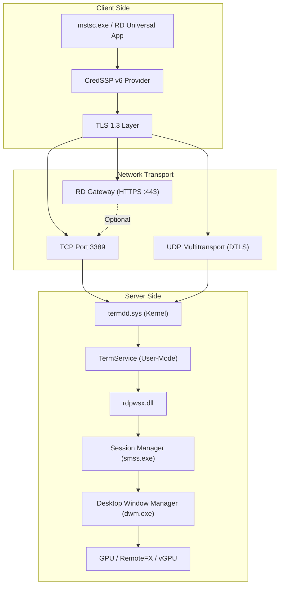
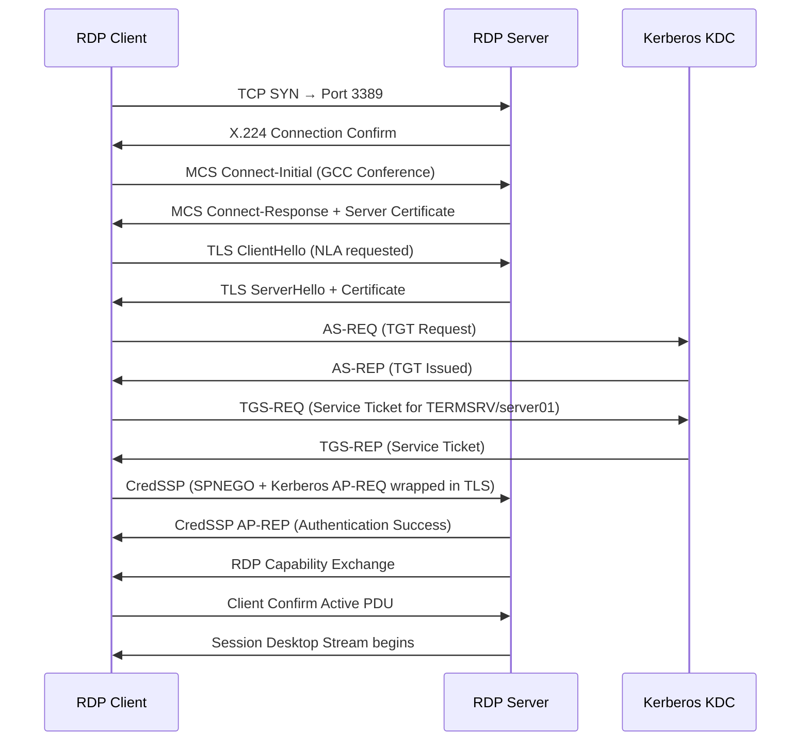

<!-- Last Updated: 2026-04-01 | Version: 1.0.0 -->

# Architecture

[[Home]] › Architecture

This page provides a deep-dive into the RDP protocol stack, component interactions, and kernel-mode driver relationships that the diagnostic tool inspects.

---

## 🏗️ RDP System Architecture



---

## 🔩 Kernel-Mode Components

### termdd.sys — Terminal Server Device Driver

The `termdd.sys` kernel driver is the **central session multiplexer** for all RDP connections. It:

- Arbitrates incoming TCP/UDP connections on port 3389
- Maps network sessions to isolated Windows sessions
- Interfaces with `tdtcp.sys` (TCP transport driver) and `tdudp.sys` (UDP transport)
- Exposes `\Device\TerminalServer` device object consumed by `termsrv.dll`

```powershell
# Verify termdd.sys driver state
Get-WindowsDriver -Online | Where-Object { $_.OriginalFileName -match 'termdd' } |
  Select-Object Driver, Version, Date, ProviderName

# Check driver signing and integrity
Get-AuthenticodeSignature "$env:SystemRoot\System32\drivers\termdd.sys"
```

### tdtcp.sys — RDP TCP Transport Driver

- Implements the TCP transport binding for RDP protocol frames
- Works alongside `tdudp.sys` for UDP multitransport (RDP 8.0+)
- Loaded on-demand when a new RDP connection is established

---

## 🔄 Protocol Stack Layers

| OSI Layer | RDP Component | Key Protocols |
|-----------|---------------|---------------|
| 7 - Application | RDP Shell, RemoteApp, RD Web Access | RDP PDUs, RAIL |
| 6 - Presentation | GDI+, DirectX, Codec Engine | RemoteFX, H.264, ClearCodec |
| 5 - Session | Multi-Channel Service, GCC | MCS (RFC 3749), X.164 |
| 4 - Transport | TPKT, TLS 1.3, DTLS 1.2 | RFC 1006, TLS, UDP |
| 3 - Network | IP Routing, QoS | IPv4/IPv6, DSCP |
| 2 - Data Link | MAC, VLAN | 802.1Q, 802.1p |
| 1 - Physical | NIC, Cabling | Ethernet, Fiber |

---

## 📡 Virtual Channel Architecture

| Channel | Type | Purpose |
|---------|------|---------|
| `RDPDR` | Static | Device/drive/printer/port redirection |
| `CLIPRDR` | Static | Clipboard synchronization |
| `RDPSND` | Static | Audio output redirection |
| `DRDYNVC` | Dynamic | Plugin framework for dynamic virtual channels |
| `EGFX` | Dynamic | Enhanced graphics (progressive rendering, H.264) |
| `RAIL` | Dynamic | RemoteApp Integrated Locally |
| `RDPGFX` | Dynamic | GPU-accelerated frame delivery |

---

## 🔐 Authentication Flow



---

**Next:** [[Troubleshooting]] →
