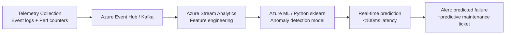
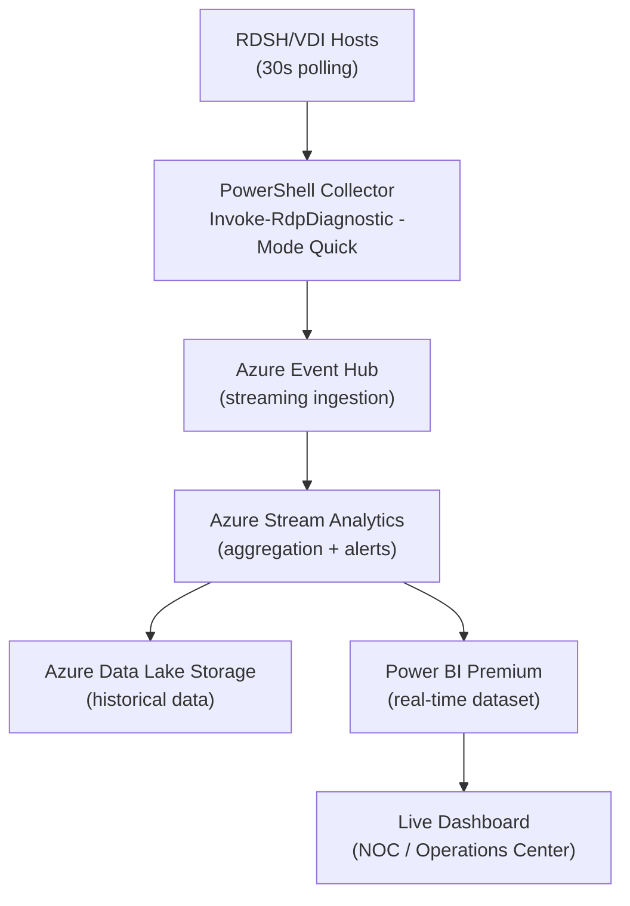

<!-- Last Updated: 2026-04-01 | Version: 1.0.0 -->

# Enhancement Roadmap

[[Home]] › Enhancement Roadmap

This page outlines strategic enhancement recommendations: ML-based predictive analytics, ITSM integration, and Power BI real-time dashboards.

---

## 🤖 Machine Learning for Predictive Failure Analysis

Move from reactive troubleshooting to predictive operations by training models on RDP telemetry.

```powershell
# Collect training data — serialize RDP performance counters to CSV
$counters = @(
  "\Terminal Services\Active Sessions",
  "\Terminal Services\Total Sessions",
  "\Processor(_Total)\% Processor Time",
  "\Memory\Available MBytes",
  "\Network Interface(*)\Bytes Total/sec"
)

Get-Counter -Counter $counters -SampleInterval 60 -MaxSamples 1440 |
  Export-Counter -Path "C:\MLData\rdp-telemetry-$(Get-Date -f yyyyMMdd).blg" -FileFormat BLG
```

**Recommended ML pipeline:**



**Suggested models:**
- **Isolation Forest** — anomaly detection on session metrics
- **LSTM Time Series** — predict session capacity exhaustion 30+ minutes ahead
- **Random Forest Classifier** — classify failure type from symptom features

---

## 🎫 ServiceNow / ITSM Integration

```powershell
# Auto-create ServiceNow incident when diagnostic finds critical issues
function New-ITSMIncident {
  param(
    [string]$Target,
    [string]$IssueDescription,
    [string]$Severity = "2-High",
    [string]$ServiceNowInstance = "[REDACTED].service-now.com",
    [string]$ApiUser = "[REDACTED]",
    [string]$ApiPassword = "[REDACTED]"
  )

  $body = @{
    short_description = "RDP Diagnostic Alert: $Target"
    description = $IssueDescription
    urgency = "2"
    impact = "2"
    category = "Software"
    subcategory = "Remote Desktop Services"
    assignment_group = "Windows Infrastructure"
  } | ConvertTo-Json

  $headers = @{ Authorization = "Basic " + [Convert]::ToBase64String([Text.Encoding]::ASCII.GetBytes("${ApiUser}:${ApiPassword}")) }

  Invoke-RestMethod -Uri "https://${ServiceNowInstance}/api/now/table/incident" `
    -Method POST -Body $body -ContentType "application/json" -Headers $headers
}

# Hook into diagnostic output
$diagResult = Invoke-RdpDiagnostic -Target "rdsh01" -Mode Full -OutputFormat JSON | ConvertFrom-Json
if ($diagResult.overallStatus -eq "Critical") {
  New-ITSMIncident -Target "rdsh01" -IssueDescription ($diagResult.checks | Where-Object { $_.status -eq "Fail" } | ConvertTo-Json)
}
```

---

## 📊 Power BI Real-Time RDP Dashboard

### Data Pipeline Architecture



### Key Dashboard Panels

| Panel | Metric | Alert Threshold |
|-------|--------|-----------------|
| Session Count | Active/Total sessions per host | >90% capacity |
| Input Latency | Avg ms per session | >150ms |
| CPU Utilization | % per host | >85% |
| Memory Pressure | Available MB | <512MB |
| Auth Failures | Count per 5 min | >10 |
| GPU VRAM | % utilized | >90% |

---

## 🗓️ Implementation Roadmap

| Phase | Timeline | Deliverables |
|-------|----------|--------------|
| **Phase 1** | Month 1-2 | Power BI dashboard, ITSM webhook integration |
| **Phase 2** | Month 3-4 | ML anomaly detection model training |
| **Phase 3** | Month 5-6 | Predictive alerting, automated remediation |

---

**Next:** [[Contributing]] →
