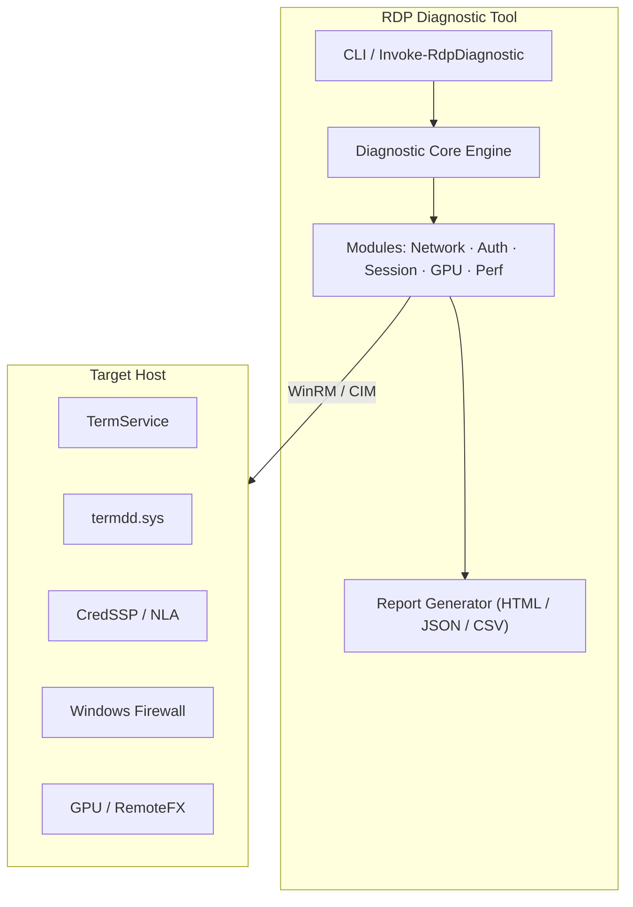

<!-- Last Updated: 2026-04-01 | Version: 1.0.0 -->
<!-- Schema.org: SoftwareApplication, TechArticle -->

# RDP Diagnostic Tool


> **Enterprise-grade PowerShell toolkit for diagnosing, monitoring, and optimizing Remote Desktop Protocol (RDP) infrastructure at scale.**

The **RDP Diagnostic Tool** provides Senior Systems Administrators, Enterprise Architects, and Principal Support Engineers with a systematic, multi-layered approach to RDP health checks — covering everything from kernel-mode driver validation to CredSSP authentication forensics, GPU session diagnostics, and predictive failure analytics.

---

## 🚀 Quick Start

```powershell
# Run a full diagnostic against a remote host
Invoke-RdpDiagnostic -Target "server01.corp.local" -Verbose

# Quick health check (local)
Invoke-RdpDiagnostic -Target localhost -Mode Quick

# Enterprise scan with HTML report output
Invoke-RdpDiagnostic -Target "rdsh-farm01" -Mode Full -OutputFormat HTML -ReportPath C:\Reports\
```

> [!NOTE]
> Requires PowerShell 7.0+ and must be run as Administrator. See [[Installation]] for prerequisites.

---

## 📐 Architecture Overview



---

## 🗺️ Documentation Roadmap

| Page | Description |
|------|-------------|
| [[Installation]] | Prerequisites, deployment methods, offline install |
| [[Configuration]] | Parameters, profiles, enterprise GPO integration |
| [[Usage]] | Diagnostic modes, examples, output formats |
| [[Architecture]] | RDP protocol stack, component interaction diagrams |
| [[Troubleshooting]] | Common issues, root causes, step-by-step fixes |
| [[Advanced-Diagnostics]] | WPR, WinDbg, Wireshark, kernel debugging |
| [[Security]] | JIT access, WDAC, NLA, CredSSP hardening |
| [[Performance]] | GPU, SMB Direct, QoS, QUIC transport tuning |
| [[Enhancement-Roadmap]] | ML analytics, ITSM integration, Power BI dashboard |
| [[Contributing]] | PR guidelines, code standards, test requirements |
| [[Changelog]] | Release history and breaking changes |

---

## ⚡ Feature Highlights

- ✅ **Multi-layer diagnostics** — network, protocol, auth, session, GPU, and licensing layers
- ✅ **PowerShell 7+ native** — cross-platform CIM/WMI abstraction
- ✅ **Non-intrusive** — read-only by default; remediation requires explicit `-Remediate` flag
- ✅ **Enterprise-ready** — WinRM, CredSSP, and Kerberos transport support
- ✅ **Structured output** — JSON, HTML, CSV report formats for SIEM/ITSM integration
- ✅ **Extensible modules** — plug-in architecture for custom diagnostic checks

---

## 🛡️ Security & Compliance

> [!WARNING]
> This tool requires elevated privileges. Always follow your organization's change management process before running diagnostics in production environments.

See the [[Security]] page and [`SECURITY.md`](../SECURITY.md) for responsible disclosure guidelines.

---

*Maintained by [Mikhail Deynekin](https://deynekin.com) · [mid1977@gmail.com](mailto:mid1977@gmail.com)*
